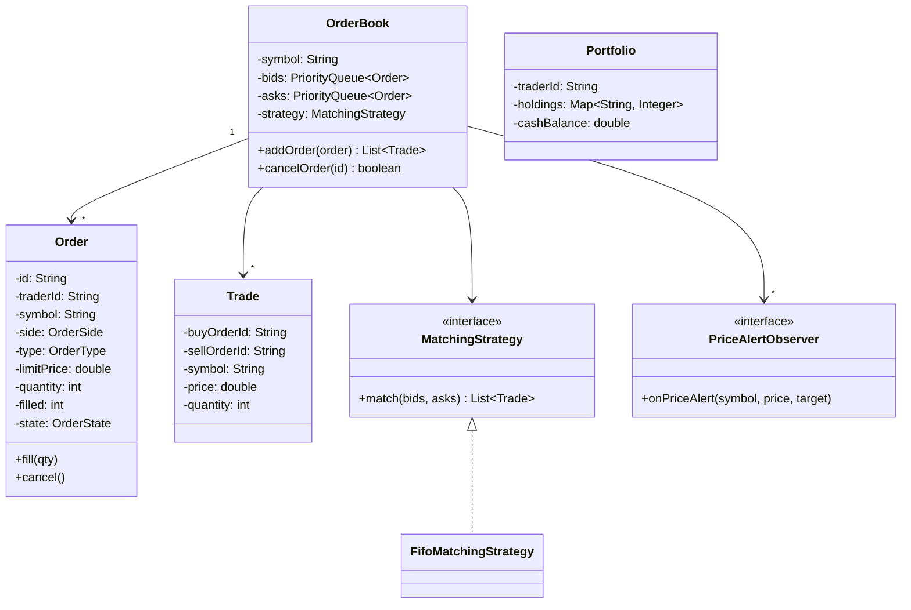
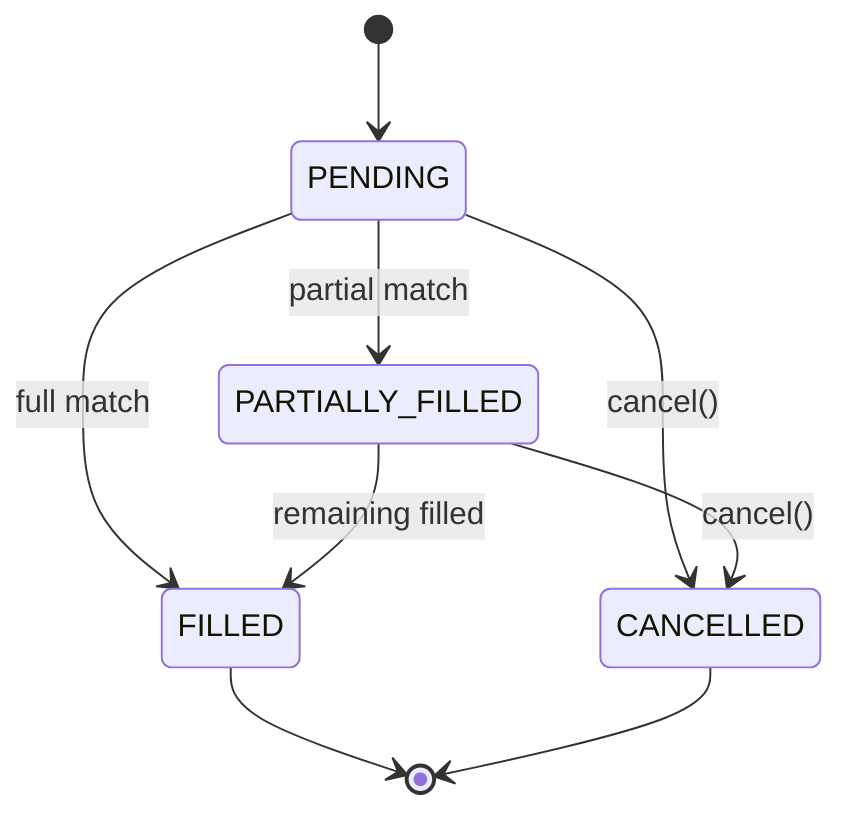

#system-design #lld #example #java #financial #coordination #observer #command #strategy #state

# LLD: Stock Trading System (Java)

**Problem Type:** Financial + Coordination
**Difficulty:** Hard
**Asked at:** Zerodha, Groww, Goldman Sachs, Morgan Stanley, NASDAQ

---

## Requirements Clarification

| # | Question | Answer |
|---|----------|--------|
| 1 | What order types do we support? | MARKET (execute now at best price), LIMIT (execute at target price or better), STOP_LOSS |
| 2 | What is the order matching strategy? | FIFO (price-time priority) by default; Pro-rata as alternative strategy |
| 3 | Should we prevent self-trading (same trader on both sides)? | Yes — self-trade prevention rule required |
| 4 | What is a circuit breaker and when does it trigger? | Halt trading if price moves >10% in either direction from day open |
| 5 | Should order cancellation be auditable? | Yes — Command pattern for full audit trail of placements and cancellations |
| 6 | Do we need a watchlist with price alerts? | Yes — Observer pattern; alert fires when price crosses user-defined threshold |

---

## Problem Type + Key Patterns

- **Financial Coordination** — atomic order matching; no partial state on failure
- **Observer** — PriceAlert notified when market price crosses alert threshold
- **Command** — `OrderCommand` for placement/cancellation; enables undo + audit log
- **Strategy** — `MatchingStrategy` interface (FIFO vs Pro-rata order matching)
- **State** — Order states: PENDING → PARTIALLY_FILLED → FILLED → CANCELLED
- **Synchronized OrderBook** — matching must be atomic to prevent race conditions on bids/asks

---

## Class Diagram (ASCII)

```
+---------------------+      +----------------------+      +-------------------+
|      Order          |      |     OrderBook        |      |  MatchingStrategy |
|---------------------|      |----------------------|      |-------------------|
| -id: String         |      | -symbol: String      |      | <<interface>>     |
| -symbol: String     |      | -bids: PriorityQueue |      | +match(book): List|
| -side: BUY/SELL     |      | -asks: PriorityQueue |      +-------------------+
| -type: MARKET/LIMIT |      | -strategy: Strategy  |              ^
| -price: double      |      | +addOrder(order)     |     +--------+--------+
| -quantity: int      |      | +cancelOrder(id)     |     |FifoMatchingStrat|
| -filled: int        |      | +match(): List<Trade>|     |ProRataStrat     |
| -state: OrderState  |      +----------------------+     +-----------------+
+---------------------+
        |
        v
+---------------------+      +----------------------+
|  OrderState (enum)  |      |       Trade          |
|---------------------|      |----------------------|
| PENDING             |      | -id: String          |
| PARTIALLY_FILLED    |      | -buyOrderId: String  |
| FILLED              |      | -sellOrderId: String |
| CANCELLED           |      | -symbol: String      |
+---------------------+      | -price: double       |
                             | -quantity: int       |
+---------------------+      +----------------------+
|   Portfolio         |
|---------------------|      +----------------------+
| -holdings: Map      |      |   PriceAlert         |
| +updateHolding()    |      |----------------------|
+---------------------+      | -symbol: String      |
                             | -targetPrice: double |
+---------------------+      | -observer: AlertObs  |
|  OrderCommand       |      +----------------------+
|---------------------|
| <<interface>>       |
| +execute()          |
| +undo()             |
+---------------------+
```

### Mermaid Diagrams





---

## Core Interfaces

```java
public interface MatchingStrategy {
    List<Trade> match(PriorityQueue<Order> bids, PriorityQueue<Order> asks);
}

public interface PriceAlertObserver {
    void onPriceAlert(String symbol, double triggeredPrice, double alertPrice);
}

public interface OrderCommand {
    void execute();
    void undo();
    String getDescription();
}
```

---

## Complete Java Implementation

```java
import java.util.*;
import java.util.concurrent.*;
import java.util.concurrent.atomic.*;
import java.time.*;

// === Enums ===
enum OrderSide { BUY, SELL }
enum OrderType { MARKET, LIMIT, STOP_LOSS }
enum OrderState { PENDING, PARTIALLY_FILLED, FILLED, CANCELLED }

// === Order ===
class Order {
    private final String id;
    private final String traderId;
    private final String symbol;
    private final OrderSide side;
    private final OrderType type;
    private final double limitPrice;   // 0 for MARKET
    private final int quantity;
    private int filled = 0;
    private volatile OrderState state = OrderState.PENDING;
    private final Instant createdAt = Instant.now();

    public Order(String traderId, String symbol, OrderSide side, OrderType type,
                 double limitPrice, int quantity) {
        this.id = UUID.randomUUID().toString().substring(0, 8);
        this.traderId = traderId; this.symbol = symbol;
        this.side = side; this.type = type;
        this.limitPrice = limitPrice; this.quantity = quantity;
    }

    public synchronized int getRemainingQty() { return quantity - filled; }

    public synchronized void fill(int qty) {
        filled += qty;
        if (filled >= quantity) state = OrderState.FILLED;
        else state = OrderState.PARTIALLY_FILLED;
    }

    public synchronized void cancel() {
        if (state == OrderState.FILLED) throw new IllegalStateException("Cannot cancel FILLED order");
        state = OrderState.CANCELLED;
    }

    public String getId() { return id; }
    public String getTraderId() { return traderId; }
    public String getSymbol() { return symbol; }
    public OrderSide getSide() { return side; }
    public OrderType getType() { return type; }
    public double getLimitPrice() { return limitPrice; }
    public int getQuantity() { return quantity; }
    public int getFilled() { return filled; }
    public OrderState getState() { return state; }
    public Instant getCreatedAt() { return createdAt; }
}

// === Trade ===
class Trade {
    private final String id = UUID.randomUUID().toString().substring(0, 8);
    private final String buyOrderId;
    private final String sellOrderId;
    private final String symbol;
    private final double price;
    private final int quantity;
    private final Instant executedAt = Instant.now();

    public Trade(String buyOrderId, String sellOrderId, String symbol, double price, int qty) {
        this.buyOrderId = buyOrderId; this.sellOrderId = sellOrderId;
        this.symbol = symbol; this.price = price; this.quantity = qty;
    }
    public double getPrice() { return price; }
    public int getQuantity() { return quantity; }
    public String toString() {
        return String.format("TRADE[%s] %s: %d @ %.2f (B:%s S:%s)", id, symbol, quantity, price, buyOrderId, sellOrderId);
    }
}

// === FIFO Matching Strategy ===
class FifoMatchingStrategy implements MatchingStrategy {
    public List<Trade> match(PriorityQueue<Order> bids, PriorityQueue<Order> asks) {
        List<Trade> trades = new ArrayList<>();

        while (!bids.isEmpty() && !asks.isEmpty()) {
            Order bid = bids.peek();
            Order ask = asks.peek();

            // Self-trade prevention
            if (bid.getTraderId().equals(ask.getTraderId())) {
                System.out.println("[SELF-TRADE PREVENTION] Skipping order from trader: " + bid.getTraderId());
                break;
            }

            boolean priceMatches = (bid.getType() == OrderType.MARKET)
                || (ask.getType() == OrderType.MARKET)
                || (bid.getLimitPrice() >= ask.getLimitPrice());

            if (!priceMatches) break;

            double tradePrice = ask.getType() == OrderType.MARKET
                ? bid.getLimitPrice() : ask.getLimitPrice();
            int tradeQty = Math.min(bid.getRemainingQty(), ask.getRemainingQty());

            bid.fill(tradeQty);
            ask.fill(tradeQty);
            trades.add(new Trade(bid.getId(), ask.getId(), bid.getSymbol(), tradePrice, tradeQty));

            if (bid.getState() == OrderState.FILLED) bids.poll();
            if (ask.getState() == OrderState.FILLED) asks.poll();
        }
        return trades;
    }
}

// === Circuit Breaker ===
class CircuitBreaker {
    private final double dayOpenPrice;
    private final double threshold = 0.10; // 10%
    private volatile boolean halted = false;

    public CircuitBreaker(double dayOpenPrice) { this.dayOpenPrice = dayOpenPrice; }

    public boolean checkAndHalt(double currentPrice) {
        double change = Math.abs(currentPrice - dayOpenPrice) / dayOpenPrice;
        if (change >= threshold) {
            halted = true;
            System.out.printf("[CIRCUIT BREAKER] Trading HALTED. Price moved %.1f%% from open %.2f%n",
                change * 100, dayOpenPrice);
        }
        return halted;
    }
    public boolean isHalted() { return halted; }
    public void reset() { halted = false; }
}

// === OrderBook — synchronized for atomic matching ===
class OrderBook {
    private final String symbol;
    // Bids: highest price first (max-heap)
    private final PriorityQueue<Order> bids = new PriorityQueue<>(
        Comparator.comparingDouble(Order::getLimitPrice).reversed()
            .thenComparing(Order::getCreatedAt));
    // Asks: lowest price first (min-heap)
    private final PriorityQueue<Order> asks = new PriorityQueue<>(
        Comparator.comparingDouble(Order::getLimitPrice)
            .thenComparing(Order::getCreatedAt));
    private final Map<String, Order> orderIndex = new ConcurrentHashMap<>();
    private final MatchingStrategy strategy;
    private final CircuitBreaker circuitBreaker;
    private volatile double lastTradePrice;

    public OrderBook(String symbol, double dayOpenPrice, MatchingStrategy strategy) {
        this.symbol = symbol;
        this.lastTradePrice = dayOpenPrice;
        this.circuitBreaker = new CircuitBreaker(dayOpenPrice);
        this.strategy = strategy;
    }

    public synchronized List<Trade> addOrder(Order order) {
        if (circuitBreaker.isHalted())
            throw new IllegalStateException("Trading halted for " + symbol + " — circuit breaker triggered");
        if (order.getType() == OrderType.STOP_LOSS && order.getLimitPrice() >= lastTradePrice)
            throw new IllegalArgumentException("Stop-loss price must be below current price");

        orderIndex.put(order.getId(), order);
        if (order.getSide() == OrderSide.BUY) bids.add(order);
        else asks.add(order);

        List<Trade> trades = strategy.match(bids, asks);

        trades.forEach(t -> {
            lastTradePrice = t.getPrice();
            circuitBreaker.checkAndHalt(t.getPrice());
            notifyPriceObservers(t.getPrice());
        });
        return trades;
    }

    public synchronized boolean cancelOrder(String orderId) {
        Order order = orderIndex.get(orderId);
        if (order == null) return false;
        order.cancel();
        bids.remove(order);
        asks.remove(order);
        System.out.println("[CANCELLED] Order " + orderId);
        return true;
    }

    private final List<PriceAlertObserver> priceObservers = new CopyOnWriteArrayList<>();
    private final Map<String, Double> alertThresholds = new ConcurrentHashMap<>();

    public void addPriceAlert(String alertId, double targetPrice, PriceAlertObserver observer) {
        alertThresholds.put(alertId, targetPrice);
        priceObservers.add(observer);
    }

    private void notifyPriceObservers(double price) {
        alertThresholds.forEach((id, target) -> {
            if (Math.abs(price - target) / target <= 0.001) { // within 0.1%
                priceObservers.forEach(obs -> obs.onPriceAlert(symbol, price, target));
            }
        });
    }

    public double getLastTradePrice() { return lastTradePrice; }
}

// === Order Commands (Command Pattern) ===
class PlaceOrderCommand implements OrderCommand {
    private final OrderBook book;
    private final Order order;
    private List<Trade> resultTrades;

    public PlaceOrderCommand(OrderBook book, Order order) {
        this.book = book; this.order = order;
    }
    public void execute() { resultTrades = book.addOrder(order); resultTrades.forEach(System.out::println); }
    public void undo() { book.cancelOrder(order.getId()); }
    public String getDescription() { return "PLACE " + order.getSide() + " " + order.getQuantity() + "@" + order.getLimitPrice(); }
    public List<Trade> getResultTrades() { return resultTrades; }
}

class CancelOrderCommand implements OrderCommand {
    private final OrderBook book;
    private final String orderId;
    public CancelOrderCommand(OrderBook book, String orderId) { this.book = book; this.orderId = orderId; }
    public void execute() { book.cancelOrder(orderId); }
    public void undo() { System.out.println("[AUDIT] Undo cancel not supported — order cannot be reinstated"); }
    public String getDescription() { return "CANCEL order " + orderId; }
}

// === Audit Log ===
class OrderAuditLog {
    private final List<String> log = new CopyOnWriteArrayList<>();
    public void record(OrderCommand cmd) {
        String entry = Instant.now() + " | " + cmd.getDescription();
        log.add(entry);
        System.out.println("[AUDIT] " + entry);
    }
    public List<String> getLog() { return Collections.unmodifiableList(log); }
}

// === Portfolio ===
class Portfolio {
    private final String traderId;
    private final Map<String, Integer> holdings = new ConcurrentHashMap<>();
    private double cashBalance;

    public Portfolio(String traderId, double cash) {
        this.traderId = traderId; this.cashBalance = cash;
    }

    public synchronized void updateAfterTrade(Trade trade, OrderSide side, int qty, double price) {
        if (side == OrderSide.BUY) {
            holdings.merge(trade.toString(), qty, Integer::sum); // simplified
            cashBalance -= qty * price;
        } else {
            cashBalance += qty * price;
        }
    }

    public double getCashBalance() { return cashBalance; }
}

// === Demo ===
public class StockTradingDemo {
    public static void main(String[] args) {
        OrderBook niftyBook = new OrderBook("NIFTY", 22000.0, new FifoMatchingStrategy());
        OrderAuditLog auditLog = new OrderAuditLog();

        // Price alert
        niftyBook.addPriceAlert("alert-1", 22050.0,
            (sym, price, target) -> System.out.printf("[ALERT] %s hit %.2f (target: %.2f)%n", sym, price, target));

        // Place orders — BUY side
        Order buy1 = new Order("trader-A", "NIFTY", OrderSide.BUY,  OrderType.LIMIT, 22100.0, 10);
        Order buy2 = new Order("trader-B", "NIFTY", OrderSide.BUY,  OrderType.LIMIT, 22050.0, 5);
        // Place orders — SELL side
        Order sell1 = new Order("trader-C", "NIFTY", OrderSide.SELL, OrderType.LIMIT, 22050.0, 7);
        Order sell2 = new Order("trader-D", "NIFTY", OrderSide.SELL, OrderType.MARKET, 0, 3);

        List<OrderCommand> commands = List.of(
            new PlaceOrderCommand(niftyBook, buy1),
            new PlaceOrderCommand(niftyBook, buy2),
            new PlaceOrderCommand(niftyBook, sell1),
            new PlaceOrderCommand(niftyBook, sell2)
        );

        // Execute with audit
        commands.forEach(cmd -> { cmd.execute(); auditLog.record(cmd); });

        System.out.println("\n--- Audit Log ---");
        auditLog.getLog().forEach(System.out::println);
        System.out.println("Last trade price: " + niftyBook.getLastTradePrice());
    }
}
```

---

## Design Patterns Used

| Pattern | Class | Reason |
|---------|-------|--------|
| **Observer** | `PriceAlertObserver` + `OrderBook.notifyPriceObservers()` | Decouple alert logic from matching; add Slack/push without touching OrderBook |
| **Command** | `PlaceOrderCommand`, `CancelOrderCommand` | Audit trail, undo capability; broker GUI can queue commands |
| **Strategy** | `MatchingStrategy` (FIFO vs Pro-rata) | Exchange-specific matching rules; swap without touching OrderBook |
| **State** | `OrderState` enum in `Order.fill()`/`cancel()` | Guard invalid transitions; FILLED order cannot be cancelled |
| **Circuit Breaker** | `CircuitBreaker.checkAndHalt()` | Halt matching when price volatility exceeds threshold |

---

## Concurrency Handling

**Problem:** Two threads simultaneously place matching orders — both could read the same bid/ask queues and generate duplicate trades.

```java
// CRITICAL: entire match() must be atomic — synchronized on OrderBook
public synchronized List<Trade> addOrder(Order order) {
    // Add to book + run matching in one atomic step
    bids.add(order);
    List<Trade> trades = strategy.match(bids, asks);  // modifies bids/asks in place
    return trades;
    // No other thread can interleave between add and match
}

// Order.fill() is also synchronized — prevents partial fill visibility
public synchronized void fill(int qty) {
    filled += qty;
    state = (filled >= quantity) ? OrderState.FILLED : OrderState.PARTIALLY_FILLED;
}
```

**Concurrent price updates:**
```java
// lastTradePrice uses volatile — cheapest visibility guarantee for reads
private volatile double lastTradePrice;
// Writes happen inside synchronized addOrder() — no data race
```

---

## Error Handling & Edge Cases

```java
// 1. Market order with no matching orders — queue remains, MARKET order stays PENDING
// In real systems: MARKET order is cancelled if not filled immediately (IOC policy)

// 2. Limit order below market price — valid; stays in book until price drops
Order buy = new Order("T1", "RELIANCE", BUY, LIMIT, 2400.0, 100); // market at 2500 — waits

// 3. Circuit breaker — halt trading on >10% move
if (circuitBreaker.isHalted())
    throw new IllegalStateException("Trading halted — circuit breaker triggered");

// 4. Self-trade prevention
if (bid.getTraderId().equals(ask.getTraderId())) {
    System.out.println("[SELF-TRADE PREVENTION] Skipping"); break;
}

// 5. Stop-loss validation
if (order.getLimitPrice() >= lastTradePrice)
    throw new IllegalArgumentException("Stop-loss must be below current price " + lastTradePrice);

// 6. Cancel FILLED order
if (state == OrderState.FILLED)
    throw new IllegalStateException("Cannot cancel a fully filled order");
```

---

## One-Change Test

| Change | Classes Modified |
|--------|-----------------|
| Add Pro-rata matching | 1 new: `ProRataMatchingStrategy implements MatchingStrategy` |
| Add Telegram price alerts | 1 new: `TelegramAlertObserver implements PriceAlertObserver` |
| Add modify-order command | 1 new: `ModifyOrderCommand implements OrderCommand` |
| Add STOP_LOSS_LIMIT order type | 1 change: `OrderType` enum + `FifoMatchingStrategy` price condition |

---

## Follow-up Questions

| Question | Answer Direction |
|----------|-----------------|
| How to handle multiple symbols concurrently? | One `OrderBook` per symbol; global `OrderBookRegistry` (ConcurrentHashMap); each book has its own lock |
| How to persist orders across restarts? | Event sourcing — append each `OrderCommand` to Kafka; replay on startup |
| How to implement portfolio margin calculation? | `RiskService` subscribes to trade events; recalculates margin after each fill |
| How to scale to 1M orders/sec? | Lock-free LMAX Disruptor ring buffer; single-threaded matching per symbol |
| How to prevent front-running in a distributed setup? | Sequence number per order; all nodes process same sequence; deterministic matching |

---

## Links

- [[../patterns/behavioral]] — Observer, Command, Strategy, State pattern details
- [[../lld_machine_coding_template]] — Template this file follows
- [[../lld_concurrency_patterns]] — Synchronized blocks, volatile, lock-free patterns
