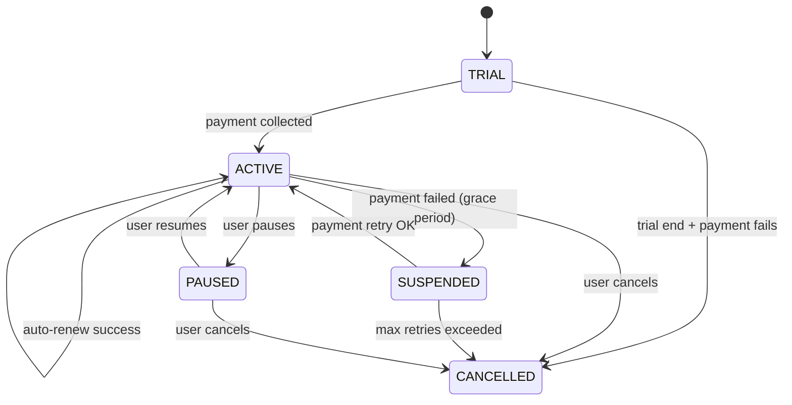
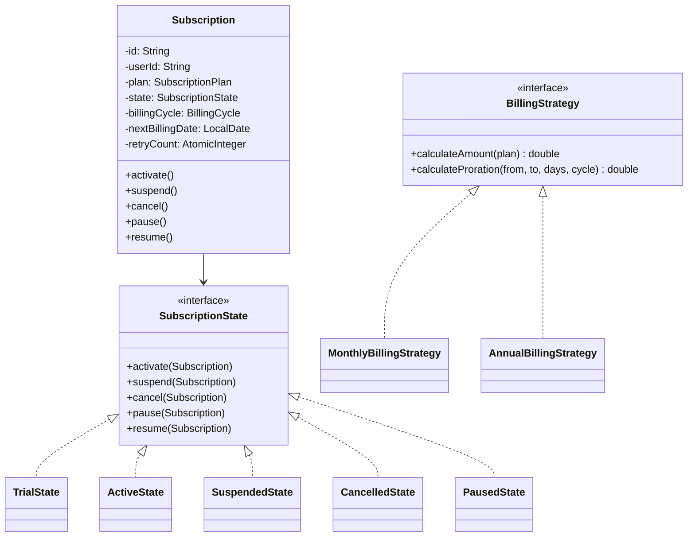

#system-design #lld #state-machine

# LLD: Subscription Service

**Type:** State Machine + Financial
**Difficulty:** Medium
**Asked at:** Netflix, Spotify, Chargebee, Razorpay, Hotstar

---

## Requirements Clarification

1. What plan types are supported? (FREE, BASIC, PREMIUM, ENTERPRISE)
2. What are the billing cycles? (monthly / annual)
3. Is there a trial period before the first charge?
4. Can a user upgrade or downgrade mid-cycle? (yes — prorated)
5. Does the subscription auto-renew at cycle end?
6. Is there a grace period when a payment fails before suspension?

**Scope:** Manage subscription lifecycle — trial, activation, renewal, suspension on payment failure, cancellation, and pause. Support plan upgrades/downgrades with proration.

---

## Problem Type

**State Machine + Financial** — subscription status drives all allowed actions. Key patterns: **State** (lifecycle transitions), **Strategy** (billing calculation), **Observer** (status change notifications).

---

## State Machine Diagram

```
                   [payment collected]
  TRIAL ─────────────────────────────────► ACTIVE ◄──────────────────┐
    │                                        │  │                     │
    │ [trial end,                            │  │ [auto-renew]        │ [payment retry OK]
    │  payment fails]                        │  └─────────────────────┘
    ▼                                        │
 CANCELLED                                   │ [payment failed,
                                             │  enters grace period]
                                             ▼
                                        SUSPENDED
                                         │     │
                            [max retries]│     │[payment retry OK]
                            exceeded     │     │
                                         ▼     ▼
                                      CANCELLED  ACTIVE

ACTIVE ──[user cancels]──► CANCELLED
ACTIVE ──[user pauses]───► PAUSED ──[user resumes]──► ACTIVE
```

### Mermaid State Diagram



---

## Class Diagram

```
Subscription
    ├── id: String
    ├── userId: String
    ├── plan: SubscriptionPlan
    ├── state: SubscriptionState (interface)
    ├── billingCycle: BillingCycle (enum)
    ├── startDate: LocalDate
    ├── nextBillingDate: LocalDate
    ├── trialEndDate: LocalDate
    └── retryCount: AtomicInteger

SubscriptionPlan
    ├── planType: PlanType (enum)
    ├── monthlyPrice: double
    ├── annualPrice: double
    └── features: List<String>

SubscriptionState (interface)
    ├── TrialState
    ├── ActiveState
    ├── SuspendedState
    ├── CancelledState
    └── PausedState

BillingService
    ├── charge(subscription): BillingResult
    └── refund(subscription, amount): void

RetryPolicy
    ├── maxRetries: int
    ├── backoffIntervals: int[]  (days)
    └── shouldRetry(retryCount): boolean

SubscriptionObserver (interface)
    └── EmailNotificationObserver
```

### Mermaid Class Diagram



---

## Core Interfaces & Abstractions

```java
public interface SubscriptionState {
    void activate(Subscription subscription);
    void suspend(Subscription subscription);
    void cancel(Subscription subscription);
    void pause(Subscription subscription);
    void resume(Subscription subscription);
    String getStateName();
}

public interface BillingStrategy {
    double calculateAmount(SubscriptionPlan plan);
    double calculateProration(SubscriptionPlan from, SubscriptionPlan to, int daysRemaining, int cycleDays);
}

public interface SubscriptionObserver {
    void onStatusChanged(Subscription subscription, String oldState, String newState);
}
```

---

## Complete Java Implementation

```java
import java.time.LocalDate;
import java.util.*;
import java.util.concurrent.atomic.AtomicBoolean;
import java.util.concurrent.atomic.AtomicInteger;

// ─── Enums ───────────────────────────────────────────────────────────────────

enum PlanType { FREE, BASIC, PREMIUM, ENTERPRISE }

enum BillingCycle { MONTHLY, ANNUAL }

enum BillingStatus { SUCCESS, FAILED, PENDING }

// ─── Plan ────────────────────────────────────────────────────────────────────

class SubscriptionPlan {
    private final PlanType planType;
    private final double monthlyPrice;
    private final double annualPrice;
    private final List<String> features;

    public SubscriptionPlan(PlanType planType, double monthlyPrice, double annualPrice, List<String> features) {
        this.planType = planType;
        this.monthlyPrice = monthlyPrice;
        this.annualPrice = annualPrice;
        this.features = Collections.unmodifiableList(features);
    }

    public PlanType getPlanType()    { return planType; }
    public double getMonthlyPrice()  { return monthlyPrice; }
    public double getAnnualPrice()   { return annualPrice; }
    public List<String> getFeatures(){ return features; }
}

// ─── Billing Result ───────────────────────────────────────────────────────────

class BillingResult {
    private final BillingStatus status;
    private final String transactionId;
    private final String failureReason;

    private BillingResult(BillingStatus status, String transactionId, String failureReason) {
        this.status = status;
        this.transactionId = transactionId;
        this.failureReason = failureReason;
    }

    public static BillingResult success(String txnId) {
        return new BillingResult(BillingStatus.SUCCESS, txnId, null);
    }
    public static BillingResult failure(String reason) {
        return new BillingResult(BillingStatus.FAILED, null, reason);
    }

    public boolean isSuccess()          { return status == BillingStatus.SUCCESS; }
    public String getTransactionId()    { return transactionId; }
    public String getFailureReason()    { return failureReason; }
}

// ─── Retry Policy ─────────────────────────────────────────────────────────────

class RetryPolicy {
    private final int maxRetries;
    private final int[] backoffDays;  // [3, 5, 7] — retry after 3, 5, 7 days

    public RetryPolicy(int maxRetries, int[] backoffDays) {
        this.maxRetries = maxRetries;
        this.backoffDays = backoffDays;
    }

    public boolean shouldRetry(int retryCount) { return retryCount < maxRetries; }
    public int getDaysUntilNextRetry(int retryCount) {
        if (retryCount >= backoffDays.length) return backoffDays[backoffDays.length - 1];
        return backoffDays[retryCount];
    }
    public int getMaxRetries() { return maxRetries; }
}

// ─── Billing Strategy (Strategy Pattern) ─────────────────────────────────────

interface BillingStrategy {
    double calculateAmount(SubscriptionPlan plan);
    double calculateProration(SubscriptionPlan from, SubscriptionPlan to, int daysRemaining, int cycleDays);
}

class MonthlyBillingStrategy implements BillingStrategy {
    @Override
    public double calculateAmount(SubscriptionPlan plan) {
        return plan.getMonthlyPrice();
    }
    @Override
    public double calculateProration(SubscriptionPlan from, SubscriptionPlan to, int daysRemaining, int cycleDays) {
        double dailyRateFrom = from.getMonthlyPrice() / cycleDays;
        double dailyRateTo   = to.getMonthlyPrice()   / cycleDays;
        double refund    = dailyRateFrom * daysRemaining;
        double newCharge = dailyRateTo   * daysRemaining;
        return newCharge - refund;  // positive = charge more, negative = credit
    }
}

class AnnualBillingStrategy implements BillingStrategy {
    @Override
    public double calculateAmount(SubscriptionPlan plan) {
        return plan.getAnnualPrice();  // typically ~10 months price
    }
    @Override
    public double calculateProration(SubscriptionPlan from, SubscriptionPlan to, int daysRemaining, int cycleDays) {
        double dailyRateFrom = from.getAnnualPrice() / cycleDays;
        double dailyRateTo   = to.getAnnualPrice()   / cycleDays;
        double refund    = dailyRateFrom * daysRemaining;
        double newCharge = dailyRateTo   * daysRemaining;
        return newCharge - refund;
    }
}

// ─── Subscription State Interface ─────────────────────────────────────────────

interface SubscriptionState {
    void activate(Subscription subscription);
    void suspend(Subscription subscription);
    void cancel(Subscription subscription);
    void pause(Subscription subscription);
    void resume(Subscription subscription);
    String getStateName();
}

// ─── Concrete States ─────────────────────────────────────────────────────────

class TrialState implements SubscriptionState {
    @Override
    public void activate(Subscription s) {
        System.out.println("[" + s.getId() + "] Trial → Active (payment collected)");
        s.setState(new ActiveState());
        s.notifyObservers("TRIAL", "ACTIVE");
    }
    @Override
    public void suspend(Subscription s)  { throw new IllegalStateException("Cannot suspend a trial"); }
    @Override
    public void cancel(Subscription s) {
        System.out.println("[" + s.getId() + "] Trial cancelled");
        s.setState(new CancelledState());
        s.notifyObservers("TRIAL", "CANCELLED");
    }
    @Override
    public void pause(Subscription s)   { throw new IllegalStateException("Cannot pause a trial"); }
    @Override
    public void resume(Subscription s)  { throw new IllegalStateException("Trial is not paused"); }
    @Override
    public String getStateName()         { return "TRIAL"; }
}

class ActiveState implements SubscriptionState {
    @Override
    public void activate(Subscription s) { System.out.println("[" + s.getId() + "] Already active"); }
    @Override
    public void suspend(Subscription s) {
        System.out.println("[" + s.getId() + "] Active → Suspended (payment failure, grace period started)");
        s.setState(new SuspendedState());
        s.notifyObservers("ACTIVE", "SUSPENDED");
    }
    @Override
    public void cancel(Subscription s) {
        System.out.println("[" + s.getId() + "] Active → Cancelled");
        s.setState(new CancelledState());
        s.notifyObservers("ACTIVE", "CANCELLED");
    }
    @Override
    public void pause(Subscription s) {
        System.out.println("[" + s.getId() + "] Active → Paused");
        s.setState(new PausedState());
        s.notifyObservers("ACTIVE", "PAUSED");
    }
    @Override
    public void resume(Subscription s)  { System.out.println("[" + s.getId() + "] Already active"); }
    @Override
    public String getStateName()         { return "ACTIVE"; }
}

class SuspendedState implements SubscriptionState {
    @Override
    public void activate(Subscription s) {
        System.out.println("[" + s.getId() + "] Suspended → Active (payment retry succeeded)");
        s.getRetryCount().set(0);
        s.setState(new ActiveState());
        s.notifyObservers("SUSPENDED", "ACTIVE");
    }
    @Override
    public void suspend(Subscription s) { System.out.println("[" + s.getId() + "] Already suspended"); }
    @Override
    public void cancel(Subscription s) {
        System.out.println("[" + s.getId() + "] Suspended → Cancelled (max retries exceeded)");
        s.setState(new CancelledState());
        s.notifyObservers("SUSPENDED", "CANCELLED");
    }
    @Override
    public void pause(Subscription s)   { throw new IllegalStateException("Cannot pause a suspended subscription"); }
    @Override
    public void resume(Subscription s)  { throw new IllegalStateException("Subscription is suspended, not paused"); }
    @Override
    public String getStateName()         { return "SUSPENDED"; }
}

class CancelledState implements SubscriptionState {
    @Override
    public void activate(Subscription s) { throw new IllegalStateException("Cannot activate a cancelled subscription; create new"); }
    @Override
    public void suspend(Subscription s)  { throw new IllegalStateException("Subscription is cancelled"); }
    @Override
    public void cancel(Subscription s)   { System.out.println("[" + s.getId() + "] Already cancelled"); }
    @Override
    public void pause(Subscription s)    { throw new IllegalStateException("Subscription is cancelled"); }
    @Override
    public void resume(Subscription s)   { throw new IllegalStateException("Cannot resume a cancelled subscription"); }
    @Override
    public String getStateName()          { return "CANCELLED"; }
}

class PausedState implements SubscriptionState {
    @Override
    public void activate(Subscription s) { throw new IllegalStateException("Resume the subscription first"); }
    @Override
    public void suspend(Subscription s)  { throw new IllegalStateException("Cannot suspend a paused subscription"); }
    @Override
    public void cancel(Subscription s) {
        System.out.println("[" + s.getId() + "] Paused → Cancelled");
        s.setState(new CancelledState());
        s.notifyObservers("PAUSED", "CANCELLED");
    }
    @Override
    public void resume(Subscription s) {
        System.out.println("[" + s.getId() + "] Paused → Active");
        s.setState(new ActiveState());
        s.notifyObservers("PAUSED", "ACTIVE");
    }
    @Override
    public void pause(Subscription s)   { System.out.println("[" + s.getId() + "] Already paused"); }
    @Override
    public String getStateName()         { return "PAUSED"; }
}

// ─── Observer ─────────────────────────────────────────────────────────────────

interface SubscriptionObserver {
    void onStatusChanged(Subscription subscription, String oldState, String newState);
}

class EmailNotificationObserver implements SubscriptionObserver {
    @Override
    public void onStatusChanged(Subscription sub, String oldState, String newState) {
        System.out.printf("  [EMAIL] User %s: subscription %s → %s%n",
            sub.getUserId(), oldState, newState);
    }
}

// ─── Subscription (Context) ───────────────────────────────────────────────────

class Subscription {
    private final String id;
    private final String userId;
    private SubscriptionPlan plan;
    private SubscriptionState state;
    private final BillingCycle billingCycle;
    private LocalDate nextBillingDate;
    private final AtomicBoolean retryInProgress = new AtomicBoolean(false);
    private final AtomicInteger retryCount = new AtomicInteger(0);
    private final List<SubscriptionObserver> observers = new ArrayList<>();

    public Subscription(String id, String userId, SubscriptionPlan plan,
                        BillingCycle cycle, boolean hasTrial) {
        this.id = id;
        this.userId = userId;
        this.plan = plan;
        this.billingCycle = cycle;
        this.state = hasTrial ? new TrialState() : new ActiveState();
        this.nextBillingDate = cycle == BillingCycle.MONTHLY
            ? LocalDate.now().plusMonths(1)
            : LocalDate.now().plusYears(1);
    }

    public void addObserver(SubscriptionObserver observer) { observers.add(observer); }

    public void notifyObservers(String oldState, String newState) {
        observers.forEach(o -> o.onStatusChanged(this, oldState, newState));
    }

    // Delegate to state
    public void activate()  { state.activate(this); }
    public void suspend()   { state.suspend(this); }
    public void cancel()    { state.cancel(this); }
    public void pause()     { state.pause(this); }
    public void resume()    { state.resume(this); }

    // State setter (called by state objects)
    public void setState(SubscriptionState state) { this.state = state; }

    // Getters
    public String getId()                      { return id; }
    public String getUserId()                  { return userId; }
    public SubscriptionPlan getPlan()          { return plan; }
    public void setPlan(SubscriptionPlan plan) { this.plan = plan; }
    public String getStatus()                  { return state.getStateName(); }
    public BillingCycle getBillingCycle()      { return billingCycle; }
    public LocalDate getNextBillingDate()      { return nextBillingDate; }
    public void setNextBillingDate(LocalDate d){ this.nextBillingDate = d; }
    public AtomicBoolean getRetryInProgress()  { return retryInProgress; }
    public AtomicInteger getRetryCount()       { return retryCount; }
}

// ─── Billing Service ──────────────────────────────────────────────────────────

class BillingService {
    private final RetryPolicy retryPolicy;

    public BillingService(RetryPolicy retryPolicy) {
        this.retryPolicy = retryPolicy;
    }

    public BillingResult charge(Subscription subscription, double amount) {
        // Simulate payment gateway call
        System.out.printf("  [BILLING] Charging ₹%.2f for subscription %s%n", amount, subscription.getId());
        // Simulate 80% success rate for demo
        boolean success = Math.random() > 0.2;
        if (success) {
            return BillingResult.success("TXN_" + UUID.randomUUID().toString().substring(0, 8).toUpperCase());
        }
        return BillingResult.failure("Card declined");
    }

    // Concurrency: only one retry thread runs per subscription at a time
    public void attemptRetry(Subscription subscription, BillingStrategy strategy) {
        if (!retryPolicy.shouldRetry(subscription.getRetryCount().get())) {
            System.out.println("  [BILLING] Max retries reached — cancelling subscription " + subscription.getId());
            subscription.cancel();
            return;
        }

        // AtomicBoolean CAS ensures only one thread proceeds
        if (!subscription.getRetryInProgress().compareAndSet(false, true)) {
            System.out.println("  [BILLING] Retry already in progress for " + subscription.getId());
            return;
        }

        try {
            int attempt = subscription.getRetryCount().incrementAndGet();
            System.out.printf("  [BILLING] Retry attempt %d for subscription %s%n", attempt, subscription.getId());
            double amount = strategy.calculateAmount(subscription.getPlan());
            BillingResult result = charge(subscription, amount);

            if (result.isSuccess()) {
                subscription.activate();
            } else if (!retryPolicy.shouldRetry(attempt)) {
                subscription.cancel();
            } else {
                System.out.printf("  [BILLING] Will retry in %d days%n",
                    retryPolicy.getDaysUntilNextRetry(attempt));
            }
        } finally {
            subscription.getRetryInProgress().set(false);
        }
    }

    public void refund(Subscription subscription, double amount) {
        System.out.printf("  [BILLING] Refunding ₹%.2f to user %s%n", amount, subscription.getUserId());
    }
}

// ─── Subscription Service (Facade) ────────────────────────────────────────────

class SubscriptionService {
    private final Map<String, Subscription> subscriptions = new HashMap<>();
    private final BillingService billingService;

    public SubscriptionService(BillingService billingService) {
        this.billingService = billingService;
    }

    public Subscription create(String userId, SubscriptionPlan plan,
                                BillingCycle cycle, boolean hasTrial) {
        String id = "SUB_" + userId + "_" + System.currentTimeMillis();
        Subscription sub = new Subscription(id, userId, plan, cycle, hasTrial);
        sub.addObserver(new EmailNotificationObserver());
        subscriptions.put(id, sub);
        System.out.println("Created subscription " + id + " [" + sub.getStatus() + "]");
        return sub;
    }

    public void upgradePlan(Subscription sub, SubscriptionPlan newPlan,
                             BillingStrategy strategy, int daysRemaining, int cycleDays) {
        SubscriptionPlan oldPlan = sub.getPlan();
        double delta = strategy.calculateProration(oldPlan, newPlan, daysRemaining, cycleDays);
        System.out.printf("Upgrading plan %s → %s. Proration charge: ₹%.2f%n",
            oldPlan.getPlanType(), newPlan.getPlanType(), delta);
        if (delta > 0) billingService.charge(sub, delta);
        else           billingService.refund(sub, Math.abs(delta));
        sub.setPlan(newPlan);
    }
}
```

---

## Usage Demo

```java
public class SubscriptionDemo {
    public static void main(String[] args) {
        RetryPolicy retryPolicy = new RetryPolicy(3, new int[]{3, 5, 7});
        BillingService billing  = new BillingService(retryPolicy);
        SubscriptionService service = new SubscriptionService(billing);

        SubscriptionPlan basic   = new SubscriptionPlan(PlanType.BASIC,   199, 1999, List.of("HD", "1 Screen"));
        SubscriptionPlan premium = new SubscriptionPlan(PlanType.PREMIUM,  499, 4999, List.of("4K", "4 Screens"));

        // Create with trial
        Subscription sub = service.create("user123", basic, BillingCycle.MONTHLY, true);
        // Trial → Active after payment
        sub.activate();

        // Pause and resume
        sub.pause();
        sub.resume();

        // Upgrade mid-cycle
        BillingStrategy monthly = new MonthlyBillingStrategy();
        service.upgradePlan(sub, premium, monthly, 15, 30);

        // Simulate payment failure → suspend → retry
        sub.suspend();
        billing.attemptRetry(sub, monthly);

        // Cancel
        sub.cancel();
    }
}
```

---

## Design Patterns Used

| Pattern | Where | Why |
|---------|-------|-----|
| **State** | `SubscriptionState` + 5 concrete states | Encapsulates state-specific behavior; eliminates if/else chains |
| **Strategy** | `BillingStrategy` — `MonthlyBillingStrategy`, `AnnualBillingStrategy` | Swappable billing logic without changing `BillingService` |
| **Observer** | `SubscriptionObserver` → `EmailNotificationObserver` | Decoupled notifications on state changes |
| **Facade** | `SubscriptionService` | Single entry point hiding `Subscription` + `BillingService` complexity |

---

## Concurrency Handling

```java
// Problem: Multiple billing retry threads attempt the same subscription simultaneously.
// Solution: AtomicBoolean as a mutex guard — only one retry proceeds.

public void attemptRetry(Subscription subscription, BillingStrategy strategy) {
    // compareAndSet(false, true) is atomic — only ONE thread wins
    if (!subscription.getRetryInProgress().compareAndSet(false, true)) {
        System.out.println("Retry already in progress — skipping duplicate");
        return;
    }
    try {
        // ... perform retry ...
    } finally {
        subscription.getRetryInProgress().set(false);  // always release
    }
}

// AtomicInteger for retry count — thread-safe increment
int attempt = subscription.getRetryCount().incrementAndGet();

// For subscription registry (multi-tenant system):
private final ConcurrentHashMap<String, Subscription> subscriptions = new ConcurrentHashMap<>();
```

---

## Error Handling & Edge Cases

```java
// 1. Upgrading plan mid-cycle (prorate calculation)
double delta = strategy.calculateProration(oldPlan, newPlan, daysRemaining, cycleDays);
// daysRemaining = days left in current cycle; delta can be negative (credit)

// 2. Payment fails on trial end — cancel, don't suspend (no grace for trial)
class TrialState implements SubscriptionState {
    @Override
    public void suspend(Subscription s) {
        throw new IllegalStateException("Cannot suspend a trial — cancel it instead");
    }
}

// 3. Cancelling during grace period (SUSPENDED state)
class SuspendedState implements SubscriptionState {
    @Override
    public void cancel(Subscription s) {
        // Allowed — user cancels during grace period
        s.setState(new CancelledState());
        s.notifyObservers("SUSPENDED", "CANCELLED");
    }
}

// 4. Annual plan downgrade — credit calculation
double credit = strategy.calculateProration(premiumPlan, basicPlan, daysRemaining, 365);
// credit is negative → billingService.refund(sub, Math.abs(credit))

// 5. Illegal transitions throw IllegalStateException
// e.g., activating a CancelledState subscription — caught at service layer
try {
    sub.activate();
} catch (IllegalStateException e) {
    System.out.println("Cannot reactivate cancelled subscription: " + e.getMessage());
}
```

---

## One-Change Test

| Change | Impact |
|--------|--------|
| Add ENTERPRISE tier with custom pricing | 1 change: add `PlanType.ENTERPRISE`; 1 new: `NegotiatedBillingStrategy implements BillingStrategy` |
| Add family plan (multiple users per subscription) | 1 new: `FamilySubscription extends Subscription` with `List<String> memberUserIds` |
| Add usage-based billing (per API call) | 1 new: `UsageBillingStrategy implements BillingStrategy` tracking usage counters |
| Add webhook notification alongside email | 1 new: `WebhookNotificationObserver implements SubscriptionObserver` — zero other changes |

---

## Follow-up Questions

| Question | Answer |
|----------|--------|
| How to handle timezone for billing date? | Store `nextBillingDate` as `ZonedDateTime` in user's timezone; bill at midnight local time |
| How to support gift subscriptions? | `GiftSubscription` with a `giftedBy` field; `GIFT_REDEEMED` state before `TRIAL`/`ACTIVE` |
| How to replay subscription history? | Event sourcing — append `SubscriptionEvent` to an event log on every state transition |
| What if billing service is down? | Queue billing commands (`BillingCommand`) and process via dead-letter queue with exponential backoff |
| How to handle tax per region? | `TaxStrategy` injected into `BillingService`; applies tax multiplier before charging |

---

## Links

- [[../patterns/behavioral]] — State, Strategy, Observer patterns
- [[../patterns/creational]] — Factory for plan creation
- [[../problem_taxonomy_lld]] — State Machine + Financial type
- [[../lld_machine_coding_template]] — 90-min guide
