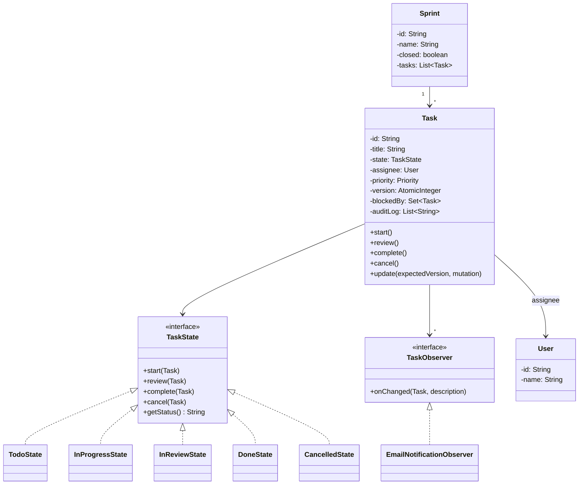
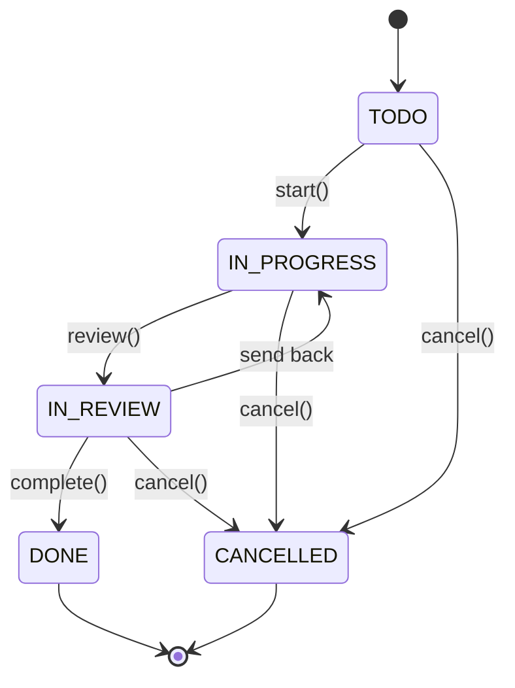

#system-design #lld #example #java #state-machine #coordination

# LLD: Task Management System — Jira/Asana (Java)

**Type:** Coordination + State Machine | **Difficulty:** Medium | **Companies:** Atlassian (Jira), Asana, Monday.com, Linear

---

## 1. Requirements Clarification

| # | Question | Assumption |
|---|----------|------------|
| 1 | What are the task lifecycle states? | TODO → IN_PROGRESS → IN_REVIEW → DONE (also CANCELLED) |
| 2 | Can tasks have dependencies on other tasks? | Yes — a task can block/be-blocked-by other tasks; circular deps rejected |
| 3 | Do we need sprint management? | Yes — tasks belong to a Sprint; closed sprints are read-only |
| 4 | How are assignees notified of changes? | Observer pattern — notify assignee on state change, comment, or reassignment |
| 5 | How do we handle two users updating the same task at the same time? | Optimistic locking — `version` field; second writer gets `StaleTaskException` |
| 6 | Do we need an audit trail / task history? | Yes — Command pattern records each change as an auditable `TaskCommand` |

---

## 2. Problem Type + Key Patterns

**Type:** Coordination (multi-user updates) + State Machine (task lifecycle)

| Pattern | Where Used |
|---------|-----------|
| State | `TaskState` interface — each lifecycle stage is an object |
| Observer | Notify assignee/watchers on any task change |
| Builder | `Task.Builder` — task creation with optional fields (labels, due date) |
| Command | `TaskCommand` — every mutation recorded for audit log and undo |

---

## 3. Class Diagram (ASCII)

```
+------------------+       +------------------+       +------------------+
|     Project      |<>-----|      Sprint       |<>-----|      Task        |
|------------------|       |------------------|       |------------------|
| - id             |       | - id             |       | - id             |
| - name           |       | - name           |       | - title          |
| - members: Set   |       | - closed: bool   |       | - state: TaskState|
| - tasks: List    |       | - tasks: List    |       | - version: int   |
+------------------+       +------------------+       | - assignee: User |
                                                      | - priority       |
+------------------+       +------------------+       | - blockedBy: Set |
|    TaskState     |       |  TaskObserver    |       | - auditLog: List |
|  <<interface>>   |       |  <<interface>>   |       | + transition()   |
| + start()        |       | + onChanged()    |       | + update()       |
| + review()       |       +------------------+       +------------------+
| + complete()     |              ^
| + cancel()       |     EmailNotificationObserver
| + getStatus()    |
+------------------+
        ^
  TodoState  InProgressState  InReviewState  DoneState  CancelledState
```

### Mermaid Diagrams





---

## 4. Core Interfaces

```java
interface TaskState {
    void start(Task task);
    void review(Task task);
    void complete(Task task);
    void cancel(Task task);
    String getStatus();
}

interface TaskObserver {
    void onChanged(Task task, String changeDescription);
}

interface TaskCommand {
    void execute();
    void undo();
    String describe();
}
```

---

## 5. Complete Java Implementation

```java
import java.util.*;
import java.util.concurrent.*;
import java.util.concurrent.atomic.*;
import java.time.LocalDate;

// ── Enums ──────────────────────────────────────────────────────────────────

enum Priority { LOW, MEDIUM, HIGH, CRITICAL }

// ── User ───────────────────────────────────────────────────────────────────

class User {
    private final String id;
    private final String name;
    User(String id, String name) { this.id = id; this.name = name; }
    String getId()   { return id; }
    String getName() { return name; }
}

// ── TaskState interface + concrete states ──────────────────────────────────

interface TaskState {
    void start(Task t);
    void review(Task t);
    void complete(Task t);
    void cancel(Task t);
    String getStatus();
}

class TodoState implements TaskState {
    public void start(Task t)    { t.setState(new InProgressState()); }
    public void review(Task t)   { throw new IllegalStateException("Start the task first"); }
    public void complete(Task t) { throw new IllegalStateException("Task not yet in review"); }
    public void cancel(Task t)   { t.setState(new CancelledState()); }
    public String getStatus()    { return "TODO"; }
}

class InProgressState implements TaskState {
    public void start(Task t)    { throw new IllegalStateException("Already in progress"); }
    public void review(Task t)   { t.setState(new InReviewState()); }
    public void complete(Task t) { throw new IllegalStateException("Submit for review first"); }
    public void cancel(Task t)   { t.setState(new CancelledState()); }
    public String getStatus()    { return "IN_PROGRESS"; }
}

class InReviewState implements TaskState {
    public void start(Task t)    { t.setState(new InProgressState()); } // reviewer sends back
    public void review(Task t)   { throw new IllegalStateException("Already in review"); }
    public void complete(Task t) { t.setState(new DoneState()); }
    public void cancel(Task t)   { t.setState(new CancelledState()); }
    public String getStatus()    { return "IN_REVIEW"; }
}

class DoneState implements TaskState {
    public void start(Task t)    { throw new IllegalStateException("Task is done"); }
    public void review(Task t)   { throw new IllegalStateException("Task is done"); }
    public void complete(Task t) { throw new IllegalStateException("Already done"); }
    public void cancel(Task t)   { throw new IllegalStateException("Cannot cancel a done task"); }
    public String getStatus()    { return "DONE"; }
}

class CancelledState implements TaskState {
    public void start(Task t)    { throw new IllegalStateException("Task is cancelled"); }
    public void review(Task t)   { throw new IllegalStateException("Task is cancelled"); }
    public void complete(Task t) { throw new IllegalStateException("Task is cancelled"); }
    public void cancel(Task t)   { throw new IllegalStateException("Already cancelled"); }
    public String getStatus()    { return "CANCELLED"; }
}

// ── Exception for optimistic locking ──────────────────────────────────────

class StaleTaskException extends RuntimeException {
    StaleTaskException(String id, int expected, int actual) {
        super(String.format("Task %s version conflict: expected %d, found %d", id, expected, actual));
    }
}

// ── TaskCommand (Command pattern for audit) ────────────────────────────────

interface TaskCommand {
    void execute();
    void undo();
    String describe();
}

class AssignCommand implements TaskCommand {
    private final Task task;
    private final User newAssignee;
    private User prevAssignee;

    AssignCommand(Task task, User newAssignee) { this.task = task; this.newAssignee = newAssignee; }

    public void execute() {
        prevAssignee = task.getAssignee();
        task.setAssigneeInternal(newAssignee);
        task.notifyObservers("Assigned to " + newAssignee.getName());
    }
    public void undo() {
        task.setAssigneeInternal(prevAssignee);
        task.notifyObservers("Assignment reverted to " +
            (prevAssignee != null ? prevAssignee.getName() : "unassigned"));
    }
    public String describe() { return "ASSIGN → " + newAssignee.getName(); }
}

class CommentCommand implements TaskCommand {
    private final Task task;
    private final String comment;
    private final User author;

    CommentCommand(Task task, String comment, User author) {
        this.task = task; this.comment = comment; this.author = author;
    }
    public void execute() {
        task.addCommentInternal(author.getName() + ": " + comment);
        task.notifyObservers("New comment by " + author.getName());
    }
    public void undo() { /* comments are immutable by policy */ }
    public String describe() { return "COMMENT by " + author.getName(); }
}

// ── Task (Context) ─────────────────────────────────────────────────────────

class Task {
    private final String id;
    private String title;
    private TaskState state;
    private User assignee;
    private Priority priority;
    private LocalDate dueDate;
    private final Set<String> labels          = new HashSet<>();
    private final List<String> comments       = new ArrayList<>();
    private final List<String> auditLog       = new ArrayList<>();
    private final Set<Task> blockedBy         = new HashSet<>();
    private final List<TaskObserver> observers = new ArrayList<>();

    // Optimistic locking
    private final AtomicInteger version = new AtomicInteger(0);

    private Task(Builder b) {
        this.id = b.id; this.title = b.title; this.priority = b.priority;
        this.assignee = b.assignee; this.dueDate = b.dueDate;
        this.labels.addAll(b.labels);
        this.state = new TodoState();
    }

    /** Optimistic-lock update — caller supplies the version they read */
    synchronized void update(int expectedVersion, Runnable mutation) {
        if (version.get() != expectedVersion)
            throw new StaleTaskException(id, expectedVersion, version.get());
        mutation.run();
        version.incrementAndGet();
    }

    void setState(TaskState s) {
        this.state = s;
        notifyObservers("Status → " + s.getStatus());
        auditLog.add("STATE_CHANGE: " + s.getStatus());
    }

    void start()    { state.start(this); }
    void review()   { state.review(this); }
    void complete() { state.complete(this); }
    void cancel()   { state.cancel(this); }

    void executeCommand(TaskCommand cmd) { cmd.execute(); auditLog.add(cmd.describe()); }

    void addBlockedBy(Task other) {
        if (wouldCreateCycle(other)) throw new IllegalArgumentException("Circular dependency detected");
        blockedBy.add(other);
    }

    private boolean wouldCreateCycle(Task other) {
        if (other.equals(this)) return true;
        Set<Task> visited = new HashSet<>();
        Queue<Task> queue = new LinkedList<>(other.blockedBy);
        while (!queue.isEmpty()) {
            Task t = queue.poll();
            if (t.equals(this)) return true;
            if (visited.add(t)) queue.addAll(t.blockedBy);
        }
        return false;
    }

    void addObserver(TaskObserver o) { observers.add(o); }
    void notifyObservers(String msg) { observers.forEach(o -> o.onChanged(this, msg)); }

    // Internal setters used by commands
    void setAssigneeInternal(User u) { this.assignee = u; }
    void addCommentInternal(String c) { comments.add(c); }

    // Getters
    String getId()          { return id; }
    String getTitle()       { return title; }
    User getAssignee()      { return assignee; }
    int getVersion()        { return version.get(); }
    String getStatus()      { return state.getStatus(); }
    List<String> getAuditLog() { return Collections.unmodifiableList(auditLog); }

    // ── Builder ────────────────────────────────────────────────────────────
    static class Builder {
        private final String id;
        private final String title;
        private Priority priority = Priority.MEDIUM;
        private User assignee;
        private LocalDate dueDate;
        private final List<String> labels = new ArrayList<>();

        Builder(String id, String title) { this.id = id; this.title = title; }
        Builder priority(Priority p)    { this.priority = p; return this; }
        Builder assignee(User u)        { this.assignee = u; return this; }
        Builder dueDate(LocalDate d)    { this.dueDate = d; return this; }
        Builder label(String l)         { this.labels.add(l); return this; }
        Task build()                    { return new Task(this); }
    }
}

// ── TaskObserver ───────────────────────────────────────────────────────────

interface TaskObserver {
    void onChanged(Task task, String changeDescription);
}

class EmailNotificationObserver implements TaskObserver {
    public void onChanged(Task task, String desc) {
        System.out.printf("[EMAIL] Task '%s' updated: %s%n", task.getTitle(), desc);
    }
}

// ── Sprint ─────────────────────────────────────────────────────────────────

class Sprint {
    private final String id;
    private final String name;
    private boolean closed = false;
    private final List<Task> tasks = new ArrayList<>();

    Sprint(String id, String name) { this.id = id; this.name = name; }

    void addTask(Task task) {
        if (closed) throw new IllegalStateException("Cannot add tasks to a closed sprint: " + name);
        tasks.add(task);
    }
    void close() { this.closed = true; System.out.println("Sprint '" + name + "' closed."); }
    boolean isClosed()      { return closed; }
    List<Task> getTasks()   { return Collections.unmodifiableList(tasks); }
}

// ── Project ────────────────────────────────────────────────────────────────

class Project {
    private final String id;
    private final String name;
    private final Set<User> members = new HashSet<>();
    private final List<Sprint> sprints = new ArrayList<>();

    Project(String id, String name) { this.id = id; this.name = name; }
    void addMember(User u)   { members.add(u); }
    void addSprint(Sprint s) { sprints.add(s); }
    boolean hasMember(User u) { return members.contains(u); }
}

// ── Main (demo) ────────────────────────────────────────────────────────────

class TaskManagementDemo {
    public static void main(String[] args) throws InterruptedException {
        User alice = new User("U1", "Alice");
        User bob   = new User("U2", "Bob");

        Task task = new Task.Builder("T-101", "Implement login API")
            .priority(Priority.HIGH)
            .assignee(alice)
            .dueDate(LocalDate.now().plusDays(7))
            .label("backend")
            .build();
        task.addObserver(new EmailNotificationObserver());

        // Command: assign
        task.executeCommand(new AssignCommand(task, bob));
        // Command: comment
        task.executeCommand(new CommentCommand(task, "Added unit tests", bob));

        // State transitions
        task.start();
        task.review();

        // Optimistic locking: two users try to update simultaneously
        int v = task.getVersion();
        ExecutorService pool = Executors.newFixedThreadPool(2);
        pool.submit(() -> {
            try {
                task.update(v, () -> task.executeCommand(new CommentCommand(task, "LGTM", alice)));
                System.out.println("Thread 1 update succeeded");
            } catch (StaleTaskException e) { System.out.println("Thread 1: " + e.getMessage()); }
        });
        pool.submit(() -> {
            try {
                Thread.sleep(50); // slight delay
                task.update(v, () -> task.executeCommand(new CommentCommand(task, "Needs fix", bob)));
                System.out.println("Thread 2 update succeeded");
            } catch (StaleTaskException | InterruptedException e) {
                System.out.println("Thread 2 conflict: " + e.getMessage());
            }
        });
        pool.shutdown();
        pool.awaitTermination(3, TimeUnit.SECONDS);

        task.complete();

        // Circular dependency check
        Task taskA = new Task.Builder("T-102", "Task A").build();
        Task taskB = new Task.Builder("T-103", "Task B").build();
        taskA.addBlockedBy(taskB);
        try { taskB.addBlockedBy(taskA); }
        catch (IllegalArgumentException e) { System.out.println("Caught: " + e.getMessage()); }

        // Sprint closed — cannot add task
        Sprint sprint = new Sprint("S1", "Sprint 1");
        sprint.close();
        try { sprint.addTask(task); }
        catch (IllegalStateException e) { System.out.println("Caught: " + e.getMessage()); }

        System.out.println("Audit log: " + task.getAuditLog());
    }
}
```

---

## 6. Design Patterns Used

| Pattern | Class(es) | Why |
|---------|-----------|-----|
| State | `TodoState`, `InProgressState`, `InReviewState`, `DoneState`, `CancelledState` | Encode valid transitions per state; invalid ops throw exceptions |
| Observer | `TaskObserver`, `EmailNotificationObserver` | Decouple notification from task mutation logic |
| Builder | `Task.Builder` | Readable construction of tasks with many optional fields |
| Command | `AssignCommand`, `CommentCommand` | Uniform mutation API; each command goes into the audit log |

---

## 7. Concurrency Handling

| Scenario | Problem | Solution |
|----------|---------|----------|
| Two users update same task simultaneously | Last write wins silently | Optimistic locking: `AtomicInteger version`; second writer gets `StaleTaskException` |
| Observer notification during mutation | Notification sent with partial state | `synchronized` on `update()` ensures mutation completes before notifying |
| Task state read while transitioning | Stale state read by another thread | `setState()` is `synchronized` via `update()` wrapper |

**Optimistic Locking Flow:**
```
User A reads task (version=3) → User B reads task (version=3)
User A calls update(expectedVersion=3) → succeeds → version becomes 4
User B calls update(expectedVersion=3) → version is 4 → StaleTaskException
User B must re-read and retry
```

---

## 8. Error Handling & Edge Cases

| Edge Case | Handling |
|-----------|----------|
| Circular task dependencies (A blocks B blocks A) | BFS traversal in `wouldCreateCycle()` before adding dependency |
| Task moved to a closed sprint | `Sprint.addTask()` throws `IllegalStateException` |
| Assignee removed from project | `Project.hasMember()` checked before assignment; throw `IllegalArgumentException` |
| Invalid state transition (complete a TODO) | Each state's `complete()` throws `IllegalStateException` with descriptive message |
| Concurrent updates (optimistic lock conflict) | `StaleTaskException` — caller must re-read and retry |

---

## 9. One-Change Test

| Change | What breaks | Fix |
|--------|-------------|-----|
| Remove `version` field | Two users silently overwrite each other's changes | Restore optimistic locking with `AtomicInteger version` |
| Allow `complete()` from `TodoState` | Tasks skip review entirely | `TodoState.complete()` must throw `IllegalStateException` |
| Skip `wouldCreateCycle()` check | Dependency traversal loops infinitely | Restore BFS cycle detection before `blockedBy.add()` |
| Remove `synchronized` from `update()` | Race condition: version check and mutation not atomic | Keep `synchronized` or use `ReentrantLock` |

---

## 10. Follow-up Questions

| Question | Direction |
|----------|-----------|
| How to support subtasks? | `Task` holds `List<Task> subtasks`; parent cannot be DONE until all subtasks DONE |
| How to support custom workflows? | Replace hardcoded states with `WorkflowDefinition` (graph of allowed transitions) |
| How to implement undo history? | `Deque<TaskCommand>` per task; pop and call `cmd.undo()` |
| How to handle task dependencies at sprint boundary? | Block sprint close if any task has open blockers |
| How to scale to millions of tasks? | Shard by `projectId`; store commands in append-only event log (event sourcing) |

---

## 11. Links

- [[../patterns/behavioral]]
- [[../lld_machine_coding_template]]
- [[../lld_concurrency_patterns]]
