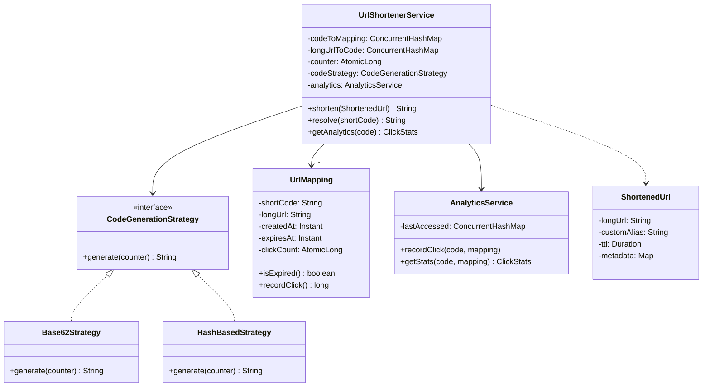

#system-design #lld #example #java #sdk-library #factory #strategy #builder

# LLD: URL Shortener Service (Java)

**Problem Type:** SDK / Library
**Difficulty:** Medium
**Asked at:** Amazon, Google, Bitly, TinyURL, Adobe

---

## Requirements Clarification

| # | Question | Answer |
|---|----------|--------|
| 1 | Should the same long URL always map to the same short code? | Yes — idempotent: return existing code if URL already shortened |
| 2 | Do we support custom aliases? | Yes — user can specify a preferred short code |
| 3 | Do shortened URLs expire? | Optional — configurable TTL per URL |
| 4 | Do we need click analytics per URL? | Yes — track total clicks, per-day count, unique IPs |
| 5 | What is the expected short code length? | 6 characters (Base62 gives 62^6 ≈ 56 billion unique codes) |
| 6 | What happens when an expired URL is accessed? | Return 410 Gone with a descriptive error |

---

## Problem Type + Key Patterns

- **SDK/Library design** — clean API surface, builder for configuration, immutable value objects
- **Factory** — `CodeGeneratorFactory` picks Base62 vs hash-based generation strategy
- **Strategy** — `CodeGenerationStrategy` interface; swap Base62 counter vs MD5 hash without changing service
- **Builder** — `ShortenedUrl.Builder` for constructing URL configs (alias, TTL, metadata)
- **Key Algorithm** — Base62 encoding: map auto-increment counter to 6-char alphanumeric code

---

## Class Diagram (ASCII)

```
+------------------------------+      +---------------------------+
|      UrlShortenerService     |      |   CodeGenerationStrategy  |
|------------------------------|      |---------------------------|
| -urlMappings: ConcurrentMap  |      | <<interface>>             |
| -analytics: AnalyticsService |      | +generate(counter): String|
| -codeStrategy: Strategy      |      +---------------------------+
| +shorten(ShortenedUrl): String        ^             ^
| +resolve(shortCode): String  |  +----+----+   +----+--------+
| +getAnalytics(code): Stats   |  |Base62Gen|   |HashBasedGen |
+------------------------------+  +---------+   +-------------+

+------------------------------+      +---------------------------+
|       ShortenedUrl           |      |    UrlMapping             |
|------------------------------|      |---------------------------|
| -longUrl: String             |      | -shortCode: String        |
| -customAlias: String         |      | -longUrl: String          |
| -ttl: Duration               |      | -createdAt: Instant       |
| -metadata: Map               |      | -expiresAt: Instant       |
| Builder (inner class)        |      | -clickCount: AtomicLong   |
+------------------------------+      +---------------------------+

+------------------------------+
|     AnalyticsService         |
|------------------------------|
| -clickCounts: Map            |
| -dailyCounts: Map            |
| +recordClick(code, ip)       |
| +getStats(code): ClickStats  |
+------------------------------+
```

### Mermaid Class Diagram



---

## Core Interfaces

```java
public interface CodeGenerationStrategy {
    String generate(long counter);
}

public interface UrlRepository {
    Optional<UrlMapping> findByShortCode(String code);
    Optional<UrlMapping> findByLongUrl(String longUrl);
    boolean save(UrlMapping mapping);  // returns false if code already taken
}
```

---

## Complete Java Implementation

```java
import java.util.*;
import java.util.concurrent.*;
import java.util.concurrent.atomic.*;
import java.time.*;

// === Base62 Strategy — KEY ALGORITHM ===
class Base62Strategy implements CodeGenerationStrategy {
    private static final String CHARS =
        "0123456789abcdefghijklmnopqrstuvwxyzABCDEFGHIJKLMNOPQRSTUVWXYZ";

    public String generate(long counter) {
        StringBuilder sb = new StringBuilder();
        while (counter > 0) {
            sb.append(CHARS.charAt((int)(counter % 62)));
            counter /= 62;
        }
        while (sb.length() < 6) sb.append('0');  // pad to 6 chars
        return sb.reverse().toString();
    }
}

// === Hash-based Strategy ===
class HashBasedStrategy implements CodeGenerationStrategy {
    public String generate(long counter) {
        // Use counter as seed for deterministic hash-like code
        int hash = Long.hashCode(counter);
        return String.format("%06x", Math.abs(hash) % 0xFFFFFF);
    }
}

// === CodeGeneratorFactory ===
class CodeGeneratorFactory {
    public enum Type { BASE62, HASH }

    public static CodeGenerationStrategy create(Type type) {
        return switch (type) {
            case BASE62 -> new Base62Strategy();
            case HASH   -> new HashBasedStrategy();
        };
    }
}

// === ShortenedUrl — Builder Pattern ===
class ShortenedUrl {
    private final String longUrl;
    private final String customAlias;
    private final Duration ttl;
    private final Map<String, String> metadata;

    private ShortenedUrl(Builder b) {
        this.longUrl = b.longUrl;
        this.customAlias = b.customAlias;
        this.ttl = b.ttl;
        this.metadata = Collections.unmodifiableMap(b.metadata);
    }

    public String getLongUrl() { return longUrl; }
    public Optional<String> getCustomAlias() { return Optional.ofNullable(customAlias); }
    public Optional<Duration> getTtl() { return Optional.ofNullable(ttl); }

    public static class Builder {
        private final String longUrl;
        private String customAlias;
        private Duration ttl;
        private Map<String, String> metadata = new HashMap<>();

        public Builder(String longUrl) {
            if (longUrl == null || !longUrl.startsWith("http"))
                throw new IllegalArgumentException("Invalid URL: " + longUrl);
            this.longUrl = longUrl;
        }
        public Builder alias(String alias) { this.customAlias = alias; return this; }
        public Builder ttl(Duration d) { this.ttl = d; return this; }
        public Builder meta(String k, String v) { metadata.put(k, v); return this; }
        public ShortenedUrl build() { return new ShortenedUrl(this); }
    }
}

// === UrlMapping — immutable value object ===
class UrlMapping {
    private final String shortCode;
    private final String longUrl;
    private final Instant createdAt;
    private final Instant expiresAt;
    private final AtomicLong clickCount = new AtomicLong(0);

    public UrlMapping(String shortCode, String longUrl, Instant expiresAt) {
        this.shortCode = shortCode;
        this.longUrl = longUrl;
        this.createdAt = Instant.now();
        this.expiresAt = expiresAt;
    }

    public boolean isExpired() {
        return expiresAt != null && Instant.now().isAfter(expiresAt);
    }

    public long recordClick() { return clickCount.incrementAndGet(); }
    public long getClickCount() { return clickCount.get(); }
    public String getShortCode() { return shortCode; }
    public String getLongUrl() { return longUrl; }
    public Instant getCreatedAt() { return createdAt; }
}

// === Analytics ===
class ClickStats {
    public final String shortCode;
    public final long totalClicks;
    public final Instant lastAccessed;

    public ClickStats(String code, long clicks, Instant last) {
        this.shortCode = code; this.totalClicks = clicks; this.lastAccessed = last;
    }
    public String toString() {
        return String.format("Code=%s, Clicks=%d, LastAccessed=%s", shortCode, totalClicks, lastAccessed);
    }
}

class AnalyticsService {
    private final ConcurrentHashMap<String, Instant> lastAccessed = new ConcurrentHashMap<>();

    public void recordClick(String code, UrlMapping mapping) {
        long count = mapping.recordClick();
        lastAccessed.put(code, Instant.now());
        System.out.printf("[ANALYTICS] %s clicked — total: %d%n", code, count);
    }

    public ClickStats getStats(String code, UrlMapping mapping) {
        return new ClickStats(code, mapping.getClickCount(),
            lastAccessed.getOrDefault(code, mapping.getCreatedAt()));
    }
}

// === Custom Exceptions ===
class UrlExpiredException extends RuntimeException {
    public UrlExpiredException(String code) {
        super("410 Gone: Short URL '" + code + "' has expired.");
    }
}
class AliasAlreadyTakenException extends RuntimeException {
    public AliasAlreadyTakenException(String alias) {
        super("Custom alias '" + alias + "' is already in use.");
    }
}

// === UrlShortenerService ===
class UrlShortenerService {
    // shortCode → UrlMapping
    private final ConcurrentHashMap<String, UrlMapping> codeToMapping = new ConcurrentHashMap<>();
    // longUrl → shortCode (for idempotency)
    private final ConcurrentHashMap<String, String> longUrlToCode = new ConcurrentHashMap<>();
    private final AtomicLong counter = new AtomicLong(1_000_000L); // start above trivial codes
    private final CodeGenerationStrategy codeStrategy;
    private final AnalyticsService analytics;
    private final String baseUrl;

    public UrlShortenerService(String baseUrl, CodeGenerationStrategy strategy) {
        this.baseUrl = baseUrl;
        this.codeStrategy = strategy;
        this.analytics = new AnalyticsService();
    }

    public String shorten(ShortenedUrl config) {
        String longUrl = config.getLongUrl();

        // Idempotency — return existing code if already shortened
        String existingCode = longUrlToCode.get(longUrl);
        if (existingCode != null) {
            System.out.println("[IDEMPOTENT] Returning existing code for: " + longUrl);
            return baseUrl + "/" + existingCode;
        }

        Instant expiresAt = config.getTtl()
            .map(ttl -> Instant.now().plus(ttl))
            .orElse(null);

        // Custom alias path
        if (config.getCustomAlias().isPresent()) {
            String alias = config.getCustomAlias().get();
            return saveMapping(alias, longUrl, expiresAt);
        }

        // Generate unique code — retry on collision
        String shortCode;
        UrlMapping mapping;
        do {
            long id = counter.getAndIncrement();
            shortCode = codeStrategy.generate(id);
            mapping = new UrlMapping(shortCode, longUrl, expiresAt);
        } while (codeToMapping.putIfAbsent(shortCode, mapping) != null);
        // putIfAbsent: atomic — only first writer wins; loop retries on collision

        longUrlToCode.put(longUrl, shortCode);
        return baseUrl + "/" + shortCode;
    }

    private String saveMapping(String code, String longUrl, Instant expiresAt) {
        UrlMapping mapping = new UrlMapping(code, longUrl, expiresAt);
        UrlMapping existing = codeToMapping.putIfAbsent(code, mapping);
        if (existing != null) throw new AliasAlreadyTakenException(code);
        longUrlToCode.put(longUrl, code);
        return baseUrl + "/" + code;
    }

    public String resolve(String shortCode) {
        UrlMapping mapping = codeToMapping.get(shortCode);
        if (mapping == null) throw new NoSuchElementException("Short code not found: " + shortCode);
        if (mapping.isExpired()) {
            codeToMapping.remove(shortCode);   // lazy cleanup
            throw new UrlExpiredException(shortCode);
        }
        analytics.recordClick(shortCode, mapping);
        return mapping.getLongUrl();
    }

    public ClickStats getAnalytics(String shortCode) {
        UrlMapping mapping = codeToMapping.get(shortCode);
        if (mapping == null) throw new NoSuchElementException("Code not found: " + shortCode);
        return analytics.getStats(shortCode, mapping);
    }
}

// === Demo ===
public class UrlShortenerDemo {
    public static void main(String[] args) throws InterruptedException {
        UrlShortenerService svc = new UrlShortenerService(
            "https://short.ly",
            CodeGeneratorFactory.create(CodeGeneratorFactory.Type.BASE62)
        );

        // Normal shortening
        ShortenedUrl req1 = new ShortenedUrl.Builder("https://www.example.com/very/long/path?q=1")
            .ttl(Duration.ofDays(30))
            .meta("campaign", "summer_sale")
            .build();
        String code1 = svc.shorten(req1);
        System.out.println("Shortened: " + code1);

        // Idempotency — same URL returns same code
        String code2 = svc.shorten(req1);
        System.out.println("Same URL again: " + code2);
        System.out.println("Codes match: " + code1.equals(code2));

        // Custom alias
        ShortenedUrl customReq = new ShortenedUrl.Builder("https://docs.google.com/spreadsheet/abc")
            .alias("my-sheet")
            .build();
        System.out.println("Custom alias: " + svc.shorten(customReq));

        // Resolve + analytics
        String shortCode = code1.replace("https://short.ly/", "");
        System.out.println("Resolved: " + svc.resolve(shortCode));
        System.out.println("Resolved: " + svc.resolve(shortCode));
        System.out.println(svc.getAnalytics(shortCode));

        // Concurrent shortening — race to generate same code
        UrlShortenerService svc2 = new UrlShortenerService(
            "https://short.ly",
            CodeGeneratorFactory.create(CodeGeneratorFactory.Type.BASE62)
        );
        Runnable task = () -> {
            String url = "https://concurrent-test.com/" + Thread.currentThread().getName();
            System.out.println(Thread.currentThread().getName() + " -> " + svc2.shorten(
                new ShortenedUrl.Builder(url).build()
            ));
        };
        Thread t1 = new Thread(task, "T1");
        Thread t2 = new Thread(task, "T2");
        t1.start(); t2.start();
        t1.join(); t2.join();
    }
}
```

---

## Design Patterns Used

| Pattern | Class | Reason |
|---------|-------|--------|
| **Strategy** | `CodeGenerationStrategy` (Base62 vs Hash) | Swap algorithm without touching service; easy A/B test |
| **Factory** | `CodeGeneratorFactory.create()` | Centralize strategy instantiation; hide concrete classes |
| **Builder** | `ShortenedUrl.Builder` | Optional fields (alias, TTL, metadata) without telescoping constructors |
| **Atomic putIfAbsent** | `ConcurrentHashMap.putIfAbsent()` | Lock-free collision resolution; only first writer wins |

---

## Concurrency Handling

**Problem 1:** Two requests generate the same short code simultaneously.

```java
// putIfAbsent is atomic — returns null only if key was absent and insert succeeded
do {
    long id = counter.getAndIncrement();  // AtomicLong — no race on counter
    shortCode = codeStrategy.generate(id);
    mapping = new UrlMapping(shortCode, longUrl, expiresAt);
} while (codeToMapping.putIfAbsent(shortCode, mapping) != null);
// If putIfAbsent returns non-null, another thread won — retry with new counter value
```

**Problem 2:** Two requests shorten the same long URL — must return same short code.

```java
// putIfAbsent on longUrlToCode — first writer wins, second reads existing
String existingCode = longUrlToCode.get(longUrl);
if (existingCode != null) return baseUrl + "/" + existingCode;
// After saving: longUrlToCode.put(longUrl, shortCode) — last write wins
// For strict idempotency use: longUrlToCode.putIfAbsent(longUrl, shortCode)
```

---

## Error Handling & Edge Cases

```java
// 1. Invalid URL format — caught in Builder
if (!longUrl.startsWith("http"))
    throw new IllegalArgumentException("Invalid URL: " + longUrl);

// 2. URL already shortened — idempotent return
String existing = longUrlToCode.get(longUrl);
if (existing != null) return baseUrl + "/" + existing;

// 3. Expired URL accessed — lazy cleanup
if (mapping.isExpired()) {
    codeToMapping.remove(shortCode);
    throw new UrlExpiredException(shortCode);  // 410 Gone
}

// 4. Custom alias collision
UrlMapping prev = codeToMapping.putIfAbsent(alias, mapping);
if (prev != null) throw new AliasAlreadyTakenException(alias);

// 5. Non-existent short code
if (mapping == null) throw new NoSuchElementException("Code not found: " + shortCode);
```

---

## One-Change Test

| Change | Classes Modified |
|--------|-----------------|
| Add hash-based code generation | 1 new: `HashBasedStrategy implements CodeGenerationStrategy` |
| Add rate limiting per user | 1 new: `RateLimitedUrlShortenerService extends UrlShortenerService` |
| Add per-country analytics | 1 change: `AnalyticsService.recordClick()` — add IP→country lookup |
| Support QR code generation | 1 new: `QrCodeService` — takes shortUrl, wraps existing service |

---

## Follow-up Questions

| Question | Answer Direction |
|----------|-----------------|
| How to handle 100M URLs? | Distributed counter (Zookeeper/Redis INCR), sharded ConcurrentHashMap → DB |
| How to support URL previews (link safety check)? | `SafeUrlValidator` wraps `shorten()` — checks against blocklist before saving |
| How to implement click geo-analytics? | `AnalyticsService.recordClick(code, ip, userAgent)` — enrich with MaxMind GeoIP |
| What if same short code generated across two servers? | Pre-allocate counter ranges per server (Twitter Snowflake approach) |
| How to handle link rot (long URL goes dead)? | Background `LinkHealthChecker` pings URLs periodically; mark broken links |

---

## Links

- [[../patterns/behavioral]] — Strategy pattern details
- [[../lld_machine_coding_template]] — Template this file follows
- [[../lld_concurrency_patterns]] — AtomicLong, ConcurrentHashMap.putIfAbsent, lock-free patterns
