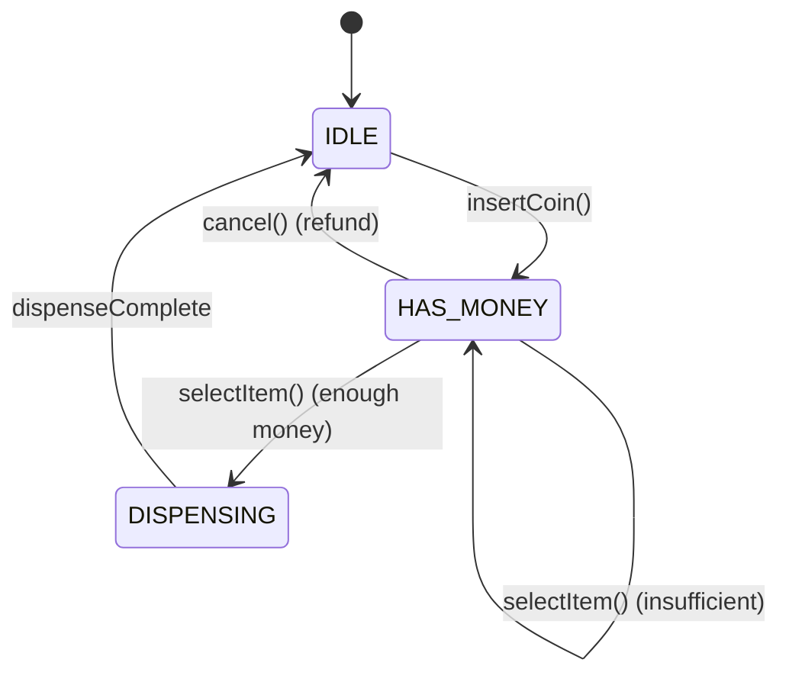
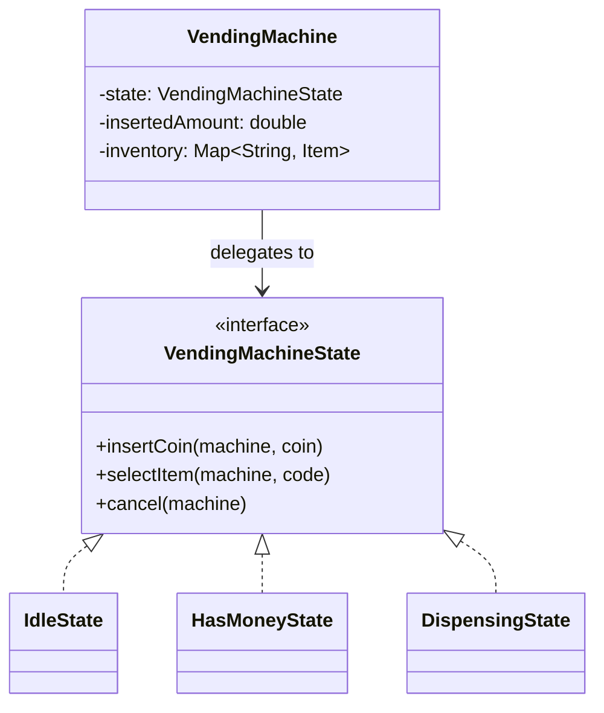

#system-design #lld #state-machine

# LLD: Vending Machine

**Type:** State Machine
**Difficulty:** Medium
**Asked at:** Amazon, Flipkart, Paytm, DE Shaw, Goldman Sachs

---

## Requirements Clarification

1. What denominations does it accept? (₹1, ₹2, ₹5, ₹10, ₹50, ₹100)
2. Can it dispense change? Yes
3. Does it track inventory? Yes — quantity per item
4. What happens if item out of stock?
5. Single item dispense or multiple?
6. Does it need receipt? (No, for this design)

**Scope:** Accept coins/notes, select item, dispense item + change, handle insufficient funds and out-of-stock.

---

## Problem Type
**State Machine** — machine behavior changes drastically based on state. Key pattern: **State** (each state handles its own transitions).

---

## State Machine Diagram

```
                INSERT_COIN
IDLE ──────────────────────────────► HAS_MONEY
 ▲                                      │
 │ CANCEL                               │ SELECT_ITEM
 │ (refund money)                       │ (if enough money + item available)
 │                                      ▼
 │                              DISPENSING
 │                                      │
 │                                      │ (dispense item + return change)
 └──────────────────────────────────────┘
        DISPENSE_COMPLETE → IDLE

Special transitions:
HAS_MONEY → INSERT_COIN → HAS_MONEY (accumulate)
HAS_MONEY → SELECT_ITEM (not enough money) → HAS_MONEY (stay, prompt for more)
Any state (except DISPENSING) → OUT_OF_STOCK for selected item → show error, stay in HAS_MONEY
```

---

## Class Diagram

```
VendingMachine
    ├── state: VendingMachineState (interface)
    ├── items: Map<String, Item>
    ├── insertedAmount: double
    └── selectedItem: Item

VendingMachineState (interface)
    ├── IdleState
    ├── HasMoneyState
    ├── DispensingState
    └── OutOfStockState

Item
    ├── name: String
    ├── price: double
    └── quantity: int

CoinDenomination (enum)
    └── ONE, TWO, FIVE, TEN, FIFTY, HUNDRED
```

---

## Mermaid Diagrams





---

## Complete Java Implementation

```java
// Coin denominations
public enum CoinDenomination {
    ONE(1), TWO(2), FIVE(5), TEN(10), FIFTY(50), HUNDRED(100);

    private final int value;
    CoinDenomination(int value) { this.value = value; }
    public int getValue() { return value; }
}

// Item in the machine
public class Item {
    private final String code;
    private final String name;
    private final double price;
    private int quantity;

    public Item(String code, String name, double price, int quantity) {
        this.code = code; this.name = name;
        this.price = price; this.quantity = quantity;
    }

    public boolean isAvailable() { return quantity > 0; }
    public void dispense() {
        if (quantity <= 0) throw new ItemNotAvailableException("Item " + name + " out of stock");
        quantity--;
    }

    // Getters
    public String getCode()  { return code; }
    public String getName()  { return name; }
    public double getPrice() { return price; }
    public int getQuantity() { return quantity; }
}

// State interface — all actions defined here
public interface VendingMachineState {
    void insertCoin(VendingMachine machine, CoinDenomination coin);
    void selectItem(VendingMachine machine, String itemCode);
    void cancel(VendingMachine machine);
    String getStateName();
}

// Context — the vending machine itself
public class VendingMachine {
    private VendingMachineState currentState;
    private final Map<String, Item> inventory = new HashMap<>();
    private double insertedAmount = 0.0;
    private Item selectedItem;

    public VendingMachine() {
        this.currentState = new IdleState();
        loadDefaultInventory();
    }

    private void loadDefaultInventory() {
        addItem(new Item("A1", "Chips", 20.0, 5));
        addItem(new Item("A2", "Water", 15.0, 3));
        addItem(new Item("A3", "Cola",  25.0, 4));
        addItem(new Item("B1", "Juice", 30.0, 2));
    }

    public void addItem(Item item)      { inventory.put(item.getCode(), item); }
    public void insertCoin(CoinDenomination coin) { currentState.insertCoin(this, coin); }
    public void selectItem(String code) { currentState.selectItem(this, code); }
    public void cancel()                { currentState.cancel(this); }

    // Called by states
    public void setState(VendingMachineState state) { this.currentState = state; }
    public void addAmount(double amount)    { this.insertedAmount += amount; }
    public void resetAmount()              { this.insertedAmount = 0.0; }
    public double getInsertedAmount()      { return insertedAmount; }
    public void setSelectedItem(Item item) { this.selectedItem = item; }
    public Item getSelectedItem()          { return selectedItem; }
    public Item getItem(String code)       { return inventory.get(code); }
    public String getState()               { return currentState.getStateName(); }

    public void returnChange(double change) {
        if (change > 0) System.out.printf("Returning change: ₹%.0f%n", change);
    }

    public void dispenseItem() {
        System.out.println("Dispensing: " + selectedItem.getName());
        selectedItem.dispense();
    }
}

// State 1: IDLE — waiting for money
public class IdleState implements VendingMachineState {
    public void insertCoin(VendingMachine machine, CoinDenomination coin) {
        machine.addAmount(coin.getValue());
        System.out.printf("Inserted ₹%d. Total: ₹%.0f%n", coin.getValue(), machine.getInsertedAmount());
        machine.setState(new HasMoneyState());
    }

    public void selectItem(VendingMachine machine, String itemCode) {
        System.out.println("Please insert money first");
    }

    public void cancel(VendingMachine machine) {
        System.out.println("No money inserted");
    }

    public String getStateName() { return "IDLE"; }
}

// State 2: HAS_MONEY — money inserted, waiting for selection
public class HasMoneyState implements VendingMachineState {
    public void insertCoin(VendingMachine machine, CoinDenomination coin) {
        machine.addAmount(coin.getValue());
        System.out.printf("Inserted ₹%d. Total: ₹%.0f%n", coin.getValue(), machine.getInsertedAmount());
    }

    public void selectItem(VendingMachine machine, String itemCode) {
        Item item = machine.getItem(itemCode);

        if (item == null) {
            System.out.println("Invalid item code: " + itemCode);
            return;
        }
        if (!item.isAvailable()) {
            System.out.println(item.getName() + " is out of stock");
            return;
        }
        if (machine.getInsertedAmount() < item.getPrice()) {
            System.out.printf("Insufficient funds. Need ₹%.0f more%n",
                item.getPrice() - machine.getInsertedAmount());
            return;
        }

        machine.setSelectedItem(item);
        machine.setState(new DispensingState());
        machine.selectItem(itemCode);  // trigger dispense in DispensingState
    }

    public void cancel(VendingMachine machine) {
        System.out.printf("Returning ₹%.0f%n", machine.getInsertedAmount());
        machine.returnChange(machine.getInsertedAmount());
        machine.resetAmount();
        machine.setState(new IdleState());
    }

    public String getStateName() { return "HAS_MONEY"; }
}

// State 3: DISPENSING — item being dispensed
public class DispensingState implements VendingMachineState {
    public void insertCoin(VendingMachine machine, CoinDenomination coin) {
        System.out.println("Please wait, dispensing in progress");
    }

    public void selectItem(VendingMachine machine, String itemCode) {
        Item item = machine.getSelectedItem();
        double change = machine.getInsertedAmount() - item.getPrice();

        machine.dispenseItem();
        machine.returnChange(change);
        machine.resetAmount();
        machine.setSelectedItem(null);
        machine.setState(new IdleState());
        System.out.println("Thank you! Enjoy your " + item.getName());
    }

    public void cancel(VendingMachine machine) {
        System.out.println("Cannot cancel — dispensing in progress");
    }

    public String getStateName() { return "DISPENSING"; }
}
```

---

## Usage Demo

```java
VendingMachine machine = new VendingMachine();

// Happy path
machine.insertCoin(CoinDenomination.TEN);   // ₹10 inserted
machine.insertCoin(CoinDenomination.TEN);   // ₹20 inserted
machine.selectItem("A1");                    // Chips ₹20 — exact change
// Output: Dispensing: Chips, Thank you!

// Insufficient funds
machine.insertCoin(CoinDenomination.TEN);   // ₹10
machine.selectItem("A3");                   // Cola ₹25 — need ₹15 more
machine.insertCoin(CoinDenomination.TEN);   // ₹20 total
machine.insertCoin(CoinDenomination.TEN);   // ₹30 total
machine.selectItem("A3");                   // Cola ₹25, returns ₹5 change

// Cancel
machine.insertCoin(CoinDenomination.FIFTY); // ₹50
machine.cancel();                           // Returns ₹50
```

---

## Design Patterns Used

| Pattern | Where | Why |
|---------|-------|-----|
| **State** | `VendingMachineState` + states | Machine behavior per state without if/else |
| **Factory** | (Extension) `ItemFactory` | Create items from config |

---

## Concurrency Handling

```java
// Machine is typically single-user (physical buttons)
// For network-connected vending machine:
public synchronized void insertCoin(CoinDenomination coin) {
    currentState.insertCoin(this, coin);
}
public synchronized void selectItem(String code) {
    currentState.selectItem(this, code);
}
// synchronized on machine ensures atomicity of state transitions
```

---

## Error Handling & Edge Cases

```java
// 1. Item out of stock
if (!item.isAvailable()) { System.out.println(item.getName() + " is out of stock"); return; }

// 2. Invalid item code
if (item == null) { System.out.println("Invalid item code"); return; }

// 3. Insufficient funds
if (insertedAmount < item.getPrice()) { /* prompt for more */ return; }

// 4. No change available (not implemented but mention)
// Real machines check change availability before dispensing

// 5. Item stuck (dispense failed)
// Real machines retry 3 times, refund if stuck
```

---

## One-Change Test

| Change | Impact |
|--------|--------|
| Add new item type (perishable — check expiry) | 1 new: `PerishableItem extends Item` override `isAvailable()` |
| Add card payment | 1 new: `CardPaymentState` — separate state for card auth |
| Add discount for bulk purchase | 1 new: `DiscountStrategy` applied in `HasMoneyState.selectItem()` |

---

## Follow-up Questions

| Question | Answer |
|----------|--------|
| How to add card payment? | New `CardPaymentState` between `HasMoneyState` and `DispensingState` |
| How to add admin mode (restock)? | New `AdminState`, enter with special code |
| How to handle item dispensing failure? | `DispensingState` retries, transitions to `ErrorState`, refunds |
| How to add receipts? | `ReceiptPrinter` observer subscribed to dispense events |

---

## Links

- [[../patterns/behavioral]] — State pattern
- [[../problem_taxonomy_lld]] — State Machine type
- [[../lld_machine_coding_template]] — 90-min guide
