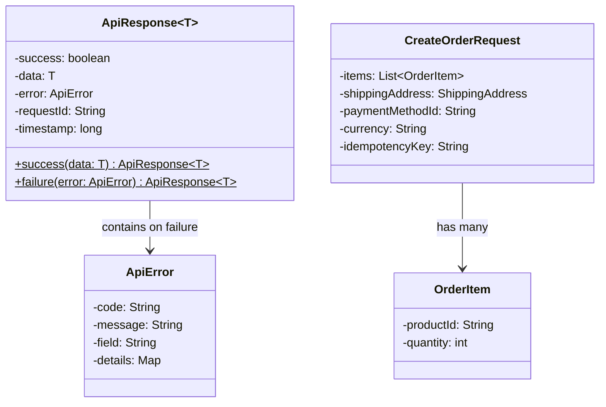

#system-design #lld #api-design #rest

# API Design for LLD

> API design is **LLD for the network boundary**. A clean API is as important as clean internal class design.

---

## Why API Design Matters in LLD Interviews

- **Stripe, Razorpay, PhonePe:** API design is core to their coding rounds
- **Any backend role:** REST API design is asked in almost every SDE-2 interview
- Your internal class design mirrors your API design — both should be clean

---

## API Response Structure



---

## REST API Design Principles

### 1. Resource-Based URLs

```
# BAD — action in URL (RPC style)
POST /createUser
GET  /getUser?id=123
POST /deleteUser

# GOOD — resource-based, HTTP verb carries action
POST   /users              → create user
GET    /users/123          → get user
PUT    /users/123          → full update
PATCH  /users/123          → partial update
DELETE /users/123          → delete user
```

### 2. Nested Resources (Relationships)

```
GET    /users/123/orders           → all orders for user 123
POST   /users/123/orders           → create order for user 123
GET    /users/123/orders/456       → specific order
DELETE /users/123/orders/456       → cancel order

# Rule: max 2-3 levels deep — beyond that, flatten
# BAD:  /users/123/orders/456/items/789/reviews
# GOOD: /order-items/789/reviews
```

### 3. HTTP Verbs — Use Correctly

| Verb | Action | Idempotent | Safe |
|------|--------|-----------|------|
| GET | Read | Yes | Yes |
| POST | Create | No | No |
| PUT | Full replace | Yes | No |
| PATCH | Partial update | No | No |
| DELETE | Delete | Yes | No |

**Idempotent** = calling multiple times has same effect as calling once.

---

## Request/Response Design

### Request Structure

```java
// Good request: validated, typed, documented
public class CreateOrderRequest {
    @NotNull
    @Size(min = 1)
    private List<OrderItem> items;

    @NotNull
    @Valid
    private ShippingAddress shippingAddress;

    @NotBlank
    private String paymentMethodId;

    // Optional with defaults
    private String currency = "INR";
    private String idempotencyKey;  // for safe retries

    // Getters, validation...
}

public class OrderItem {
    @NotBlank
    private String productId;

    @Min(1)
    private int quantity;
}
```

### Response Structure — Consistent Envelope

```java
// Always wrap in a consistent response object
public class ApiResponse<T> {
    private boolean success;
    private T data;
    private ApiError error;
    private String requestId;      // for tracing
    private long timestamp;

    // Factory methods
    public static <T> ApiResponse<T> success(T data) {
        ApiResponse<T> response = new ApiResponse<>();
        response.success   = true;
        response.data      = data;
        response.requestId = UUID.randomUUID().toString();
        response.timestamp = System.currentTimeMillis();
        return response;
    }

    public static <T> ApiResponse<T> failure(ApiError error) {
        ApiResponse<T> response = new ApiResponse<>();
        response.success   = false;
        response.error     = error;
        response.requestId = UUID.randomUUID().toString();
        response.timestamp = System.currentTimeMillis();
        return response;
    }
}

// Error structure
public class ApiError {
    private String code;     // machine-readable: "INSUFFICIENT_BALANCE"
    private String message;  // human-readable: "Account balance too low"
    private String field;    // for validation errors: "amount"
    private Map<String, String> details;  // extra context
}

// Good response example
{
  "success": true,
  "data": {
    "orderId": "ord_123abc",
    "status": "CONFIRMED",
    "total": 5999.00,
    "estimatedDelivery": "2025-04-15"
  },
  "requestId": "req_xyz789",
  "timestamp": 1704067200000
}

// Error response example
{
  "success": false,
  "error": {
    "code": "PAYMENT_FAILED",
    "message": "Payment declined by bank",
    "details": {
      "declineCode": "insufficient_funds",
      "suggestion": "Try a different payment method"
    }
  },
  "requestId": "req_abc123",
  "timestamp": 1704067200000
}
```

---

## HTTP Status Codes — Use Correctly

```
2xx — Success
  200 OK            → successful GET, PATCH, DELETE
  201 Created       → successful POST (include Location header)
  204 No Content    → successful DELETE (no body)
  202 Accepted      → async operation started (will process later)

4xx — Client Error (client's fault)
  400 Bad Request   → invalid input, validation error
  401 Unauthorized  → not authenticated (no/invalid token)
  403 Forbidden     → authenticated but no permission
  404 Not Found     → resource doesn't exist
  409 Conflict      → duplicate create, stale update
  422 Unprocessable → valid JSON but business rule violation
  429 Too Many Req  → rate limit exceeded

5xx — Server Error (our fault)
  500 Internal      → unexpected error
  503 Unavailable   → temporarily down
  504 Gateway Tmout → downstream service timeout
```

**Common mistakes:**
```
❌ 200 with {"success": false, ...}   → use 4xx/5xx status codes
❌ 404 for "unauthorized"             → that's 403
❌ 500 for validation errors          → that's 400
❌ 200 for "user not found"           → that's 404
```

---

## API Versioning

```java
// Option 1: URL versioning (most common, most visible)
/api/v1/users
/api/v2/users

// Option 2: Header versioning
GET /users
Accept: application/vnd.myapp.v2+json

// Option 3: Query param (avoid for REST)
GET /users?version=2

// Recommendation: URL versioning for public APIs (Stripe uses this)
// Header versioning for internal APIs
```

### Backward Compatibility Rules

```
// SAFE (backward compatible) — OK to release without version bump
✅ Add new optional fields to response
✅ Add new optional request parameters
✅ Add new endpoints
✅ Add new values to extensible enums

// BREAKING — requires new version
❌ Remove fields from response
❌ Change field types (string → int)
❌ Rename fields
❌ Make optional fields required
❌ Change URL structure
```

---

## Pagination

```java
// Cursor-based (preferred for large datasets, used by Stripe)
GET /orders?limit=20&cursor=eyJpZCI6MTIzfQ
// Response:
{
  "data": [...],
  "pagination": {
    "hasMore": true,
    "nextCursor": "eyJpZCI6MTQzfQ",
    "limit": 20
  }
}

// Offset-based (simpler, but inconsistent with insertions)
GET /orders?page=2&pageSize=20
// Response:
{
  "data": [...],
  "pagination": {
    "currentPage": 2,
    "pageSize": 20,
    "totalItems": 1234,
    "totalPages": 62
  }
}
```

**Cursor vs Offset:**
| | Cursor | Offset |
|--|--|--|
| Consistent with inserts | Yes | No (items shift) |
| Jump to page N | No | Yes |
| Performance | O(1) | O(n) for deep pages |
| Use when | Feeds, large datasets | Admin tables, reporting |

---

## Rate Limiting in API Design

```java
// Rate limit headers (standard)
HTTP/1.1 200 OK
X-RateLimit-Limit: 100        // max requests per window
X-RateLimit-Remaining: 87     // requests left in window
X-RateLimit-Reset: 1704067200 // epoch when window resets

// When limit exceeded
HTTP/1.1 429 Too Many Requests
X-RateLimit-Limit: 100
X-RateLimit-Remaining: 0
X-RateLimit-Reset: 1704067200
Retry-After: 45               // seconds until retry is safe
```

---

## Idempotency in APIs (Stripe Pattern)

```java
// Client sends unique key with each request
POST /payments
Idempotency-Key: a3b2c1d4-e5f6-7890-abcd-ef1234567890
Content-Type: application/json

{
  "amount": 50000,
  "currency": "INR",
  "paymentMethod": "card_123"
}

// Server-side idempotency handler
@PostMapping("/payments")
public ResponseEntity<ApiResponse<Payment>> createPayment(
        @RequestHeader("Idempotency-Key") String idempotencyKey,
        @RequestBody CreatePaymentRequest request) {

    // Check if we've seen this key before
    Optional<Payment> existing = idempotencyStore.get(idempotencyKey);
    if (existing.isPresent()) {
        return ResponseEntity.ok(ApiResponse.success(existing.get()));
    }

    // Process payment
    Payment payment = paymentService.process(request);

    // Store key → response mapping (24h TTL)
    idempotencyStore.store(idempotencyKey, payment, Duration.ofHours(24));

    return ResponseEntity.status(HttpStatus.CREATED)
                         .body(ApiResponse.success(payment));
}
```

---

## Error Handling in REST APIs

```java
// Global exception handler (Spring Boot)
@RestControllerAdvice
public class GlobalExceptionHandler {

    @ExceptionHandler(ValidationException.class)
    @ResponseStatus(HttpStatus.BAD_REQUEST)
    public ApiResponse<Void> handleValidation(ValidationException ex) {
        return ApiResponse.failure(ApiError.builder()
            .code("VALIDATION_ERROR")
            .message(ex.getMessage())
            .field(ex.getField())
            .build());
    }

    @ExceptionHandler(ResourceNotFoundException.class)
    @ResponseStatus(HttpStatus.NOT_FOUND)
    public ApiResponse<Void> handleNotFound(ResourceNotFoundException ex) {
        return ApiResponse.failure(ApiError.builder()
            .code("RESOURCE_NOT_FOUND")
            .message(ex.getMessage())
            .build());
    }

    @ExceptionHandler(InsufficientBalanceException.class)
    @ResponseStatus(HttpStatus.UNPROCESSABLE_ENTITY)
    public ApiResponse<Void> handleInsufficientBalance(InsufficientBalanceException ex) {
        return ApiResponse.failure(ApiError.builder()
            .code("INSUFFICIENT_BALANCE")
            .message("Account balance too low for this transaction")
            .details(Map.of(
                "required", String.valueOf(ex.getRequired()),
                "available", String.valueOf(ex.getAvailable())
            ))
            .build());
    }

    @ExceptionHandler(Exception.class)
    @ResponseStatus(HttpStatus.INTERNAL_SERVER_ERROR)
    public ApiResponse<Void> handleUnexpected(Exception ex) {
        log.error("Unexpected error", ex);
        return ApiResponse.failure(ApiError.builder()
            .code("INTERNAL_ERROR")
            .message("An unexpected error occurred. Please try again.")
            .build());
    }
}
```

---

## API Design for Common LLD Problems

### Payment API (Stripe-style)
```
POST   /v1/payment-intents          → create payment intent
GET    /v1/payment-intents/:id      → get status
POST   /v1/payment-intents/:id/confirm  → confirm payment
POST   /v1/payment-intents/:id/cancel   → cancel
POST   /v1/refunds                  → create refund
```

### Booking API (BookMyShow-style)
```
GET    /v1/shows?date=&city=        → search shows
GET    /v1/shows/:id/seats          → get seat layout
POST   /v1/bookings                 → create booking (with seat lock)
GET    /v1/bookings/:id             → get booking
DELETE /v1/bookings/:id             → cancel booking
```

### Ride API (Uber-style)
```
POST   /v1/ride-requests            → request ride
GET    /v1/ride-requests/:id        → get status
POST   /v1/ride-requests/:id/cancel → cancel
GET    /v1/drivers/:id/location     → driver location (SSE/WebSocket)
POST   /v1/rides/:id/rating         → rate ride
```

---

## API Design Interview Checklist

```
□ Resource-based URLs (no verbs in URLs)
□ Correct HTTP methods
□ Consistent response envelope
□ Proper status codes (not 200 for everything)
□ Versioning strategy
□ Pagination for list endpoints
□ Idempotency key for non-safe operations
□ Error codes that are machine-readable
□ Rate limiting headers
□ Authentication (Bearer token, API key)
```

---

## Links

- [[lld_machine_coding_template]] — API design in machine coding context
- [[lld_testing_strategy]] — Testing API endpoints
- [[../02_building_blocks/api_gateway]] — API Gateway patterns
- [[../15_intermediate_topics/service_mesh]] — Service mesh for API communication
