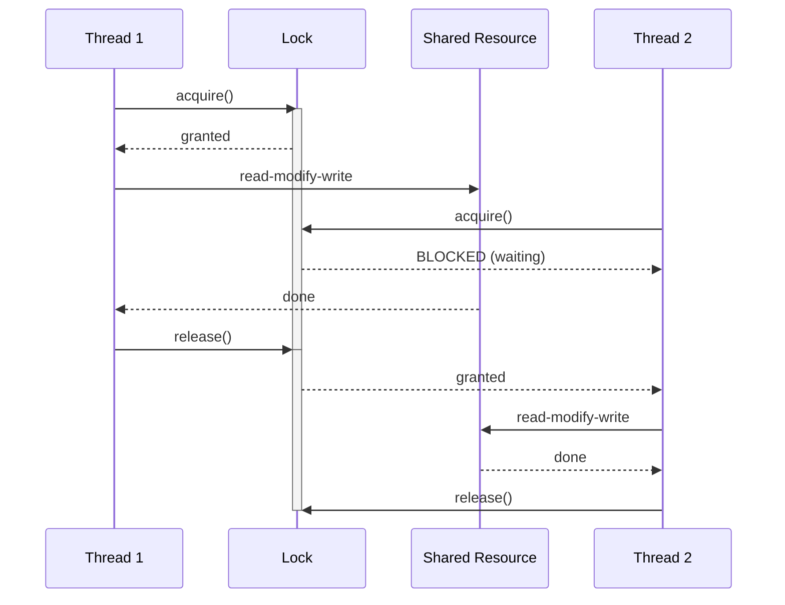

#system-design #lld #concurrency #java

# Concurrency Patterns in LLD

> Thread safety is a **gatekeeper** in SDE-2 interviews. If your design doesn't handle concurrent access, it fails in production.

---

## Why Concurrency Matters in LLD

Almost every real system has concurrent access:
- **Booking system:** Two users book the same seat simultaneously
- **Parking lot:** Two cars try to claim the last spot
- **Rate limiter:** 1000 requests/second hitting the counter
- **Cache:** Multiple threads read/write the same key

The interviewer WILL ask: *"What happens if two users do X at the same time?"*

---

## Concurrency: Race Condition vs Synchronized



---

## Core Java Concurrency Primitives

### 1. `synchronized` — Simplest, Coarsest Lock

```java
// Method-level lock — only one thread can enter at a time
public class Counter {
    private int count = 0;

    public synchronized void increment() {
        count++;  // read-modify-write is now atomic
    }

    public synchronized int getCount() {
        return count;
    }
}

// Block-level lock — finer granularity
public class BankAccount {
    private double balance;
    private final Object lock = new Object();

    public void deposit(double amount) {
        synchronized (lock) {
            balance += amount;
        }
    }

    public void withdraw(double amount) {
        synchronized (lock) {
            if (balance < amount) throw new InsufficientFundsException();
            balance -= amount;
        }
    }
}
```

**When to use:** Simple state, low contention, interview default.

**Downside:** Only one thread at a time — even for reads. Use `ReadWriteLock` if reads dominate.

---

### 2. `ReentrantLock` — Explicit, Flexible Lock

```java
public class ParkingLot {
    private final ReentrantLock lock = new ReentrantLock();
    private final Map<String, ParkingSpot> spots = new HashMap<>();

    public ParkingSpot findAndAssign(VehicleType type) {
        lock.lock();
        try {
            ParkingSpot spot = findAvailableSpot(type);
            if (spot == null) throw new NoSpotAvailableException();
            spot.occupy();
            return spot;
        } finally {
            lock.unlock();  // ALWAYS unlock in finally
        }
    }

    // tryLock — non-blocking attempt (won't block if locked)
    public boolean tryPark(Vehicle vehicle) {
        if (lock.tryLock()) {
            try {
                // park the vehicle
                return true;
            } finally {
                lock.unlock();
            }
        }
        return false;  // lot is busy, try again later
    }
}
```

**ReentrantLock vs synchronized:**
| | `synchronized` | `ReentrantLock` |
|--|--|--|
| Try without blocking | No | `tryLock()` |
| Timeout | No | `tryLock(timeout, unit)` |
| Interruptible | No | `lockInterruptibly()` |
| Fairness | No | `new ReentrantLock(true)` |
| Explicit unlock needed | No | Yes (always in finally) |

---

### 3. `ReadWriteLock` — Concurrent Reads, Exclusive Writes

```java
// Pattern: Many readers OK simultaneously, writers need exclusive access
public class ConfigService {
    private final ReadWriteLock rwLock   = new ReentrantReadWriteLock();
    private final Lock readLock          = rwLock.readLock();
    private final Lock writeLock         = rwLock.writeLock();
    private final Map<String, String> config = new HashMap<>();

    // Multiple threads can read simultaneously
    public String get(String key) {
        readLock.lock();
        try {
            return config.get(key);
        } finally {
            readLock.unlock();
        }
    }

    // Only one thread can write, and no readers during write
    public void put(String key, String value) {
        writeLock.lock();
        try {
            config.put(key, value);
        } finally {
            writeLock.unlock();
        }
    }
}
```

**Use when:** Read-heavy workload (cache, config, leaderboard). Reads don't block each other.

---

### 4. `AtomicInteger` / `AtomicLong` — Lock-Free Counters

```java
// Rate limiter counter — no locks needed, CAS (Compare-And-Swap) under the hood
public class RateLimiter {
    private final AtomicInteger requestCount = new AtomicInteger(0);
    private final int limit;

    public RateLimiter(int limit) { this.limit = limit; }

    public boolean allowRequest() {
        int current = requestCount.incrementAndGet();
        return current <= limit;
    }

    public void reset() {
        requestCount.set(0);
    }
}

// AtomicReference — atomically swap object reference
public class CacheEntry<T> {
    private final AtomicReference<T> value = new AtomicReference<>();

    public T get()           { return value.get(); }
    public void set(T v)     { value.set(v); }

    // CAS: only update if current value is expected
    public boolean compareAndSet(T expected, T newValue) {
        return value.compareAndSet(expected, newValue);
    }
}
```

**Atomic classes:** `AtomicInteger`, `AtomicLong`, `AtomicBoolean`, `AtomicReference`
**Use when:** Simple counter/flag updates. Much faster than synchronized for high contention.

---

### 5. `ConcurrentHashMap` — Thread-Safe Map

```java
// Regular HashMap is NOT thread-safe
// Collections.synchronizedMap() locks the entire map (coarse)
// ConcurrentHashMap uses segment locking (fine-grained, much faster)

public class SessionStore {
    private final ConcurrentHashMap<String, Session> sessions = new ConcurrentHashMap<>();

    public Session getOrCreate(String userId) {
        // computeIfAbsent is atomic — no race condition
        return sessions.computeIfAbsent(userId, id -> new Session(id));
    }

    public void remove(String userId) {
        sessions.remove(userId);
    }

    // merge — atomic read-modify-write
    public void incrementLoginCount(String userId) {
        sessions.merge(userId, new Session(userId), (existing, newOne) -> {
            existing.incrementLoginCount();
            return existing;
        });
    }
}
```

**Key atomic operations on ConcurrentHashMap:**
```java
map.putIfAbsent(key, value)          // insert only if absent
map.computeIfAbsent(key, mapper)     // compute+insert only if absent
map.computeIfPresent(key, remapper)  // update only if present
map.compute(key, remapper)           // always compute
map.merge(key, value, remapper)      // merge with existing
```

---

## Pattern 1: Producer-Consumer

**Problem:** One thread produces work, another consumes it. Must not lose work or overwhelm consumer.

```java
public class TaskQueue {
    private final BlockingQueue<Task> queue;

    public TaskQueue(int capacity) {
        this.queue = new LinkedBlockingQueue<>(capacity);
    }

    // Producer — blocks if queue is full
    public void submit(Task task) throws InterruptedException {
        queue.put(task);  // blocks until space available
    }

    // Consumer — blocks if queue is empty
    public Task consume() throws InterruptedException {
        return queue.take();  // blocks until item available
    }

    // Non-blocking variants
    public boolean trySubmit(Task task) {
        return queue.offer(task);   // returns false if full, doesn't block
    }

    public Task poll() {
        return queue.poll();        // returns null if empty, doesn't block
    }
}

// Worker thread consuming tasks
public class TaskWorker implements Runnable {
    private final TaskQueue taskQueue;

    public TaskWorker(TaskQueue queue) { this.taskQueue = queue; }

    public void run() {
        while (!Thread.currentThread().isInterrupted()) {
            try {
                Task task = taskQueue.consume();
                task.execute();
            } catch (InterruptedException e) {
                Thread.currentThread().interrupt();
                break;
            }
        }
    }
}

// Usage
TaskQueue queue   = new TaskQueue(100);
ExecutorService workers = Executors.newFixedThreadPool(4);
for (int i = 0; i < 4; i++) {
    workers.submit(new TaskWorker(queue));
}
queue.submit(new SendEmailTask("user@gmail.com"));
```

---

## Pattern 2: Thread-Safe Singleton

```java
// Option 1: Enum Singleton (BEST — thread-safe by JVM, serialization-safe)
public enum DatabasePool {
    INSTANCE;

    private final HikariDataSource dataSource;

    DatabasePool() {
        HikariConfig config = new HikariConfig();
        config.setMaximumPoolSize(20);
        this.dataSource = new HikariDataSource(config);
    }

    public Connection getConnection() throws SQLException {
        return dataSource.getConnection();
    }
}
// Usage: DatabasePool.INSTANCE.getConnection()

// Option 2: Double-Checked Locking (if enum not suitable)
public class ConfigManager {
    private static volatile ConfigManager instance;  // volatile = visibility guarantee

    private ConfigManager() { /* load config */ }

    public static ConfigManager getInstance() {
        if (instance == null) {                     // first check — no lock (fast path)
            synchronized (ConfigManager.class) {
                if (instance == null) {             // second check — with lock (safety)
                    instance = new ConfigManager();
                }
            }
        }
        return instance;
    }
}
```

---

## Pattern 3: Seat/Spot Locking (Booking Systems)

**The classic race condition:** Two users try to book the same seat simultaneously.

```java
public class BookingService {
    private final ConcurrentHashMap<String, String> seatLocks = new ConcurrentHashMap<>();
    private final ScheduledExecutorService lockExpiry = Executors.newSingleThreadScheduledExecutor();

    // Step 1: Temporarily lock the seat (user is on payment page)
    public boolean lockSeat(String seatId, String userId) {
        // putIfAbsent is atomic — only one user can lock a seat
        String existing = seatLocks.putIfAbsent(seatId, userId);
        if (existing != null) {
            return false;  // already locked by someone else
        }

        // Auto-release lock after 10 minutes (payment timeout)
        lockExpiry.schedule(() -> seatLocks.remove(seatId, userId), 10, TimeUnit.MINUTES);
        return true;
    }

    // Step 2: Confirm booking (called after payment succeeds)
    public synchronized Booking confirm(String seatId, String userId) {
        String lockHolder = seatLocks.get(seatId);
        if (!userId.equals(lockHolder)) {
            throw new SeatNotLockedException("You don't hold the lock for seat " + seatId);
        }

        Booking booking = createBooking(seatId, userId);
        seatLocks.remove(seatId);  // release lock — seat is now permanently booked
        return booking;
    }

    // Step 3: Release lock (user abandoned checkout)
    public void releaseLock(String seatId, String userId) {
        seatLocks.remove(seatId, userId);  // only removes if this user holds the lock
    }
}
```

---

## Pattern 4: Rate Limiter (Token Bucket)

```java
public class TokenBucketRateLimiter {
    private final int maxTokens;
    private final int refillRatePerSecond;
    private int currentTokens;
    private long lastRefillTime;
    private final Object lock = new Object();

    public TokenBucketRateLimiter(int maxTokens, int refillRatePerSecond) {
        this.maxTokens           = maxTokens;
        this.refillRatePerSecond = refillRatePerSecond;
        this.currentTokens       = maxTokens;
        this.lastRefillTime      = System.currentTimeMillis();
    }

    public boolean allowRequest() {
        synchronized (lock) {
            refill();
            if (currentTokens > 0) {
                currentTokens--;
                return true;
            }
            return false;
        }
    }

    private void refill() {
        long now = System.currentTimeMillis();
        long elapsed = now - lastRefillTime;
        int tokensToAdd = (int) (elapsed * refillRatePerSecond / 1000);
        if (tokensToAdd > 0) {
            currentTokens   = Math.min(maxTokens, currentTokens + tokensToAdd);
            lastRefillTime  = now;
        }
    }
}
```

---

## Pattern 5: Read-Through Cache with Concurrent Access

```java
public class UserCache {
    private final ConcurrentHashMap<String, User> cache = new ConcurrentHashMap<>();
    private final UserRepository repository;

    public UserCache(UserRepository repo) { this.repository = repo; }

    // computeIfAbsent is atomic — only ONE thread loads from DB even under high concurrency
    public User get(String userId) {
        return cache.computeIfAbsent(userId, id -> {
            System.out.println("Cache miss — loading from DB: " + id);
            return repository.findById(id);
        });
    }

    public void invalidate(String userId) {
        cache.remove(userId);
    }

    // Refresh: remove and re-fetch
    public User refresh(String userId) {
        cache.remove(userId);
        return get(userId);
    }
}
```

---

## Concurrency in LLD Interviews — What to Say

When interviewer asks "what if two requests come simultaneously?":

```
1. Identify the shared mutable state (e.g., available spots count)
2. Identify the critical section (the read-check-write operation)
3. Choose the right tool:
   - Simple method: synchronized
   - Need tryLock: ReentrantLock
   - Read-heavy: ReadWriteLock
   - Simple counter: AtomicInteger
   - Map: ConcurrentHashMap
   - Queue: BlockingQueue
4. State the trade-off: locking reduces throughput, atomics don't block
```

---

## Common Concurrency Mistakes in LLD

### Mistake 1: Check-Then-Act (non-atomic)
```java
// BAD — race condition between check and act
if (spot.isAvailable()) {        // Thread A checks: true
    spot.occupy();               // Thread B also checks: true → BOTH occupy same spot!
}

// GOOD — atomic check-and-act
public synchronized boolean tryOccupy() {
    if (!available) return false;
    available = false;
    return true;
}
```

### Mistake 2: Iterating while modifying
```java
// BAD — ConcurrentModificationException
for (User user : onlineUsers) {
    if (user.isInactive()) onlineUsers.remove(user);
}

// GOOD — use CopyOnWriteArrayList or collect then remove
onlineUsers.removeIf(User::isInactive);
// OR use ConcurrentHashMap / CopyOnWriteArrayList
```

### Mistake 3: Forgetting volatile on flags
```java
// BAD — JVM may cache running in register, never sees false
private boolean running = true;
public void stop() { running = false; }

// GOOD — volatile ensures visibility across threads
private volatile boolean running = true;
```

### Mistake 4: Deadlock
```java
// BAD — Thread A locks accountA then accountB
//       Thread B locks accountB then accountA → DEADLOCK
public void transfer(Account from, Account to, double amount) {
    synchronized (from) {
        synchronized (to) { /* transfer */ }
    }
}

// GOOD — always lock in consistent order (by ID)
public void transfer(Account from, Account to, double amount) {
    Account first  = from.getId().compareTo(to.getId()) < 0 ? from : to;
    Account second = first == from ? to : from;
    synchronized (first) {
        synchronized (second) { /* transfer */ }
    }
}
```

---

## Quick Reference

| Need | Use |
|------|-----|
| Protect a method | `synchronized` method |
| Protect a block | `synchronized(lock) {}` |
| Non-blocking try | `ReentrantLock.tryLock()` |
| Concurrent reads | `ReadWriteLock` |
| Counter/flag | `AtomicInteger`, `AtomicBoolean` |
| Thread-safe map | `ConcurrentHashMap` |
| Work queue | `LinkedBlockingQueue` |
| One-time init | Enum Singleton |
| Seat/resource lock | `ConcurrentHashMap.putIfAbsent()` |

---

## Links

- [[lld_machine_coding_template]] — 90-min interview guide
- [[../16_java_deep_dive/concurrency_and_threading]] — Deep Java concurrency
- [[lld_booking_system]] — Concurrency in booking
- [[lld_parking_lot]] — Spot locking example
