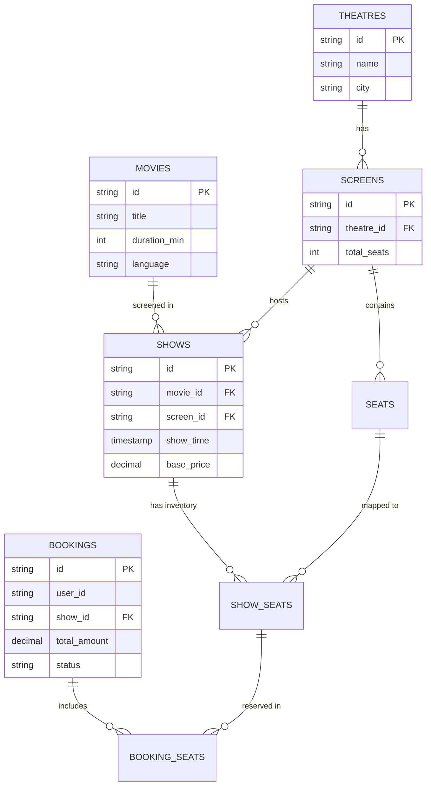

#system-design #lld #database #schema-design

# Database Design for LLD

> The schema IS part of LLD. A bad schema causes bad object models. Design DB alongside your classes.

---

## Why Database Design in LLD?

- Every LLD problem eventually needs persistence
- Schema design reveals if you understand **normalization**, **relationships**, and **indexing**
- SDE-2 interviews often extend LLD problems with: *"How would you persist this?"*
- Poor schema design leads to N+1 queries and performance issues

---

## Booking System ER Diagram



---

## Core Concepts

### Normalization (When to Apply)

```
1NF: No repeating groups, atomic values
  BAD: orders(id, items="item1,item2,item3")  ← items in one column
  GOOD: order_items(order_id, item_id, quantity)  ← separate table

2NF: No partial dependencies (all non-key columns depend on full primary key)
  Mostly matters for composite primary keys

3NF: No transitive dependencies (non-key columns don't depend on other non-key columns)
  BAD: orders(id, customer_id, customer_city)  ← customer_city depends on customer_id
  GOOD: customers(id, city) + orders(id, customer_id)
```

**Rule of thumb:** Normalize to 3NF. Denormalize intentionally for read performance.

---

## Schema Design for Common LLD Problems

### Parking Lot

```sql
-- Core entities
CREATE TABLE parking_lots (
    id          VARCHAR(36) PRIMARY KEY DEFAULT gen_random_uuid(),
    name        VARCHAR(100) NOT NULL,
    address     TEXT,
    created_at  TIMESTAMP DEFAULT NOW()
);

CREATE TABLE parking_spots (
    id          VARCHAR(36) PRIMARY KEY DEFAULT gen_random_uuid(),
    lot_id      VARCHAR(36) NOT NULL REFERENCES parking_lots(id),
    spot_number VARCHAR(10) NOT NULL,
    floor       INT NOT NULL DEFAULT 0,
    spot_type   VARCHAR(20) NOT NULL CHECK (spot_type IN ('BIKE', 'CAR', 'TRUCK')),
    is_occupied BOOLEAN NOT NULL DEFAULT FALSE,
    UNIQUE(lot_id, spot_number)
);

CREATE TABLE tickets (
    id              VARCHAR(36) PRIMARY KEY DEFAULT gen_random_uuid(),
    spot_id         VARCHAR(36) NOT NULL REFERENCES parking_spots(id),
    vehicle_number  VARCHAR(20) NOT NULL,
    vehicle_type    VARCHAR(20) NOT NULL,
    entry_time      TIMESTAMP NOT NULL DEFAULT NOW(),
    exit_time       TIMESTAMP,
    amount_charged  DECIMAL(10, 2),
    status          VARCHAR(20) DEFAULT 'ACTIVE' CHECK (status IN ('ACTIVE', 'CLOSED'))
);

-- Indexes for common queries
CREATE INDEX idx_tickets_vehicle ON tickets(vehicle_number);
CREATE INDEX idx_spots_lot_type ON parking_spots(lot_id, spot_type, is_occupied);
```

### Booking System (Movie Tickets)

```sql
CREATE TABLE movies (
    id          VARCHAR(36) PRIMARY KEY,
    title       VARCHAR(255) NOT NULL,
    duration_min INT NOT NULL,
    language    VARCHAR(50)
);

CREATE TABLE theatres (
    id      VARCHAR(36) PRIMARY KEY,
    name    VARCHAR(255) NOT NULL,
    city    VARCHAR(100) NOT NULL
);

CREATE TABLE screens (
    id          VARCHAR(36) PRIMARY KEY,
    theatre_id  VARCHAR(36) REFERENCES theatres(id),
    screen_name VARCHAR(50) NOT NULL,
    total_seats INT NOT NULL
);

CREATE TABLE seats (
    id          VARCHAR(36) PRIMARY KEY,
    screen_id   VARCHAR(36) REFERENCES screens(id),
    row_name    CHAR(1) NOT NULL,         -- A, B, C...
    seat_number INT NOT NULL,
    seat_class  VARCHAR(20) DEFAULT 'REGULAR',  -- REGULAR, PREMIUM, RECLINER
    UNIQUE(screen_id, row_name, seat_number)
);

CREATE TABLE shows (
    id          VARCHAR(36) PRIMARY KEY,
    movie_id    VARCHAR(36) REFERENCES movies(id),
    screen_id   VARCHAR(36) REFERENCES screens(id),
    show_time   TIMESTAMP NOT NULL,
    base_price  DECIMAL(10, 2) NOT NULL,
    UNIQUE(screen_id, show_time)  -- one show per screen per time slot
);

-- Seat inventory per show (denormalized for performance)
CREATE TABLE show_seats (
    id          VARCHAR(36) PRIMARY KEY,
    show_id     VARCHAR(36) REFERENCES shows(id),
    seat_id     VARCHAR(36) REFERENCES seats(id),
    status      VARCHAR(20) DEFAULT 'AVAILABLE',
    -- AVAILABLE, LOCKED, BOOKED
    locked_by   VARCHAR(36),        -- user_id holding the lock
    locked_until TIMESTAMP,          -- lock expiry
    UNIQUE(show_id, seat_id)
);

CREATE TABLE bookings (
    id              VARCHAR(36) PRIMARY KEY,
    user_id         VARCHAR(36) NOT NULL,
    show_id         VARCHAR(36) REFERENCES shows(id),
    total_amount    DECIMAL(10, 2) NOT NULL,
    status          VARCHAR(20) DEFAULT 'PENDING',
    -- PENDING, CONFIRMED, CANCELLED
    idempotency_key VARCHAR(255) UNIQUE,
    created_at      TIMESTAMP DEFAULT NOW()
);

CREATE TABLE booking_seats (
    booking_id  VARCHAR(36) REFERENCES bookings(id),
    show_seat_id VARCHAR(36) REFERENCES show_seats(id),
    price       DECIMAL(10, 2) NOT NULL,
    PRIMARY KEY(booking_id, show_seat_id)
);

-- Critical index — finding available seats for a show
CREATE INDEX idx_show_seats_status ON show_seats(show_id, status);
```

### Ride Sharing (Uber-like)

```sql
CREATE TABLE users (
    id          VARCHAR(36) PRIMARY KEY,
    name        VARCHAR(255) NOT NULL,
    phone       VARCHAR(20) UNIQUE NOT NULL,
    email       VARCHAR(255) UNIQUE,
    user_type   VARCHAR(20) NOT NULL CHECK (user_type IN ('RIDER', 'DRIVER', 'BOTH')),
    created_at  TIMESTAMP DEFAULT NOW()
);

CREATE TABLE vehicles (
    id              VARCHAR(36) PRIMARY KEY,
    driver_id       VARCHAR(36) REFERENCES users(id),
    registration    VARCHAR(20) UNIQUE NOT NULL,
    vehicle_type    VARCHAR(20) NOT NULL,  -- BIKE, AUTO, SEDAN, SUV
    model           VARCHAR(100),
    year            INT
);

CREATE TABLE ride_requests (
    id                  VARCHAR(36) PRIMARY KEY,
    rider_id            VARCHAR(36) REFERENCES users(id),
    driver_id           VARCHAR(36) REFERENCES users(id),
    vehicle_id          VARCHAR(36) REFERENCES vehicles(id),
    pickup_lat          DECIMAL(10, 8) NOT NULL,
    pickup_lng          DECIMAL(11, 8) NOT NULL,
    pickup_address      TEXT,
    dropoff_lat         DECIMAL(10, 8) NOT NULL,
    dropoff_lng         DECIMAL(11, 8) NOT NULL,
    dropoff_address     TEXT,
    status              VARCHAR(30) NOT NULL DEFAULT 'REQUESTED',
    -- REQUESTED, DRIVER_ASSIGNED, DRIVER_ARRIVED, IN_PROGRESS, COMPLETED, CANCELLED
    requested_at        TIMESTAMP DEFAULT NOW(),
    driver_assigned_at  TIMESTAMP,
    pickup_at           TIMESTAMP,
    dropoff_at          TIMESTAMP,
    estimated_fare      DECIMAL(10, 2),
    final_fare          DECIMAL(10, 2),
    distance_km         DECIMAL(6, 2),
    cancellation_reason TEXT
);

CREATE TABLE driver_locations (
    driver_id   VARCHAR(36) PRIMARY KEY REFERENCES users(id),
    latitude    DECIMAL(10, 8) NOT NULL,
    longitude   DECIMAL(11, 8) NOT NULL,
    is_available BOOLEAN DEFAULT TRUE,
    updated_at  TIMESTAMP DEFAULT NOW()
);

CREATE TABLE ratings (
    id          VARCHAR(36) PRIMARY KEY,
    ride_id     VARCHAR(36) REFERENCES ride_requests(id),
    rater_id    VARCHAR(36) REFERENCES users(id),
    rated_id    VARCHAR(36) REFERENCES users(id),
    rating      INT CHECK (rating BETWEEN 1 AND 5),
    comment     TEXT,
    created_at  TIMESTAMP DEFAULT NOW()
);

-- Geospatial index for finding nearby drivers
CREATE INDEX idx_driver_location ON driver_locations USING GIST (
    ST_MakePoint(longitude, latitude)
);
```

### Expense Splitting (Splitwise-like)

```sql
CREATE TABLE groups (
    id          VARCHAR(36) PRIMARY KEY,
    name        VARCHAR(255) NOT NULL,
    created_by  VARCHAR(36) REFERENCES users(id),
    created_at  TIMESTAMP DEFAULT NOW()
);

CREATE TABLE group_members (
    group_id    VARCHAR(36) REFERENCES groups(id),
    user_id     VARCHAR(36) REFERENCES users(id),
    joined_at   TIMESTAMP DEFAULT NOW(),
    PRIMARY KEY(group_id, user_id)
);

CREATE TABLE expenses (
    id              VARCHAR(36) PRIMARY KEY,
    group_id        VARCHAR(36) REFERENCES groups(id),
    paid_by         VARCHAR(36) REFERENCES users(id),
    description     VARCHAR(255) NOT NULL,
    total_amount    DECIMAL(12, 2) NOT NULL,
    split_type      VARCHAR(20) NOT NULL,  -- EQUAL, EXACT, PERCENTAGE
    currency        VARCHAR(3) DEFAULT 'INR',
    created_at      TIMESTAMP DEFAULT NOW()
);

CREATE TABLE expense_splits (
    id          VARCHAR(36) PRIMARY KEY,
    expense_id  VARCHAR(36) REFERENCES expenses(id),
    user_id     VARCHAR(36) REFERENCES users(id),
    owed_amount DECIMAL(12, 2) NOT NULL,  -- what this user owes for this expense
    is_settled  BOOLEAN DEFAULT FALSE
);

-- Settlements between users (debt simplification results)
CREATE TABLE settlements (
    id          VARCHAR(36) PRIMARY KEY,
    group_id    VARCHAR(36) REFERENCES groups(id),
    payer_id    VARCHAR(36) REFERENCES users(id),
    payee_id    VARCHAR(36) REFERENCES users(id),
    amount      DECIMAL(12, 2) NOT NULL,
    settled_at  TIMESTAMP,
    status      VARCHAR(20) DEFAULT 'PENDING'  -- PENDING, COMPLETED
);

CREATE INDEX idx_expense_splits_user ON expense_splits(user_id, is_settled);
CREATE INDEX idx_settlements_group ON settlements(group_id, status);
```

---

## Indexing Strategy

### When to Add an Index

```sql
-- 1. Primary key — automatic
-- 2. Foreign keys — almost always index
-- 3. Columns in WHERE clause
-- 4. Columns in ORDER BY
-- 5. Columns in JOIN conditions

-- Example: Booking system common queries
-- "Find all bookings for a user"
CREATE INDEX idx_bookings_user ON bookings(user_id);

-- "Find available seats for a show"
CREATE INDEX idx_show_seats ON show_seats(show_id, status);

-- "Find active locks for cleanup job"
CREATE INDEX idx_show_seats_lock ON show_seats(locked_until) WHERE status = 'LOCKED';
-- ^ Partial index — only indexes locked seats (much smaller)
```

### Index Trade-offs

```
Benefits: Fast reads
Costs:
  - Slower writes (index must be updated on INSERT/UPDATE/DELETE)
  - Storage overhead
  - Too many indexes → query planner confusion

Rule: Add index when query is slow. Don't pre-add "just in case".
```

---

## Handling Concurrent Database Updates

### Optimistic Locking (no DB lock, check version)

```sql
-- Add version column to track concurrent updates
ALTER TABLE bookings ADD COLUMN version INT DEFAULT 0;

-- Application code: read version, then update only if version unchanged
UPDATE bookings
SET status = 'CONFIRMED', version = version + 1
WHERE id = 'booking-123' AND version = 5;  -- fails if someone else updated

-- Check affected rows: 0 rows = someone else updated → retry or fail
```

```java
public void confirmBooking(String bookingId, int expectedVersion) {
    int rowsAffected = jdbcTemplate.update(
        "UPDATE bookings SET status='CONFIRMED', version=version+1 WHERE id=? AND version=?",
        bookingId, expectedVersion
    );
    if (rowsAffected == 0) {
        throw new OptimisticLockException("Booking was modified concurrently");
    }
}
```

### Pessimistic Locking (DB lock, for critical operations)

```sql
-- Lock row before reading (other transactions wait)
SELECT * FROM show_seats
WHERE show_id = 'show-123' AND seat_id = 'seat-A5'
FOR UPDATE;  -- exclusive lock until transaction commits

-- Use for: payment processing, seat booking, inventory reservation
```

---

## ORM Mapping (Java/Hibernate)

```java
@Entity
@Table(name = "bookings",
       indexes = @Index(name = "idx_bookings_user", columnList = "user_id"))
public class Booking {
    @Id
    @GeneratedValue(strategy = GenerationType.UUID)
    private String id;

    @ManyToOne(fetch = FetchType.LAZY)  // LAZY — don't load user unless needed
    @JoinColumn(name = "user_id")
    private User user;

    @OneToMany(mappedBy = "booking",
               cascade = CascadeType.ALL,
               orphanRemoval = true)
    private List<BookingSeat> seats = new ArrayList<>();

    @Enumerated(EnumType.STRING)  // store as "CONFIRMED" not 1
    private BookingStatus status;

    @Version  // optimistic locking
    private int version;

    @CreationTimestamp
    private LocalDateTime createdAt;
}
```

**Common N+1 Problem:**
```java
// BAD — 1 query for bookings + N queries for each user
List<Booking> bookings = bookingRepo.findAll();
bookings.forEach(b -> System.out.println(b.getUser().getName())); // N DB calls!

// GOOD — fetch join in one query
@Query("SELECT b FROM Booking b JOIN FETCH b.user WHERE b.status = :status")
List<Booking> findByStatusWithUser(@Param("status") BookingStatus status);
```

---

## Quick Reference

| Concept | Use When |
|---------|---------|
| Composite index | Queries filter on multiple columns together |
| Partial index | Queries always have a condition (WHERE status='ACTIVE') |
| Optimistic locking | Low contention, read-heavy, retry is OK |
| Pessimistic locking | High contention, payment/booking critical ops |
| Denormalization | Read performance is critical, writes are rare |
| UUID vs Auto-increment | UUID: distributed safe. Auto-increment: simpler, faster |

---

## Links

- [[lld_machine_coding_template]] — When to discuss DB in interviews
- [[../02_building_blocks/database_scaling]] — Scaling the DB
- [[../16_java_deep_dive/spring_boot_production]] — Spring Data, HikariCP
