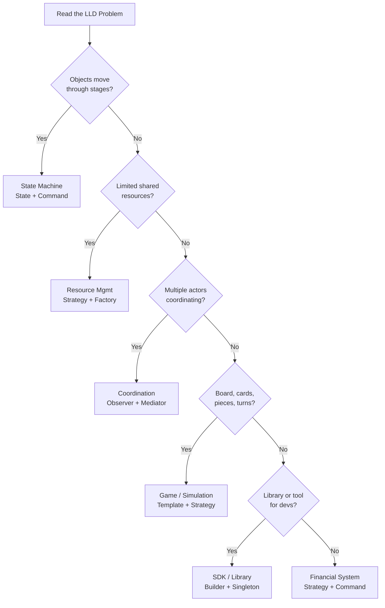

#system-design #lld #interview #question-bank

# LLD Interview Question Bank

> 50+ LLD questions categorized by type, difficulty, and company. Use this to practice identifying problem types quickly.

---

## How to Use This

1. **Timer drill:** Pick a question, set timer for 10 min, write class diagram only
2. **Pattern recognition:** For each question, identify: problem type + key patterns before looking at hints
3. **Company prep:** Focus on the company sections for your target interviews

---

## Problem Type Decision Tree



---

## Quick Problem Type Identifier

Before diving into any LLD problem, classify it:

| If the problem involves... | Type | Go-to Patterns |
|---|---|---|
| Objects moving through stages (order: pending→confirmed→shipped) | State Machine | State, Command |
| Limited shared resources (seats, spots, rooms) | Resource Management | Strategy, Factory, Proxy |
| Multiple actors coordinating (driver-rider, buyer-seller) | Coordination | Observer, Mediator |
| Board/cards/pieces (chess, snake, cards) | Game/Simulation | Template Method, Strategy, Composite |
| A library/tool for other developers | SDK/Library | Singleton, Builder, Factory, Chain of Responsibility |
| Money, debts, splits, payments | Financial | Strategy, Command, Memento |
| Tree/hierarchy structures | Hierarchical | Composite, Visitor |

---

## Category 1: State Machine Problems

These require the **State Pattern** as the backbone.

| # | Problem | Difficulty | Company | Key Patterns |
|---|---------|-----------|---------|-------------|
| 1 | Order Management System | Easy | Flipkart, Amazon | State, Observer |
| 2 | Elevator System | Medium | Microsoft, Amazon | State, Strategy |
| 3 | Vending Machine | Medium | Everywhere | State, Factory |
| 4 | ATM Machine | Medium | Banks, Fintech | State, Command |
| 5 | Traffic Light Controller | Easy | Startups | State |
| 6 | Food Delivery Tracking | Medium | Swiggy, Zomato | State, Observer |
| 7 | Subscription Lifecycle | Medium | Netflix, Spotify | State, Strategy |
| 8 | Ride Request Flow | Hard | Uber, Ola | State, Observer, Strategy |
| 9 | Loan Application Workflow | Hard | Fintech | State, Command |
| 10 | Hotel Room Booking | Medium | OYO, Airbnb | State, Factory |

**Practice Question — Vending Machine:**
```
Design a vending machine that:
- Has items with prices and quantities
- Accepts coins/notes (₹1, ₹2, ₹5, ₹10, ₹50, ₹100)
- Dispenses item when enough money inserted
- Returns change
- Has states: IDLE, HAS_MONEY, DISPENSING, OUT_OF_STOCK

Key states:
IDLE → insert money → HAS_MONEY
HAS_MONEY → select item (enough money) → DISPENSING → IDLE
HAS_MONEY → select item (not enough money) → HAS_MONEY (add more)
HAS_MONEY → cancel → IDLE (return money)
Any state → item sold out → OUT_OF_STOCK
```

---

## Category 2: Resource Management Problems

These require managing a pool of limited resources.

| # | Problem | Difficulty | Company | Key Patterns |
|---|---------|-----------|---------|-------------|
| 11 | Parking Lot | Easy | Everywhere | Strategy, Factory |
| 12 | Movie Ticket Booking | Medium | BookMyShow, Paytm | Strategy, Observer |
| 13 | Hotel Room Management | Medium | OYO, Booking.com | Strategy, Factory |
| 14 | Library Management System | Easy | Classic OOP | Factory, Strategy |
| 15 | Meeting Room Booking | Easy | Atlassian, Microsoft | Strategy |
| 16 | LRU Cache | Medium | Google, Amazon, Meta | N/A (custom data structure) |
| 17 | LFU Cache | Hard | Google | N/A |
| 18 | Connection Pool | Hard | Infrastructure | Singleton, Factory |
| 19 | Thread Pool | Hard | Infrastructure | Factory, Command |
| 20 | Inventory Management | Medium | Amazon, Flipkart | Strategy, Observer |

**Practice Question — Meeting Room Booking:**
```
Design a meeting room booking system that:
- Has multiple rooms with different capacities
- Allows booking rooms for time slots
- Prevents double-booking
- Supports cancellation and rescheduling
- Finds the smallest available room for N people

Clarify: Can slots overlap? (No)
         Can recurring bookings exist? (Bonus)
         Multiple buildings? (Scope: one building)
```

---

## Category 3: Coordination Problems

Multiple actors with complex interactions.

| # | Problem | Difficulty | Company | Key Patterns |
|---|---------|-----------|---------|-------------|
| 21 | Notification System | Easy | Every company | Strategy, Observer, Factory |
| 22 | Food Delivery System | Medium | Swiggy, Zomato | State, Observer, Strategy |
| 23 | Ride Sharing | Hard | Uber, Ola | State, Observer, Strategy |
| 24 | Social Media Feed | Hard | Meta, LinkedIn | Observer, Strategy |
| 25 | Task Management (Jira) | Medium | Atlassian | State, Observer, Command |
| 26 | Chat System | Medium | Slack, Teams | Mediator, Observer |
| 27 | Online Auction | Hard | eBay | Observer, Strategy, State |
| 28 | Event Booking | Medium | Ticketmaster | Strategy, Observer |
| 29 | Cab Dispatch | Hard | Uber, Rapido | Strategy, Observer |
| 30 | Splitwise | Medium | Fintech | Strategy, Command |

**Practice Question — Notification System:**
```
Design a notification service that:
- Sends notifications via SMS, Email, Push, WhatsApp
- Supports retry on failure (3 retries with backoff)
- Supports templates with variable substitution
- Allows enabling/disabling channels per user preferences
- Logs delivery status

Core design decision: Channel selection = Strategy pattern
                      Retry logic = Chain of Responsibility or Decorator
                      Template = Builder pattern
```

---

## Category 4: Game/Simulation Problems

Turn-based, rule-heavy systems.

| # | Problem | Difficulty | Company | Key Patterns |
|---|---------|-----------|---------|-------------|
| 31 | Chess | Medium | Google, Microsoft | Strategy, Template Method |
| 32 | Snake and Ladder | Easy | Startups | Template Method, Strategy |
| 33 | Tic-Tac-Toe | Easy | Warm-up | Template Method |
| 34 | Card Game (Teen Patti) | Medium | Indian startups | Strategy, State |
| 35 | Bowling Game | Easy | Classic | Template Method |
| 36 | Ludo | Medium | Product companies | State, Observer |
| 37 | Battleship | Hard | Problem-solving round | Composite, Strategy |

**Practice Question — Snake and Ladder:**
```
Design Snake and Ladder that:
- Supports 2-4 players
- Configurable board size (default 100 cells)
- Configurable snakes and ladders
- Dice rolling (1-6)
- Turn management
- Win detection

Extension: What if we add power-up cells? What changes?
```

---

## Category 5: SDK/Library Problems

Designing reusable components.

| # | Problem | Difficulty | Company | Key Patterns |
|---|---------|-----------|---------|-------------|
| 38 | Logger Framework | Easy | Everywhere | Singleton, Chain of Responsibility, Strategy |
| 39 | Rate Limiter | Medium | Stripe, Cloudflare | Strategy, Factory |
| 40 | Pub-Sub System | Medium | Google, Stripe | Observer, Mediator, Factory |
| 41 | Event Bus | Medium | Backend companies | Observer, Mediator |
| 42 | Circuit Breaker | Hard | SRE roles | State, Strategy |
| 43 | Cache Library | Medium | Google, Amazon | Strategy, Factory |
| 44 | HTTP Client Library | Hard | Infrastructure | Builder, Decorator, Chain |

**Practice Question — Rate Limiter:**
```
Design a rate limiter library that:
- Supports multiple algorithms (Token Bucket, Fixed Window, Sliding Window)
- Per-user and per-API rate limits
- Configurable limits (100 req/min, 1000 req/hour)
- Thread-safe (concurrent requests)
- Returns headers: X-RateLimit-Remaining, X-RateLimit-Reset

Core patterns:
  Strategy: algorithm selection
  Factory: create the right limiter
  Decorator: compose multiple limits (per-user + per-API)
```

---

## Category 6: Financial Problems

Money movements, calculations, reconciliation.

| # | Problem | Difficulty | Company | Key Patterns |
|---|---------|-----------|---------|-------------|
| 45 | Expense Splitter (Splitwise) | Medium | Fintech | Strategy, Command |
| 46 | Payment Gateway | Hard | Stripe, Razorpay | Strategy, State, Command |
| 47 | ATM | Medium | Banks | State, Command |
| 48 | Stock Trading | Hard | Zerodha, Goldman | Observer, Strategy, Command |
| 49 | Shopping Cart with Discounts | Easy | Amazon, Flipkart | Strategy, Composite |
| 50 | Subscription Billing | Hard | Netflix, Chargebee | State, Strategy, Command |
| 51 | Bank Account Transfers | Medium | Banks, Neo-banks | Command, Memento |
| 52 | Invoice Generation | Easy | SaaS companies | Builder, Strategy |

**Practice Question — Shopping Cart with Discounts:**
```
Design a shopping cart that:
- Add/remove items
- Apply promo codes (FLAT50, PERCENTAGE10, BOGO)
- Stacking rules: only one promo per order
- Tax calculation by item category
- Final bill generation

Discount = Strategy pattern
Tax rule = Strategy pattern
Cart item = Builder pattern
Bill = Builder pattern

Extension: What if we add cashback (applied after payment)?
```

---

## Common Follow-Up Questions (Any Problem)

These are asked in virtually every LLD interview:

```
1. "How would you make this thread-safe?"
   → Add synchronization / ConcurrentHashMap / AtomicInteger

2. "How would you scale this to multiple servers?"
   → Distributed locking (Redis SETNX), shared DB, message queue

3. "How would you add persistence?"
   → Schema design, Repository pattern, ORM

4. "How would you add a new [feature] without changing existing code?"
   → Open-Closed Principle, Strategy pattern, Observer pattern

5. "What if the [external service] fails?"
   → Circuit Breaker, retry with backoff, fallback

6. "How would you monitor this system?"
   → Metrics (success/failure rates), logging, alerting

7. "How would you add multi-tenancy?"
   → Tenant ID in every entity, Strategy for tenant-specific rules
```

---

## Company-Specific Question Patterns

### Flipkart / Meesho
- Focus: Machine coding — working code in 90 min
- Common: Parking lot, Booking, Order management, Inventory
- Expects: Full implementation, design patterns visible, tests
- Gatekeeper: Code must compile and run

### Swiggy / Zomato
- Focus: State machines + coordination problems
- Common: Food delivery, Notification system, Restaurant management
- Expects: Concurrency handling, clean state transitions

### Uber / Ola / Rapido
- Focus: Real-time coordination, location-based
- Common: Ride sharing, Cab dispatch, Driver allocation
- Expects: Strategy for dispatch, Observer for status updates

### Stripe / Razorpay / PhonePe
- Focus: Financial systems + API design
- Common: Payment gateway, Rate limiter, Idempotency
- Expects: Edge cases, error handling, idempotency, API design

### Google / Meta
- Focus: Design discussion over working code
- Common: Cache design, Social feed, Pub-sub
- Expects: Trade-off discussion, extensibility, clean interfaces

### Amazon
- Focus: Leadership principles + working code
- Common: Inventory, Shopping cart, Order management
- Expects: Customer obsession scenarios, edge cases

### Atlassian
- Focus: Collaborative tools
- Common: Task management, Meeting rooms, Wiki design
- Expects: Clean OOP, extensibility

---

## 30-Day LLD Practice Plan

```
Week 1: Foundations
  Day 1-2: SOLID + refactoring
  Day 3-4: All creational patterns
  Day 5-6: All structural patterns
  Day 7: All behavioral patterns

Week 2: Easy Problems (30 min each)
  Day 8:  Parking Lot
  Day 9:  Vending Machine
  Day 10: Logger Framework
  Day 11: Snake and Ladder
  Day 12: Shopping Cart
  Day 13: Meeting Room Booking
  Day 14: Review + one-change test all 6

Week 3: Medium Problems (60 min each)
  Day 15: Elevator System
  Day 16: Notification System
  Day 17: Movie Booking
  Day 18: Splitwise
  Day 19: ATM Machine
  Day 20: Task Management (Jira)
  Day 21: Review + concurrency addition

Week 4: Hard Problems (90 min each)
  Day 22: Food Delivery
  Day 23: Rate Limiter
  Day 24: Ride Sharing
  Day 25: Payment Gateway
  Day 26: Social Media Feed
  Day 27: Stock Trading
  Day 28-30: Mock interviews (any random problem, timed)
```

---

## Links

- [[lld_machine_coding_template]] — 90-min execution guide
- [[problem_taxonomy_lld]] — Detailed taxonomy
- [[lld_thinking_system]] — Full LLD pipeline
- [[../17_company_interview_guide/]] — Company-specific interview formats
