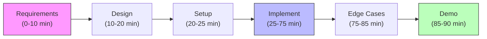

#system-design #lld #interview #machine-coding

# Machine Coding Template — 90-Minute Interview Guide

> This is your battle plan for any machine coding round. Follow this every time until it becomes muscle memory.

---

## What Is Machine Coding?

A **machine coding round** is a timed (60–120 min) interview where you write working, runnable code for a real-world system from scratch. Unlike DSA, the focus is:

- Clean OOP design (not just correctness)
- Proper use of design patterns
- Extensible, modifiable code
- No compilation errors
- Often: running tests or a working demo

**Who uses it:** Flipkart, Meesho, Swiggy, Zomato, Uber, PhonePe, CRED, Groww, Razorpay, Atlassian, Adobe

---

## The 90-Minute Timeline (Visual)



## The 90-Minute Timeline

```
00:00 – 10:00  → Requirements Clarification (DO NOT SKIP)
10:00 – 20:00  → Design: Classes, Interfaces, Relationships
20:00 – 25:00  → Folder structure + boilerplate setup
25:00 – 75:00  → Implementation (core logic)
75:00 – 85:00  → Edge cases + error handling
85:00 – 90:00  → Demo + explain design decisions
```

### If 60-minute round, compress to:
```
00:00 – 08:00  → Requirements
08:00 – 15:00  → Design
15:00 – 55:00  → Implementation
55:00 – 60:00  → Demo
```

---

## Step 1: Requirements Clarification (10 min)

**Never start coding immediately.** Ask these questions first:

### Functional Requirements
```
1. What are the core entities? (e.g., User, Vehicle, Slot, Ticket)
2. What are the must-have operations? (park, unpark, search)
3. What are the constraints? (capacity, vehicle types, floors)
4. What should the system output? (print receipt? return object? throw exception?)
```

### Non-Functional Requirements
```
5. Single-threaded or concurrent? (crucial for design)
6. Persistence needed or in-memory is fine?
7. Scale: 1 parking lot or multiple?
8. Should I write tests?
```

### Write requirements on paper/IDE comment before touching code:
```java
/*
 * REQUIREMENTS:
 * - Park vehicles (Bike, Car, Truck) in appropriate spots
 * - Unpark by ticket number
 * - Dynamic pricing: hourly rate varies by vehicle type
 * - Find nearest available spot
 * - Concurrent: multiple entries/exits simultaneously
 * - In-memory, no DB needed
 * - Print receipt on exit
 */
```

---

## Step 2: Design (10 min)

### Identify Problem Type First
| Your problem looks like... | Type | Key Patterns |
|---|---|---|
| Objects move through stages | State Machine | State, Command |
| Allocate limited resources | Resource Management | Strategy, Factory |
| Coordinate multiple actors | Coordination | Observer, Mediator |
| Board/turn-based game | Game/Simulation | Template Method, Strategy |
| SDK/library for others | SDK/Library | Singleton, Builder, Factory |
| Money/balances/splits | Financial | Strategy, Command |

### Class Design Checklist
```
□ List all nouns → potential classes
□ List all verbs → potential methods
□ Identify relationships (is-a vs has-a)
□ Find what varies → extract as interface/strategy
□ Find what's constant → keep in base class
□ Spot the state → use State pattern if 3+ states
```

### Quick UML on paper
```
ParkingLot ──has──> Floor[]
Floor ──has──> ParkingSpot[]
ParkingSpot ──has──> Vehicle (nullable)
ParkingLot ──uses──> PricingStrategy (interface)
ParkingLot ──creates──> Ticket
```

---

## Step 3: Folder Structure

### Standard structure for machine coding:
```
src/
├── model/           ← Pure data classes (no logic)
│   ├── Vehicle.java
│   ├── ParkingSpot.java
│   └── Ticket.java
├── enums/           ← All enums
│   ├── VehicleType.java
│   └── SpotType.java
├── strategy/        ← Interchangeable algorithms
│   ├── PricingStrategy.java
│   └── HourlyPricing.java
├── service/         ← Business logic
│   └── ParkingLotService.java
├── repository/      ← Data access (if needed)
│   └── TicketRepository.java
├── exception/       ← Custom exceptions
│   ├── NoSpotAvailableException.java
│   └── InvalidTicketException.java
└── Main.java        ← Demo / runner
```

**Rule:** Start with enums → models → interfaces → services. Never the other way.

---

## Step 4: What to Code First (Implementation Order)

```
1. Enums (VehicleType, SpotType, OrderStatus)
2. Model classes (just fields + constructor + getters)
3. Core interfaces (Strategy, Observer, etc.)
4. Service/Manager class skeleton (method signatures first)
5. Fill in simple methods first (getters, finders)
6. Fill in complex business logic
7. Add exception handling
8. Add concurrency if needed
```

**Why this order:** You always have compilable code. If time runs out, you have a partial but working system.

---

## Step 5: Code Quality Checklist

Before calling "done", verify:

```
□ No compilation errors
□ Enums used instead of String constants
□ Interfaces for anything that varies
□ No public fields — use getters/setters or records
□ No god classes (single class doing everything)
□ Custom exceptions with meaningful names
□ Collections initialized (not null)
□ Thread safety if concurrent requirement exists
□ At least one design pattern properly applied
□ Main.java demonstrates all core use cases
```

---

## Step 6: Demo Script (Last 5 min)

Walk the interviewer through this order:
```
1. "Here's the class diagram I designed" → draw on whiteboard/show on screen
2. "Core interfaces are X, Y, Z — this gives us extensibility via OCP"
3. "Main entry point is [ServiceClass]"
4. "Let me demo the happy path" → run main()
5. "Edge case: [relevant edge case]" → show it handled
6. "Extension point: if you add X, only this class changes"
```

---

## Common Interview Traps

### Trap 1: Starting to code immediately
**Fix:** Always spend 8-10 min on requirements. Interviewer will stop you if you over-clarify.

### Trap 2: Returning null
```java
// BAD
public Ticket park(Vehicle v) {
    if (noSpotAvailable) return null;  // caller must null-check
}

// GOOD
public Ticket park(Vehicle v) {
    if (noSpotAvailable) throw new NoSpotAvailableException("All spots full");
}
```

### Trap 3: Using String for type/status
```java
// BAD
String vehicleType = "CAR";
if (vehicleType.equals("CAR")) { ... }

// GOOD
enum VehicleType { BIKE, CAR, TRUCK }
```

### Trap 4: Putting all logic in one class
```java
// BAD — ParkingLot does EVERYTHING
class ParkingLot {
    public double calculatePrice() { /* 50 lines */ }
    public Spot findNearestSpot() { /* 30 lines */ }
    public void sendNotification() { /* 20 lines */ }
}

// GOOD — delegate
class ParkingLot {
    private PricingStrategy pricing;       // delegate
    private SpotFinder spotFinder;         // delegate
    private NotificationService notifier;  // delegate
}
```

### Trap 5: Forgetting to initialize collections
```java
// BAD — NullPointerException waiting to happen
private List<Ticket> tickets;

// GOOD
private List<Ticket> tickets = new ArrayList<>();
private Map<String, Spot> spotMap = new HashMap<>();
```

### Trap 6: Not handling concurrent modifications
```java
// BAD — race condition: two threads park simultaneously, same spot assigned
public Spot findAndAssign(VehicleType type) {
    Spot spot = findAvailable(type);
    spot.setOccupied(true);  // not atomic!
    return spot;
}

// GOOD — synchronized or use AtomicBoolean on spot
public synchronized Spot findAndAssign(VehicleType type) {
    Spot spot = findAvailable(type);
    spot.setOccupied(true);
    return spot;
}
```

---

## Machine Coding Scoring Rubric

Interviewers mentally score on:

| Criterion | Weight | What They Look For |
|-----------|--------|-------------------|
| Requirements clarity | 15% | Did you ask the right questions? |
| Class design | 25% | Clean separation, right abstractions |
| Design patterns | 20% | Patterns applied correctly, not forced |
| Code quality | 20% | Readable, no hacks, proper naming |
| Correctness | 15% | Core use cases work |
| Edge cases | 5% | At least 2-3 edge cases handled |

---

## 5-Minute Emergency Template

If you're running out of time, at minimum have:

```java
// 1. The enum
public enum Status { PENDING, ACTIVE, COMPLETED, CANCELLED }

// 2. The core model
public class Order {
    private final String id;
    private Status status;
    private final List<Item> items;

    public Order(String id) {
        this.id     = UUID.randomUUID().toString();
        this.status = Status.PENDING;
        this.items  = new ArrayList<>();
    }
    // getters, addItem()
}

// 3. The service with skeleton methods
public class OrderService {
    private final Map<String, Order> orders = new HashMap<>();

    public Order create(List<Item> items) { /* TODO */ return null; }
    public void confirm(String orderId)   { /* TODO */ }
    public void cancel(String orderId)    { /* TODO */ }
}
```

Then explain what you WOULD implement given more time. Partial + explained beats incomplete + silent.

---

## Links

- [[lld_thinking_system]] — Full LLD pipeline
- [[problem_taxonomy_lld]] — Identify problem type quickly
- [[lld_concurrency_patterns]] — Thread safety in machine coding
- [[lld_testing_strategy]] — Writing tests in machine coding
- [[solid_with_refactoring]] — SOLID principles to demonstrate
