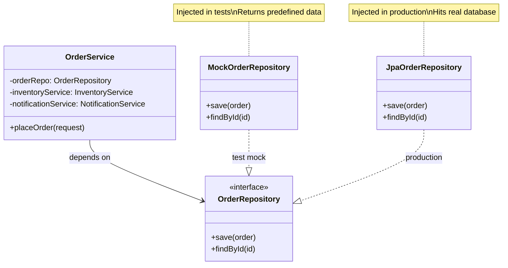

#system-design #lld #testing #java #mockito

# Testing Strategy for LLD

> A good design is one that's **testable**. If your class is hard to test, it's a design smell.

---

## Why Testing Matters in LLD Interviews

- **Flipkart, Meesho, Razorpay** explicitly ask for unit tests in machine coding
- Writing tests demonstrates you understand **separation of concerns**
- Tests prove your edge case handling works
- Test code quality is judged as much as production code

---

## Mock Injection Overview



---

## Testing Pyramid for LLD

```
        ┌─────────────────┐
        │   Integration   │  ← Few, test full flows
        │     Tests       │
        ├─────────────────┤
        │   Unit Tests    │  ← Most, test each class
        │  (Mock deps)    │
        └─────────────────┘
```

**In machine coding:** Focus on unit tests. Write 3-5 targeted tests that cover the happy path + 2 edge cases.

---

## Setup: Minimal Test Dependency

```xml
<!-- pom.xml -->
<dependency>
    <groupId>org.junit.jupiter</groupId>
    <artifactId>junit-jupiter</artifactId>
    <version>5.10.0</version>
    <scope>test</scope>
</dependency>
<dependency>
    <groupId>org.mockito</groupId>
    <artifactId>mockito-core</artifactId>
    <version>5.6.0</version>
    <scope>test</scope>
</dependency>
```

---

## Unit Test Structure — AAA Pattern

Every test follows **Arrange → Act → Assert:**

```java
@Test
void shouldParkVehicleInAvailableSpot() {
    // ARRANGE — set up the scenario
    ParkingLot lot = new ParkingLot(3);
    Vehicle car    = new Vehicle("KA-01-1234", VehicleType.CAR);

    // ACT — do the thing you're testing
    Ticket ticket  = lot.park(car);

    // ASSERT — verify the outcome
    assertNotNull(ticket);
    assertEquals("KA-01-1234", ticket.getVehicleNumber());
    assertEquals(2, lot.getAvailableSpots());
}
```

---

## Mockito — The Most Important Testing Tool

### What is Mocking?

Mocking replaces real dependencies with fakes so you can test one class in isolation.

```
Real: ParkingService → RealDatabase → actual DB call
Test: ParkingService → MockDatabase → returns what YOU specify
```

### Core Mockito Syntax

```java
// 1. Create a mock
UserRepository mockRepo = Mockito.mock(UserRepository.class);
// OR with annotation: @Mock UserRepository mockRepo;

// 2. Stub — define what mock returns
when(mockRepo.findById("user-1"))
    .thenReturn(new User("user-1", "Alice"));

when(mockRepo.findById("invalid"))
    .thenThrow(new UserNotFoundException("invalid"));

// 3. Use in test
UserService service = new UserService(mockRepo);  // inject mock
User user = service.getUser("user-1");

// 4. Verify — assert interactions
verify(mockRepo, times(1)).findById("user-1");
verify(mockRepo, never()).save(any());
```

### Common Mockito Methods

```java
// Stubbing
when(mock.method(arg)).thenReturn(value);
when(mock.method(arg)).thenThrow(exception);
when(mock.method(any())).thenAnswer(inv -> compute(inv.getArgument(0)));

// Argument matchers
any()              // any object
anyString()        // any String
eq("specific")     // exact match
argThat(pred)      // custom predicate

// Verification
verify(mock).method(arg);                    // called exactly once
verify(mock, times(2)).method(arg);          // called twice
verify(mock, never()).method(arg);           // never called
verify(mock, atLeastOnce()).method(arg);     // called ≥1 times
verifyNoMoreInteractions(mock);              // no unexpected calls
```

---

## Testing Design Patterns in LLD

### Testing Strategy Pattern

```java
@Test
void shouldApplyBulkDiscountForLargeOrder() {
    // Strategy is a simple interface — no mocking needed
    PricingStrategy bulkStrategy = new BulkPricingStrategy(0.8); // 20% off
    Order order = new Order(bulkStrategy);

    double total = order.calculateTotal(100.0, 15);

    assertEquals(1200.0, total, 0.001);  // 100 × 15 × 0.8
}

@Test
void shouldApplyPremiumMarkupForPremiumOrder() {
    PricingStrategy premiumStrategy = new PremiumPricingStrategy(1.2);
    Order order = new Order(premiumStrategy);

    double total = order.calculateTotal(100.0, 5);

    assertEquals(600.0, total, 0.001);  // 100 × 5 × 1.2
}
```

### Testing State Pattern

```java
@Test
void shouldTransitionFromPendingToConfirmed() {
    OrderContext order = new OrderContext();  // starts PENDING
    assertEquals("PENDING", order.getStatus());

    order.next();
    assertEquals("CONFIRMED", order.getStatus());
}

@Test
void shouldThrowWhenCancellingShippedOrder() {
    OrderContext order = new OrderContext();
    order.next();  // CONFIRMED
    order.next();  // SHIPPED

    assertThrows(IllegalStateException.class, () -> order.cancel());
}
```

### Testing Observer Pattern

```java
@Test
void shouldNotifyAllSubscribersOnEvent() {
    EventManager events = new EventManager();

    // Mock observers
    EventListener listener1 = mock(EventListener.class);
    EventListener listener2 = mock(EventListener.class);

    events.subscribe("ORDER_PLACED", listener1);
    events.subscribe("ORDER_PLACED", listener2);

    events.notify("ORDER_PLACED", "order-123");

    // Verify both were notified with correct data
    verify(listener1).update("ORDER_PLACED", "order-123");
    verify(listener2).update("ORDER_PLACED", "order-123");
}

@Test
void shouldNotNotifyUnsubscribedListeners() {
    EventManager events = new EventManager();
    EventListener listener = mock(EventListener.class);

    events.subscribe("ORDER_PLACED", listener);
    events.unsubscribe("ORDER_PLACED", listener);
    events.notify("ORDER_PLACED", "order-123");

    verify(listener, never()).update(any(), any());
}
```

### Testing with Dependency Injection

```java
// Well-designed class — dependencies injected via constructor (testable)
public class OrderService {
    private final OrderRepository orderRepo;
    private final InventoryService inventoryService;
    private final NotificationService notificationService;

    public OrderService(OrderRepository repo, InventoryService inv, NotificationService notif) {
        this.orderRepo           = repo;
        this.inventoryService    = inv;
        this.notificationService = notif;
    }

    public Order placeOrder(OrderRequest request) {
        inventoryService.reserve(request.getItems());
        Order order = new Order(request);
        orderRepo.save(order);
        notificationService.sendConfirmation(order);
        return order;
    }
}

// Test — mock all dependencies
@ExtendWith(MockitoExtension.class)
class OrderServiceTest {
    @Mock OrderRepository orderRepo;
    @Mock InventoryService inventoryService;
    @Mock NotificationService notificationService;
    @InjectMocks OrderService orderService;

    @Test
    void shouldSaveOrderAndSendConfirmation() {
        OrderRequest request = new OrderRequest(List.of(new Item("book", 2)));
        when(orderRepo.save(any())).thenAnswer(inv -> inv.getArgument(0));

        Order result = orderService.placeOrder(request);

        assertNotNull(result);
        verify(inventoryService).reserve(request.getItems());
        verify(orderRepo).save(result);
        verify(notificationService).sendConfirmation(result);
    }

    @Test
    void shouldThrowWhenInventoryUnavailable() {
        OrderRequest request = new OrderRequest(List.of(new Item("laptop", 100)));
        doThrow(new InsufficientInventoryException())
            .when(inventoryService).reserve(any());

        assertThrows(InsufficientInventoryException.class,
            () -> orderService.placeOrder(request));

        verify(orderRepo, never()).save(any());  // order not saved if inventory fails
    }
}
```

---

## TDD Flow for Machine Coding

In a machine coding round with TDD requirement:

```
1. Write test → it fails (RED)
2. Write minimum code to pass → it passes (GREEN)
3. Refactor code → still passes (REFACTOR)
4. Repeat
```

**Practical TDD in 90-min machine coding:**
```
Minute 0-10:   Write requirement as failing tests
Minute 10-70:  Implement to make tests pass one by one
Minute 70-85:  Edge case tests + implementation
Minute 85-90:  Demo
```

**Example: Parking Lot TDD**
```java
// Write these tests FIRST — they define the contract
class ParkingLotTest {
    @Test void shouldParkCarInAvailableSpot() { }
    @Test void shouldThrowWhenLotIsFull() { }
    @Test void shouldUnparkByTicket() { }
    @Test void shouldCalculateCorrectFee() { }
    @Test void shouldNotParkBikeInCarSpot() { }
}
// Then implement ParkingLot to make each pass
```

---

## What to Test in 90-Minute Machine Coding

**Minimum viable test suite (5-7 tests):**

```java
// 1. Happy path — core use case works
@Test void shouldSuccessfullyCompleteMainFlow() { }

// 2. Boundary — edge of capacity
@Test void shouldHandleLastAvailableResource() { }

// 3. Full/empty state
@Test void shouldThrowWhenNoResourceAvailable() { }

// 4. Invalid input
@Test void shouldThrowForInvalidInput() { }

// 5. State transition
@Test void shouldCorrectlyTransitionThroughStates() { }

// 6. Concurrent access (if concurrency is a requirement)
@Test void shouldHandleConcurrentRequestsWithoutDuplication() { }

// 7. Business rule
@Test void shouldApplyCorrectPricingForVehicleType() { }
```

---

## Testing Anti-Patterns to Avoid

### Anti-Pattern 1: Testing Implementation, Not Behavior
```java
// BAD — tests internal method (fragile, breaks on refactor)
@Test void shouldCallFindAvailableSpotMethod() {
    ParkingLot lot = spy(new ParkingLot(5));
    lot.park(new Vehicle("KA01", VehicleType.CAR));
    verify(lot).findAvailableSpot(VehicleType.CAR);  // testing internals
}

// GOOD — test observable behavior
@Test void shouldReduceAvailableSpotCountAfterParking() {
    ParkingLot lot = new ParkingLot(5);
    lot.park(new Vehicle("KA01", VehicleType.CAR));
    assertEquals(4, lot.getAvailableSpots());
}
```

### Anti-Pattern 2: Too Many Assertions in One Test
```java
// BAD — if one assertion fails, you don't know which
@Test void shouldParkVehicle() {
    Ticket ticket = lot.park(vehicle);
    assertNotNull(ticket);
    assertEquals("KA01", ticket.getVehicleNumber());
    assertEquals(4, lot.getAvailableSpots());
    assertTrue(ticket.getEntryTime().isBefore(LocalDateTime.now()));
    // 4 things tested — which one failed?
}

// GOOD — focused tests, one concept each
@Test void shouldReturnTicketWithVehicleNumber() { }
@Test void shouldDecrementAvailableSpotsAfterParking() { }
```

### Anti-Pattern 3: Static Methods Make Testing Hard
```java
// BAD — can't mock static methods easily
public class PricingService {
    public static double calculate(double hours, VehicleType type) { ... }
}

// GOOD — instance method, injectable, mockable
public class PricingService {
    public double calculate(double hours, VehicleType type) { ... }
}
```

---

## Quick Mockito Cheat Sheet

```java
// Create mock
MyClass mock = mock(MyClass.class);

// Stub return value
when(mock.method()).thenReturn(value);

// Stub exception
when(mock.method()).thenThrow(new RuntimeException());

// Stub void method
doNothing().when(mock).voidMethod();
doThrow(ex).when(mock).voidMethod();

// Verify call
verify(mock).method();
verify(mock, times(n)).method();
verify(mock, never()).method();

// Capture argument
ArgumentCaptor<Order> captor = ArgumentCaptor.forClass(Order.class);
verify(mock).save(captor.capture());
Order saved = captor.getValue();
assertEquals("expected", saved.getId());

// Annotations (cleaner)
@Mock UserRepository repo;
@InjectMocks UserService service;  // injects all @Mock fields
@Spy UserService realService;      // partial mock — calls real methods
```

---

## Links

- [[lld_machine_coding_template]] — When to write tests in 90-min round
- [[lld_concurrency_patterns]] — Testing concurrent code
- [[solid_with_refactoring]] — Testability comes from good design
- [[code_architecture/dependency_injection]] — DI makes testing possible
