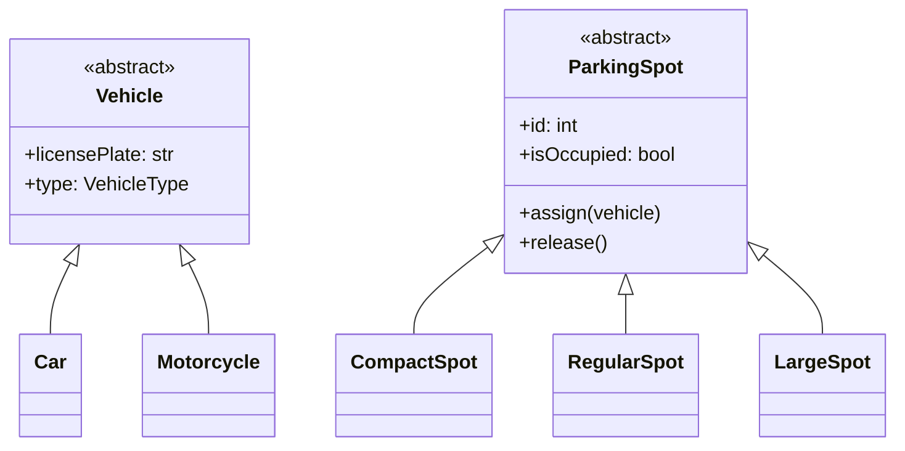

#system-design #lld #framework #thinking

# LLD Thinking System — From Requirements to Classes

## Intuition (30 sec)

LLD is translating real-world things into code. A parking lot has spots, vehicles, tickets, and payment. Each becomes a class. The relationships between them become methods and interfaces. The rules become business logic inside those classes.

---

## The LLD Pipeline


### Step 1: Gather Requirements (2 min)

**Ask:**
- What are the core entities? (nouns = classes)
- What actions can be performed? (verbs = methods)
- What are the business rules/constraints?
- What might change in the future? (design for extensibility here)

### Step 2: CRC Cards — Think Before You Draw (3 min)

For each entity, write a card:

```
┌──────────────────────────────────┐
│ Class: ParkingSpot                │
├──────────────────────────────────┤
│ Responsibilities:                 │
│  • Know if it's occupied          │
│  • Know its type (compact/large)  │
│  • Assign a vehicle               │
│  • Release a vehicle              │
├──────────────────────────────────┤
│ Collaborates with:                │
│  • Vehicle (is assigned to)       │
│  • ParkingFloor (belongs to)      │
│  • Ticket (referenced by)         │
└──────────────────────────────────┘
```

**Why CRC cards?** They force you to think about RESPONSIBILITIES before implementation. A class with too many responsibilities → split it. A class with no collaborators → maybe it shouldn't be a class.

### Step 3: Class Diagram (5 min)

Draw relationships:
- **Is-a** (inheritance): CompactSpot IS-A ParkingSpot
- **Has-a** (composition): ParkingLot HAS-A list of ParkingFloors
- **Uses** (dependency): TicketService USES PricingStrategy



### Step 4: Interfaces First — Design by Contract (3 min)

Before implementation, define the interfaces (WHAT, not HOW):

```python
class PricingStrategy(ABC):
    @abstractmethod
    def calculate_fee(self, hours: float) -> float:
        pass

class PaymentProcessor(ABC):
    @abstractmethod
    def process_payment(self, amount: float) -> PaymentResult:
        pass
```

**Why?** Interfaces make your design extensible. New pricing? New payment method? Just add a new class implementing the interface. Nothing else changes.

### Step 5: Implement (10 min)

Now write the actual classes. The hard thinking is done — implementation follows the design.

### Step 6: One-Change Test (2 min)

Pose 3 changes. Count how many classes need modification:

```
"Add electric vehicle spots"     → 1 new class (EVSpot extends ParkingSpot)
"Add hourly + daily pricing"     → 1 new class (DailyPricing implements PricingStrategy)
"Add credit card payments"       → 1 new class (CreditCardProcessor implements PaymentProcessor)
```

**Good design:** 1-2 classes per change (Open/Closed Principle).
**Bad design:** 5+ classes per change → go back and refactor.

---

## Common LLD Mistakes

| Mistake | Fix |
|---------|-----|
| Starting with code before design | CRC cards → class diagram → THEN code |
| God class (one class does everything) | Split by responsibility (SRP) |
| Deep inheritance hierarchies | Prefer composition over inheritance |
| No interfaces | Always define contracts before implementations |
| Designing for today only | Ask "what might change?" and put interfaces there |
| Over-engineering | Only abstract what NEEDS to vary. Three similar lines > premature abstraction |

---

## Interview Pacing (45-minute LLD interview)

```
Minutes 0-3:   Requirements clarification
Minutes 3-6:   Identify core classes (CRC cards)
Minutes 6-12:  Class diagram with relationships
Minutes 12-15: Key interfaces and design patterns
Minutes 15-40: Code implementation of core classes
Minutes 40-45: Extensibility discussion + one-change test
```

## Links

- [[problem_taxonomy_lld]] — Recognize the LLD problem type
- [[solid_with_refactoring]] — Principles behind good design
- [[design_smell_catalog]] — Diagnose design problems
- [[one_change_test]] — Validate your design
