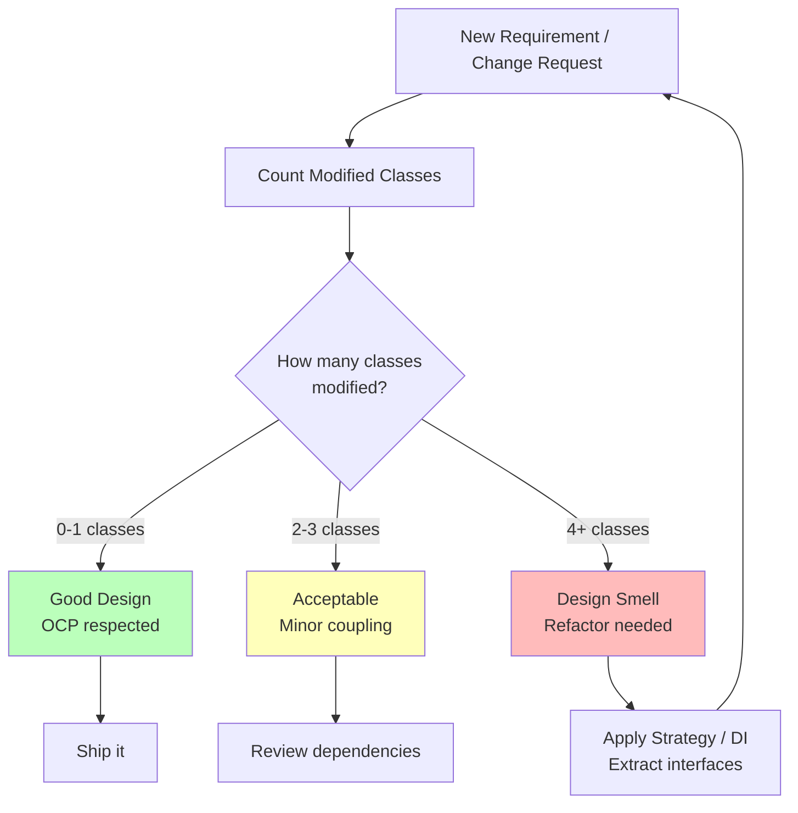

#system-design #lld #validation

# The One-Change Test — Measure Design Quality

## The Rule

> After finishing your design, pose 3 realistic requirement changes. For each, count how many classes need modification.

**Good design:** 1-2 classes change per requirement (usually: 1 new class, 0 modifications)
**Bad design:** 5+ classes change per requirement

---

## One-Change Test Flow

---

## Example: Parking Lot

### Test Changes:

**Change 1:** "Add electric vehicle spots with charging"
- Good: Create `EVSpot extends ParkingSpot` + `ChargingService` → 1-2 new classes, 0 existing modified
- Bad: Modify `ParkingSpot`, `ParkingLot`, `Ticket`, `PricingCalculator` → 4 modifications

**Change 2:** "Add hourly + daily pricing (currently only hourly)"
- Good: Create `DailyPricing implements PricingStrategy` → 1 new class
- Bad: Add if/else to `PricingCalculator.calculate()` → violates Open/Closed

**Change 3:** "Add motorcycle spots (smaller, different pricing)"
- Good: Create `MotorcycleSpot extends ParkingSpot` + `MotorcyclePricing implements PricingStrategy` → 2 new classes
- Bad: Modify `ParkingSpot`, `ParkingLot.findSpot()`, `PricingCalculator` → 3 modifications

---

## Why This Works

The test directly measures:
- **Open/Closed Principle:** Are you adding new code or modifying existing?
- **Single Responsibility:** Does a change ripple across many classes?
- **Dependency Inversion:** Are you depending on abstractions or concretions?
- **Interface Segregation:** Are unrelated classes affected by the change?

---

## How to Fix a Failing Test

| Problem | Fix |
|---------|-----|
| New type requires modifying if/else | Extract interface, use Strategy pattern |
| Adding feature touches many classes | Identify missing abstraction, extract it |
| Can't add new class without modifying others | Check constructor dependencies, use DI |
| Unrelated classes are affected | Split responsibilities, reduce coupling |

---

## Use in Interviews

After presenting your design, proactively say:

> "Let me validate the extensibility. If we need to add EV charging spots, I'd create an EVSpot subclass — no changes to existing code. If we need a new pricing model, I'd add a new PricingStrategy implementation. The design is open for extension."

This is a STRONG signal to interviewers. It shows you think about design quality, not just correctness.

## Links

- [[solid_with_refactoring]] — The principles this test validates
- [[design_smell_catalog]] — What to fix when the test fails
- [[lld_thinking_system]] — Where this test fits in the pipeline
