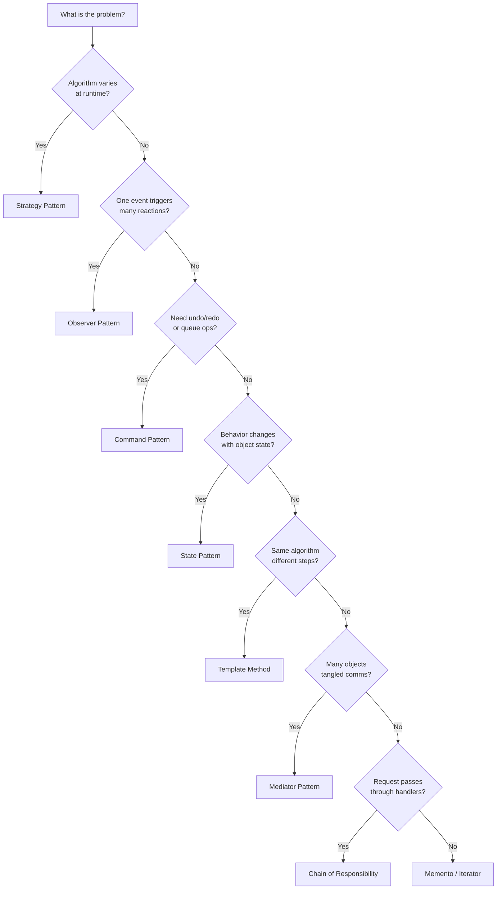

#system-design #lld #patterns #behavioral

```table-of-contents
title: 
style: nestedList # TOC style (nestedList|nestedOrderedList|inlineFirstLevel)
minLevel: 0 # Include headings from the specified level
maxLevel: 0 # Include headings up to the specified level
include: 
exclude: 
includeLinks: true # Make headings clickable
hideWhenEmpty: false # Hide TOC if no headings are found
debugInConsole: false # Print debug info in Obsidian console
```
# Behavioral Patterns — How Objects Communicate (Java)

---

## Which Behavioral Pattern?



---

## Strategy Pattern

**Problem:** Algorithm varies based on context. If/else chains for different behaviors.
**Solution:** Define a family of algorithms, each in its own class.

```java
// Interface
public interface PricingStrategy {
    double calculatePrice(double basePrice, int quantity);
}

// Implementations
public class RegularPricing implements PricingStrategy {
    public double calculatePrice(double basePrice, int quantity) {
        return basePrice * quantity;
    }
}

public class BulkPricing implements PricingStrategy {
    public double calculatePrice(double basePrice, int quantity) {
        return quantity > 10 ? basePrice * quantity * 0.8 : basePrice * quantity;
    }
}

public class PremiumPricing implements PricingStrategy {
    public double calculatePrice(double basePrice, int quantity) {
        return basePrice * quantity * 1.2; // premium markup
    }
}

// Context
public class Order {
    private PricingStrategy strategy;

    public Order(PricingStrategy strategy) {
        this.strategy = strategy;
    }

    public void setStrategy(PricingStrategy strategy) {
        this.strategy = strategy;
    }

    public double getTotal(double basePrice, int quantity) {
        return strategy.calculatePrice(basePrice, quantity);
    }
}

// Usage
Order order = new Order(new BulkPricing());
double total = order.getTotal(100.0, 15); // 80% of 1500 = 1200
order.setStrategy(new RegularPricing());  // Switch at runtime
```

**Use when:** Multiple algorithms for the same task. Replace if/else with polymorphism.

---

## Observer Pattern

**Problem:** Object changes state → multiple objects need to react. Tight coupling.
**Solution:** Subscribe/notify mechanism. Publisher doesn't know who's listening.

```java
// Observer interface
public interface EventListener {
    void update(String eventType, String data);
}

// Publisher
public class EventManager {
    private Map<String, List<EventListener>> listeners = new HashMap<>();

    public void subscribe(String eventType, EventListener listener) {
        listeners.computeIfAbsent(eventType, k -> new ArrayList<>()).add(listener);
    }

    public void unsubscribe(String eventType, EventListener listener) {
        listeners.getOrDefault(eventType, Collections.emptyList()).remove(listener);
    }

    public void notify(String eventType, String data) {
        for (EventListener listener : listeners.getOrDefault(eventType, Collections.emptyList())) {
            listener.update(eventType, data);
        }
    }
}

// Concrete observers
public class EmailAlertListener implements EventListener {
    public void update(String eventType, String data) {
        System.out.println("Email alert: " + eventType + " - " + data);
    }
}

public class SlackNotifier implements EventListener {
    public void update(String eventType, String data) {
        System.out.println("Slack: " + eventType + " - " + data);
    }
}

// Usage
EventManager events = new EventManager();
events.subscribe("order_placed", new EmailAlertListener());
events.subscribe("order_placed", new SlackNotifier());
events.notify("order_placed", "Order #123 for ₹5000");
```

**Use when:** One-to-many dependency. State changes should trigger multiple reactions.

---

## Command Pattern

**Problem:** Need to queue operations, undo them, or log them.
**Solution:** Encapsulate a request as an object.

```java
// Command interface
public interface Command {
    void execute();
    void undo();
}

// Concrete commands
public class PlaceOrderCommand implements Command {
    private OrderService orderService;
    private Order order;

    public PlaceOrderCommand(OrderService service, Order order) {
        this.orderService = service;
        this.order = order;
    }

    public void execute() { orderService.placeOrder(order); }
    public void undo() { orderService.cancelOrder(order); }
}

// Invoker with history (for undo)
public class CommandHistory {
    private Stack<Command> history = new Stack<>();

    public void execute(Command cmd) {
        cmd.execute();
        history.push(cmd);
    }

    public void undo() {
        if (!history.isEmpty()) {
            history.pop().undo();
        }
    }
}
```

**Use when:** Undo/redo, command queues, macro recording, transaction logging.

---

## State Pattern

**Problem:** Object behaves differently based on internal state. Giant switch/case.
**Solution:** Each state is a class with its own behavior.

```java
// State interface
public interface OrderState {
    void next(OrderContext context);
    void cancel(OrderContext context);
    String getStatus();
}

// Concrete states
public class PendingState implements OrderState {
    public void next(OrderContext ctx) { ctx.setState(new ConfirmedState()); }
    public void cancel(OrderContext ctx) { ctx.setState(new CancelledState()); }
    public String getStatus() { return "PENDING"; }
}

public class ConfirmedState implements OrderState {
    public void next(OrderContext ctx) { ctx.setState(new ShippedState()); }
    public void cancel(OrderContext ctx) { ctx.setState(new CancelledState()); }
    public String getStatus() { return "CONFIRMED"; }
}

public class ShippedState implements OrderState {
    public void next(OrderContext ctx) { ctx.setState(new DeliveredState()); }
    public void cancel(OrderContext ctx) {
        throw new IllegalStateException("Cannot cancel shipped order");
    }
    public String getStatus() { return "SHIPPED"; }
}

public class DeliveredState implements OrderState {
    public void next(OrderContext ctx) { /* terminal state */ }
    public void cancel(OrderContext ctx) {
        throw new IllegalStateException("Cannot cancel delivered order");
    }
    public String getStatus() { return "DELIVERED"; }
}

// Context
public class OrderContext {
    private OrderState state;

    public OrderContext() { this.state = new PendingState(); }
    public void setState(OrderState state) { this.state = state; }
    public void next() { state.next(this); }
    public void cancel() { state.cancel(this); }
    public String getStatus() { return state.getStatus(); }
}

// Usage
OrderContext order = new OrderContext();       // PENDING
order.next();                                   // CONFIRMED
order.next();                                   // SHIPPED
order.cancel();                                 // throws IllegalStateException
```

**Use when:** Object with 3+ states and different behavior per state. Replaces switch/case on status.

---

## Template Method

**Problem:** Multiple classes follow the same algorithm but differ in specific steps.
**Solution:** Define the skeleton in a base class, let subclasses override specific steps.

```java
public abstract class DataParser {
    // Template method — defines the skeleton
    public final void parse(String filePath) {
        String rawData = readFile(filePath);
        Object parsed = parseData(rawData);
        validate(parsed);
        store(parsed);
    }

    private String readFile(String path) { /* common logic */ return "data"; }
    protected abstract Object parseData(String raw);
    protected abstract void validate(Object data);
    protected void store(Object data) { /* default: save to DB */ }
}

public class CSVParser extends DataParser {
    protected Object parseData(String raw) { /* CSV-specific parsing */ return null; }
    protected void validate(Object data) { /* CSV validation rules */ }
}

public class JSONParser extends DataParser {
    protected Object parseData(String raw) { /* JSON-specific parsing */ return null; }
    protected void validate(Object data) { /* JSON validation rules */ }
}
```

**Use when:** Same algorithm, different implementations of specific steps.

---

---

## Mediator Pattern

**Problem:** Many objects communicate directly with each other → tangled many-to-many dependencies. Adding one object requires updating all others.

**Solution:** Introduce a mediator that all objects talk to. Objects don't know about each other — only the mediator does.

**Real use:** Chat rooms, air traffic control, UI form coordination, event buses.

```java
// Mediator interface
public interface ChatMediator {
    void sendMessage(String message, User sender);
    void addUser(User user);
}

// Concrete mediator — owns all coordination logic
public class ChatRoom implements ChatMediator {
    private final List<User> users = new ArrayList<>();

    public void addUser(User user) {
        users.add(user);
    }

    public void sendMessage(String message, User sender) {
        for (User user : users) {
            if (user != sender) {           // don't send to self
                user.receive(message, sender.getName());
            }
        }
    }
}

// Colleague — knows only about the mediator, NOT other users
public abstract class User {
    protected ChatMediator mediator;
    protected String name;

    public User(ChatMediator mediator, String name) {
        this.mediator = mediator;
        this.name     = name;
    }

    public String getName() { return name; }
    public abstract void send(String message);
    public abstract void receive(String message, String from);
}

public class ChatUser extends User {
    public ChatUser(ChatMediator mediator, String name) {
        super(mediator, name);
    }

    public void send(String message) {
        System.out.println(name + " sends: " + message);
        mediator.sendMessage(message, this);  // delegates to mediator
    }

    public void receive(String message, String from) {
        System.out.println(name + " received from " + from + ": " + message);
    }
}

// Usage — users never reference each other directly
ChatMediator room = new ChatRoom();
User alice = new ChatUser(room, "Alice");
User bob   = new ChatUser(room, "Bob");
User carol = new ChatUser(room, "Carol");

room.addUser(alice);
room.addUser(bob);
room.addUser(carol);

alice.send("Hello everyone!");
// Bob received from Alice: Hello everyone!
// Carol received from Alice: Hello everyone!
```

**Observer vs Mediator:**
| | Observer | Mediator |
|--|--|--|
| Direction | One publisher → many subscribers | Many-to-many, centralized |
| Coupling | Publisher doesn't know subscribers | All objects know the mediator |
| Use when | Event broadcasting | Complex interactions between many objects |

**Use when:** Objects communicate in complex ways creating tangled dependencies. Mediator simplifies by centralizing communication.

---

## Iterator Pattern

**Problem:** Need to traverse a collection without exposing its internal structure (array, tree, graph, DB cursor).

**Solution:** Provide a standard `hasNext()`/`next()` interface regardless of underlying structure.

```java
// Iterator interface
public interface Iterator<T> {
    boolean hasNext();
    T next();
}

// Aggregate interface
public interface IterableCollection<T> {
    Iterator<T> createIterator();
}

// Concrete collection — social network profile tree
public class SocialGraph implements IterableCollection<Profile> {
    private final Map<String, Profile> profiles = new HashMap<>();

    public void addProfile(Profile profile) {
        profiles.put(profile.getId(), profile);
    }

    // BFS Iterator — traverses friends-of-friends
    public Iterator<Profile> createIterator() {
        return new BFSIterator(profiles);
    }

    // DFS Iterator — depth-first traversal
    public Iterator<Profile> createDepthFirstIterator() {
        return new DFSIterator(profiles);
    }
}

public class BFSIterator implements Iterator<Profile> {
    private final Queue<Profile> queue = new LinkedList<>();
    private final Set<String> visited = new HashSet<>();

    public BFSIterator(Map<String, Profile> profiles) {
        if (!profiles.isEmpty()) {
            Profile root = profiles.values().iterator().next();
            queue.add(root);
            visited.add(root.getId());
        }
    }

    public boolean hasNext() { return !queue.isEmpty(); }

    public Profile next() {
        Profile current = queue.poll();
        for (Profile friend : current.getFriends()) {
            if (!visited.contains(friend.getId())) {
                visited.add(friend.getId());
                queue.add(friend);
            }
        }
        return current;
    }
}

// Client — doesn't care if it's BFS, DFS, DB cursor, or array
public class SocialNetworkAnalyzer {
    public void printAllProfiles(IterableCollection<Profile> network) {
        Iterator<Profile> it = network.createIterator();
        while (it.hasNext()) {
            Profile p = it.next();
            System.out.println(p.getName());
        }
    }
}
```

**Java built-in:** Java's `Iterable<T>` + `Iterator<T>` + `for-each` loop is exactly this pattern. When you implement `Iterable`, you get for-each for free.

```java
// Making your custom collection work with for-each
public class NumberRange implements Iterable<Integer> {
    private final int start, end;

    public NumberRange(int start, int end) {
        this.start = start; this.end = end;
    }

    public Iterator<Integer> iterator() {
        return new Iterator<>() {
            int current = start;
            public boolean hasNext() { return current <= end; }
            public Integer next()    { return current++; }
        };
    }
}

// Now works with for-each
for (int n : new NumberRange(1, 5)) {
    System.out.println(n);  // 1 2 3 4 5
}
```

**Use when:** Need uniform traversal across different data structures, or want to hide internal structure from clients.

---

## Memento Pattern

**Problem:** Need to save and restore an object's state (undo/redo, checkpoints, snapshots) without violating encapsulation.

**Solution:** The object itself creates a Memento (snapshot). Only the originator can read the Memento's state.

```java
// Memento — immutable snapshot of state
public class EditorMemento {
    private final String content;
    private final int cursorPosition;
    private final String selectedText;

    public EditorMemento(String content, int cursorPos, String selection) {
        this.content      = content;
        this.cursorPosition = cursorPos;
        this.selectedText = selection;
    }

    // Only Originator can read state — package-private or inner class
    String getContent()      { return content; }
    int getCursorPosition()  { return cursorPosition; }
    String getSelectedText() { return selectedText; }
}

// Originator — creates and restores mementos
public class TextEditor {
    private String content      = "";
    private int cursorPosition  = 0;
    private String selectedText = "";

    public void type(String text) {
        content += text;
        cursorPosition += text.length();
    }

    public void select(int start, int end) {
        selectedText = content.substring(start, end);
    }

    // Creates snapshot of current state
    public EditorMemento save() {
        return new EditorMemento(content, cursorPosition, selectedText);
    }

    // Restores from snapshot
    public void restore(EditorMemento memento) {
        this.content        = memento.getContent();
        this.cursorPosition = memento.getCursorPosition();
        this.selectedText   = memento.getSelectedText();
    }

    public String getContent() { return content; }
}

// Caretaker — manages history, doesn't inspect mementos
public class UndoManager {
    private final Deque<EditorMemento> history = new ArrayDeque<>();
    private final TextEditor editor;

    public UndoManager(TextEditor editor) { this.editor = editor; }

    public void saveState() {
        history.push(editor.save());  // snapshot before change
    }

    public void undo() {
        if (!history.isEmpty()) {
            editor.restore(history.pop());
        }
    }

    public int historySize() { return history.size(); }
}

// Usage
TextEditor editor   = new TextEditor();
UndoManager undoMgr = new UndoManager(editor);

undoMgr.saveState();
editor.type("Hello");      // content = "Hello"

undoMgr.saveState();
editor.type(" World");     // content = "Hello World"

undoMgr.undo();            // content = "Hello"
undoMgr.undo();            // content = ""
```

**Command vs Memento:**
| | Command | Memento |
|--|--|--|
| Undo by | Re-executing inverse operation | Restoring saved state snapshot |
| Use when | Operations are reversible by logic | State is complex or inverse is hard |

**Use when:** Undo/redo, save game checkpoints, transaction rollback, wizard form back navigation.

---

## Chain of Responsibility

**Problem:** A request needs to pass through multiple handlers. You don't know at compile time which handler will handle it, and you want to avoid coupling sender to all possible handlers.

**Real use:** Middleware pipelines, request filters, approval workflows, exception handlers, logging levels.

```java
// Handler interface
public abstract class SupportHandler {
    protected SupportHandler next;

    public SupportHandler setNext(SupportHandler next) {
        this.next = next;
        return next;  // return next for fluent chaining
    }

    public abstract void handle(SupportTicket ticket);
}

// Concrete handlers — each handles what it can, passes the rest
public class Level1Support extends SupportHandler {
    public void handle(SupportTicket ticket) {
        if (ticket.getPriority() == Priority.LOW) {
            System.out.println("L1 resolved: " + ticket.getIssue());
        } else if (next != null) {
            System.out.println("L1 escalating to L2");
            next.handle(ticket);
        }
    }
}

public class Level2Support extends SupportHandler {
    public void handle(SupportTicket ticket) {
        if (ticket.getPriority() == Priority.MEDIUM) {
            System.out.println("L2 resolved: " + ticket.getIssue());
        } else if (next != null) {
            System.out.println("L2 escalating to L3");
            next.handle(ticket);
        }
    }
}

public class Level3Support extends SupportHandler {
    public void handle(SupportTicket ticket) {
        // Terminal handler — handles everything remaining
        System.out.println("L3 (Engineering) resolved: " + ticket.getIssue());
    }
}

// Build the chain
SupportHandler l1 = new Level1Support();
SupportHandler l2 = new Level2Support();
SupportHandler l3 = new Level3Support();

l1.setNext(l2).setNext(l3);  // fluent chaining

// Usage
l1.handle(new SupportTicket("Password reset", Priority.LOW));   // L1 handles
l1.handle(new SupportTicket("Billing issue", Priority.MEDIUM)); // L2 handles
l1.handle(new SupportTicket("Data corruption", Priority.HIGH)); // L3 handles
```

**Real-world: Spring Security filter chain**
```java
// Spring's filter chain IS Chain of Responsibility
http
    .addFilterBefore(jwtFilter,           UsernamePasswordAuthenticationFilter.class)
    .addFilterBefore(rateLimitFilter,     JwtFilter.class)
    .addFilterBefore(loggingFilter,       RateLimitFilter.class);

// Each filter calls chain.doFilter() to pass to next — or breaks chain to reject
```

**Use when:** Multiple handlers may process a request, and the handler isn't known at compile time. Great for middleware, validation pipelines, approval workflows.

---

## When to Use Which

| Situation | Pattern |
|-----------|---------|
| Multiple algorithms, pick at runtime | **Strategy** |
| One event → many reactions | **Observer** |
| Queue, undo, log operations | **Command** |
| Behavior changes with state | **State** |
| Same algorithm, different steps | **Template Method** |
| Many objects, tangled communication | **Mediator** |
| Traverse collection without exposing structure | **Iterator** |
| Save/restore state, undo/redo | **Memento** |
| Request passes through multiple handlers | **Chain of Responsibility** |

## Links

- [[creational]] — How to create objects
- [[structural]] — How to compose objects
- [[smell_to_pattern_map]] — Smell → pattern decision table
- [[../solid_with_refactoring]] — Principles these patterns implement
