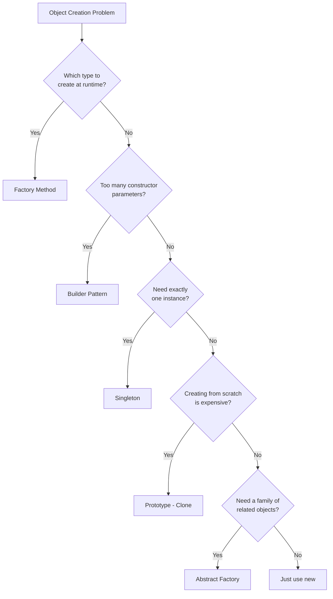

#system-design #lld #patterns #creational

# Creational Patterns — How to Create Objects

---

## Which Creational Pattern?



---

## Factory Method

**Problem:** Code uses `if/else` to create different objects based on type.
**Solution:** Delegate creation to a factory method.

```python
# BEFORE (smell: type checking)
def create_notification(channel):
    if channel == "email":
        return EmailNotification()
    elif channel == "sms":
        return SMSNotification()
    elif channel == "push":
        return PushNotification()

# AFTER (Factory)
class NotificationFactory:
    _registry = {
        "email": EmailNotification,
        "sms": SMSNotification,
        "push": PushNotification,
    }

    @classmethod
    def create(cls, channel: str) -> Notification:
        if channel not in cls._registry:
            raise ValueError(f"Unknown channel: {channel}")
        return cls._registry[channel]()

    @classmethod
    def register(cls, channel: str, notification_class):
        cls._registry[channel] = notification_class

# Adding new channel: NotificationFactory.register("whatsapp", WhatsAppNotification)
# Zero changes to existing code.
```

**Use when:** Object creation involves a decision (which type to create). Centralizes the decision.

---

## Builder

**Problem:** Constructor with 10+ parameters. Hard to read, easy to mix up.
**Solution:** Step-by-step construction with a fluent interface.

```python
# BEFORE (constructor hell)
query = DatabaseQuery("users", ["name", "email"], "age > 18",
                      "name ASC", 10, 0, True, False, "read_replica")

# AFTER (Builder)
class QueryBuilder:
    def __init__(self, table):
        self._table = table
        self._columns = ["*"]
        self._where = None
        self._order_by = None
        self._limit = None

    def select(self, *columns):
        self._columns = list(columns)
        return self  # Return self for chaining

    def where(self, condition):
        self._where = condition
        return self

    def order_by(self, column, direction="ASC"):
        self._order_by = f"{column} {direction}"
        return self

    def limit(self, n):
        self._limit = n
        return self

    def build(self) -> str:
        query = f"SELECT {', '.join(self._columns)} FROM {self._table}"
        if self._where: query += f" WHERE {self._where}"
        if self._order_by: query += f" ORDER BY {self._order_by}"
        if self._limit: query += f" LIMIT {self._limit}"
        return query

# Usage — clear, readable, impossible to mix up parameters
query = (QueryBuilder("users")
    .select("name", "email")
    .where("age > 18")
    .order_by("name")
    .limit(10)
    .build())
```

**Use when:** Complex object construction with many optional parameters.

---

## Singleton

**Problem:** Need exactly one instance of a class (config, logger, connection pool).
**Solution:** Restrict instantiation to one instance.

```python
class DatabasePool:
    _instance = None

    def __new__(cls):
        if cls._instance is None:
            cls._instance = super().__new__(cls)
            cls._instance._connections = []
        return cls._instance

# Both variables point to the same instance
pool1 = DatabasePool()
pool2 = DatabasePool()
assert pool1 is pool2  # True
```

**Warning:** Singletons make testing hard (global state). Prefer **dependency injection** in most cases. Use Singleton only for truly global resources (connection pools, hardware interfaces).

---

## Prototype

**Problem:** Creating an object is expensive (DB query, complex computation). Need copies.
**Solution:** Clone an existing instance.

```python
import copy

class GameState:
    def __init__(self, board, players, turn):
        self.board = board
        self.players = players
        self.turn = turn

    def clone(self):
        return copy.deepcopy(self)

# Save checkpoints without recreating from scratch
checkpoint = current_state.clone()
```

**Use when:** Object creation is expensive, and you need variations of an existing object.

---

---

## Abstract Factory

**Problem:** Need to create *families* of related objects without specifying their concrete classes. Factory creates one type; Abstract Factory creates a *suite* of related types together.

**Real use:** UI themes (Light/Dark), cross-platform widgets, test doubles vs real implementations.

```java
// Abstract products
public interface Button { void render(); }
public interface Checkbox { void render(); }

// Concrete products — Light theme family
public class LightButton implements Button {
    public void render() { System.out.println("Light button"); }
}
public class LightCheckbox implements Checkbox {
    public void render() { System.out.println("Light checkbox"); }
}

// Concrete products — Dark theme family
public class DarkButton implements Button {
    public void render() { System.out.println("Dark button"); }
}
public class DarkCheckbox implements Checkbox {
    public void render() { System.out.println("Dark checkbox"); }
}

// Abstract factory — creates a FAMILY of related products
public interface UIFactory {
    Button createButton();
    Checkbox createCheckbox();
}

// Concrete factories — each produces one consistent family
public class LightThemeFactory implements UIFactory {
    public Button createButton()   { return new LightButton(); }
    public Checkbox createCheckbox() { return new LightCheckbox(); }
}

public class DarkThemeFactory implements UIFactory {
    public Button createButton()   { return new DarkButton(); }
    public Checkbox createCheckbox() { return new DarkCheckbox(); }
}

// Client — uses only abstract interfaces, never knows concrete types
public class Application {
    private Button button;
    private Checkbox checkbox;

    public Application(UIFactory factory) {
        this.button   = factory.createButton();
        this.checkbox = factory.createCheckbox();
    }

    public void render() {
        button.render();
        checkbox.render();
    }
}

// Usage
UIFactory factory = new DarkThemeFactory();  // swap to LightThemeFactory anytime
Application app = new Application(factory);
app.render();
```

**Factory vs Abstract Factory:**
| | Factory Method | Abstract Factory |
|--|--|--|
| Creates | One product type | A family of related products |
| Subclassing | Yes (one creator per type) | No (one factory per family) |
| Use when | One dimension varies | Multiple dimensions vary together |

**Use when:** You need to guarantee that products from the same family are used together (never mix Light button with Dark checkbox).

---

## Prototype — Deep Dive

**Problem:** Creating an object is expensive (DB query, network call, heavy computation). You need many similar objects with slight variations.

**Solution:** Clone an existing "template" instance. The clone is independent — mutations don't affect the original.

```java
// Cloneable interface (standard Java approach)
public abstract class Shape implements Cloneable {
    protected String color;
    protected int x, y;

    public abstract double area();

    // Shallow clone — works when fields are primitives or immutable
    @Override
    public Shape clone() {
        try {
            return (Shape) super.clone();
        } catch (CloneNotSupportedException e) {
            throw new RuntimeException(e);
        }
    }
}

public class Circle extends Shape {
    private double radius;

    public Circle(String color, double radius) {
        this.color  = color;
        this.radius = radius;
    }

    public double area() { return Math.PI * radius * radius; }
}

// Prototype Registry — cache expensive objects, clone on demand
public class ShapeRegistry {
    private static final Map<String, Shape> cache = new HashMap<>();

    public static void register(String key, Shape shape) {
        cache.put(key, shape);
    }

    public static Shape get(String key) {
        Shape cached = cache.get(key);
        if (cached == null) throw new IllegalArgumentException("Unknown shape: " + key);
        return cached.clone();  // Return a copy, not the original
    }
}

// Usage — no expensive re-creation
ShapeRegistry.register("red-circle", new Circle("red", 5.0));  // expensive setup once

Shape s1 = ShapeRegistry.get("red-circle");  // clone
Shape s2 = ShapeRegistry.get("red-circle");  // another clone
// s1 and s2 are independent — mutating one doesn't affect the other
```

**Shallow vs Deep Clone:**
```java
// PROBLEM with shallow clone — mutable fields are shared
public class Order implements Cloneable {
    private String id;
    private List<Item> items;  // mutable — shallow clone shares this list!

    @Override
    public Order clone() {
        try {
            Order cloned = (Order) super.clone();
            cloned.items = new ArrayList<>(this.items);  // deep copy mutable fields
            return cloned;
        } catch (CloneNotSupportedException e) {
            throw new RuntimeException(e);
        }
    }
}
```

**Interview trap:** "Why not just use `new`?" — Because the caller doesn't know the concrete type (polymorphism). `shape.clone()` works whether shape is Circle, Rectangle, or Triangle.

**Use when:** Object creation is expensive OR you need many variations of a template object.

---

## When to Use Which

| Situation | Pattern |
|-----------|---------|
| "Which type should I create?" | Factory Method |
| "Creating a suite of related objects" | Abstract Factory |
| "Too many constructor parameters" | Builder |
| "Only one instance should exist" | Singleton (sparingly) |
| "Creating from scratch is expensive" | Prototype |
| "Need many variations of one template" | Prototype Registry |

## Links

- [[structural]] — How to compose objects
- [[behavioral]] — How objects communicate
- [[smell_to_pattern_map]] — When to reach for these
