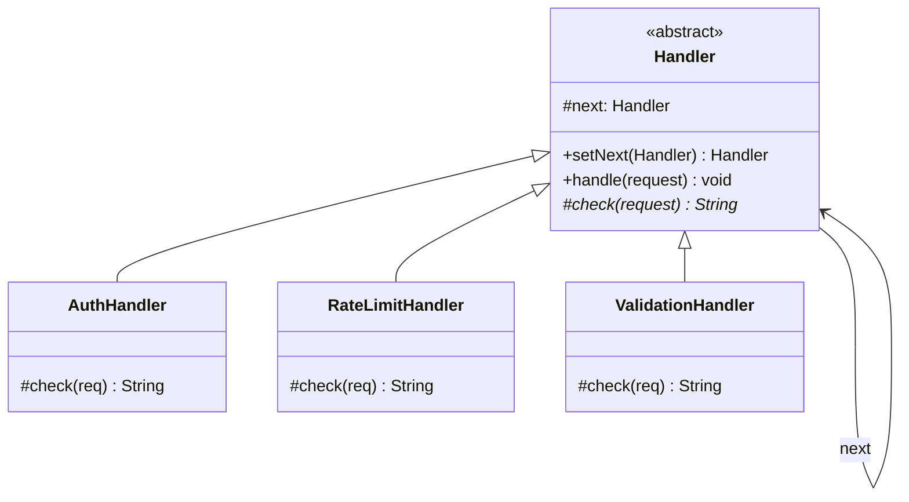
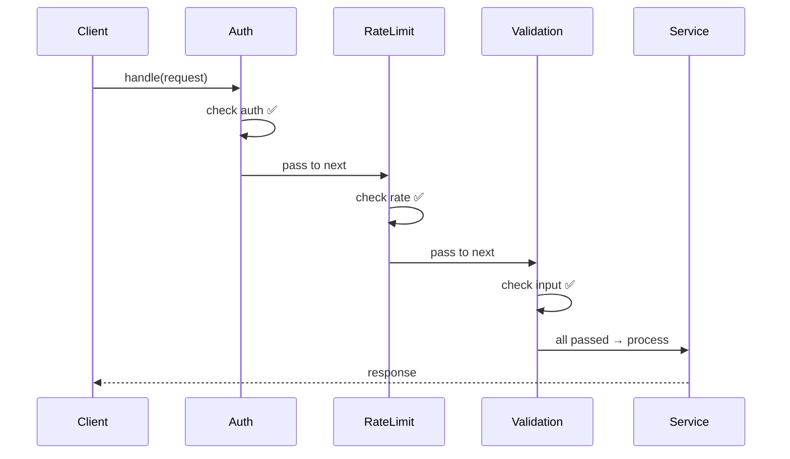
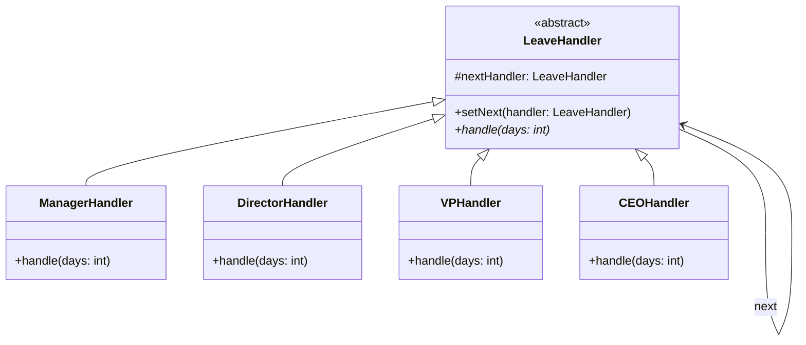

```table-of-contents
title: 
style: nestedList # TOC style (nestedList|nestedOrderedList|inlineFirstLevel)
minLevel: 0 # Include headings from the specified level
maxLevel: 0 # Include headings up to the specified level
include: 
exclude: 
includeLinks: true # Make headings clickable
hideWhenEmpty: false # Hide TOC if no headings are found
debugInConsole: false # Print debug info in Obsidian console
```
# Chain of Responsibility Pattern

**One-liner:** Pass a request along a chain of handlers where each handler decides whether to process the request or pass it to the next handler — decoupling sender from receiver and allowing dynamic pipeline composition.

---

## Why This Exists — The Problem Without It

```java
// BEFORE: Single method handles all validation/processing steps — violates SRP and OCP
public class ApiRequestHandler {
    public Response handle(HttpRequest request) {
        // Step 1: Authentication — hardcoded here
        String token = request.getHeader("Authorization");
        if (token == null || !tokenService.validate(token)) {
            return Response.unauthorized("Invalid token");
        }

        // Step 2: Rate limiting — hardcoded here
        String clientId = tokenService.getClientId(token);
        if (rateLimiter.isExceeded(clientId)) {
            return Response.tooManyRequests("Rate limit exceeded");
        }

        // Step 3: Logging — hardcoded here
        auditLog.record(request, clientId);

        // Step 4: Business logic — buried under all the above
        return businessService.process(request);

        // Adding new step (e.g., IP blocking): must touch this method
        // Reordering steps: must modify this method
        // Testing step 3 in isolation: must instantiate ALL of the above
    }
}
```

---

## Mermaid Class Diagram





---

## Real-World Analogy

Customer support escalation: you call support with an issue. L1 (basic support) handles it if they can. If not, they escalate to L2 (advanced support). L2 escalates to L3 (engineering) for complex bugs. Each level decides: "I can handle this" (stop the chain) or "this needs escalation" (pass to next). You (the caller) don't care who ultimately resolves it. New support tier can be inserted without changing others.

---

## The Fix — Clean Implementation

```java
// ─── Style 1: Classic Chain — each handler has a next reference ───────────

public interface RequestHandler {
    void setNext(RequestHandler next);
    Response handle(HttpRequest request);
}

public abstract class AbstractHandler implements RequestHandler {
    private RequestHandler next;

    @Override
    public void setNext(RequestHandler next) {
        this.next = next;
    }

    // Subclasses call this when they want to pass the request along
    protected Response passToNext(HttpRequest request) {
        if (next != null) return next.handle(request);
        // No handler handled the request — critical: don't silently drop it
        throw new UnhandledRequestException("No handler processed: " + request.getPath());
    }
}

public class AuthenticationHandler extends AbstractHandler {
    private final TokenService tokenService;

    public AuthenticationHandler(TokenService tokenService) {
        this.tokenService = tokenService;
    }

    @Override
    public Response handle(HttpRequest request) {
        String token = request.getHeader("Authorization");
        if (token == null || !tokenService.validate(token)) {
            return Response.unauthorized("Invalid or missing token");
            // Chain stops here — request handled (rejected)
        }
        request.setAttribute("clientId", tokenService.getClientId(token));
        return passToNext(request);   // Valid — pass to next handler
    }
}

public class RateLimitHandler extends AbstractHandler {
    private final RateLimiter rateLimiter;

    public RateLimitHandler(RateLimiter rateLimiter) {
        this.rateLimiter = rateLimiter;
    }

    @Override
    public Response handle(HttpRequest request) {
        String clientId = (String) request.getAttribute("clientId");
        if (rateLimiter.isExceeded(clientId)) {
            return Response.tooManyRequests("Rate limit exceeded for: " + clientId);
        }
        return passToNext(request);
    }
}

public class AuditLoggingHandler extends AbstractHandler {
    private final AuditLogger auditLogger;

    public AuditLoggingHandler(AuditLogger auditLogger) {
        this.auditLogger = auditLogger;
    }

    @Override
    public Response handle(HttpRequest request) {
        auditLogger.record(request);
        Response response = passToNext(request);    // log BEFORE and AFTER
        auditLogger.recordResponse(request, response);
        return response;
    }
}

public class BusinessLogicHandler extends AbstractHandler {
    private final BusinessService businessService;

    public BusinessLogicHandler(BusinessService businessService) {
        this.businessService = businessService;
    }

    @Override
    public Response handle(HttpRequest request) {
        return businessService.process(request);  // terminal handler — no passToNext
    }
}

// ─── Wiring the chain ─────────────────────────────────────────────────────
public class ChainConfig {
    public RequestHandler buildChain(TokenService ts, RateLimiter rl,
                                     AuditLogger al, BusinessService bs) {
        RequestHandler auth    = new AuthenticationHandler(ts);
        RequestHandler rate    = new RateLimitHandler(rl);
        RequestHandler logging = new AuditLoggingHandler(al);
        RequestHandler business = new BusinessLogicHandler(bs);

        auth.setNext(rate);
        rate.setNext(logging);
        logging.setNext(business);

        return auth;  // entry point of the chain
    }
}

// ─── Style 2: Pipeline / Functional (Spring Security Filter Chain style) ──

@FunctionalInterface
public interface MiddlewareFilter {
    Response doFilter(HttpRequest request, FilterChain chain);
}

public class FilterChain {
    private final List<MiddlewareFilter> filters;
    private int currentIndex = 0;

    public FilterChain(List<MiddlewareFilter> filters) {
        this.filters = filters;
    }

    public Response proceed(HttpRequest request) {
        if (currentIndex >= filters.size()) {
            throw new UnhandledRequestException("All filters passed, no terminal handler");
        }
        MiddlewareFilter current = filters.get(currentIndex++);
        return current.doFilter(request, this);
    }
}

// Lambda filters — clean, testable, composable
public class FilterChainDemo {
    public Response buildAndRun(HttpRequest request) {
        List<MiddlewareFilter> filters = List.of(
            // Authentication filter
            (req, chain) -> {
                if (req.getHeader("Authorization") == null)
                    return Response.unauthorized("Missing token");
                return chain.proceed(req);
            },
            // Rate limiting filter
            (req, chain) -> {
                if (RateLimiter.global().isExceeded(req.getClientIp()))
                    return Response.tooManyRequests("Slow down");
                return chain.proceed(req);
            },
            // Logging filter — wraps the rest of the chain
            (req, chain) -> {
                long start = System.currentTimeMillis();
                Response response = chain.proceed(req);
                System.out.printf("Request %s took %dms%n",
                    req.getPath(), System.currentTimeMillis() - start);
                return response;
            },
            // Terminal handler — must NOT call chain.proceed()
            (req, chain) -> BusinessService.getInstance().process(req)
        );

        return new FilterChain(filters).proceed(request);
    }
}
```

---

## Class Diagram

```
  Client ──→ AuthenticationHandler → RateLimitHandler → AuditLoggingHandler → BusinessLogicHandler
             ────────────────────    ────────────────    ──────────────────    ────────────────────
             -next: Handler          -next: Handler      -next: Handler        (terminal — no next)
             +handle(request)        +handle(request)    +handle(request)      +handle(request)
                  │                       │                    │
                  └── if invalid: stop    └── if exceeded: stop └── always passes, wraps response

             «interface» RequestHandler
             ─────────────────────────
             +setNext(handler)
             +handle(request): Response
```

---

## Real Systems Using This

| System | Chain of Responsibility usage |
|---|---|
| Spring Security `FilterChain` | Every HTTP request passes through `SecurityFilterChain` — auth, CSRF, session filters |
| Java Servlet filters (`javax.servlet.Filter`) | `doFilter(req, resp, chain)` — call `chain.doFilter()` to pass, or don't to stop |
| Java exception propagation | Exception walks up the call stack until a `catch` handles it — the stack IS the chain |
| SLF4J / Log4j level hierarchy | `DEBUG → INFO → WARN → ERROR` — each level handler decides whether to log |
| Unix shell pipes | `cat file | grep pattern | sort | uniq` — each command processes and passes output |
| Apache HTTP Client interceptors | Request/response interceptors form a chain around the actual HTTP call |

---

## SDE-2/SDE-3 Interview Signals

| If interviewer says... | Think Chain of Responsibility |
|---|---|
| "Request passes through multiple validation steps" | CoR — each step is a handler |
| "Middleware pipeline" | CoR — the canonical middleware pattern |
| "Approval workflow with multiple levels" | CoR — each approver level is a handler |
| "Each processor decides whether to handle or escalate" | CoR — handler either processes or passes |
| "Build an API gateway with pluggable filters" | CoR — filter chain, handlers composable |
| "Log4j-style level-based logging" | CoR — DEBUG level handles all, ERROR handles only errors |

---

## When to Use

- A request may be handled by one of several handlers, and the handler isn't known upfront
- Multiple objects should get a chance to handle the request without coupling sender to receivers
- You want to add, remove, or reorder handlers without changing client code
- Building middleware/pipeline systems where each step can short-circuit

## When NOT to Use

- Every request must pass through all handlers (use Decorator instead — always wraps)
- Only one handler will ever process a given request type (simple if/else is clearer)
- Order of handlers must be strictly enforced AND cannot vary (hardcode the pipeline)
- Performance-critical paths — chain traversal adds overhead for each handler

---

## Trade-offs & Alternatives

| Aspect | Chain of Responsibility | Alternative |
|---|---|---|
| Handler knowledge | Each handler only knows next | Decorator — always calls the wrapped component |
| Short-circuiting | Handlers can stop the chain | Decorator — can't easily short-circuit |
| Chain modification | Dynamic — set next at runtime | Decorator — structure set at construction |
| Guaranteed processing | Not guaranteed (risk: dropped requests) | Decorator — always wraps and delegates |

---

## Common Interview Mistakes

1. **Silently dropping unhandled requests** — the most common bug. If no handler processes the request, throw `UnhandledRequestException` or return a default response. Never silently return null.
2. **Handler not calling `passToNext()`** — request is silently absorbed. Every non-terminal handler must either handle OR pass.
3. **Building an infinite chain** — if handler A's `next` eventually points back to A, stack overflow. Validate chain structure at build time.
4. **Storing request-scoped state in handler fields** — handlers are typically singletons; use the request object (or thread-local) to carry state through the chain.
5. **Forgetting to test each handler in isolation** — the whole point of the pattern is independent testability; test each handler with a mock `next`.

---

## Executable Example (Copy-Paste-Run)

```java
// File: ChainDemo.java
// Run:  javac ChainDemo.java && java ChainDemo

public class ChainDemo {

    static abstract class Validator {
        private Validator next;
        Validator setNext(Validator n) { this.next = n; return n; }

        String validate(String input) {
            String error = check(input);
            if (error != null) return error;
            return next != null ? next.validate(input) : null;
        }
        protected abstract String check(String input);
    }

    static class NotEmptyValidator extends Validator {
        protected String check(String s) {
            return (s == null || s.isBlank()) ? "Cannot be empty" : null;
        }
    }

    static class MinLengthValidator extends Validator {
        private final int min;
        MinLengthValidator(int min) { this.min = min; }
        protected String check(String s) {
            return s.length() < min ? "Must be at least " + min + " chars" : null;
        }
    }

    static class HasDigitValidator extends Validator {
        protected String check(String s) {
            return s.chars().noneMatch(Character::isDigit) ? "Must contain a digit" : null;
        }
    }

    public static void main(String[] args) {
        Validator chain = new NotEmptyValidator();
        chain.setNext(new MinLengthValidator(8)).setNext(new HasDigitValidator());

        String[] passwords = {"", "abc", "abcdefgh", "secure99"};
        for (String pwd : passwords) {
            String err = chain.validate(pwd);
            System.out.printf("%-15s -> %s%n", "\"" + pwd + "\"", err != null ? "FAIL: " + err : "PASS");
        }
    }
}
```

**Expected output:**
```
""              -> FAIL: Cannot be empty
"abc"           -> FAIL: Must be at least 8 chars
"abcdefgh"      -> FAIL: Must contain a digit
"secure99"      -> PASS
```

---

## Anti-Pattern

```java
// Without Chain: one giant method with nested ifs
String validate(String pwd) {
    if (pwd == null) return "empty";
    if (pwd.length() < 8) return "too short";
    if (!pwd.matches(".*\\d.*")) return "no digit";
    // ... grows endlessly, can't reuse rules across forms
}
```

---

## Spring Boot Connection

```java
// Spring Security's filter chain IS CoR
http.addFilterBefore(jwtFilter, UsernamePasswordAuthenticationFilter.class);
// Servlet filters: each calls chain.doFilter() to pass to next
// Express.js middleware: app.use(auth, rateLimit, logger) — same pattern
```

---

## Which LLD Problems Use This

- [[../../examples/lld_rate_limiter]] — Auth → Rate Limit → Validate → Process
- [[../../examples/lld_logger_library]] — Log level filtering as handler chain

---

## Follow-up Questions

| Question | Answer |
|----------|--------|
| "Pipeline vs classic Chain?" | Classic: ONE handler handles. Pipeline: ALL handlers process. |
| "Chain vs Strategy?" | Chain = multiple sequential processors. Strategy = ONE selected. |

---

## Interview Script

> "The request passes through multiple validators/filters. I'll use Chain of Responsibility — each handler processes or passes to next. Adding a new handler = 1 new class. Spring Security uses exactly this."

---

## Thread-Safety Note

```
Chain structure: build once at startup → immutable → thread-safe.
Handlers: stateless → safe. Stateful → synchronize or use thread-local.
```

---

## Complexity Analysis

| Scenario | Without Chain | With Chain |
|----------|-------------|-----------|
| Add new validator | Modify existing method | 1 new handler class |
| Reuse across forms | Copy-paste | Compose different chains |
| Test one rule | Test everything | Test single handler |

---

## Combines Well With

- **Composite** — CompositeHandler wraps a group as one
- **Decorator** — Decorator always wraps; CoR can short-circuit
- **Command** — request in chain is often a Command object
- **Template Method** — AbstractHandler provides template; subclasses implement check

---

## Cheat Sheet

```
CoR = request walks a linked list of handlers; each handler: process OR pass to next
Classic: handler has `next` field; calls passToNext() to delegate
Pipeline: List<Filter> + index; call chain.proceed() to advance
Terminal handler: never calls next — it always processes and returns
Critical: always handle "no one handled it" — throw, don't silently drop
Spring Security FilterChain + Servlet Filter = CoR in production every day
```

---
---

# ChatGPT
## Chain of Responsibility Pattern

---

## 1. Real World Analogy

You raise a **support ticket** at your company:

- First it goes to **Level 1 support** — can they solve it? If yes, done. If no, pass it up.
- Goes to **Level 2 support** — can they solve it? If yes, done. If no, pass it up.
- Goes to **Engineering team** — they solve it.

Nobody says "let me check every possible handler and pick the right one." Each handler looks at the request and either **handles it or passes it to the next one**.

That's Chain of Responsibility. **Pass a request along a chain until someone handles it.**

---

## 2. The Problem It Solves

You're building a leave approval system. Without this pattern:

```java
class LeaveApproval {
    public void approve(int days) {
        if (days <= 2) {
            // manager logic
        } else if (days <= 5) {
            // director logic
        } else if (days <= 10) {
            // VP logic
        } else {
            // CEO logic
        }
    }
}
```

Every new approval level = modify this class. All levels are tightly coupled in one place. Hard to reorder, add, or remove levels.

---

## 3. UML — Mermaid Format



Each handler holds a reference to the **next handler** in the chain. If it can't handle — it passes to next.

---

## 4. Full Java Code — Step by Step

**Step 1 — Abstract Handler:**

```java
// Every handler in the chain extends this
abstract class LeaveHandler {
    protected LeaveHandler nextHandler;   // reference to next in chain

    public void setNext(LeaveHandler nextHandler) {
        this.nextHandler = nextHandler;
    }

    // each handler must implement this
    public abstract void handle(int days);
}
```

---

**Step 2 — Concrete Handlers:**

```java
class ManagerHandler extends LeaveHandler {
    public void handle(int days) {
        if (days <= 2) {
            System.out.println("Manager approved " + days + " day(s) leave");
        } else if (nextHandler != null) {
            System.out.println("Manager cannot approve " + days
                + " days — passing up");
            nextHandler.handle(days);   // pass to next
        }
    }
}

class DirectorHandler extends LeaveHandler {
    public void handle(int days) {
        if (days <= 5) {
            System.out.println("Director approved " + days + " day(s) leave");
        } else if (nextHandler != null) {
            System.out.println("Director cannot approve " + days
                + " days — passing up");
            nextHandler.handle(days);
        }
    }
}

class VPHandler extends LeaveHandler {
    public void handle(int days) {
        if (days <= 10) {
            System.out.println("VP approved " + days + " day(s) leave");
        } else if (nextHandler != null) {
            System.out.println("VP cannot approve " + days
                + " days — passing up");
            nextHandler.handle(days);
        }
    }
}

class CEOHandler extends LeaveHandler {
    public void handle(int days) {
        if (days <= 30) {
            System.out.println("CEO approved " + days + " day(s) leave");
        } else {
            System.out.println("Leave of " + days
                + " days DENIED — exceeds policy");
        }
    }
}
```

---

**Step 3 — Build the chain and use it:**

```java
public class Main {
    public static void main(String[] args) {

        // create handlers
        LeaveHandler manager  = new ManagerHandler();
        LeaveHandler director = new DirectorHandler();
        LeaveHandler vp       = new VPHandler();
        LeaveHandler ceo      = new CEOHandler();

        // chain them together
        manager.setNext(director);
        director.setNext(vp);
        vp.setNext(ceo);

        // all requests start from manager
        System.out.println("--- Request: 1 day ---");
        manager.handle(1);

        System.out.println("\n--- Request: 4 days ---");
        manager.handle(4);

        System.out.println("\n--- Request: 9 days ---");
        manager.handle(9);

        System.out.println("\n--- Request: 25 days ---");
        manager.handle(25);

        System.out.println("\n--- Request: 45 days ---");
        manager.handle(45);
    }
}
```

**Output:**

```
--- Request: 1 day ---
Manager approved 1 day(s) leave

--- Request: 4 days ---
Manager cannot approve 4 days — passing up
Director approved 4 day(s) leave

--- Request: 9 days ---
Manager cannot approve 9 days — passing up
Director cannot approve 9 days — passing up
VP approved 9 day(s) leave

--- Request: 25 days ---
Manager cannot approve 25 days — passing up
Director cannot approve 25 days — passing up
VP cannot approve 25 days — passing up
CEO approved 25 day(s) leave

--- Request: 45 days ---
Manager cannot approve 45 days — passing up
Director cannot approve 45 days — passing up
VP cannot approve 45 days — passing up
Leave of 45 days DENIED — exceeds policy
```

---

## 5. Real Backend Example — Middleware Pipeline

This is the most important real-world usage. Every HTTP request in Spring goes through a chain of filters:

```java
// Abstract handler
abstract class RequestHandler {
    protected RequestHandler next;

    public void setNext(RequestHandler next) {
        this.next = next;
    }

    public abstract void handle(HttpRequest request);
}

// Handler 1 — Authentication
class AuthHandler extends RequestHandler {
    public void handle(HttpRequest request) {
        if (request.getToken() == null) {
            System.out.println("[AUTH] Rejected — no token");
            return;   // stop chain
        }
        System.out.println("[AUTH] Token valid — passing on");
        if (next != null) next.handle(request);   // pass to next
    }
}

// Handler 2 — Rate Limiting
class RateLimitHandler extends RequestHandler {
    private Map<String, Integer> requestCounts = new HashMap<>();

    public void handle(HttpRequest request) {
        int count = requestCounts.getOrDefault(request.getUserId(), 0);
        if (count >= 100) {
            System.out.println("[RATE LIMIT] Too many requests");
            return;   // stop chain
        }
        requestCounts.put(request.getUserId(), count + 1);
        System.out.println("[RATE LIMIT] OK — passing on");
        if (next != null) next.handle(request);
    }
}

// Handler 3 — Logging
class LoggingHandler extends RequestHandler {
    public void handle(HttpRequest request) {
        System.out.println("[LOG] Request: " + request.getPath()
            + " by " + request.getUserId());
        if (next != null) next.handle(request);   // always passes on
    }
}

// Handler 4 — Actual business logic
class BusinessHandler extends RequestHandler {
    public void handle(HttpRequest request) {
        System.out.println("[BUSINESS] Processing: " + request.getPath());
    }
}

// Wire the chain
RequestHandler auth      = new AuthHandler();
RequestHandler rateLimit = new RateLimitHandler();
RequestHandler logging   = new LoggingHandler();
RequestHandler business  = new BusinessHandler();

auth.setNext(rateLimit);
rateLimit.setNext(logging);
logging.setNext(business);

// every request enters from the top
auth.handle(new HttpRequest("user1", "/api/orders", "valid-token"));
```

**Output:**

```
[AUTH]       Token valid — passing on
[RATE LIMIT] OK — passing on
[LOG]        Request: /api/orders by user1
[BUSINESS]   Processing: /api/orders
```

Adding a new handler — CORS, compression, caching? Add one class and insert it anywhere in the chain. Nothing else changes.

---

## 6. Where It Appears in Java / Spring

```java
// 1. Spring Security Filter Chain
// Every request passes through:
// CorsFilter → CsrfFilter → AuthFilter → AuthorizationFilter → your controller
// Each filter is a handler — processes or passes on

// 2. Java Servlet Filters
@Component
public class LoggingFilter implements Filter {
    public void doFilter(ServletRequest req,
                         ServletResponse res,
                         FilterChain chain)   // ← this IS the chain
            throws IOException, ServletException {
        System.out.println("Before request");
        chain.doFilter(req, res);  // pass to next handler
        System.out.println("After request");
    }
}

// 3. Spring Interceptors
// PreHandle → Controller → PostHandle → AfterCompletion
// Each interceptor in the chain can stop or pass on

// 4. Netty pipeline
// channel.pipeline().addLast(new AuthHandler())
//                   .addLast(new LoggingHandler())
//                   .addLast(new BusinessHandler())
```

---

## 7. Comparison With Similar Patterns

||Chain of Responsibility|Decorator|Command|
|---|---|---|---|
|**Structure**|Linear chain|Wrapping layers|Single command object|
|**Purpose**|Find handler for request|Add behaviour|Encapsulate request|
|**Stops early?**|✅ Yes — once handled|❌ No — all execute|❌ No — always executes|
|**Order matters?**|✅ Yes|✅ Yes|❌ No|
|**Example**|Auth → rate limit → handler|Logging → caching → service|Undo/redo, job queue|

**Chain of Responsibility vs Decorator** — most confused pair:

```java
// Decorator — ALL wrappers execute, adds behaviour
request = new LoggingDecorator(
             new AuthDecorator(
                new RealService()));
// LoggingDecorator always runs AND AuthDecorator always runs

// Chain of Responsibility — stops as soon as one handler handles it
auth.setNext(rateLimit);
rateLimit.setNext(business);
// if auth rejects → rateLimit and business never run
```

---

## 8. Trade-offs

**Pros:**

- Add, remove, or reorder handlers without touching other handlers
- Each handler has single responsibility — easy to test independently
- Request sender doesn't know which handler will process it — loose coupling
- Can stop the chain early — powerful for validation pipelines

**Cons:**

- No guarantee request gets handled — can fall through the chain silently
- Hard to debug — need to trace through every handler to understand flow
- Chain order matters — wrong order causes bugs that are hard to spot
- Performance — long chains mean every request passes through many handlers

---

## 9. Interview Question + One-Line Summary

**Interview question:**

> _"Design a middleware pipeline for an API gateway that handles authentication, rate limiting, logging, and request routing — where new middleware can be added without changing existing code."_

```java
abstract class Middleware {
    protected Middleware next;

    public Middleware linkWith(Middleware next) {
        this.next = next;
        return next;   // return next for fluent chaining
    }

    public abstract boolean handle(Request request);

    protected boolean passToNext(Request request) {
        if (next == null) return true;
        return next.handle(request);
    }
}

class AuthMiddleware extends Middleware {
    public boolean handle(Request request) {
        if (!request.hasValidToken()) {
            System.out.println("[AUTH] Unauthorized");
            return false;
        }
        return passToNext(request);
    }
}

class RateLimitMiddleware extends Middleware {
    public boolean handle(Request request) {
        if (isRateLimited(request.getUserId())) {
            System.out.println("[RATE] Too many requests");
            return false;
        }
        return passToNext(request);
    }

    private boolean isRateLimited(String userId) {
        return false;   // simplified
    }
}

class LoggingMiddleware extends Middleware {
    public boolean handle(Request request) {
        System.out.println("[LOG] " + request.getPath());
        return passToNext(request);
    }
}

// Fluent chain building
Middleware pipeline = new AuthMiddleware();
pipeline.linkWith(new RateLimitMiddleware())
        .linkWith(new LoggingMiddleware());

pipeline.handle(new Request("user1", "/api/orders", "valid-token"));
```

---

**One-line SDE-2 summary:**

> _"Chain of Responsibility passes a request along a chain of handlers where each handler either processes it or passes it to the next — decoupling senders from receivers and used in Spring's filter chain, servlet filters, and middleware pipelines."_

---

Ready for **Template Method** next?