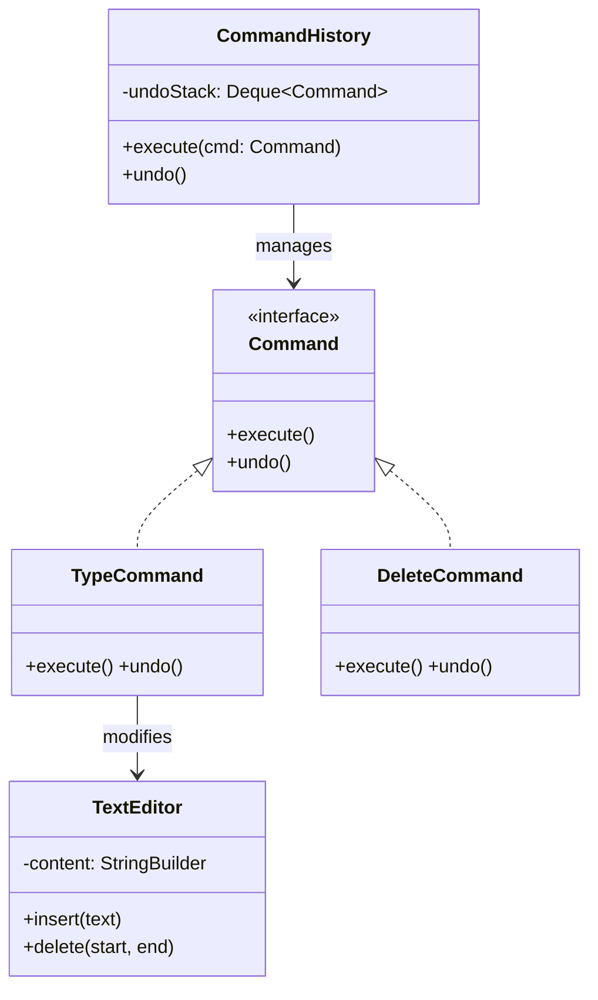

# Command Pattern

**One-liner:** Encapsulate a request as a standalone object so it can be queued, logged, retried, and undone — decoupling the caller from the object that performs the work.

---

## Why This Exists — The Problem Without It

```java
// BEFORE: Caller is tightly coupled to receiver — no undo, no queue, no audit
public class TextEditorUI {
    private final TextBuffer buffer;

    public void onBoldClick() {
        // Caller directly invokes receiver — can't undo, can't log, can't queue
        buffer.applyFormat(selectedText(), "bold");
        // How do you undo this? You'd need to store state everywhere.
        // How do you replay actions? You can't — there's no record.
        // How do you queue bold operations? Impossible — it's a direct call.
    }

    public void onPasteClick() {
        String clipboard = Clipboard.get();
        buffer.insert(cursorPosition(), clipboard);
        // Again: no undo stack, no audit trail, no retry mechanism
        // Undo paste means... what? Caller would need to remember old state.
    }
}
// Consequence: undo/redo requires scattered state management throughout the UI layer
```

---

## Real-World Analogy

Restaurant order slip: a waiter doesn't cook the food — they write the order on a slip (command object) and hand it to the kitchen (invoker passes to receiver). The slip can be queued on the counter, cancelled before cooking starts, handed to a different cook, or photocopied for the audit log. The waiter (caller) is completely decoupled from the chef (receiver). The slip IS the request.

---

## The Fix — Clean Implementation

```java
// ─── Command Interface ────────────────────────────────────────────────────
public interface Command {
    void execute();
    void undo();
}

// ─── Receiver ─────────────────────────────────────────────────────────────
public class TextBuffer {
    private final StringBuilder content = new StringBuilder();
    private int cursorPos = 0;

    public void insertText(int pos, String text) {
        content.insert(pos, text);
        cursorPos = pos + text.length();
    }

    public void deleteText(int pos, int length) {
        content.delete(pos, pos + length);
        cursorPos = pos;
    }

    public String getContent() { return content.toString(); }
    public int getCursorPos() { return cursorPos; }
}

// ─── Concrete Commands ────────────────────────────────────────────────────
public class InsertTextCommand implements Command {
    private final TextBuffer buffer;
    private final int position;
    private final String text;

    public InsertTextCommand(TextBuffer buffer, int position, String text) {
        this.buffer = buffer;
        this.position = position;
        this.text = text;
    }

    @Override
    public void execute() {
        buffer.insertText(position, text);
    }

    @Override
    public void undo() {
        // Command knows exactly what to reverse — it stored what it needs
        buffer.deleteText(position, text.length());
    }
}

public class DeleteTextCommand implements Command {
    private final TextBuffer buffer;
    private final int position;
    private final int length;
    private String deletedText;  // saved during execute() for undo

    public DeleteTextCommand(TextBuffer buffer, int position, int length) {
        this.buffer = buffer;
        this.position = position;
        this.length = length;
    }

    @Override
    public void execute() {
        // Save state BEFORE deleting (this is what makes undo possible)
        deletedText = buffer.getContent().substring(position, position + length);
        buffer.deleteText(position, length);
    }

    @Override
    public void undo() {
        buffer.insertText(position, deletedText);
    }
}

// ─── Macro Command (Composite) ────────────────────────────────────────────
// Execute N commands as a single atomic unit; undo reverses all in reverse order
public class MacroCommand implements Command {
    private final List<Command> commands;

    public MacroCommand(List<Command> commands) {
        this.commands = new ArrayList<>(commands);
    }

    @Override
    public void execute() {
        commands.forEach(Command::execute);
    }

    @Override
    public void undo() {
        // Undo in reverse order — last executed is first to undo
        ListIterator<Command> it = commands.listIterator(commands.size());
        while (it.hasPrevious()) it.previous().undo();
    }
}

// ─── Transactional Command ─────────────────────────────────────────────────
// If any step fails, undo all previously executed steps (like a DB transaction)
public class TransactionalCommand implements Command {
    private final List<Command> steps;
    private final List<Command> executedSteps = new ArrayList<>();

    public TransactionalCommand(List<Command> steps) {
        this.steps = steps;
    }

    @Override
    public void execute() {
        executedSteps.clear();
        for (Command step : steps) {
            try {
                step.execute();
                executedSteps.add(step);
            } catch (Exception ex) {
                // Rollback all previously successful steps
                ListIterator<Command> it = executedSteps.listIterator(executedSteps.size());
                while (it.hasPrevious()) {
                    try { it.previous().undo(); } catch (Exception ignored) {}
                }
                throw new TransactionFailedException("Step failed, rolled back", ex);
            }
        }
    }

    @Override
    public void undo() {
        ListIterator<Command> it = executedSteps.listIterator(executedSteps.size());
        while (it.hasPrevious()) it.previous().undo();
    }
}

// ─── Invoker — CommandHistory with undo/redo ─────────────────────────────
public class CommandHistory {
    private final Deque<Command> undoStack = new ArrayDeque<>();
    private final Deque<Command> redoStack = new ArrayDeque<>();
    private static final int MAX_HISTORY = 100;

    public void execute(Command command) {
        command.execute();
        undoStack.push(command);
        redoStack.clear();   // new action clears redo stack (like any text editor)
        if (undoStack.size() > MAX_HISTORY) {
            // Remove oldest command (bottom of deque)
            ((ArrayDeque<Command>) undoStack).removeLast();
        }
    }

    public void undo() {
        if (undoStack.isEmpty()) return;
        Command command = undoStack.pop();
        command.undo();
        redoStack.push(command);
    }

    public void redo() {
        if (redoStack.isEmpty()) return;
        Command command = redoStack.pop();
        command.execute();
        undoStack.push(command);
    }

    public boolean canUndo() { return !undoStack.isEmpty(); }
    public boolean canRedo() { return !redoStack.isEmpty(); }
}

// ─── Usage ────────────────────────────────────────────────────────────────
public class TextEditorApp {
    private final TextBuffer buffer = new TextBuffer();
    private final CommandHistory history = new CommandHistory();

    public void type(String text) {
        history.execute(new InsertTextCommand(buffer, buffer.getCursorPos(), text));
    }

    public void delete(int length) {
        history.execute(new DeleteTextCommand(buffer, buffer.getCursorPos() - length, length));
    }

    public void undo() { history.undo(); }
    public void redo() { history.redo(); }

    public static void main(String[] args) {
        TextEditorApp editor = new TextEditorApp();
        editor.type("Hello");          // buffer: "Hello"
        editor.type(" World");         // buffer: "Hello World"
        editor.undo();                 // buffer: "Hello"
        editor.redo();                 // buffer: "Hello World"

        // Macro: bold + italic as one undoable operation
        editor.history.execute(new MacroCommand(List.of(
            new InsertTextCommand(editor.buffer, 0, "<b>"),
            new InsertTextCommand(editor.buffer, editor.buffer.getCursorPos(), "</b>")
        )));
        editor.undo();  // undoes both <b> tags together
    }
}

// ─── Java Runnable and Callable ARE Commands ──────────────────────────────
// Java's built-in Command pattern — Runnable.run() = execute(); no undo
ExecutorService executor = Executors.newFixedThreadPool(4);
executor.submit(() -> System.out.println("Command queued and executed by thread pool"));
// Callable adds return value — Command that produces a result
Future<String> result = executor.submit(() -> "computed result");
```

---

## Class Diagram

```
  TextEditorApp          CommandHistory (Invoker)
  (Client)               ─────────────────────────
  +type()                -undoStack: Deque<Command>
  +delete()              -redoStack: Deque<Command>
  +undo()   ──────────→  +execute(Command)
  +redo()                +undo()
                         +redo()
                              │ uses
                         «interface»
                           Command
                         ──────────────
                         +execute()
                         +undo()
                              △
              ┌───────────────┼───────────────┐
              │               │               │
   InsertTextCommand  DeleteTextCommand  MacroCommand
   ─────────────────  ────────────────  ────────────
   -buffer             -buffer           -commands: List
   -position           -position         +execute() → all
   -text               -deletedText      +undo() → reverse
```

---

## Real Systems Using This

| System | Command usage |
|---|---|
| `java.lang.Runnable` / `Callable` | The canonical Java Command — submitted to `ExecutorService` for async execution |
| Spring `@Async` | Method invocation wrapped as `Callable`, submitted to task executor |
| Database transaction scripts | Each DB operation is a command; rollback = undo chain |
| Job queues (Sidekiq, Celery, Spring Batch) | Jobs serialized as command objects, queued for deferred execution |
| Spring Batch `Step` / `Tasklet` | Each tasklet is a Command with retry and skip policies |
| UI action history (IntelliJ, Photoshop) | Full undo/redo via command history |

---

## SDE-2/SDE-3 Interview Signals

| If interviewer says... | Think Command |
|---|---|
| "Implement undo/redo" | Command + CommandHistory (undo/redo stacks) |
| "Queue operations for deferred execution" | Command — commands are serializable units of work |
| "Retry failed operations" | Command — re-execute the stored command object |
| "Audit trail / operation log" | Command — log each command before/after execute |
| "Transactional operations that must rollback" | TransactionalCommand with undo chain |
| "Macro recording in an application" | MacroCommand — record then replay sequence |

---

## When to Use

- Need undo/redo functionality
- Operations must be queued, scheduled, or executed asynchronously
- Need an audit log of all actions performed
- Operations need retry logic (re-execute the command object)
- Multiple operations must succeed together or rollback together (transactional)

## When NOT to Use

- Simple one-way call with no need for undo, queue, or logging
- Commands would carry so little state they add no value over a direct call
- High-frequency inner loops where object creation overhead is unacceptable

---

## Trade-offs & Alternatives

| Aspect | Command | Alternative |
|---|---|---|
| Undo | Built-in via undo() | Memento (saves full state snapshot) |
| Queueing | Native — commands are objects | Direct calls (can't queue) |
| Complexity | More classes | Direct call (simpler for one-way fire-and-forget) |
| Serialization | Commands can be serialized for persistence | Lambdas (not serializable without extra work) |

**Command vs Memento for undo:**
- Command: re-executes inverse logic (delete reverses insert). Simple when inverse is clear.
- Memento: restores a full state snapshot. Use when inverse is complex or impossible.

---

## Common Interview Mistakes

1. **Commands storing HOW to do work** — commands store WHAT to do (parameters, receiver reference); the receiver's methods contain HOW.
2. **No redo stack** — forgetting that redo requires pushing to a second stack when undoing.
3. **Not clearing redo stack on new execute** — in every text editor, executing a new command clears redo history.
4. **Missing rollback in TransactionalCommand** — must undo only the successfully executed steps, not all.
5. **Mutable command state shared across threads** — if commands are enqueued and processed concurrently, they must be immutable or thread-safe.

---

## Mermaid Class Diagram



---

## Executable Example 1 — Text Editor Undo (Copy-Paste-Run)

```java
// File: CommandEditorDemo.java
// Run:  javac CommandEditorDemo.java && java CommandEditorDemo

import java.util.*;

public class CommandEditorDemo {

    interface Command {
        void execute();
        void undo();
    }

    static class TextEditor {
        private StringBuilder content = new StringBuilder();
        void insert(int pos, String text) { content.insert(pos, text); }
        void delete(int start, int end) { content.delete(start, end); }
        String getContent() { return content.toString(); }
    }

    static class TypeCommand implements Command {
        private final TextEditor editor;
        private final String text;
        private final int position;
        TypeCommand(TextEditor e, int pos, String t) { editor = e; position = pos; text = t; }
        public void execute() { editor.insert(position, text); }
        public void undo() { editor.delete(position, position + text.length()); }
    }

    static class CommandHistory {
        private final Deque<Command> stack = new ArrayDeque<>();
        void execute(Command cmd) { cmd.execute(); stack.push(cmd); }
        void undo() { if (!stack.isEmpty()) stack.pop().undo(); }
    }

    public static void main(String[] args) {
        TextEditor editor = new TextEditor();
        CommandHistory history = new CommandHistory();

        history.execute(new TypeCommand(editor, 0, "Hello"));
        System.out.println("After 'Hello':  \"" + editor.getContent() + "\"");
        // Output: After 'Hello':  "Hello"

        history.execute(new TypeCommand(editor, 5, " World"));
        System.out.println("After ' World': \"" + editor.getContent() + "\"");
        // Output: After ' World': "Hello World"

        history.execute(new TypeCommand(editor, 11, "!"));
        System.out.println("After '!':      \"" + editor.getContent() + "\"");
        // Output: After '!':      "Hello World!"

        history.undo();
        System.out.println("Undo '!':       \"" + editor.getContent() + "\"");
        // Output: Undo '!':       "Hello World"

        history.undo();
        System.out.println("Undo ' World':  \"" + editor.getContent() + "\"");
        // Output: Undo ' World':  "Hello"

        history.undo();
        System.out.println("Undo 'Hello':   \"" + editor.getContent() + "\"");
        // Output: Undo 'Hello':   ""
    }
}
```

---

## Executable Example 2 — Smart Home Remote (Copy-Paste-Run)

```java
// File: CommandRemoteDemo.java
// Run:  javac CommandRemoteDemo.java && java CommandRemoteDemo

import java.util.*;

public class CommandRemoteDemo {

    interface Command {
        void execute();
        void undo();
        String describe();
    }

    static class Light {
        private boolean on = false;
        void turnOn() { on = true; System.out.println("    Light ON"); }
        void turnOff() { on = false; System.out.println("    Light OFF"); }
    }

    static class AC {
        private int temp = 24;
        void setTemp(int t) { temp = t; System.out.println("    AC set to " + temp + "C"); }
        int getTemp() { return temp; }
    }

    static class LightOnCommand implements Command {
        private final Light light;
        LightOnCommand(Light l) { light = l; }
        public void execute() { light.turnOn(); }
        public void undo() { light.turnOff(); }
        public String describe() { return "Light ON"; }
    }

    static class ACTempCommand implements Command {
        private final AC ac;
        private final int newTemp;
        private int prevTemp;
        ACTempCommand(AC ac, int temp) { this.ac = ac; this.newTemp = temp; }
        public void execute() { prevTemp = ac.getTemp(); ac.setTemp(newTemp); }
        public void undo() { ac.setTemp(prevTemp); }
        public String describe() { return "AC -> " + newTemp + "C"; }
    }

    static class MacroCommand implements Command {
        private final List<Command> commands;
        private final String name;
        MacroCommand(String name, Command... cmds) { this.name = name; commands = List.of(cmds); }
        public void execute() { commands.forEach(Command::execute); }
        public void undo() {
            List<Command> rev = new ArrayList<>(commands);
            Collections.reverse(rev);
            rev.forEach(Command::undo);
        }
        public String describe() { return "MACRO: " + name; }
    }

    public static void main(String[] args) {
        Light light = new Light();
        AC ac = new AC();
        Deque<Command> history = new ArrayDeque<>();

        // Individual commands
        Command lightOn = new LightOnCommand(light);
        Command coolDown = new ACTempCommand(ac, 18);

        System.out.println("=== Execute individually ===");
        lightOn.execute(); history.push(lightOn);
        coolDown.execute(); history.push(coolDown);

        System.out.println("\n=== Undo all ===");
        while (!history.isEmpty()) history.pop().undo();

        // Macro command
        System.out.println("\n=== Movie Mode Macro ===");
        Command movieMode = new MacroCommand("Movie Mode",
            new LightOnCommand(light), new ACTempCommand(ac, 20));
        movieMode.execute();

        System.out.println("\n=== Undo Movie Mode ===");
        movieMode.undo();
    }
}
```

---

## Anti-Pattern — What Happens Without Command

```java
// Direct calls — no undo, no queuing, no logging
button.addClickListener(() -> {
    light.turnOn();   // can't undo this
    ac.setTemp(18);   // can't undo this
    // no history, no retry, no macro support
});
```

---

## Refactoring Path

```
Step 1: Identify reversible operations (type, delete, light on/off)
Step 2: Create Command interface with execute() and undo()
Step 3: One class per operation (TypeCommand, DeleteCommand)
Step 4: Store state needed for undo (previous text, previous temp)
Step 5: CommandHistory manages undo/redo stacks
Step 6: Client creates commands and passes to history.execute()
```

---

## Interview Script — What to Say

> "I need undo/redo support (or queuing/logging). I'll use Command pattern — each operation becomes an object with `execute()` and `undo()`. A `CommandHistory` manages the undo stack. For macros, I use Composite Command — a list of commands executed and undone as a unit."

---

## Complexity Analysis

| Scenario | Direct Calls | Command Pattern |
|----------|-------------|----------------|
| Add undo | Rewrite all call sites | Already built in (undo stack) |
| Add logging | Add log line to every call | Log in CommandHistory.execute() |
| Add macro | Manually combine calls | CompositeCommand |
| Add retry | Complex per call site | Re-execute command object |

---

## Combines Well With

- **Memento** — command saves state via memento before executing, uses it in undo()
- **Composite** — MacroCommand: composite of commands executed and undone as a unit
- **Strategy** — command delegates execution logic to a swappable strategy
- **Observer** — commands published as events; observers consume and execute them

---

## Cheat Sheet

```
Command = encapsulate request as object; store who + what + how to reverse
execute() performs the action; undo() reverses it; redo() re-executes
CommandHistory: undoStack (push on execute, pop on undo); redoStack (push on undo)
Macro: List<Command> executed forward, undone in reverse order
Transactional: on failure, undo only the steps that already ran
Java Runnable/Callable ARE commands — submitted to ExecutorService for queuing
```


---
---

# ChatGPT

```markdown
# Command Pattern (Java)

## Definition

> The **Command Pattern** is a behavioral design pattern that **encapsulates a request as an object**, allowing you to parameterize clients with different requests, queue them, log them, or undo them.

In simple words:

```

Instead of calling a method directly,  
we wrap the request inside a Command object.

```

---

# Core Idea

Instead of:

```

Button → directly calls Light.turnOn()

```

We do:

```

Button → Command → Light.turnOn()

```

The command object acts as a **middle layer**.

---

# Real Life Example

Think of a **TV remote**.

```

Remote Button  
|  
v  
Command (TurnOnCommand)  
|  
v  
TV.turnOn()

````

The remote **does not know how the TV works**.  
It just executes a command.

---

# Components of Command Pattern

| Component | Role |
|-----------|------|
| Command | Interface for executing a command |
| ConcreteCommand | Implements the command |
| Receiver | The object that performs the action |
| Invoker | The object that triggers the command |
| Client | Creates and assigns commands |

---

# Example: Smart Home Light

We want a button that **turns a light ON**.

---

# Step 1 — Command Interface

```java
interface Command {
    void execute();
}
````

Every command must implement `execute()`.

---

# Step 2 — Receiver (Actual Logic)

```java
class Light {

    public void turnOn() {
        System.out.println("Light is ON");
    }

    public void turnOff() {
        System.out.println("Light is OFF");
    }
}
```

This class **does the real work**.

---

# Step 3 — Concrete Command

```java
class TurnOnCommand implements Command {

    private Light light;

    public TurnOnCommand(Light light) {
        this.light = light;
    }

    public void execute() {
        light.turnOn();
    }
}
```

What this class does:

```
Command wraps the receiver method call
```

---

# Step 4 — Invoker (Button)

```java
class RemoteButton {

    private Command command;

    public void setCommand(Command command) {
        this.command = command;
    }

    public void pressButton() {
        command.execute();
    }
}
```

The button **does not know what it is executing**.

It just calls:

```
command.execute()
```

---

# Step 5 — Client Code

```java
public class Main {

    public static void main(String[] args) {

        Light light = new Light();

        Command turnOn = new TurnOnCommand(light);

        RemoteButton button = new RemoteButton();

        button.setCommand(turnOn);

        button.pressButton();
    }
}
```

---

# Output

```
Light is ON
```

---

# Execution Flow

```
Client
  |
  v
Create Light object
  |
Create TurnOnCommand(light)
  |
Set command to button
  |
Button pressed
  |
Command.execute()
  |
Light.turnOn()
```

---

# Visual Flow

```
Client
   |
   v
RemoteButton (Invoker)
   |
   v
TurnOnCommand (Command)
   |
   v
Light (Receiver)
```

---

# Why Use Command Pattern?

Without Command Pattern:

```
Button → Light.turnOn()
```

Button is tightly coupled with Light.

With Command Pattern:

```
Button → Command → Receiver
```

The button doesn't care what it controls.

It could control:

```
Light
Fan
TV
Door
```

Just change the command.

---

# Real World Uses

Command pattern is used in:

- **GUI button clicks**
    
- **Undo / Redo systems**
    
- **Task queues**
    
- **Job scheduling**
    
- **Spring framework**
    
- **Database transaction logs**
    

Example:

```
Undo in text editor
```

Each operation is stored as a command.

---

# Advantages

- Decouples sender and receiver
    
- Supports undo/redo
    
- Commands can be queued
    
- Commands can be logged
    

---

# Disadvantages

- Creates many command classes
    
- Slightly more complex architecture
    

---

# Simple Mental Model

```
Command = Action wrapped inside an object
```

Example:

```
Remote Button
   |
Command Object
   |
Actual Device
```

---

# One-Line Interview Answer

The **Command Pattern** encapsulates a request as an object so that requests can be parameterized, queued, logged, or undone.