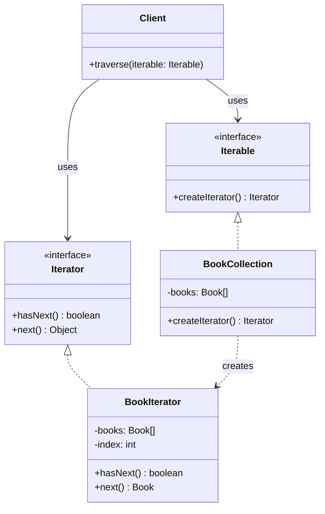

## Iterator Pattern

---

## 1. Real World Analogy

Think about a **TV remote**. You press the **next channel** button — you don't care:

- How channels are stored internally
- Whether they're in an array, a list, or a database
- What the total number of channels is

You just press next → get next channel. Press next again → get the one after. You **traverse** through channels without knowing anything about how they're stored.

That is the Iterator pattern. **Provide a standard way to go through a collection without exposing how it's stored internally.**

---

## 2. The Problem It Solves

You have three different collections. Without Iterator:

```java
// Array — traverse one way
for (int i = 0; i < arr.length; i++) { }

// ArrayList — traverse differently
for (int i = 0; i < list.size(); i++) { }

// LinkedList — traverse yet another way
Node current = head;
while (current != null) { current = current.next; }
```

Every collection has a **different traversal mechanism**. Client code must know the internal structure of each. Change the structure → change all client code.

---

## 3. UML — Mermaid Format



Two interfaces — `Iterator` defines how to traverse, `Iterable` defines how to get an iterator. Client only talks to these interfaces — never to the collection directly.

---

## 4. Full Java Code — Step by Step

**Step 1 — The Iterator interface:**

```java
interface Iterator<T> {
    boolean hasNext();   // is there a next element?
    T next();            // give me the next element
}
```

---

**Step 2 — The Iterable interface:**

```java
interface Iterable<T> {
    Iterator<T> createIterator();
}
```

---

**Step 3 — The collection and its iterator:**

```java
class Book {
    private String title;
    private String author;

    public Book(String title, String author) {
        this.title  = title;
        this.author = author;
    }

    public String getTitle()  { return title; }
    public String getAuthor() { return author; }
}

// Collection
class BookCollection implements Iterable<Book> {
    private List<Book> books = new ArrayList<>();

    public void addBook(Book book) {
        books.add(book);
    }

    // returns an iterator — client uses this, never touches books directly
    public Iterator<Book> createIterator() {
        return new BookIterator(books);
    }
}

// Iterator — knows how to traverse BookCollection
class BookIterator implements Iterator<Book> {
    private List<Book> books;
    private int index = 0;

    public BookIterator(List<Book> books) {
        this.books = books;
    }

    public boolean hasNext() {
        return index < books.size();
    }

    public Book next() {
        return books.get(index++);
    }
}
```

---

**Step 4 — Client:**

```java
public class Main {
    public static void main(String[] args) {

        BookCollection collection = new BookCollection();
        collection.addBook(new Book("Clean Code",         "Robert Martin"));
        collection.addBook(new Book("Design Patterns",    "Gang of Four"));
        collection.addBook(new Book("Effective Java",     "Joshua Bloch"));
        collection.addBook(new Book("System Design",      "Alex Xu"));

        // client uses iterator — never knows about internal List
        Iterator<Book> iterator = collection.createIterator();

        while (iterator.hasNext()) {
            Book book = iterator.next();
            System.out.println(book.getTitle()
                + " by " + book.getAuthor());
        }
    }
}
```

**Output:**

```
Clean Code         by Robert Martin
Design Patterns    by Gang of Four
Effective Java     by Joshua Bloch
System Design      by Alex Xu
```

---

## 5. Real Backend Example — Multiple Data Source Iterator

This is where Iterator really shines — traverse different data sources through one uniform interface:

```java
// Common iterator interface
interface UserIterator {
    boolean hasNext();
    User next();
}

// Source 1 — users from database (paginated)
class DatabaseUserIterator implements UserIterator {
    private UserRepository repository;
    private int pageSize;
    private int currentPage = 0;
    private List<User> currentBatch = new ArrayList<>();
    private int indexInBatch = 0;

    public DatabaseUserIterator(UserRepository repo, int pageSize) {
        this.repository = repo;
        this.pageSize   = pageSize;
        loadNextBatch();
    }

    private void loadNextBatch() {
        currentBatch = repository.findAll(
            PageRequest.of(currentPage++, pageSize)
        ).getContent();
        indexInBatch = 0;
    }

    public boolean hasNext() {
        if (indexInBatch < currentBatch.size()) return true;
        if (currentBatch.size() < pageSize) return false;
        loadNextBatch();
        return !currentBatch.isEmpty();
    }

    public User next() {
        return currentBatch.get(indexInBatch++);
    }
}

// Source 2 — users from CSV file
class CsvUserIterator implements UserIterator {
    private BufferedReader reader;
    private String nextLine;

    public CsvUserIterator(String filePath) throws IOException {
        reader   = new BufferedReader(new FileReader(filePath));
        nextLine = reader.readLine(); // skip header
        nextLine = reader.readLine();
    }

    public boolean hasNext() {
        return nextLine != null;
    }

    public User next() {
        String[] parts = nextLine.split(",");
        User user = new User(parts[0], parts[1]);
        try { nextLine = reader.readLine(); }
        catch (IOException e) { nextLine = null; }
        return user;
    }
}

// Client — same traversal logic regardless of source
class EmailCampaignService {
    public void sendCampaign(UserIterator iterator) {
        while (iterator.hasNext()) {
            User user = iterator.next();
            System.out.println("Sending email to: " + user.getEmail());
        }
    }
}

// Wire it up
EmailCampaignService campaignService = new EmailCampaignService();

// send to DB users
campaignService.sendCampaign(new DatabaseUserIterator(userRepo, 100));

// send to CSV users — same method, different iterator
campaignService.sendCampaign(new CsvUserIterator("users.csv"));
```

`sendCampaign()` never changes. Swap data sources by swapping iterators.

---

## 6. Where It Appears in Java / Spring

```java
// 1. Java's own Iterator — you use this every day
List<String> names = Arrays.asList("Alice", "Bob", "Carol");
Iterator<String> it = names.iterator();
while (it.hasNext()) {
    System.out.println(it.next());
}

// 2. Enhanced for-loop — syntactic sugar over Iterator
for (String name : names) {   // Java calls iterator() under the hood
    System.out.println(name);
}

// 3. Java Iterable interface
// Any class implementing Iterable<T> can be used in for-each loop
public class BookCollection implements Iterable<Book> {
    public java.util.Iterator<Book> iterator() {
        return books.iterator();
    }
}
// now you can do:
for (Book book : bookCollection) { }

// 4. Spring Data — pagination is Iterator in disguise
Page<User> page = userRepository.findAll(PageRequest.of(0, 100));
while (page.hasNext()) {
    page = userRepository.findAll(page.nextPageable());
    // process page
}

// 5. ResultSet in JDBC
ResultSet rs = statement.executeQuery("SELECT * FROM users");
while (rs.next()) {            // hasNext() + next() combined
    String name = rs.getString("name");
}
```

---

## 7. Comparison With Similar Patterns

||Iterator|Composite|Visitor|
|---|---|---|---|
|**Purpose**|Traverse a collection|Tree of objects|Add operations to objects|
|**Knows structure?**|❌ No — abstracted away|✅ Yes — tree structure|✅ Yes — visits each node|
|**Direction**|Forward (usually)|Recursive|Depends on implementation|
|**Used for**|Uniform traversal|Part-whole hierarchy|Adding ops without changing|

---

## 8. Trade-offs

**Pros:**

- Client code never depends on collection's internal structure
- Same traversal logic works for arrays, lists, trees, databases
- Multiple iterators can traverse the same collection independently
- Supports different traversal strategies — forward, backward, filtered

**Cons:**

- Overkill for simple collections already handled by Java's built-in `for-each`
- Iterator holds state — can go stale if collection is modified during traversal
- Less efficient than direct index access for random access collections

---

## 9. Interview Question + One-Line Summary

**Interview question:**

> _"Design a notification feed that can iterate over notifications from multiple sources — database, cache, and external API — through a single unified interface."_

```java
interface NotificationIterator {
    boolean hasNext();
    Notification next();
}

// DB notifications
class DbNotificationIterator implements NotificationIterator {
    private List<Notification> notifications;
    private int index = 0;

    public DbNotificationIterator(NotificationRepository repo, String userId) {
        this.notifications = repo.findByUserId(userId);
    }

    public boolean hasNext() { return index < notifications.size(); }
    public Notification next() { return notifications.get(index++); }
}

// Cache notifications
class CacheNotificationIterator implements NotificationIterator {
    private Queue<Notification> cache;

    public CacheNotificationIterator(CacheService cache, String userId) {
        this.cache = new LinkedList<>(cache.getNotifications(userId));
    }

    public boolean hasNext() { return !cache.isEmpty(); }
    public Notification next() { return cache.poll(); }
}

// Composite iterator — merges multiple iterators into one
class CompositeNotificationIterator implements NotificationIterator {
    private List<NotificationIterator> iterators;
    private int current = 0;

    public CompositeNotificationIterator(
            List<NotificationIterator> iterators) {
        this.iterators = iterators;
    }

    public boolean hasNext() {
        while (current < iterators.size()) {
            if (iterators.get(current).hasNext()) return true;
            current++;
        }
        return false;
    }

    public Notification next() {
        return iterators.get(current).next();
    }
}

// Client — one loop over all sources
NotificationIterator iterator = new CompositeNotificationIterator(
    Arrays.asList(
        new DbNotificationIterator(repo, "user1"),
        new CacheNotificationIterator(cache, "user1")
    )
);

while (iterator.hasNext()) {
    System.out.println(iterator.next().getMessage());
}
```

---

**One-line SDE-2 summary:**

> _"Iterator provides a standard way to sequentially traverse a collection without exposing its internal structure — letting the same client code work across arrays, lists, databases, and any custom collection, used in Java's for-each, JDBC ResultSet, and Spring Data pagination."_

---

Ready for **Mediator** next?