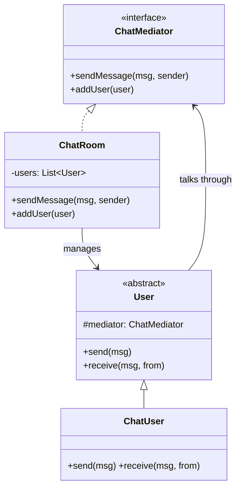
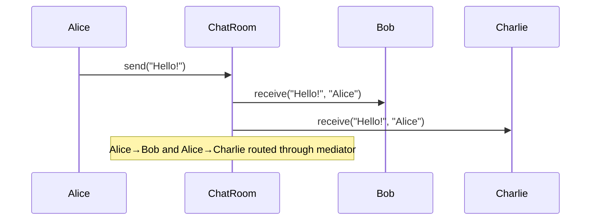
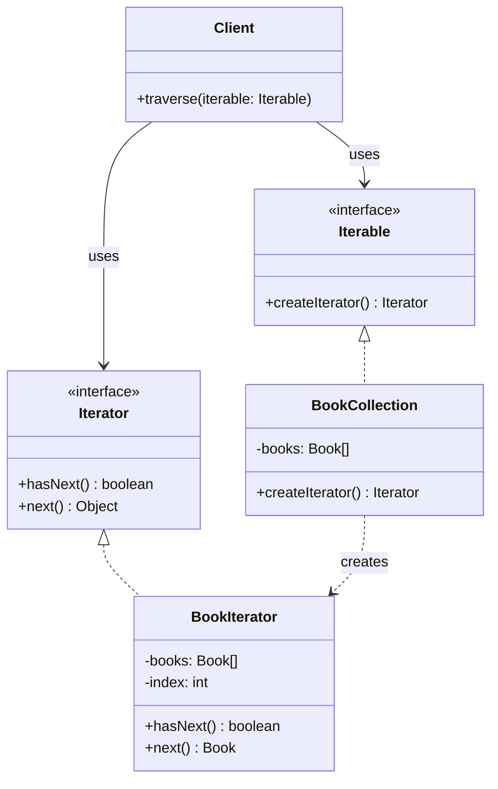

```table-of-contents
title: 
style: nestedList # TOC style (nestedList|nestedOrderedList|inlineFirstLevel)
minLevel: 0 # Include headings from the specified level
maxLevel: 0 # Include headings up to the specified level
include: 
exclude: 
includeLinks: true # Make headings clickable
hideWhenEmpty: false # Hide TOC if no headings are found
debugInConsole: false # Print debug info in Obsidian console
```
# Mediator Pattern

**One-liner:** Define a mediator object that encapsulates how a set of objects interact — so objects don't refer to each other directly, reducing N² connections to N connections through the central coordinator.

---

## Why This Exists — The Problem Without It

```java
// BEFORE: N users in a chat — each knows all others — N² connections
public class User {
    private String name;
    private List<User> contacts;  // must hold reference to EVERY other user

    public void sendMessage(String message) {
        // Must call every other user directly — add a user = update ALL others
        for (User contact : contacts) {
            contact.receive(name + ": " + message);
        }
    }

    public void receive(String message) {
        System.out.println(this.name + " received: " + message);
    }
}

// 10 users = 10 × 9 = 90 direct references. 100 users = 9900 references.
// Adding a new user: must give ALL 100 existing users a reference to the new one.
// Removing a user: must update ALL others to remove their reference.
// Unit testing User in isolation: impossible — requires instantiating entire user graph.

// UI form: same problem with components knowing each other
public class PromoCheckbox {
    private PromoInputField promoField;      // tight coupling to UI sibling
    private NoDiscountRadioButton radioBtn;  // tight coupling to another sibling

    public void onChecked(boolean checked) {
        promoField.setVisible(checked);
        radioBtn.setEnabled(!checked);
        // PromoCheckbox owns coordination logic it shouldn't know about
    }
}
```

---

## Mermaid Class Diagram






---

## Real-World Analogy

Air traffic control (ATC): dozens of planes are in the air at once. No plane talks directly to another plane. All communication flows through ATC (the mediator). When Flight 101 needs to land, it tells ATC; ATC tells Flight 202 to hold; ATC tells Flight 303 to change altitude. Each plane only needs to know the ATC frequency — not where every other plane is or what it intends. Adding a new plane: tell it the ATC frequency. No other plane's code changes.

---

## The Fix — Clean Implementation

```java
// ─── Example 1: Chat Room Mediator ────────────────────────────────────────

// Mediator Interface
public interface ChatMediator {
    void sendMessage(String message, ChatUser sender);
    void addUser(ChatUser user);
    void removeUser(ChatUser user);
}

// Concrete Mediator — owns all coordination logic
public class ChatRoom implements ChatMediator {
    private final String roomName;
    private final List<ChatUser> users = new CopyOnWriteArrayList<>();
    private final List<String> messageHistory = new ArrayList<>();

    public ChatRoom(String roomName) {
        this.roomName = roomName;
    }

    @Override
    public void addUser(ChatUser user) {
        users.add(user);
        // Notify existing users — coordination logic lives here, not in User
        broadcast("[" + roomName + "] " + user.getName() + " joined.", null);
    }

    @Override
    public void removeUser(ChatUser user) {
        users.remove(user);
        broadcast("[" + roomName + "] " + user.getName() + " left.", null);
    }

    @Override
    public void sendMessage(String message, ChatUser sender) {
        String formatted = sender.getName() + ": " + message;
        messageHistory.add(formatted);
        // Mediator decides who gets the message — users don't know each other
        for (ChatUser user : users) {
            if (user != sender) {      // don't echo back to sender
                user.receive(formatted);
            }
        }
    }

    public List<String> getHistory() { return Collections.unmodifiableList(messageHistory); }
}

// Colleague — only knows the mediator, not other colleagues
public class ChatUser {
    private final String name;
    private ChatMediator mediator;  // one reference instead of N references

    public ChatUser(String name) { this.name = name; }

    public void joinRoom(ChatMediator mediator) {
        this.mediator = mediator;
        mediator.addUser(this);
    }

    public void leaveRoom() {
        if (mediator != null) mediator.removeUser(this);
        this.mediator = null;
    }

    public void send(String message) {
        mediator.sendMessage(message, this);  // delegates to mediator — doesn't know who receives
    }

    public void receive(String message) {
        System.out.println("[" + name + " receives] " + message);
    }

    public String getName() { return name; }
}

// ─── Example 2: UI Form Mediator ──────────────────────────────────────────
// When "I have a promo code" checkbox is checked:
//   - Show promo code input field
//   - Disable "no discount" radio button
// None of these components know each other — only the mediator coordinates.

public interface FormMediator {
    void notify(UIComponent sender, String event);
}

public abstract class UIComponent {
    protected FormMediator mediator;
    protected boolean visible = true;
    protected boolean enabled = true;

    public UIComponent(FormMediator mediator) {
        this.mediator = mediator;
    }

    public void setVisible(boolean visible) { this.visible = visible; }
    public void setEnabled(boolean enabled) { this.enabled = enabled; }
    public boolean isVisible() { return visible; }
    public boolean isEnabled() { return enabled; }
}

public class PromoCheckbox extends UIComponent {
    private boolean checked = false;

    public PromoCheckbox(FormMediator mediator) { super(mediator); }

    public void check(boolean checked) {
        this.checked = checked;
        mediator.notify(this, checked ? "CHECKED" : "UNCHECKED");
        // PromoCheckbox is done — it does NOT call promoField.setVisible() directly
    }

    public boolean isChecked() { return checked; }
}

public class PromoCodeInput extends UIComponent {
    private String value = "";

    public PromoCodeInput(FormMediator mediator) {
        super(mediator);
        this.visible = false;  // hidden by default
    }

    public void setValue(String value) { this.value = value; mediator.notify(this, "VALUE_CHANGED"); }
    public String getValue() { return value; }
}

public class NoDiscountRadioButton extends UIComponent {
    public NoDiscountRadioButton(FormMediator mediator) { super(mediator); }
    public void select() { mediator.notify(this, "SELECTED"); }
}

// Concrete Form Mediator — all coordination logic in one place
public class CheckoutFormMediator implements FormMediator {
    private PromoCheckbox promoCheckbox;
    private PromoCodeInput promoCodeInput;
    private NoDiscountRadioButton noDiscountRadio;
    private SubmitButton submitButton;

    // Setters for DI wiring
    public void setPromoCheckbox(PromoCheckbox c) { this.promoCheckbox = c; }
    public void setPromoCodeInput(PromoCodeInput i) { this.promoCodeInput = i; }
    public void setNoDiscountRadio(NoDiscountRadioButton r) { this.noDiscountRadio = r; }
    public void setSubmitButton(SubmitButton b) { this.submitButton = b; }

    @Override
    public void notify(UIComponent sender, String event) {
        if (sender == promoCheckbox) {
            if ("CHECKED".equals(event)) {
                promoCodeInput.setVisible(true);
                noDiscountRadio.setEnabled(false);
                submitButton.setEnabled(false);  // must enter code to enable submit
            } else if ("UNCHECKED".equals(event)) {
                promoCodeInput.setVisible(false);
                noDiscountRadio.setEnabled(true);
                submitButton.setEnabled(true);
            }
        } else if (sender == promoCodeInput && "VALUE_CHANGED".equals(event)) {
            boolean hasCode = !promoCodeInput.getValue().isBlank();
            submitButton.setEnabled(hasCode);
        }
        // All coordination logic is HERE — components are dumb, mediator is smart
    }
}

// ─── Spring ApplicationEventPublisher as Mediator ─────────────────────────
@Service
public class OrderPlacementService {
    private final ApplicationEventPublisher publisher;  // Spring's mediator

    public OrderPlacementService(ApplicationEventPublisher publisher) {
        this.publisher = publisher;
    }

    public void placeOrder(Order order) {
        // OrderPlacementService doesn't know EmailService, SMSService, InventoryService
        // It just tells the mediator something happened
        publisher.publishEvent(new OrderPlacedEvent(order, Instant.now()));
    }
}
```

---

## Class Diagram

```
  ChatUser (Colleague)          ChatRoom (Mediator)
  ─────────────────────         ──────────────────────────────
  -mediator: ChatMediator       -users: List<ChatUser>
  +send(message)    ──────────→ +sendMessage(msg, sender)
  +receive(message) ←────────── +addUser(user)
  [does NOT reference           +removeUser(user)
   other ChatUser objects]
                                N connections instead of N² connections

  Without Mediator:              With Mediator:
  User1 ──→ User2                User1 ──→ ChatRoom ←── User2
  User1 ──→ User3                User3 ──→ ChatRoom
  User2 ──→ User1                                     (N refs, not N²)
  User2 ──→ User3
  (N² refs)
```

---

## Real Systems Using This

| System | Mediator usage |
|---|---|
| Spring `ApplicationEventPublisher` | Components publish events to the publisher (mediator); listeners react without knowing each other |
| Apache Kafka / RabbitMQ | Message broker as mediator — producers and consumers never know about each other |
| CQRS Command Bus | Commands sent to bus (mediator); handlers registered; bus routes to correct handler |
| API Gateway (Kong, AWS API GW) | Mediates between clients and microservices — client doesn't know which service handles the request |
| Redux (JS) | Store is the mediator; components dispatch actions; reducers react; no component-to-component calls |
| Java `ExecutorService` | Caller submits task to executor (mediator); executor routes to an available thread |

---

## SDE-2/SDE-3 Interview Signals

| If interviewer says... | Think Mediator |
|---|---|
| "Many components that all need to communicate" | Mediator — N² → N connections |
| "Decouple components so they don't know each other" | Mediator — all communication through central hub |
| "Design a chat room / event bus" | Mediator — chat room IS the mediator |
| "UI components coordinating without knowing each other" | Mediator — form mediator pattern |
| "API gateway routing requests to services" | Mediator at infrastructure level |
| "Event-driven coordination between services" | Mediator — message broker as distributed mediator |

---

## When to Use

- Multiple objects communicate in complex ways that result in high coupling
- Adding or removing a participant should not affect others
- Reusing a component is difficult because it knows about many other components
- You want to centralize complex coordination logic in one place

## When NOT to Use

- Only 2 objects need to interact — direct reference is simpler
- Mediator would become a god class with too much responsibility — split into focused mediators
- Performance-critical: every message goes through mediator — adds indirection
- Communication is strictly one-to-many broadcast (use Observer instead)

---

## Trade-offs & Alternatives

| Aspect | Mediator | Alternative |
|---|---|---|
| Coupling | Colleagues decoupled from each other | Direct references (tight coupling) |
| Centralization | Logic concentrated in mediator | Distributed logic (harder to trace) |
| God class risk | High — mediator accumulates logic | Split into domain-specific mediators |
| Testability | Test each colleague in isolation | Hard when colleagues know each other |

**Mediator vs Observer — critical distinction:**
- Observer: one publisher, many subscribers — one-to-many broadcast. Publisher doesn't know subscribers.
- Mediator: many-to-many coordination. Mediator contains routing logic between specific parties. Colleagues know the mediator, mediator knows all colleagues.

---

## Common Interview Mistakes

1. **Mediator becoming a God class** — when mediator grows to 500 lines, it knows too much. Split into domain-specific mediators (CheckoutFormMediator, ChatRoomMediator) rather than one global mediator.
2. **Colleagues calling each other directly AND using mediator** — defeats the pattern. If colleagues bypass the mediator even once, coupling creeps back in.
3. **Confusing Mediator with Observer** — Observer: subject broadcasts, doesn't care who listens; Mediator: has routing logic, coordinates specific parties, may trigger different reactions for different events.
4. **Making mediator synchronous when it should be async** — if one handler is slow, it blocks all others. Use async dispatch for non-critical notifications.
5. **Not removing colleagues on disconnect** — in a chat room, if a user disconnects and isn't removed from the mediator's list, future messages are sent to a ghost user.

---

## Executable Example (Copy-Paste-Run)

```java
// File: MediatorDemo.java
// Run:  javac MediatorDemo.java && java MediatorDemo

import java.util.*;

public class MediatorDemo {

    interface ChatMediator {
        void sendMessage(String msg, User sender);
        void addUser(User user);
    }

    static class ChatRoom implements ChatMediator {
        private final List<User> users = new ArrayList<>();
        private final String name;
        ChatRoom(String name) { this.name = name; }

        public void addUser(User u) { users.add(u); System.out.println("  " + u.name + " joined #" + name); }

        public void sendMessage(String msg, User sender) {
            for (User u : users) {
                if (u != sender) u.receive(msg, sender.name);
            }
        }
    }

    static class User {
        final String name;
        private final ChatMediator mediator;

        User(String name, ChatMediator m) { this.name = name; this.mediator = m; }
        void send(String msg) {
            System.out.println(name + " says: " + msg);
            mediator.sendMessage(msg, this);
        }
        void receive(String msg, String from) {
            System.out.println("  " + name + " received from " + from + ": " + msg);
        }
    }

    public static void main(String[] args) {
        ChatRoom room = new ChatRoom("general");

        User alice = new User("Alice", room);
        User bob = new User("Bob", room);
        User charlie = new User("Charlie", room);

        room.addUser(alice);
        room.addUser(bob);
        room.addUser(charlie);

        System.out.println("\n=== Messaging ===");
        alice.send("Hey everyone!");
        // Alice says: Hey everyone!
        //   Bob received from Alice: Hey everyone!
        //   Charlie received from Alice: Hey everyone!

        System.out.println();
        bob.send("Hi Alice!");
        // Bob says: Hi Alice!
        //   Alice received from Bob: Hi Alice!
        //   Charlie received from Bob: Hi Alice!
    }
}
```

---

## Anti-Pattern

```java
// Without Mediator: N² direct references
class User {
    List<User> contacts; // knows about ALL other users directly
    void send(String msg) {
        for (User u : contacts) u.receive(msg); // add new user = update everyone's list
    }
}
// 5 users = 20 direct references. 100 users = 9,900 references.
// With Mediator: 100 users × 1 mediator reference = 100 references.
```

---

## Spring Boot Connection

```java
// Spring's DispatcherServlet IS a Mediator
// Incoming HTTP request → DispatcherServlet → routes to correct Controller
// Controllers don't know about each other — only the dispatcher does

// Redux store (React) IS a Mediator
// Components dispatch actions → store → store notifies relevant subscribers
```

---

## Which LLD Problems Use This

- [[../../examples/lld_pub_sub_system]] — Broker mediates publishers ↔ consumers
- [[../../examples/lld_notification_system]] — NotificationRouter mediates channels

---

## Follow-up Questions

| Question | Answer |
|----------|--------|
| "Mediator vs Observer?" | Observer = one-to-many broadcast. Mediator = many-to-many coordination with logic. |
| "Mediator vs Facade?" | Facade = one-directional (outside→inside). Mediator = bidirectional. |
| "What if mediator grows too big?" | Split by domain — ChatMediator, TradeMediator, NotificationMediator. |

---

## Interview Script

> "I see many objects communicating directly with each other — N² connections. I'll introduce a Mediator that centralizes all communication. Objects only know the mediator, not each other. This reduces N² connections to N. Adding a new participant = register with mediator, zero changes to existing participants."

---

## Thread-Safety Note

```
User list: CopyOnWriteArrayList for concurrent add/iterate.
sendMessage: if called from multiple threads, mediator must handle concurrent dispatch.
Stateless mediator routing → thread-safe. Stateful routing → synchronize.
```

---

## Complexity Analysis

| Scenario | Without Mediator | With Mediator |
|----------|-----------------|---------------|
| Connections | N × (N-1) direct | N (each to mediator) |
| Add new participant | Update all existing | Register with mediator only |
| Change routing logic | Scattered across classes | Centralized in mediator |

---

## Combines Well With

- **Observer** — mediator can use observer internally for pub-sub
- **Facade** — Facade simplifies; Mediator coordinates
- **Command** — command bus pattern: commands → mediator → handler
- **Singleton** — mediator is often singleton for a given context

---

## Cheat Sheet

```
Mediator = central hub; colleagues only know mediator, not each other
N² connections (direct) → N connections (through mediator)
Mediator owns coordination logic; colleagues are dumb — they just notify and receive
Risk: mediator becomes god class — split by domain when it grows large
Mediator vs Observer: Mediator routes many-to-many; Observer broadcasts one-to-many
Real mediators: Kafka, RabbitMQ, API Gateway, Spring ApplicationEventPublisher, Redux store
```

---
---

# ChatGPT
## Iterator Pattern

---

## 1. Real World Analogy

Think about a **TV remote**. You press the **next channel** button — you don't care:

- How channels are stored internally
- Whether they're in an array, a list, or a database
- What the total number of channels is

You just press next → get next channel. Press next again → get the one after. You **traverse** through channels without knowing anything about how they're stored.

That is the Iterator pattern. **Provide a standard way to go through a collection without exposing how it's stored internally.**

---

## 2. The Problem It Solves

You have three different collections. Without Iterator:

```java
// Array — traverse one way
for (int i = 0; i < arr.length; i++) { }

// ArrayList — traverse differently
for (int i = 0; i < list.size(); i++) { }

// LinkedList — traverse yet another way
Node current = head;
while (current != null) { current = current.next; }
```

Every collection has a **different traversal mechanism**. Client code must know the internal structure of each. Change the structure → change all client code.

---

## 3. UML — Mermaid Format



Two interfaces — `Iterator` defines how to traverse, `Iterable` defines how to get an iterator. Client only talks to these interfaces — never to the collection directly.

---

## 4. Full Java Code — Step by Step

**Step 1 — The Iterator interface:**

```java
interface Iterator<T> {
    boolean hasNext();   // is there a next element?
    T next();            // give me the next element
}
```

---

**Step 2 — The Iterable interface:**

```java
interface Iterable<T> {
    Iterator<T> createIterator();
}
```

---

**Step 3 — The collection and its iterator:**

```java
class Book {
    private String title;
    private String author;

    public Book(String title, String author) {
        this.title  = title;
        this.author = author;
    }

    public String getTitle()  { return title; }
    public String getAuthor() { return author; }
}

// Collection
class BookCollection implements Iterable<Book> {
    private List<Book> books = new ArrayList<>();

    public void addBook(Book book) {
        books.add(book);
    }

    // returns an iterator — client uses this, never touches books directly
    public Iterator<Book> createIterator() {
        return new BookIterator(books);
    }
}

// Iterator — knows how to traverse BookCollection
class BookIterator implements Iterator<Book> {
    private List<Book> books;
    private int index = 0;

    public BookIterator(List<Book> books) {
        this.books = books;
    }

    public boolean hasNext() {
        return index < books.size();
    }

    public Book next() {
        return books.get(index++);
    }
}
```

---

**Step 4 — Client:**

```java
public class Main {
    public static void main(String[] args) {

        BookCollection collection = new BookCollection();
        collection.addBook(new Book("Clean Code",         "Robert Martin"));
        collection.addBook(new Book("Design Patterns",    "Gang of Four"));
        collection.addBook(new Book("Effective Java",     "Joshua Bloch"));
        collection.addBook(new Book("System Design",      "Alex Xu"));

        // client uses iterator — never knows about internal List
        Iterator<Book> iterator = collection.createIterator();

        while (iterator.hasNext()) {
            Book book = iterator.next();
            System.out.println(book.getTitle()
                + " by " + book.getAuthor());
        }
    }
}
```

**Output:**

```
Clean Code         by Robert Martin
Design Patterns    by Gang of Four
Effective Java     by Joshua Bloch
System Design      by Alex Xu
```

---

## 5. Real Backend Example — Multiple Data Source Iterator

This is where Iterator really shines — traverse different data sources through one uniform interface:

```java
// Common iterator interface
interface UserIterator {
    boolean hasNext();
    User next();
}

// Source 1 — users from database (paginated)
class DatabaseUserIterator implements UserIterator {
    private UserRepository repository;
    private int pageSize;
    private int currentPage = 0;
    private List<User> currentBatch = new ArrayList<>();
    private int indexInBatch = 0;

    public DatabaseUserIterator(UserRepository repo, int pageSize) {
        this.repository = repo;
        this.pageSize   = pageSize;
        loadNextBatch();
    }

    private void loadNextBatch() {
        currentBatch = repository.findAll(
            PageRequest.of(currentPage++, pageSize)
        ).getContent();
        indexInBatch = 0;
    }

    public boolean hasNext() {
        if (indexInBatch < currentBatch.size()) return true;
        if (currentBatch.size() < pageSize) return false;
        loadNextBatch();
        return !currentBatch.isEmpty();
    }

    public User next() {
        return currentBatch.get(indexInBatch++);
    }
}

// Source 2 — users from CSV file
class CsvUserIterator implements UserIterator {
    private BufferedReader reader;
    private String nextLine;

    public CsvUserIterator(String filePath) throws IOException {
        reader   = new BufferedReader(new FileReader(filePath));
        nextLine = reader.readLine(); // skip header
        nextLine = reader.readLine();
    }

    public boolean hasNext() {
        return nextLine != null;
    }

    public User next() {
        String[] parts = nextLine.split(",");
        User user = new User(parts[0], parts[1]);
        try { nextLine = reader.readLine(); }
        catch (IOException e) { nextLine = null; }
        return user;
    }
}

// Client — same traversal logic regardless of source
class EmailCampaignService {
    public void sendCampaign(UserIterator iterator) {
        while (iterator.hasNext()) {
            User user = iterator.next();
            System.out.println("Sending email to: " + user.getEmail());
        }
    }
}

// Wire it up
EmailCampaignService campaignService = new EmailCampaignService();

// send to DB users
campaignService.sendCampaign(new DatabaseUserIterator(userRepo, 100));

// send to CSV users — same method, different iterator
campaignService.sendCampaign(new CsvUserIterator("users.csv"));
```

`sendCampaign()` never changes. Swap data sources by swapping iterators.

---

## 6. Where It Appears in Java / Spring

```java
// 1. Java's own Iterator — you use this every day
List<String> names = Arrays.asList("Alice", "Bob", "Carol");
Iterator<String> it = names.iterator();
while (it.hasNext()) {
    System.out.println(it.next());
}

// 2. Enhanced for-loop — syntactic sugar over Iterator
for (String name : names) {   // Java calls iterator() under the hood
    System.out.println(name);
}

// 3. Java Iterable interface
// Any class implementing Iterable<T> can be used in for-each loop
public class BookCollection implements Iterable<Book> {
    public java.util.Iterator<Book> iterator() {
        return books.iterator();
    }
}
// now you can do:
for (Book book : bookCollection) { }

// 4. Spring Data — pagination is Iterator in disguise
Page<User> page = userRepository.findAll(PageRequest.of(0, 100));
while (page.hasNext()) {
    page = userRepository.findAll(page.nextPageable());
    // process page
}

// 5. ResultSet in JDBC
ResultSet rs = statement.executeQuery("SELECT * FROM users");
while (rs.next()) {            // hasNext() + next() combined
    String name = rs.getString("name");
}
```

---

## 7. Comparison With Similar Patterns

||Iterator|Composite|Visitor|
|---|---|---|---|
|**Purpose**|Traverse a collection|Tree of objects|Add operations to objects|
|**Knows structure?**|❌ No — abstracted away|✅ Yes — tree structure|✅ Yes — visits each node|
|**Direction**|Forward (usually)|Recursive|Depends on implementation|
|**Used for**|Uniform traversal|Part-whole hierarchy|Adding ops without changing|

---

## 8. Trade-offs

**Pros:**

- Client code never depends on collection's internal structure
- Same traversal logic works for arrays, lists, trees, databases
- Multiple iterators can traverse the same collection independently
- Supports different traversal strategies — forward, backward, filtered

**Cons:**

- Overkill for simple collections already handled by Java's built-in `for-each`
- Iterator holds state — can go stale if collection is modified during traversal
- Less efficient than direct index access for random access collections

---

## 9. Interview Question + One-Line Summary

**Interview question:**

> _"Design a notification feed that can iterate over notifications from multiple sources — database, cache, and external API — through a single unified interface."_

```java
interface NotificationIterator {
    boolean hasNext();
    Notification next();
}

// DB notifications
class DbNotificationIterator implements NotificationIterator {
    private List<Notification> notifications;
    private int index = 0;

    public DbNotificationIterator(NotificationRepository repo, String userId) {
        this.notifications = repo.findByUserId(userId);
    }

    public boolean hasNext() { return index < notifications.size(); }
    public Notification next() { return notifications.get(index++); }
}

// Cache notifications
class CacheNotificationIterator implements NotificationIterator {
    private Queue<Notification> cache;

    public CacheNotificationIterator(CacheService cache, String userId) {
        this.cache = new LinkedList<>(cache.getNotifications(userId));
    }

    public boolean hasNext() { return !cache.isEmpty(); }
    public Notification next() { return cache.poll(); }
}

// Composite iterator — merges multiple iterators into one
class CompositeNotificationIterator implements NotificationIterator {
    private List<NotificationIterator> iterators;
    private int current = 0;

    public CompositeNotificationIterator(
            List<NotificationIterator> iterators) {
        this.iterators = iterators;
    }

    public boolean hasNext() {
        while (current < iterators.size()) {
            if (iterators.get(current).hasNext()) return true;
            current++;
        }
        return false;
    }

    public Notification next() {
        return iterators.get(current).next();
    }
}

// Client — one loop over all sources
NotificationIterator iterator = new CompositeNotificationIterator(
    Arrays.asList(
        new DbNotificationIterator(repo, "user1"),
        new CacheNotificationIterator(cache, "user1")
    )
);

while (iterator.hasNext()) {
    System.out.println(iterator.next().getMessage());
}
```

---

**One-line SDE-2 summary:**

> _"Iterator provides a standard way to sequentially traverse a collection without exposing its internal structure — letting the same client code work across arrays, lists, databases, and any custom collection, used in Java's for-each, JDBC ResultSet, and Spring Data pagination."_

---

Ready for **Mediator** next?