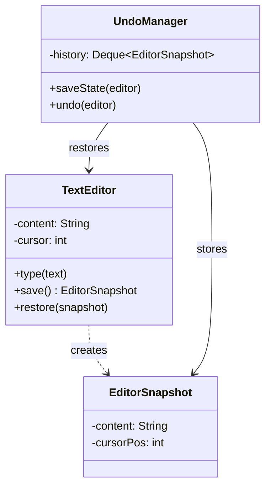
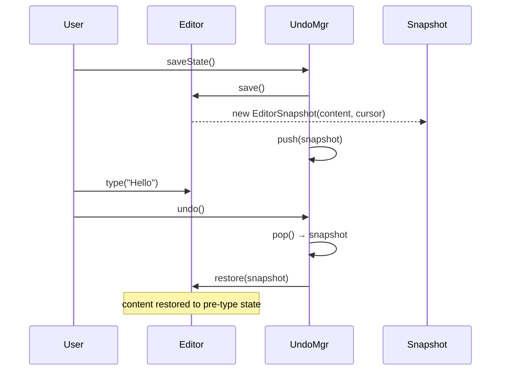
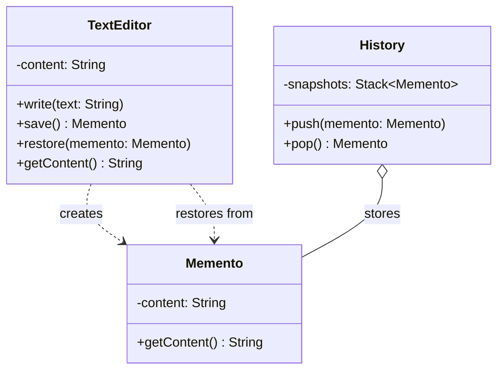

```table-of-contents
title: 
style: nestedList # TOC style (nestedList|nestedOrderedList|inlineFirstLevel)
minLevel: 0 # Include headings from the specified level
maxLevel: 0 # Include headings up to the specified level
include: 
exclude: 
includeLinks: true # Make headings clickable
hideWhenEmpty: false # Hide TOC if no headings are found
debugInConsole: false # Print debug info in Obsidian console
```
# Memento Pattern

**One-liner:** Capture and externalize an object's internal state into an opaque snapshot so the object can be restored to that state later — without violating encapsulation.

---

## Why This Exists — The Problem Without It

```java
// BEFORE: External code must access internals to save/restore state — breaks encapsulation
public class TextEditor {
    private String content;
    private int cursorPosition;
    private String selectedText;
    private Font currentFont;
    // Many more internal fields...

    // To support undo, caller must save all these fields externally
    public String getContent() { return content; }
    public int getCursorPosition() { return cursorPosition; }
    public String getSelectedText() { return selectedText; }
    public Font getCurrentFont() { return currentFont; }

    // And restore them — caller manipulates internals directly
    public void setContent(String c) { this.content = c; }
    public void setCursorPosition(int p) { this.cursorPosition = p; }
    public void setSelectedText(String s) { this.selectedText = s; }
    public void setCurrentFont(Font f) { this.currentFont = f; }
}

// UndoManager now KNOWS all internals of TextEditor — high coupling
public class UndoManager {
    public void saveState(TextEditor editor) {
        // Must access every internal field — if TextEditor adds a new field,
        // UndoManager must be updated too
        savedContent = editor.getContent();
        savedCursor = editor.getCursorPosition();
        savedSelection = editor.getSelectedText();
        savedFont = editor.getCurrentFont();
    }
}
// Adding a new field to TextEditor = update UndoManager, any other saver, etc.
```

---

## Mermaid Class Diagram




```

---

## Real-World Analogy

Video game save points: your character has complex state (health, inventory, position, quests). When you "save game", the game captures all that into an opaque save file (you can't read the binary format). If you die, you "load game" — the game restores itself from the file. You (the caretaker) just hold the save file; you don't open it or edit it. The game engine (originator) knows how to create and restore from its own save files.

---

## The Fix — Clean Implementation

```java
// ─── Three roles of Memento Pattern ──────────────────────────────────────
//   1. Originator  (TextEditor)   — creates and restores mementos
//   2. Memento     (EditorMemento) — stores state, opaque to everyone except Originator
//   3. Caretaker   (UndoManager)  — holds history of mementos, never reads them

// ─── Memento — inner class ensures only Originator can access internals ───
public class TextEditor {

    private String content;
    private int cursorPosition;
    private String selectedText;
    private Font currentFont;

    // ─── Memento is a private inner class (only TextEditor can instantiate) ──
    // Caretaker receives type EditorMemento but can't access its fields
    public static final class EditorMemento {
        private final String content;          // private — Caretaker cannot read this
        private final int cursorPosition;
        private final String selectedText;
        private final Font currentFont;
        private final Instant savedAt;

        // Package-private constructor — only TextEditor (in same package) creates it
        private EditorMemento(String content, int cursorPosition,
                               String selectedText, Font currentFont) {
            this.content = content;
            this.cursorPosition = cursorPosition;
            this.selectedText = selectedText;
            this.currentFont = currentFont;
            this.savedAt = Instant.now();
        }

        // No getters for content/position/selection/font — opaque to Caretaker
        public Instant getSavedAt() { return savedAt; }  // metadata only, not state
    }

    // ─── Originator creates and restores mementos ─────────────────────────
    public EditorMemento save() {
        return new EditorMemento(content, cursorPosition, selectedText, currentFont);
    }

    public void restore(EditorMemento memento) {
        // Only Originator can access Memento's private fields (inner class relationship)
        this.content = memento.content;
        this.cursorPosition = memento.cursorPosition;
        this.selectedText = memento.selectedText;
        this.currentFont = memento.currentFont;
    }

    // Editor operations that change state
    public void type(String text) {
        content = content == null ? text : content.substring(0, cursorPosition) + text
            + content.substring(cursorPosition);
        cursorPosition += text.length();
    }

    public void delete(int chars) {
        if (cursorPosition < chars) return;
        content = content.substring(0, cursorPosition - chars)
            + content.substring(cursorPosition);
        cursorPosition -= chars;
    }

    public void moveCursor(int position) { this.cursorPosition = position; }
    public void selectText(int start, int end) {
        this.selectedText = content.substring(start, end);
    }
    public void setFont(Font font) { this.currentFont = font; }

    public String getContent() { return content; }
    public int getCursorPosition() { return cursorPosition; }
}

// ─── Caretaker — holds history, never reads mementos ─────────────────────
public class UndoManager {
    private final Deque<TextEditor.EditorMemento> undoHistory = new ArrayDeque<>();
    private final Deque<TextEditor.EditorMemento> redoHistory = new ArrayDeque<>();
    private static final int MAX_UNDO_STEPS = 20;  // bounded — limit memory usage
    private final TextEditor editor;

    public UndoManager(TextEditor editor) {
        this.editor = editor;
    }

    // Call before any state-changing operation
    public void saveState() {
        TextEditor.EditorMemento snapshot = editor.save();
        undoHistory.push(snapshot);
        redoHistory.clear();  // new action invalidates redo history
        enforceSizeLimit();
    }

    public boolean undo() {
        if (undoHistory.isEmpty()) return false;
        // Save current state to redo stack before restoring
        redoHistory.push(editor.save());
        TextEditor.EditorMemento previous = undoHistory.pop();
        editor.restore(previous);  // Originator restores itself from its own memento
        return true;
    }

    public boolean redo() {
        if (redoHistory.isEmpty()) return false;
        undoHistory.push(editor.save());
        TextEditor.EditorMemento next = redoHistory.pop();
        editor.restore(next);
        return true;
    }

    private void enforceSizeLimit() {
        // Bounded deque: if history exceeds MAX_UNDO_STEPS, drop oldest (bottom of deque)
        while (undoHistory.size() > MAX_UNDO_STEPS) {
            ((ArrayDeque<TextEditor.EditorMemento>) undoHistory).removeLast();
        }
    }

    public int undoDepth() { return undoHistory.size(); }
    public int redoDepth() { return redoHistory.size(); }
    public boolean canUndo() { return !undoHistory.isEmpty(); }
    public boolean canRedo() { return !redoHistory.isEmpty(); }
}

// ─── Usage ────────────────────────────────────────────────────────────────
public class EditorDemo {
    public static void main(String[] args) {
        TextEditor editor = new TextEditor();
        UndoManager undoManager = new UndoManager(editor);

        undoManager.saveState();         // save initial state
        editor.type("Hello");
        System.out.println(editor.getContent()); // "Hello"

        undoManager.saveState();         // save before next change
        editor.type(" World");
        System.out.println(editor.getContent()); // "Hello World"

        undoManager.undo();              // restore to "Hello"
        System.out.println(editor.getContent()); // "Hello"

        undoManager.redo();              // restore to "Hello World"
        System.out.println(editor.getContent()); // "Hello World"

        // Bounded history demo
        for (int i = 0; i < 25; i++) {
            undoManager.saveState();
            editor.type("x");
        }
        System.out.println("Undo depth: " + undoManager.undoDepth()); // 20 (bounded)
    }
}

// ─── Database savepoint analogy ───────────────────────────────────────────
// SQL SAVEPOINT is a memento: DB engine captures transaction state (originator),
// stores it as a savepoint (memento), and can ROLLBACK TO SAVEPOINT (restore)
// Your code (caretaker) just knows the savepoint name, not the state inside.
//
// SAVEPOINT before_update;         -- editor.save() → undoManager.push(memento)
// UPDATE account SET ...;          -- editor.type(...)
// ROLLBACK TO SAVEPOINT before_update; -- undoManager.undo() → editor.restore(memento)
```

---

## Class Diagram

```
  UndoManager (Caretaker)         TextEditor (Originator)
  ─────────────────────────       ──────────────────────────
  -undoHistory: Deque<Memento>    -content: String
  -redoHistory: Deque<Memento>    -cursorPosition: int
  +saveState()                    -currentFont: Font
  +undo()               ◄──────── +save(): EditorMemento
  +redo()               ────────► +restore(EditorMemento)
                                  +type(text)
                                       │
                                  creates/reads
                                       ▼
                             EditorMemento (inner class)
                             ─────────────────────────────
                             -content (private)
                             -cursorPosition (private)
                             -savedAt (metadata only)
                             [opaque to Caretaker]
```

---

## Real Systems Using This

| System | Memento usage |
|---|---|
| Any text editor (Ctrl+Z) | Classic Memento — state snapshots in undo stack |
| SQL `SAVEPOINT` / `ROLLBACK TO` | DB engine captures transaction state; ROLLBACK restores it |
| `git stash` | Stashes working tree state (memento); `git stash pop` restores it |
| Browser back/forward history | Page state (scroll position, form data) stored as snapshots |
| Chess game replay | Board state captured at each move; replay navigates the snapshot list |
| Android Activity `onSaveInstanceState()` | Activity saves state to Bundle (memento); restored in `onCreate()` |

---

## SDE-2/SDE-3 Interview Signals

| If interviewer says... | Think Memento |
|---|---|
| "Implement undo/redo" | Memento for state snapshots (or Command for inverse logic) |
| "Save and restore object state" | Memento — originator creates snapshot, caretaker stores it |
| "Checkpoint / rollback" | Memento — savepoint pattern |
| "Undo without exposing internals" | Memento — encapsulated state snapshot |
| "How does git stash work conceptually?" | Memento — snapshot of working tree |
| "Audit trail with ability to replay" | Memento — sequence of snapshots |

---

## When to Use

- Need undo/redo where the inverse operation is difficult or impossible to compute
- Object state must be saved externally without exposing its internal representation
- Implementing checkpoints/rollback in long-running operations
- Game state, editor history, configuration version history

## When NOT to Use

- Object state is large — snapshots will consume too much memory (consider Command for delta-only undo)
- State changes frequently and undo depth is deep — memory explodes with full snapshots
- Inverse operation is simple and trivial to compute (Command's undo() is cleaner)
- Object references other mutable objects — shallow copy memento will have aliasing bugs; need deep copy

---

## Trade-offs & Alternatives

| Aspect | Memento | Command (for undo) |
|---|---|---|
| Undo mechanism | Restore full state snapshot | Re-execute inverse operation |
| When to use | Inverse is hard/impossible | Inverse is clear and cheap |
| Memory | Higher (full snapshots) | Lower (only parameters stored) |
| Correctness | Always correct (snapshot = ground truth) | Depends on inverse logic correctness |
| External state | Encapsulated | N/A |

---

## Common Interview Mistakes

1. **Caretaker accessing Memento's state** — the cardinal sin. If UndoManager reads `memento.content`, encapsulation is broken. Use inner class or package-private access to prevent this.
2. **Shallow copy of mutable fields** — if `content` was a `StringBuilder` (mutable), copying the reference means the snapshot changes when the editor changes. Always deep-copy mutable state in the memento constructor.
3. **No bounded history** — undo stack grows unbounded. In a long editing session, this causes OOM. Cap with `MAX_UNDO_STEPS` and drop oldest entries.
4. **Not pushing to redo stack before undo** — without saving current state to redo stack during undo(), redo() has nothing to restore.
5. **Not clearing redo stack on new user action** — after undo, if user types something new, redo should be invalidated (same as any text editor).

---

## Executable Example (Copy-Paste-Run)

```java
// File: MementoDemo.java
// Run:  javac MementoDemo.java && java MementoDemo

import java.util.*;

public class MementoDemo {

    // Memento — opaque snapshot
    record EditorSnapshot(String content, int cursorPos) {}

    // Originator — creates and restores snapshots
    static class TextEditor {
        private StringBuilder content = new StringBuilder();
        private int cursor = 0;

        void type(String text) { content.insert(cursor, text); cursor += text.length(); }
        void moveCursor(int pos) { cursor = Math.min(pos, content.length()); }
        EditorSnapshot save() { return new EditorSnapshot(content.toString(), cursor); }
        void restore(EditorSnapshot s) { content = new StringBuilder(s.content()); cursor = s.cursorPos(); }
        String getContent() { return content.toString(); }
    }

    // Caretaker — manages history (never peeks inside snapshots)
    static class UndoManager {
        private final Deque<EditorSnapshot> history = new ArrayDeque<>();
        void saveState(TextEditor editor) { history.push(editor.save()); }
        void undo(TextEditor editor) {
            if (!history.isEmpty()) editor.restore(history.pop());
            else System.out.println("  (nothing to undo)");
        }
        int historySize() { return history.size(); }
    }

    public static void main(String[] args) {
        TextEditor editor = new TextEditor();
        UndoManager undo = new UndoManager();

        undo.saveState(editor);
        editor.type("Hello");
        System.out.println("After 'Hello':   \"" + editor.getContent() + "\"");

        undo.saveState(editor);
        editor.type(" World");
        System.out.println("After ' World':  \"" + editor.getContent() + "\"");

        undo.saveState(editor);
        editor.type("!!!");
        System.out.println("After '!!!':     \"" + editor.getContent() + "\"");

        System.out.println("\nHistory size: " + undo.historySize());

        System.out.println("\n=== Undoing ===");
        undo.undo(editor);
        System.out.println("Undo 1: \"" + editor.getContent() + "\"");  // Hello World

        undo.undo(editor);
        System.out.println("Undo 2: \"" + editor.getContent() + "\"");  // Hello

        undo.undo(editor);
        System.out.println("Undo 3: \"" + editor.getContent() + "\"");  // (empty)

        undo.undo(editor);  // nothing to undo
    }
}
```

**Expected output:**
```
After 'Hello':   "Hello"
After ' World':  "Hello World"
After '!!!':     "Hello World!!!"

History size: 3

=== Undoing ===
Undo 1: "Hello World"
Undo 2: "Hello"
Undo 3: ""
  (nothing to undo)
```

---

## Anti-Pattern

```java
// Without Memento: manually saving every field for undo
String prevContent = editor.content;
int prevCursor = editor.cursor;
int prevSelStart = editor.selectionStart;
// ... 15 more fields to save manually
// Restore: set all 15 fields back — fragile, error-prone, violates encapsulation
```

---

## Spring Boot Connection

```java
// Serialization = industrial Memento
// ObjectOutputStream.writeObject() → serialize entire state to bytes (snapshot)
// ObjectInputStream.readObject() → restore from bytes (restore)

// Git commits = Memento pattern at repository level
// Each commit = snapshot. git checkout = restore.

// Database savepoints:
// connection.setSavepoint("before_update");  → save
// connection.rollback(savepoint);            → restore
```

---

## Which LLD Problems Use This

- [[../../examples/lld_chess]] — Save board state before move, restore on undo
- [[../../examples/lld_stock_trading]] — Snapshot portfolio state before trade execution

---

## Follow-up Questions

| Question | Answer |
|----------|--------|
| "Memento vs Command for undo?" | Command = reverse operation. Memento = full snapshot. Snapshot wins when reverse is hard. |
| "Memory concern with large state?" | Cap undo stack at N. Or use incremental diffs instead of full snapshots. |
| "Who can read the Memento?" | ONLY the Originator. Caretaker stores but never inspects. Use private inner class. |

---

## Interview Script

> "I need undo/redo and the state is complex (multiple interrelated fields). I'll use Memento — the editor creates an opaque snapshot via `save()`, the UndoManager stores it without inspecting it, and `restore()` rolls back to that exact state. This preserves encapsulation — only the originator knows its internals."

---

## Thread-Safety Note

```
Memento objects: immutable (record) → thread-safe by default.
UndoManager history: if accessed from multiple threads, use synchronized Deque.
Save before modify: must be atomic — save + modify should not be interleaved by another thread.
```

---

## Complexity Analysis

| Scenario | Without Memento | With Memento |
|----------|----------------|-------------|
| Undo | Manually reverse each field | Restore from snapshot |
| Add new field | Update ALL save/restore code | Automatic (snapshot captures all) |
| Encapsulation | External code accesses internals | Only originator accesses |

---

## Combines Well With

- **Command** — command saves memento before execute, uses it for undo
- **Iterator** — iterate through memento history to replay/audit
- **Prototype** — cloning = snapshot without the three-role structure

---

## Cheat Sheet

```
Three roles: Originator (creates/restores), Memento (opaque snapshot), Caretaker (stores history)
Caretaker NEVER reads Memento internals — only Originator can access its own snapshot
Enforce encapsulation: make Memento a private inner class of Originator
Bounded undo stack: cap at MAX_UNDO_STEPS, drop oldest from bottom of deque
Deep-copy all mutable fields in Memento constructor — never copy references
Memento vs Command: Memento = full snapshot; Command = inverse logic. Snapshot wins when inverse is hard.
```

# ChatGPT

## Memento Pattern

---

## 1. Real World Analogy

You're typing a document in **Microsoft Word**. You make some changes. Then you press **Ctrl+Z** — undo. The document goes back to exactly how it was before.

How does Word know what the previous state was? It **saved a snapshot** of the document before you made changes. That snapshot is the **Memento**.

Think of it like this:

- You're playing a **video game**
- Before a difficult boss fight you hit **Save**
- You die — you **Load** the save
- You're back to exactly where you were

The save file is the Memento. The game is the Originator. The save slot is the Caretaker.

---

## 2. The Problem It Solves

You're building a text editor. Without Memento:

```java
class TextEditor {
    private String content;

    public void write(String text) {
        content += text;
    }

    public void undo() {
        // HOW? You have no previous state saved anywhere
        // impossible without storing history
    }
}
```

No history. No undo. You'd have to expose the internal state publicly to save it externally — which breaks encapsulation.

Memento solves this by letting the object **save its own state** into a snapshot object — without exposing internals.

---

## 3. UML — Mermaid Format



Three participants:

- **Originator** (`TextEditor`) — the object whose state we save and restore
- **Memento** — the snapshot, holds saved state
- **Caretaker** (`History`) — stores mementos, never looks inside them

---

## 4. Full Java Code — Step by Step

**Step 1 — The Memento (snapshot):**

```java
// Memento — holds a snapshot of TextEditor's state
// Immutable — state cannot be changed once saved
class Memento {
    private final String content;   // saved state

    public Memento(String content) {
        this.content = content;
    }

    public String getContent() {
        return content;
    }
}
```

---

**Step 2 — The Originator (TextEditor):**

```java
// Originator — creates and restores from mementos
class TextEditor {
    private String content = "";

    public void write(String text) {
        content += text;
    }

    public String getContent() {
        return content;
    }

    // saves current state into a memento
    public Memento save() {
        System.out.println("Saving state: \"" + content + "\"");
        return new Memento(content);
    }

    // restores state from a memento
    public void restore(Memento memento) {
        content = memento.getContent();
        System.out.println("Restored to: \"" + content + "\"");
    }
}
```

---

**Step 3 — The Caretaker (History):**

```java
// Caretaker — manages memento stack
// Never reads or modifies memento contents — just stores them
class History {
    private Deque<Memento> snapshots = new ArrayDeque<>();

    public void push(Memento memento) {
        snapshots.push(memento);
    }

    public Memento pop() {
        if (snapshots.isEmpty()) {
            throw new RuntimeException("Nothing to undo");
        }
        return snapshots.pop();
    }

    public boolean isEmpty() {
        return snapshots.isEmpty();
    }
}
```

---

**Step 4 — Client:**

```java
public class Main {
    public static void main(String[] args) {

        TextEditor editor  = new TextEditor();
        History    history = new History();

        // write and save snapshots
        editor.write("Hello");
        history.push(editor.save());     // snapshot 1

        editor.write(", World");
        history.push(editor.save());     // snapshot 2

        editor.write("!!!");
        history.push(editor.save());     // snapshot 3

        System.out.println("\nCurrent: \"" + editor.getContent() + "\"");

        // undo three times
        System.out.println("\n--- Undo ---");
        editor.restore(history.pop());
        System.out.println("Current: \"" + editor.getContent() + "\"");

        System.out.println("\n--- Undo ---");
        editor.restore(history.pop());
        System.out.println("Current: \"" + editor.getContent() + "\"");

        System.out.println("\n--- Undo ---");
        editor.restore(history.pop());
        System.out.println("Current: \"" + editor.getContent() + "\"");
    }
}
```

**Output:**

```
Saving state: "Hello"
Saving state: "Hello, World"
Saving state: "Hello, World!!!"

Current: "Hello, World!!!"

--- Undo ---
Restored to: "Hello, World"
Current: "Hello, World"

--- Undo ---
Restored to: "Hello"
Current: "Hello"

--- Undo ---
Restored to: ""
Current: ""
```

---

## 5. Real Backend Example — Database Transaction Rollback

This is the most important production use case:

```java
// Memento — snapshot of entity state
class OrderMemento {
    private final String status;
    private final double amount;
    private final String itemId;

    public OrderMemento(String status, double amount, String itemId) {
        this.status = status;
        this.amount = amount;
        this.itemId = itemId;
    }

    public String getStatus() { return status; }
    public double getAmount() { return amount; }
    public String getItemId() { return itemId; }
}

// Originator — the entity
class Order {
    private String orderId;
    private String status;
    private double amount;
    private String itemId;

    public Order(String orderId, String status,
                 double amount, String itemId) {
        this.orderId = orderId;
        this.status  = status;
        this.amount  = amount;
        this.itemId  = itemId;
    }

    public void updateStatus(String status) {
        System.out.println("Status updated: " + this.status
            + " → " + status);
        this.status = status;
    }

    public void applyDiscount(double discount) {
        System.out.println("Applying discount: ₹" + discount);
        this.amount -= discount;
    }

    // save current state
    public OrderMemento save() {
        return new OrderMemento(status, amount, itemId);
    }

    // restore from snapshot
    public void restore(OrderMemento memento) {
        this.status = memento.getStatus();
        this.amount = memento.getAmount();
        this.itemId = memento.getItemId();
        System.out.println("Order rolled back to status: " + status
            + " amount: ₹" + amount);
    }

    public void print() {
        System.out.println("Order[" + orderId + "] status=" + status
            + " amount=₹" + amount);
    }
}

// Caretaker — manages transaction history
class TransactionManager {
    private Deque<OrderMemento> history = new ArrayDeque<>();

    public void beginTransaction(Order order) {
        history.push(order.save());   // save before changes
        System.out.println("Transaction started — state saved");
    }

    public void commit() {
        if (!history.isEmpty()) history.pop();   // discard snapshot
        System.out.println("Transaction committed");
    }

    public void rollback(Order order) {
        if (!history.isEmpty()) {
            order.restore(history.pop());
            System.out.println("Transaction rolled back");
        }
    }
}

// Client
public class Main {
    public static void main(String[] args) {
        Order order = new Order("ORD001", "PENDING", 1000.0, "ITEM01");
        TransactionManager txManager = new TransactionManager();

        order.print();

        // start transaction — save snapshot
        txManager.beginTransaction(order);

        // make changes
        order.updateStatus("CONFIRMED");
        order.applyDiscount(100.0);
        order.print();

        // something went wrong — rollback
        System.out.println("\nError occurred — rolling back...");
        txManager.rollback(order);

        order.print();   // back to original state
    }
}
```

**Output:**

```
Order[ORD001] status=PENDING amount=₹1000.0
Transaction started — state saved
Status updated: PENDING → CONFIRMED
Applying discount: ₹100.0
Order[ORD001] status=CONFIRMED amount=₹900.0

Error occurred — rolling back...
Order rolled back to status: PENDING amount: ₹1000.0
Transaction rolled back
Order[ORD001] status=PENDING amount=₹1000.0
```

---

## 6. Where It Appears in Java / Spring

```java
// 1. Spring @Transactional — Memento at framework level
@Transactional
public void processOrder(Order order) {
    orderRepo.save(order);         // changes made
    paymentService.charge(order);  // if this throws...
    // Spring rolls back — restores DB to pre-transaction state
}

// 2. JPA dirty checking
// Hibernate saves entity snapshot on load (memento)
// On flush — compares current state to snapshot
// Only updates changed fields

// 3. Java Serialization
// Serialize object to bytes = save memento
// Deserialize = restore from memento
ObjectOutputStream oos = new ObjectOutputStream(
    new FileOutputStream("state.ser"));
oos.writeObject(myObject);   // save state

ObjectInputStream ois = new ObjectInputStream(
    new FileInputStream("state.ser"));
MyObject restored = (MyObject) ois.readObject();  // restore

// 4. Git — every commit is a memento
// git commit   = save()
// git checkout = restore()
// git log      = history of mementos
```

---

## 7. Comparison With Similar Patterns

||Memento|Command|Prototype|
|---|---|---|---|
|**Purpose**|Save and restore state|Encapsulate and undo actions|Clone an object|
|**What's stored**|State snapshot|Action + undo logic|Full object copy|
|**Encapsulation**|✅ Preserved|✅ Preserved|✅ Preserved|
|**Who undoes**|Originator restores|Command reverses itself|N/A — no undo|
|**Example**|Undo in editor, rollback|Bank transaction undo|Object copying|

**Memento vs Command for undo:**

```java
// COMMAND undo — stores the reverse operation
class DepositCommand {
    public void execute()  { account.deposit(amount); }
    public void undo()     { account.withdraw(amount); }  // reverse action
}

// MEMENTO undo — stores a snapshot of state
OrderMemento snapshot = order.save();   // take snapshot
// ... make changes ...
order.restore(snapshot);               // restore snapshot
```

Command undo = **replay in reverse**. Memento undo = **rewind to snapshot**. Use Memento when state is complex and hard to reverse step by step.

---

## 8. Trade-offs

**Pros:**

- Undo/redo without breaking encapsulation — internals stay private
- Simple caretaker — just stores and returns mementos, no business logic
- Complete state restore — guaranteed exact snapshot

**Cons:**

- Memory intensive — storing many snapshots of large objects is expensive
- Caretaker must manage memento lifecycle — memory leaks if not cleaned up
- If originator changes its fields, old mementos may become incompatible

---

## 9. Interview Question + One-Line Summary

**Interview question:**

> _"Design an undo system for a form builder where users can make multiple changes to form fields and undo them one at a time."_

```java
// Memento
class FormMemento {
    private final Map<String, String> fields;

    public FormMemento(Map<String, String> fields) {
        this.fields = new HashMap<>(fields);  // deep copy
    }

    public Map<String, String> getFields() {
        return Collections.unmodifiableMap(fields);
    }
}

// Originator
class FormBuilder {
    private Map<String, String> fields = new HashMap<>();

    public void setField(String key, String value) {
        fields.put(key, value);
        System.out.println("Set " + key + " = " + value);
    }

    public FormMemento save() {
        return new FormMemento(fields);
    }

    public void restore(FormMemento memento) {
        fields = new HashMap<>(memento.getFields());
        System.out.println("Form restored: " + fields);
    }

    public void print() {
        System.out.println("Form: " + fields);
    }
}

// Caretaker
class FormHistory {
    private Deque<FormMemento> history = new ArrayDeque<>();

    public void save(FormMemento m) { history.push(m); }

    public FormMemento undo() {
        if (history.isEmpty())
            throw new RuntimeException("Nothing to undo");
        return history.pop();
    }
}

// Client
FormBuilder form    = new FormBuilder();
FormHistory history = new FormHistory();

history.save(form.save());          // save empty state

form.setField("name", "Alice");
history.save(form.save());

form.setField("email", "alice@example.com");
history.save(form.save());

form.setField("phone", "9999999999");
form.print();

System.out.println("\n--- Undo ---");
form.restore(history.undo());
form.print();

System.out.println("\n--- Undo ---");
form.restore(history.undo());
form.print();
```

**Output:**

```
Set name  = Alice
Set email = alice@example.com
Set phone = 9999999999
Form: {name=Alice, email=alice@example.com, phone=9999999999}

--- Undo ---
Form restored: {name=Alice, email=alice@example.com}
Form: {name=Alice, email=alice@example.com}

--- Undo ---
Form restored: {name=Alice}
Form: {name=Alice}
```

---

**One-line SDE-2 summary:**

> _"Memento captures and externalises an object's internal state into a snapshot without violating encapsulation — enabling undo/redo and rollback, used in Spring @Transactional, JPA dirty checking, Git commits, and any system requiring state restoration."_

---

One pattern remaining — **Visitor**. Ready?