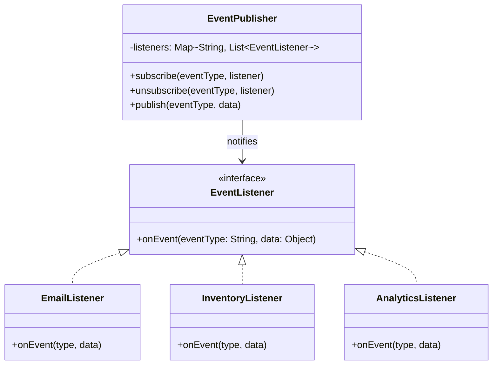
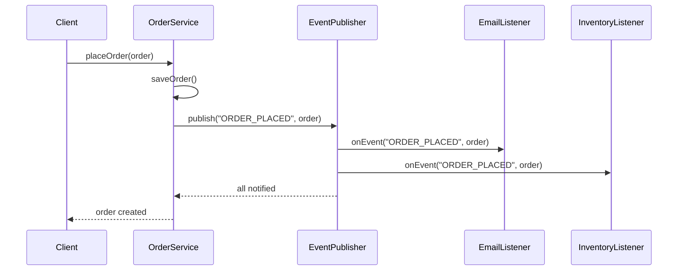

```table-of-contents
title: 
style: nestedList # TOC style (nestedList|nestedOrderedList|inlineFirstLevel)
minLevel: 0 # Include headings from the specified level
maxLevel: 0 # Include headings up to the specified level
include: 
exclude: 
includeLinks: true # Make headings clickable
hideWhenEmpty: false # Hide TOC if no headings are found
debugInConsole: false # Print debug info in Obsidian console
```
# Observer Pattern

**One-liner:** Define a one-to-many dependency so that when one object (subject) changes state, all registered dependents (observers) are notified automatically without the subject knowing who they are.

---

## Why This Exists — The Problem Without It

```java
// BEFORE: Subject directly calls every dependent — tight coupling
public class OrderService {
    private final EmailService emailService;
    private final SMSService smsService;
    private final InventoryService inventoryService;
    private final AnalyticsService analyticsService;  // added later — had to modify OrderService

    // Constructor receives ALL dependents — adding one more = change this class
    public OrderService(EmailService e, SMSService s, InventoryService i, AnalyticsService a) {
        this.emailService = e; this.smsService = s;
        this.inventoryService = i; this.analyticsService = a;
    }

    public void placeOrder(Order order) {
        // business logic
        order.setStatus(OrderStatus.CONFIRMED);

        // Directly calls every dependent — if any throws, others are skipped
        emailService.sendConfirmation(order);        // what if email is down?
        smsService.sendSMS(order.getPhone(), "..."); // what if we add push notification?
        inventoryService.reserve(order.getItems());  // must modify this file every time
        analyticsService.track("order_placed", order); // team B's feature = team A's file
    }
}
// Every new reaction to "order placed" = modify OrderService. Violates OCP.
```

---

## Real-World Analogy

YouTube subscriptions: a creator uploads a video (subject changes state). Every subscriber (observer) gets a notification — but YouTube has no list of names hardcoded. Subscribers click "Subscribe" (register), unsubscribe (deregister) anytime. YouTube sends the alert without knowing whether 10 or 10 million people are watching. New reaction types (email, push, in-app bell) are added by subscribing — YouTube's upload logic is never touched.

---

## The Fix — Clean Implementation

```java
// ─── Event types ──────────────────────────────────────────────────────────
public record OrderPlacedEvent(Order order, Instant timestamp) {}
public record OrderShippedEvent(Order order, String trackingId, Instant timestamp) {}

// ─── Observer Interface (typed) ───────────────────────────────────────────
@FunctionalInterface
public interface OrderEventListener<T> {
    void onEvent(T event);
}

// ─── Subject / EventBus ───────────────────────────────────────────────────
public class EventBus {
    // Event type → list of listeners (CopyOnWriteArrayList for thread safety)
    private final Map<Class<?>, List<OrderEventListener<Object>>> listeners =
        new ConcurrentHashMap<>();

    @SuppressWarnings("unchecked")
    public <T> void subscribe(Class<T> eventType, OrderEventListener<T> listener) {
        listeners.computeIfAbsent(eventType, k -> new CopyOnWriteArrayList<>())
                 .add((OrderEventListener<Object>) listener);
    }

    public <T> void unsubscribe(Class<T> eventType, OrderEventListener<T> listener) {
        List<OrderEventListener<Object>> list = listeners.get(eventType);
        if (list != null) list.remove(listener);
    }

    public <T> void publish(T event) {
        List<OrderEventListener<Object>> list = listeners.get(event.getClass());
        if (list == null) return;
        for (OrderEventListener<Object> listener : list) {
            try {
                listener.onEvent(event);          // each observer isolated — one failure won't block others
            } catch (Exception ex) {
                // log and continue; don't let one bad observer break the chain
                System.err.println("Observer error: " + ex.getMessage());
            }
        }
    }
}

// ─── Concrete Observers ───────────────────────────────────────────────────
public class EmailNotificationObserver implements OrderEventListener<OrderPlacedEvent> {
    private final EmailService emailService;

    public EmailNotificationObserver(EmailService emailService) {
        this.emailService = emailService;
    }

    @Override
    public void onEvent(OrderPlacedEvent event) {
        emailService.sendOrderConfirmation(event.order());
    }
}

public class InventoryObserver implements OrderEventListener<OrderPlacedEvent> {
    private final InventoryService inventoryService;

    public InventoryObserver(InventoryService inventoryService) {
        this.inventoryService = inventoryService;
    }

    @Override
    public void onEvent(OrderPlacedEvent event) {
        inventoryService.reserve(event.order().getItems());
    }
}

// ─── Subject — now knows NOTHING about specific observers ──────────────────
public class OrderService {
    private final EventBus eventBus;  // only dependency

    public OrderService(EventBus eventBus) {
        this.eventBus = eventBus;
    }

    public void placeOrder(Order order) {
        order.setStatus(OrderStatus.CONFIRMED);
        eventBus.publish(new OrderPlacedEvent(order, Instant.now()));
        // Adding analytics, SMS, push notification = zero changes here
    }
}

// ─── Push vs Pull Model Demo ──────────────────────────────────────────────
// PUSH: subject sends data in the notification (above EventBus does this)
// PULL: subject sends reference to itself; observer queries what it needs

public interface PullObserver {
    void update(Subject subject);   // subject reference passed, not data
}

public class StockTicker implements PullObserver {
    @Override
    public void update(Subject subject) {
        if (subject instanceof StockMarket market) {
            // Observer pulls only what it cares about
            double price = market.getPrice("AAPL");
            System.out.println("AAPL price: " + price);
        }
    }
}

// ─── Memory Leak Prevention — WeakReference ───────────────────────────────
public class WeakEventBus {
    private final Map<Class<?>, List<WeakReference<OrderEventListener<Object>>>> listeners =
        new ConcurrentHashMap<>();

    @SuppressWarnings("unchecked")
    public <T> void subscribe(Class<T> eventType, OrderEventListener<T> listener) {
        listeners.computeIfAbsent(eventType, k -> new CopyOnWriteArrayList<>())
                 .add(new WeakReference<>((OrderEventListener<Object>) listener));
    }

    public <T> void publish(T event) {
        List<WeakReference<OrderEventListener<Object>>> refs = listeners.get(event.getClass());
        if (refs == null) return;
        refs.removeIf(ref -> {
            OrderEventListener<Object> listener = ref.get();
            if (listener == null) return true;  // GC'd — remove dead reference
            try { listener.onEvent(event); } catch (Exception ignored) {}
            return false;
        });
    }
}

// ─── Spring ApplicationEvent (real usage) ─────────────────────────────────
// Subject publishes:
@Service
public class SpringOrderService {
    private final ApplicationEventPublisher publisher;

    public SpringOrderService(ApplicationEventPublisher publisher) {
        this.publisher = publisher;
    }

    public void placeOrder(Order order) {
        order.setStatus(OrderStatus.CONFIRMED);
        publisher.publishEvent(new OrderPlacedEvent(order, Instant.now()));
    }
}

// Observer — just annotate the method, Spring wires everything
@Component
public class SpringEmailObserver {
    @EventListener
    public void handleOrderPlaced(OrderPlacedEvent event) {
        // Spring calls this automatically — no manual subscribe() needed
        System.out.println("Sending email for order: " + event.order().getId());
    }

    @EventListener
    @Async                       // runs in separate thread pool — non-blocking publish
    public void handleOrderPlacedAsync(OrderPlacedEvent event) {
        System.out.println("Async analytics track for order: " + event.order().getId());
    }
}
```

---

## Class Diagram

```
           EventBus (Subject)
           ──────────────────
           -listeners: Map<Class, List<Observer>>
           +subscribe(type, listener)
           +unsubscribe(type, listener)
           +publish(event)
                    │  notifies
       ┌────────────┼────────────┐
       │            │            │
  EmailObserver  InventoryObserver  AnalyticsObserver
  ─────────────  ─────────────────  ─────────────────
  +onEvent()     +onEvent()         +onEvent()
```

---

## Real Systems Using This

| System | Observer usage |
|---|---|
| `java.util.Observer` / `Observable` | Original JDK implementation (deprecated Java 9 — use listeners instead) |
| Spring `ApplicationEvent` + `@EventListener` | Full Observer implementation; supports `@Async` for non-blocking observers |
| RxJava / Project Reactor | Observer at scale — `Observable.subscribe()`, backpressure, reactive streams |
| Android `LiveData` | `observe(lifecycleOwner, observer)` — auto-unsubscribes on lifecycle end |
| DOM `addEventListener` | Classic Observer in browser JS |
| Kafka (conceptually) | Producers publish; consumer groups observe — decoupled at infrastructure level |

---

## SDE-2/SDE-3 Interview Signals

| If interviewer says... | Think Observer |
|---|---|
| "One event should trigger multiple reactions" | Observer — publish once, N observers react |
| "Notify without hardcoding who listens" | Observer — dynamic subscription |
| "Adding new feature shouldn't change existing code" | Observer — new observer, zero changes to subject |
| "Loose coupling between producer and consumer" | Observer / EventBus |
| "How to implement event-driven in a monolith?" | Internal EventBus / Spring ApplicationEvent |
| "Fan-out: one message → multiple processors" | Observer pattern, or Kafka topics at infra level |

---

## When to Use

- One state change needs to trigger multiple reactions (order placed → email + SMS + analytics)
- Reactions are open-ended — new ones may be added without touching the subject
- You want producers and consumers decoupled for independent development and testing
- Building plugin/extension systems where consumers can register themselves

## When NOT to Use

- Only one fixed observer that will never change — direct call is simpler
- Observers need guaranteed ordering — Observer doesn't enforce order
- Cascading events (observer A's reaction triggers event B triggers observer C) — hard to trace, prefer explicit orchestration
- Observers need to return values to the subject — use a different pattern (e.g., Chain of Responsibility)

---

## Trade-offs & Alternatives

| Aspect | Observer | Alternative |
|---|---|---|
| Coupling | Subject unaware of observers | Direct method calls (tighter coupling) |
| Memory leaks | Risk if observers not unsubscribed | WeakReference or lifecycle-aware observers |
| Ordering | Not guaranteed | Chain of Responsibility (ordered) |
| Async | Needs explicit threading (or @Async) | Message queues (Kafka) handle async natively |
| Scale | In-process only | Kafka/RabbitMQ for distributed observer |

**Observer vs Mediator distinction:**
- Observer: one publisher broadcasts to many subscribers (one-to-many)
- Mediator: many components communicate through central coordinator (many-to-many); mediator contains routing logic

---

## Common Interview Mistakes

1. **Memory leaks** — observer registers but never unregisters; long-lived subject holds strong reference to short-lived observer. Fix: `WeakReference` or explicit `unsubscribe()` in lifecycle cleanup.
2. **Subject notifying while iterating** — observer's `onEvent()` calls `subscribe()` on the same bus → `ConcurrentModificationException`. Fix: `CopyOnWriteArrayList` or collect-then-notify.
3. **Not handling observer exceptions** — one bad observer breaks all others. Fix: try-catch per observer in the publish loop.
4. **Confusing Observer with Mediator** — Observer is broadcast; Mediator has logic to route between specific parties.
5. **Synchronous observers blocking the subject** — if observer does slow I/O, subject is blocked. Fix: async dispatch (`@Async` or executor in publish loop).

---

## Mermaid Class Diagram



---

## Mermaid Sequence Diagram



---

## Executable Example 1 — Order Events (Copy-Paste-Run)

```java
// File: ObserverOrderDemo.java
// Run:  javac ObserverOrderDemo.java && java ObserverOrderDemo

import java.util.*;
import java.util.concurrent.CopyOnWriteArrayList;

public class ObserverOrderDemo {

    interface EventListener {
        void onEvent(String eventType, Map<String, String> data);
    }

    static class EventPublisher {
        private final Map<String, List<EventListener>> subs = new HashMap<>();

        void subscribe(String event, EventListener listener) {
            subs.computeIfAbsent(event, k -> new CopyOnWriteArrayList<>()).add(listener);
        }

        void publish(String event, Map<String, String> data) {
            for (EventListener l : subs.getOrDefault(event, List.of())) {
                try { l.onEvent(event, data); }
                catch (Exception e) { System.out.println("  [ERROR] " + e.getMessage()); }
            }
        }
    }

    static class EmailListener implements EventListener {
        public void onEvent(String type, Map<String, String> data) {
            System.out.println("  [EMAIL] Confirmation to " + data.get("email"));
        }
    }

    static class InventoryListener implements EventListener {
        public void onEvent(String type, Map<String, String> data) {
            System.out.println("  [INVENTORY] Reserving for order " + data.get("orderId"));
        }
    }

    static class LoyaltyListener implements EventListener {
        public void onEvent(String type, Map<String, String> data) {
            System.out.println("  [LOYALTY] +100 points for " + data.get("email"));
        }
    }

    public static void main(String[] args) {
        EventPublisher pub = new EventPublisher();
        pub.subscribe("ORDER_PLACED", new EmailListener());
        pub.subscribe("ORDER_PLACED", new InventoryListener());

        System.out.println("=== Order 1 (2 listeners) ===");
        pub.publish("ORDER_PLACED", Map.of("orderId", "ORD-001", "email", "alice@gmail.com"));
        // Output:
        //   [EMAIL] Confirmation to alice@gmail.com
        //   [INVENTORY] Reserving for order ORD-001

        pub.subscribe("ORDER_PLACED", new LoyaltyListener()); // add dynamically

        System.out.println("\n=== Order 2 (3 listeners — loyalty added) ===");
        pub.publish("ORDER_PLACED", Map.of("orderId", "ORD-002", "email", "bob@gmail.com"));
        // Output:
        //   [EMAIL] Confirmation to bob@gmail.com
        //   [INVENTORY] Reserving for order ORD-002
        //   [LOYALTY] +100 points for bob@gmail.com
    }
}
```

---

## Executable Example 2 — Stock Price Alert (Copy-Paste-Run)

```java
// File: ObserverStockDemo.java
// Run:  javac ObserverStockDemo.java && java ObserverStockDemo

import java.util.*;

public class ObserverStockDemo {

    interface PriceObserver {
        void onPriceUpdate(String symbol, double price);
    }

    static class PriceFeed {
        private final List<PriceObserver> observers = new ArrayList<>();
        void addObserver(PriceObserver o) { observers.add(o); }

        void updatePrice(String symbol, double price) {
            System.out.printf("[FEED] %s = Rs.%.2f%n", symbol, price);
            observers.forEach(o -> o.onPriceUpdate(symbol, price));
        }
    }

    static class PriceAlert implements PriceObserver {
        private final String symbol;
        private final double threshold;
        private boolean triggered = false;

        PriceAlert(String symbol, double threshold) {
            this.symbol = symbol; this.threshold = threshold;
        }

        public void onPriceUpdate(String sym, double price) {
            if (sym.equals(symbol) && !triggered && price >= threshold) {
                triggered = true;
                System.out.printf("  >>> ALERT: %s crossed Rs.%.0f! Current: Rs.%.2f%n",
                    symbol, threshold, price);
            }
        }
    }

    static class PortfolioTracker implements PriceObserver {
        private final Map<String, Integer> holdings;
        PortfolioTracker(Map<String, Integer> h) { this.holdings = h; }

        public void onPriceUpdate(String sym, double price) {
            if (holdings.containsKey(sym)) {
                System.out.printf("  [PORTFOLIO] %s: %d x Rs.%.2f = Rs.%.2f%n",
                    sym, holdings.get(sym), price, holdings.get(sym) * price);
            }
        }
    }

    public static void main(String[] args) {
        PriceFeed feed = new PriceFeed();
        feed.addObserver(new PriceAlert("RELIANCE", 2500));
        feed.addObserver(new PortfolioTracker(Map.of("RELIANCE", 10, "TCS", 5)));

        feed.updatePrice("RELIANCE", 2450.00);
        // [FEED] RELIANCE = Rs.2450.00
        //   [PORTFOLIO] RELIANCE: 10 x Rs.2450.00 = Rs.24500.00
        System.out.println();

        feed.updatePrice("RELIANCE", 2520.00);
        // [FEED] RELIANCE = Rs.2520.00
        //   >>> ALERT: RELIANCE crossed Rs.2500! Current: Rs.2520.00
        //   [PORTFOLIO] RELIANCE: 10 x Rs.2520.00 = Rs.25200.00
        System.out.println();

        feed.updatePrice("TCS", 3200.00);
        // [FEED] TCS = Rs.3200.00
        //   [PORTFOLIO] TCS: 5 x Rs.3200.00 = Rs.16000.00
    }
}
```

---

## Anti-Pattern — What Happens Without Observer

```java
// OrderService directly calls ALL dependents — adding one = modify this class
public class OrderService {
    private EmailService email;
    private InventoryService inventory;
    private AnalyticsService analytics;
    private LoyaltyService loyalty;          // added sprint 5
    private FraudService fraud;              // added sprint 8
    private PartnerService partner;          // added sprint 15

    public void placeOrder(Order order) {
        saveOrder(order);
        email.send(order);        // if this throws...
        inventory.reserve(order); // ...this never executes
        analytics.track(order);
        loyalty.addPoints(order);
        fraud.check(order);
        partner.notify(order);    // 6 direct dependencies
    }
}
// Pain: tight coupling, cascading failures, untestable, merge conflicts
```

---

## Refactoring Path — Step by Step

```
Step 1: Identify the event → "ORDER_PLACED"
Step 2: Identify who reacts → email, inventory, analytics, loyalty, fraud
Step 3: Create EventListener interface → void onEvent(type, data)
Step 4: Create EventPublisher → Map<String, List<EventListener>>
Step 5: Make each service implement EventListener
Step 6: Replace direct calls with publisher.publish("ORDER_PLACED", order)
Step 7: Register listeners at app startup (or via Spring DI)
```

---

## Interview Script — What to Say

> "When [order is placed / price changes], multiple independent services need to react. This is Observer — I'll create an `EventPublisher` with subscribe/publish. The `OrderService` only calls `publish()` — it doesn't know who listens. Each listener registers at startup. Adding a new listener is one class + one registration line, zero changes to the publisher."

---

## Complexity Analysis

| Scenario | Without Observer | With Observer |
|----------|-----------------|---------------|
| Add new listener | Modify publisher class | 1 new class + 1 registration line |
| Test publisher | Mock ALL subscribers | Publisher has no subscriber knowledge |
| Listener failure | Cascading failure | Isolated — others continue |
| Runtime flexibility | Impossible | subscribe/unsubscribe anytime |

---

## Combines Well With

- **Event Sourcing** — every state change is an event; observers replay history
- **Mediator** — mediator internally uses observer mechanics to route messages
- **Command** — commands published as events; observers execute them asynchronously
- **Factory** — factory creates and auto-registers observers during startup

---

## Cheat Sheet

```
Observer = subject publishes; observers subscribe/unsubscribe at runtime
Subject knows the interface, not the concrete class — loose coupling
Push model: data in event; Pull model: subject reference in callback
Memory leak: always unsubscribe or use WeakReference for long-lived subjects
Spring shortcut: ApplicationEventPublisher + @EventListener = zero wiring
Observer = one-to-many broadcast; Mediator = many-to-many coordination
```

---
---

# ChatGPT

# Observer Pattern (Explained in the Simplest Way)

## Core Idea
**One object changes → many objects automatically get notified.**

This is called **one-to-many dependency**.

```
Subject (Publisher)
       |
       | notify()
       v
+--------------------+
| Observer 1         |
| Observer 2         |
| Observer 3         |
+--------------------+
```

---

## Real-Life Example

### YouTube Channel

You subscribe to a YouTube channel.

```
Channel uploads video
       |
       v
Subscribers get notification
```

Structure:

```
YouTube Channel (Subject)
        |
        +---- User A (Observer)
        +---- User B (Observer)
        +---- User C (Observer)
```

When the channel uploads a video:

```
All subscribers are notified automatically
```

---

## Components of Observer Pattern

| Component | Role |
|----------|------|
| Subject | The object being observed |
| Observer | Objects that want updates |
| ConcreteSubject | Real implementation of subject |
| ConcreteObserver | Real implementation of observers |

---

## Example Problem

Imagine a **Weather Station**.

When temperature changes:

```
Weather Station updates
```

Different systems need to react:

```
Mobile App
Display Board
Weather Website
```

Instead of calling them manually:

```
updateMobileApp()
updateDisplay()
updateWebsite()
```

Observer pattern lets them **subscribe**.

---

## Step 1 — Observer Interface

```java
interface Observer {
    void update(int temperature);
}
```

This method runs **when data changes**.

---

## Step 2 — Subject Interface

```java
interface Subject {

    void addObserver(Observer o);

    void removeObserver(Observer o);

    void notifyObservers();
}
```

The subject manages **who is subscribed**.

---

## Step 3 — Concrete Subject

```java
import java.util.*;

class WeatherStation implements Subject {

    private List<Observer> observers = new ArrayList<>();
    private int temperature;

    public void addObserver(Observer o){
        observers.add(o);
    }

    public void removeObserver(Observer o){
        observers.remove(o);
    }

    public void notifyObservers(){
        for(Observer o : observers){
            o.update(temperature);
        }
    }

    public void setTemperature(int temp){
        this.temperature = temp;
        notifyObservers();
    }
}
```

Important line:

```
notifyObservers()
```

This informs everyone when data changes.

---

## Step 4 — Concrete Observer

```java
class MobileDisplay implements Observer {

    public void update(int temperature){
        System.out.println("Mobile display updated: " + temperature);
    }
}
```

Another observer:

```java
class WebDisplay implements Observer {

    public void update(int temperature){
        System.out.println("Website updated: " + temperature);
    }
}
```

Each observer **reacts differently**.

---

## Step 5 — Client Code

```java
public class Main {

    public static void main(String[] args){

        WeatherStation station = new WeatherStation();

        Observer mobile = new MobileDisplay();
        Observer web = new WebDisplay();

        station.addObserver(mobile);
        station.addObserver(web);

        station.setTemperature(30);
    }
}
```

---

## Output

```
Mobile display updated: 30
Website updated: 30
```

---

## Execution Flow

### Step 1
Observers subscribe

```
station.addObserver(mobile)
station.addObserver(web)
```

### Step 2
Temperature changes

```
station.setTemperature(30)
```

### Step 3

```
notifyObservers()
```

### Step 4

```
update() is called on each observer
```

---

## Visual Flow

```
WeatherStation
      |
      | notify()
      v
+----------------+
| MobileDisplay  |
| WebDisplay     |
+----------------+
```

---

## Why This Pattern Is Useful

Without observer pattern:

```
WeatherStation → Mobile
WeatherStation → Web
WeatherStation → Display
```

The subject must know **all dependencies**.

With observer pattern:

```
WeatherStation → notifyObservers()
```

Observers manage themselves.

---

## Real Systems Using Observer Pattern

- GUI event listeners
- Notification systems
- Stock market trackers
- Spring Application Events
- Kafka consumers
- Reactive programming

Example in Java:

```java
button.addActionListener(listener);
```

Button notifies listeners when clicked.

---

## Advantages

- Loose coupling
- Easy to add new observers
- Supports event-driven architecture

---

## Disadvantages

- Too many observers can slow down notifications
- Hard to debug in large systems

---

## One-Line Interview Answer

The **Observer Pattern** allows an object (subject) to notify multiple dependent objects (observers) automatically when its state changes.
