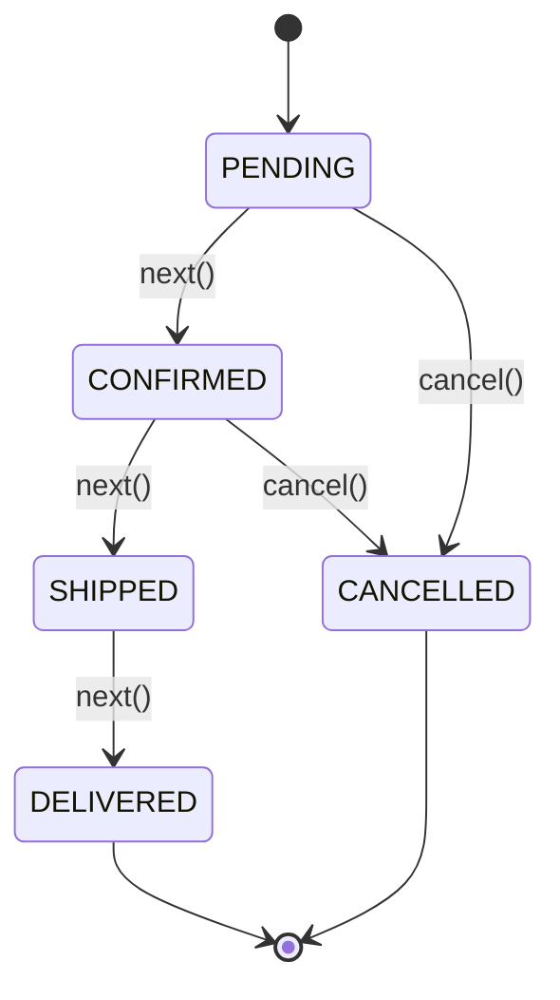
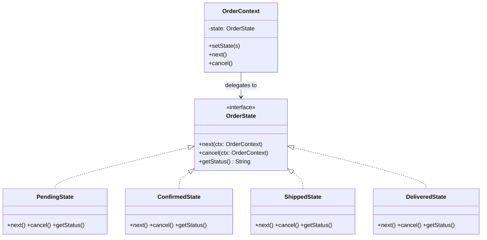
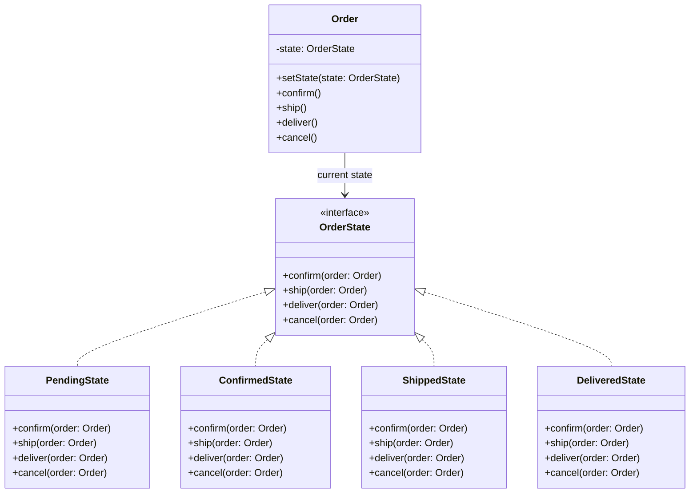

```table-of-contents
title: 
style: nestedList # TOC style (nestedList|nestedOrderedList|inlineFirstLevel)
minLevel: 0 # Include headings from the specified level
maxLevel: 0 # Include headings up to the specified level
include: 
exclude: 
includeLinks: true # Make headings clickable
hideWhenEmpty: false # Hide TOC if no headings are found
debugInConsole: false # Print debug info in Obsidian console
```
# State Pattern

**One-liner:** Allow an object to alter its behavior when its internal state changes by delegating state-specific behavior to separate state objects, eliminating giant switch/case blocks on a status field.

---

## Why This Exists — The Problem Without It

```java
// BEFORE: Status field + switch/case scattered throughout the class
public class Order {
    private String status;  // "PENDING", "CONFIRMED", "SHIPPED", "DELIVERED", "CANCELLED"

    public void confirm() {
        switch (status) {
            case "PENDING":   status = "CONFIRMED"; break;
            case "CONFIRMED": throw new IllegalStateException("Already confirmed");
            case "SHIPPED":   throw new IllegalStateException("Cannot confirm shipped order");
            case "DELIVERED": throw new IllegalStateException("Cannot confirm delivered order");
            case "CANCELLED": throw new IllegalStateException("Cannot confirm cancelled order");
        }
    }

    public void ship() {
        switch (status) {  // Another switch — repeated everywhere
            case "CONFIRMED": status = "SHIPPED"; sendTrackingEmail(); break;
            case "PENDING":   throw new IllegalStateException("Must confirm before shipping");
            // ... same pattern copy-pasted for every method
        }
    }

    public void cancel() {
        switch (status) {  // Yet another switch — when you add a new state, update ALL switches
            case "PENDING":   case "CONFIRMED": status = "CANCELLED"; refundPayment(); break;
            case "SHIPPED":   throw new IllegalStateException("Cannot cancel shipped order");
            case "DELIVERED": throw new IllegalStateException("Cannot cancel delivered order");
        }
    }
    // Adding new state (e.g., "RETURN_REQUESTED") = modify every switch in every method
}
```

---

## Real-World Analogy

Traffic light: the same physical light behaves completely differently depending on its current state. Red state: cars stop, pedestrians can walk. Green state: cars go, pedestrians wait. Yellow state: cars slow down. The light itself never checks "if I am red, then...". Each state object handles all behavior for that state and manages transitions to the next state. The light's control box (context) simply delegates to the current state object.

---

## The Fix — Clean Implementation

```
State Transition Diagram:
─────────────────────────
                confirm()
  [PENDING] ──────────────→ [CONFIRMED]
      │                          │
      │ cancel()           ship()│  cancel()
      ↓                          ↓
 [CANCELLED]             [SHIPPED] ──→ [CANCELLED]
                              │
                         deliver()│
                              ↓
                         [DELIVERED]
                         (terminal — no transitions out)
```

```java
// ─── State Interface ──────────────────────────────────────────────────────
public interface OrderState {
    void confirm(OrderContext order);
    void ship(OrderContext order);
    void deliver(OrderContext order);
    void cancel(OrderContext order);
    String getStatusName();
}

// ─── Context — holds current state, delegates all behavior ───────────────
public class OrderContext {
    private OrderState currentState;
    private final String orderId;

    public OrderContext(String orderId) {
        this.orderId = orderId;
        this.currentState = new PendingState();  // initial state
    }

    // Each public method just delegates — context has NO switch/case
    public void confirm()  { currentState.confirm(this); }
    public void ship()     { currentState.ship(this); }
    public void deliver()  { currentState.deliver(this); }
    public void cancel()   { currentState.cancel(this); }

    // States call this to transition themselves
    public void setState(OrderState newState) {
        System.out.println("Order " + orderId + ": " + currentState.getStatusName()
            + " → " + newState.getStatusName());
        this.currentState = newState;
    }

    public String getStatus() { return currentState.getStatusName(); }
    public String getOrderId() { return orderId; }
}

// ─── Concrete States ──────────────────────────────────────────────────────
public class PendingState implements OrderState {
    @Override
    public void confirm(OrderContext order) {
        // Valid transition — state controls what's allowed, not the context
        order.setState(new ConfirmedState());
        System.out.println("Order confirmed, payment captured.");
    }

    @Override
    public void ship(OrderContext order) {
        throw new IllegalStateException("Cannot ship a PENDING order. Confirm first.");
    }

    @Override
    public void deliver(OrderContext order) {
        throw new IllegalStateException("Cannot deliver a PENDING order.");
    }

    @Override
    public void cancel(OrderContext order) {
        order.setState(new CancelledState());
        System.out.println("Order cancelled, payment refunded.");
    }

    @Override
    public String getStatusName() { return "PENDING"; }
}

public class ConfirmedState implements OrderState {
    @Override
    public void confirm(OrderContext order) {
        throw new IllegalStateException("Order is already CONFIRMED.");
    }

    @Override
    public void ship(OrderContext order) {
        order.setState(new ShippedState());
        System.out.println("Order shipped, tracking email sent.");
    }

    @Override
    public void deliver(OrderContext order) {
        throw new IllegalStateException("Cannot deliver without shipping first.");
    }

    @Override
    public void cancel(OrderContext order) {
        order.setState(new CancelledState());
        System.out.println("Order cancelled before shipment, full refund issued.");
    }

    @Override
    public String getStatusName() { return "CONFIRMED"; }
}

public class ShippedState implements OrderState {
    @Override
    public void confirm(OrderContext order) {
        throw new IllegalStateException("Order is already SHIPPED.");
    }

    @Override
    public void ship(OrderContext order) {
        throw new IllegalStateException("Order is already SHIPPED.");
    }

    @Override
    public void deliver(OrderContext order) {
        order.setState(new DeliveredState());
        System.out.println("Order delivered. Warranty period starts.");
    }

    @Override
    public void cancel(OrderContext order) {
        // Business rule: cannot cancel after shipping — state enforces this
        throw new IllegalStateException("Cannot cancel a SHIPPED order. Initiate return instead.");
    }

    @Override
    public String getStatusName() { return "SHIPPED"; }
}

public class DeliveredState implements OrderState {
    // Terminal state — all transitions are invalid
    @Override public void confirm(OrderContext o)  { throw new IllegalStateException("Order DELIVERED. No further transitions allowed."); }
    @Override public void ship(OrderContext o)     { throw new IllegalStateException("Order DELIVERED. No further transitions allowed."); }
    @Override public void deliver(OrderContext o)  { throw new IllegalStateException("Order is already DELIVERED."); }
    @Override public void cancel(OrderContext o)   { throw new IllegalStateException("Cannot cancel DELIVERED order. Use return flow."); }
    @Override public String getStatusName()        { return "DELIVERED"; }
}

public class CancelledState implements OrderState {
    @Override public void confirm(OrderContext o)  { throw new IllegalStateException("Cannot reactivate a CANCELLED order."); }
    @Override public void ship(OrderContext o)     { throw new IllegalStateException("Cannot ship a CANCELLED order."); }
    @Override public void deliver(OrderContext o)  { throw new IllegalStateException("Cannot deliver a CANCELLED order."); }
    @Override public void cancel(OrderContext o)   { throw new IllegalStateException("Order is already CANCELLED."); }
    @Override public String getStatusName()        { return "CANCELLED"; }
}

// ─── Usage ────────────────────────────────────────────────────────────────
public class OrderDemo {
    public static void main(String[] args) {
        OrderContext order = new OrderContext("ORD-001");

        order.confirm();   // PENDING → CONFIRMED
        order.ship();      // CONFIRMED → SHIPPED
        order.deliver();   // SHIPPED → DELIVERED

        try {
            order.cancel();  // IllegalStateException — state enforces terminal rule
        } catch (IllegalStateException e) {
            System.out.println("Caught: " + e.getMessage());
        }

        // New order taking cancellation path
        OrderContext order2 = new OrderContext("ORD-002");
        order2.confirm();  // PENDING → CONFIRMED
        order2.cancel();   // CONFIRMED → CANCELLED (with refund)
    }
}
```

---

## Class Diagram

```
    OrderContext (Context)
    ───────────────────────
    -currentState: OrderState
    +confirm()  → delegates to currentState.confirm(this)
    +ship()     → delegates to currentState.ship(this)
    +setState() ← called by states to transition
          │
          │  delegates to
          ▼
    «interface»
    OrderState
    ──────────────
    +confirm(ctx)
    +ship(ctx)
    +deliver(ctx)
    +cancel(ctx)
          △
    ┌─────┼──────┬───────────┐
    │     │      │           │
PendingState  ConfirmedState  ShippedState  DeliveredState  CancelledState
```

---

## Real Systems Using This

| System | State usage |
|---|---|
| TCP connection | CLOSED, LISTEN, SYN_SENT, ESTABLISHED, FIN_WAIT — each state handles packets differently |
| Spring StateMachine | Enterprise state machine framework; states, transitions, actions, guards |
| Workflow engines (Camunda, Activiti) | Process instances move through states; each state has allowed transitions |
| ATM machine | Idle, CardInserted, PINEntered, TransactionInProgress — each state handles input |
| Vending machine | NoSelection, HasMoney, Dispensing — coin inserted behaves differently per state |
| Order management systems (Amazon, Flipkart) | Exact order lifecycle as shown above |

---

## SDE-2/SDE-3 Interview Signals

| If interviewer says... | Think State |
|---|---|
| "Object behaves differently based on its status" | State — each status becomes a state class |
| "State transition rules must be enforced" | State — each state class controls valid next states |
| "Replace switch/case on a status enum" | State — eliminate scattered conditionals |
| "Design a vending machine / ATM / traffic light" | Classic State pattern problems |
| "Workflow with approval stages" | State — each approval stage is a state |
| "Invalid operation in current status should throw" | State — state class throws on invalid transitions |

---

## When to Use

- Object's behavior changes significantly based on internal state
- State transitions have explicit rules (only certain transitions are valid)
- You have switch/case or if/else on a status field duplicated across many methods
- Adding a new state should require minimal changes (OCP)
- State transition logic must be enforced (prevent invalid transitions)

## When NOT to Use

- Only 2 or 3 states with simple, stable transitions — if/else is clearer
- States don't truly change behavior — just data differences, use a field
- State graph is very simple and unlikely to grow

---

## Trade-offs & Alternatives

| Aspect | State | Alternative |
|---|---|---|
| Transition logic location | In each State class | In Context (centralizes but couples) |
| Adding new state | New class + update affected states | if/else: modify switch in every method |
| Testability | Excellent — each state is isolated | Switch/case: must set up full object |
| State sharing | Stateless states can be singletons | Stateful states must be new instances |

**State vs Strategy — critical distinction:**
- State: state object changes itself to another state based on internal conditions; context is unaware of which state it's in
- Strategy: algorithm is changed by EXTERNAL code; context always knows (chooses) the strategy

---

## Common Interview Mistakes

1. **Putting transition logic in the Context** — the Context should only hold current state and delegate; each State should know its valid transitions and call `context.setState(nextState)`.
2. **Making states static singletons when they carry data** — `DeliveredState` might need delivery timestamp; stateful states cannot be shared.
3. **Not throwing on invalid transitions** — if cancel() on DELIVERED silently does nothing, bugs are hidden. Always throw `IllegalStateException`.
4. **Confusing State with Strategy** — State transitions itself; Strategy is swapped by external code.
5. **Not drawing the transition diagram first** — always sketch states and valid transitions before coding; it reveals missing states and edge cases.

---

## Mermaid State Diagram



---

## Mermaid Class Diagram



---

## Executable Example 1 — Order Lifecycle (Copy-Paste-Run)

```java
// File: StateOrderDemo.java
// Run:  javac StateOrderDemo.java && java StateOrderDemo

public class StateOrderDemo {

    interface OrderState {
        void next(Ctx c);
        void cancel(Ctx c);
        String status();
    }

    static class Ctx {
        private OrderState state;
        Ctx() { this.state = new PendingState(); }
        void setState(OrderState s) { this.state = s; }
        void next()   { state.next(this); }
        void cancel() { state.cancel(this); }
        String status() { return state.status(); }
    }

    static class PendingState implements OrderState {
        public void next(Ctx c) { System.out.println("  Confirmed!"); c.setState(new ConfirmedState()); }
        public void cancel(Ctx c) { System.out.println("  Cancelled. Full refund."); c.setState(new CancelledState()); }
        public String status() { return "PENDING"; }
    }

    static class ConfirmedState implements OrderState {
        public void next(Ctx c) { System.out.println("  Shipped!"); c.setState(new ShippedState()); }
        public void cancel(Ctx c) { System.out.println("  Cancelled before shipping."); c.setState(new CancelledState()); }
        public String status() { return "CONFIRMED"; }
    }

    static class ShippedState implements OrderState {
        public void next(Ctx c) { System.out.println("  Delivered!"); c.setState(new DeliveredState()); }
        public void cancel(Ctx c) { System.out.println("  ERROR: Cannot cancel shipped order!"); }
        public String status() { return "SHIPPED"; }
    }

    static class DeliveredState implements OrderState {
        public void next(Ctx c) { System.out.println("  ERROR: Already delivered."); }
        public void cancel(Ctx c) { System.out.println("  ERROR: Cannot cancel."); }
        public String status() { return "DELIVERED"; }
    }

    static class CancelledState implements OrderState {
        public void next(Ctx c) { System.out.println("  ERROR: Order cancelled."); }
        public void cancel(Ctx c) { System.out.println("  ERROR: Already cancelled."); }
        public String status() { return "CANCELLED"; }
    }

    public static void main(String[] args) {
        System.out.println("=== Happy Path ===");
        Ctx o1 = new Ctx();
        System.out.println("Status: " + o1.status());  // PENDING
        o1.next(); System.out.println("Status: " + o1.status());  // CONFIRMED
        o1.next(); System.out.println("Status: " + o1.status());  // SHIPPED
        o1.next(); System.out.println("Status: " + o1.status());  // DELIVERED
        o1.next();  // ERROR

        System.out.println("\n=== Cancel Path ===");
        Ctx o2 = new Ctx();
        o2.next();   // CONFIRMED
        o2.cancel(); // CANCELLED
        System.out.println("Status: " + o2.status());

        System.out.println("\n=== Invalid Cancel ===");
        Ctx o3 = new Ctx();
        o3.next(); o3.next(); // SHIPPED
        o3.cancel();          // ERROR
    }
}
```

**Expected output:**
```
=== Happy Path ===
Status: PENDING
  Confirmed!
Status: CONFIRMED
  Shipped!
Status: SHIPPED
  Delivered!
Status: DELIVERED
  ERROR: Already delivered.

=== Cancel Path ===
  Confirmed!
  Cancelled before shipping.
Status: CANCELLED

=== Invalid Cancel ===
  Confirmed!
  Shipped!
  ERROR: Cannot cancel shipped order!
```

---

## Executable Example 2 — Traffic Light (Copy-Paste-Run)

```java
// File: StateTrafficDemo.java
// Run:  javac StateTrafficDemo.java && java StateTrafficDemo

public class StateTrafficDemo {

    interface TrafficState {
        void next(Light l);
        String color();
        int durationSec();
    }

    static class Light {
        private TrafficState state;
        Light() { state = new RedState(); }
        void setState(TrafficState s) { state = s; }
        void next() { state.next(this); }
        String color() { return state.color(); }
        int duration() { return state.durationSec(); }
    }

    static class RedState implements TrafficState {
        public void next(Light l) { l.setState(new GreenState()); }
        public String color() { return "RED"; }
        public int durationSec() { return 60; }
    }

    static class GreenState implements TrafficState {
        public void next(Light l) { l.setState(new YellowState()); }
        public String color() { return "GREEN"; }
        public int durationSec() { return 45; }
    }

    static class YellowState implements TrafficState {
        public void next(Light l) { l.setState(new RedState()); }
        public String color() { return "YELLOW"; }
        public int durationSec() { return 5; }
    }

    public static void main(String[] args) {
        Light light = new Light();
        for (int i = 0; i < 7; i++) {
            System.out.printf("[%s] duration=%ds%n", light.color(), light.duration());
            light.next();
        }
    }
}
```

**Expected output:**
```
[RED] duration=60s
[GREEN] duration=45s
[YELLOW] duration=5s
[RED] duration=60s
[GREEN] duration=45s
[YELLOW] duration=5s
[RED] duration=60s
```

---

## Anti-Pattern — What Happens Without State

```java
// Giant switch in EVERY method
public void cancel() {
    switch (status) {
        case "PENDING": refundFull(); status = "CANCELLED"; break;
        case "CONFIRMED": refundFull(); status = "CANCELLED"; break;
        case "SHIPPED": throw new IllegalStateException("Cannot cancel");
        case "DELIVERED": throw new IllegalStateException("Cannot cancel");
        case "RETURNED": status = "REFUNDED"; break; // added later
    }
}
// 5 states × 4 actions = 20 switch cases. Add 1 state = modify ALL methods.
```

---

## Refactoring Path — Step by Step

```
Step 1: List all states (PENDING, CONFIRMED, SHIPPED, DELIVERED, CANCELLED)
Step 2: List all actions per state (next, cancel)
Step 3: Create State interface with all actions
Step 4: One class per state implementing the interface
Step 5: Each state handles its own transitions via context.setState()
Step 6: Context holds current state, delegates all calls
Step 7: Remove all switch/case
```

---

## Interview Script — What to Say

> "This entity has [3+ states] with different behavior per state. I'll use the State pattern — each state is a class implementing `OrderState`. The context delegates all calls to its current state. Each state controls its valid transitions and throws on invalid ones. This eliminates all switch/case blocks."

---

## Complexity Analysis

| Scenario | Switch/Case | State Pattern |
|----------|-------------|--------------|
| Add new state | Modify ALL methods | Add 1 new class |
| Find all behavior for one state | Scattered across methods | All in one state class |
| Test one state | Set up entire object | Instantiate just that state |
| Validate transitions | Easy to miss a case | Each state explicitly controls |

---

## Combines Well With

- **Singleton** — stateless state objects (no instance variables) can be singletons, saved as constants
- **Flyweight** — share stateless state instances across many context objects
- **Command** — commands trigger state transitions; transitions can be logged as commands
- **Observer** — context publishes state-change events; observers react to transitions

---

## Cheat Sheet

```
State = each status becomes a class; context delegates all behavior to current state
Context.setState() is called by the state object itself — not by external code
Each state controls its valid transitions; throws on invalid ones
Transition diagram first, then code — reveals edge cases immediately
State vs Strategy: State self-transitions; Strategy is swapped externally
Adding new state: new class + update only the states that transition TO it
```

---
---

# ChatGPT
## State Pattern

---

## 1. Real World Analogy

Think about a **traffic light**:

- **Red state** → only one behaviour: wait, then switch to Green
- **Green state** → only one behaviour: allow traffic, then switch to Yellow
- **Yellow state** → only one behaviour: slow down, then switch to Red

The traffic light doesn't have a giant `if-else` checking what colour it is. It **is in a state** — and that state controls what happens next.

Now think about a **vending machine**:

- **No coin inserted** → press button = "please insert coin"
- **Coin inserted** → press button = dispense item
- **Out of stock** → press button = "out of stock, returning coin"

Same button press. **Completely different behaviour** depending on current state.

That is the State pattern. **An object changes its behaviour when its internal state changes — as if it became a different object.**

---

## 2. The Problem It Solves

You're building an order management system. Without State:

```java
class Order {
    private String status; // "PENDING", "CONFIRMED", "SHIPPED", "DELIVERED"

    public void confirm() {
        if (status.equals("PENDING")) {
            status = "CONFIRMED";
        } else if (status.equals("CONFIRMED")) {
            throw new RuntimeException("Already confirmed");
        } else if (status.equals("SHIPPED")) {
            throw new RuntimeException("Already shipped");
        }
        // grows forever with every new status
    }

    public void ship() {
        if (status.equals("CONFIRMED")) {
            status = "SHIPPED";
        } else if (status.equals("PENDING")) {
            throw new RuntimeException("Cannot ship unconfirmed order");
        }
        // more and more if-else
    }
}
```

Every new state = modify every method. 5 states × 5 actions = 25 `if-else` blocks. Impossible to maintain.

---

## 3. UML — Mermaid Format



`Order` holds a reference to current `OrderState`. When you call `order.confirm()` — it delegates to `currentState.confirm()`. The state object handles the logic AND transitions to the next state.

---

## 4. Full Java Code — Step by Step

**Step 1 — The State interface:**

```java
interface OrderState {
    void confirm(Order order);
    void ship(Order order);
    void deliver(Order order);
    void cancel(Order order);
}
```

---

**Step 2 — The Context (Order):**

```java
class Order {
    private OrderState currentState;
    private String orderId;

    public Order(String orderId) {
        this.orderId      = orderId;
        this.currentState = new PendingState();   // starts in Pending
        System.out.println("Order " + orderId + " created — PENDING");
    }

    // delegates every action to current state
    public void confirm()  { currentState.confirm(this); }
    public void ship()     { currentState.ship(this); }
    public void deliver()  { currentState.deliver(this); }
    public void cancel()   { currentState.cancel(this); }

    // state objects call this to transition
    public void setState(OrderState state) {
        this.currentState = state;
    }

    public String getOrderId() { return orderId; }
}
```

---

**Step 3 — Concrete States:**

```java
class PendingState implements OrderState {

    public void confirm(Order order) {
        System.out.println("Order " + order.getOrderId()
            + " confirmed — CONFIRMED");
        order.setState(new ConfirmedState());   // transition
    }

    public void ship(Order order) {
        System.out.println("Cannot ship — order not confirmed yet");
    }

    public void deliver(Order order) {
        System.out.println("Cannot deliver — order not shipped yet");
    }

    public void cancel(Order order) {
        System.out.println("Order " + order.getOrderId()
            + " cancelled from PENDING");
        order.setState(new CancelledState());
    }
}

class ConfirmedState implements OrderState {

    public void confirm(Order order) {
        System.out.println("Order already confirmed");
    }

    public void ship(Order order) {
        System.out.println("Order " + order.getOrderId()
            + " shipped — SHIPPED");
        order.setState(new ShippedState());   // transition
    }

    public void deliver(Order order) {
        System.out.println("Cannot deliver — order not shipped yet");
    }

    public void cancel(Order order) {
        System.out.println("Order " + order.getOrderId()
            + " cancelled from CONFIRMED");
        order.setState(new CancelledState());
    }
}

class ShippedState implements OrderState {

    public void confirm(Order order) {
        System.out.println("Order already confirmed and shipped");
    }

    public void ship(Order order) {
        System.out.println("Order already shipped");
    }

    public void deliver(Order order) {
        System.out.println("Order " + order.getOrderId()
            + " delivered — DELIVERED");
        order.setState(new DeliveredState());   // transition
    }

    public void cancel(Order order) {
        System.out.println("Cannot cancel — order already shipped");
    }
}

class DeliveredState implements OrderState {

    public void confirm(Order order) {
        System.out.println("Order already delivered");
    }

    public void ship(Order order) {
        System.out.println("Order already delivered");
    }

    public void deliver(Order order) {
        System.out.println("Order already delivered");
    }

    public void cancel(Order order) {
        System.out.println("Cannot cancel — order already delivered");
    }
}

class CancelledState implements OrderState {

    public void confirm(Order order) {
        System.out.println("Cannot confirm — order is cancelled");
    }

    public void ship(Order order) {
        System.out.println("Cannot ship — order is cancelled");
    }

    public void deliver(Order order) {
        System.out.println("Cannot deliver — order is cancelled");
    }

    public void cancel(Order order) {
        System.out.println("Order already cancelled");
    }
}
```

---

**Step 4 — Client:**

```java
public class Main {
    public static void main(String[] args) {

        Order order = new Order("ORD001");

        // happy path
        order.confirm();
        order.ship();
        order.deliver();

        System.out.println();

        // invalid transitions
        Order order2 = new Order("ORD002");
        order2.ship();      // cannot ship — not confirmed
        order2.confirm();
        order2.cancel();    // cancel from confirmed
        order2.ship();      // cannot ship — cancelled
    }
}
```

**Output:**

```
Order ORD001 created — PENDING
Order ORD001 confirmed — CONFIRMED
Order ORD001 shipped — SHIPPED
Order ORD001 delivered — DELIVERED

Order ORD002 created — PENDING
Cannot ship — order not confirmed yet
Order ORD002 confirmed — CONFIRMED
Order ORD002 cancelled from CONFIRMED
Cannot ship — order is cancelled
```

No `if-else` anywhere. Every state knows exactly what it allows and what it doesn't.

---

## 5. Real Backend Example — ATM Machine

```java
interface ATMState {
    void insertCard(ATM atm);
    void enterPin(ATM atm, String pin);
    void withdrawCash(ATM atm, double amount);
    void ejectCard(ATM atm);
}

class ATM {
    private ATMState currentState;
    private double balance;

    public ATM(double balance) {
        this.balance      = balance;
        this.currentState = new IdleState();
    }

    public void insertCard()                   { currentState.insertCard(this); }
    public void enterPin(String pin)           { currentState.enterPin(this, pin); }
    public void withdrawCash(double amount)    { currentState.withdrawCash(this, amount); }
    public void ejectCard()                    { currentState.ejectCard(this); }

    public void setState(ATMState state)       { this.currentState = state; }
    public double getBalance()                 { return balance; }
    public void deduct(double amount)          { balance -= amount; }
}

class IdleState implements ATMState {
    public void insertCard(ATM atm) {
        System.out.println("Card inserted — please enter PIN");
        atm.setState(new CardInsertedState());
    }
    public void enterPin(ATM atm, String pin) {
        System.out.println("Please insert card first");
    }
    public void withdrawCash(ATM atm, double amount) {
        System.out.println("Please insert card first");
    }
    public void ejectCard(ATM atm) {
        System.out.println("No card inserted");
    }
}

class CardInsertedState implements ATMState {
    public void insertCard(ATM atm) {
        System.out.println("Card already inserted");
    }
    public void enterPin(ATM atm, String pin) {
        if (pin.equals("1234")) {
            System.out.println("PIN correct — select transaction");
            atm.setState(new AuthenticatedState());
        } else {
            System.out.println("Wrong PIN — card ejected");
            atm.setState(new IdleState());
        }
    }
    public void withdrawCash(ATM atm, double amount) {
        System.out.println("Please enter PIN first");
    }
    public void ejectCard(ATM atm) {
        System.out.println("Card ejected");
        atm.setState(new IdleState());
    }
}

class AuthenticatedState implements ATMState {
    public void insertCard(ATM atm) {
        System.out.println("Card already inserted");
    }
    public void enterPin(ATM atm, String pin) {
        System.out.println("Already authenticated");
    }
    public void withdrawCash(ATM atm, double amount) {
        if (amount > atm.getBalance()) {
            System.out.println("Insufficient balance");
        } else {
            atm.deduct(amount);
            System.out.println("Dispensing ₹" + amount
                + " | Remaining: ₹" + atm.getBalance());
            atm.setState(new IdleState());
        }
    }
    public void ejectCard(ATM atm) {
        System.out.println("Card ejected");
        atm.setState(new IdleState());
    }
}

// Client
ATM atm = new ATM(10_000);
atm.withdrawCash(500);       // no card
atm.insertCard();
atm.enterPin("0000");        // wrong pin
atm.insertCard();
atm.enterPin("1234");        // correct
atm.withdrawCash(2000);      // success
```

**Output:**

```
Please insert card first
Card inserted — please enter PIN
Wrong PIN — card ejected
Card inserted — please enter PIN
PIN correct — select transaction
Dispensing ₹2000.0 | Remaining: ₹8000.0
```

---

## 6. Where It Appears in Java / Spring

```java
// 1. Spring Lifecycle — bean states
// INSTANTIATED → POPULATED → INITIALIZED → READY → DESTROYED
// Each lifecycle method only valid in correct state

// 2. Spring Statemachine library
@Configuration
@EnableStateMachine
public class OrderStateMachine extends StateMachineConfigurerAdapter {

    @Override
    public void configure(StateMachineStateConfigurer states) throws Exception {
        states
            .withStates()
            .initial(OrderStatus.PENDING)
            .state(OrderStatus.CONFIRMED)
            .state(OrderStatus.SHIPPED)
            .end(OrderStatus.DELIVERED);
    }

    @Override
    public void configure(StateMachineTransitionConfigurer transitions)
            throws Exception {
        transitions
            .withExternal()
                .source(PENDING).target(CONFIRMED).event(CONFIRM)
            .and()
            .withExternal()
                .source(CONFIRMED).target(SHIPPED).event(SHIP);
    }
}

// 3. TCP Connection states
// CLOSED → LISTEN → SYN_RECEIVED → ESTABLISHED → FIN_WAIT → CLOSED

// 4. Thread states in Java
// NEW → RUNNABLE → BLOCKED → WAITING → TIMED_WAITING → TERMINATED
```

---

## 7. Comparison With Similar Patterns

||State|Strategy|Chain of Responsibility|
|---|---|---|---|
|**Intent**|Change behaviour by internal state|Swap algorithm externally|Pass request down chain|
|**Who transitions**|State object itself|Client sets it|Each handler passes on|
|**States aware of each other**|✅ Yes|❌ No|❌ No|
|**if-else replacement**|✅ Yes|✅ Yes|✅ Yes|
|**Example**|Order status, ATM, traffic light|Payment method, sort algorithm|Auth → rate limit → handler|

**State vs Strategy** — the most confused pair at SDE-2:

```java
// STRATEGY — client consciously picks the algorithm
// strategies don't know about each other
paymentService.setStrategy(new UpiStrategy());   // I choose UPI

// STATE — object transitions itself automatically
// states know about each other and trigger transitions
order.confirm();   // PendingState internally sets state to ConfirmedState
                   // client never calls setState() directly
```

One-line difference — **Strategy is chosen by client. State transitions itself.**

---

## 8. Trade-offs

**Pros:**

- Eliminates massive `if-else` / `switch` blocks based on state
- Each state class has single responsibility — easy to test
- Adding new state = new class, nothing existing changes — Open/Closed
- Invalid transitions handled cleanly per state — no scattered validation

**Cons:**

- Many small state classes — can feel like overkill for simple state machines
- State classes are coupled to each other — they know which state comes next
- If states share a lot of data, passing context around gets verbose
- For very simple states, `enum` + `switch` is cleaner and less code

---

## 9. Interview Question + One-Line Summary

**Interview question:**

> _"Design a ticket management system where a ticket moves through OPEN → IN_PROGRESS → RESOLVED → CLOSED states, with different allowed actions at each stage."_

```java
interface TicketState {
    void assign(Ticket ticket);
    void resolve(Ticket ticket);
    void close(Ticket ticket);
}

class Ticket {
    private TicketState state = new OpenState();
    private String id;

    public Ticket(String id) {
        this.id = id;
        System.out.println("Ticket " + id + " created — OPEN");
    }

    public void assign()  { state.assign(this); }
    public void resolve() { state.resolve(this); }
    public void close()   { state.close(this); }

    public void setState(TicketState state) { this.state = state; }
    public String getId() { return id; }
}

class OpenState implements TicketState {
    public void assign(Ticket t) {
        System.out.println("Ticket " + t.getId() + " assigned — IN PROGRESS");
        t.setState(new InProgressState());
    }
    public void resolve(Ticket t) {
        System.out.println("Cannot resolve — not assigned yet");
    }
    public void close(Ticket t) {
        System.out.println("Ticket " + t.getId() + " closed directly");
        t.setState(new ClosedState());
    }
}

class InProgressState implements TicketState {
    public void assign(Ticket t) {
        System.out.println("Already assigned");
    }
    public void resolve(Ticket t) {
        System.out.println("Ticket " + t.getId() + " resolved — RESOLVED");
        t.setState(new ResolvedState());
    }
    public void close(Ticket t) {
        System.out.println("Cannot close — resolve first");
    }
}

class ResolvedState implements TicketState {
    public void assign(Ticket t) {
        System.out.println("Cannot assign — already resolved");
    }
    public void resolve(Ticket t) {
        System.out.println("Already resolved");
    }
    public void close(Ticket t) {
        System.out.println("Ticket " + t.getId() + " closed — CLOSED");
        t.setState(new ClosedState());
    }
}

class ClosedState implements TicketState {
    public void assign(Ticket t)  { System.out.println("Ticket is closed"); }
    public void resolve(Ticket t) { System.out.println("Ticket is closed"); }
    public void close(Ticket t)   { System.out.println("Already closed"); }
}

// Client
Ticket ticket = new Ticket("TKT-001");
ticket.assign();
ticket.resolve();
ticket.close();
```

**Output:**

```
Ticket TKT-001 created — OPEN
Ticket TKT-001 assigned — IN PROGRESS
Ticket TKT-001 resolved — RESOLVED
Ticket TKT-001 closed — CLOSED
```

---

**One-line SDE-2 summary:**

> _"State allows an object to alter its behaviour when its internal state changes — eliminating conditional logic by encapsulating each state in its own class, used in order management, ATMs, TCP connections, and Spring Statemachine."_

