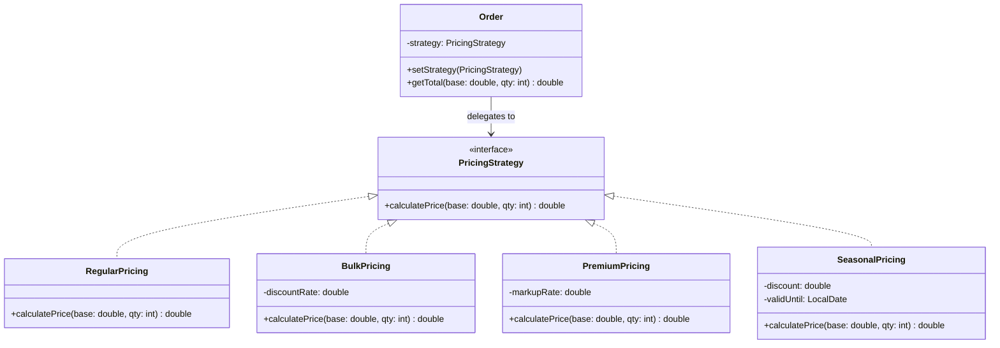
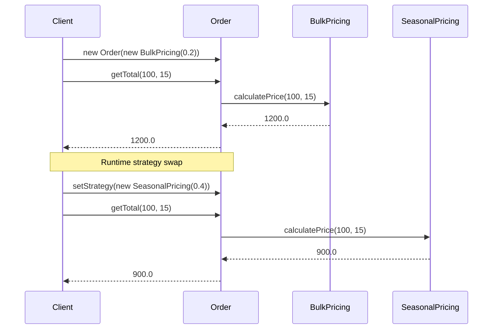

#system-design #lld #patterns #behavioral #strategy

```table-of-contents
title: 
style: nestedList # TOC style (nestedList|nestedOrderedList|inlineFirstLevel)
minLevel: 0 # Include headings from the specified level
maxLevel: 0 # Include headings up to the specified level
include: 
exclude: 
includeLinks: true # Make headings clickable
hideWhenEmpty: false # Hide TOC if no headings are found
debugInConsole: false # Print debug info in Obsidian console
```
# Strategy Pattern

**One-liner:** Define a family of algorithms, put each in its own class, and make them interchangeable at runtime — without changing the class that uses them.

**SOLID principle:** Open-Closed Principle (OCP) — add new algorithms without modifying existing code.

---

## Why This Exists — The Pain Without It

```java
// WITHOUT Strategy — every new pricing rule touches this method
public double calculatePrice(String customerType, double base, int qty) {
    if (customerType.equals("REGULAR")) {
        return base * qty;
    } else if (customerType.equals("BULK")) {
        return base * qty * 0.8;
    } else if (customerType.equals("PREMIUM")) {
        return base * qty * 1.2;
    } else if (customerType.equals("SEASONAL")) {       // ← added during Diwali sale
        return base * qty * 0.6;
    } else if (customerType.equals("EMPLOYEE")) {       // ← added for employee discount
        return base * qty * 0.5;
    } else if (customerType.equals("LOYALTY_GOLD")) {   // ← added for loyalty program
        return base * qty * 0.75;
    }
    // ... grows forever, violates OCP, untestable, risky to change
    throw new IllegalArgumentException("Unknown type: " + customerType);
}
```

**Problems:**
1. Adding new type = modifying working code = risk of breaking existing logic
2. Can't test one pricing rule in isolation
3. Can't swap pricing at runtime (e.g., flash sale → regular → bulk)
4. String comparison for types (no compile-time safety)

---

## Mermaid Class Diagram



---

## 6 Detailed Examples — Why, How, Where, When

### Example 1: Pricing Strategy (E-Commerce)

**WHY:** Flipkart has Regular, Bulk, Premium, Seasonal, Employee pricing. Each has different math. Adding Diwali sale pricing shouldn't touch existing pricing logic.

**HOW:** `PricingStrategy` interface → one class per pricing rule → `Order` holds a reference and delegates.

**WHERE:** Every e-commerce platform — Amazon, Flipkart, Meesho, Myntra.

**WHEN:** Use when pricing rules change per customer type, sale events, or geography.

```java
public interface PricingStrategy {
    double calculatePrice(double basePrice, int quantity);
}

public class RegularPricing implements PricingStrategy {
    public double calculatePrice(double base, int qty) {
        return base * qty;
    }
}

public class BulkPricing implements PricingStrategy {
    private final double discountRate;
    public BulkPricing(double discountRate) { this.discountRate = discountRate; }

    public double calculatePrice(double base, int qty) {
        return qty >= 10 ? base * qty * (1 - discountRate) : base * qty;
    }
}

public class SeasonalPricing implements PricingStrategy {
    private final double discount;
    private final LocalDate validUntil;

    public SeasonalPricing(double discount, LocalDate validUntil) {
        this.discount   = discount;
        this.validUntil = validUntil;
    }

    public double calculatePrice(double base, int qty) {
        if (LocalDate.now().isAfter(validUntil)) {
            throw new ExpiredPromotionException("Seasonal discount expired");
        }
        return base * qty * (1 - discount);
    }
}

// Context — doesn't know which strategy is active
public class Order {
    private PricingStrategy strategy;

    public Order(PricingStrategy strategy) { this.strategy = strategy; }
    public void setStrategy(PricingStrategy s) { this.strategy = s; }
    public double getTotal(double base, int qty) { return strategy.calculatePrice(base, qty); }
}
```

---

### Example 2: Payment Gateway Selection

**WHY:** Your checkout should work with Razorpay, Stripe, PayU, Paytm. The business team might switch gateways anytime. Code should not care which gateway is active.

**HOW:** `PaymentGateway` interface → implementations per provider → inject the active one.

**WHERE:** CRED, PhonePe, Groww, Razorpay itself (they support multiple underlying banks).

**WHEN:** Use when you have 2+ external service providers for the same operation.

```java
public interface PaymentGateway {
    PaymentResult charge(Money amount, String token);
    PaymentResult refund(String transactionId, Money amount);
}

public class RazorpayGateway implements PaymentGateway {
    private final RazorpayClient client;
    public PaymentResult charge(Money amount, String token) {
        RazorpayResponse resp = client.createPayment(amount.toPaise(), token);
        return new PaymentResult(resp.getId(), resp.getStatus());
    }
    public PaymentResult refund(String txnId, Money amount) {
        return new PaymentResult(client.refund(txnId, amount.toPaise()));
    }
}

public class StripeGateway implements PaymentGateway {
    private final StripeClient client;
    public PaymentResult charge(Money amount, String token) {
        StripeCharge charge = client.charges().create(amount.toCents(), "inr", token);
        return new PaymentResult(charge.getId(), charge.getStatus());
    }
    public PaymentResult refund(String txnId, Money amount) {
        return new PaymentResult(client.refunds().create(txnId, amount.toCents()));
    }
}

// Usage — swap gateway with zero code change in OrderService
@Service
public class OrderService {
    private final PaymentGateway gateway;  // injected — could be Razorpay or Stripe

    public OrderService(PaymentGateway gateway) { this.gateway = gateway; }

    public Order placeOrder(OrderRequest req) {
        PaymentResult result = gateway.charge(req.getAmount(), req.getPaymentToken());
        if (!result.isSuccess()) throw new PaymentFailedException(result.getFailureReason());
        return createOrder(req, result.getTransactionId());
    }
}
```

---

### Example 3: Compression Strategy (File Upload Service)

**WHY:** Different file types need different compression — images use lossy, documents use lossless, logs use gzip. The upload service shouldn't decide this.

**HOW:** `CompressionStrategy` interface → `GzipCompression`, `ZipCompression`, `LZ4Compression` → chosen by file type.

**WHERE:** Dropbox, Google Drive (different compression per file type), CDN asset pipelines.

**WHEN:** Use when the algorithm depends on input characteristics (file type, size, user preference).

```java
public interface CompressionStrategy {
    byte[] compress(byte[] data);
    byte[] decompress(byte[] data);
    String getExtension();
}

public class GzipCompression implements CompressionStrategy {
    public byte[] compress(byte[] data) { /* java.util.zip.GZIPOutputStream */ return gzipped; }
    public byte[] decompress(byte[] data) { /* java.util.zip.GZIPInputStream */ return raw; }
    public String getExtension() { return ".gz"; }
}

public class LZ4Compression implements CompressionStrategy {
    public byte[] compress(byte[] data) { /* LZ4 library — faster, less ratio */ return compressed; }
    public byte[] decompress(byte[] data) { return raw; }
    public String getExtension() { return ".lz4"; }
}

// Strategy selected based on context
public class FileUploadService {
    private final Map<String, CompressionStrategy> strategies = Map.of(
        "log",  new GzipCompression(),
        "csv",  new GzipCompression(),
        "json", new LZ4Compression(),
        "img",  new NoCompression()
    );

    public String upload(String fileName, byte[] data) {
        String ext = getExtension(fileName);
        CompressionStrategy strategy = strategies.getOrDefault(ext, new GzipCompression());
        byte[] compressed = strategy.compress(data);
        return storage.store(fileName + strategy.getExtension(), compressed);
    }
}
```

---

### Example 4: Notification Routing

**WHY:** Send notification via Email, SMS, Push, WhatsApp. User preferences decide the channel. Adding Slack shouldn't touch existing channels.

**HOW:** `NotificationChannel` interface → one class per channel.

**WHERE:** Every product company — Swiggy, Zomato, Flipkart, any SaaS.

**WHEN:** Use when the delivery mechanism varies but the trigger logic is the same.

```java
public interface NotificationChannel {
    void send(String recipient, String message);
    boolean supports(String channelType);
}

public class EmailChannel implements NotificationChannel {
    public void send(String to, String msg) { emailService.send(to, "Notification", msg); }
    public boolean supports(String type) { return "EMAIL".equals(type); }
}

public class SMSChannel implements NotificationChannel {
    public void send(String to, String msg) { smsProvider.sendSMS(to, msg.substring(0, 160)); }
    public boolean supports(String type) { return "SMS".equals(type); }
}

// Adding WhatsApp = 1 new class, 0 modifications
public class WhatsAppChannel implements NotificationChannel {
    public void send(String to, String msg) { whatsappApi.sendTemplate(to, msg); }
    public boolean supports(String type) { return "WHATSAPP".equals(type); }
}
```

---

### Example 5: Sorting Algorithm Selection

**WHY:** Different data characteristics need different sorts — nearly sorted → Insertion Sort, large random → QuickSort, stability needed → MergeSort. The caller shouldn't decide.

**HOW:** `SortStrategy<T>` interface → multiple implementations → selected based on data analysis.

**WHERE:** Database query engines (PostgreSQL chooses sort based on data size), Java's `Arrays.sort()` internally.

**WHEN:** Use when the optimal algorithm depends on runtime data characteristics.

```java
public interface SortStrategy<T extends Comparable<T>> {
    void sort(List<T> data);
    String getName();
}

public class QuickSort<T extends Comparable<T>> implements SortStrategy<T> {
    public void sort(List<T> data) { /* quicksort implementation */ }
    public String getName() { return "QuickSort"; }
}

public class MergeSort<T extends Comparable<T>> implements SortStrategy<T> {
    public void sort(List<T> data) { /* mergesort implementation */ }
    public String getName() { return "MergeSort"; }
}

// Auto-select based on data
public class SmartSorter<T extends Comparable<T>> {
    public void sort(List<T> data) {
        SortStrategy<T> strategy;
        if (data.size() < 50)          strategy = new InsertionSort<>();
        else if (isNearlySorted(data)) strategy = new InsertionSort<>();
        else if (needsStability())     strategy = new MergeSort<>();
        else                           strategy = new QuickSort<>();

        strategy.sort(data);
    }
}
```

---

### Example 6: Discount Calculation (Flipkart Big Billion Day)

**WHY:** Flat ₹500 off, 20% off, Buy-2-Get-1-Free, Cashback — each is a different discount algorithm. During sales, new discount types pop up weekly.

**HOW:** `DiscountStrategy` interface → one per discount type → composable with Decorator pattern.

**WHERE:** Amazon Prime Day, Flipkart BBD, Swiggy Super, Zomato Pro.

**WHEN:** Use when discount rules change frequently and multiple rules coexist.

```java
public interface DiscountStrategy {
    double apply(double originalPrice, int quantity);
    String description();
}

public class FlatDiscount implements DiscountStrategy {
    private final double amount;
    public FlatDiscount(double amount) { this.amount = amount; }
    public double apply(double price, int qty) { return Math.max(0, price * qty - amount); }
    public String description() { return "Flat ₹" + amount + " off"; }
}

public class PercentageDiscount implements DiscountStrategy {
    private final double percent;
    private final double maxDiscount;
    public PercentageDiscount(double percent, double maxDiscount) {
        this.percent = percent; this.maxDiscount = maxDiscount;
    }
    public double apply(double price, int qty) {
        double discount = price * qty * percent / 100;
        return price * qty - Math.min(discount, maxDiscount);
    }
    public String description() { return percent + "% off (max ₹" + maxDiscount + ")"; }
}

public class BuyXGetYFree implements DiscountStrategy {
    private final int buyX, getFreeY;
    public BuyXGetYFree(int buyX, int freeY) { this.buyX = buyX; this.getFreeY = freeY; }
    public double apply(double price, int qty) {
        int freeItems = (qty / (buyX + getFreeY)) * getFreeY;
        return price * (qty - freeItems);
    }
    public String description() { return "Buy " + buyX + " Get " + getFreeY + " Free"; }
}
```

---

## Executable Example 1 — Pricing (Copy-Paste-Run)

```java
// File: StrategyPricingDemo.java
// Run:  javac StrategyPricingDemo.java && java StrategyPricingDemo

public class StrategyPricingDemo {

    interface PricingStrategy {
        double calculate(double basePrice, int quantity);
        String name();
    }

    static class RegularPricing implements PricingStrategy {
        public double calculate(double base, int qty) { return base * qty; }
        public String name() { return "Regular"; }
    }

    static class BulkPricing implements PricingStrategy {
        private final double discountRate;
        BulkPricing(double rate) { this.discountRate = rate; }
        public double calculate(double base, int qty) {
            return qty >= 10 ? base * qty * (1 - discountRate) : base * qty;
        }
        public String name() { return "Bulk (" + (discountRate * 100) + "% off)"; }
    }

    static class SeasonalPricing implements PricingStrategy {
        private final double discount;
        SeasonalPricing(double discount) { this.discount = discount; }
        public double calculate(double base, int qty) { return base * qty * (1 - discount); }
        public String name() { return "Seasonal (" + (discount * 100) + "% off)"; }
    }

    static class Order {
        private PricingStrategy strategy;
        Order(PricingStrategy strategy) { this.strategy = strategy; }
        void setStrategy(PricingStrategy s) { this.strategy = s; }
        double getTotal(double base, int qty) { return strategy.calculate(base, qty); }
        String getStrategyName() { return strategy.name(); }
    }

    public static void main(String[] args) {
        Order order = new Order(new RegularPricing());

        double base = 100.0;
        int qty = 15;

        // Regular pricing
        System.out.printf("[%s] Base=%.0f, Qty=%d → Total=%.2f%n",
            order.getStrategyName(), base, qty, order.getTotal(base, qty));
        // Output: [Regular] Base=100, Qty=15 → Total=1500.00

        // Switch to bulk at runtime
        order.setStrategy(new BulkPricing(0.2));
        System.out.printf("[%s] Base=%.0f, Qty=%d → Total=%.2f%n",
            order.getStrategyName(), base, qty, order.getTotal(base, qty));
        // Output: [Bulk (20.0% off)] Base=100, Qty=15 → Total=1200.00

        // Switch to seasonal
        order.setStrategy(new SeasonalPricing(0.4));
        System.out.printf("[%s] Base=%.0f, Qty=%d → Total=%.2f%n",
            order.getStrategyName(), base, qty, order.getTotal(base, qty));
        // Output: [Seasonal (40.0% off)] Base=100, Qty=15 → Total=900.00

        // Small quantity with bulk (no discount applied)
        order.setStrategy(new BulkPricing(0.2));
        System.out.printf("[%s] Base=%.0f, Qty=%d → Total=%.2f%n",
            order.getStrategyName(), base, 5, order.getTotal(base, 5));
        // Output: [Bulk (20.0% off)] Base=100, Qty=5 → Total=500.00
    }
}
```

**Expected output:**
```
[Regular] Base=100, Qty=15 → Total=1500.00
[Bulk (20.0% off)] Base=100, Qty=15 → Total=1200.00
[Seasonal (40.0% off)] Base=100, Qty=15 → Total=900.00
[Bulk (20.0% off)] Base=100, Qty=5 → Total=500.00
```

---

## Executable Example 2 — Discount Calculator (Copy-Paste-Run)

```java
// File: StrategyDiscountDemo.java
// Run:  javac StrategyDiscountDemo.java && java StrategyDiscountDemo

public class StrategyDiscountDemo {

    interface DiscountStrategy {
        double apply(double price, int qty);
        String describe();
    }

    static class NoDiscount implements DiscountStrategy {
        public double apply(double p, int q) { return p * q; }
        public String describe() { return "No discount"; }
    }

    static class FlatDiscount implements DiscountStrategy {
        private final double amount;
        FlatDiscount(double amount) { this.amount = amount; }
        public double apply(double p, int q) { return Math.max(0, p * q - amount); }
        public String describe() { return "Flat Rs." + (int)amount + " off"; }
    }

    static class PercentDiscount implements DiscountStrategy {
        private final double pct;
        private final double maxOff;
        PercentDiscount(double pct, double maxOff) { this.pct = pct; this.maxOff = maxOff; }
        public double apply(double p, int q) {
            double disc = p * q * pct / 100;
            return p * q - Math.min(disc, maxOff);
        }
        public String describe() { return pct + "% off (max Rs." + (int)maxOff + ")"; }
    }

    static class BuyXGetYFree implements DiscountStrategy {
        private final int x, y;
        BuyXGetYFree(int x, int y) { this.x = x; this.y = y; }
        public double apply(double p, int q) {
            int sets = q / (x + y);
            int remainder = q % (x + y);
            int paidItems = sets * x + Math.min(remainder, x);
            return p * paidItems;
        }
        public String describe() { return "Buy " + x + " Get " + y + " Free"; }
    }

    public static void main(String[] args) {
        double price = 500;
        int qty = 6;

        DiscountStrategy[] strategies = {
            new NoDiscount(),
            new FlatDiscount(300),
            new PercentDiscount(20, 1000),
            new BuyXGetYFree(2, 1)
        };

        System.out.printf("Item price: Rs.%.0f | Quantity: %d | MRP: Rs.%.0f%n%n", price, qty, price * qty);

        for (DiscountStrategy s : strategies) {
            double total = s.apply(price, qty);
            double saved = price * qty - total;
            System.out.printf("%-30s -> Pay: Rs.%.0f  (Saved: Rs.%.0f)%n", s.describe(), total, saved);
        }
    }
}
```

**Expected output:**
```
Item price: Rs.500 | Quantity: 6 | MRP: Rs.3000

No discount                    -> Pay: Rs.3000  (Saved: Rs.0)
Flat Rs.300 off                -> Pay: Rs.2700  (Saved: Rs.300)
20.0% off (max Rs.1000)       -> Pay: Rs.2400  (Saved: Rs.600)
Buy 2 Get 1 Free              -> Pay: Rs.2000  (Saved: Rs.1000)
```

---

## Mermaid Sequence Diagram — Runtime Flow



---

## Anti-Pattern — What Happens Without Strategy

```java
// THE MESS — grows uncontrollably
public class PricingService {
    public double calculate(String type, double base, int qty, double discount,
                            boolean isSale, LocalDate saleEnd, int loyaltyTier) {
        if (type.equals("REGULAR")) {
            return base * qty;
        } else if (type.equals("BULK") && qty >= 10) {
            return base * qty * 0.8;
        } else if (type.equals("BULK") && qty < 10) {
            return base * qty;
        } else if (type.equals("SEASONAL") && isSale && LocalDate.now().isBefore(saleEnd)) {
            return base * qty * (1 - discount);
        } else if (type.equals("EMPLOYEE")) {
            return base * qty * 0.5;
        } else if (type.equals("LOYALTY") && loyaltyTier == 1) {
            return base * qty * 0.9;
        } else if (type.equals("LOYALTY") && loyaltyTier == 2) {
            return base * qty * 0.85;
        }
        // ...30 more branches added over 2 years
        throw new IllegalArgumentException("Unknown type");
    }
}
```

**What goes wrong:**
- 1 bug in this method risks ALL pricing
- Every new pricing type = merge conflict across team
- Testing requires setting up ALL parameters even for one case
- Dead code accumulates (old promotions never removed)

---

## Refactoring Path — Step by Step

```
Step 1: Identify what varies
        → The calculation formula varies by type

Step 2: Extract the varying part into an interface
        → interface PricingStrategy { double calculate(base, qty); }

Step 3: Create one implementation per variant
        → RegularPricing, BulkPricing, SeasonalPricing

Step 4: Make the context class hold a reference to the interface
        → Order has a PricingStrategy field

Step 5: Inject the strategy via constructor or setter
        → new Order(new BulkPricing(0.2))

Step 6: Remove all if/else from the original method
        → Order.getTotal() just calls strategy.calculate()
```

**In interview, walk through steps 1-6 out loud.** This shows design thinking, not just pattern memorization.

---

## Real Systems Using This

| System | Strategy Usage |
|--------|---------------|
| **JDK** | `Comparator<T>` — sort strategy passed to `Collections.sort()` |
| **JDK** | `ThreadPoolExecutor.RejectedExecutionHandler` — what to do when thread pool is full |
| **Spring** | `AuthenticationProvider` — different auth strategies (JWT, OAuth, LDAP) |
| **Spring** | `TransactionManager` — JDBC vs JPA vs JTA transaction strategy |
| **Netflix** | `LoadBalancer` — round-robin, weighted, random server selection |
| **Stripe** | `PaymentMethod` — card, bank transfer, UPI handled by different processors |
| **Redis** | `EvictionPolicy` — LRU, LFU, random, TTL — configured at startup |

---

## SDE-2/SDE-3 Interview Signals

| Interviewer Says | Think Strategy |
|-----------------|---------------|
| "The algorithm varies based on user type" | Strategy |
| "We need to support multiple pricing/discount models" | Strategy |
| "We might add new behaviors in the future" | Strategy + Factory |
| "Different users see different sorting/ranking" | Strategy |
| "Replace the if-else chain with something cleaner" | Strategy |
| "The payment method can be UPI, card, or net banking" | Strategy |
| "We want to A/B test different algorithms" | Strategy (inject A or B) |

---

## Interview Script — What to Say

> "I notice the [pricing logic / algorithm / routing behavior] varies based on [customer type / configuration / runtime input]. This is a classic Strategy pattern scenario.
>
> I'll extract the varying algorithm into a `PricingStrategy` interface, create one implementation per variant, and inject the appropriate strategy into the service.
>
> This gives us OCP — adding a new pricing rule means creating one new class, zero changes to existing code. It's also independently testable — I can unit test `BulkPricing` without touching `Order`."

---

## When to Use ✅

1. You have 2+ algorithms for the same task that can be swapped
2. The algorithm selection happens at runtime (config, user type, request)
3. You want to test each algorithm in isolation
4. New algorithms will be added over time

## When NOT to Use ❌

1. Only 2 variants that will NEVER change → simple if/else is fine
2. The algorithm needs heavy access to the context's internals → extract might not work
3. Only one variant exists → premature abstraction

---

## Trade-offs & Alternatives

| Approach | When to Choose |
|----------|---------------|
| **if/else** | 2 simple variants, will never grow |
| **Strategy** | 3+ variants, or likely to grow |
| **State** | Behavior changes AND internal state transitions occur |
| **Template Method** | Algorithm skeleton is same, only steps differ — and you want compile-time binding (inheritance) |
| **Lambda** | Strategy with single method → use `Function<T, R>` instead of interface + class |

**Lambda alternative (Java 8+):**
```java
// Instead of creating BulkPricing class:
PricingStrategy bulk = (base, qty) -> qty >= 10 ? base * qty * 0.8 : base * qty;
Order order = new Order(bulk);
```

---

## Complexity Analysis

| Scenario | Without Strategy | With Strategy |
|----------|-----------------|---------------|
| Add new pricing type | Modify existing class (risk: break others) | Add 1 new class (0 modifications) |
| Test one pricing rule | Must set up all params | Instantiate just that strategy |
| Number of files touched | 1 (growing endlessly) | 1 new file per variant |
| Code review risk | High (shared file) | Low (isolated file) |
| Runtime flexibility | Requires redeployment | Swap via config / DI |

---

## Common Interview Mistakes

| Mistake | Why It's Wrong | Fix |
|---------|---------------|-----|
| Making Strategy hold state from Context | Strategy should be stateless or self-contained | Pass needed data as parameters |
| Creating Strategy for 1 variant | Premature abstraction | Wait until you need 2+ |
| Forgetting Factory for Strategy creation | Client still has if/else to choose strategy | Combine with Factory pattern |
| Passing Context into Strategy | Creates circular dependency | Pass only what the strategy needs |
| Using String-based selection | No compile-time safety | Use enum + Factory map |

---

## Combines Well With

| Pattern | How |
|---------|-----|
| **Factory** | Factory creates the correct Strategy based on input type → eliminates if/else in client |
| **State** | Each State can have its own Strategy (e.g., different shipping strategy per order state) |
| **Template Method** | Fixed algorithm skeleton, but one step uses a Strategy (runtime flex + structural skeleton) |
| **Decorator** | Decorate a Strategy to add logging/caching on top |
| **DI / Spring** | `@Autowired PricingStrategy` — Spring picks the right bean based on config/profile |

---

## Cheat Sheet

```
WHAT: Family of interchangeable algorithms behind one interface
WHY:  Kill the if/else chain, add new behavior without modifying existing code
HOW:  Interface + one class per variant + inject via constructor
WHEN: 2+ algorithms, runtime selection, likely to grow
KEY:  Strategy is STATELESS. Context DELEGATES, doesn't inherit.
REAL: Comparator, Spring AuthProvider, Redis EvictionPolicy
```

---

## Links

- [[../creational/factory_method]] — Combine Factory + Strategy
- [[state]] — Similar structure, different intent (state transitions vs algorithm swap)
- [[template_method]] — Fixed skeleton with overridable steps
- [[../../pattern_combinations]] — Strategy combos
- [[../../smell_to_pattern_map]] — When to reach for Strategy

---
---

# ChatGPT

## Strategy Pattern

---

## 1. Real World Analogy

You're going from **Bangalore to Mumbai**. You have three ways to get there:

- ✈️ Flight — fastest, most expensive
- 🚂 Train — medium speed, medium cost
- 🚌 Bus — slowest, cheapest

The **destination is the same**. The **route is the same**. Only the **travel strategy changes**.

You pick a strategy based on your situation — in a hurry? Take flight. Low budget? Take bus. You can switch strategies without changing your destination.

**That is the Strategy pattern.** Same goal, swappable ways to achieve it.

---

## 2. The Problem It Solves

You're building a payment system. Without Strategy:

```java
class PaymentService {
    public void pay(String method, double amount) {
        if (method.equals("creditcard")) {
            // 20 lines of credit card logic
        } else if (method.equals("upi")) {
            // 20 lines of UPI logic
        } else if (method.equals("netbanking")) {
            // 20 lines of net banking logic
        }
        // add PayPal? ADD ANOTHER if block — modify this class forever
    }
}
```

Every new payment method = modify existing code. This violates **Open/Closed Principle**. One bug in this method breaks everything.

---

## 3. UML DiagramThree participants — **Context** holds a reference to a **Strategy** interface. **Concrete Strategies** implement that interface. Context delegates work to whichever strategy is currently set.

---

## 4. Full Java Code — Step by Step

**Step 1 — The Strategy interface:**

```java
// Every payment method must implement this
interface PaymentStrategy {
    void pay(double amount);
}
```

---

**Step 2 — Concrete Strategies:**

```java
class CreditCardStrategy implements PaymentStrategy {
    private String cardNumber;
    private String cvv;

    public CreditCardStrategy(String cardNumber, String cvv) {
        this.cardNumber = cardNumber;
        this.cvv        = cvv;
    }

    public void pay(double amount) {
        System.out.println("Paid ₹" + amount
            + " using Credit Card ending " + cardNumber.substring(12));
    }
}

class UpiStrategy implements PaymentStrategy {
    private String upiId;

    public UpiStrategy(String upiId) {
        this.upiId = upiId;
    }

    public void pay(double amount) {
        System.out.println("Paid ₹" + amount + " using UPI: " + upiId);
    }
}

class NetBankingStrategy implements PaymentStrategy {
    private String bankName;

    public NetBankingStrategy(String bankName) {
        this.bankName = bankName;
    }

    public void pay(double amount) {
        System.out.println("Paid ₹" + amount
            + " using Net Banking: " + bankName);
    }
}
```

---

**Step 3 — The Context:**

```java
class PaymentService {
    private PaymentStrategy strategy;   // holds current strategy

    // set or swap strategy at any time
    public void setStrategy(PaymentStrategy strategy) {
        this.strategy = strategy;
    }

    // delegates to whatever strategy is set — never changes
    public void pay(double amount) {
        if (strategy == null) {
            throw new IllegalStateException("Payment strategy not set");
        }
        strategy.pay(amount);
    }
}
```

---

**Step 4 — Client:**

```java
public class Main {
    public static void main(String[] args) {
        PaymentService paymentService = new PaymentService();

        // pay with UPI
        paymentService.setStrategy(new UpiStrategy("alice@okicici"));
        paymentService.pay(1500.0);

        // switch to credit card — same service, different strategy
        paymentService.setStrategy(
            new CreditCardStrategy("1234567890123456", "123")
        );
        paymentService.pay(3000.0);

        // switch to net banking
        paymentService.setStrategy(new NetBankingStrategy("HDFC"));
        paymentService.pay(500.0);
    }
}
```

**Output:**

```
Paid ₹1500.0 using UPI: alice@okicici
Paid ₹3000.0 using Credit Card ending 3456
Paid ₹500.0  using Net Banking: HDFC
```

`PaymentService.pay()` never changed. Adding PayPal tomorrow = one new class implementing `PaymentStrategy`. Nothing else touched.

---

## 5. Real Backend Example — Sorting Service

```java
// Strategy interface
interface SortStrategy {
    void sort(int[] data);
}

// Concrete strategies
class QuickSortStrategy implements SortStrategy {
    public void sort(int[] data) {
        System.out.println("QuickSort applied — best for large datasets");
        // quicksort logic
    }
}

class MergeSortStrategy implements SortStrategy {
    public void sort(int[] data) {
        System.out.println("MergeSort applied — stable, good for linked lists");
        // mergesort logic
    }
}

class BubbleSortStrategy implements SortStrategy {
    public void sort(int[] data) {
        System.out.println("BubbleSort applied — only for tiny datasets");
        // bubblesort logic
    }
}

// Context — picks strategy based on data size
class DataProcessor {
    private SortStrategy strategy;

    public void setStrategy(SortStrategy strategy) {
        this.strategy = strategy;
    }

    public void process(int[] data) {
        // pick strategy dynamically based on input size
        if (data.length > 10_000) {
            setStrategy(new QuickSortStrategy());
        } else if (data.length > 100) {
            setStrategy(new MergeSortStrategy());
        } else {
            setStrategy(new BubbleSortStrategy());
        }
        strategy.sort(data);
    }
}
```

Strategy picked at **runtime** based on actual data. No `if-else` scattered across the codebase.

---

## 6. Where Strategy Appears in Java / Spring

```java
// 1. Java Collections — Comparator IS a strategy
List<Employee> employees = Arrays.asList(...);

// swap sorting strategy at runtime
employees.sort(Comparator.comparing(Employee::getSalary));   // sort by salary
employees.sort(Comparator.comparing(Employee::getName));     // sort by name
employees.sort(Comparator.comparing(Employee::getAge));      // sort by age

// 2. Spring Security — AuthenticationStrategy
// Different auth strategies: JWT, OAuth2, Basic Auth
// Same security filter chain, different strategy injected

// 3. Spring's ResourceHandlerRegistry
// Different strategies for serving static resources

// 4. Jackson ObjectMapper — serialization strategies
mapper.setSerializationInclusion(JsonInclude.Include.NON_NULL); // strategy

// 5. Thread pool ExecutorService
ExecutorService fixed      = Executors.newFixedThreadPool(10);
ExecutorService cached     = Executors.newCachedThreadPool();
ExecutorService singleThread = Executors.newSingleThreadExecutor();
// all implement ExecutorService — different scheduling strategies
```

---

## 7. Comparison With Similar Patterns

||Strategy|Template Method|State|
|---|---|---|---|
|**Intent**|Swap whole algorithm|Fix skeleton, vary steps|Change behaviour by state|
|**How**|Composition — inject strategy|Inheritance — override steps|Internal state object changes|
|**Runtime swap**|✅ Yes|❌ No|✅ Yes (auto)|
|**Who decides**|Client sets strategy|Subclass overrides steps|Object itself transitions|
|**Example**|Payment method|Report generation|Order status|

**Strategy vs State** — most confused pair:

- **Strategy** — client consciously **chooses** which algorithm to use
- **State** — object **automatically transitions** based on its own internal state

```java
// Strategy — CLIENT sets it
paymentService.setStrategy(new UpiStrategy());   // I choose UPI

// State — OBJECT transitions itself
order.confirm();    // order internally moves from PENDING → CONFIRMED
order.ship();       // order internally moves from CONFIRMED → SHIPPED
```

---

## 8. Trade-offs

**Pros:**

- Eliminates giant `if-else` / `switch` blocks
- New algorithms = new class, nothing existing changes — Open/Closed
- Strategies are independently testable
- Swap algorithms at runtime

**Cons:**

- Client must know which strategies exist to choose one
- Extra classes for simple cases — overkill if only 2 strategies
- If strategies share no common behaviour, the interface may feel forced

---

## 9. Interview Question + One-Line Summary

**Interview question:**

> _"Design a discount engine where different discount rules — flat, percentage, seasonal — can be applied to an order, and new rules can be added without changing existing code."_

```java
interface DiscountStrategy {
    double apply(double price);
}

class FlatDiscount implements DiscountStrategy {
    private double amount;
    public FlatDiscount(double amount) { this.amount = amount; }
    public double apply(double price)  { return price - amount; }
}

class PercentageDiscount implements DiscountStrategy {
    private double percent;
    public PercentageDiscount(double percent) { this.percent = percent; }
    public double apply(double price) { return price * (1 - percent / 100); }
}

class SeasonalDiscount implements DiscountStrategy {
    public double apply(double price) { return price * 0.75; }  // 25% off
}

class OrderCheckout {
    private DiscountStrategy strategy;

    public void setDiscount(DiscountStrategy strategy) {
        this.strategy = strategy;
    }

    public double checkout(double price) {
        return strategy != null ? strategy.apply(price) : price;
    }
}

// Client
OrderCheckout checkout = new OrderCheckout();
checkout.setDiscount(new SeasonalDiscount());
System.out.println(checkout.checkout(1000));  // ₹750
```

---

**One-line SDE-2 summary:**

> _"Strategy defines a family of algorithms, encapsulates each one, and makes them interchangeable — letting the algorithm vary independently from the client that uses it, eliminating if-else chains and following Open/Closed Principle."_

---

Ready for **Command** pattern next?
