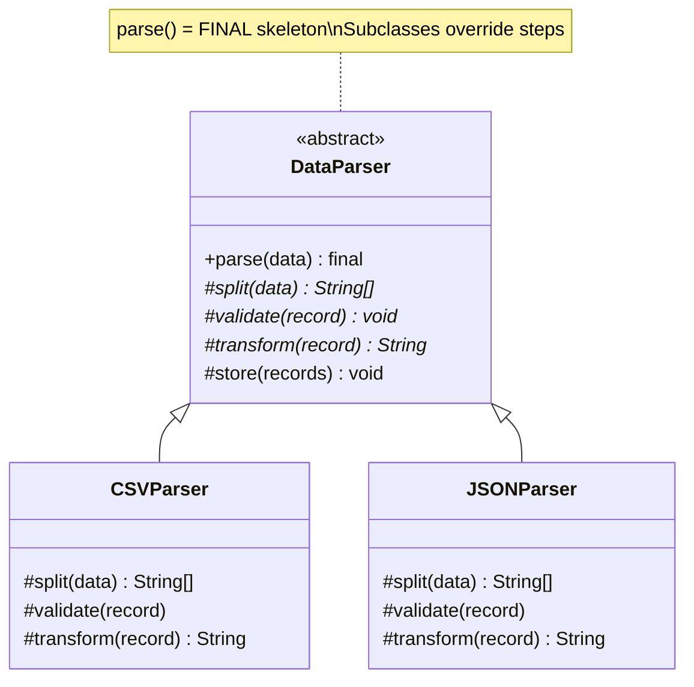
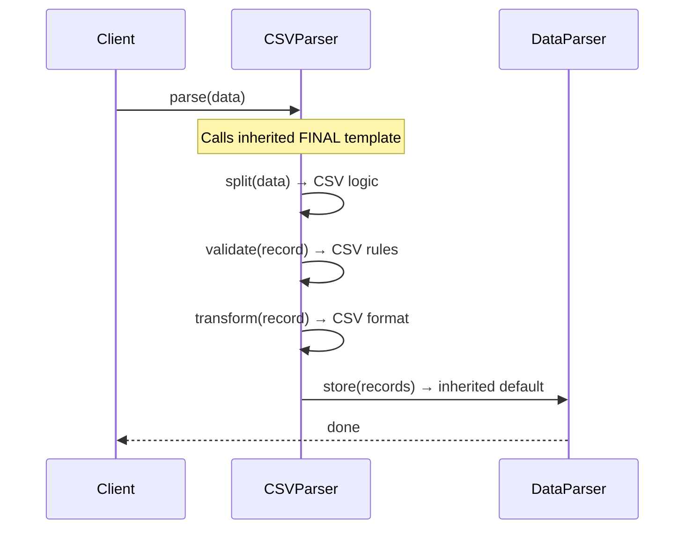
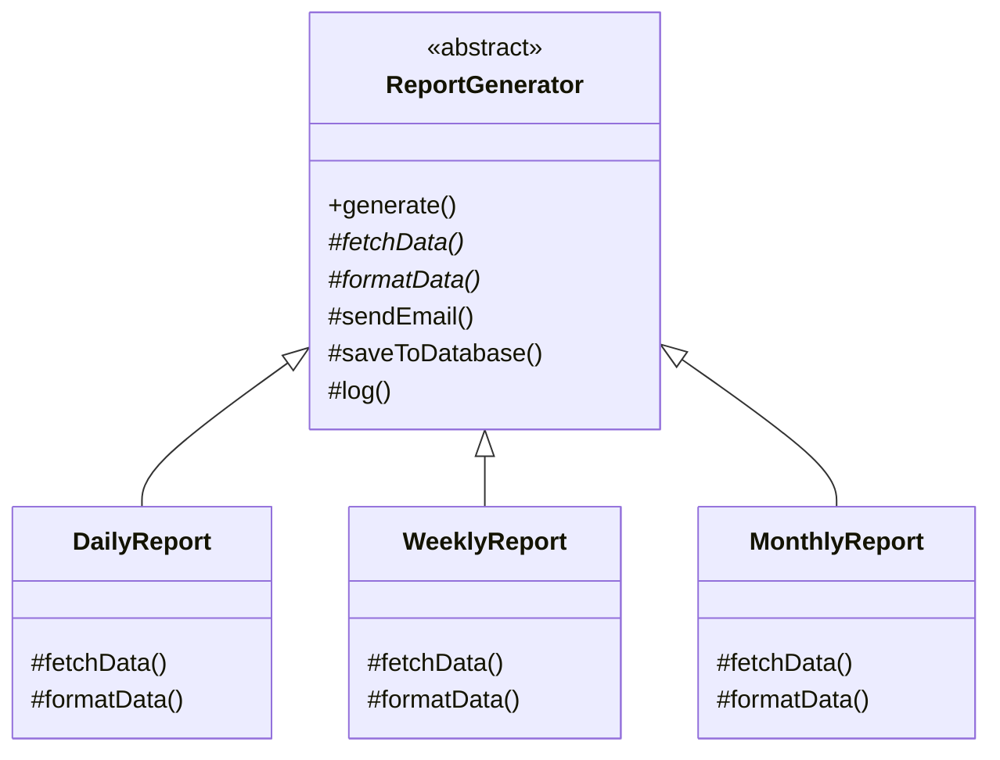

```table-of-contents
title: 
style: nestedList # TOC style (nestedList|nestedOrderedList|inlineFirstLevel)
minLevel: 0 # Include headings from the specified level
maxLevel: 0 # Include headings up to the specified level
include: 
exclude: 
includeLinks: true # Make headings clickable
hideWhenEmpty: false # Hide TOC if no headings are found
debugInConsole: false # Print debug info in Obsidian console
```
# Template Method Pattern

**One-liner:** Define the skeleton of an algorithm in a base class and let subclasses override specific steps — without changing the algorithm's overall structure.

---

## Why This Exists — The Problem Without It

```java
// BEFORE: Algorithm skeleton copy-pasted across classes with tiny differences
public class CSVDataProcessor {
    public void process(String filePath) {
        // Step 1: Read — CSV-specific
        List<String[]> rows = readCSV(filePath);

        // Step 2: Validate — IDENTICAL across all processors
        if (rows == null || rows.isEmpty()) throw new RuntimeException("No data");

        // Step 3: Transform — CSV-specific
        List<Record> records = rows.stream()
            .map(r -> new Record(r[0], r[1])).collect(toList());

        // Step 4: Write — IDENTICAL across all processors
        database.saveAll(records);
        System.out.println("Processed " + records.size() + " records");
    }
}

public class JSONDataProcessor {
    public void process(String filePath) {
        // Step 1: Read — JSON-specific (different from CSV)
        List<JsonNode> nodes = readJSON(filePath);

        // Step 2: Validate — IDENTICAL (copy-paste from CSV processor)
        if (nodes == null || nodes.isEmpty()) throw new RuntimeException("No data");

        // Step 3: Transform — JSON-specific
        List<Record> records = nodes.stream()
            .map(n -> new Record(n.get("id").asText(), n.get("name").asText()))
            .collect(toList());
            
        
         // Step 4: Write — IDENTICAL (copy-paste again)
        database.saveAll(records);
        System.out.println("Processed " + records.size() + " records");
    }
} 
// Adding XMLDataProcessor means copy-pasting again. Bug in "Write" step? Fix in 3 places.
```

---

## Mermaid Class Diagram






---

## Real-World Analogy

Baking a cake: every cake follows the same skeleton — mix dry ingredients, mix wet ingredients, combine, pour into pan, bake, let cool, decorate. A chocolate cake and a vanilla cake differ only in specific steps (which dry ingredients, which flavoring). The recipe framework (skeleton) stays identical. Only the variable steps change. A new baker follows the skeleton and only needs to specify what's different for their cake.

---

## The Fix — Clean Implementation

```java
// ─── Abstract Base Class — the skeleton lives here ────────────────────────
public abstract class DataProcessor {

    // TEMPLATE METHOD — final so subclasses cannot change the algorithm order
    public final void process(String source) {
        List<RawData> rawData = readData(source);           // abstract — MUST override
        List<RawData> validated = validateData(rawData);    // hook — CAN override
        List<Record> records = transformData(validated);    // abstract — MUST override
        writeData(records);                                  // concrete — shared, don't override
        onComplete(records.size());                          // hook — optional callback
    }

    // Abstract step: subclasses MUST provide implementation
    protected abstract List<RawData> readData(String source);

    // Abstract step: subclasses MUST provide implementation
    protected abstract List<Record> transformData(List<RawData> rawData);

    // Hook method: has a sensible default, but CAN be overridden
    protected List<RawData> validateData(List<RawData> data) {
        if (data == null || data.isEmpty()) {
            throw new IllegalArgumentException("No data to process from source: " + source);
        }
        System.out.println("Default validation: " + data.size() + " records found.");
        return data;
    }

    // Concrete step: shared for ALL processors — subclasses DO NOT override
    private void writeData(List<Record> records) {
        Database.getInstance().saveAll(records);
    }

    // Hook method: default is no-op; subclasses can hook in for metrics, alerting
    protected void onComplete(int recordCount) {
        System.out.println("Processing complete: " + recordCount + " records written.");
    }
}

// ─── Concrete Subclass 1 ──────────────────────────────────────────────────
public class CSVDataProcessor extends DataProcessor {

    @Override
    protected List<RawData> readData(String filePath) {
        System.out.println("Reading CSV from: " + filePath);
        try (BufferedReader reader = new BufferedReader(new FileReader(filePath))) {
            return reader.lines()
                .skip(1)  // skip header
                .map(line -> new RawData(line.split(",")))
                .collect(Collectors.toList());
        } catch (IOException e) {
            throw new DataReadException("Failed to read CSV: " + filePath, e);
        }
    }

    @Override
    protected List<Record> transformData(List<RawData> rawData) {
        return rawData.stream()
            .map(raw -> new Record(raw.fields()[0].trim(), raw.fields()[1].trim()))
            .filter(r -> !r.id().isBlank())
            .collect(Collectors.toList());
    }

    // Overrides the validation hook to add CSV-specific checks
    @Override
    protected List<RawData> validateData(List<RawData> data) {
        List<RawData> valid = super.validateData(data);  // call parent default first
        return valid.stream()
            .filter(raw -> raw.fields().length >= 2)     // CSV must have at least 2 columns
            .collect(Collectors.toList());
    }
}

// ─── Concrete Subclass 2 ──────────────────────────────────────────────────
public class JSONDataProcessor extends DataProcessor {
    private final ObjectMapper objectMapper = new ObjectMapper();

    @Override
    protected List<RawData> readData(String filePath) {
        System.out.println("Reading JSON from: " + filePath);
        try {
            JsonNode root = objectMapper.readTree(new File(filePath));
            List<RawData> result = new ArrayList<>();
            root.forEach(node -> result.add(new RawData(new String[]{
                node.path("id").asText(),
                node.path("name").asText()
            })));
            return result;
        } catch (IOException e) {
            throw new DataReadException("Failed to read JSON: " + filePath, e);
        }
    }

    @Override
    protected List<Record> transformData(List<RawData> rawData) {
        return rawData.stream()
            .map(raw -> new Record(raw.fields()[0], raw.fields()[1]))
            .collect(Collectors.toList());
    }

    // Overrides onComplete hook to send metrics to Datadog
    @Override
    protected void onComplete(int recordCount) {
        super.onComplete(recordCount);  // print default message
        MetricsClient.increment("json_processor.records", recordCount);
    }
    // Does NOT override validateData — uses the parent's default validation
}

// ─── Supporting Types ─────────────────────────────────────────────────────
public record RawData(String[] fields) {}
public record Record(String id, String name) {}

// ─── Real-world example: HttpServlet is Template Method ───────────────────
// javax.servlet.http.HttpServlet.service() is the template method
// It dispatches to doGet(), doPost(), doPut(), etc. based on HTTP method
// You override ONLY doGet() or doPost() — you never touch service()
public class MyServlet extends HttpServlet {
    @Override
    protected void doGet(HttpServletRequest req, HttpServletResponse resp)
            throws ServletException, IOException {
        // Override just this step — service() skeleton is fixed in parent
        resp.getWriter().write("Hello from GET");
    }
}

// ─── JUnit lifecycle is Template Method ───────────────────────────────────
// JUnit's test runner calls: @BeforeAll → @Before → @Test → @After → @AfterAll
// This IS a template method — the framework owns the skeleton, you fill in steps
// AbstractList.get() is abstract; size() is abstract — subclasses implement these
// AbstractList provides add(), contains(), indexOf(), etc. for free using the template
```

---

## Class Diagram

```
    DataProcessor (abstract)
    ──────────────────────────────────────────────────────
    +process(source)           ← FINAL template method
      calls: readData()        ← abstract (subclass must implement)
             validateData()    ← hook (has default, can override)
             transformData()   ← abstract (subclass must implement)
             writeData()       ← concrete private (never override)
             onComplete()      ← hook (default no-op, can override)
             △
    ┌─────────────────┐
    │                 │
CSVDataProcessor  JSONDataProcessor
─────────────────  ─────────────────
+readData()        +readData()
+transformData()   +transformData()
+validateData()    +onComplete()    ← each overrides only what varies
```

---

## Real Systems Using This

| System | Template Method usage |
|---|---|
| `javax.servlet.HttpServlet.service()` | Template method dispatches to `doGet()`, `doPost()` — you override the step |
| Spring `JdbcTemplate` | `execute()` manages connection/cleanup; your `StatementCallback` is the varying step |
| `java.util.AbstractList` | Defines `get()` and `size()` as abstract; provides all list operations as template steps |
| JUnit test lifecycle | Framework calls `@BeforeAll → @BeforeEach → @Test → @AfterEach → @AfterAll` |
| Spring `AbstractController` | `handleRequest()` is the template; `handleRequestInternal()` is your hook |
| Spring Batch `AbstractStep` | `execute()` is the skeleton; `doExecute()` is the customizable step |

---

## SDE-2/SDE-3 Interview Signals

| If interviewer says... | Think Template Method |
|---|---|
| "Same algorithm structure, different implementations of specific steps" | Template Method — skeleton in base, steps in subclasses |
| "Don't repeat the processing pipeline" | Template Method — extract shared skeleton |
| "Framework that lets users customize specific steps" | Template Method — `abstract` for must-override, `protected` hook for optional |
| "Avoid duplicating boilerplate across similar processors" | Template Method — base class owns boilerplate |
| "Control the order of steps while allowing customization" | Template Method — `final` template method enforces order |

---

## When to Use

- Multiple classes share an algorithm skeleton with only a few varying steps
- You want the framework to control the algorithm order while allowing customization
- There is boilerplate in multiple places that would benefit from centralization
- You can identify "abstract" steps (always different) vs "hook" steps (sometimes different) vs "concrete" steps (always same)

## When NOT to Use

- Variation is too high — if most steps are different, inheritance gives you little
- The algorithm needs to vary at runtime (use Strategy — composition, not inheritance)
- You'd need deep inheritance hierarchies — prefer composition (Strategy) over deep inheritance
- Unit testing is painful because subclasses are tightly bound to the abstract parent

---

## Trade-offs & Alternatives

| Aspect | Template Method | Strategy |
|---|---|---|
| Mechanism | Inheritance (subclass overrides steps) | Composition (strategy object injected) |
| Algorithm selection | Compile-time (subclass choice) | Runtime (strategy can be swapped) |
| Coupling | Tight (subclass tied to parent) | Loose (context knows only interface) |
| When to prefer | Skeleton is stable, steps are fixed | Algorithm must change at runtime |
| Java philosophy | "Prefer composition over inheritance" | Template Method is the inheritance-based cousin |

---

## Common Interview Mistakes

1. **Making too many steps abstract** — forces every subclass to implement everything. Keep skeleton fixed; only truly varying steps are abstract.
2. **Not making the template method `final`** — subclass can override the algorithm order, defeating the purpose.
3. **Forgetting hook methods** — hooks (with defaults) are more flexible than abstract methods; use hooks when override is optional.
4. **Choosing Template Method when runtime variation is needed** — if algorithm must be swappable at runtime, use Strategy (composition) instead.
5. **Calling `super.step()` in wrong order** — when overriding hooks that call super, order matters; document whether to call super before or after custom logic.

---

## Executable Example (Copy-Paste-Run)

```java
// File: TemplateMethodDemo.java
// Run:  javac TemplateMethodDemo.java && java TemplateMethodDemo

public class TemplateMethodDemo {

    static abstract class DataParser {
        // Template method — fixed skeleton
        public final void parse(String data) {
            System.out.println("[" + getFormat() + "] Parsing...");
            String[] records = split(data);        // abstract — subclass defines
            for (String r : records) {
                validate(r);                        // abstract — subclass defines
                System.out.println("  Processed: " + transform(r)); // abstract
            }
            System.out.println("[" + getFormat() + "] Done. " + records.length + " records.\n");
        }
        protected abstract String getFormat();
        protected abstract String[] split(String data);
        protected abstract void validate(String record);
        protected abstract String transform(String record);
    }

    static class CSVParser extends DataParser {
        protected String getFormat() { return "CSV"; }
        protected String[] split(String data) { return data.split("\n"); }
        protected void validate(String record) {
            if (!record.contains(",")) throw new RuntimeException("Invalid CSV: " + record);
        }
        protected String transform(String record) { return "ROW[" + record.replace(",", " | ") + "]"; }
    }

    static class JSONParser extends DataParser {
        protected String getFormat() { return "JSON"; }
        protected String[] split(String data) { return data.split(";"); }
        protected void validate(String record) {
            if (!record.contains(":")) throw new RuntimeException("Invalid JSON: " + record);
        }
        protected String transform(String record) { return "OBJ{" + record.trim() + "}"; }
    }

    public static void main(String[] args) {
        DataParser csv = new CSVParser();
        csv.parse("Alice,30\nBob,25\nCharlie,35");
        // [CSV] Parsing...
        //   Processed: ROW[Alice | 30]
        //   Processed: ROW[Bob | 25]
        //   Processed: ROW[Charlie | 35]
        // [CSV] Done. 3 records.

        DataParser json = new JSONParser();
        json.parse("name:Alice; name:Bob; name:Charlie");
        // [JSON] Parsing...
        //   Processed: OBJ{name:Alice}
        //   Processed: OBJ{name:Bob}
        //   Processed: OBJ{name:Charlie}
        // [JSON] Done. 3 records.
    }
}
```

---

## Anti-Pattern

```java
// Duplicated algorithm skeleton across subclasses
class CSVParser {
    void parse(String data) {
        String[] records = data.split("\n");      // shared logic duplicated
        for (String r : records) {                // shared logic duplicated
            if (!r.contains(",")) throw ...;      // format-specific
            process(r.replace(",", "|"));          // format-specific
        }
    }
}
class JSONParser {
    void parse(String data) {
        String[] records = data.split(";");       // shared logic DUPLICATED
        for (String r : records) {                // shared logic DUPLICATED
            if (!r.contains(":")) throw ...;      // format-specific
            process("{" + r + "}");                // format-specific
        }
    }
}
// The loop, validation flow, error handling — all duplicated. Fix: Template Method.
```

---

## Spring Boot Connection

```java
// HttpServlet.service() IS Template Method
// It calls doGet(), doPost() — you override those
// JUnit lifecycle: @BeforeEach → @Test → @AfterEach = template method
// Spring's JdbcTemplate: template for DB operations (open, execute, close, handle errors)
```

---

## Which LLD Problems Use This

- [[../../examples/lld_snake_and_ladder]] — Game loop: roll → move → check → next turn
- [[../../examples/lld_chess]] — Turn: select piece → validate → move → check status

---

## Follow-up Questions

| Question | Answer |
|----------|--------|
| "Template Method vs Strategy?" | TM = inheritance (compile-time). Strategy = composition (runtime). |
| "Can you combine them?" | Yes — fixed skeleton via TM, one step delegates to injected Strategy. |
| "What if I need to swap behavior at runtime?" | Use Strategy instead. TM is compile-time binding. |

---

## Interview Script

> "The algorithm skeleton is the same across [CSV, JSON, XML] parsers — split, validate, transform. Only the steps differ. I'll use Template Method — abstract base class defines the skeleton as `final`, subclasses override the specific steps. No duplication, consistent flow."

---

## Thread-Safety Note

```
Template method itself has no concurrency concern.
Subclass state (if any) determines thread-safety.
Stateless parsers → thread-safe. Mutable state in subclass → not thread-safe.
```

---

## Complexity Analysis

| Scenario | Without TM | With TM |
|----------|-----------|---------|
| Add new format (XML) | Copy-paste entire flow + modify steps | Override 3-4 abstract methods |
| Fix bug in shared flow | Fix in every parser | Fix in base class once |
| Enforce consistent flow | Manual discipline | `final` template method enforces |

---

## Combines Well With

- **Strategy** — when the variant step needs runtime swapping, delegate to Strategy
- **Factory Method** — TM can call a factory method step to create objects
- **Iterator** — TM in abstract collection iterates using abstract hasNext()/next()

---

## Cheat Sheet

```
Template Method = algorithm skeleton in base class; subclasses fill in the steps
Mark template method final — subclasses override steps, not the skeleton
Abstract steps: MUST override (required variation)
Hook steps: CAN override, have a default (optional variation)
Concrete steps: private — shared, never override
Template vs Strategy: Template = inheritance (compile-time); Strategy = composition (runtime)
```

---
---
# ChatGPT
## Template Method Pattern

---

## 1. Real World Analogy

Think about how a **restaurant prepares any dish**:

1. Prepare ingredients
2. Cook the dish
3. Plate and serve

This sequence **never changes** — every dish follows these exact steps in this exact order. What changes is **how** each step is done:

- Dosa: grind batter → spread on tawa → serve with chutney
- Pasta: boil water → cook with sauce → serve with parmesan
- Biryani: marinate meat → layer and cook → serve with raita

The **skeleton is fixed**. The **steps vary** per dish.

That is Template Method. **Define the skeleton of an algorithm in a base class. Let subclasses fill in the steps.**

---

## 2. The Problem It Solves

You're building reports — daily report, weekly report, monthly report. Without Template Method:

```java
class DailyReport {
    public void generate() {
        fetchData();        // different per report
        formatData();       // different per report
        sendEmail();        // SAME for all — duplicated
        saveToDatabase();   // SAME for all — duplicated
        log();              // SAME for all — duplicated
    }
}

class WeeklyReport {
    public void generate() {
        fetchData();        // different
        formatData();       // different
        sendEmail();        // duplicated again
        saveToDatabase();   // duplicated again
        log();              // duplicated again
    }
}
```

Same steps duplicated everywhere. Change `sendEmail()` → update every report class. That never scales.

---

## 3. UML — Mermaid Format



`generate()` is the **template method** — fixed in base class, never overridden. Abstract methods marked with `*` must be implemented by subclasses. Non-abstract methods are shared and inherited as-is.

---

## 4. Full Java Code — Step by Step

**Step 1 — Abstract base class with the template method:**

```java
abstract class ReportGenerator {

    // TEMPLATE METHOD — fixed skeleton, never overridden
    // final keyword ensures subclasses cannot change the order
    public final void generate() {
        fetchData();         // subclass implements
        formatData();        // subclass implements
        sendEmail();         // shared — same for all
        saveToDatabase();    // shared — same for all
        log();               // shared — same for all
    }

    // abstract steps — subclass MUST implement
    protected abstract void fetchData();
    protected abstract void formatData();

    // concrete steps — shared by all, subclass CAN override if needed
    protected void sendEmail() {
        System.out.println("Sending report via email");
    }

    protected void saveToDatabase() {
        System.out.println("Saving report to database");
    }

    protected void log() {
        System.out.println("Report generation logged\n");
    }
}
```

---

**Step 2 — Concrete subclasses — only fill in the varying steps:**

```java
class DailyReport extends ReportGenerator {

    @Override
    protected void fetchData() {
        System.out.println("[DAILY] Fetching last 24 hours of data");
    }

    @Override
    protected void formatData() {
        System.out.println("[DAILY] Formatting as daily summary table");
    }
}

class WeeklyReport extends ReportGenerator {

    @Override
    protected void fetchData() {
        System.out.println("[WEEKLY] Fetching last 7 days of data");
    }

    @Override
    protected void formatData() {
        System.out.println("[WEEKLY] Formatting as weekly trend chart");
    }
}

class MonthlyReport extends ReportGenerator {

    @Override
    protected void fetchData() {
        System.out.println("[MONTHLY] Fetching last 30 days of data");
    }

    @Override
    protected void formatData() {
        System.out.println("[MONTHLY] Formatting as monthly PDF report");
    }

    // optional — override shared step only when needed
    @Override
    protected void sendEmail() {
        System.out.println("[MONTHLY] Sending to executive distribution list");
    }
}
```

---

**Step 3 — Client:**

```java
public class Main {
    public static void main(String[] args) {

        ReportGenerator daily   = new DailyReport();
        ReportGenerator weekly  = new WeeklyReport();
        ReportGenerator monthly = new MonthlyReport();

        System.out.println("=== Daily Report ===");
        daily.generate();

        System.out.println("=== Weekly Report ===");
        weekly.generate();

        System.out.println("=== Monthly Report ===");
        monthly.generate();
    }
}
```

**Output:**

```
=== Daily Report ===
[DAILY]   Fetching last 24 hours of data
[DAILY]   Formatting as daily summary table
Sending report via email
Saving report to database
Report generation logged

=== Weekly Report ===
[WEEKLY]  Fetching last 7 days of data
[WEEKLY]  Formatting as weekly trend chart
Sending report via email
Saving report to database
Report generation logged

=== Monthly Report ===
[MONTHLY] Fetching last 30 days of data
[MONTHLY] Formatting as monthly PDF report
[MONTHLY] Sending to executive distribution list   ← overridden
Saving report to database
Report generation logged
```

The skeleton never changed. Only the varying steps were filled in per subclass.

---

## 5. Real Backend Example — Data Processing Pipeline

Very common in ETL systems and Spring Batch:

```java
abstract class DataPipeline {

    // template method — fixed order always
    public final void run() {
        connect();
        extractData();
        transformData();
        loadData();
        disconnect();
        logCompletion();
    }

    // varying steps — subclass implements
    protected abstract void extractData();
    protected abstract void transformData();
    protected abstract void loadData();

    // fixed steps — same for all pipelines
    protected void connect() {
        System.out.println("Connecting to data source");
    }

    protected void disconnect() {
        System.out.println("Disconnecting from data source");
    }

    protected void logCompletion() {
        System.out.println("Pipeline completed successfully\n");
    }
}

// Pipeline 1 — MySQL to Elasticsearch
class MySQLToElasticPipeline extends DataPipeline {

    protected void extractData() {
        System.out.println("[MySQL→ES] Extracting orders from MySQL");
    }

    protected void transformData() {
        System.out.println("[MySQL→ES] Transforming to ES document format");
    }

    protected void loadData() {
        System.out.println("[MySQL→ES] Indexing into Elasticsearch");
    }
}

// Pipeline 2 — CSV to Database
class CsvToDatabasePipeline extends DataPipeline {

    protected void extractData() {
        System.out.println("[CSV→DB] Reading rows from CSV file");
    }

    protected void transformData() {
        System.out.println("[CSV→DB] Validating and cleaning data");
    }

    protected void loadData() {
        System.out.println("[CSV→DB] Bulk inserting into PostgreSQL");
    }
}

// Client
DataPipeline pipeline1 = new MySQLToElasticPipeline();
DataPipeline pipeline2 = new CsvToDatabasePipeline();

pipeline1.run();
pipeline2.run();
```

---

## Hook Methods — SDE-2 Must Know

Hooks are **optional steps** in the template — empty by default, subclass overrides only if needed:

```java
abstract class OrderProcessor {

    public final void processOrder(Order order) {
        validateOrder(order);
        applyDiscount(order);    // hook — optional step
        chargePayment(order);
        sendConfirmation(order);
        afterOrderProcessed(order);  // hook — optional step
    }

    protected abstract void validateOrder(Order order);
    protected abstract void chargePayment(Order order);
    protected abstract void sendConfirmation(Order order);

    // HOOKS — empty by default, override only if needed
    protected void applyDiscount(Order order) { }
    protected void afterOrderProcessed(Order order) { }
}

class PremiumOrderProcessor extends OrderProcessor {

    protected void validateOrder(Order order) {
        System.out.println("Validating premium order");
    }

    protected void chargePayment(Order order) {
        System.out.println("Charging with priority processing");
    }

    protected void sendConfirmation(Order order) {
        System.out.println("Sending premium confirmation email");
    }

    // overrides hook — premium orders get discount
    @Override
    protected void applyDiscount(Order order) {
        System.out.println("Applying 10% premium member discount");
    }
}

class StandardOrderProcessor extends OrderProcessor {

    protected void validateOrder(Order order) {
        System.out.println("Validating standard order");
    }

    protected void chargePayment(Order order) {
        System.out.println("Charging standard payment");
    }

    protected void sendConfirmation(Order order) {
        System.out.println("Sending standard confirmation email");
    }

    // no discount — hook not overridden, stays empty
}
```

Hooks give subclasses **optional extension points** without forcing them to implement everything.

---

## 6. Where It Appears in Java / Spring

```java
// 1. Spring's JdbcTemplate
// Fixed skeleton: get connection → execute query → handle results → close
// You only provide: the SQL and the RowMapper (varying steps)
jdbcTemplate.query(
    "SELECT * FROM users",
    (rs, rowNum) -> new User(rs.getLong("id"), rs.getString("name"))
);

// 2. Spring Security — AbstractSecurityInterceptor
// Fixed skeleton: obtain security metadata → check access → invoke
// You override: loadSecurityMetadata() and checkPermission()

// 3. Spring's AbstractController
// Fixed skeleton: request handling lifecycle
// You override: handleRequestInternal()

// 4. Java's AbstractList
// Fixed skeleton: list operations
// You implement: get(index) and size()
// All other methods (contains, indexOf, toArray) work automatically

// 5. JUnit lifecycle
// Fixed skeleton: @BeforeAll → @BeforeEach → @Test → @AfterEach → @AfterAll
// You implement: the @Test methods (varying steps)
```

---

## 7. Comparison With Similar Patterns

||Template Method|Strategy|Factory Method|
|---|---|---|---|
|**Mechanism**|Inheritance|Composition|Inheritance|
|**Varies**|Steps of algorithm|Whole algorithm|Object creation|
|**Swap at runtime**|❌ No|✅ Yes|❌ No|
|**Relationship**|Parent controls child|Client controls strategy|Parent defers to child|
|**Example**|Report skeleton|Payment method|Object creation|

**Template Method vs Strategy** — the key difference:

```java
// Template Method — uses INHERITANCE
// base class controls the flow, subclass fills steps
abstract class Report {
    public final void generate() {
        fetchData();    // subclass fills this
        format();       // subclass fills this
        send();         // base class handles this
    }
}

// Strategy — uses COMPOSITION
// client controls which strategy to use
class ReportService {
    private ReportStrategy strategy;   // inject any strategy
    public void generate() {
        strategy.execute();
    }
}
```

Template Method = **"I control the flow, you fill the gaps"** Strategy = **"You decide what to do entirely"**

---

## 8. Trade-offs

**Pros:**

- Eliminates code duplication — shared steps defined once in base class
- Enforces a consistent algorithm structure across all subclasses
- Easy to add new variants — just add a new subclass
- Hook methods give flexible extension points without forcing implementation

**Cons:**

- Uses inheritance — tighter coupling than composition
- Hard to change the skeleton once subclasses exist
- Subclasses can break the pattern by overriding the template method if not marked `final`
- Liskov Substitution can be violated if subclasses deviate too much

---

## 9. Interview Question + One-Line Summary

**Interview question:**

> _"Design a payment processing system where the steps — validate, charge, notify — are always in the same order but each payment method implements them differently."_

```java
abstract class PaymentProcessor {

    // template method — order is fixed
    public final void process(double amount) {
        validate(amount);
        charge(amount);
        notify(amount);
        log(amount);
    }

    protected abstract void validate(double amount);
    protected abstract void charge(double amount);
    protected abstract void notify(double amount);

    // shared step
    protected void log(double amount) {
        System.out.println("Transaction of ₹" + amount + " logged");
    }
}

class UpiProcessor extends PaymentProcessor {
    protected void validate(double amount) {
        System.out.println("[UPI] Validating UPI ID");
    }
    protected void charge(double amount) {
        System.out.println("[UPI] Charging ₹" + amount + " via UPI");
    }
    protected void notify(double amount) {
        System.out.println("[UPI] Sending UPI payment notification");
    }
}

class CardProcessor extends PaymentProcessor {
    protected void validate(double amount) {
        System.out.println("[CARD] Validating card and CVV");
    }
    protected void charge(double amount) {
        System.out.println("[CARD] Charging ₹" + amount + " via card");
    }
    protected void notify(double amount) {
        System.out.println("[CARD] Sending card payment SMS");
    }
}

// Client
PaymentProcessor upi  = new UpiProcessor();
PaymentProcessor card = new CardProcessor();

upi.process(1500);
card.process(3000);
```

---

**One-line SDE-2 summary:**

> _"Template Method defines the skeleton of an algorithm in a base class and lets subclasses override specific steps without changing the overall structure — eliminating duplication while enforcing a consistent flow, used in JdbcTemplate, Spring Security, and JUnit lifecycle."_

---

Ready for **State** pattern next?