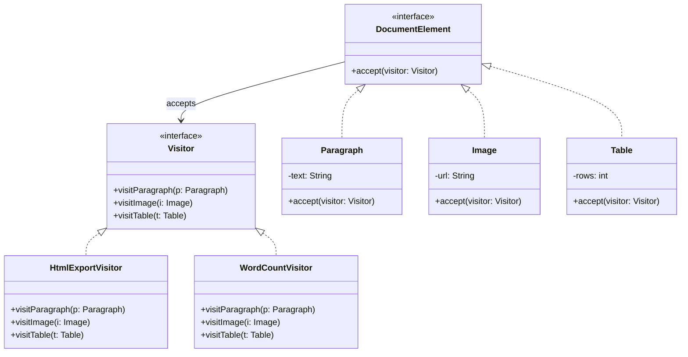

## Visitor Pattern

---

## 1. Real World Analogy

Think about a **tax inspector** visiting different types of businesses:

- Visits a **Restaurant** → calculates restaurant tax
- Visits a **Hotel** → calculates hotel tax
- Visits a **Cinema** → calculates cinema tax

The **inspector** (visitor) knows how to handle each business type differently. The **businesses** (elements) just let the inspector in — they don't change themselves.

Next year the government adds a **health inspector**. The businesses don't change at all. A new inspector just visits them with different logic.

**That is Visitor. Add new operations to existing objects without changing those objects.**

---

## 2. The Problem It Solves

You have a document with different elements — paragraphs, images, tables. You want to:

- Export to HTML
- Export to PDF
- Calculate word count
- Spell check

Without Visitor:

```java
class Paragraph {
    public String exportToHtml()  { /* html logic */ }
    public String exportToPdf()   { /* pdf logic */ }
    public int    getWordCount()  { /* word count logic */ }
    public void   spellCheck()    { /* spell check logic */ }
    // every new operation = modify this class forever
}

class Image {
    public String exportToHtml()  { /* html logic */ }
    public String exportToPdf()   { /* pdf logic */ }
    // same explosion
}
```

Every new operation = modify every element class. 5 elements × 5 operations = 25 methods scattered everywhere.

---

## 3. UML — Mermaid Format



Two hierarchies — **Elements** (Paragraph, Image, Table) and **Visitors** (HtmlExport, WordCount). Elements never change. New operations = new Visitor.

---

## 4. Full Java Code — Step by Step

**Step 1 — Visitor interface:**

```java
// One visit method per element type
interface DocumentVisitor {
    void visitParagraph(Paragraph paragraph);
    void visitImage(Image image);
    void visitTable(Table table);
}
```

---

**Step 2 — Element interface:**

```java
// Every element must accept a visitor
interface DocumentElement {
    void accept(DocumentVisitor visitor);
}
```

---

**Step 3 — Concrete Elements:**

```java
class Paragraph implements DocumentElement {
    private String text;

    public Paragraph(String text) {
        this.text = text;
    }

    public String getText() { return text; }

    // key line — calls the RIGHT visit method for this type
    public void accept(DocumentVisitor visitor) {
        visitor.visitParagraph(this);
    }
}

class Image implements DocumentElement {
    private String url;
    private int width;
    private int height;

    public Image(String url, int width, int height) {
        this.url    = url;
        this.width  = width;
        this.height = height;
    }

    public String getUrl()    { return url; }
    public int    getWidth()  { return width; }
    public int    getHeight() { return height; }

    public void accept(DocumentVisitor visitor) {
        visitor.visitImage(this);   // calls visitImage — not visitParagraph
    }
}

class Table implements DocumentElement {
    private int rows;
    private int cols;
    private String[][] data;

    public Table(int rows, int cols) {
        this.rows = rows;
        this.cols = cols;
        this.data = new String[rows][cols];
    }

    public int     getRows() { return rows; }
    public int     getCols() { return cols; }

    public void accept(DocumentVisitor visitor) {
        visitor.visitTable(this);
    }
}
```

---

**Step 4 — Concrete Visitors (operations):**

```java
// Visitor 1 — HTML export
class HtmlExportVisitor implements DocumentVisitor {

    public void visitParagraph(Paragraph p) {
        System.out.println("<p>" + p.getText() + "</p>");
    }

    public void visitImage(Image i) {
        System.out.println("");
    }

    public void visitTable(Table t) {
        System.out.println("<table rows=\"" + t.getRows()
            + "\" cols=\"" + t.getCols() + "\"></table>");
    }
}

// Visitor 2 — Word count
class WordCountVisitor implements DocumentVisitor {
    private int totalWords = 0;

    public void visitParagraph(Paragraph p) {
        int words = p.getText().split("\\s+").length;
        totalWords += words;
        System.out.println("Paragraph: " + words + " words");
    }

    public void visitImage(Image i) {
        System.out.println("Image: 0 words");
    }

    public void visitTable(Table t) {
        int cells = t.getRows() * t.getCols();
        totalWords += cells;
        System.out.println("Table: ~" + cells + " cells counted");
    }

    public int getTotalWords() { return totalWords; }
}

// Visitor 3 — PDF export (added later — zero changes to elements)
class PdfExportVisitor implements DocumentVisitor {

    public void visitParagraph(Paragraph p) {
        System.out.println("[PDF] Text block: " + p.getText());
    }

    public void visitImage(Image i) {
        System.out.println("[PDF] Image frame: " + i.getUrl());
    }

    public void visitTable(Table t) {
        System.out.println("[PDF] Table grid: "
            + t.getRows() + "x" + t.getCols());
    }
}
```

---

**Step 5 — Client:**

```java
public class Main {
    public static void main(String[] args) {

        // build document
        List<DocumentElement> document = new ArrayList<>();
        document.add(new Paragraph("Design patterns are reusable solutions"));
        document.add(new Image("diagram.png", 800, 600));
        document.add(new Table(3, 4));
        document.add(new Paragraph("Visitor pattern adds operations cleanly"));

        // apply HTML export
        System.out.println("=== HTML Export ===");
        DocumentVisitor htmlVisitor = new HtmlExportVisitor();
        for (DocumentElement element : document) {
            element.accept(htmlVisitor);
        }

        // apply word count
        System.out.println("\n=== Word Count ===");
        WordCountVisitor wordCount = new WordCountVisitor();
        for (DocumentElement element : document) {
            element.accept(wordCount);
        }
        System.out.println("Total: " + wordCount.getTotalWords() + " words");

        // apply PDF export — added later, zero element changes
        System.out.println("\n=== PDF Export ===");
        DocumentVisitor pdfVisitor = new PdfExportVisitor();
        for (DocumentElement element : document) {
            element.accept(pdfVisitor);
        }
    }
}
```

**Output:**

```
=== HTML Export ===
<p>Design patterns are reusable solutions</p>

<table rows="3" cols="4"></table>
<p>Visitor pattern adds operations cleanly</p>

=== Word Count ===
Paragraph: 5 words
Image: 0 words
Table: ~12 cells counted
Paragraph: 5 words
Total: 22 words

=== PDF Export ===
[PDF] Text block: Design patterns are reusable solutions
[PDF] Image frame: diagram.png
[PDF] Table grid: 3x4
[PDF] Text block: Visitor pattern adds operations cleanly
```

Elements never changed. `PdfExportVisitor` was added completely independently.

---

## 5. The Double Dispatch Trick — SDE-2 Must Know

This is what makes Visitor work. It's called **double dispatch** — two method calls to get to the right method:

```java
// Without Visitor — one dispatch (you pick the method)
element.exportToHtml();   // works but couples operation to element

// With Visitor — double dispatch
element.accept(visitor);
// Dispatch 1: element.accept() — selects correct element type
//             Paragraph.accept() calls visitor.visitParagraph(this)
//             Image.accept()     calls visitor.visitImage(this)
//
// Dispatch 2: visitor.visitParagraph() — selects correct visitor
//             HtmlVisitor.visitParagraph() → renders HTML
//             PdfVisitor.visitParagraph()  → renders PDF
```

Two runtime decisions — which element type AND which visitor — gives you the right behaviour automatically.

---

## 6. Real Backend Example — AST Processing

Visitor is heavily used in compilers and query processors:

```java
// SQL AST nodes
interface SqlNode {
    void accept(SqlVisitor visitor);
}

class SelectNode implements SqlNode {
    private List<String> columns;
    public SelectNode(List<String> columns) { this.columns = columns; }
    public List<String> getColumns() { return columns; }
    public void accept(SqlVisitor visitor) { visitor.visitSelect(this); }
}

class WhereNode implements SqlNode {
    private String condition;
    public WhereNode(String condition) { this.condition = condition; }
    public String getCondition() { return condition; }
    public void accept(SqlVisitor visitor) { visitor.visitWhere(this); }
}

class TableNode implements SqlNode {
    private String tableName;
    public TableNode(String tableName) { this.tableName = tableName; }
    public String getTableName() { return tableName; }
    public void accept(SqlVisitor visitor) { visitor.visitTable(this); }
}

// Visitor interface
interface SqlVisitor {
    void visitSelect(SelectNode node);
    void visitWhere(WhereNode node);
    void visitTable(TableNode node);
}

// Visitor 1 — SQL generator
class SqlGeneratorVisitor implements SqlVisitor {
    private StringBuilder sql = new StringBuilder();

    public void visitSelect(SelectNode node) {
        sql.append("SELECT ")
           .append(String.join(", ", node.getColumns()))
           .append(" ");
    }

    public void visitTable(TableNode node) {
        sql.append("FROM ").append(node.getTableName()).append(" ");
    }

    public void visitWhere(WhereNode node) {
        sql.append("WHERE ").append(node.getCondition());
    }

    public String getSql() { return sql.toString().trim(); }
}

// Visitor 2 — Query validator
class ValidationVisitor implements SqlVisitor {
    private List<String> errors = new ArrayList<>();

    public void visitSelect(SelectNode node) {
        if (node.getColumns().isEmpty()) {
            errors.add("SELECT must have at least one column");
        }
    }

    public void visitTable(TableNode node) {
        if (node.getTableName().isEmpty()) {
            errors.add("Table name cannot be empty");
        }
    }

    public void visitWhere(WhereNode node) {
        if (node.getCondition().isEmpty()) {
            errors.add("WHERE clause cannot be empty");
        }
    }

    public List<String> getErrors() { return errors; }
}

// Client
List<SqlNode> ast = Arrays.asList(
    new SelectNode(Arrays.asList("id", "name", "email")),
    new TableNode("users"),
    new WhereNode("age > 18")
);

SqlGeneratorVisitor generator = new SqlGeneratorVisitor();
ast.forEach(node -> node.accept(generator));
System.out.println(generator.getSql());
// SELECT id, name, email FROM users WHERE age > 18

ValidationVisitor validator = new ValidationVisitor();
ast.forEach(node -> node.accept(validator));
System.out.println(validator.getErrors().isEmpty()
    ? "Valid query" : validator.getErrors());
// Valid query
```

---

## 7. Where It Appears in Java / Spring

```java
// 1. Java NIO FileVisitor — walk directory tree
Files.walkFileTree(Paths.get("/project"),
    new SimpleFileVisitor<Path>() {
        @Override
        public FileVisitResult visitFile(
                Path file, BasicFileAttributes attrs) {
            System.out.println(file);
            return FileVisitResult.CONTINUE;
        }
    }
);

// 2. Spring Bean Definition Visitor
// BeanDefinitionVisitor visits each bean definition
// Used internally by Spring for property placeholder resolution

// 3. Compiler tools — JavacTask, AST visitors
// javax.lang.model.element.ElementVisitor
// visits Java source elements during compilation

// 4. Jackson — JsonNode visitor
// visits each JSON node type differently during serialization

// 5. ANTLR — generated parsers use Visitor pattern
// visitExpression(), visitStatement(), visitBlock()
// each grammar rule = one visit method
```

---

## 8. Comparison With Similar Patterns

||Visitor|Iterator|Composite|
|---|---|---|---|
|**Purpose**|Add operations to elements|Traverse collection|Tree of objects|
|**Who changes**|New Visitor = new operation|New Iterator = new traversal|New Component = new element|
|**Elements change?**|❌ Never|❌ Never|✅ Add children|
|**Operations change?**|✅ Add Visitors freely|❌ Hard|❌ Hard|
|**Example**|Export, validate, count|Loop over collection|File system, org chart|

**Visitor vs Strategy** — both encapsulate operations:

```java
// STRATEGY — one algorithm, swappable
// context knows the strategy
sorter.setStrategy(new QuickSort());

// VISITOR — many operations across many types
// elements accept the visitor
element.accept(new HtmlExportVisitor());
element.accept(new PdfExportVisitor());
// different operation per element type — Strategy can't do this cleanly
```

---

## 9. Trade-offs

**Pros:**

- Add new operations without touching existing element classes — Open/Closed
- Related operations grouped in one Visitor — Single Responsibility
- Visitor can accumulate state across elements (word count, total price)
- Double dispatch gives clean type-based dispatch without `instanceof`

**Cons:**

- Adding new element type = update every Visitor — breaks Open/Closed for elements
- Visitor needs access to element internals — may force getters to be public
- Circular dependency — elements know Visitor, Visitors know elements
- Overkill if operations rarely change and elements are simple

---

## 10. Interview Question + One-Line Summary

**Interview question:**

> _"Design a shopping cart where items can be books, electronics, and food — and new operations like tax calculation, discount application, and shipping cost can be added without modifying item classes."_

```java
// Visitor interface
interface CartVisitor {
    double visitBook(Book book);
    double visitElectronics(Electronics electronics);
    double visitFood(Food food);
}

// Elements
interface CartItem {
    double getPrice();
    double accept(CartVisitor visitor);
}

class Book implements CartItem {
    private String title;
    private double price;
    public Book(String title, double price) {
        this.title = title; this.price = price;
    }
    public double getPrice() { return price; }
    public String getTitle() { return title; }
    public double accept(CartVisitor visitor) {
        return visitor.visitBook(this);
    }
}

class Electronics implements CartItem {
    private String name;
    private double price;
    public Electronics(String name, double price) {
        this.name = name; this.price = price;
    }
    public double getPrice() { return price; }
    public double accept(CartVisitor visitor) {
        return visitor.visitElectronics(this);
    }
}

class Food implements CartItem {
    private String name;
    private double price;
    public Food(String name, double price) {
        this.name = name; this.price = price;
    }
    public double getPrice() { return price; }
    public double accept(CartVisitor visitor) {
        return visitor.visitFood(this);
    }
}

// Visitor 1 — Tax calculator
class TaxVisitor implements CartVisitor {
    public double visitBook(Book b) {
        double tax = b.getPrice() * 0.05;   // 5% GST on books
        System.out.println(b.getTitle() + " tax: ₹" + tax);
        return tax;
    }
    public double visitElectronics(Electronics e) {
        double tax = e.getPrice() * 0.18;   // 18% GST on electronics
        System.out.println("Electronics tax: ₹" + tax);
        return tax;
    }
    public double visitFood(Food f) {
        double tax = f.getPrice() * 0.0;    // 0% GST on food
        System.out.println("Food tax: ₹" + tax);
        return tax;
    }
}

// Visitor 2 — Discount calculator
class DiscountVisitor implements CartVisitor {
    public double visitBook(Book b) {
        return b.getPrice() * 0.10;         // 10% off books
    }
    public double visitElectronics(Electronics e) {
        return e.getPrice() * 0.05;         // 5% off electronics
    }
    public double visitFood(Food f) {
        return f.getPrice() * 0.15;         // 15% off food
    }
}

// Client
List<CartItem> cart = Arrays.asList(
    new Book("Clean Code", 500),
    new Electronics("Headphones", 2000),
    new Food("Organic Tea", 300)
);

TaxVisitor taxVisitor = new TaxVisitor();
double totalTax = cart.stream()
    .mapToDouble(item -> item.accept(taxVisitor))
    .sum();
System.out.println("Total tax: ₹" + totalTax);
```

**Output:**

```
Clean Code tax:    ₹25.0
Electronics tax:   ₹360.0
Food tax:          ₹0.0
Total tax:         ₹385.0
```

---

**One-line SDE-2 summary:**

> _"Visitor lets you add new operations to an object structure without modifying the elements — using double dispatch to call the right method for each element type, used in Java's FileVisitor, compiler AST processing, and any system where operations on a fixed set of types change frequently."_
