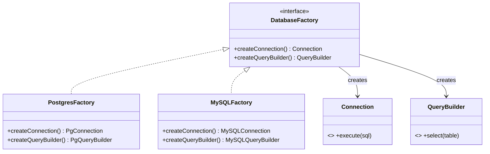

```table-of-contents
title: 
style: nestedList # TOC style (nestedList|nestedOrderedList|inlineFirstLevel)
minLevel: 0 # Include headings from the specified level
maxLevel: 0 # Include headings up to the specified level
include: 
exclude: 
includeLinks: true # Make headings clickable
hideWhenEmpty: false # Hide TOC if no headings are found
debugInConsole: false # Print debug info in Obsidian console
```
# Abstract Factory Pattern

**One-liner:** Provide an interface for creating families of related objects that must be used together, without specifying their concrete classes — the factory guarantees compatibility within a family.

---

## Why This Exists — The Problem Without It

You need to support both PostgreSQL and MySQL in the same codebase. Without a factory, every database access site independently decides which class to instantiate. Mix-ups are silent, compile-time invisible, and blow up at runtime.

```java
// BEFORE — scattered instantiation creates incompatible family mixing
public class UserRepository {

    public User findById(long id) {
        // Who decided this should be Postgres here?
        PostgresConnection conn = new PostgresConnection("jdbc:postgresql://...");

        // But downstream someone uses MySQL query syntax — runtime crash
        MySQLQueryBuilder qb = new MySQLQueryBuilder();  // WRONG FAMILY!
        String sql = qb.select("users").where("id", id).build();

        // Result mapper expects Postgres ResultSet semantics — undefined behavior
        PostgresResultMapper<User> mapper = new PostgresResultMapper<>();

        return mapper.map(conn.execute(sql));
        // This compiles. It will blow up at runtime with cryptic type errors.
    }
}

// BEFORE — switching from Postgres to MySQL is a grep-and-replace nightmare
// across 200 files, each with its own independent instantiation logic
public class OrderRepository {
    public Order findById(long id) {
        PostgresConnection conn = new PostgresConnection("jdbc:postgresql://...");
        PostgresQueryBuilder qb = new PostgresQueryBuilder();
        // ... 50 more lines of the same pattern
    }
}
```

Problems:
- No single place enforces "these three classes must be from the same family"
- A developer on the MySQL team accidentally writes `new PostgresConnection()` — code compiles, fails at runtime
- Switching databases requires modifying every repository, not one configuration class
- Testing with an in-memory database requires replacing every individual class

---

## Real-World Analogy

Think of IKEA furniture families. The KALLAX series has its own shelves, doors, inserts, and drawer units — all designed to fit together. The PAX series has its own wardrobe frames, hinges, and interior fittings. If you try to put a PAX door on a KALLAX frame, the hinges do not fit, the dimensions are wrong, and you end up with a wobbly mess. IKEA's catalog (the Abstract Factory) ensures that when you order within KALLAX, every component is guaranteed to work with every other KALLAX component. You pick the family once; the catalog handles compatibility.

---

## The Fix — Clean Implementation

```java
// ── Product interfaces — one per product type ──────────────────────────────
public interface DatabaseConnection {
    ResultSet execute(String sql, Object... params) throws SQLException;
    void beginTransaction() throws SQLException;
    void commit() throws SQLException;
    void rollback() throws SQLException;
    void close();
}

public interface QueryBuilder {
    QueryBuilder select(String... columns);
    QueryBuilder from(String table);
    QueryBuilder where(String column, Object value);
    QueryBuilder orderBy(String column, SortOrder order);
    QueryBuilder limit(int n);
    String build();  // Returns dialect-specific SQL
}

public interface ResultMapper<T> {
    T map(ResultSet rs) throws SQLException;
    List<T> mapAll(ResultSet rs) throws SQLException;
}

// ── Abstract Factory interface ─────────────────────────────────────────────
public interface DatabaseFactory {
    DatabaseConnection createConnection();
    QueryBuilder createQueryBuilder();
    <T> ResultMapper<T> createResultMapper(Class<T> targetClass);

    // Factory also knows metadata about itself
    String dialectName();
}

// ── Concrete Family A: PostgreSQL ──────────────────────────────────────────
public class PostgresDatabaseFactory implements DatabaseFactory {
    private final String jdbcUrl;
    private final String username;
    private final String password;

    public PostgresDatabaseFactory(String jdbcUrl, String username, String password) {
        this.jdbcUrl   = jdbcUrl;
        this.username  = username;
        this.password  = password;
    }

    @Override
    public DatabaseConnection createConnection() {
        return new PostgresConnection(jdbcUrl, username, password);
        // PostgresConnection handles pgBouncer, SSL, advisory locks
    }

    @Override
    public QueryBuilder createQueryBuilder() {
        return new PostgresQueryBuilder();
        // Uses RETURNING clause, ::cast syntax, ILIKE
    }

    @Override
    public <T> ResultMapper<T> createResultMapper(Class<T> targetClass) {
        return new PostgresResultMapper<>(targetClass);
        // Maps jsonb, uuid, timestamptz properly
    }

    @Override public String dialectName() { return "PostgreSQL"; }
}

// ── Concrete Family B: MySQL ───────────────────────────────────────────────
public class MySQLDatabaseFactory implements DatabaseFactory {
    private final String jdbcUrl;
    private final String username;
    private final String password;

    public MySQLDatabaseFactory(String jdbcUrl, String username, String password) {
        this.jdbcUrl   = jdbcUrl;
        this.username  = username;
        this.password  = password;
    }

    @Override
    public DatabaseConnection createConnection() {
        return new MySQLConnection(jdbcUrl, username, password);
        // MySQLConnection handles utf8mb4, connection pooling quirks
    }

    @Override
    public QueryBuilder createQueryBuilder() {
        return new MySQLQueryBuilder();
        // Uses LIMIT/OFFSET, backtick quoting, GROUP_CONCAT
    }

    @Override
    public <T> ResultMapper<T> createResultMapper(Class<T> targetClass) {
        return new MySQLResultMapper<>(targetClass);
        // Maps TINYINT(1) to boolean, handles DATETIME timezone quirks
    }

    @Override public String dialectName() { return "MySQL"; }
}

// ── Client — uses ONLY the abstract factory, never concrete classes ─────────
public class UserRepository {
    private final DatabaseFactory db;

    // Factory is injected — switch families by swapping the injection
    public UserRepository(DatabaseFactory db) {
        this.db = db;
    }

    public Optional<User> findById(long id) {
        // ALL three objects are from the SAME family — guaranteed by factory
        try (DatabaseConnection conn = db.createConnection()) {
            String sql = db.createQueryBuilder()
                    .select("id", "email", "created_at")
                    .from("users")
                    .where("id", id)
                    .limit(1)
                    .build();

            ResultSet rs = conn.execute(sql, id);
            ResultMapper<User> mapper = db.createResultMapper(User.class);
            List<User> results = mapper.mapAll(rs);
            return results.isEmpty() ? Optional.empty() : Optional.of(results.get(0));
        } catch (SQLException e) {
            throw new RepositoryException("Failed to find user by id: " + id, e);
        }
    }
}

// ── Factory selection at startup — one place, one decision ────────────────
public class DatabaseFactoryProvider {

    public static DatabaseFactory fromEnvironment() {
        String dialect = System.getenv("DB_DIALECT"); // "POSTGRES" or "MYSQL"
        String url     = System.getenv("DB_URL");
        String user    = System.getenv("DB_USER");
        String pass    = System.getenv("DB_PASSWORD");

        return switch (dialect.toUpperCase()) {
            case "POSTGRES" -> new PostgresDatabaseFactory(url, user, pass);
            case "MYSQL"    -> new MySQLDatabaseFactory(url, user, pass);
            case "H2"       -> new H2DatabaseFactory(url); // in-memory for tests
            default -> throw new IllegalStateException("Unknown dialect: " + dialect);
        };
    }
}

// ── In tests — swap entire family with H2 in-memory ───────────────────────
DatabaseFactory testFactory = new H2DatabaseFactory("jdbc:h2:mem:testdb");
UserRepository  repo        = new UserRepository(testFactory);
// All three products (Connection, QueryBuilder, Mapper) are H2 — compatible
```

---

## Class Diagram

```
<<interface>>                     <<interface>>
DatabaseFactory                   DatabaseConnection
+ createConnection()    --------> + execute(sql) : ResultSet
+ createQueryBuilder()            + beginTransaction()
+ createResultMapper(Class)       + commit() / rollback()
        ^
        |
  ______|___________________________
  |                                 |
PostgresDatabaseFactory       MySQLDatabaseFactory
  |                                 |
  +-- PostgresConnection            +-- MySQLConnection
  +-- PostgresQueryBuilder          +-- MySQLQueryBuilder
  +-- PostgresResultMapper          +-- MySQLResultMapper

<<interface>>
QueryBuilder
+ select() + from() + where()
+ build() : String

<<interface>>
ResultMapper<T>
+ map(ResultSet) : T
+ mapAll(ResultSet) : List<T>
```

---

## Real Systems Using This

| System | Abstract Factory Usage |
|---|---|
| **Java DocumentBuilderFactory** | `DocumentBuilderFactory.newInstance()` returns the right XML parser family (Xerces, JAXP); each factory produces a compatible `DocumentBuilder`, `SAXParser`, etc. |
| **Spring ApplicationContext** | `ClassPathXmlApplicationContext` vs `AnnotationConfigApplicationContext` — each is an Abstract Factory that produces compatible `Environment`, `BeanFactory`, `MessageSource` for that context type |
| **javax.persistence / JPA** | `Persistence.createEntityManagerFactory()` returns a factory that produces compatible `EntityManager`, `Query`, `Criteria` objects — all for the same JPA provider |
| **AWT Look & Feel** | `LookAndFeel` creates a family of UI components (buttons, scrollbars, borders) that are visually consistent; mixing metal buttons with Aqua scrollbars breaks the UI |
| **JDBC DataSource** | `HikariDataSource` (a factory) produces `Connection` objects tuned for HikariCP; `C3P0DataSource` produces C3P0 connections — swap the factory, swap the family |

---

## SDE-2/SDE-3 Interview Signals

| If interviewer says... | Think Abstract Factory because... |
|---|---|
| "Support both AWS S3 and Google Cloud Storage, same code" | BlobStoreClient + BlobUploader + BlobMetadata must all come from the same cloud family |
| "We need consistent theming — dark mode and light mode" | Each theme is a family: colors, fonts, icons must all match |
| "The app must work on both Android and iOS with the same business logic" | UI components are a family; AF hides platform-specific classes |
| "Adding a new database shouldn't require modifying repository code" | Repositories use AF; new DB = new factory implementation only |
| "Families of related objects" | Always Abstract Factory |

---

## When to Use
- You need families of related objects that must be used together, and mixing families would cause bugs or undefined behavior
- You want to enforce a constraint: "if you use this Connection, you must use this QueryBuilder and this ResultMapper"
- You need to switch between entire product families (environments, databases, platforms) at one configuration point
- The system must be independent of how its products are created and composed

## When NOT to Use
- You only have one product type — use Factory Method instead (simpler)
- The families only differ in one or two objects — add a factory method to the existing class instead of a full AF hierarchy
- Products within a "family" never actually interact — the compatibility guarantee is the whole point; without it, AF adds overhead for nothing
- You are adding new product types frequently — every new product type requires adding a method to the AbstractFactory interface AND all concrete factories (expensive change)

---

## Trade-offs & Alternatives

| Dimension | Trade-off |
|---|---|
| Family consistency | Guaranteed at compile time — you cannot accidentally mix families |
| Adding new families | Easy — implement the interface |
| Adding new product types | Expensive — change the interface, change ALL concrete factories |
| Complexity | Higher than Factory Method — justified only when families exist |

**Key distinction from Factory Method:**
- Factory Method: creates ONE product type, subclass decides which concrete class
- Abstract Factory: creates a FAMILY of product types, factory implementation decides all of them

**Simpler alternative:** If you only need to parameterize one object type, use Factory Method or a plain `Supplier<T>`. Abstract Factory earns its complexity only when you have 3+ related objects that must be from the same family.

---

## Common Interview Mistakes

1. **Confusing Abstract Factory with Factory Method.** FM creates one product. AF creates a family. If your "Abstract Factory" only has one `create()` method, it is a Factory Method with extra steps.

2. **Adding new product types to the interface mid-project.** Every addition to `DatabaseFactory` forces changes across `PostgresDatabaseFactory`, `MySQLDatabaseFactory`, `H2DatabaseFactory`, and every test double. Plan the family upfront.

3. **Not injecting the factory.** If you instantiate the factory with `new PostgresDatabaseFactory()` inside a repository, you have not solved the coupling problem — you moved it one level up.

4. **Making the factory stateful.** The factory itself should be stateless (or at most hold configuration). Mutable state in the factory breaks thread safety when it is shared as a singleton.

5. **Using Abstract Factory when families differ in only one class.** Four nearly-identical factories that differ in one method — just parameterize that one creation with a Factory Method argument.

---

## Mermaid Class Diagram



---

## 5 Detailed Examples — Why, How, Where, When

### Example 1: Database Provider Family (Postgres vs MySQL)

**WHY:** Connection, QueryBuilder, Migrator all differ by database. Using PostgresConnection with MySQLQueryBuilder = broken SQL. Must guarantee family consistency.

**HOW:** `DatabaseFactory` interface with `createConnection()`, `createQueryBuilder()`. One factory per DB vendor.

**WHERE:** Any ORM/framework supporting multiple databases. JDBC conceptually does this.

**WHEN:** Use when multiple product types must be used together from the same family.

### Example 2: UI Theme (Light vs Dark)

**WHY:** Light theme has LightButton, LightCheckbox, LightTextField. Mixing LightButton with DarkCheckbox looks broken.

**HOW:** `UIFactory` creates Button, Checkbox, TextField. `LightThemeFactory`, `DarkThemeFactory` each produce consistent families.

**WHERE:** Android theming, Swing PLAF, web design systems.

**WHEN:** Use when UI components must be consistent within a theme/variant.

### Example 3: Payment SDK (India vs US)

**WHY:** India payments need UPI + Rupee formatting + GST calculator. US payments need Card + Dollar formatting + Sales Tax. Mixing India UPI with US tax calculator = wrong.

**HOW:** `PaymentSDKFactory` → `IndiaPaymentFactory` creates IndiaPaymentProcessor, RupeeFormatter, GSTCalculator. `USPaymentFactory` creates USPaymentProcessor, DollarFormatter, SalesTaxCalculator.

**WHERE:** Stripe (region-specific payment methods), Razorpay, any multi-region fintech.

**WHEN:** Use when the same product suite differs by region/environment.

### Example 4: Cross-Platform Widgets (Windows vs Mac)

**WHY:** Windows buttons render differently from Mac buttons. The scrollbar, dialog, menu all must match the platform.

**HOW:** `GUIFactory` → `WindowsFactory`, `MacFactory`. Selected at startup based on OS.

**WHERE:** Java AWT peer factories, Qt, Electron.

**WHEN:** Use when platform determines the entire product family.

### Example 5: Test vs Production Dependencies

**WHY:** Tests need MockEmailService + InMemoryDB + FakePaymentGateway. Production needs RealEmailService + PostgresDB + StripeGateway. Must never mix test fakes with production reals.

**HOW:** `ServiceFactory` → `TestServiceFactory`, `ProductionServiceFactory`. Selected by Spring profile.

**WHERE:** Every Spring Boot app using `@Profile("test")` vs `@Profile("prod")`.

**WHEN:** Use when test/prod environments need completely different implementations of the same contracts.

---

## Executable Example 1 — Database Factory (Copy-Paste-Run)

```java
// File: AbstractFactoryDemo.java
// Run:  javac AbstractFactoryDemo.java && java AbstractFactoryDemo

public class AbstractFactoryDemo {

    interface Connection {
        void execute(String sql);
    }
    interface QueryBuilder {
        String buildSelect(String table, String where);
    }
    interface DatabaseFactory {
        Connection createConnection();
        QueryBuilder createQueryBuilder();
    }

    // Postgres family
    static class PgConnection implements Connection {
        public void execute(String sql) { System.out.println("  [POSTGRES] " + sql); }
    }
    static class PgQueryBuilder implements QueryBuilder {
        public String buildSelect(String table, String where) {
            return "SELECT * FROM " + table + " WHERE " + where + " LIMIT 100"; // Postgres syntax
        }
    }
    static class PostgresFactory implements DatabaseFactory {
        public Connection createConnection() { return new PgConnection(); }
        public QueryBuilder createQueryBuilder() { return new PgQueryBuilder(); }
    }

    // MySQL family
    static class MySQLConnection implements Connection {
        public void execute(String sql) { System.out.println("  [MYSQL] " + sql); }
    }
    static class MySQLQueryBuilder implements QueryBuilder {
        public String buildSelect(String table, String where) {
            return "SELECT * FROM " + table + " WHERE " + where + " LIMIT 100"; // MySQL syntax
        }
    }
    static class MySQLFactory implements DatabaseFactory {
        public Connection createConnection() { return new MySQLConnection(); }
        public QueryBuilder createQueryBuilder() { return new MySQLQueryBuilder(); }
    }

    // Client — uses ONLY abstract types
    static class UserRepository {
        private final Connection conn;
        private final QueryBuilder qb;

        UserRepository(DatabaseFactory factory) {
            this.conn = factory.createConnection();
            this.qb   = factory.createQueryBuilder();
        }

        void findActive() {
            String sql = qb.buildSelect("users", "active = true");
            conn.execute(sql);
        }
    }

    public static void main(String[] args) {
        System.out.println("=== Using Postgres ===");
        UserRepository pgRepo = new UserRepository(new PostgresFactory());
        pgRepo.findActive();

        System.out.println("\n=== Using MySQL ===");
        UserRepository mysqlRepo = new UserRepository(new MySQLFactory());
        mysqlRepo.findActive();
    }
}
```

**Expected output:**
```
=== Using Postgres ===
  [POSTGRES] SELECT * FROM users WHERE active = true LIMIT 100

=== Using MySQL ===
  [MYSQL] SELECT * FROM users WHERE active = true LIMIT 100
```

---

## Executable Example 2 — Theme Factory (Copy-Paste-Run)

```java
// File: AbstractFactoryThemeDemo.java
// Run:  javac AbstractFactoryThemeDemo.java && java AbstractFactoryThemeDemo

public class AbstractFactoryThemeDemo {

    interface Button { void render(); }
    interface Checkbox { void render(); }
    interface UIFactory { Button createButton(); Checkbox createCheckbox(); }

    static class LightButton implements Button {
        public void render() { System.out.println("  [LIGHT] Rendering white button with dark text"); }
    }
    static class LightCheckbox implements Checkbox {
        public void render() { System.out.println("  [LIGHT] Rendering white checkbox with gray border"); }
    }
    static class DarkButton implements Button {
        public void render() { System.out.println("  [DARK] Rendering dark button with white text"); }
    }
    static class DarkCheckbox implements Checkbox {
        public void render() { System.out.println("  [DARK] Rendering dark checkbox with light border"); }
    }

    static class LightThemeFactory implements UIFactory {
        public Button createButton() { return new LightButton(); }
        public Checkbox createCheckbox() { return new LightCheckbox(); }
    }
    static class DarkThemeFactory implements UIFactory {
        public Button createButton() { return new DarkButton(); }
        public Checkbox createCheckbox() { return new DarkCheckbox(); }
    }

    static class Application {
        private final Button button;
        private final Checkbox checkbox;
        Application(UIFactory factory) {
            this.button = factory.createButton();
            this.checkbox = factory.createCheckbox();
        }
        void render() { button.render(); checkbox.render(); }
    }

    public static void main(String[] args) {
        String theme = "dark"; // could come from config

        UIFactory factory = switch (theme) {
            case "dark" -> new DarkThemeFactory();
            default -> new LightThemeFactory();
        };

        System.out.println("=== Theme: " + theme + " ===");
        Application app = new Application(factory);
        app.render();
    }
}
```

**Expected output:**
```
=== Theme: dark ===
  [DARK] Rendering dark button with white text
  [DARK] Rendering dark checkbox with light border
```

---

## Anti-Pattern — What Happens Without Abstract Factory

```java
// Mixing products from different families — BROKEN
Connection conn = new PostgresConnection();
QueryBuilder qb = new MySQLQueryBuilder();  // WRONG FAMILY!
String sql = qb.buildSelect("users", "active=1"); // MySQL syntax
conn.execute(sql); // Postgres can't run MySQL-specific syntax → runtime error
```

---

## Refactoring Path

```
Step 1: Identify the FAMILIES (Postgres, MySQL, H2)
Step 2: Identify the PRODUCTS per family (Connection, QueryBuilder, Migrator)
Step 3: Create interface per product type
Step 4: Create AbstractFactory interface with one create() per product
Step 5: One ConcreteFactory per family
Step 6: Select factory ONCE at startup (config/env/profile)
Step 7: Inject factory everywhere — client code never sees concrete types
```

---

## Spring Boot Connection

```java
@Configuration
@Profile("postgres")
public class PostgresConfig implements DatabaseFactory {
    @Bean public Connection createConnection() { return new PgConnection(dataSource()); }
    @Bean public QueryBuilder createQueryBuilder() { return new PgQueryBuilder(); }
}

@Configuration
@Profile("mysql")
public class MySQLConfig implements DatabaseFactory {
    @Bean public Connection createConnection() { return new MySQLConnection(dataSource()); }
    @Bean public QueryBuilder createQueryBuilder() { return new MySQLQueryBuilder(); }
}
// Spring selects the right factory based on active profile — pure Abstract Factory
```

---

## Which LLD Problems Use This

- [[../../examples/lld_payment_system]] — Payment gateway families (UPI vs Card vs NetBanking)
- [[../../examples/lld_notification_system]] — Channel families per region

---

## Follow-up Questions Interviewers Ask

| Question | How to Answer |
|----------|--------------|
| "What if we add a new product to the family?" | Add method to AbstractFactory + all ConcreteFactories. This is the cost. |
| "Factory vs Abstract Factory?" | Factory = one product. AF = family of related products that must be consistent. |
| "How to select the factory at runtime?" | Config/env → factory map → `factories.get(env)`. Or Spring `@Profile`. |

---

## Interview Script — What to Say

> "I see multiple product types (Connection, QueryBuilder) that must come from the same family (Postgres or MySQL). Mixing them breaks things. I'll use Abstract Factory — one factory interface, one concrete factory per family, selected once at startup. Client code only sees abstract types."

---

## Thread-Safety Note

```
Factory creation: Select once at startup → no concurrency issue.
Factory sharing: Factories are typically stateless → safe to share.
Products: Thread-safety depends on the product (Connection needs pooling, QueryBuilder is usually stateless).
```

---

## Complexity Analysis

| Scenario | Without AF | With AF |
|----------|-----------|---------|
| Add new DB vendor | Scatter new() calls everywhere | 1 new ConcreteFactory |
| Guarantee family consistency | Manual discipline | Enforced by factory contract |
| Switch DB vendor | Modify every file | Change 1 config line |

---

## Combines Well With

| Pattern | Why they pair well |
|---|---|
| **Singleton** | ConcreteFactory is typically a singleton |
| **Factory Method** | AF internally delegates each `createX()` to a Factory Method |
| **Builder** | AF creates families; Builder handles complex construction of individual products |
| **Strategy** | AF selects which family of strategies to use |
| **Dependency Injection** | Spring DI acts as an AF via `@Profile` |

---

## Cheat Sheet

```
ABSTRACT FACTORY in 6 lines:
1. Identify the FAMILY — related objects that must be compatible (Connection, QueryBuilder, Mapper)
2. Define an interface per product type (DatabaseConnection, QueryBuilder, ResultMapper)
3. Define AbstractFactory interface with one createX() per product type
4. Implement one ConcreteFactory per family (PostgresFactory, MySQLFactory, H2Factory)
5. Clients depend ONLY on the abstract types — never on concrete classes
6. Select the family ONCE at startup via config/env; inject factory everywhere else
```

Key rule: **If you catch yourself writing `new PostgresXxx` in more than one place, you need an Abstract Factory.**
