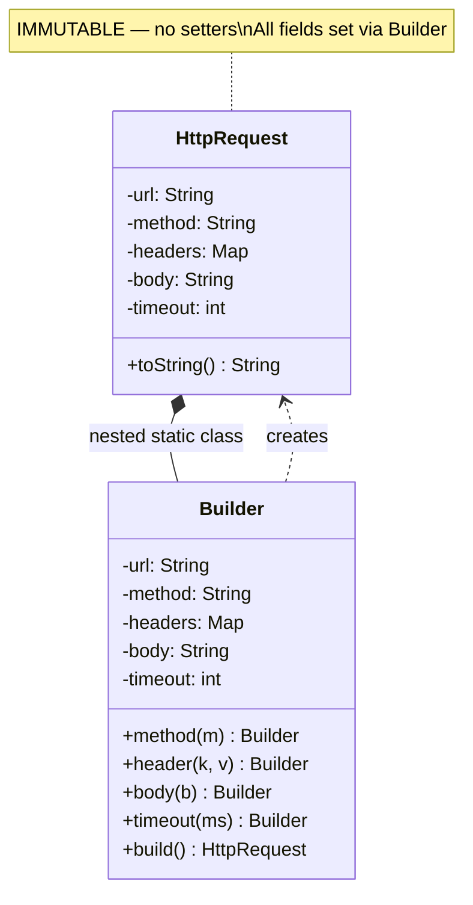

```table-of-contents
title: 
style: nestedList # TOC style (nestedList|nestedOrderedList|inlineFirstLevel)
minLevel: 0 # Include headings from the specified level
maxLevel: 0 # Include headings up to the specified level
include: 
exclude: 
includeLinks: true # Make headings clickable
hideWhenEmpty: false # Hide TOC if no headings are found
debugInConsole: false # Print debug info in Obsidian console
```
# Builder Pattern

**One-liner:** Separate the construction of a complex object from its representation — build it step-by-step via a fluent API, eliminating telescoping constructors and producing immutable products.

---

## Why This Exists — The Problem Without It

A production `HttpRequest` has 15 fields. The telescoping constructor pattern is unreadable, error-prone, and impossible to extend without breaking existing call sites.

```java
// BEFORE — Telescoping constructor hell

public class HttpRequest {
    // Which arg is which? No IDE hints once you're on the 8th parameter.
    public HttpRequest(String url, String method, Map<String, String> headers,
                       byte[] body, int connectTimeoutMs, int readTimeoutMs,
                       boolean followRedirects, int maxRedirects,
                       String proxyHost, int proxyPort,
                       boolean verifySSL, String clientCertPath,
                       RetryPolicy retryPolicy, Duration cacheTtl,
                       String correlationId) {
        // ... assignments
    }
}

// Caller — try to spot the bug
HttpRequest req = new HttpRequest(
    "https://api.stripe.com/v1/charges",
    "POST",
    headers,
    body,
    5000,           // connect timeout
    30000,          // read timeout
    true,           // followRedirects
    5,              // maxRedirects
    null,           // proxyHost
    0,              // proxyPort
    true,           // verifySSL
    null,           // clientCertPath
    RetryPolicy.exponential(3),
    null,           // cacheTtl — null ok?
    "req-abc-123"
);
// Transposing readTimeoutMs and connectTimeoutMs compiles perfectly.
// Your API calls hang for 5 seconds instead of failing fast. Good luck debugging.

// When you add a new field, you must update ALL call sites or add yet another overload.
// 15 parameters -> 2^15 possible constructors to cover optional combos. Unworkable.
```

Problems:
- No named arguments in Java — parameter order errors are silent
- Optional parameters require exponential constructor overloads
- Object is mutable during construction — no way to make it immutable
- Cannot validate invariants (e.g., "if proxy host set, proxy port must be set") in one place

---

## Mermaid Class Diagram



---

## Real-World Analogy

Think of building a Subway sandwich. You do not hand a cashier a 15-item slip and hope they get the order of ingredients right. You walk through the line: bread first, then protein, then cheese, then vegetables, then sauces, then extras. Each step is optional. Each step is named. You can skip the olives without affecting anything else. The employee (Director) can also run pre-set sequences: "Give me the Italian BMT" triggers a specific sequence of steps. The final sandwich is handed to you complete — you cannot add more ingredients once you leave the counter (immutability).

---

## The Fix — Clean Implementation

```java
// ── Immutable product ──────────────────────────────────────────────────────
public final class HttpRequest {
    private final String  url;
    private final String  method;
    private final Map<String, String> headers;
    private final byte[]  body;
    private final int     connectTimeoutMs;
    private final int     readTimeoutMs;
    private final boolean followRedirects;
    private final int     maxRedirects;
    private final String  proxyHost;
    private final int     proxyPort;
    private final boolean verifySSL;
    private final RetryPolicy retryPolicy;
    private final String  correlationId;

    // Private constructor — only Builder can instantiate
    private HttpRequest(Builder builder) {
        this.url              = builder.url;
        this.method           = builder.method;
        this.headers          = Collections.unmodifiableMap(new LinkedHashMap<>(builder.headers));
        this.body             = builder.body == null ? null : Arrays.copyOf(builder.body, builder.body.length);
        this.connectTimeoutMs = builder.connectTimeoutMs;
        this.readTimeoutMs    = builder.readTimeoutMs;
        this.followRedirects  = builder.followRedirects;
        this.maxRedirects     = builder.maxRedirects;
        this.proxyHost        = builder.proxyHost;
        this.proxyPort        = builder.proxyPort;
        this.verifySSL        = builder.verifySSL;
        this.retryPolicy      = builder.retryPolicy;
        this.correlationId    = builder.correlationId;
    }

    // Public getters only — no setters
    public String  url()              { return url; }
    public String  method()           { return method; }
    public Map<String, String> headers() { return headers; }
    public byte[]  body()             { return body == null ? null : Arrays.copyOf(body, body.length); }
    public int     connectTimeoutMs() { return connectTimeoutMs; }
    public int     readTimeoutMs()    { return readTimeoutMs; }
    public boolean followRedirects()  { return followRedirects; }
    public String  correlationId()    { return correlationId; }

    // ── Nested static Builder ──────────────────────────────────────────────
    public static final class Builder {
        // Required fields
        private final String url;
        private final String method;

        // Optional fields with sensible defaults
        private Map<String, String> headers          = new LinkedHashMap<>();
        private byte[]              body             = null;
        private int                 connectTimeoutMs = 3_000;
        private int                 readTimeoutMs    = 30_000;
        private boolean             followRedirects  = true;
        private int                 maxRedirects     = 5;
        private String              proxyHost        = null;
        private int                 proxyPort        = 0;
        private boolean             verifySSL        = true;
        private RetryPolicy         retryPolicy      = RetryPolicy.noRetry();
        private String              correlationId    = UUID.randomUUID().toString();

        // Only required fields in the constructor
        public Builder(String url, String method) {
            Objects.requireNonNull(url,    "url must not be null");
            Objects.requireNonNull(method, "method must not be null");
            this.url    = url;
            this.method = method;
        }

        public Builder header(String name, String value) {
            Objects.requireNonNull(name, "header name must not be null");
            this.headers.put(name, value);
            return this;
        }

        public Builder headers(Map<String, String> headers) {
            this.headers.putAll(headers);
            return this;
        }

        public Builder body(byte[] body) {
            this.body = body;
            return this;
        }

        public Builder jsonBody(String json) {
            this.body = json.getBytes(StandardCharsets.UTF_8);
            return this.header("Content-Type", "application/json");
        }

        public Builder connectTimeoutMs(int ms) {
            if (ms <= 0) throw new IllegalArgumentException("connectTimeoutMs must be > 0");
            this.connectTimeoutMs = ms;
            return this;
        }

        public Builder readTimeoutMs(int ms) {
            if (ms <= 0) throw new IllegalArgumentException("readTimeoutMs must be > 0");
            this.readTimeoutMs = ms;
            return this;
        }

        public Builder proxy(String host, int port) {
            Objects.requireNonNull(host, "proxy host must not be null");
            if (port <= 0 || port > 65535) throw new IllegalArgumentException("Invalid port: " + port);
            this.proxyHost = host;
            this.proxyPort = port;
            return this;
        }

        public Builder disableSSLVerification() {
            this.verifySSL = false;
            return this;
        }

        public Builder retryPolicy(RetryPolicy policy) {
            this.retryPolicy = Objects.requireNonNull(policy);
            return this;
        }

        public Builder correlationId(String id) {
            this.correlationId = Objects.requireNonNull(id);
            return this;
        }

        // Build validates cross-field invariants before producing the immutable object
        public HttpRequest build() {
            if (proxyHost != null && proxyPort == 0) {
                throw new IllegalStateException("proxyPort must be set when proxyHost is set");
            }
            if ("POST".equalsIgnoreCase(method) || "PUT".equalsIgnoreCase(method)) {
                if (body == null) {
                    throw new IllegalStateException(method + " requests must have a body");
                }
            }
            return new HttpRequest(this);
        }
    }
}

// ── Director — encapsulates common builder sequences ───────────────────────
// The Director knows HOW to assemble pre-configured templates.
// Callers don't repeat the same 10-step sequences across the codebase.
public final class HttpRequestDirector {
    private static final String CORRELATION_HEADER = "X-Correlation-ID";
    private static final String AUTH_HEADER        = "Authorization";

    private final String baseUrl;
    private final String authToken;

    public HttpRequestDirector(String baseUrl, String authToken) {
        this.baseUrl   = baseUrl;
        this.authToken = authToken;
    }

    // Pre-built template: authenticated GET with standard timeouts
    public HttpRequest buildAuthenticatedGet(String path, String correlationId) {
        return new HttpRequest.Builder(baseUrl + path, "GET")
                .header(AUTH_HEADER, "Bearer " + authToken)
                .header(CORRELATION_HEADER, correlationId)
                .connectTimeoutMs(2_000)
                .readTimeoutMs(10_000)
                .followRedirects(false)  // internal API — no redirects expected
                .retryPolicy(RetryPolicy.exponential(3, Duration.ofMillis(200)))
                .build();
    }

    // Pre-built template: authenticated POST with JSON and retry
    public HttpRequest buildAuthenticatedPost(String path, String jsonBody, String correlationId) {
        return new HttpRequest.Builder(baseUrl + path, "POST")
                .header(AUTH_HEADER, "Bearer " + authToken)
                .header(CORRELATION_HEADER, correlationId)
                .jsonBody(jsonBody)                              // sets Content-Type too
                .connectTimeoutMs(2_000)
                .readTimeoutMs(30_000)
                .retryPolicy(RetryPolicy.exponential(2, Duration.ofMillis(500)))
                .build();
    }

    // Idempotent webhook delivery — no retry (caller handles it)
    public HttpRequest buildWebhookDelivery(String webhookUrl, byte[] payload, String secret) {
        String signature = HmacSha256.sign(payload, secret);
        return new HttpRequest.Builder(webhookUrl, "POST")
                .body(payload)
                .header("Content-Type", "application/json")
                .header("X-Webhook-Signature", signature)
                .connectTimeoutMs(5_000)
                .readTimeoutMs(15_000)
                .retryPolicy(RetryPolicy.noRetry())
                .build();
    }
}

// ── Usage ──────────────────────────────────────────────────────────────────
HttpRequestDirector director = new HttpRequestDirector(
        "https://api.stripe.com", System.getenv("STRIPE_API_KEY"));

HttpRequest chargeRequest = director.buildAuthenticatedPost(
        "/v1/charges", chargeJson, requestId);

// Or build one-offs directly — named, readable, self-documenting
HttpRequest customRequest = new HttpRequest.Builder("https://internal.svc/health", "GET")
        .connectTimeoutMs(500)
        .readTimeoutMs(1_000)
        .retryPolicy(RetryPolicy.noRetry())
        .build();
```

---

## Class Diagram

```
HttpRequest  (immutable product)
- url, method, headers, body
- connectTimeoutMs, readTimeoutMs
- followRedirects, proxyHost/Port
- verifySSL, retryPolicy, correlationId
+ getters only (no setters)
        ^
        | builds
        |
HttpRequest.Builder  (mutable, fluent)
- same fields with defaults
+ Builder(url, method)      [required]
+ header(name, value)       -> Builder
+ jsonBody(json)            -> Builder
+ connectTimeoutMs(ms)      -> Builder
+ proxy(host, port)         -> Builder
+ retryPolicy(policy)       -> Builder
+ build()                   -> HttpRequest  [validates invariants]

HttpRequestDirector
- baseUrl, authToken
+ buildAuthenticatedGet(path, corrId)     -> HttpRequest
+ buildAuthenticatedPost(path, body, id)  -> HttpRequest
+ buildWebhookDelivery(url, payload, sig) -> HttpRequest
```

---

## Real Systems Using This

| System | Builder Usage |
|---|---|
| **Java StringBuilder** | Classic builder for String — append step by step, call toString() once at the end |
| **Lombok @Builder** | Code-generates the inner Builder class; Spring Boot DTOs and request objects use it heavily |
| **Spring UriComponentsBuilder** | `UriComponentsBuilder.fromHttpUrl(base).path("/v1").queryParam("id", id).build().toUriString()` |
| **OkHttp Request.Builder** | Production HTTP client used by Square's backend; identical pattern to the example above |
| **Hibernate Criteria API** | `CriteriaBuilder` produces type-safe, composable query objects without raw SQL strings |
| **Protocol Buffers** | Every generated protobuf class exposes `toBuilder()` — clone, mutate one field, rebuild — without touching other fields |

---

## SDE-2/SDE-3 Interview Signals

| If interviewer says... | Think Builder because... |
|---|---|
| "This constructor has 12 parameters and it's getting unwieldy" | Builder gives each param a name; eliminates positional errors |
| "We need the object to be immutable after creation" | Builder constructs it, product has no setters |
| "The object has many optional fields with defaults" | Builder sets sensible defaults; caller sets only what they need |
| "We want to validate cross-field constraints before the object is used" | `build()` is the single point to enforce invariants |
| "Different teams create different pre-configured versions of the same object" | Director encapsulates each team's "recipe" |

---

## When to Use
- Object construction requires more than 4-5 parameters, especially when most are optional
- You need to enforce that the object is immutable once created (no setters on the product)
- Cross-field validation is required (e.g., proxy host implies proxy port; POST implies body)
- Multiple "standard configurations" of the same object exist — use a Director to name and centralize them

## When NOT to Use
- The object has 1-2 fields — a simple constructor or static factory is cleaner
- The object is genuinely mutable by design (a running stateful entity) — Builder solves the wrong problem
- Your team uses Lombok — `@Builder` generates it for free; no need to hand-write inner Builder classes for simple DTOs
- The "builder" only ever builds one thing — it is not actually providing flexibility, just ceremony

---

## Trade-offs & Alternatives

| Dimension | Trade-off |
|---|---|
| Readability | Dramatically improved for call sites — named, fluent |
| Verbosity | Builder class can be 2x the size of the product class |
| Immutability | Enables it — the product class has no setters |
| Validation | Centralized in `build()` — single place to catch bad state |
| Lombok | Removes boilerplate but hides the Builder class; less control over validation |

**Simpler alternative:** For objects with 3-4 mandatory fields and no optionals, a static factory method (`HttpRequest.get(url)`) is sufficient. Use the full Builder only when optional fields and defaults genuinely matter.

**Named parameters alternative:** Record classes in Java 16+ with compact constructors give you immutability and explicit field names at construction but do not support fluent chaining or defaults — still reach for Builder when defaults and chaining matter.

---

## Common Interview Mistakes

1. **Making the product mutable AND the builder mutable.** The entire point is that `build()` produces an immutable snapshot. If `HttpRequest` has setters, Builder added ceremony with no benefit.

2. **Forgetting to copy mutable fields in the constructor.** If `body` is a `byte[]`, copy it defensively in `new HttpRequest(builder)`. Otherwise the caller can mutate the "immutable" object via the original array reference.

3. **Putting business logic in Builder methods instead of `build()`.** `header()` should store the value, not validate it against a remote allowlist. Validation belongs in `build()` for cross-field checks; individual field validation (null check, range) is acceptable inline.

4. **Not implementing the Director when common recipes exist.** At SDE-2/SDE-3 level, showing only the raw Builder without the Director loses significant design points. Every production codebase has 3-4 canonical configurations that should be named and centralized.

5. **Returning `void` from builder methods instead of `this`.** Common mistake when writing Builder by hand — breaks the fluent chain.

---

## Executable Example (Copy-Paste-Run)

```java
// File: BuilderDemo.java
// Run:  javac BuilderDemo.java && java BuilderDemo

import java.util.*;

public class BuilderDemo {

    static class HttpRequest {
        private final String url;
        private final String method;
        private final Map<String, String> headers;
        private final String body;
        private final int timeoutMs;

        private HttpRequest(Builder b) {
            this.url = b.url; this.method = b.method;
            this.headers = Map.copyOf(b.headers);
            this.body = b.body; this.timeoutMs = b.timeoutMs;
        }

        public String toString() {
            return String.format("%s %s\n  Headers: %s\n  Body: %s\n  Timeout: %dms",
                method, url, headers, body, timeoutMs);
        }

        static class Builder {
            private final String url;
            private String method = "GET";
            private final Map<String, String> headers = new LinkedHashMap<>();
            private String body;
            private int timeoutMs = 30000;

            Builder(String url) { this.url = url; }
            Builder method(String m) { this.method = m; return this; }
            Builder header(String k, String v) { headers.put(k, v); return this; }
            Builder body(String b) { this.body = b; return this; }
            Builder timeout(int ms) { this.timeoutMs = ms; return this; }

            HttpRequest build() {
                if (url == null || url.isBlank()) throw new IllegalArgumentException("URL required");
                if ("GET".equals(method) && body != null) throw new IllegalArgumentException("GET cannot have body");
                return new HttpRequest(this);
            }
        }
    }

    public static void main(String[] args) {
        HttpRequest get = new HttpRequest.Builder("https://api.example.com/users")
            .header("Accept", "application/json")
            .timeout(5000)
            .build();
        System.out.println("=== GET Request ===");
        System.out.println(get);
        // GET https://api.example.com/users
        //   Headers: {Accept=application/json}
        //   Body: null
        //   Timeout: 5000ms

        HttpRequest post = new HttpRequest.Builder("https://api.example.com/orders")
            .method("POST")
            .header("Authorization", "Bearer token123")
            .header("Content-Type", "application/json")
            .body("{\"item\":\"book\",\"qty\":2}")
            .timeout(10000)
            .build();
        System.out.println("\n=== POST Request ===");
        System.out.println(post);
    }
}
```

---

## Interview Script — What to Say

> "This object has many optional fields. Instead of a constructor with 10 params, I'll use Builder — a nested static class with fluent setters. `build()` validates all invariants and returns an immutable product. Required fields go in the Builder constructor, optional ones get fluent methods."

---

## Combines Well With

| Pattern | Why they pair well |
|---|---|
| **Factory Method** | Factory decides WHICH builder to use |
| **Prototype** | `proto.toBuilder()` — clone into builder, modify, rebuild |
| **Composite** | Building complex tree structures with nested builders |
| **Strategy** | Builder configures which Strategy the product uses |
| **Template Method** | Director's methods are Template Methods defining build sequence |

---

## Cheat Sheet

```
BUILDER in 6 lines:
1. Product has ONLY private fields + getters — no public constructor, no setters
2. Nested static Builder mirrors product fields with sensible defaults
3. Required fields go in Builder constructor; optional fields get fluent setter methods
4. build() is the one place to validate cross-field invariants, then call new Product(this)
5. Defensively copy mutable fields (byte[], List, Map) in the Product constructor
6. Director encapsulates common builder sequences — named templates, not magic strings
```

Key rule: **Builder builds IMMUTABLE objects. If the product has setters, you have a builder-shaped mutable object — which is just a worse plain constructor.**

---
---

# ChatGPT

# Builder Design Pattern (Java)  
  
## Definition  
> The **Builder Pattern** is a creational design pattern used to **construct complex objects step by step**.  
  
It separates **object construction** from **object representation**.  
  
In simple terms:  

Builder = Step-by-step object creation

  
This is especially useful when an object has **many optional parameters**.  
  
---  
  
# Problem Without Builder  
  
Suppose we want to create a `User` object.  
  
```java  
class User {  
    String name;  
    int age;  
    String email;  
    String phone;  
    String address;  
}
```

If we use constructors:

User u = new User("John", 25, "john@gmail.com", "99999", "NY");

Problems:

1. Hard to remember parameter order
    
2. Many optional parameters
    
3. Too many constructors needed
    

Example:

User(name)  
User(name, age)  
User(name, age, email)  
User(name, age, email, phone)

This is called **constructor explosion**.

---

# Solution: Builder Pattern

We build the object **step by step**.

User user = new UserBuilder()  
                .setName("John")  
                .setAge(25)  
                .setEmail("john@gmail.com")  
                .build();

Much clearer.

---

# Structure

Product  
Builder  
ConcreteBuilder  
Director (optional)  
Client

Most modern Java code **skips the Director**.

---

# Example — User Object

## Step 1 — Product Class

class User {  
  
    private String name;  
    private int age;  
    private String email;  
    private String phone;  
  
    private User(UserBuilder builder) {  
        this.name = builder.name;  
        this.age = builder.age;  
        this.email = builder.email;  
        this.phone = builder.phone;  
    }  
  
    public void show() {  
        System.out.println(name + " " + age + " " + email + " " + phone);  
    }

---

# Step 2 — Builder Class

    public static class UserBuilder {  
  
        private String name;  
        private int age;  
        private String email;  
        private String phone;  
  
        public UserBuilder setName(String name) {  
            this.name = name;  
            return this;  
        }  
  
        public UserBuilder setAge(int age) {  
            this.age = age;  
            return this;  
        }  
  
        public UserBuilder setEmail(String email) {  
            this.email = email;  
            return this;  
        }  
  
        public UserBuilder setPhone(String phone) {  
            this.phone = phone;  
            return this;  
        }  
  
        public User build() {  
            return new User(this);  
        }  
    }  
}

Notice:

return this;

This allows **method chaining**.

---

# Step 3 — Client Code

public class Main {  
  
    public static void main(String[] args) {  
  
        User user = new User.UserBuilder()  
                        .setName("John")  
                        .setAge(25)  
                        .setEmail("john@gmail.com")  
                        .setPhone("99999")  
                        .build();  
  
        user.show();  
    }  
}

---

# Output

John 25 john@gmail.com 99999

---

# Execution Flow

Client  
  |  
  v  
UserBuilder  
  |  
  | setName()  
  | setAge()  
  | setEmail()  
  |  
  v  
build()  
  |  
  v  
User object created

---

# Visual Structure

Client  
   |  
   v  
Builder  
   |  
   v  
Product

---

# Real-World Example

Building a **Computer**

ComputerBuilder  
   |  
   +---- CPU  
   +---- RAM  
   +---- Storage  
   +---- GPU

Example:

Computer pc = new ComputerBuilder()  
                .setCPU("Intel i7")  
                .setRAM("16GB")  
                .setStorage("1TB")  
                .build();

---

# Why Builder Pattern Is Useful

Without builder:

new Computer("i7", "16GB", "1TB", "RTX3080", true, true, false)

Hard to read.

With builder:

new ComputerBuilder()  
     .setCPU("i7")  
     .setRAM("16GB")  
     .build();

Very readable.

---

# Advantages

- Handles complex object creation
    
- Avoids constructor explosion
    
- Improves readability
    
- Supports immutable objects
    

---

# Disadvantages

- More classes needed
    
- Slightly more code
    

---

# Real Java Examples

Builder pattern is used in:

- `StringBuilder`
    
- `HttpRequest.Builder` (Java 11)
    
- `Lombok @Builder`
    
- `Stream.Builder`
    

Example:

HttpRequest request = HttpRequest.newBuilder()  
        .uri(new URI("https://example.com"))  
        .GET()  
        .build();

---

# Builder vs Factory

|Pattern|Purpose|
|---|---|
|Factory|Creates objects|
|Builder|Creates complex objects step-by-step|

---

# Simple Way to Remember

Factory → One-step object creation  
Builder → Step-by-step object creation

---

# One-Line Interview Answer

The **Builder Pattern** constructs complex objects step by step while separating object construction from its representation.