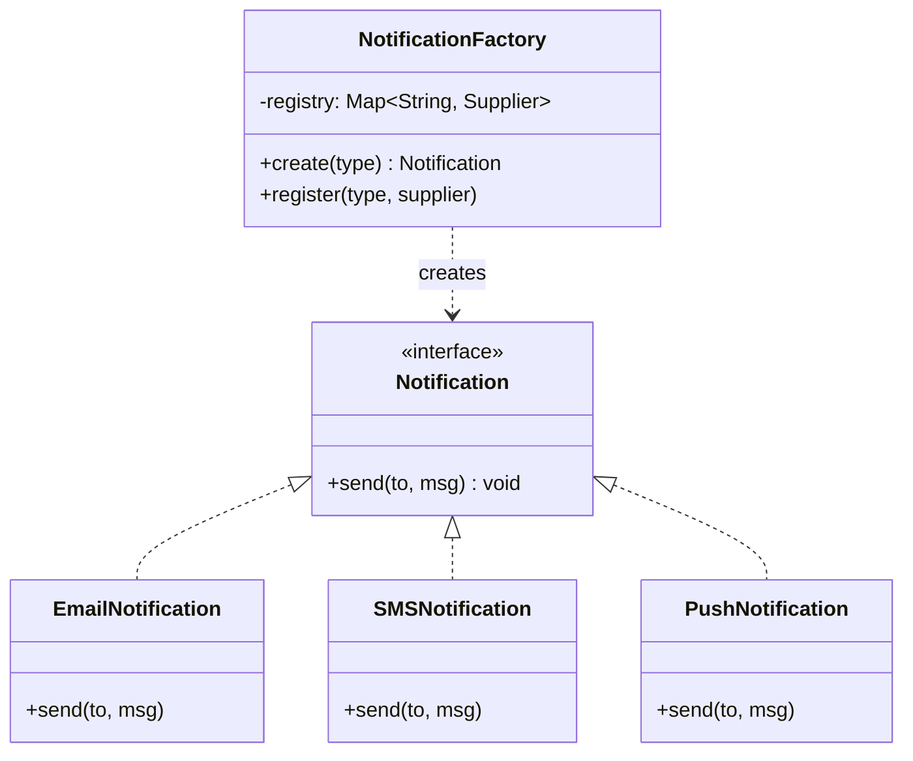
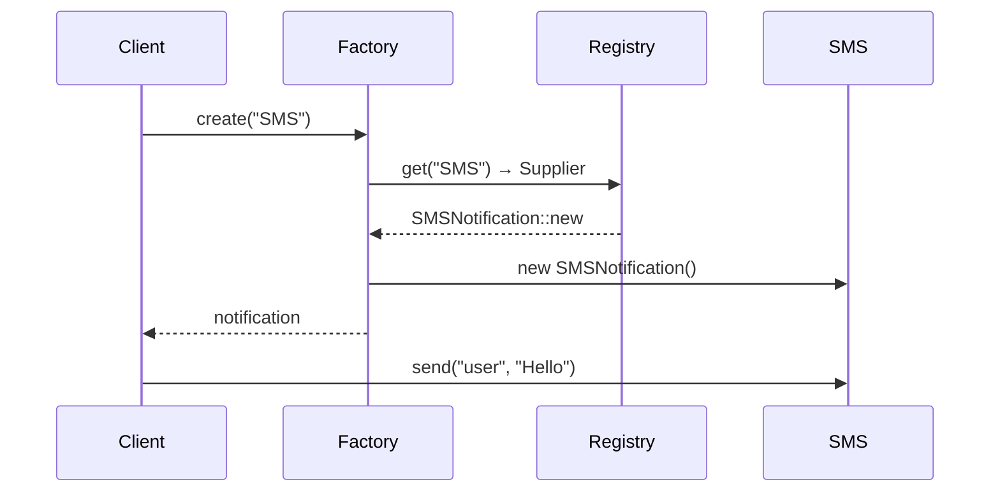

```table-of-contents
title: 
style: nestedList # TOC style (nestedList|nestedOrderedList|inlineFirstLevel)
minLevel: 0 # Include headings from the specified level
maxLevel: 0 # Include headings up to the specified level
include: 
exclude: 
includeLinks: true # Make headings clickable
hideWhenEmpty: false # Hide TOC if no headings are found
debugInConsole: false # Print debug info in Obsidian console
```

# Factory Method Pattern

**One-liner:** Define an interface for creating an object, but let subclasses (or a registry) decide which class to instantiate — callers never touch `new` directly.

---

## Why This Exists — The Problem Without It

Every new notification channel requires modifying the same dispatcher class. The `if/else` grows forever, every change risks breaking existing channels, and unit testing requires instantiating all branches.

```java
// BEFORE — NotificationDispatcher is a ticking time bomb
public class NotificationDispatcher {

    public void send(String type, String message, String recipient) {
        if ("EMAIL".equals(type)) {
            // direct instantiation — caller knows the concrete class
            EmailNotification email = new EmailNotification();
            email.setSmtpHost("smtp.company.com");
            email.setFrom("no-reply@company.com");
            email.send(recipient, message);

        } else if ("SMS".equals(type)) {
            SmsNotification sms = new SmsNotification();
            sms.setTwilioAccountSid(System.getenv("TWILIO_SID"));
            sms.setTwilioAuthToken(System.getenv("TWILIO_TOKEN"));
            sms.send(recipient, message);

        } else if ("PUSH".equals(type)) {
            PushNotification push = new PushNotification();
            push.setFcmServerKey(System.getenv("FCM_KEY"));
            push.send(recipient, message);

        } else if ("SLACK".equals(type)) {
            SlackNotification slack = new SlackNotification();
            slack.setWebhookUrl(System.getenv("SLACK_WEBHOOK"));
            slack.send(recipient, message);

        } else {
            throw new IllegalArgumentException("Unknown type: " + type);
        }
        // Adding WhatsApp? Modify THIS class. Again. And write tests for ALL branches.
    }
}
```

Problems:
- Violates Open/Closed Principle — every new channel requires modifying this class
- Violates Single Responsibility — dispatcher both selects AND configures objects
- No way to test one channel without dragging in all others
- String literals scattered everywhere — typo = runtime crash

---

## Mermaid Class Diagram





---

## Real-World Analogy

Think of a car dealership order desk. You walk in and say "I want a Sedan". You do not go to the factory floor, gather steel sheets, bolt engines, or paint the chassis. The order desk (factory) takes your request and delegates to the correct assembly line. Six months later, the manufacturer adds an electric variant — you still say "I want an EV Sedan" to the same desk; you never changed how you place orders. The factory absorbs the change.

---

## The Fix — Clean Implementation

```java
// ── Product interface ──────────────────────────────────────────────────────
public interface Notification {
    void send(String recipient, String message);
    String channelName();
}

// ── Concrete products ──────────────────────────────────────────────────────
public class EmailNotification implements Notification {
    private final String smtpHost;
    private final String fromAddress;

    public EmailNotification(String smtpHost, String fromAddress) {
        this.smtpHost = smtpHost;
        this.fromAddress = fromAddress;
    }

    @Override
    public void send(String recipient, String message) {
        // Real SMTP logic here
        System.out.printf("[EMAIL] %s -> %s via %s%n", fromAddress, recipient, smtpHost);
    }

    @Override public String channelName() { return "EMAIL"; }
}

public class SmsNotification implements Notification {
    private final String accountSid;
    private final String authToken;

    public SmsNotification(String accountSid, String authToken) {
        this.accountSid = accountSid;
        this.authToken  = authToken;
    }

    @Override
    public void send(String recipient, String message) {
        System.out.printf("[SMS] Twilio -> %s%n", recipient);
    }

    @Override public String channelName() { return "SMS"; }
}

// ── Factory with self-registering registry ─────────────────────────────────
// Supplier<Notification> defers instantiation; factories are cheap to register.
public final class NotificationFactory {

    // Map from channel name to a Supplier that produces a configured instance
    private final Map<String, Supplier<Notification>> registry = new ConcurrentHashMap<>();

    // Default production factory — reads config once at startup
    public static NotificationFactory production() {
        NotificationFactory factory = new NotificationFactory();

        factory.register("EMAIL", () -> new EmailNotification(
                System.getenv("SMTP_HOST"),
                System.getenv("SMTP_FROM")));

        factory.register("SMS", () -> new SmsNotification(
                System.getenv("TWILIO_SID"),
                System.getenv("TWILIO_TOKEN")));

        factory.register("PUSH", () -> new PushNotification(
                System.getenv("FCM_KEY")));

        return factory;
    }

    // Open for extension: any module can register its own channel
    public void register(String type, Supplier<Notification> supplier) {
        Objects.requireNonNull(type, "type must not be null");
        Objects.requireNonNull(supplier, "supplier must not be null");
        registry.put(type.toUpperCase(), supplier);
    }

    public Notification create(String type) {
        Supplier<Notification> supplier = registry.get(type.toUpperCase());
        if (supplier == null) {
            throw new UnsupportedOperationException(
                    "No notification channel registered for type: " + type +
                    ". Known types: " + registry.keySet());
        }
        return supplier.get(); // each call returns a new, fresh instance
    }

    public boolean supports(String type) {
        return registry.containsKey(type.toUpperCase());
    }
}

// ── Dispatcher — knows nothing about concrete classes ──────────────────────
public class NotificationDispatcher {
    private final NotificationFactory factory;

    public NotificationDispatcher(NotificationFactory factory) {
        this.factory = factory;  // injected — testable
    }

    public void send(String type, String recipient, String message) {
        Notification notification = factory.create(type);
        notification.send(recipient, message);
    }
}

// ── Extending without touching existing code ───────────────────────────────
// WhatsApp team adds their channel independently:
NotificationFactory factory = NotificationFactory.production();
factory.register("WHATSAPP", () -> new WhatsAppNotification(System.getenv("WA_API_KEY")));

// In tests — swap real implementation with a stub:
factory.register("EMAIL", () -> new StubNotification("EMAIL"));
```

---

## Class Diagram

```
<<interface>>
Notification
+ send(recipient, message) : void
+ channelName() : String
       ^
       |
  _____|_____________________________________
  |                   |                     |
EmailNotification  SmsNotification    PushNotification

NotificationFactory
- registry : Map<String, Supplier<Notification>>
+ production() : NotificationFactory  [static]
+ register(type, supplier) : void
+ create(type) : Notification
+ supports(type) : boolean

NotificationDispatcher
- factory : NotificationFactory
+ send(type, recipient, message) : void
```

---

## Real Systems Using This

| System | Factory Method Usage |
|---|---|
| **Spring Framework** | `BeanFactory.getBean(name)` — Spring resolves the concrete bean by name; caller never calls `new` |
| **JDBC** | `DriverManager.getConnection(url)` — parses the JDBC URL prefix and delegates to the registered `Driver` |
| **Logback / SLF4J** | `LoggerFactory.getLogger(Class)` — returns the correct logger implementation (Logback, Log4j2, JUL) without caller knowing |
| **Jackson** | `ObjectMapper` uses `JsonFactory.createParser()` internally; swapping from JSON to CBOR requires only changing the factory |
| **Stripe SDK** | `StripeClient` factory creates `PaymentIntent`, `Customer`, `Subscription` objects, each backed by API resource factories |

---

## SDE-2/SDE-3 Interview Signals

| If interviewer says... | Think Factory Method because... |
|---|---|
| "We need to support multiple payment gateways — Stripe, Razorpay, PayPal" | Each gateway is a product; factory selects the right one by config/region |
| "Adding a new export format (CSV, XML, PDF) shouldn't touch existing code" | Each format is a product; factory maps format string to exporter |
| "How do you make object creation testable?" | Inject the factory; in tests, register stubs — no need to mock static `new` |
| "We might add new notification channels in the future" | Registry-based factory lets new channels self-register without modifying dispatcher |
| "The construction logic is getting complex and coupled" | Factory encapsulates that complexity; dispatcher stays clean |

---

## When to Use
- You have multiple concrete types behind a common interface and the correct type is determined at runtime (from config, DB, user input)
- Adding new variants must not require modifying existing production code (OCP)
- You want to isolate object creation so that tests can inject stubs without rewiring the whole system
- Object creation involves non-trivial setup (reading env vars, connecting to a service) that belongs in one place

## When NOT to Use
- You only ever have one concrete implementation — a factory adds indirection for no gain
- The object hierarchy is stable and never extends — a simple constructor call is cleaner
- You find yourself passing the "type" string through 4 layers just to reach the factory — the design needs rethinking, not more factories
- The factory itself becomes a god-object with 500 lines of configuration — split into multiple focused factories

---

## Trade-offs & Alternatives

| Dimension | Trade-off |
|---|---|
| Flexibility | High — new types added without touching callers |
| Indirection | One extra layer — `factory.create("X")` instead of `new X()` |
| Discoverability | Harder to see what types exist; mitigate with `listSupportedTypes()` |
| Compile-time safety | String-based keys lose it; mitigate with an enum registry key |

**Simpler alternative:** If you have exactly 2–3 concrete types that never change, a static factory method on the interface (`Notification.of(type)`) is sufficient and avoids the registry overhead. Use the full registry only when types must be extensible at runtime or by third parties.

---

## Common Interview Mistakes

1. **Putting configuration logic inside the factory.** The factory should ONLY call `new ConcreteType(deps)`. Reading env vars, wiring dependencies, setting timeouts — that belongs in the caller or DI container that sets up the factory.

2. **Making the factory a static class.** Static factories cannot be injected or replaced in tests. Always design factories as injectable instances.

3. **Confusing Factory Method with Abstract Factory.** Factory Method produces ONE product type. If you need a family of related objects (Connection + QueryBuilder + ResultMapper all for the same DB), that is Abstract Factory.

4. **Using instanceof checks in the factory.** If you write `if (notification instanceof EmailNotification)` anywhere outside the factory, you have leaked the concrete type — the pattern failed.

5. **Not handling the "unknown type" case gracefully.** Returning `null` is a trap. Throw an `UnsupportedOperationException` with the list of supported types — saves hours of debugging.

---

## Executable Example (Copy-Paste-Run)

```java
// File: FactoryDemo.java
// Run:  javac FactoryDemo.java && java FactoryDemo

import java.util.*;
import java.util.function.Supplier;

public class FactoryDemo {

    interface Notification { void send(String to, String msg); }

    static class EmailNotification implements Notification {
        public void send(String to, String msg) {
            System.out.printf("  [EMAIL] To: %s | %s%n", to, msg);
        }
    }

    static class SMSNotification implements Notification {
        public void send(String to, String msg) {
            System.out.printf("  [SMS] To: %s | %s%n", to, msg);
        }
    }

    static class PushNotification implements Notification {
        public void send(String to, String msg) {
            System.out.printf("  [PUSH] To: %s | %s%n", to, msg);
        }
    }

    static class NotificationFactory {
        private static final Map<String, Supplier<Notification>> registry = new HashMap<>();
        static {
            registry.put("EMAIL", EmailNotification::new);
            registry.put("SMS", SMSNotification::new);
            registry.put("PUSH", PushNotification::new);
        }
        static void register(String type, Supplier<Notification> s) { registry.put(type, s); }
        static Notification create(String type) {
            Supplier<Notification> s = registry.get(type);
            if (s == null) throw new IllegalArgumentException("Unknown: " + type);
            return s.get();
        }
    }

    public static void main(String[] args) {
        String[] types = {"EMAIL", "SMS", "PUSH"};
        for (String type : types) {
            Notification n = NotificationFactory.create(type);
            n.send("user@test.com", "Order confirmed!");
        }
        // Output:
        //   [EMAIL] To: user@test.com | Order confirmed!
        //   [SMS] To: user@test.com | Order confirmed!
        //   [PUSH] To: user@test.com | Order confirmed!

        // Add new type at runtime — ZERO changes to factory
        NotificationFactory.register("WHATSAPP", () -> (to, msg) ->
            System.out.printf("  [WHATSAPP] To: %s | %s%n", to, msg));
        NotificationFactory.create("WHATSAPP").send("+91-999", "Hi from WhatsApp!");
    }
}
```

---

## Interview Script — What to Say

> "I see object creation depends on a runtime parameter (type, config, request). I'll use Factory Method with a registry map. The factory holds `Map<String, Supplier<Product>>` — new types are registered without modifying the factory class. This gives us OCP for object creation."

---

## Complexity Analysis

| Scenario | Without Factory | With Factory |
|----------|----------------|-------------|
| Add new type | Add if/else branch in creation code | Register 1 new Supplier |
| Change creation logic | Modify scattered `new` calls | Modify factory only |
| Test creation | Hardcoded `new` can't be mocked | Inject mock factory |

---

## Combines Well With

| Pattern | Why they pair well |
|---|---|
| **Strategy** | Factory creates the right Strategy at runtime |
| **Abstract Factory** | Abstract Factory uses Factory Methods internally |
| **Registry / Service Locator** | `Map<String, Supplier<T>>` is the idiomatic Java registry |
| **Dependency Injection** | Spring's `@Bean` methods are factory methods |
| **Command** | Factory creates the right Command from request type |

---

## Cheat Sheet

```
FACTORY METHOD in 6 lines:
1. Define Product interface (what all variants share)
2. Implement each ConcreteProduct (Email, SMS, Push)
3. Build a registry: Map<String, Supplier<Product>>
4. register(type, supplier) at startup — from config or DI
5. create(type) fetches supplier and calls get() — no if/else
6. Inject factory, never factory.create() from static context
```

Key rule: **Factory creates, never configures. Configuration lives outside the factory.**


# ChatGPT

# "Tests Can Inject Stubs" — Meaning

## Definition
> **Injecting stubs** means replacing a real dependency with a **fake implementation** during testing so the test can control the behavior.

A **stub** is a simple object that returns **predefined values** instead of doing real work (like calling a database or API).

---

# Why This Is Done

In unit tests we want to avoid:

- Real **databases**
- Real **APIs**
- Real **file systems**
- Slow or unpredictable dependencies

So we **inject a stub** that returns controlled test data.

---

# Example

## Real Dependency

```java
class Database {
    public String getUser() {
        return "User from real database";
    }
}
