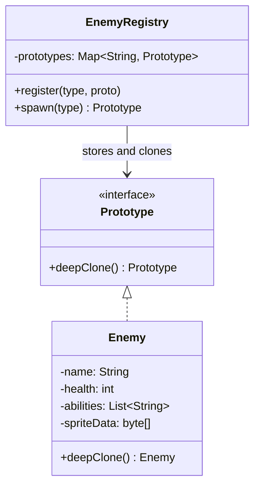

# Prototype Pattern

**One-liner:** Create new objects by cloning an existing template instead of constructing from scratch — when creation is expensive, the concrete type is unknown, or you need many near-identical variations.

---

## Why This Exists — The Problem Without It

Creating a game enemy requires a network call to a configuration service, a DB query for stats, and 200ms of asset loading. If you call `new` for every enemy spawn, the game stutters on every wave.

```java
// BEFORE — naive construction, expensive on every call
public class GameEngine {

    public void spawnWave(int count) {
        for (int i = 0; i < count; i++) {
            // Each instantiation:
            // 1. Opens HTTP connection to config service — 50ms
            // 2. Queries DB for enemy stats — 80ms
            // 3. Loads and decodes PNG sprite — 70ms
            // Total: ~200ms PER enemy. 50-enemy wave = 10 seconds of stutter.
            Enemy orc = new Orc();  // constructor does all of the above
            orc.setPosition(spawnPoint(i));
            orc.setHealth(100);
            enemies.add(orc);
        }
    }
}

// Even worse — caller doesn't know the concrete type
public class LevelLoader {
    public List<GameObject> loadEnemies(LevelConfig config) {
        List<GameObject> result = new ArrayList<>();
        for (EnemySpec spec : config.enemies()) {
            // You know the enemy type only at runtime from the config file
            // How do you call new? You can't. You'd need another if/else factory.
            GameObject enemy = ???; // need to construct without knowing concrete type
            result.add(enemy);
        }
        return result;
    }
}
```

Problems:
- Object construction is slow (network, disk, computation) — cannot afford it per spawn
- Caller does not know the concrete class at compile time — cannot call `new ConcreteType()`
- Many objects are nearly identical; paying full construction cost for each wastes resources
- No way to create a variation without knowing internal structure

---

## Real-World Analogy

Dolly the sheep was cloned from an existing sheep's DNA rather than "constructed from scratch" through a full breeding cycle. The original sheep (prototype) encoded everything about sheepness — tissue type, genetic traits, developmental pathways. Cloning was faster and produced a near-identical output without re-running the expensive biological process. In software: you pay the expensive initialization once, keep the result as a prototype template, and clone it whenever you need a new instance. Each clone starts as an identical copy of the template; you then modify only the fields that differ (position, health, state).

---

## The Fix — Clean Implementation

```java
// ── Cloneable base interface ───────────────────────────────────────────────
// We define our own clone contract — DO NOT rely on java.lang.Cloneable (it's broken)
public interface Prototype<T> {
    T deepClone();
}

// ── Mutable game object state ──────────────────────────────────────────────
public final class Vector2D {
    private double x;
    private double y;

    public Vector2D(double x, double y) { this.x = x; this.y = y; }

    // Deep-clone-safe copy constructor
    public Vector2D(Vector2D other) { this.x = other.x; this.y = other.y; }

    public double x() { return x; }
    public double y() { return y; }
    public void setX(double x) { this.x = x; }
    public void setY(double y) { this.y = y; }
}

// ── Abstract product with explicit deep-clone ──────────────────────────────
public abstract class Enemy implements Prototype<Enemy> {
    protected String    name;
    protected int       maxHealth;
    protected int       currentHealth;
    protected double    speed;
    protected Vector2D  position;
    protected List<String> abilities;  // MUTABLE — must be deep-copied!
    protected byte[]    spriteData;    // Expensive to load — shared via reference

    // Copy constructor — called by deepClone() in subclasses
    protected Enemy(Enemy source) {
        this.name          = source.name;
        this.maxHealth     = source.maxHealth;
        this.currentHealth = source.currentHealth;
        this.speed         = source.speed;
        this.position      = new Vector2D(source.position); // deep copy — each enemy has own position
        this.abilities     = new ArrayList<>(source.abilities); // deep copy — mutable list
        this.spriteData    = source.spriteData; // SHALLOW COPY intentional — sprite is read-only, shared
    }

    // Force subclasses to implement deepClone (cannot forget)
    @Override
    public abstract Enemy deepClone();

    public void setPosition(double x, double y) {
        this.position.setX(x);
        this.position.setY(y);
    }

    public void takeDamage(int damage) {
        this.currentHealth = Math.max(0, this.currentHealth - damage);
    }

    public boolean isAlive()    { return currentHealth > 0; }
    public String  name()       { return name; }
    public int     health()     { return currentHealth; }
    public Vector2D position()  { return position; }
}

// ── Concrete enemy: Orc ────────────────────────────────────────────────────
public class Orc extends Enemy {

    // This constructor is called ONCE when registering the prototype
    // It does the expensive initialization — network, DB, disk
    public Orc() {
        this.name          = "Orc";
        this.maxHealth     = 150;
        this.currentHealth = 150;
        this.speed         = 2.5;
        this.position      = new Vector2D(0, 0);
        this.abilities     = new ArrayList<>(List.of("RAGE", "SHIELD_BASH"));
        // Expensive: load sprite from disk or network — called ONCE
        this.spriteData    = AssetLoader.loadSprite("orc_warrior.png"); // 70ms
        // Expensive: fetch stats from config service — called ONCE
        EnemyStats stats = ConfigService.fetchEnemyStats("ORC");       // 50ms
        this.speed         = stats.speed();
    }

    // Copy constructor — fast: no network, no disk
    private Orc(Orc source) {
        super(source); // delegates to Enemy copy constructor
    }

    @Override
    public Orc deepClone() {
        return new Orc(this); // fast — ~microseconds, not milliseconds
    }
}

// ── Concrete enemy: Dragon ─────────────────────────────────────────────────
public class Dragon extends Enemy {
    private int fireBreathCooldownMs;
    private List<Dragon> minions; // Dragons spawn minions — MUTABLE nested list!

    public Dragon() {
        this.name                  = "Dragon";
        this.maxHealth             = 2000;
        this.currentHealth         = 2000;
        this.speed                 = 5.0;
        this.position              = new Vector2D(0, 0);
        this.abilities             = new ArrayList<>(List.of("FIRE_BREATH", "FLY", "TAIL_SWEEP"));
        this.fireBreathCooldownMs  = 3000;
        this.minions               = new ArrayList<>();
        this.spriteData            = AssetLoader.loadSprite("dragon.png"); // 200ms — expensive!
    }

    private Dragon(Dragon source) {
        super(source);
        this.fireBreathCooldownMs = source.fireBreathCooldownMs;
        // DEEP clone the minions list — each minion is also a mutable object
        this.minions = source.minions.stream()
                .map(Dragon::deepClone)
                .collect(Collectors.toCollection(ArrayList::new));
    }

    @Override
    public Dragon deepClone() {
        return new Dragon(this);
    }
}

// ── Prototype Registry — caches templates, hands out clones ───────────────
public final class EnemyRegistry {

    // Registry maps enemy type name to its prototype instance
    // Prototypes are initialized ONCE at game startup
    private final Map<String, Enemy> prototypes = new ConcurrentHashMap<>();

    // Eager-load all prototypes at startup — pay the cost once
    public void loadAll() {
        register("ORC",    new Orc());    // 120ms — done ONCE
        register("DRAGON", new Dragon()); // 400ms — done ONCE
        register("GOBLIN", new Goblin()); // 80ms  — done ONCE
        System.out.println("Registry loaded " + prototypes.size() + " prototypes");
    }

    public void register(String type, Enemy prototype) {
        prototypes.put(type.toUpperCase(), Objects.requireNonNull(prototype));
    }

    public Enemy spawn(String type) {
        Enemy prototype = prototypes.get(type.toUpperCase());
        if (prototype == null) {
            throw new IllegalArgumentException(
                    "Unknown enemy type: " + type + ". Known: " + prototypes.keySet());
        }
        return prototype.deepClone(); // <1ms — just memory allocation and field copies
    }

    public Enemy spawnAt(String type, double x, double y) {
        Enemy enemy = spawn(type);
        enemy.setPosition(x, y);
        return enemy;
    }
}

// ── Game engine — spawns enemies cheaply ──────────────────────────────────
public class GameEngine {
    private final EnemyRegistry registry;

    public GameEngine(EnemyRegistry registry) {
        this.registry = registry;
    }

    public List<Enemy> spawnWave(WaveConfig config) {
        List<Enemy> wave = new ArrayList<>();
        for (EnemySpec spec : config.enemies()) {
            // deepClone() costs ~microseconds, not ~200ms
            Enemy enemy = registry.spawnAt(spec.type(), spec.x(), spec.y());
            wave.add(enemy);
        }
        return wave; // 50-enemy wave: microseconds, not 10 seconds
    }
}

// ── THE CLASSIC BUG: Shallow clone when you needed deep clone ─────────────
public class BuggyEnemy implements Cloneable {
    private List<String> abilities; // MUTABLE field

    @Override
    public BuggyEnemy clone() {
        try {
            BuggyEnemy copy = (BuggyEnemy) super.clone(); // Java's Object.clone()
            // Object.clone() does SHALLOW copy — copy.abilities IS source.abilities
            // They point to the SAME list object!
            return copy;
        } catch (CloneNotSupportedException e) {
            throw new RuntimeException(e);
        }
    }
}

// The bug manifests:
BuggyEnemy prototype = new BuggyEnemy();
prototype.abilities = new ArrayList<>(List.of("RAGE", "SHIELD_BASH"));

BuggyEnemy orc1 = prototype.clone();
BuggyEnemy orc2 = prototype.clone();

orc1.abilities.add("BERSERK"); // Mutates THE SAME LIST shared by orc1, orc2, and prototype!
System.out.println(orc2.abilities); // Prints: [RAGE, SHIELD_BASH, BERSERK]  <-- BUG
// Every cloned enemy now has BERSERK. Debugging this at 3am is not fun.

// FIX: In copy constructor, always copy mutable fields:
// this.abilities = new ArrayList<>(source.abilities);  // independent copy
```

---

## Class Diagram

```
<<interface>>
Prototype<T>
+ deepClone() : T
       ^
       |
     Enemy  (abstract)
     - name, maxHealth, currentHealth
     - speed, position : Vector2D
     - abilities : List<String>     [MUST deep-copy]
     - spriteData : byte[]          [safe to shallow-copy — read-only]
     + deepClone() : Enemy          [abstract]
     + setPosition(x, y)
     + takeDamage(int)
          ^
          |
    ______|_________
    |               |
   Orc           Dragon
   + deepClone() + deepClone()
   (copy ctor)   (copy ctor — also deep-clones minions list)

EnemyRegistry
- prototypes : Map<String, Enemy>
+ loadAll() : void
+ register(type, prototype) : void
+ spawn(type) : Enemy           [returns deepClone()]
+ spawnAt(type, x, y) : Enemy
```

---

## Real Systems Using This

| System | Prototype Usage |
|---|---|
| **Spring prototype scope** | `@Scope("prototype")` — Spring clones/re-creates the bean on every `getBean()` call; the bean definition is the prototype |
| **Game engines (Unity, Unreal)** | Entity prefabs are prototypes; spawning instantiates from the prefab template. Unreal's `SpawnActor<T>` clones from a template object |
| **Protocol Buffers `toBuilder()`** | `proto.toBuilder().setField(newValue).build()` — clone the proto, change one field, produce a new immutable instance |
| **JavaScript prototype chain** | Every object inherits from a prototype object at the language level — the naming is direct |
| **Object.clone() (Java JDK)** | `Object.clone()` is the original but deeply flawed implementation — it is shallow by default and requires `Cloneable` marker (no methods) |
| **Apache Commons BeanUtils.copyProperties** | Used for DTO mapping — clones bean properties without knowing the concrete class |

---

## SDE-2/SDE-3 Interview Signals

| If interviewer says... | Think Prototype because... |
|---|---|
| "Object creation is slow — network call, DB query, disk read" | Pay cost once, cache as prototype, clone for each use |
| "We need thousands of similar objects with small variations" | Clone template, modify only what differs — no full re-initialization |
| "The caller doesn't know the concrete type at compile time" | `prototype.deepClone()` on the interface — no `new ConcreteType()` needed |
| "Game with hundreds of enemies spawning per second" | Classic prototype + registry; initialization once at level load |
| "Need to snapshot and restore object state" | Prototype clone captures state; store the clone as a memento |

---

## When to Use
- Object creation is expensive (network, I/O, computation) and many near-identical instances are needed
- The system needs to create objects without coupling to their concrete classes (caller works with an interface)
- You need many variations of a template object where each varies in only a few fields — clone and modify
- You want to isolate the initialization cost to startup/preload time rather than paying it per request

## When NOT to Use
- Object construction is trivial — just call `new`; cloning adds complexity for no gain
- Objects have deep, circular reference graphs — deep cloning becomes error-prone and recursive
- The object has no fields that differ between instances — a Flyweight shared reference is better
- The framework (Spring DI, factory) already manages instance creation — adding Prototype on top is redundant

---

## Trade-offs & Alternatives

| Dimension | Trade-off |
|---|---|
| Speed | Cloning is fast — just memory allocation and field copies; construction may be slow |
| Correctness | Shallow vs deep clone distinction is a persistent source of bugs |
| Memory | Prototype + registry holds all templates in memory at all times |
| Complexity | Copy constructors for deep hierarchies are verbose; Jackson/BeanUtils can replace them |

**Shallow vs Deep clone rule:** Ask for each field: "Is this field mutable?" If yes, deep-copy it. If it is truly immutable (String, Integer, byte[] that is never written), sharing is safe.

**Alternative — Object mapping libraries:** For DTOs, Jackson's `objectMapper.convertValue(source, TargetClass.class)` or MapStruct-generated mappers are safer than hand-written clone() — they handle field mapping declaratively and avoid the shallow-clone trap.

---

## Common Interview Mistakes

1. **Forgetting to deep-copy mutable fields.** This is the canonical Prototype bug. `List`, `Map`, `Date`, `byte[]`, and custom objects that are fields in the prototype — each must be independently copied in the copy constructor. Shared references mean mutations on one clone affect all clones and the prototype.

2. **Using Java's `Object.clone()` and assuming it is deep.** `Object.clone()` is shallow. The `Cloneable` interface is a marker with no methods — it provides no guarantee of correctness. Use explicit copy constructors instead.

3. **Storing mutable state on the prototype itself.** The prototype is a template. If `spawnAt()` modifies the prototype's position before cloning, every subsequent clone starts at the wrong position. Always clone first, then modify the clone.

4. **Not making spriteData / heavy resources shareable.** Read-only data (rendered sprites, compiled shaders, static config) does not need deep-copying — sharing it is the whole efficiency win. The mistake is deep-copying everything indiscriminately, losing the performance benefit.

5. **Confusing Prototype with Factory.** Factory creates objects from scratch using construction logic. Prototype creates objects by cloning an existing instance. When the question is "how do I avoid expensive re-initialization", Prototype is the answer, not Factory.

---

## Mermaid Class Diagram



---

## 5 Detailed Examples — Why, How, Where, When

### Example 1: Game Enemy Spawning

**WHY:** Loading enemy sprites, animations, and stats from disk takes 500ms per enemy. In a wave of 100 enemies, that's 50 seconds. Clone a pre-loaded template instead → microseconds.

**HOW:** Load each enemy type ONCE into a registry → `registry.spawn("goblin")` deep-clones the template with fresh position/health.

**WHERE:** Every game engine — Unity Prefabs, Unreal Blueprints are exactly Prototype.

**WHEN:** Use when object creation involves expensive setup (I/O, network, computation).

### Example 2: Document Templates

**WHY:** A "Standard Invoice" template has 50 pre-configured fields. Users create invoices by cloning the template and filling in customer-specific data.

**HOW:** `DocumentTemplate.clone()` → deep-copies all fields → user modifies only what's different.

**WHERE:** Google Docs templates, Notion templates, email template engines.

**WHEN:** Use when objects are mostly identical with small variations.

### Example 3: Config Presets

**WHY:** "Production Config", "Staging Config", "Dev Config" are 90% identical. Creating each from scratch is error-prone and wasteful.

**HOW:** Clone production config → override 3 fields for staging. Clone staging → override 1 field for dev.

**WHERE:** Kubernetes ConfigMaps, Spring profiles, Docker compose overrides.

**WHEN:** Use when configurations differ by a small delta from a base template.

### Example 4: Spreadsheet Cell Copy

**WHY:** When you copy a cell range in Excel, each cell has formatting, formulas, validation, comments. Reconstructing from scratch = slow. Clone = instant.

**HOW:** Each Cell implements `clone()`. Deep-copies mutable fields (formula), shares immutable fields (style).

**WHERE:** Excel, Google Sheets, any spreadsheet engine.

**WHEN:** Use when user action involves duplicating complex existing objects.

### Example 5: Database Row Cloning (ORM)

**WHY:** "Duplicate this order as a new draft" — the order has 20 fields, 5 line items, 3 addresses. `new Order()` and copying each field manually = fragile.

**HOW:** `order.clone()` → deep-copies all associations → sets id=null, status=DRAFT.

**WHERE:** Admin panels, CRM systems, any "duplicate record" feature.

**WHEN:** Use when users need to duplicate existing entities with modifications.

---

## Executable Example 1 — Shape Registry (Copy-Paste-Run)

```java
// File: PrototypeShapeDemo.java
// Run:  javac PrototypeShapeDemo.java && java PrototypeShapeDemo

import java.util.*;

public class PrototypeShapeDemo {

    interface Prototype<T> {
        T deepClone();
    }

    static class Circle implements Prototype<Circle> {
        String color;
        double radius;
        List<String> tags;  // mutable — must deep-copy

        Circle(String color, double radius, List<String> tags) {
            this.color = color; this.radius = radius; this.tags = tags;
        }

        public Circle deepClone() {
            return new Circle(color, radius, new ArrayList<>(tags)); // deep-copy tags
        }

        public String toString() {
            return String.format("Circle[%s, r=%.1f, tags=%s, hash=%d]",
                color, radius, tags, System.identityHashCode(this));
        }
    }

    static class ShapeRegistry {
        private final Map<String, Prototype<?>> cache = new HashMap<>();

        void register(String name, Prototype<?> proto) { cache.put(name, proto); }

        @SuppressWarnings("unchecked")
        <T> T spawn(String name) {
            Prototype<T> proto = (Prototype<T>) cache.get(name);
            if (proto == null) throw new IllegalArgumentException("Unknown: " + name);
            return proto.deepClone();
        }
    }

    public static void main(String[] args) {
        // Register expensive prototypes ONCE
        ShapeRegistry registry = new ShapeRegistry();
        registry.register("red-circle",
            new Circle("red", 5.0, new ArrayList<>(List.of("important", "highlighted"))));
        registry.register("blue-circle",
            new Circle("blue", 3.0, new ArrayList<>(List.of("info"))));

        // Clone — fast, no re-creation
        Circle c1 = registry.spawn("red-circle");
        Circle c2 = registry.spawn("red-circle");
        Circle c3 = registry.spawn("blue-circle");

        System.out.println("c1: " + c1);
        System.out.println("c2: " + c2);
        System.out.println("c3: " + c3);

        // Prove independence — modify c1's tags, c2 is NOT affected
        c1.tags.add("modified");
        System.out.println("\nAfter modifying c1.tags:");
        System.out.println("c1.tags: " + c1.tags);  // [important, highlighted, modified]
        System.out.println("c2.tags: " + c2.tags);  // [important, highlighted] — INDEPENDENT
    }
}
```

**Expected output:**
```
c1: Circle[red, r=5.0, tags=[important, highlighted], hash=<unique>]
c2: Circle[red, r=5.0, tags=[important, highlighted], hash=<different>]
c3: Circle[blue, r=3.0, tags=[info], hash=<different>]

After modifying c1.tags:
c1.tags: [important, highlighted, modified]
c2.tags: [important, highlighted]
```

---

## Anti-Pattern — What Happens Without Prototype

```java
// Creating enemies from scratch every time — SLOW
for (int i = 0; i < 100; i++) {
    Enemy e = new Enemy();
    e.loadSpriteFromDisk("goblin.png");   // 500ms each!
    e.loadAnimations("goblin_anim.json"); // 200ms each!
    e.setBaseHealth(100);
    e.setAbilities(List.of("slash", "dodge"));
    // Total: 70 seconds for 100 enemies
}

// WITH Prototype: 700ms (one load) + 100 * microseconds (clones) ≈ 1 second
```

---

## Refactoring Path

```
Step 1: Identify expensive object creation (I/O, computation)
Step 2: Create Prototype<T> interface with deepClone()
Step 3: Implement copy constructor — deep-copy mutable fields
Step 4: Build Registry: Map<String, Prototype> — load once at startup
Step 5: Replace new + expensive setup with registry.spawn(type)
Step 6: Verify independence: mutate clone, check original unchanged
```

---

## Spring Boot Connection

```java
// Spring has prototype scope — creates new instance per injection (not clone-based)
@Scope("prototype")
@Component
public class RequestContext { }  // new instance every time it's injected

// True Prototype pattern in Spring: manually clone from a template bean
@Bean
public Order orderTemplate() { return new Order(defaultConfig); }

// Usage: Order newOrder = orderTemplate().deepClone();
```

---

## Which LLD Problems Use This

- [[../../examples/lld_chess]] — Clone board state for undo/checkmate detection
- [[../../examples/lld_snake_and_ladder]] — Clone board for move simulation

---

## Follow-up Questions Interviewers Ask

| Question | How to Answer |
|----------|--------------|
| "Shallow vs deep clone?" | Shallow: shares mutable refs (dangerous). Deep: copies everything (safe but slower). |
| "Why not just use `new`?" | Caller may not know the concrete type. `shape.clone()` works polymorphically. |
| "What about Cloneable?" | Broken design — `clone()` returns Object, doesn't enforce deep copy. Use copy constructor instead. |

---

## Interview Script — What to Say

> "Creating [enemies / documents / configs] from scratch is expensive because of [disk I/O / computation]. I'll use Prototype with a Registry — load each type once, then `registry.spawn(type)` deep-clones it in microseconds. I'll use copy constructors for deep cloning, not `Cloneable`."

---

## Thread-Safety Note

```
Registry: ConcurrentHashMap if prototypes registered after startup.
Cloning: Each clone is independent — no shared mutable state after clone.
The prototype itself must be immutable or never mutated after registration.
```

---

## Complexity Analysis

| Scenario | Without Prototype | With Prototype |
|----------|------------------|---------------|
| Create 100 enemies | 100 × disk I/O = slow | 1 load + 100 clones = fast |
| Add new enemy type | New constructor code | Register template + spawn |
| Polymorphic creation | Must know concrete type | `clone()` preserves type |

---

## Combines Well With

| Pattern | Why they pair well |
|---|---|
| **Registry** | Named prototypes stored in map — `spawn(type)` does the clone |
| **Factory Method** | Factory selects which prototype to clone |
| **Builder** | `proto.toBuilder().setField(x).build()` — Protocol Buffers idiom |
| **Memento** | Clone = snapshot. Restore by cloning the memento back. |
| **Flyweight** | Share read-only state, deep-copy mutable state |

---

## Cheat Sheet

```
PROTOTYPE in 6 lines:
1. Define Prototype<T> interface with deepClone() — never use java.lang.Cloneable
2. Implement copy constructor per class: new Foo(Foo source) { ... }
3. In copy constructor: primitives/Strings copy by value; mutable objects need new copies
4. Read-only shared data (sprites, config bytes) may be shallow-copied deliberately
5. Build a Registry: Map<String, Prototype> — initialize ONCE at startup (pay cost once)
6. spawn(type) = registry.get(type).deepClone() — ~microseconds, not milliseconds

THE CLASSIC BUG: shallow-copying a List field — mutations on one clone affect all clones.
FIX: this.abilities = new ArrayList<>(source.abilities);
```

Key rule: **For each mutable field: does a mutation on the clone corrupt the prototype or other clones? If yes, deep-copy it. If the field is truly immutable, share it — that is the efficiency point of Prototype.**

---
---

# ChatGPT

Prototype Pattern (Java)

Definition  
The Prototype Pattern is a creational design pattern used to create new objects by copying an existing object (called the prototype) instead of creating a new one from scratch.

In simple terms:

Prototype = create object by cloning an existing object.

This pattern is useful when object creation is expensive or complex.

---

Real-Life Example

Imagine you are filling out many forms that are mostly the same.

Instead of creating a new form each time:

Create one base form → copy it → modify small fields.

Example:

Original form  
Name: John  
Country: USA

Copy form  
Name: Alice  
Country: USA

The copied form is based on the prototype.

---

Problem Without Prototype

Suppose creating an object requires:

Loading configuration  
Connecting to a database  
Reading files  
Complex initialization

Every time you create the object:

new Object()

All those expensive operations happen again.

Prototype solves this by:

Create object once → clone it multiple times.

---

Core Idea

Original Object (Prototype)  
↓  
Clone  
↓  
New Object

The clone has the same properties as the original.

---

Example: Shape Prototype

Step 1 — Prototype Interface

interface Shape extends Cloneable {  
Shape clone();  
void draw();  
}

Cloneable allows objects to be copied.

---

Step 2 — Concrete Prototype

class Circle implements Shape {

private String color;  
  
public Circle(String color) {  
    this.color = color;  
}  
  
public Shape clone() {  
    return new Circle(this.color);  
}  
  
public void draw() {  
    System.out.println("Drawing circle with color " + color);  
}

}

This class can create a copy of itself.

---

Step 3 — Client Code

public class Main {

public static void main(String[] args) {  
  
    Circle original = new Circle("Red");  
  
    Circle copy = (Circle) original.clone();  
  
    original.draw();  
    copy.draw();  
}

}

---

Output

Drawing circle with color Red  
Drawing circle with color Red

The second object is a clone of the first.

---

Execution Flow

Create original object  
Call clone()  
New object is created with same values

Original Object  
↓  
clone()  
↓  
Copied Object

---

Prototype Registry (Common Variation)

Sometimes prototypes are stored in a registry.

Example:

Map<String, Shape> prototypes

When needed:

Shape newShape = prototypes.get("circle").clone();

This avoids recreating objects.

---

Real Java Example

Java itself uses prototype pattern in:

Object.clone()

Example:

ArrayList<String> list1 = new ArrayList<>();  
list1.add("Java");

ArrayList<String> list2 = (ArrayList<String>) list1.clone();

Now list2 is a copy of list1.

---

Shallow Copy vs Deep Copy

Prototype pattern often deals with these two.

Shallow Copy  
Copies object but references stay the same.

Example:

Person → Address reference shared.

Deep Copy  
Copies everything including nested objects.

Example:

Person → new Address object created.

---

Advantages

Reduces object creation cost  
Avoids complex initialization  
Improves performance  
Simplifies object creation

---

Disadvantages

Deep cloning can be complicated  
Circular references are hard to clone  
Requires careful design

---

Real-world Uses

Game engines (cloning characters)  
Document templates  
Object pools  
Database record copying  
UI element duplication

---

One-line interview answer

Prototype Pattern creates new objects by copying existing objects instead of creating them from scratch.