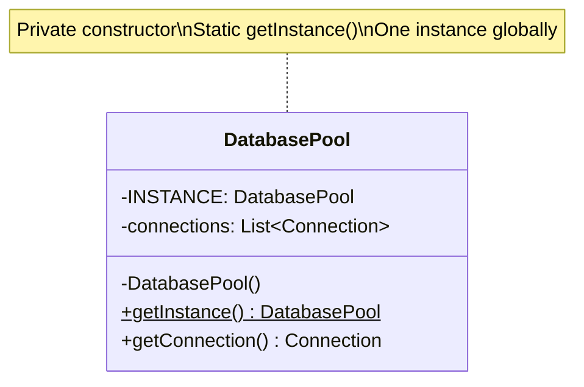
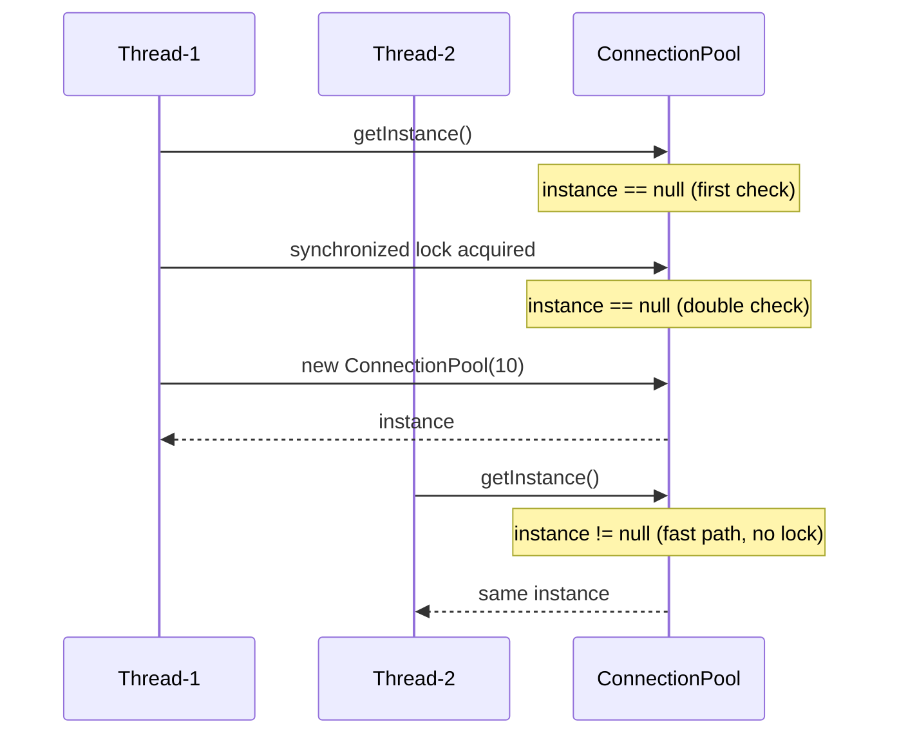

# Singleton Pattern

**One-liner:** Ensure a class has exactly one instance and provide a global access point to it — while surviving multithreaded environments, serialization, and reflection attacks.

---

## Why This Exists — The Problem Without It

Without Singleton, a database connection pool is created multiple times — each call site opens its own pool, exhausts connections, and competes with other pools. The system degrades silently.

```java
// BEFORE — every caller creates their own pool (catastrophic in production)
public class UserService {
    public User findUser(long id) {
        // Creates a NEW 10-connection pool on every method call!
        HikariDataSource ds = new HikariDataSource();
        ds.setJdbcUrl("jdbc:postgresql://prod-db:5432/users");
        ds.setMaximumPoolSize(10);
        // Each call: 10 new DB connections opened, then abandoned
        try (Connection conn = ds.getConnection()) {
            // ... query
        }
        // Pool is never closed — connection leak every single call
    }
}

public class OrderService {
    public Order findOrder(long id) {
        // ANOTHER pool! Now 20 connections leaked per 2 calls.
        HikariDataSource ds = new HikariDataSource();
        ds.setJdbcUrl("jdbc:postgresql://prod-db:5432/users");
        ds.setMaximumPoolSize(10);
        // ...
    }
}

// With 100 rps: 1000 connections opened per second
// PostgreSQL default max_connections = 100
// Result: "FATAL: remaining connection slots are reserved" — production down
```

The same problem applies to: configuration managers (read from file once, not 100x), thread pools, caches, logging systems.

---

## Real-World Analogy

A country has exactly one president at a time. The constitution (the pattern) ensures that the election system (class) can only ever produce one active president (instance). Everyone in the country (the application) who needs to interact with presidential authority goes through the same office. If a second president were somehow created through a loophole, two conflicting executive orders would cause chaos — the single-instance guarantee prevents this. The succession rules (lazy vs eager initialization) define when the president is sworn in: at inauguration day (eager) or on their first required action (lazy).

---

## The Fix — Clean Implementation

All four implementations shown, with trade-offs:

```java
// ─────────────────────────────────────────────────────────────────────────
// IMPLEMENTATION 1: Lazy — NOT thread-safe (never use in production)
// ─────────────────────────────────────────────────────────────────────────
public class LazyBadSingleton {
    private static LazyBadSingleton instance; // null at class load

    private LazyBadSingleton() { }

    public static LazyBadSingleton getInstance() {
        if (instance == null) {              // Thread A and Thread B both see null
            instance = new LazyBadSingleton(); // Both threads create instances
        }                                    // Race condition — two instances exist
        return instance;
    }
}
// Verdict: NEVER. Two threads can create two instances simultaneously.

// ─────────────────────────────────────────────────────────────────────────
// IMPLEMENTATION 2: Synchronized method — thread-safe but slow
// ─────────────────────────────────────────────────────────────────────────
public class SynchronizedSingleton {
    private static SynchronizedSingleton instance;

    private SynchronizedSingleton() { }

    // Synchronized on every call — even after instance is created
    // If getInstance() is called 1M times/second, you have 1M lock acquisitions
    public static synchronized SynchronizedSingleton getInstance() {
        if (instance == null) {
            instance = new SynchronizedSingleton();
        }
        return instance;
    }
}
// Verdict: MEH. Correct but ~100x slower than unsynchronized after warmup.

// ─────────────────────────────────────────────────────────────────────────
// IMPLEMENTATION 3: Double-Checked Locking (DCL) with volatile — GOOD
// ─────────────────────────────────────────────────────────────────────────
public class DatabaseConnectionPool {
    // volatile: ensures the reference is fully written before any thread reads it.
    // Without volatile, another thread can see a partially-constructed object
    // because the JVM/CPU can reorder: allocate memory, assign reference, initialize.
    private static volatile DatabaseConnectionPool instance;

    private final HikariDataSource dataSource;

    private DatabaseConnectionPool() {
        HikariConfig config = new HikariConfig();
        config.setJdbcUrl(System.getenv("DB_URL"));
        config.setUsername(System.getenv("DB_USER"));
        config.setPassword(System.getenv("DB_PASSWORD"));
        config.setMaximumPoolSize(20);
        config.setMinimumIdle(5);
        config.setConnectionTimeout(3_000);
        config.setIdleTimeout(600_000);
        this.dataSource = new HikariDataSource(config);
    }

    public static DatabaseConnectionPool getInstance() {
        if (instance == null) {              // First check — no lock (fast path)
            synchronized (DatabaseConnectionPool.class) {
                if (instance == null) {      // Second check — inside lock (safe)
                    instance = new DatabaseConnectionPool();
                }
            }
        }
        return instance;
    }

    public Connection getConnection() throws SQLException {
        return dataSource.getConnection();
    }

    public void close() {
        dataSource.close();
    }
}
// Verdict: GOOD. Lazy, thread-safe, fast after first initialization.
// Requires Java 5+ (JSR-133 memory model). The volatile is non-negotiable.

// ─────────────────────────────────────────────────────────────────────────
// IMPLEMENTATION 4: Enum Singleton — BEST (Josh Bloch, Effective Java Item 3)
// ─────────────────────────────────────────────────────────────────────────
public enum AppConfig {
    INSTANCE;

    // Fields are initialized at enum class load — guaranteed by JVM class loader
    private final String stripeApiKey;
    private final String databaseUrl;
    private final int    maxRetries;
    private final boolean featureFlagDarkMode;

    AppConfig() {
        // JVM guarantees this runs exactly once, thread-safely
        this.stripeApiKey       = System.getenv("STRIPE_API_KEY");
        this.databaseUrl        = System.getenv("DATABASE_URL");
        this.maxRetries         = Integer.parseInt(
                System.getenv().getOrDefault("MAX_RETRIES", "3"));
        this.featureFlagDarkMode = Boolean.parseBoolean(
                System.getenv().getOrDefault("FEATURE_DARK_MODE", "false"));
    }

    public String stripeApiKey()         { return stripeApiKey; }
    public String databaseUrl()          { return databaseUrl; }
    public int    maxRetries()           { return maxRetries; }
    public boolean isDarkModeEnabled()   { return featureFlagDarkMode; }
}

// Usage:
String apiKey = AppConfig.INSTANCE.stripeApiKey();

// Why Enum is BEST:
// 1. JVM guarantees single instance — even across class loaders
// 2. Serialization-safe — Java serialization does NOT create a new instance
// 3. Reflection-safe — you cannot call enum constructors via reflection
// 4. Thread-safe — class loader handles synchronization
// 5. Free: no boilerplate, no volatile, no synchronized

// ─────────────────────────────────────────────────────────────────────────
// The RIGHT way: Singleton via Dependency Injection (prefer this for services)
// ─────────────────────────────────────────────────────────────────────────
// In Spring, make the class a @Component (default scope is singleton):
@Service // Spring manages exactly one instance in the application context
public class PaymentGatewayClient {
    private final String apiKey;
    private final HttpClient httpClient;

    // Dependencies injected — no static state, fully testable
    public PaymentGatewayClient(
            @Value("${stripe.api.key}") String apiKey,
            HttpClient httpClient) {
        this.apiKey     = apiKey;
        this.httpClient = httpClient;
    }

    public ChargeResponse charge(ChargeRequest request) {
        // ...
    }
}

// In tests: Spring creates a fresh context per test, or you inject a mock:
PaymentGatewayClient client = new PaymentGatewayClient("test-key", mockHttpClient);
// Zero static state — test isolation is perfect
```

---

## Class Diagram

```
DatabaseConnectionPool  (DCL Singleton)
- instance : DatabaseConnectionPool  [static, volatile]
- dataSource : HikariDataSource
- DatabaseConnectionPool()  [private]
+ getInstance() : DatabaseConnectionPool  [static, synchronized inner]
+ getConnection() : Connection

AppConfig  (Enum Singleton)
INSTANCE  [enum constant — JVM singleton]
- stripeApiKey : String
- databaseUrl : String
- maxRetries : int
+ stripeApiKey() : String
+ databaseUrl() : String

Singleton scope in Spring:
ApplicationContext
  |
  +-- BeanDefinition(scope=singleton)
        |
        +-- One instance per ApplicationContext
```

---

## Real Systems Using This

| System | Singleton Usage |
|---|---|
| **Runtime.getRuntime()** | Classic JDK Singleton — one JVM runtime per process. Uses eager initialization. |
| **Spring @Bean (default scope)** | Every `@Component`, `@Service`, `@Repository` is a singleton within the `ApplicationContext` — Spring manages it, not static fields |
| **HikariCP DataSource** | The `HikariDataSource` pool itself is typically a singleton; shared across all threads in the application |
| **SLF4J LoggerFactory** | `LoggerFactory.getLogger(Class)` delegates to a single `ILoggerFactory` instance (bound at startup) — effectively a Singleton |
| **Guava's Suppliers.memoize()** | Wraps a `Supplier<T>` to call the delegate once and cache the result — a functional Singleton for a single value |

---

## SDE-2/SDE-3 Interview Signals

| If interviewer says...                                | Think Singleton because...                                                      |
| ----------------------------------------------------- | ------------------------------------------------------------------------------- |
| "Only one connection pool for the entire application" | Shared resource — one instance prevents duplication                             |
| "Configuration should be loaded once from file"       | Expensive initialization — lazy-init singleton with DCL or enum                 |
| "How do you manage shared, expensive state?"          | Singleton controls access; but immediately ask: "should this be DI instead?"    |
| "Explain thread-safety issues with Singleton"         | Lead with: Lazy (broken), Synchronized (slow), DCL+volatile (good), Enum (best) |
| "How do you test a class that uses a Singleton?"      | This is the trap — Singleton makes testing hard; DI is the answer               |

---

## When to Use
- Truly global shared resource that must be initialized once: connection pools, thread pools, caches, configuration objects
- The resource is expensive to create and stateless (or safely shared): HTTP client pools, SSL contexts
- You need exactly one instance across the entire process — not per request, not per user
- The class is a leaf-level utility with no need for polymorphism or substitution in tests

## When NOT to Use
- You need to mock or replace the instance in tests — static Singleton breaks test isolation; use DI instead
- You think "I only need one now but might need multiple later" — design for multiple from the start via DI
- The "singleton" holds mutable state that varies per request (user session, transaction context) — use thread-local or request-scoped beans
- You are in a distributed environment — Singleton is per-JVM, not per-cluster; distributed state needs Redis/Zookeeper

---

## Trade-offs & Alternatives

| Dimension | Trade-off |
|---|---|
| Global access | Convenient but couples callers to a specific implementation — testing is harder |
| Testability | Static Singleton cannot be injected with a mock — breaks unit tests |
| Concurrency | DCL+volatile is safe; naive lazy init is not — easy to get wrong |
| Serialization | DCL Singleton breaks with default Java serialization (creates new instance); Enum does not |
| Reflection | `Constructor.setAccessible(true)` can break DCL Singleton; Enum prevents this |

**Preferred alternative (SDE-3 answer):** Use Dependency Injection. In Spring, `@Service` is a singleton managed by the container. You can inject a mock in tests. You can swap implementations per profile. All benefits of Singleton, none of the testing pain. Reserve hand-rolled Singletons for true infrastructure objects that exist before the DI container starts (e.g., logging, crash reporters).

---

## Common Interview Mistakes

1. **Using Singleton when you should use DI.** This is the most critical SDE-2/SDE-3 mistake. Static Singleton makes `UserService` impossible to unit test without spinning up a real database. If you hear yourself saying "but we only need one", ask whether the DI container can manage it instead.

2. **Omitting volatile in DCL.** Without `volatile`, the JVM can assign the reference before completing object initialization. A second thread reads a non-null but partially-constructed instance. This is a real bug that manifests under load on multi-core CPUs.

3. **Assuming synchronized methods are fast enough.** For a high-throughput system (Kafka consumer loop, Netty event loop), a synchronized `getInstance()` called millions of times is a measurable bottleneck. DCL or Enum eliminates the lock after first initialization.

4. **Not handling serialization.** A class that implements `Serializable` AND uses DCL Singleton will create a new instance upon deserialization unless you add `readResolve()`:
   ```java
   protected Object readResolve() { return getInstance(); }
   ```
   Enum handles this automatically — another reason it is preferred.

5. **Making Singleton hold mutable shared state without synchronization.** The instance being singleton does not make its fields thread-safe. A `HashMap` field on a Singleton accessed from multiple threads is still a data race.

---

## Mermaid Class Diagram



---

## 5 Detailed Examples — Why, How, Where, When

### Example 1: Database Connection Pool

**WHY:** Creating a new DB pool per request wastes resources. All threads should share ONE pool with N connections.

**HOW:** `DatabasePool.INSTANCE` (enum singleton) wraps HikariCP. All DAOs get connections from the same pool.

**WHERE:** Every backend — Spring Boot defaults to one HikariCP pool as a singleton bean.

**WHEN:** Use when the resource is expensive to create and must be shared globally.

### Example 2: Application Configuration

**WHY:** Config should be loaded once from file/env at startup. Every service reads the same config — no duplication, no inconsistency.

**HOW:** `AppConfig.INSTANCE` loads YAML/properties once. All classes read from it.

**WHERE:** Every app. Spring's `@ConfigurationProperties` is a singleton bean internally.

**WHEN:** Use when initialization is expensive and data is read-only after startup.

### Example 3: Logger

**WHY:** All classes should log through one logger instance that manages appenders, levels, and formatting consistently.

**HOW:** `Logger.getInstance()` — SLF4J + Logback internally use singleton LoggerFactory.

**WHERE:** Every production system.

**WHEN:** Use when you need a global access point with consistent behavior.

### Example 4: Cache Manager

**WHY:** Multiple caches (users, products, sessions) managed by one CacheManager. Creating multiple managers wastes memory and causes inconsistency.

**HOW:** `CacheManager.INSTANCE` holds named caches. Services call `CacheManager.INSTANCE.getCache("users")`.

**WHERE:** Spring Cache, Caffeine, Ehcache — all use singleton manager.

**WHEN:** Use when a manager coordinates multiple shared resources.

### Example 5: Feature Flag Service

**WHY:** Feature toggles checked from every service. Flag state must be consistent — all services see same flags at same time.

**HOW:** `FeatureFlagService.INSTANCE` loads flags from remote config, caches locally, refreshes on interval.

**WHERE:** LaunchDarkly, Unleash, custom flag systems at Flipkart, Uber.

**WHEN:** Use when global state must be consistent across all consumers.

---

## Executable Example 1 — Enum Singleton (Copy-Paste-Run)

```java
// File: SingletonEnumDemo.java
// Run:  javac SingletonEnumDemo.java && java SingletonEnumDemo

public class SingletonEnumDemo {

    enum AppConfig {
        INSTANCE;

        private final java.util.Map<String, String> props = new java.util.HashMap<>();

        AppConfig() {
            // Simulate loading config from file
            props.put("db.host", "localhost");
            props.put("db.port", "5432");
            props.put("app.name", "MyApp");
            System.out.println("[CONFIG] Loaded " + props.size() + " properties (constructor runs ONCE)");
        }

        public String get(String key) { return props.getOrDefault(key, "N/A"); }
    }

    public static void main(String[] args) {
        // Both calls return the SAME instance — constructor only runs once
        System.out.println("db.host = " + AppConfig.INSTANCE.get("db.host"));
        System.out.println("db.port = " + AppConfig.INSTANCE.get("db.port"));
        System.out.println("app.name = " + AppConfig.INSTANCE.get("app.name"));

        // Prove it's the same instance
        System.out.println("Same instance? " + (AppConfig.INSTANCE == AppConfig.INSTANCE));
    }
}
```

**Expected output:**
```
[CONFIG] Loaded 3 properties (constructor runs ONCE)
db.host = localhost
db.port = 5432
app.name = MyApp
Same instance? true
```

---

## Executable Example 2 — Double-Checked Locking (Copy-Paste-Run)

```java
// File: SingletonDCLDemo.java
// Run:  javac SingletonDCLDemo.java && java SingletonDCLDemo

public class SingletonDCLDemo {

    static class ConnectionPool {
        private static volatile ConnectionPool instance;  // volatile = visibility
        private final int poolSize;

        private ConnectionPool(int size) {
            this.poolSize = size;
            System.out.println("[POOL] Created with " + size + " connections (runs ONCE)");
        }

        static ConnectionPool getInstance() {
            if (instance == null) {                      // fast path — no lock
                synchronized (ConnectionPool.class) {
                    if (instance == null) {              // double check inside lock
                        instance = new ConnectionPool(10);
                    }
                }
            }
            return instance;
        }

        int getPoolSize() { return poolSize; }
    }

    public static void main(String[] args) throws Exception {
        // Simulate 5 threads all calling getInstance() simultaneously
        Thread[] threads = new Thread[5];
        for (int i = 0; i < 5; i++) {
            final int id = i;
            threads[i] = new Thread(() -> {
                ConnectionPool pool = ConnectionPool.getInstance();
                System.out.printf("Thread-%d got pool (size=%d, hash=%d)%n",
                    id, pool.getPoolSize(), System.identityHashCode(pool));
            });
        }
        for (Thread t : threads) t.start();
        for (Thread t : threads) t.join();

        // All threads got the SAME instance (same hash)
        System.out.println("All threads share one instance.");
    }
}
```

**Expected output:**
```
[POOL] Created with 10 connections (runs ONCE)
Thread-0 got pool (size=10, hash=12345678)
Thread-1 got pool (size=10, hash=12345678)
Thread-2 got pool (size=10, hash=12345678)
Thread-3 got pool (size=10, hash=12345678)
Thread-4 got pool (size=10, hash=12345678)
All threads share one instance.
```

---

## Mermaid Sequence Diagram — DCL Flow



---

## Anti-Pattern — What Happens Without Singleton (or With Bad Singleton)

```java
// BAD: Lazy without sync — race condition
public class BrokenSingleton {
    private static BrokenSingleton instance;

    public static BrokenSingleton getInstance() {
        if (instance == null) {            // Thread A checks: null
            instance = new BrokenSingleton(); // Thread B also checks: null → TWO instances!
        }
        return instance;
    }
}

// BAD: Singleton holding mutable state without sync
public enum UnsafeCache {
    INSTANCE;
    private Map<String, Object> cache = new HashMap<>(); // NOT thread-safe!
    // Multiple threads read/write → ConcurrentModificationException
    // Fix: use ConcurrentHashMap
}
```

---

## Refactoring Path — Step by Step

```
Step 1: Identify the globally shared resource (pool, config, cache)
Step 2: Is it truly global? (not per-tenant, not per-request)
Step 3: Can DI handle it? (@Service in Spring = singleton by default)
        → YES → use DI, stop here
        → NO (pre-DI bootstrap, library code) → continue
Step 4: Use Enum singleton (preferred)
Step 5: If enum doesn't work (needs inheritance) → DCL + volatile
Step 6: Make internal state thread-safe (ConcurrentHashMap, not HashMap)
```

---

## Spring Boot Connection

```java
// Spring beans are SINGLETONS by default — you don't need to hand-roll it
@Service                          // singleton scope by default
public class UserService { }

@Configuration
public class AppConfig {
    @Bean                          // singleton scope by default
    public HikariDataSource dataSource() { return new HikariDataSource(config); }
}

// When you DO need explicit singleton (outside Spring context):
// Pre-Spring bootstrap, library code, Android components
```

---

## Which LLD Problems Use This

- [[../../examples/lld_logger_library]] — Logger.getInstance()
- [[../../examples/lld_cache_lru_lfu]] — CacheManager singleton
- [[../../examples/lld_rate_limiter]] — Global rate limiter instance
- [[../../examples/lld_pub_sub_system]] — Broker singleton

---

## Follow-up Questions Interviewers Ask

| Question | How to Answer |
|----------|--------------|
| "How do you test a singleton?" | Inject it via interface — mock the interface in tests. Never call `getInstance()` in business logic. |
| "What if you need 2 instances later?" | If that's possible, it was never a true Singleton. Use Factory + DI instead. |
| "Is Singleton thread-safe?" | The INSTANCE is safe (enum/DCL). The STATE inside isn't — use ConcurrentHashMap, volatile, etc. |
| "Singleton vs static class?" | Singleton can implement interfaces, be injected, be mocked. Static class can't. |

---

## Interview Script — What to Say

> "For [connection pool / config / cache manager], I need exactly one instance shared across the app. In Spring, I'd use `@Service` or `@Bean` (singleton by default). Outside Spring — like a bootstrap component — I'd use Enum Singleton for thread-safety and serialization-safety. I'd make sure the internal state uses `ConcurrentHashMap` since the instance being singleton doesn't make its fields thread-safe."

---

## Thread-Safety Note

```
Instance creation: Enum = JVM-guaranteed safe. DCL = volatile required.
Internal state: Singleton does NOT make fields thread-safe.
  HashMap field → ConcurrentHashMap
  int counter → AtomicInteger
  List → CopyOnWriteArrayList or synchronized
Rule: Singleton = one instance. Thread-safety of state = your job.
```

---

## Complexity Analysis

| Scenario | Without Singleton | With Singleton |
|----------|------------------|---------------|
| Resource creation | N instances (wasteful) | 1 instance (shared) |
| Consistency | Each instance has different state | One source of truth |
| Testing | Easy (create per test) | Harder (global state leaks between tests) |
| Flexibility | Easy to swap implementations | Tightly coupled to one class |

---

## Combines Well With

| Pattern | Why they pair well |
|---|---|
| **Abstract Factory** | The factory itself is typically a Singleton |
| **Facade** | Facade simplifying a subsystem is often a Singleton |
| **State** | Singleton state manager holds current state |
| **Observer / Event Bus** | Event bus is a Singleton — all share one bus |
| **Registry** | Singleton holds the registry map |

---

## Cheat Sheet

```
SINGLETON — 4 implementations ranked:
1. Lazy no-sync      → BROKEN (race condition on instance creation)
2. Synchronized      → CORRECT but slow (lock on every getInstance() call)
3. DCL + volatile    → GOOD (lazy, thread-safe, fast after warmup)
4. Enum INSTANCE     → BEST (serialization-safe, reflection-safe, zero boilerplate)

Prefer DI (@Service in Spring) over hand-rolled Singleton for application services.
Use Enum Singleton for true infrastructure (config, crash reporters, bootstrap objects).
volatile is non-negotiable in DCL — without it you get partially-constructed instances.
```

Key rule: **If you can inject it, inject it. Static Singleton is for objects that exist before the DI container.**


# chatgpt

In Java, there are **5 common ways to implement the Singleton pattern**. Interviewers often ask this to check understanding of **thread safety and performance**.

---

## 1️⃣ Eager Initialization (Simplest)

Object is created **when the class loads**.
```java
class Singleton {  
  
    private static final Singleton instance = new Singleton();  
  
    private Singleton() {}  
  
    public static Singleton getInstance() {  
        return instance;  
    }  
}

```

### Pros
- Thread safe
- Very simple
### Cons
- Object created even if **never used**

---

## 2️⃣ Lazy Initialization

Object created **only when needed**.

```java
class Singleton {  
  
    private static Singleton instance;  
  
    private Singleton(){}  
  
    public static Singleton getInstance(){  
        if(instance == null){  
            instance = new Singleton();  
        }  
        return instance;  
    }  
}
```


### Pros
- Object created only when required
### Cons
- ❌ **Not thread-safe**
Two threads may create **two objects**.

---

## 3️⃣ Synchronized Method (Thread Safe)

```java
class Singleton {  
  
    private static Singleton instance;  
  
    private Singleton(){}  
  
    public static synchronized Singleton getInstance(){  
        if(instance == null){  
            instance = new Singleton();  
        }  
        return instance;  
    }  
}
```

### Pros
- Thread safe
### Cons
- Slow because **every call is synchronized**
 
---

## 4️⃣ Double Checked Locking (Best Practical Approach)

```java
class Singleton {  
  
    private static volatile Singleton instance;  
  
    private Singleton(){}  
  
    public static Singleton getInstance(){  
        if(instance == null){  
            synchronized(Singleton.class){  
                if(instance == null){  
                    instance = new Singleton();  
                }  
            }  
        }  
        return instance;  
    }  
}
```

### Pros
- Thread safe
- Better performance
### Cons
- Slightly complex

---

## 5️⃣ Enum Singleton (Most Robust)

```java
enum Singleton {  
    INSTANCE;  
  
    public void show(){  
        System.out.println("Singleton instance");  
    }  
}
```


Usage:
```java
Singleton obj = Singleton.INSTANCE;
```

### Pros
- Thread safe
- Prevents **serialization issues**
- Prevents **reflection attacks**
### Cons
- Less flexible

---

# Quick Comparison

| Method       | Thread Safe | Performance | Recommended |
| ------------ | ----------- | ----------- | ----------- |
| Eager        | ✅           | Fast        | Good        |
| Lazy         | ❌           | Fast        | Not safe    |
| Synchronized | ✅           | Slow        | Avoid       |
| Double Check | ✅           | Fast        | Very good   |
| Enum         | ✅           | Fast        | **Best**    |

---

# Interview Tip

If asked:
**"Best Singleton implementation?"**

Answer:
👉 **Enum Singleton**
or
👉 **Double Checked Locking**

---

# Real-world Singleton Examples
- **Logger**
- **Database Connection Pool**
- **Configuration Manager**
- **Cache Manager**

---

### What is a Reflection Attack in Singleton?

A **reflection attack** uses **Java Reflection API** to break the Singleton pattern by **creating another instance of the class**, even though the constructor is private.

Normally Singleton prevents this:

```java
Singleton s = new Singleton();  // ❌ not allowed (constructor is private)
```

But **reflection can bypass private access**.

---

# Example of Reflection Attack

Singleton class:
```java
class Singleton {  
  
    private static final Singleton instance = new Singleton();  
  
    private Singleton(){}  
  
    public static Singleton getInstance(){  
        return instance;  
    }  
}
```


Now using reflection:
```java
import java.lang.reflect.Constructor;  
  
public class Main {  
    public static void main(String[] args) throws Exception {  
  
        Singleton s1 = Singleton.getInstance();  
  
        Constructor<Singleton> constructor =  
                Singleton.class.getDeclaredConstructor();  
  
        constructor.setAccessible(true);   // break private access  
  
        Singleton s2 = constructor.newInstance();  
  
        System.out.println(s1 == s2);  
    }  
}
```


Output:
```java
False
```

Now **two Singleton objects exist**, which breaks the pattern.

---

# Why This Happens

Reflection allows access to:
- **private constructors**
- **private fields**
- **private methods**

Using:
```java
setAccessible(true)
```

---

# How to Prevent Reflection Attack

### Method 1: Constructor Check
```java
class Singleton {  
  
    private static final Singleton instance = new Singleton();  
  
    private Singleton(){  
        if(instance != null){  
            throw new RuntimeException("Use getInstance()");  
        }  
    }  
  
    public static Singleton getInstance(){  
        return instance;  
    }  
}
```


If reflection tries to create another object → exception.

---
### Method 2: Enum Singleton (Best Solution)
```java
enum Singleton {  
    INSTANCE;  
}
```


Why it works:
- Java **prevents reflection from creating enum objects**
- JVM guarantees **only one instance**

---

# Interview One-Line Answer

> Reflection attack breaks the Singleton pattern by using Java Reflection API to access the private constructor and create multiple instances of the class.

---

Since you're learning **Java design patterns**, the next thing interviewers usually ask after this is:

**3 ways Singleton can be broken:**

1️⃣ Reflection  
2️⃣ Serialization  
3️⃣ Cloning


---

# synchronized in Java

## Definition
> `synchronized` is a keyword in Java used to **control access to shared resources in a multithreaded environment**.  
It ensures that **only one thread can execute a critical section of code at a time**.

---

## Why `synchronized` is Needed

When multiple threads access the same resource, **race conditions** may occur.

Example problem:

Two threads increment the same variable:

```java
count++;
```

# volatile in Java  
  
## Definition  
> `volatile` is a keyword in Java used to ensure that **a variable's value is always read from and written to main memory**, not from a thread's local CPU cache.  
  
It guarantees **visibility of changes across threads**.  
  
---  
  
## Why `volatile` is Needed  
  
In multithreading, each thread may **cache variables locally** for performance.  
  
Example problem:  
  
 
boolean flag = false;

Thread 1:

flag = true;

Thread 2:

while(!flag){  
    // waiting  
}

Without `volatile`, Thread 2 may keep reading the **cached value (`false`)** and never see the update.

---

## Using `volatile`

volatile boolean flag = false;

Now when Thread 1 updates `flag`, the change is **immediately visible to all threads**.

---

## Example

class SharedResource {  
  
    volatile boolean running = true;  
  
    void stop() {  
        running = false;  
    }  
}

Thread checking the variable:

while(running){  
    System.out.println("Running...");  
}

When another thread calls:

stop();

The loop **stops immediately** because the updated value is visible.

---

## What `volatile` Guarantees

1. **Visibility**
    
    - Changes made by one thread are visible to other threads.
        
2. **No Caching**
    
    - Variable is always read from **main memory**.
        

---

## What `volatile` Does NOT Guarantee

`volatile` does **NOT provide atomicity**.

Example problem:

volatile int count = 0;  
  
count++;

`count++` is not atomic.  
Steps internally:

1. Read
    
2. Increment
    
3. Write
    

Two threads can still cause **race conditions**.

---

## When to Use `volatile`

Use it when:

- Variable is **shared between threads**
    
- Only **one thread writes**
    
- Multiple threads **read the value**
    

Examples:

- Flags
    
- Status indicators
    
- Configuration variables
    

---

## volatile vs synchronized

|Feature|volatile|synchronized|
|---|---|---|
|Visibility|Yes|Yes|
|Atomicity|No|Yes|
|Locking|No|Yes|
|Performance|Faster|Slower|

---

## Example Use Case

class ShutdownSignal {  
  
    volatile boolean shutdown = false;  
  
    void stop() {  
        shutdown = true;  
    }  
}

Threads check:

while(!shutdown){  
    // keep running  
}

---

## Interview One-Line Answer

> `volatile` ensures that a variable's value is always read from and written to main memory, guaranteeing visibility of changes across threads but not providing atomicity.