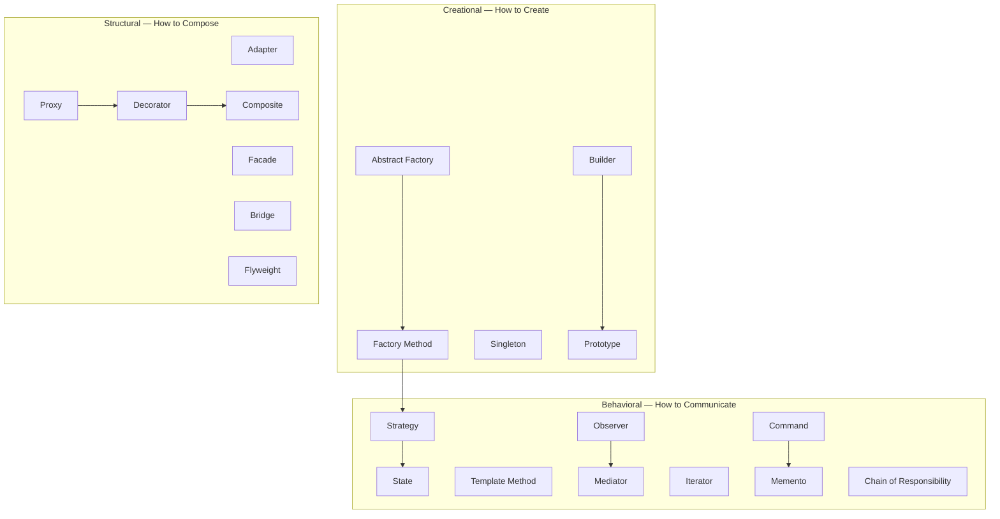

#system-design #lld #patterns #index #interview-guide

# Design Patterns Deep Dive — Study Guide for SDE-2 at Tier 1 Companies

> 20 patterns. 10,800+ lines. Every pattern has examples, executable code, mermaid diagrams, interview scripts, and cheat sheets.

---

## How to Use These Notes

```
Step 1: Read the pattern file top-to-bottom (30-40 min per pattern)
Step 2: Close the file → write the code from memory
Step 3: Run the executable examples → modify them → break things
Step 4: Read "Interview Signals" → practice recognizing triggers
Step 5: Read "Interview Script" → say it out loud 3 times
Step 6: Do 1 LLD problem from the linked examples
Step 7: Before interview → read Cheat Sheet section of all 20 patterns (30 min total)
```

---

## What Every File Contains (23 Sections)

| Section | Purpose |
|---------|---------|
| One-liner | Instant recall |
| Why This Exists (before/after code) | Understand the PROBLEM |
| Real-World Analogy | Anchor in memory |
| Mermaid Class Diagram | Whiteboard practice |
| 5-6 Detailed Examples (WHY/HOW/WHERE/WHEN) | Pattern recognition across domains |
| Executable Example 1 (copy-paste-run) | Prove you can CODE it |
| Executable Example 2 (copy-paste-run) | Different domain, same pattern |
| Mermaid Sequence Diagram | Runtime understanding |
| Anti-Pattern | What goes wrong without it |
| Refactoring Path | How to arrive at the pattern step-by-step |
| Real Systems Using This | JDK, Spring, Netflix, Stripe references |
| Spring Boot Connection | How pattern maps to Spring annotations |
| Which LLD Problems Use This | Links to example files |
| SDE-2/SDE-3 Interview Signals | Recognize interviewer hints |
| Follow-up Questions | What they ask AFTER you apply the pattern |
| Interview Script | Exact words to say |
| When to Use / When NOT to Use | Shows judgment |
| Trade-offs & Alternatives | Senior-level thinking |
| Thread-Safety Note | Concurrency considerations |
| Complexity Analysis | Quantify the benefit |
| Common Interview Mistakes | Avoid elimination |
| Combines Well With | Patterns work together |
| Cheat Sheet | 5-6 line recap for revision |

---

## Pattern Map — All 20 Patterns



---

## Study Order — Priority Ranked for SDE-2

### Week 1: Must-Know (Asked in 90% of LLD interviews)

| Day | Pattern | File | Why Critical |
|-----|---------|------|-------------|
| 1 | **Strategy** | [[behavioral/strategy]] | Most common — pricing, payments, algorithms |
| 2 | **Observer** | [[behavioral/observer]] | Event systems, decoupling, pub-sub |
| 3 | **State** | [[behavioral/state]] | Every order/booking/ride lifecycle |
| 4 | **Factory Method** | [[creational/factory_method]] | Object creation without if/else |
| 5 | **Builder** | [[creational/builder]] | Complex object construction |
| 6 | **Decorator** | [[structural/decorator]] | Add behavior without modification |
| 7 | **Command** | [[behavioral/command]] | Undo/redo, task queuing |

### Week 2: Frequently Asked (Asked in 60% of interviews)

| Day | Pattern | File | Why Important |
|-----|---------|------|-------------|
| 8 | **Singleton** | [[creational/singleton]] | Thread-safety deep dive, DI alternative |
| 9 | **Proxy** | [[structural/proxy]] | Spring AOP, lazy loading, caching |
| 10 | **Facade** | [[structural/facade]] | Simplify complex subsystems |
| 11 | **Template Method** | [[behavioral/template_method]] | Algorithm skeleton with hooks |
| 12 | **Chain of Responsibility** | [[behavioral/chain_of_responsibility]] | Middleware, validation, Spring Security |
| 13 | **Composite** | [[structural/composite]] | Tree structures (file system, UI) |
| 14 | **Abstract Factory** | [[creational/abstract_factory]] | Product families, cross-platform |

### Week 3: Good to Know (Asked in 30% of interviews, shows depth)

| Day | Pattern | File | When It Comes Up |
|-----|---------|------|-----------------|
| 15 | **Adapter** | [[structural/adapter]] | Third-party integrations |
| 16 | **Mediator** | [[behavioral/mediator]] | Chat systems, event coordination |
| 17 | **Memento** | [[behavioral/memento]] | Undo/redo, game saves |
| 18 | **Bridge** | [[structural/bridge]] | Two-dimension variation |
| 19 | **Flyweight** | [[structural/flyweight]] | Memory optimization |
| 20 | **Prototype** | [[creational/prototype]] | Expensive object cloning |

---

## Company-Specific Focus Areas

### Flipkart / Meesho / Swiggy (Machine Coding Round)

**Must know:** Strategy, State, Factory, Observer, Builder
**They test:** Working runnable code in 90 min. Design patterns visible in class structure.
**Focus on:** Executable examples + [[../../lld_machine_coding_template]]

### Google / Meta (Design Discussion)

**Must know:** Strategy, Observer, Composite, Template Method
**They test:** Trade-off discussions, OCP compliance, clean interfaces. Less code, more reasoning.
**Focus on:** Trade-offs, When NOT to Use, Complexity Analysis sections

### Stripe / Razorpay / PhonePe (Financial + API)

**Must know:** Strategy (payments), State (transaction lifecycle), Command (audit trail), Chain of Responsibility (validation)
**They test:** Error handling, idempotency, edge cases
**Focus on:** Anti-Pattern sections, Follow-up Questions

### Uber / Ola / Rapido (Real-time Coordination)

**Must know:** State (ride lifecycle), Observer (driver tracking), Strategy (dispatch), Mediator (coordination)
**They test:** Concurrency, real-time updates, state transitions
**Focus on:** Thread-Safety Notes, Concurrency sections

### Amazon / Microsoft / Adobe (Full OOP)

**Must know:** All creational + all structural patterns
**They test:** Clean class hierarchy, extensibility, SOLID compliance
**Focus on:** Refactoring Path, Combines Well With sections

### Atlassian (Collaborative Tools)

**Must know:** Observer, Command, State, Composite, Mediator
**They test:** Event-driven design, undo/redo, task management
**Focus on:** Command + Memento combo, Observer patterns

---

## Pattern Selection Decision Tree

```
Is the problem about CREATING objects?
├── One type, varies by parameter → Factory Method
├── Family of related types, must be consistent → Abstract Factory
├── Many optional parameters → Builder
├── Expensive to create, need copies → Prototype
└── Need exactly one instance → Singleton

Is the problem about COMPOSING objects?
├── External lib has wrong interface → Adapter
├── Add behavior without modifying → Decorator
├── Complex subsystem needs simple API → Facade
├── Control access (auth/cache/lazy) → Proxy
├── Tree structure (file system, UI) → Composite
├── Two dimensions vary independently → Bridge
└── Millions of similar objects → Flyweight

Is the problem about COMMUNICATION between objects?
├── Algorithm varies by type → Strategy
├── One event, many reactions → Observer
├── Queue, undo, log operations → Command
├── Behavior changes with internal state → State
├── Same algorithm, different steps → Template Method
├── Many-to-many tangled communication → Mediator
├── Traverse without exposing structure → Iterator
├── Save/restore state for undo → Memento
└── Request through multiple handlers → Chain of Responsibility
```

---

## Quick Revision — All 20 Cheat Sheets

Before your interview, speed-read this section (15 min):

| Pattern | One-Liner |
|---------|----------|
| **Factory** | Registry map creates objects — no if/else |
| **Abstract Factory** | Family of related products, never mix families |
| **Builder** | Fluent API for complex objects, validate in build() |
| **Singleton** | Enum = best. Prefer DI. Instance is singleton ≠ fields are thread-safe |
| **Prototype** | Clone expensive objects. Deep-copy mutable fields. |
| **Adapter** | Wrap incompatible interface. Translation only, no logic. |
| **Decorator** | Same interface, wraps and adds behavior. Stackable. Order matters. |
| **Facade** | One method hides 5 services. Delegates, doesn't implement. |
| **Proxy** | Same interface, controls access. 4 types: virtual/protection/logging/caching |
| **Composite** | Tree. Leaf + Composite both implement Component. Recursive getSize(). |
| **Bridge** | Two hierarchies linked by composition. N+M instead of N×M. |
| **Flyweight** | Shared immutable state + per-instance extrinsic state. Cache in factory. |
| **Strategy** | Interface + one class per algorithm. Inject via constructor. Stateless. |
| **Observer** | Publisher.publish() → all subscribers notified. Fire-and-forget. |
| **Command** | Encapsulate operation as object. execute()/undo(). History stack. |
| **State** | Each state = class. Context delegates. State controls its own transitions. |
| **Template Method** | Final skeleton in base. Abstract steps in subclass. Compile-time. |
| **Mediator** | Central hub. N connections instead of N². Colleagues → mediator only. |
| **Memento** | Opaque snapshot. Originator creates. Caretaker stores. Never peek. |
| **Chain of Responsibility** | Handler → next. Process or pass. Spring Security = this. |

---

## Related Notes

- [[../../lld_machine_coding_template]] — 90-minute machine coding battle plan
- [[../../lld_interview_question_bank]] — 52 LLD problems by company
- [[../../lld_concurrency_patterns]] — Thread safety for LLD
- [[../../lld_testing_strategy]] — Unit testing with Mockito
- [[../../lld_api_design]] — REST API design
- [[../../lld_database_design]] — Schema design for LLD problems
- [[../pattern_combinations]] — How patterns work together
- [[../smell_to_pattern_map]] — Code smell → pattern decision table
- [[../../solid_with_refactoring]] — SOLID principles with before/after code
