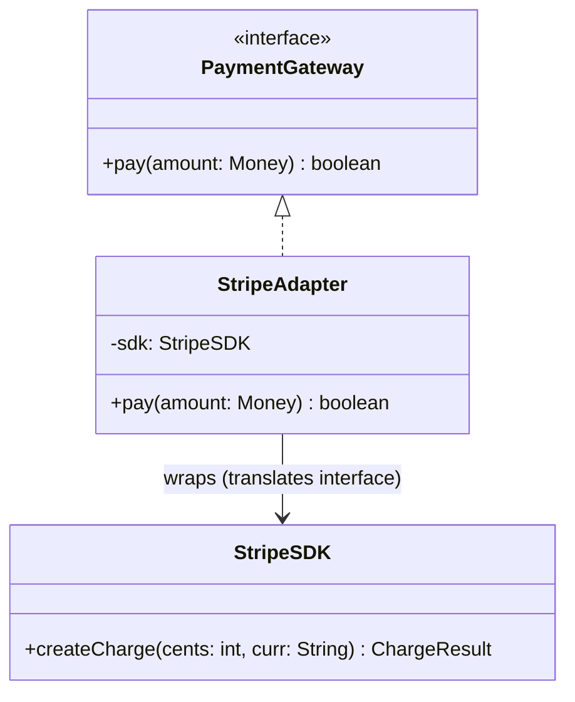

# Adapter Pattern

**One-liner:** Wraps an incompatible interface in a translator so existing code can work with new or legacy classes without modification.

---

## Why This Exists — The Problem Without It

You licensed a third-party payment SDK. Its API is fixed. Your system already defines a `PaymentGateway` interface used everywhere. Without Adapter, you must rewrite every call site or fork the SDK — both options are catastrophic.

```java
// PAINFUL: Every call site must know the SDK's exact signature
// Scattered across 40 controllers, services, and tests
LegacyPaymentSDK sdk = new LegacyPaymentSDK("api-key");

// SDK expects cents (int) + ISO currency string
// Your domain uses Money value object everywhere
int cents = (int)(money.getAmount() * 100);
String currency = money.getCurrency().getCurrencyCode();
sdk.processPayment(cents, currency);   // you must repeat this translation 40 times

// Later, when SDK v2 changes signature — you touch 40 files
```

Every call site carries the same impedance-mismatch boilerplate. Tests become brittle because they depend on the SDK's raw types.

---

## Real-World Analogy

When you travel from India to the UK, your laptop charger has a Type-A/B plug. UK sockets are Type-G. You buy a travel adapter — you don't rewire your laptop, you don't rewire the hotel. The adapter sits between them and bridges the physical interface mismatch. Your laptop behavior is unchanged; the socket behavior is unchanged; the adapter does only translation.

---

## The Fix — Clean Implementation

### Before: SDK has wrong interface, cannot be modified

```java
// External library — you cannot touch this class
public class LegacyPaymentSDK {
    private final String apiKey;

    public LegacyPaymentSDK(String apiKey) {
        this.apiKey = apiKey;
    }

    // SDK signature: amount in cents, ISO-4217 currency string
    public boolean processPayment(int amountInCents, String currencyCode) {
        System.out.printf("[SDK] Charging %d cents in %s%n", amountInCents, currencyCode);
        return true; // simplified
    }

    public String getTransactionId() {
        return "TXN-" + System.currentTimeMillis();
    }
}

// Your domain value object
public final class Money {
    private final BigDecimal amount;
    private final Currency currency;

    public Money(BigDecimal amount, Currency currency) {
        this.amount = amount;
        this.currency = currency;
    }

    public BigDecimal getAmount()  { return amount; }
    public Currency getCurrency()  { return currency; }
}
```

### After — Object Adapter (PREFERRED: composition, no inheritance)

```java
// Your system's contract — all payment processors implement this
public interface PaymentGateway {
    PaymentResult pay(Money amount, String orderId);
}

public record PaymentResult(boolean success, String transactionId) {}

// OBJECT ADAPTER: holds the adaptee via composition
public class LegacyPaymentAdapter implements PaymentGateway {

    private final LegacyPaymentSDK sdk;   // composition — not inheritance

    public LegacyPaymentAdapter(LegacyPaymentSDK sdk) {
        this.sdk = sdk;
    }

    @Override
    public PaymentResult pay(Money amount, String orderId) {
        // Translation is the ONLY responsibility of this class
        int cents = amount.getAmount()
                         .multiply(BigDecimal.valueOf(100))
                         .intValueExact();
        String currencyCode = amount.getCurrency().getCurrencyCode();

        boolean success = sdk.processPayment(cents, currencyCode);
        String txnId    = sdk.getTransactionId();

        return new PaymentResult(success, txnId);
    }
}
```

### After — Class Adapter (RARE: inheritance, Java single-inheritance limit applies)

```java
// CLASS ADAPTER: extends adaptee AND implements target interface
// Drawback: ties you to one concrete adaptee; can't swap SDK at runtime
public class LegacyPaymentClassAdapter
        extends LegacyPaymentSDK implements PaymentGateway {

    public LegacyPaymentClassAdapter(String apiKey) {
        super(apiKey);
    }

    @Override
    public PaymentResult pay(Money amount, String orderId) {
        int cents = amount.getAmount()
                         .multiply(BigDecimal.valueOf(100))
                         .intValueExact();
        boolean ok = processPayment(cents, amount.getCurrency().getCurrencyCode());
        return new PaymentResult(ok, getTransactionId());
    }
}
```

### Client code — uses the target interface, never knows about SDK

```java
@Service
public class CheckoutService {

    private final PaymentGateway gateway;  // interface only

    // Inject whichever adapter you want — swap without touching this class
    public CheckoutService(PaymentGateway gateway) {
        this.gateway = gateway;
    }

    public void checkout(Cart cart, Money total) {
        PaymentResult result = gateway.pay(total, cart.getOrderId());
        if (!result.success()) {
            throw new PaymentFailedException(result.transactionId());
        }
    }
}

// Wiring (Spring @Configuration or main)
LegacyPaymentSDK sdk     = new LegacyPaymentSDK("sk_live_xxx");
PaymentGateway   gateway = new LegacyPaymentAdapter(sdk);
CheckoutService  svc     = new CheckoutService(gateway);
```

---

## Class Diagram

```
«interface»
PaymentGateway
+ pay(Money, String): PaymentResult
        ^
        | implements
        |
LegacyPaymentAdapter
- sdk: LegacyPaymentSDK          ------>  LegacyPaymentSDK (external)
+ pay(Money, String): PaymentResult       + processPayment(int, String): boolean
                                          + getTransactionId(): String

Object Adapter: composition (has-a)
Class Adapter:  inheritance (is-a) — extends LegacyPaymentSDK
```

---

## Real Systems Using This

| System | Adapter | Adaptee |
|---|---|---|
| `java.util.Arrays.asList()` | Returns `List<T>` view | Underlying array |
| `java.io.InputStreamReader` | Implements `Reader` | `InputStream` (byte-oriented) |
| `java.io.OutputStreamWriter` | Implements `Writer` | `OutputStream` |
| Spring `HandlerAdapter` | Uniform `handle()` method | Different controller types (`@Controller`, `HttpRequestHandler`, etc.) |
| SLF4J `Log4jLoggerAdapter` | SLF4J `Logger` interface | Log4j 1.x `Category` |
| Spring `JpaRepositoryAdapter` | Spring Data `Repository` | JPA `EntityManager` |

---

## SDE-2/SDE-3 Interview Signals

| If interviewer says... | Think this pattern |
|---|---|
| "We need to integrate a third-party library whose API doesn't match ours" | Adapter |
| "We have legacy code we can't modify, but we need it to work with new interfaces" | Adapter |
| "How do you make two incompatible interfaces work together?" | Adapter |
| "We're migrating payment providers — old provider must coexist with new" | Adapter |
| "All our logging calls use SLF4J but the vendor SDK uses java.util.logging" | Adapter |
| "Open/Closed principle — new behavior without touching existing code" | Adapter (or Decorator) |

---

## When to Use

- You have a class with the right behavior but the wrong interface, and you cannot modify it (external library, generated code, legacy module owned by another team).
- You want to create reusable code that cooperates with classes having incompatible interfaces.
- You are integrating multiple third-party services behind a uniform internal interface so you can swap them.

## When NOT to Use

- When you control both sides — just refactor the interface directly.
- When the adapter requires complex business logic — that logic belongs in a Service, not an adapter.
- When the interface mismatch is so deep that the adapter needs to duplicate state — reconsider the design.
- Class Adapter specifically: avoid when the adaptee is not final but you still want runtime flexibility; object adapter is almost always better in Java.

---

## Trade-offs & Alternatives

| Aspect | Object Adapter | Class Adapter |
|---|---|---|
| Coupling | Loose (composition) | Tight (inheritance) |
| Runtime swap | Yes — inject different adaptee | No — fixed at compile time |
| Java support | Always works | Only if adaptee is not final |
| Override adaptee methods | No | Yes |

**Alternatives:**
- **Facade:** Adapter makes ONE thing fit an interface; Facade simplifies MANY things behind a single surface.
- **Decorator:** Adapter changes the interface; Decorator keeps the same interface but adds behavior.
- **Bridge:** Both use composition; Bridge separates abstraction from implementation from the start (design-time); Adapter reconciles incompatible interfaces after the fact (retrofit).

---

## Common Interview Mistakes

1. **Putting business logic inside the adapter.** Adapter's only job is interface translation. If you find yourself writing `if (amount > 1000) applyDiscount()` inside the adapter, extract that to a service.
2. **Confusing Adapter with Facade.** Adapter = one incompatible object fits a specific interface. Facade = simplified surface over multiple objects. They are not interchangeable.
3. **Choosing Class Adapter in Java without justification.** Single-inheritance makes Class Adapter a dead end when adaptees change. Prefer Object Adapter by default.
4. **Not injecting the adapter — instantiating it at call sites.** Kills testability. The adapter itself should be mockable.
5. **Forgetting that the adapter must implement the TARGET interface exactly** — not a subset or superset.

---

## Mermaid Class Diagram



---

## 5 Detailed Examples — Why, How, Where, When

### Example 1: Legacy Payment SDK
**WHY:** StripeSDK has `createCharge(int cents, String currency)` but your system expects `PaymentGateway.pay(Money amount)`. Can't modify Stripe's code.
**HOW:** `StripeAdapter implements PaymentGateway`, holds `StripeSDK`, translates Money→cents.
**WHERE:** Every payment integration — Razorpay, PayU, CCAvenue all have different SDKs.
**WHEN:** Use when integrating a third-party library whose interface doesn't match yours.

### Example 2: XML to JSON API
**WHY:** Legacy bank API returns XML. Your microservices expect JSON. Can't change the bank.
**HOW:** `BankApiAdapter` wraps XML client, parses XML→JSON, returns standardized response.
**WHERE:** Banking integrations, government APIs, legacy ERP systems.
**WHEN:** Use when data format differs between systems.

### Example 3: Metric Exporter
**WHY:** App uses custom `MetricRecorder` interface. Need to export to Prometheus (different API), Datadog (different API), CloudWatch (different API).
**HOW:** `PrometheusAdapter implements MetricRecorder` → translates to Prometheus client calls.
**WHERE:** Monitoring systems, observability platforms.
**WHEN:** Use when the same data goes to multiple destinations with different APIs.

### Example 4: Database Driver
**WHY:** JDBC defines `Connection`, `Statement`, `ResultSet`. Each DB vendor (Postgres, MySQL) provides their own internal classes. JDBC drivers ARE adapters.
**HOW:** `PgConnection implements java.sql.Connection` → wraps Postgres-specific wire protocol.
**WHERE:** Every JDBC driver.
**WHEN:** Use when a standard interface must work across vendor-specific implementations.

### Example 5: Authentication Provider
**WHY:** Your app expects `AuthProvider.authenticate(credentials)`. Google OAuth, LDAP, SAML all have different APIs.
**HOW:** `GoogleOAuthAdapter implements AuthProvider` → wraps Google OAuth SDK.
**WHERE:** Spring Security's `AuthenticationProvider` — each provider is an adapter.
**WHEN:** Use when multiple external auth systems must fit one internal interface.

---

## Executable Example (Copy-Paste-Run)

```java
// File: AdapterDemo.java
// Run:  javac AdapterDemo.java && java AdapterDemo

public class AdapterDemo {

    // Your system's expected interface
    interface TemperatureService {
        double getTemperatureCelsius(String city);
    }

    // Legacy API you can't modify (returns Fahrenheit!)
    static class LegacyWeatherAPI {
        double fetchTempFahrenheit(String location) {
            return switch (location) {
                case "Mumbai" -> 89.6;   // 32°C
                case "Delhi" -> 104.0;   // 40°C
                case "London" -> 59.0;   // 15°C
                default -> 72.0;
            };
        }
    }

    // Adapter — translates Fahrenheit to Celsius
    static class WeatherAdapter implements TemperatureService {
        private final LegacyWeatherAPI legacy;
        WeatherAdapter(LegacyWeatherAPI api) { this.legacy = api; }

        public double getTemperatureCelsius(String city) {
            double fahrenheit = legacy.fetchTempFahrenheit(city);
            return (fahrenheit - 32) * 5.0 / 9.0;  // conversion = ONLY job
        }
    }

    // Client uses only TemperatureService — doesn't know about legacy API
    static class WeatherDashboard {
        private final TemperatureService service;
        WeatherDashboard(TemperatureService s) { service = s; }

        void showWeather(String city) {
            double temp = service.getTemperatureCelsius(city);
            System.out.printf("  %s: %.1f°C%n", city, temp);
        }
    }

    public static void main(String[] args) {
        LegacyWeatherAPI legacyApi = new LegacyWeatherAPI();
        TemperatureService adapter = new WeatherAdapter(legacyApi);
        WeatherDashboard dashboard = new WeatherDashboard(adapter);

        System.out.println("=== Weather Dashboard ===");
        dashboard.showWeather("Mumbai");   // 32.0°C
        dashboard.showWeather("Delhi");    // 40.0°C
        dashboard.showWeather("London");   // 15.0°C
    }
}
```

**Expected output:**
```
=== Weather Dashboard ===
  Mumbai: 32.0°C
  Delhi: 40.0°C
  London: 15.0°C
```

---

## Anti-Pattern — What Happens Without Adapter

```java
// Direct usage of legacy API everywhere — scattered conversion logic
double tempF = legacyApi.fetchTempFahrenheit("Mumbai");
double tempC = (tempF - 32) * 5.0 / 9.0;  // conversion duplicated everywhere
// If legacy API changes → fix in 50 places
```

---

## Refactoring Path

```
Step 1: Define YOUR interface (what your code expects)
Step 2: Identify the ADAPTEE (legacy/external class you can't modify)
Step 3: Create Adapter: implements YOUR interface, holds ADAPTEE
Step 4: Translate calls — ONLY translation, zero business logic
Step 5: Inject adapter behind the interface — client never sees adaptee
```

---

## Spring Boot Connection

```java
// Spring makes adapter injection trivial
@Component
public class StripeAdapter implements PaymentGateway {
    @Autowired private StripeSDK stripe;
    public boolean pay(Money amount) { return stripe.createCharge(amount.toCents(), "inr").isOk(); }
}
// Inject PaymentGateway anywhere — Spring provides StripeAdapter
```

---

## Which LLD Problems Use This

- [[../../examples/lld_payment_system]] — Gateway adapters (Razorpay, Stripe, PayU)
- [[../../examples/lld_notification_system]] — Channel adapters (Twilio, SendGrid, Firebase)

---

## Follow-up Questions Interviewers Ask

| Question | How to Answer |
|----------|--------------|
| "Adapter vs Facade?" | Adapter makes ONE thing fit an interface. Facade simplifies MANY things. |
| "Adapter vs Decorator?" | Adapter changes interface. Decorator keeps interface, adds behavior. |
| "What if the adaptee changes?" | Only the adapter changes — all callers are shielded. |

---

## Interview Script — What to Say

> "The [external SDK / legacy API] has a different interface than what my code expects. I'll create an Adapter that implements my interface and wraps the external class. The adapter's only job is translating calls — no business logic. This shields my entire codebase from the external API."

---

## Thread-Safety Note

```
Adapter is typically stateless (just translates calls) → thread-safe.
If adaptee is not thread-safe → adapter must synchronize or document.
```

---

## Complexity Analysis

| Scenario | Without Adapter | With Adapter |
|----------|----------------|-------------|
| Change external SDK | Modify all callers | Modify only adapter |
| Switch vendor | Rewrite all integration code | Create new adapter, inject |
| Test business logic | Must mock external SDK everywhere | Mock adapter interface |

---

## Combines Well With

- **Factory / DI:** Build the correct adapter at startup based on config.
- **Strategy:** Multiple adapters = interchangeable strategies.
- **Decorator:** Wrap adapter with logging/retry decorator.
- **Facade:** Adapter inside a facade to make one subsystem fit.

---

## Cheat Sheet

```
ADAPTER IN 5 LINES:
1. Define TARGET interface (what your code expects)
2. Identify ADAPTEE (existing class you cannot change)
3. Create Adapter that implements TARGET and holds ADAPTEE (composition)
4. Translate calls: target method → adaptee method (ONLY translation, no logic)
5. Inject Adapter behind the interface — client never sees the adaptee

Object Adapter (composition) > Class Adapter (inheritance) in Java.
Adapter changes interface. Decorator keeps interface. Facade simplifies many.
Red flag: business logic inside an adapter = wrong layer.
```

---
---

# ChatGPT

Great! Let's go deep on the Adapter pattern for SDE-2 level. At this level, interviewers expect you to know not just _what_ it is, but _when_, _why_, and _trade-offs_.

---

## The Full Picture

```
«interface»          «class»           «class»
  Target          Adapter            Adaptee
  ───────         ───────            ───────
  request()  ←── request()  ──────►  specificRequest()
                 (translates)
```

Your client only ever talks to `Target`. The `Adapter` handles the translation to `Adaptee` internally.

---

## Object Adapter vs Class Adapter

### 1. Object Adapter (composition — always prefer this)

```java
// What your system expects
interface PaymentGateway {
    void processPayment(double amount);
    boolean refund(String transactionId);
}

// Third-party Razorpay SDK you can't modify
class RazorpaySDK {
    public String initiatePayment(int amountInPaise, String currency) {
        System.out.println("Razorpay: Processing ₹" + amountInPaise/100.0);
        return "txn_" + System.currentTimeMillis();
    }

    public boolean reverseTransaction(String txnId, int amountInPaise) {
        System.out.println("Razorpay: Reversing transaction " + txnId);
        return true;
    }
}

// Adapter — wraps RazorpaySDK, exposes PaymentGateway
class RazorpayAdapter implements PaymentGateway {
    private RazorpaySDK razorpay;  // composition
    private String lastTransactionId;

    public RazorpayAdapter(RazorpaySDK razorpay) {
        this.razorpay = razorpay;
    }

    @Override
    public void processPayment(double amount) {
        int amountInPaise = (int)(amount * 100);  // translation logic
        this.lastTransactionId = razorpay.initiatePayment(amountInPaise, "INR");
    }

    @Override
    public boolean refund(String transactionId) {
        return razorpay.reverseTransaction(transactionId, 0);
    }
}

// Client code — never touches RazorpaySDK directly
class OrderService {
    private PaymentGateway gateway;  // depends on abstraction

    public OrderService(PaymentGateway gateway) {
        this.gateway = gateway;
    }

    public void checkout(double amount) {
        gateway.processPayment(amount);
    }
}

// Wiring it all up
public class Main {
    public static void main(String[] args) {
        RazorpaySDK sdk = new RazorpaySDK();
        PaymentGateway gateway = new RazorpayAdapter(sdk);
        OrderService service = new OrderService(gateway);

        service.checkout(999.99);
    }
}
```

---

### 2. Class Adapter (inheritance — rarely used in Java)

```java
// Adapter extends Adaptee AND implements Target
class RazorpayClassAdapter extends RazorpaySDK implements PaymentGateway {

    @Override
    public void processPayment(double amount) {
        int amountInPaise = (int)(amount * 100);
        this.initiatePayment(amountInPaise, "INR");  // calls inherited method
    }

    @Override
    public boolean refund(String transactionId) {
        return this.reverseTransaction(transactionId, 0);
    }
}
```

**Why Object Adapter wins:**

||Object Adapter|Class Adapter|
|---|---|---|
|Coupling|Loose (composition)|Tight (inheritance)|
|Swap adaptee at runtime|✅ Yes|❌ No|
|Java multiple inheritance|✅ No issue|⚠️ Only one class allowed|
|Testability|✅ Easy to mock|❌ Harder|

---

## Swapping Adapters at Runtime

This is where SDE-2 thinking kicks in — your system should work with **any** payment provider without changing business logic:

```java
class PaymentAdapterFactory {
    public static PaymentGateway getAdapter(String provider) {
        switch (provider) {
            case "razorpay": return new RazorpayAdapter(new RazorpaySDK());
            case "stripe":   return new StripeAdapter(new StripeSDK());
            case "paytm":    return new PaytmAdapter(new PaytmSDK());
            default: throw new IllegalArgumentException("Unknown provider: " + provider);
        }
    }
}

// Switching providers = one line change
PaymentGateway gateway = PaymentAdapterFactory.getAdapter("stripe");
OrderService service = new OrderService(gateway);
```

Your `OrderService` never changes. Only the adapter wiring changes. This is **Open/Closed Principle** in action.

---

## Two-Way Adapter (Bidirectional)

Sometimes both sides need to talk to each other:

```java
interface JsonParser {
    Map<String, Object> parse(String json);
}

interface XmlParser {
    Document parse(String xml);
}

// Adapter that works both ways
class DataFormatAdapter implements JsonParser, XmlParser {
    private XmlToJsonConverter converter = new XmlToJsonConverter();

    @Override
    public Map<String, Object> parse(String json) {
        String xml = converter.jsonToXml(json);
        return Map.of("converted", xml);
    }

    @Override
    public Document parse(String xml) {
        // parse XML natively
        return new Document(xml);
    }
}
```

---

## Where You Actually See This in Java/Spring

```java
// 1. Arrays.asList() — adapts array to List interface
String[] array = {"a", "b", "c"};
List<String> list = Arrays.asList(array);

// 2. InputStreamReader — adapts byte stream to character stream
InputStream byteStream = new FileInputStream("file.txt");
Reader charReader = new InputStreamReader(byteStream);  // ← adapter

// 3. Spring's HandlerAdapter
// DispatcherServlet expects handle(request, response)
// But you write @GetMapping methods
// HandlerAdapter bridges the two

// 4. JPA to JDBC
// Your code uses EntityManager (JPA)
// Underneath it adapts to JDBC calls
```

---

## Adapter vs Similar Patterns — Interview Favourite

|Pattern|Intent|Changes interface?|Adds behaviour?|
|---|---|---|---|
|**Adapter**|Make incompatible interfaces work together|✅ Yes|❌ No|
|**Decorator**|Add new behaviour to existing object|❌ No|✅ Yes|
|**Facade**|Simplify a complex subsystem|✅ Yes (simplifies)|❌ No|
|**Proxy**|Control access to an object|❌ No|❌ No|

Key distinction interviewers love asking:

- **Facade** reduces complexity of _many_ classes into one simple interface
- **Adapter** makes _one_ existing class work with a different interface

---

## Trade-offs to Mention in Interviews

**Pros:**

- Follows Open/Closed — add new providers without touching existing code
- Isolates conversion/translation logic in one place
- Makes third-party code testable by wrapping it

**Cons:**

- Extra layer of indirection — can be confusing if overused
- If you control both interfaces, just align them — don't add unnecessary adapters
- Debugging is harder since calls pass through an extra layer

---

## Interview Question You Should Nail

> _"How would you design a notification system that supports Email, SMS, and Push — and can add new providers without changing existing code?"_

```java
interface NotificationSender {
    void send(String to, String message);
}

// Each third-party SDK has different APIs
class SendGridAdapter implements NotificationSender {
    private SendGridSDK sdk;
    public void send(String to, String message) {
        sdk.sendEmail(new EmailRequest(to, message, "noreply@app.com"));
    }
}

class TwilioAdapter implements NotificationSender {
    private TwilioSDK sdk;
    public void send(String to, String message) {
        sdk.sendSMS(to, message, "+1234567890");
    }
}

class FCMAdapter implements NotificationSender {
    private FirebaseSDK sdk;
    public void send(String to, String message) {
        sdk.pushNotification(new FCMPayload(to, message));
    }
}

// NotificationService never changes
class NotificationService {
    private List<NotificationSender> senders;

    public NotificationService(List<NotificationSender> senders) {
        this.senders = senders;
    }

    public void notifyAll(String to, String message) {
        senders.forEach(s -> s.send(to, message));
    }
}
```

Adding WhatsApp tomorrow? Just write `WhatsAppAdapter` — nothing else changes.

---

## One-line SDE-2 Summary to Say in Interviews

> _"Adapter wraps an incompatible interface and translates calls, keeping client code clean and decoupled from third-party or legacy implementations — following Open/Closed and Dependency Inversion principles."_
