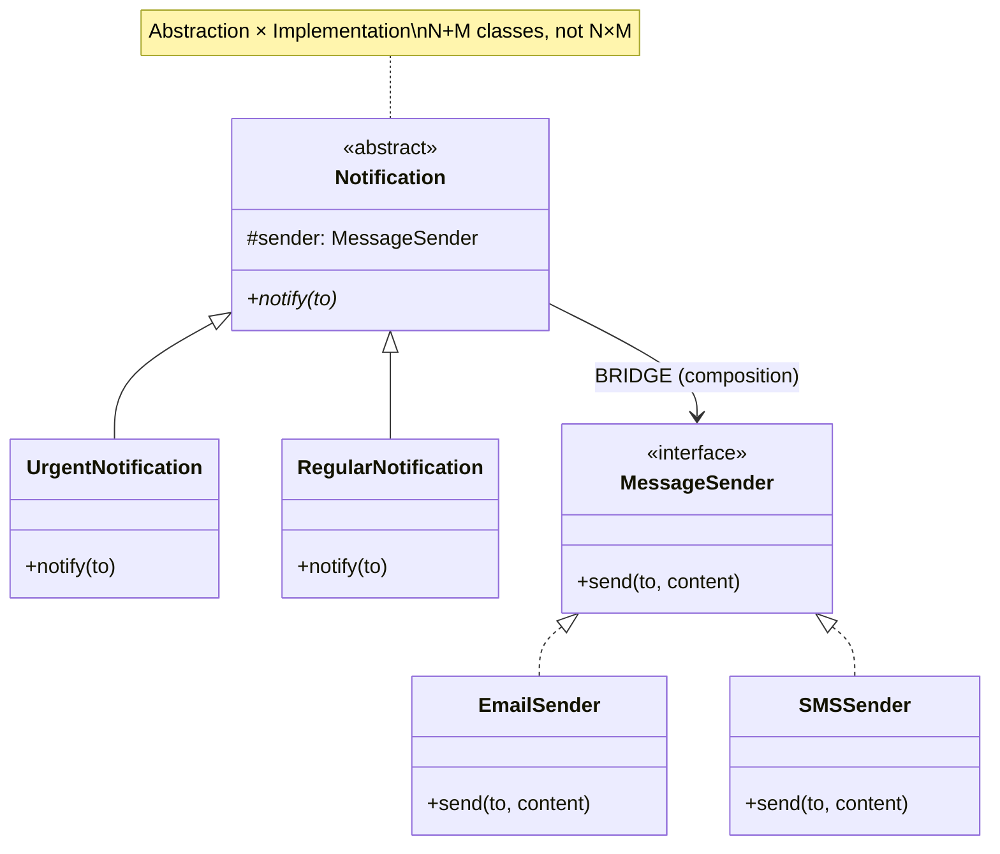

# Bridge Pattern

**One-liner:** Decouples an abstraction from its implementation by placing them in separate class hierarchies connected by composition, preventing N×M class explosion when two dimensions vary independently.

---

## Why This Exists — The Problem Without It

You need shapes that can be rendered in different ways. Without Bridge, every shape-renderer combination becomes its own class:

```java
// WITHOUT BRIDGE — every combination is a concrete class
// 2 shapes × 2 renderers = 4 classes today
class CircleVectorRenderer   extends Circle { ... }
class CircleRasterRenderer   extends Circle { ... }
class SquareVectorRenderer   extends Square { ... }
class SquareRasterRenderer   extends Square { ... }

// Add a Triangle?  +2 classes (one per renderer)
// Add an SVGRenderer? +2 classes (one per shape)
// 5 shapes × 4 renderers = 20 classes
// 10 shapes × 6 renderers = 60 classes
// N shapes × M renderers = N×M classes
// And every shape class contains rendering code — coupling two concerns that change at different rates.

class CircleVectorRenderer extends Circle {
    @Override
    public void draw() {
        // rendering logic tangled with shape logic in the SAME class
        System.out.println("VectorRenderer: drawing circle with SVG paths at radius=" + radius);
        // changing how vector rendering works = touch every CircleVector, SquareVector...
    }
}
```

The two dimensions — WHAT you draw (shape) and HOW you draw it (renderer) — are completely orthogonal but inheritance fuses them.

---

## Real-World Analogy

TV remotes and TV brands are two independent dimensions. A Samsung TV works with a Samsung remote AND a universal remote. A Sony TV works with a Sony remote AND the same universal remote. You do not need a SamsungSonyRemote class. The remote (abstraction) delegates to the TV's control API (implementation) through a known interface. Each dimension can change independently: add a new TV brand without new remote classes; add a new remote type without new TV brand classes.

---

## Mermaid Class Diagram



---

## The Fix — Clean Implementation

### Step 1 — Extract the implementation into its own hierarchy

```java
// IMPLEMENTATION INTERFACE — the "how to render" dimension
// This is what the Bridge pattern calls the "Implementor"
public interface Renderer {
    void renderCircle(double x, double y, double radius);
    void renderSquare(double x, double y, double side);
    // Add renderTriangle() here when you add Triangle — only one method added
}

// Concrete Implementation 1
public class VectorRenderer implements Renderer {
    @Override
    public void renderCircle(double x, double y, double radius) {
        System.out.printf("VectorRenderer: SVG <circle cx='%.1f' cy='%.1f' r='%.1f'/>%n",
                          x, y, radius);
    }
    @Override
    public void renderSquare(double x, double y, double side) {
        System.out.printf("VectorRenderer: SVG <rect x='%.1f' y='%.1f' width='%.1f' height='%.1f'/>%n",
                          x, y, side, side);
    }
}

// Concrete Implementation 2
public class RasterRenderer implements Renderer {
    @Override
    public void renderCircle(double x, double y, double radius) {
        System.out.printf("RasterRenderer: drawing %dx%d pixel circle at (%.0f,%.0f)%n",
                          (int)(radius * 2), (int)(radius * 2), x, y);
    }
    @Override
    public void renderSquare(double x, double y, double side) {
        System.out.printf("RasterRenderer: filling %dx%d pixel rectangle at (%.0f,%.0f)%n",
                          (int)side, (int)side, x, y);
    }
}

// Adding new renderer later: just add one class implementing Renderer
public class OpenGLRenderer implements Renderer {
    @Override
    public void renderCircle(double x, double y, double radius) {
        System.out.printf("OpenGL: glDrawCircle(%.2f, %.2f, %.2f)%n", x, y, radius);
    }
    @Override
    public void renderSquare(double x, double y, double side) {
        System.out.printf("OpenGL: glDrawRect(%.2f, %.2f, %.2f)%n", x, y, side);
    }
}
```

### Step 2 — Abstraction hierarchy holds a reference to the implementation

```java
// ABSTRACTION — the "what to draw" dimension
// Holds a reference to the Renderer (the bridge)
public abstract class Shape {

    // THE BRIDGE: composition, not inheritance
    protected final Renderer renderer;

    protected Shape(Renderer renderer) {
        this.renderer = renderer;
    }

    public abstract void draw();
    public abstract void resize(double factor);
}

// Refined Abstraction 1 — Circle knows its geometry, delegates rendering
public class Circle extends Shape {
    private double x, y, radius;

    public Circle(double x, double y, double radius, Renderer renderer) {
        super(renderer);  // Bridge passes the renderer through
        this.x = x; this.y = y; this.radius = radius;
    }

    @Override
    public void draw() {
        renderer.renderCircle(x, y, radius);  // delegation through the bridge
    }

    @Override
    public void resize(double factor) {
        radius *= factor;
    }
}

// Refined Abstraction 2 — Square knows its geometry, delegates rendering
public class Square extends Shape {
    private double x, y, side;

    public Square(double x, double y, double side, Renderer renderer) {
        super(renderer);
        this.x = x; this.y = y; this.side = side;
    }

    @Override
    public void draw() {
        renderer.renderSquare(x, y, side);
    }

    @Override
    public void resize(double factor) {
        side *= factor;
    }
}

// Adding new shape: add 1 class that extends Shape — NO renderer code needed
public class Triangle extends Shape {
    private final double x, y, base, height;

    public Triangle(double x, double y, double base, double height, Renderer renderer) {
        super(renderer);
        this.x = x; this.y = y; this.base = base; this.height = height;
    }

    @Override
    public void draw() {
        // Triangle calls existing renderer methods (or renderer adds renderTriangle)
        System.out.printf("Triangle at (%.1f,%.1f) base=%.1f height=%.1f via %s%n",
                          x, y, base, height, renderer.getClass().getSimpleName());
    }

    @Override
    public void resize(double factor) { /* adjust dimensions */ }
}
```

### Client — swaps implementation at construction time

```java
public class BridgeDemo {
    public static void main(String[] args) {

        // Same Shape abstraction, different Renderer implementations
        Renderer vector = new VectorRenderer();
        Renderer raster = new RasterRenderer();
        Renderer opengl = new OpenGLRenderer();

        Shape c1 = new Circle(5, 10, 3.5, vector);   // circle drawn as SVG
        Shape c2 = new Circle(5, 10, 3.5, raster);   // same circle, pixel-based
        Shape c3 = new Circle(5, 10, 3.5, opengl);   // same circle, GPU call

        Shape s1 = new Square(0, 0, 8,   vector);
        Shape s2 = new Square(0, 0, 8,   raster);

        List<Shape> allShapes = List.of(c1, c2, c3, s1, s2);
        allShapes.forEach(Shape::draw);

        System.out.println("\n--- After resize ---");
        allShapes.forEach(s -> { s.resize(2); s.draw(); });

        // COUNT BEFORE BRIDGE: 3 shapes × 3 renderers = 9 classes
        // COUNT AFTER  BRIDGE: 3 shape classes + 3 renderer classes = 6 classes
        // Adding a new shape:    +1 class (not +3)
        // Adding a new renderer: +1 class (not +3)
    }
}
```

### Production example: JDBC (THE canonical Java Bridge)

```java
// JDBC is the textbook Bridge implementation in the JDK

// Abstraction: java.sql.Connection, Statement, ResultSet
// Implementation: each JDBC driver (MySQL, PostgreSQL, Oracle, H2)

Connection conn = DriverManager.getConnection(
    "jdbc:postgresql://localhost/mydb", "user", "pass");
// ↑ returns a PostgreSQL driver implementation behind the standard Connection interface

// Your application code uses the abstraction — never the concrete driver
Statement stmt = conn.createStatement();
ResultSet rs   = stmt.executeQuery("SELECT * FROM users");
// This exact same code works with MySQL, H2, SQLite — swap the driver JAR

// Bridge: java.sql.* = Abstraction hierarchy
//         Driver implementations = Implementation hierarchy
// They vary independently:
//   - Add new SQL operations: extend java.sql.Connection (abstraction side)
//   - Add new database: write new Driver (implementation side)
```

---

## Class Diagram

```
Abstraction                         Implementor
Shape ----[renderer]------------>  «interface» Renderer
+ draw(): void                     + renderCircle(x,y,r): void
+ resize(factor): void             + renderSquare(x,y,s): void
    ^                                    ^           ^
    |                               VectorRenderer  RasterRenderer
Circle (Refined Abstraction)
Square (Refined Abstraction)

KEY: The "bridge" is the composition link between Shape and Renderer.
     Shape hierarchy varies independently from Renderer hierarchy.
     N shapes + M renderers = N + M classes, not N × M.
```

---

## Real Systems Using This

| System | Abstraction | Implementation |
|---|---|---|
| Java JDBC | `java.sql.Connection`, `Statement`, `ResultSet` | MySQL, PostgreSQL, Oracle, H2 drivers |
| Java AWT | `Component`, `Button`, `Frame` | Peer interfaces per OS (Windows, macOS, X11) |
| Spring `PlatformTransactionManager` | Transaction management API | JPA, JDBC, JTA, JMS implementations |
| SLF4J | `Logger`, `LoggerFactory` (abstraction) | log4j, logback, JUL implementations |
| Hibernate `Dialect` | HQL query abstraction | MySQL, PostgreSQL, Oracle SQL dialect |

---

## SDE-2/SDE-3 Interview Signals

| If interviewer says... | Think this pattern |
|---|---|
| "Two things vary independently — shapes and renderers, devices and protocols" | Bridge |
| "We're getting a class explosion from combining two orthogonal features" | Bridge |
| "Platform-independent abstraction that can plug into different implementations" | Bridge |
| "We want to switch database drivers without changing business logic" | Bridge (JDBC already does this) |
| "Compose an abstraction with different implementations at runtime" | Bridge |
| "Avoid inheritance when two hierarchies grow together" | Bridge |

---

## When to Use

- You identify TWO independently varying dimensions (shape × renderer, device × protocol, abstraction × implementation).
- Adding features to either dimension should not force changes in the other (Open/Closed Principle for both hierarchies).
- You want to switch implementations at runtime (inject different `Renderer` at construction time).
- The implementation should be hidden from client code and even from the abstraction's code (only the interface is known).

## When NOT to Use

- When only ONE dimension varies — Bridge is overkill. Use simple inheritance or Strategy.
- When the two dimensions are not truly independent — if adding a new shape requires a corresponding change in the renderer, they are coupled and Bridge does not help.
- When the class count is already small (2-3 classes) and growth is not anticipated — premature use of Bridge adds complexity without benefit.

---

## Trade-offs & Alternatives

| Aspect | Detail |
|---|---|
| Pro: Independent extensibility | Add new abstractions or implementations independently — O(N+M) not O(N×M) |
| Pro: Runtime switching | Pass a different Renderer to the same Shape constructor |
| Pro: Hides implementation | Client depends only on Abstraction interface |
| Con: Increased initial complexity | More classes and indirection for a simple problem |
| Con: Requires foresight | You must recognize the two dimensions upfront; retrofitting Bridge is harder than writing it from the start |

**Alternatives:**
- **Strategy:** Also uses composition to vary behavior. Strategy varies a single algorithm within ONE class. Bridge separates TWO class hierarchies. The structural difference is that Bridge has both an abstraction and an implementation hierarchy; Strategy has only the implementation hierarchy.
- **Adapter:** Bridge is designed upfront to separate concerns. Adapter retrofits an existing class to fit a new interface.
- **Abstract Factory:** Can create the correct Renderer for a given platform — often used alongside Bridge to instantiate the correct implementation.

---

## Common Interview Mistakes

1. **Confusing Bridge with Adapter.** Adapter is a retrofit (fixing interface mismatch after the fact). Bridge is a forward design (separating concerns from the start). The intent differs fundamentally.
2. **Confusing Bridge with Strategy.** Strategy varies one algorithm in one class. Bridge connects two full class hierarchies. In Bridge, the abstraction (Shape) has its own hierarchy; in Strategy, only the strategy interface has a hierarchy.
3. **Applying Bridge when only one dimension varies.** If shapes never change but renderers do — just use Strategy (inject the renderer). You do not need the full Bridge abstraction hierarchy.
4. **Asking "Do I have N × M combinations growing?"** — this is the key diagnostic question. If yes, Bridge. If no, do not force it.
5. **Not making the Implementor interface minimal and stable.** If `Renderer` changes every time you add a shape, the bridge is leaking concerns the wrong direction.

---

## Executable Example (Copy-Paste-Run)

```java
// File: BridgeDemo.java
// Run:  javac BridgeDemo.java && java BridgeDemo

public class BridgeDemo {

    // Implementor — HOW to send
    interface MessageSender {
        void send(String to, String content);
        String channel();
    }

    static class EmailSender implements MessageSender {
        public void send(String to, String content) {
            System.out.printf("  [EMAIL] To: %s | %s%n", to, content);
        }
        public String channel() { return "Email"; }
    }

    static class SMSSender implements MessageSender {
        public void send(String to, String content) {
            System.out.printf("  [SMS] To: %s | %s%n", to, content.substring(0, Math.min(50, content.length())));
        }
        public String channel() { return "SMS"; }
    }

    // Abstraction — WHAT to send
    static abstract class Notification {
        protected MessageSender sender;  // BRIDGE
        Notification(MessageSender sender) { this.sender = sender; }
        abstract void notify(String to);
    }

    static class UrgentNotification extends Notification {
        private final String message;
        UrgentNotification(MessageSender sender, String msg) { super(sender); message = msg; }
        void notify(String to) {
            System.out.println("[URGENT via " + sender.channel() + "]");
            sender.send(to, "URGENT: " + message);
            sender.send(to, "URGENT REMINDER: " + message); // sends twice
        }
    }

    static class RegularNotification extends Notification {
        private final String message;
        RegularNotification(MessageSender sender, String msg) { super(sender); message = msg; }
        void notify(String to) {
            System.out.println("[Regular via " + sender.channel() + "]");
            sender.send(to, message);
        }
    }

    public static void main(String[] args) {
        // 2 notification types × 2 senders = 4 combinations, only 4 classes (not N×M)
        new UrgentNotification(new EmailSender(), "Server is DOWN").notify("admin@company.com");
        System.out.println();
        new UrgentNotification(new SMSSender(), "Server is DOWN").notify("+91-9999");
        System.out.println();
        new RegularNotification(new EmailSender(), "Weekly report ready").notify("user@company.com");
    }
}
```

**Expected output:**
```
[URGENT via Email]
  [EMAIL] To: admin@company.com | URGENT: Server is DOWN
  [EMAIL] To: admin@company.com | URGENT REMINDER: Server is DOWN

[URGENT via SMS]
  [SMS] To: +91-9999 | URGENT: Server is DOWN
  [SMS] To: +91-9999 | URGENT REMINDER: Server is DOWN

[Regular via Email]
  [EMAIL] To: user@company.com | Weekly report ready
```

---

## Anti-Pattern

```java
// Without Bridge: N×M class explosion
class UrgentEmail extends Notification { }
class UrgentSMS extends Notification { }
class UrgentPush extends Notification { }
class UrgentWhatsApp extends Notification { }
class RegularEmail extends Notification { }
class RegularSMS extends Notification { }
class RegularPush extends Notification { }
class RegularWhatsApp extends Notification { }
// 2 types × 4 channels = 8 classes. Adding Slack = 2 more classes.
// With Bridge: 2 + 4 = 6 classes. Adding Slack = 1 class.
```

---

## Spring Boot Connection

```java
// JDBC IS Bridge: your code (abstraction) × DB driver (implementation)
// Spring's PlatformTransactionManager = Bridge
//   JpaTransactionManager, DataSourceTransactionManager, JtaTransactionManager
// All implement the same interface, swapped by config
```

---

## Which LLD Problems Use This

- [[../../examples/lld_notification_system]] — NotificationType × Channel

---

## Follow-up Questions

| Question | Answer |
|----------|--------|
| "Bridge vs Strategy?" | Bridge connects TWO hierarchies. Strategy varies ONE algorithm. |
| "Bridge vs Adapter?" | Bridge by design (forward). Adapter retrofit (backward). |
| "When to use Bridge?" | "Are N×M combinations growing?" → Yes = Bridge. |

---

## Interview Script

> "I see two dimensions varying independently — [notification type × channel]. Without Bridge, I'd need N×M classes. With Bridge, I connect them via composition: the Abstraction holds a reference to the Implementor. Adding a new channel = 1 class. Adding a new type = 1 class."

---

## Thread-Safety Note

```
Bridge itself is structural — no concurrency concern.
The implementor may need thread-safety (e.g., shared EmailSender).
```

---

## Complexity Analysis

| Scenario | Without Bridge | With Bridge |
|----------|---------------|------------|
| N types × M implementations | N×M classes | N+M classes |
| Add new implementation | N new classes | 1 new class |
| Add new abstraction | M new classes | 1 new class |

---

## Combines Well With

- **Abstract Factory:** Factory creates the right Implementor.
- **Strategy:** Bridge at structural level; Strategy at behavioral level.
- **Decorator:** Add behavior to Abstraction without changing Bridge.
- **Adapter:** Make existing class fit Implementor interface.

---

## Cheat Sheet

```
BRIDGE IN 5 LINES:
1. Identify TWO independently varying dimensions (What × How)
2. Extract "How" into an Implementor interface + concrete implementations
3. Abstraction class holds an Implementor reference (composition = the bridge)
4. Abstraction subclasses (Refined Abstractions) delegate "how" to the implementor
5. Client injects the desired Implementor into the Abstraction constructor

N + M classes instead of N × M. Adding a shape = 1 class. Adding a renderer = 1 class.
Key question: "Are N×M combinations growing?" → Bridge.
vs Adapter: Bridge is by design (forward). Adapter is retrofit (backward).
vs Strategy: Strategy varies ONE algorithm. Bridge connects TWO full hierarchies.
JDBC is the Java standard library Bridge: your code × any DB driver.
```

---
---

# ChatGPT
## Bridge Pattern

Let's start with pure intuition first — no code.

---

## The Problem — Class Explosion

You're building a UI library. You have **shapes** and **colours**.

Without Bridge, you think like this:

```
RedCircle
BlueCircle
GreenCircle
RedSquare
BlueSquare
GreenSquare
RedTriangle
BlueTriangle
GreenTriangle
```

3 shapes × 3 colours = **9 classes**. Add 1 new colour → 3 more classes. Add 1 new shape → 3 more classes. With 5 shapes and 10 colours you need **50 classes**. This is the explosion.

The root cause — you're mixing two **independent dimensions** (shape + colour) into one hierarchy.

---

## The Insight

Shape and colour change for **completely different reasons**:

- New shape added → colour logic shouldn't care
- New colour added → shape logic shouldn't care

So **separate them into two hierarchies** and connect them with composition. That connection is the **bridge**.

```
Shape hierarchy          Colour hierarchy
──────────────           ────────────────
Circle    ────────────►  Red
Square    (bridge)       Blue
Triangle               Green
```

Now: 3 shapes + 3 colours = **6 classes**. Add 1 colour → 1 class. Add 1 shape → 1 class. They never interfere with each other.

---

## UMLThe key thing to notice — `Shape` holds a reference to `Colour`. That reference is the bridge. Two completely independent hierarchies, connected by composition.

---

## Full Java Code — Step by Step

**Step 1 — The implementation side (Colour):**

```java
// The interface on the implementation side
interface Colour {
    String apply();
}

// Concrete implementations — add as many as you want
class Red implements Colour {
    public String apply() { return "red"; }
}

class Blue implements Colour {
    public String apply() { return "blue"; }
}

class Green implements Colour {
    public String apply() { return "green"; }
}
```

---

**Step 2 — The abstraction side (Shape):**

```java
// Abstract class — holds the bridge reference
abstract class Shape {
    protected Colour colour;    // ← this is the bridge

    public Shape(Colour colour) {
        this.colour = colour;
    }

    abstract void draw();
}

// Concrete shapes — each uses colour.apply() but doesn't care which colour
class Circle extends Shape {
    private int radius;

    public Circle(int radius, Colour colour) {
        super(colour);
        this.radius = radius;
    }

    public void draw() {
        System.out.println(
            "Circle | radius=" + radius + " | colour=" + colour.apply()
        );
    }
}

class Square extends Shape {
    private int side;

    public Square(int side, Colour colour) {
        super(colour);
        this.side = side;
    }

    public void draw() {
        System.out.println(
            "Square | side=" + side + " | colour=" + colour.apply()
        );
    }
}
```

---

**Step 3 — Client mixes freely:**

```java
public class Main {
    public static void main(String[] args) {

        Shape redCircle   = new Circle(10, new Red());
        Shape blueSquare  = new Square(5,  new Blue());
        Shape greenCircle = new Circle(7,  new Green());

        redCircle.draw();    // Circle | radius=10 | colour=red
        blueSquare.draw();   // Square | side=5   | colour=blue
        greenCircle.draw();  // Circle | radius=7  | colour=green

        // swap colour at runtime — just pass a different implementation
        Shape dynamicShape = new Circle(10, new Blue());
        dynamicShape.draw(); // Circle | radius=10 | colour=blue
    }
}
```

Adding a `Triangle`? One class, extends `Shape`. Adding `Purple`? One class, implements `Colour`. Neither side touches the other.

---

## Real Backend Example — Notification System

This is the example interviewers love because it maps directly to real systems.

Two independent dimensions:

- **Notification type** — Alert, Promo, Reminder (abstraction side)
- **Delivery channel** — Email, SMS, Push (implementation side)

```java
// IMPLEMENTATION SIDE — delivery channels
interface MessageSender {
    void send(String userId, String message);
}

class EmailSender implements MessageSender {
    public void send(String userId, String message) {
        System.out.println("[EMAIL] → " + userId + ": " + message);
    }
}

class SmsSender implements MessageSender {
    public void send(String userId, String message) {
        System.out.println("[SMS] → " + userId + ": " + message);
    }
}

class PushSender implements MessageSender {
    public void send(String userId, String message) {
        System.out.println("[PUSH] → " + userId + ": " + message);
    }
}

// ABSTRACTION SIDE — notification types
abstract class Notification {
    protected MessageSender sender;   // bridge

    public Notification(MessageSender sender) {
        this.sender = sender;
    }

    abstract void notify(String userId, String message);
}

class AlertNotification extends Notification {
    public AlertNotification(MessageSender sender) {
        super(sender);
    }

    public void notify(String userId, String message) {
        sender.send(userId, "[ALERT] " + message);
    }
}

class PromoNotification extends Notification {
    public PromoNotification(MessageSender sender) {
        super(sender);
    }

    public void notify(String userId, String message) {
        sender.send(userId, "[PROMO] " + message);
    }
}

class ReminderNotification extends Notification {
    public ReminderNotification(MessageSender sender) {
        super(sender);
    }

    public void notify(String userId, String message) {
        sender.send(userId, "[REMINDER] " + message);
    }
}

// Client — mix any type with any channel freely
public class Main {
    public static void main(String[] args) {
        Notification alertByEmail  = new AlertNotification(new EmailSender());
        Notification promoSms      = new PromoNotification(new SmsSender());
        Notification reminderPush  = new ReminderNotification(new PushSender());

        alertByEmail.notify("user1",  "Your payment failed");
        promoSms.notify("user2",      "50% off this weekend!");
        reminderPush.notify("user3",  "Your appointment is tomorrow");
    }
}

// Output:
// [EMAIL] → user1: [ALERT] Your payment failed
// [SMS]   → user2: [PROMO] 50% off this weekend!
// [PUSH]  → user3: [REMINDER] Your appointment is tomorrow
```

Adding WhatsApp? One new `WhatsAppSender` class. Adding a `SystemAlert` type? One new class extending `Notification`. Zero changes anywhere else.

---

## Where Bridge Appears in Real Java / Spring

```java
// 1. JDBC — Bridge between your code and any database
Connection conn = DriverManager.getConnection(url);
// Your code uses java.sql.Connection (abstraction)
// Under the hood: MySQLConnection, PostgresConnection, OracleConnection (implementations)
// Swap databases → change the driver, your code unchanged

// 2. SLF4J logging
Logger logger = LoggerFactory.getLogger(MyClass.class);
logger.info("hello");
// Abstraction: SLF4J Logger interface
// Implementation: Log4j, Logback, JUL — swappable without touching code

// 3. Spring Data repositories
public interface UserRepository extends JpaRepository<User, Long> { }
// Abstraction: your repository interface
// Implementation: Spring generates JPA/JDBC/MongoDB impl at runtime
```

---

## Bridge vs Adapter vs Strategy — The Classic Confusion

||Bridge|Adapter|Strategy|
|---|---|---|---|
|**Intent**|Separate two dimensions upfront|Fix incompatibility after the fact|Swap algorithms at runtime|
|**When designed**|Before building|After systems exist|Anytime|
|**Hierarchies**|Two parallel ones|Wraps one existing class|One interface, many impls|
|**Analogy**|Architect separating structure from finish|Travel plug|Choosing a sorting algorithm|

The clearest distinction — **Bridge is designed in**, Adapter is **retrofitted in**.

---

## Trade-offs to Mention in Interviews

**Pros:**

- Eliminates class explosion when two dimensions vary independently
- Both hierarchies can evolve independently — true Open/Closed
- Implementation can be switched at runtime by passing a different object

**Cons:**

- Adds indirection — overkill if only one dimension varies
- Slightly more complex upfront design
- If the two dimensions are actually coupled, Bridge makes things worse not better

---

## One-line SDE-2 Summary

> _"Bridge separates an abstraction from its implementation into two independent hierarchies connected by composition — eliminating class explosion when two dimensions vary independently, and following both Open/Closed and composition-over-inheritance principles."_

---

Ready for **Composite** next?