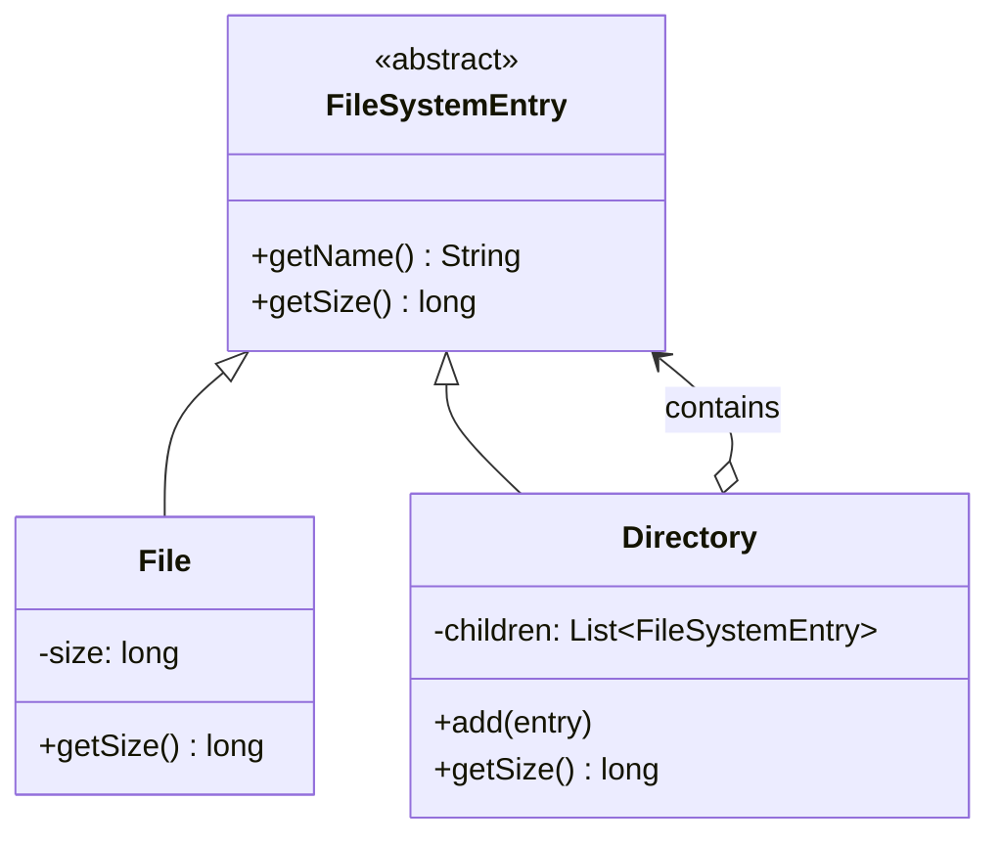

# Composite Pattern

**One-liner:** Composes objects into tree structures so that clients can treat individual objects and compositions of objects uniformly, eliminating `instanceof` branches.

---

## Why This Exists — The Problem Without It

You are building a UI framework with `Button` and `Panel` (which contains other components). Without Composite, every operation that traverses the tree needs explicit type checks:

```java
// PAINFUL: Client must know the difference between leaf and composite
// These instanceof chains appear in EVERY method that touches the UI tree

public void renderAll(Object component) {
    if (component instanceof Button btn) {
        btn.draw();
    } else if (component instanceof TextBox tb) {
        tb.draw();
    } else if (component instanceof Panel panel) {
        // must know Panel has children
        panel.draw();  // draws itself
        for (Object child : panel.getChildren()) {
            renderAll(child);  // recursive, but type-unsafe
        }
    } else if (component instanceof Window win) {
        win.draw();
        for (Object child : win.getComponents()) {
            renderAll(child);  // different method name than Panel!
        }
    }
    // Add new component type? Touch this method AND every similar method
}

public int getTotalWidth(Object component) {
    // Same instanceof nightmare repeated for width calculation
    if (component instanceof Button btn) return btn.getWidth();
    if (component instanceof Panel panel) {
        return panel.getChildren().stream()
                    .mapToInt(c -> getTotalWidth(c))   // same problem, recursed
                    .sum();
    }
    throw new IllegalArgumentException("Unknown type: " + component.getClass());
}
// Adding a new component type = update every traversal function in the codebase.
```

---

## Real-World Analogy

A file system: you can copy a single file or an entire folder. Copying a folder copies everything inside it — including subfolders, which recursively copy their contents. The copy command does not know (or care) whether its argument is a file or a folder. Both respond to `copy()`. This uniform treatment is Composite.

Similarly, an organization chart: you can calculate the salary of an individual employee or the total salary bill of a department (which contains teams, which contain employees). Same `getSalary()` method, different scales.

---

## The Fix — Clean Implementation

### Example 1: UI Component Tree

```java
// ---- COMPONENT INTERFACE: every operation that makes sense for BOTH leaf and composite ----
public interface UIComponent {
    void render();
    int getWidth();
    int getHeight();
    void setEnabled(boolean enabled);
    String getName();
}

// ---- LEAF: no children, implements all operations directly ----

public class Button implements UIComponent {
    private final String name;
    private final int width;
    private final int height;
    private boolean enabled = true;

    public Button(String name, int width, int height) {
        this.name   = name;
        this.width  = width;
        this.height = height;
    }

    @Override public void render() {
        System.out.printf("  [Button: %s %dx%d enabled=%b]%n", name, width, height, enabled);
    }
    @Override public int  getWidth()              { return width; }
    @Override public int  getHeight()             { return height; }
    @Override public void setEnabled(boolean e)   { this.enabled = e; }
    @Override public String getName()             { return name; }
}

public class TextBox implements UIComponent {
    private final String name;
    private final int width;
    private final int height;
    private boolean enabled = true;

    public TextBox(String name, int width, int height) {
        this.name = name; this.width = width; this.height = height;
    }

    @Override public void render() {
        System.out.printf("  [TextBox: %s %dx%d enabled=%b]%n", name, width, height, enabled);
    }
    @Override public int  getWidth()              { return width; }
    @Override public int  getHeight()             { return height; }
    @Override public void setEnabled(boolean e)   { this.enabled = e; }
    @Override public String getName()             { return name; }
}

// ---- COMPOSITE: has children, delegates operations to them ----

public class Panel implements UIComponent {
    private final String name;
    private final List<UIComponent> children = new ArrayList<>();
    private boolean enabled = true;

    public Panel(String name) { this.name = name; }

    // Management methods — only Composite has these
    public void add(UIComponent component)    { children.add(component); }
    public void remove(UIComponent component) { children.remove(component); }
    public List<UIComponent> getChildren()    { return Collections.unmodifiableList(children); }

    @Override
    public void render() {
        System.out.println("[Panel: " + name + "]");
        children.forEach(UIComponent::render);  // uniform — no type checks
    }

    @Override
    public int getWidth() {
        return children.stream().mapToInt(UIComponent::getWidth).sum();
    }

    @Override
    public int getHeight() {
        return children.stream().mapToInt(UIComponent::getHeight).max().orElse(0);
    }

    @Override
    public void setEnabled(boolean enabled) {
        this.enabled = enabled;
        children.forEach(c -> c.setEnabled(enabled));  // propagates to ALL children
    }

    @Override public String getName() { return name; }
}
```

### Client code — no instanceof, no type knowledge

```java
public class UIDemo {
    public static void main(String[] args) {

        // Leaf nodes
        Button  loginBtn   = new Button("Login",    100, 40);
        Button  cancelBtn  = new Button("Cancel",   100, 40);
        TextBox usernameBox = new TextBox("Username", 200, 30);
        TextBox passwordBox = new TextBox("Password", 200, 30);

        // Composites — panels containing components
        Panel formPanel = new Panel("LoginForm");
        formPanel.add(usernameBox);
        formPanel.add(passwordBox);

        Panel buttonPanel = new Panel("ButtonRow");
        buttonPanel.add(loginBtn);
        buttonPanel.add(cancelBtn);

        // Top-level composite — panel containing panels
        Panel dialog = new Panel("LoginDialog");
        dialog.add(formPanel);
        dialog.add(buttonPanel);

        // Client calls the same method regardless of structure
        System.out.println("=== RENDER ===");
        dialog.render();    // renders entire tree recursively

        System.out.println("\n=== DISABLE (propagates to all children) ===");
        dialog.setEnabled(false);  // disables every button and text box in tree
        dialog.render();
    }
}
```

### Example 2: Organization Hierarchy (common in interviews)

```java
// Leaf and Composite share this interface
public interface OrgNode {
    String getName();
    BigDecimal getSalaryBudget();   // leaf: own salary; composite: sum of all under it
    int        getHeadcount();      // leaf: 1; composite: sum of all under it
    void       printTree(String indent);
}

// Leaf: individual contributor
public class Employee implements OrgNode {
    private final String     name;
    private final String     role;
    private final BigDecimal salary;

    public Employee(String name, String role, BigDecimal salary) {
        this.name = name; this.role = role; this.salary = salary;
    }

    @Override public String     getName()          { return name; }
    @Override public BigDecimal getSalaryBudget()  { return salary; }
    @Override public int        getHeadcount()     { return 1; }

    @Override
    public void printTree(String indent) {
        System.out.printf("%s- %s (%s): $%.0f%n", indent, name, role, salary);
    }
}

// Composite: manager with direct reports (who may themselves be managers)
public class Manager implements OrgNode {
    private final String     name;
    private final String     role;
    private final BigDecimal salary;
    private final List<OrgNode> reports = new ArrayList<>();

    public Manager(String name, String role, BigDecimal salary) {
        this.name = name; this.role = role; this.salary = salary;
    }

    public void addReport(OrgNode node) { reports.add(node); }

    @Override public String getName() { return name; }

    @Override
    public BigDecimal getSalaryBudget() {
        BigDecimal total = salary;
        for (OrgNode report : reports) {
            total = total.add(report.getSalaryBudget()); // recursive, uniform call
        }
        return total;
    }

    @Override
    public int getHeadcount() {
        return 1 + reports.stream().mapToInt(OrgNode::getHeadcount).sum();
    }

    @Override
    public void printTree(String indent) {
        System.out.printf("%s+ %s (%s): $%.0f [team budget: $%.0f, headcount: %d]%n",
            indent, name, role, salary, getSalaryBudget(), getHeadcount());
        reports.forEach(r -> r.printTree(indent + "  "));
    }
}

// Client
public class OrgDemo {
    public static void main(String[] args) {
        Employee alice = new Employee("Alice", "Engineer",  new BigDecimal("120000"));
        Employee bob   = new Employee("Bob",   "Engineer",  new BigDecimal("115000"));
        Employee carol = new Employee("Carol", "Designer",  new BigDecimal("110000"));

        Manager  dave  = new Manager("Dave",  "EngManager", new BigDecimal("160000"));
        dave.addReport(alice);
        dave.addReport(bob);

        Manager  eve   = new Manager("Eve",   "VP Eng",     new BigDecimal("220000"));
        eve.addReport(dave);
        eve.addReport(carol);

        System.out.println("=== ORG TREE ===");
        eve.printTree("");
        System.out.println("\nTotal company budget: $" + eve.getSalaryBudget());
        System.out.println("Total headcount: " + eve.getHeadcount());
    }
}
```

---

## Class Diagram

```
«interface»
UIComponent
+ render(): void
+ getWidth(): int
+ setEnabled(boolean): void
    ^                   ^
    |                   |
Button (Leaf)        Panel (Composite)
TextBox (Leaf)       - children: List<UIComponent>
                     + add(UIComponent)
                     + remove(UIComponent)
                     + render(): delegates to children

Tree structure: Panel contains UIComponents (which may be Buttons or other Panels).
Depth is unlimited and arbitrary — client doesn't care.
```

---

## Real Systems Using This

| System | Composite usage |
|---|---|
| Java AWT/Swing | `Container` (composite) extends `Component` (leaf). `JPanel` contains `JButton`, `JTextField`, etc. |
| HTML DOM | `Element` nodes contain other `Element` nodes or `Text` leaf nodes. `document.querySelectorAll()` works uniformly |
| Spring `CompositePropertySource` | Aggregates multiple `PropertySource` instances; `getProperty()` queries each in order |
| Apache Ant / Maven build system | Build targets contain sub-tasks; executing a target executes all sub-tasks recursively |
| Java `CompositeName` (JNDI) | Hierarchical naming — name components nest arbitrarily |
| XML/JSON parsers (Jackson `JsonNode`) | `ObjectNode` / `ArrayNode` contain other `JsonNode` instances; leaf nodes hold values |

---

## SDE-2/SDE-3 Interview Signals

| If interviewer says... | Think this pattern |
|---|---|
| "We need to treat files and folders the same way" | Composite |
| "Design a hierarchical menu system" | Composite |
| "Calculate the total cost of an order with line items and bundles" | Composite |
| "Build an expression evaluator (literals and operators)" | Composite |
| "Design an org chart where teams can contain sub-teams" | Composite |
| "Avoid `instanceof` checks when traversing a tree" | Composite |

---

## When to Use

- You have a tree-like recursive structure (file system, UI hierarchy, org chart, expression tree, bill of materials).
- You want client code to treat individual objects and compositions uniformly — eliminating type checks.
- The structure is open-ended: leaves and composites can nest arbitrarily deeply.

## When NOT to Use

- When the tree is flat with only one level — just use a `List`.
- When leaf and composite operations are so different that a shared interface is a lie (forces leaves to throw `UnsupportedOperationException` for child management).
- When the constraint that leaves cannot have children is important enough to enforce at compile time — the uniform interface hides this fact.

---

## Trade-offs & Alternatives

| Aspect | Detail |
|---|---|
| Pro: Uniformity | Client code has zero `instanceof`. Adding new component types does not change client code |
| Pro: Recursive simplicity | Operations like `getSalaryBudget()` are expressed naturally as recursion |
| Con: Overly general interface | If you put `add()`/`remove()` on the Component interface, leaves must implement them (throw or return empty) — awkward |
| Con: Type safety | Cannot enforce at compile time that only composites have children |
| Con: Parent references | Adding a `parent` pointer for upward traversal creates circular references — manage carefully (use `WeakReference` or avoid) |

**Alternatives:**
- **Visitor:** Traverse the Composite tree while keeping each node's `visit()` implementations separate. Composite + Visitor is a classic combination.
- **Iterator:** Provide a single iterator over the whole tree without exposing the structure. Use with Composite for external traversal.
- **Chain of Responsibility:** Linear chain vs tree structure. CoR is a degenerate Composite.

---

## Common Interview Mistakes

1. **Putting `add()` and `remove()` on the Component interface.** Purists keep them only on Composite (better type safety). Pragmatists put them on Component with default throw (better uniformity). Know both positions and their trade-offs — this is a real interview question.
2. **Adding parent back-references carelessly.** `child.parent = this` in `add()` creates potential cycles if a node is added to multiple composites. Enforce single-parent invariants or use a separate graph structure.
3. **Making the Composite stateful in ways that break recursion.** Caching `getHeadcount()` without invalidation on structural change causes stale results. Either recalculate or invalidate the cache on `add()`/`remove()`.
4. **Confusing Composite with Decorator.** Both are recursive structures. Composite: tree with multiple children — represents part-whole hierarchies. Decorator: one wrapped object — adds behavior. Very different purposes.
5. **Not implementing `equals()`/`hashCode()` on nodes when using `remove()`.** `List.remove(Object)` uses `equals()` — forgetting this causes silent failures.

---

## Mermaid Class Diagram



---

## Executable Example (Copy-Paste-Run)

```java
// File: CompositeDemo.java
// Run:  javac CompositeDemo.java && java CompositeDemo

import java.util.*;

public class CompositeDemo {

    static abstract class FSEntry {
        protected String name;
        FSEntry(String name) { this.name = name; }
        abstract long getSize();
        void print(String indent) { System.out.printf("%s%s (%d bytes)%n", indent, name, getSize()); }
    }

    static class File extends FSEntry {
        private final long size;
        File(String name, long size) { super(name); this.size = size; }
        long getSize() { return size; }
    }

    static class Directory extends FSEntry {
        private final List<FSEntry> children = new ArrayList<>();
        Directory(String name) { super(name); }
        void add(FSEntry e) { children.add(e); }
        long getSize() { return children.stream().mapToLong(FSEntry::getSize).sum(); }

        void print(String indent) {
            System.out.printf("%s%s/ (%d bytes)%n", indent, name, getSize());
            children.forEach(c -> c.print(indent + "  "));
        }
    }

    public static void main(String[] args) {
        Directory root = new Directory("project");
        Directory src = new Directory("src");
        src.add(new File("Main.java", 2048));
        src.add(new File("Utils.java", 1024));

        Directory docs = new Directory("docs");
        docs.add(new File("README.md", 512));

        root.add(src);
        root.add(docs);
        root.add(new File("pom.xml", 256));

        System.out.println("=== File Tree ===");
        root.print("");
        // project/ (3840 bytes)
        //   src/ (3072 bytes)
        //     Main.java (2048 bytes)
        //     Utils.java (1024 bytes)
        //   docs/ (512 bytes)
        //     README.md (512 bytes)
        //   pom.xml (256 bytes)

        System.out.println("\n=== Total size ===");
        System.out.println("root.getSize() = " + root.getSize() + " bytes");
        System.out.println("src.getSize() = " + src.getSize() + " bytes");
    }
}
```

---

## Anti-Pattern

```java
// Without Composite — instanceof checks everywhere
long totalSize(Object entry) {
    if (entry instanceof File f) return f.getSize();
    if (entry instanceof Directory d) {
        long sum = 0;
        for (Object child : d.getChildren()) sum += totalSize(child); // recursive instanceof
        return sum;
    }
    throw new IllegalArgumentException("Unknown type");
}
// Every new operation (delete, search, permissions) needs another instanceof tree
```

---

## Spring Boot Connection

```java
// Spring's CompositePropertySource — multiple property sources as one
CompositePropertySource composite = new CompositePropertySource("config");
composite.addPropertySource(new MapPropertySource("defaults", defaults));
composite.addPropertySource(new MapPropertySource("overrides", overrides));
// composite.getProperty("key") searches both — treated as ONE source
```

---

## Which LLD Problems Use This

- [[../../examples/lld_file_system]] — File + Directory tree (exact Composite)
- [[../../examples/lld_notification_system]] — CompositeNotification = send to group

---

## Follow-up Questions

| Question | Answer |
|----------|--------|
| "Where do add()/remove() live?" | Composite only (type-safe) OR Component (uniform but unsafe for leaf). |
| "How to traverse?" | Iterator pattern — DFS/BFS behind `Iterator<T>`. |
| "Composite vs Decorator?" | Composite = tree (many children). Decorator = chain (one wrapped). |

---

## Interview Script

> "I see a tree structure where [files/directories, components/panels, tasks/subtasks] need to be treated uniformly. I'll use Composite — both leaf and composite implement the same interface. `getSize()` on a Directory recursively sums children. Client code never uses instanceof."

---

## Thread-Safety Note

```
Children list: use CopyOnWriteArrayList for concurrent read, synchronized for write.
Recursive getSize(): if tree is modified during traversal, snapshot children first.
```

---

## Complexity Analysis

| Scenario | Without Composite | With Composite |
|----------|------------------|---------------|
| New operation on tree | instanceof checks per type | Add method to Component interface |
| Client code | Must know leaf vs composite | Treats both uniformly |
| Nested depth | Manual recursion | Built into Composite.getSize() |

---

## Combines Well With

- **Visitor:** New operations on tree without modifying node classes.
- **Iterator:** DFS/BFS traversal behind Iterator interface.
- **Decorator:** Add behavior to entire tree transparently.
- **Flyweight:** Shared leaf nodes in large trees.
- **Command:** Macro = Composite of commands.

---

## Cheat Sheet

```
COMPOSITE IN 5 LINES:
1. Define Component interface with ALL operations meaningful to BOTH leaf and composite
2. Leaf implements Component — no children, implements operations directly
3. Composite implements Component — holds List<Component>, delegates operations recursively
4. Client accepts Component everywhere — no instanceof, no type checks
5. Build any tree depth: Composite can contain Leaves AND other Composites

Classic examples: file/folder, UI widget tree, org chart, expression tree, XML DOM.
vs Decorator: Composite = tree (multiple children). Decorator = chain (one wrapped object).
Interview trap: where do add()/remove() live? Component (uniform) or Composite (type-safe)?
Red flag: instanceof checks in client traversal code = missing Composite pattern.
```


---
---

# ChatGPT

# Composite Design Pattern (Java)

## Definition

> The **Composite Pattern** is a structural design pattern that lets you treat **individual objects and groups of objects in the same way**.

It is used when objects form a **tree structure (part–whole hierarchy)**.

In simple terms:

```

Leaf object → single element  
Composite object → group of elements

```

Both are treated **uniformly**.

---

# Real-Life Example

## File System

A file system contains:

```

Folder  
├── File  
├── File  
└── Folder  
├── File  
└── File

```

Here:

| Element | Type |
|--------|------|
| File | Leaf |
| Folder | Composite |

But both are treated the same way:

```

open()  
delete()  
display()

```

You can perform operations on **files and folders using the same interface**.

---

# Core Idea

Composite pattern builds **tree-like structures**.

```

Component  
|  
+---- Leaf  
|  
+---- Composite  
|  
+---- Leaf  
+---- Leaf

```

---

# Example Problem

Let's build a **company hierarchy**.

```

CEO  
├── Manager 1  
│ ├── Developer  
│ └── Developer  
│  
└── Manager 2  
├── Developer  
└── Developer

```

Each employee can have:

```

name  
position  
subordinates

````

---

# Step 1 — Component Interface

```java
interface Employee {
    void showDetails();
}
````

Both **individual employees and managers** will implement this.

---

# Step 2 — Leaf Class (Developer)

```java
class Developer implements Employee {

    private String name;

    public Developer(String name) {
        this.name = name;
    }

    public void showDetails() {
        System.out.println("Developer: " + name);
    }
}
```

This represents a **single employee**.

---

# Step 3 — Composite Class (Manager)

```java
import java.util.*;

class Manager implements Employee {

    private String name;
    private List<Employee> subordinates = new ArrayList<>();

    public Manager(String name) {
        this.name = name;
    }

    public void addEmployee(Employee emp) {
        subordinates.add(emp);
    }

    public void removeEmployee(Employee emp) {
        subordinates.remove(emp);
    }

    public void showDetails() {

        System.out.println("Manager: " + name);

        for(Employee emp : subordinates) {
            emp.showDetails();
        }
    }
}
```

Manager can contain:

```
Developers
Managers
```

Both implement the same interface.

---

# Step 4 — Client Code

```java
public class Main {

    public static void main(String[] args) {

        Developer dev1 = new Developer("Alice");
        Developer dev2 = new Developer("Bob");

        Manager manager = new Manager("John");
        manager.addEmployee(dev1);
        manager.addEmployee(dev2);

        Manager ceo = new Manager("Robert");
        ceo.addEmployee(manager);

        ceo.showDetails();
    }
}
```

---

# Output

```
Manager: Robert
Manager: John
Developer: Alice
Developer: Bob
```

---

# Structure Visualization

```
Manager (CEO)
      |
      +---- Manager
             |
             +---- Developer
             +---- Developer
```

---

# Execution Flow

```
ceo.showDetails()
      |
      v
Print CEO
      |
Call manager.showDetails()
      |
Print manager
      |
Call dev.showDetails()
```

Everything works **recursively**.

---

# Why Use Composite Pattern

Without composite pattern:

```
processFile()
processFolder()
```

Separate logic needed.

With composite pattern:

```
process(FileOrFolder)
```

Both handled **uniformly**.

---

# Real-World Uses

Composite pattern is used in:

- **File systems**
    
- **GUI component trees**
    
- **Organization hierarchies**
    
- **HTML DOM**
    
- **Graphics systems**
    

Example:

```
HTML
   ├── Head
   └── Body
         ├── Div
         └── Paragraph
```

All are **nodes**.

---

# Advantages

- Treat individual and group objects the same
    
- Simplifies client code
    
- Natural representation of tree structures
    
- Easy to extend
    

---

# Disadvantages

- Hard to restrict components sometimes
    
- Can make system overly generic
    

---

# Visual UML

```
        Component
            |
      +-----+-----+
      |           |
    Leaf      Composite
                   |
                Children
```

---

# One-Line Interview Answer

The **Composite Pattern** allows you to treat individual objects and compositions of objects uniformly by organizing them into tree structures.

In the **Composite Design Pattern**, there are two common ways to design the structure of classes:

1. **Transparent (Component – uniform but unsafe for leaf)**
    
2. **Safe (Composite only – type-safe)**
    

These refer to **where the child-management methods are placed** (like `add()`, `remove()`, `getChild()`).

---

# 1. Component Approach (Uniform but Unsafe for Leaf)

In this design, **all operations are placed in the base `Component` interface**, including child-management methods.

### Structure

```
Component
 ├── Leaf
 └── Composite
```

### Example

```java
interface Component {
    void operation();
    void add(Component c);
    void remove(Component c);
}

class Leaf implements Component {
    public void operation() {
        System.out.println("Leaf operation");
    }

    public void add(Component c) {
        throw new UnsupportedOperationException();
    }

    public void remove(Component c) {
        throw new UnsupportedOperationException();
    }
}

class Composite implements Component {
    List<Component> children = new ArrayList<>();

    public void operation() {
        for (Component c : children) {
            c.operation();
        }
    }

    public void add(Component c) {
        children.add(c);
    }

    public void remove(Component c) {
        children.remove(c);
    }
}
```

### Why it's called **Uniform**

Because **client code treats leaf and composite the same**.

Example:

```java
Component c = new Leaf();
c.operation();
```

### Problem (Unsafe)

A leaf **should not have children**, but it still has `add()` and `remove()` methods.  
Calling them causes runtime errors.

---

# 2. Composite Only (Type-Safe Approach)

Here, **child-management methods exist only in the Composite class**, not in the base component.

### Structure

```
Component
 ├── Leaf
 └── Composite (has add/remove)
```

### Example

```java
interface Component {
    void operation();
}

class Leaf implements Component {
    public void operation() {
        System.out.println("Leaf operation");
    }
}

class Composite implements Component {
    List<Component> children = new ArrayList<>();

    public void operation() {
        for (Component c : children) {
            c.operation();
        }
    }

    public void add(Component c) {
        children.add(c);
    }

    public void remove(Component c) {
        children.remove(c);
    }
}
```

### Why it's **Type-Safe**

A leaf **cannot add children**, because it doesn't have `add()` or `remove()` methods.

Compiler prevents mistakes.

Example:

```java
Leaf leaf = new Leaf();
leaf.add(new Leaf()); // Compile-time error
```

---

# Key Difference

|Approach|Where `add/remove` methods exist|Advantage|Disadvantage|
|---|---|---|---|
|Component (Uniform)|In `Component` interface|Simpler client code|Leaf gets invalid methods|
|Composite Only (Type-safe)|Only in `Composite`|Safer design|Client must know if it's composite|

---

✅ **Simple way to remember**

- **Uniform design** → easier for client but less safe
    
- **Type-safe design** → safer but slightly less flexible
    

---

If you want, I can also show:

- **Real-world example of Composite Pattern (File System example)**
    
- **UML diagram of Composite Pattern**
    
- **A very simple 10-line version often used in exams/interviews**.