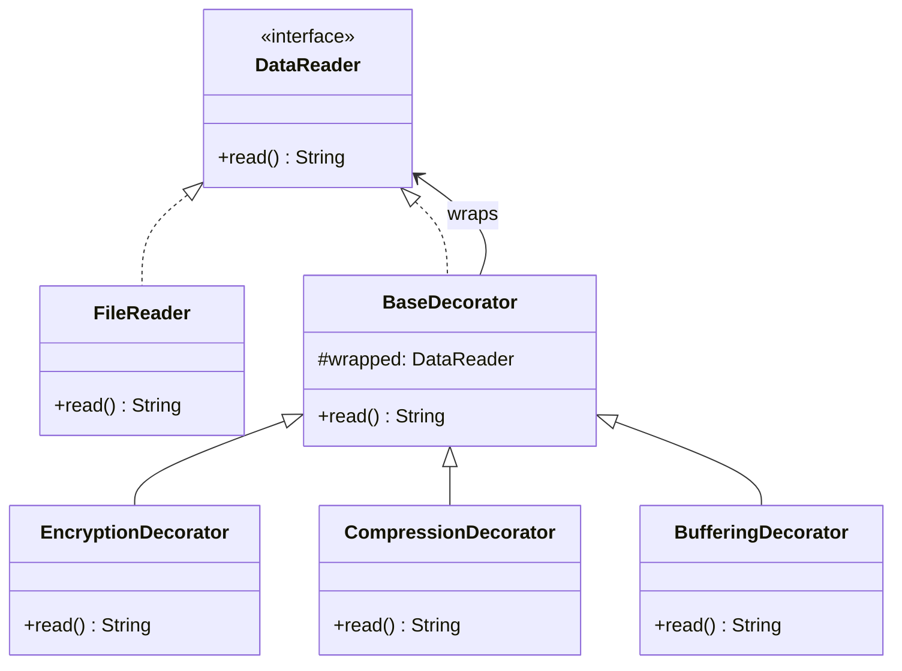

```table-of-contents
title: 
style: nestedList # TOC style (nestedList|nestedOrderedList|inlineFirstLevel)
minLevel: 0 # Include headings from the specified level
maxLevel: 0 # Include headings up to the specified level
include: 
exclude: 
includeLinks: true # Make headings clickable
hideWhenEmpty: false # Hide TOC if no headings are found
debugInConsole: false # Print debug info in Obsidian console
```
# Decorator Pattern

**One-liner:** Wraps an object in successive layers that add behavior at runtime without touching the original class or exploding the class hierarchy.
	
---

## Why This Exists — The Problem Without It

You need a file reader. Then you need a buffered file reader. Then an encrypted one. Then a compressed one. Inheritance forces you to create every combination as its own class:

```java
// INHERITANCE EXPLOSION — every combo needs its own class
class FileReader { ... }
class BufferedFileReader extends FileReader { ... }
class EncryptedFileReader extends FileReader { ... }
class CompressedFileReader extends FileReader { ... }
class BufferedEncryptedFileReader extends EncryptedFileReader { ... }
class BufferedCompressedFileReader extends CompressedFileReader { ... }
class EncryptedCompressedFileReader extends CompressedFileReader { ... }
class BufferedEncryptedCompressedFileReader extends EncryptedCompressedFileReader { ... }
// N behaviors = 2^N classes. With 4 behaviors: 16 classes.
// Adding one new behavior (e.g., logging) doubles the count again.

// Client still has to pick the correct concrete class — fragile
DataReader reader = new BufferedEncryptedFileReader("secret.dat");
```

The deeper problem: at compile time you cannot know which combination the user will configure. Inheritance locks combinations in stone.

---

## Real-World Analogy

At a coffee shop, you order a plain espresso. The barista can add milk, then sugar, then caramel syrup — each addition "wraps" the previous drink. You pay the total cost of all layers. The espresso itself never changed; each add-on just decorates it. You can skip any layer, combine layers in any order, and add the same layer twice (extra sugar). No new machine is needed per combination.

---

## The Fix — Clean Implementation

### The interface and base class

```java
// The component interface — decorator AND concrete class implement this
public interface DataReader {
    String read();
    String getDescription();
    double getCost();  // for coffee analogy demo
}

// Concrete component — the "plain coffee"
public class FileDataReader implements DataReader {
    private final String filename;

    public FileDataReader(String filename) {
        this.filename = filename;
    }

    @Override
    public String read() {
        // Simulate raw file bytes
        return "RAW_CONTENT_FROM:" + filename;
    }

    @Override
    public String getDescription() { return "FileReader(" + filename + ")"; }

    @Override
    public double getCost() { return 0.0; }
}
```

### Abstract Decorator — the key: wraps the SAME interface

```java
// All decorators extend this. It holds a reference to the wrapped component.
// This is NOT optional boilerplate — it enforces that every decorator
// delegates to the wrapped object.
public abstract class DataReaderDecorator implements DataReader {
    protected final DataReader wrapped;

    protected DataReaderDecorator(DataReader wrapped) {
        this.wrapped = wrapped;
    }

    @Override
    public String read() { return wrapped.read(); }

    @Override
    public String getDescription() { return wrapped.getDescription(); }

    @Override
    public double getCost() { return wrapped.getCost(); }
}
```

### Concrete Decorators

```java
public class BufferingDecorator extends DataReaderDecorator {

    private final int bufferSize;

    public BufferingDecorator(DataReader wrapped, int bufferSizeKB) {
        super(wrapped);
        this.bufferSize = bufferSizeKB;
    }

    @Override
    public String read() {
        String data = wrapped.read();
        return "[BUFFERED:" + bufferSize + "KB] " + data;
    }

    @Override
    public String getDescription() {
        return "Buffering(" + bufferSize + "KB) -> " + wrapped.getDescription();
    }

    @Override
    public double getCost() { return wrapped.getCost() + 0.5; }
}

public class EncryptionDecorator extends DataReaderDecorator {

    private final String algorithm;

    public EncryptionDecorator(DataReader wrapped, String algorithm) {
        super(wrapped);
        this.algorithm = algorithm;
    }

    @Override
    public String read() {
        String data = wrapped.read();
        return decrypt(data);  // decrypt on read
    }

    private String decrypt(String data) {
        return "[DECRYPTED-" + algorithm + "] " + data;
    }

    @Override
    public String getDescription() {
        return "Encryption(" + algorithm + ") -> " + wrapped.getDescription();
    }

    @Override
    public double getCost() { return wrapped.getCost() + 2.0; }
}

public class CompressionDecorator extends DataReaderDecorator {

    @Override
    public String read() {
        String data = wrapped.read();
        return decompress(data);
    }

    public CompressionDecorator(DataReader wrapped) { super(wrapped); }

    private String decompress(String data) {
        return "[DECOMPRESSED] " + data;
    }

    @Override
    public String getDescription() {
        return "Compression -> " + wrapped.getDescription();
    }

    @Override
    public double getCost() { return wrapped.getCost() + 1.0; }
}
```

### Client — ORDER MATTERS (this is a key interview point)

```java
public class DecoratorDemo {
    public static void main(String[] args) {

        // Stack 1: Buffer -> Encrypt -> Compress -> FileReader
        // Reading order (inside-out): File → Compress → Encrypt → Buffer
        DataReader reader1 = new BufferingDecorator(
                                 new EncryptionDecorator(
                                     new CompressionDecorator(
                                         new FileDataReader("data.bin")
                                     ), "AES-256"
                                 ), 64);

        System.out.println(reader1.getDescription());
        System.out.println(reader1.read());

        // Stack 2: Compress AFTER Encrypt (DIFFERENT RESULT — data is different)
        // Compressing encrypted data is less effective than compressing then encrypting
        DataReader reader2 = new CompressionDecorator(
                                 new EncryptionDecorator(
                                     new FileDataReader("data.bin"),
                                     "AES-256"
                                 ));

        System.out.println("\n--- Different order, different behavior ---");
        System.out.println(reader2.getDescription());
        System.out.println(reader2.read());

        // Runtime composition — can be driven by config
        DataReader base = new FileDataReader("config.json");
        if (System.getenv("ENABLE_BUFFERING") != null) {
            base = new BufferingDecorator(base, 32);
        }
        if (System.getenv("ENABLE_ENCRYPTION") != null) {
            base = new EncryptionDecorator(base, "AES-128");
        }
        System.out.println("\nRuntime config result: " + base.getDescription());
    }
}
```

### Java IO streams are the canonical Decorator example

```java
// Java IO is pure Decorator — you can verify by reading the source
InputStream raw       = new FileInputStream("file.dat");         // Concrete
InputStream buffered  = new BufferedInputStream(raw);            // Decorator
InputStream zipped    = new GZIPInputStream(buffered);           // Decorator
InputStreamReader rdr = new InputStreamReader(zipped, "UTF-8");  // Adapter!
BufferedReader    br  = new BufferedReader(rdr);                 // Decorator

// Notice: BufferedInputStream wraps InputStream, not FileInputStream
// That's the power — it works with ANY InputStream (network, memory, etc.)
```

---

## Class Diagram

```
«interface»
DataReader
+ read(): String
+ getDescription(): String
    ^           ^
    |           |
FileDataReader  DataReaderDecorator (abstract)
                - wrapped: DataReader
                    ^
          __________|__________
          |          |         |
BufferingDecorator  EncryptionDecorator  CompressionDecorator

Key: Decorator implements the SAME interface it wraps.
     The wrapped field is the same type as the decorator itself.
```

---

## Real Systems Using This

| System | Decorator usage |
|---|---|
| `java.io.BufferedInputStream` | Wraps any `InputStream`, adds buffering |
| `java.io.GZIPInputStream` | Wraps any `InputStream`, adds decompression |
| Spring Security `FilterChainProxy` | Each `Filter` wraps the chain — authentication, CSRF, session are decorators |
| HTTP client middleware (OkHttp `Interceptor`) | Each interceptor decorates the call — logging, retry, auth |
| Servlet `HttpServletRequestWrapper` | Decorate the request — add parsed attributes without changing caller |
| Lombok `@Delegate` | Generates decorator boilerplate at compile time |

---

## SDE-2/SDE-3 Interview Signals

| If interviewer says... | Think this pattern |
|---|---|
| "Add behavior to objects without modifying the class" | Decorator |
| "We have cross-cutting concerns — logging, auth, metrics on multiple classes" | Decorator (or Proxy) |
| "Users should be able to combine features at runtime" | Decorator |
| "Adding logging to every service without touching them" | Decorator or Proxy |
| "Class explosion from all the combinations we need to support" | Decorator (eliminate the combinations) |
| "Behavior should stack — like middleware or filter chains" | Decorator |

---

## When to Use

- You need to add responsibilities to objects dynamically and transparently, without subclassing.
- Multiple independent behaviors need to be stacked in arbitrary combinations.
- Extending through inheritance is impractical because it produces an explosion of subclasses.
- You want runtime configuration of behavior (feature flags, tenant-specific pipelines).

## When NOT to Use

- When only ONE combination is ever used — just modify the class or use a single subclass.
- When the stacking order doesn't matter and won't change — a simple composed object is clearer.
- When decorators need to know about each other — they should be fully independent. If decorator B inspects decorator A's state, your design is wrong.
- When you need to remove specific decorators from the middle of a stack — difficult with this pattern; consider Chain of Responsibility.

---

## Trade-offs & Alternatives

| Trade-off | Detail |
|---|---|
| Pro: Open/Closed | Add decorators without touching existing classes |
| Pro: Runtime composition | Stack chosen at runtime from config |
| Con: Debugging | Stack traces through many wrapper layers are confusing |
| Con: Identity | `reader instanceof EncryptionDecorator` fails if wrapped inside BufferingDecorator |
| Con: Many small objects | Each decorator is an object — GC pressure at extreme scale |

**Alternatives:**
- **Strategy:** Decorator adds behavior on top; Strategy swaps the behavior entirely. Use Strategy when behaviors are mutually exclusive.
- **Proxy:** Both wrap an object. Proxy controls access (same interface, always one layer). Decorator adds behavior (can stack N layers).
- **Inheritance:** Works when combos are small and fixed. Scales badly.

---

## Common Interview Mistakes

1. **Not recognizing that the decorator and decoratee share the same interface.** This is what allows transparent stacking. If your decorator has a different interface, it is an Adapter, not a Decorator.
2. **Breaking the delegation chain.** Forgetting to call `wrapped.read()` in a decorator means you silently skip all inner layers.
3. **Ignoring order sensitivity.** Encrypt-then-compress vs compress-then-encrypt produces fundamentally different (and often broken) results. Always explain order when discussing this pattern.
4. **Overusing decorators for things that are not composable.** If you only ever add one behavior, just modify the class.
5. **Treating Spring `@Transactional` as magic rather than a proxy/decorator.** Spring wraps your bean in a proxy that adds transaction management — that's a Decorator/Proxy hybrid.

---

## Mermaid Class Diagram



---

## Executable Example (Copy-Paste-Run)

```java
// File: DecoratorDemo.java
// Run:  javac DecoratorDemo.java && java DecoratorDemo

public class DecoratorDemo {

    interface Coffee {
        double cost();
        String description();
    }

    static class PlainCoffee implements Coffee {
        public double cost() { return 50.0; }
        public String description() { return "Plain Coffee"; }
    }

    static abstract class CoffeeDecorator implements Coffee {
        protected final Coffee wrapped;
        CoffeeDecorator(Coffee c) { wrapped = c; }
    }

    static class MilkDecorator extends CoffeeDecorator {
        MilkDecorator(Coffee c) { super(c); }
        public double cost() { return wrapped.cost() + 15.0; }
        public String description() { return wrapped.description() + " + Milk"; }
    }

    static class SugarDecorator extends CoffeeDecorator {
        SugarDecorator(Coffee c) { super(c); }
        public double cost() { return wrapped.cost() + 5.0; }
        public String description() { return wrapped.description() + " + Sugar"; }
    }

    static class CaramelDecorator extends CoffeeDecorator {
        CaramelDecorator(Coffee c) { super(c); }
        public double cost() { return wrapped.cost() + 30.0; }
        public String description() { return wrapped.description() + " + Caramel"; }
    }

    public static void main(String[] args) {
        Coffee plain = new PlainCoffee();
        System.out.printf("%-40s Rs.%.0f%n", plain.description(), plain.cost());
        // Plain Coffee                             Rs.50

        Coffee milkCoffee = new MilkDecorator(plain);
        System.out.printf("%-40s Rs.%.0f%n", milkCoffee.description(), milkCoffee.cost());
        // Plain Coffee + Milk                      Rs.65

        Coffee fullLoaded = new CaramelDecorator(new SugarDecorator(new MilkDecorator(plain)));
        System.out.printf("%-40s Rs.%.0f%n", fullLoaded.description(), fullLoaded.cost());
        // Plain Coffee + Milk + Sugar + Caramel    Rs.100

        // Double milk!
        Coffee doubleMilk = new MilkDecorator(new MilkDecorator(plain));
        System.out.printf("%-40s Rs.%.0f%n", doubleMilk.description(), doubleMilk.cost());
        // Plain Coffee + Milk + Milk               Rs.80
    }
}
```

---

## Interview Script — What to Say

> "I need to add behavior [logging/caching/encryption] without modifying the class. I'll use Decorator — it wraps the same interface, adds behavior before/after delegating to the wrapped object. Decorators stack like layers — order matters. This gives us open-closed: add new behaviors as new decorator classes."

---

## Combines Well With

- **Composite:** Decorate entire composite trees. A `LoggingDecorator` wrapping a `Panel` logs every render call on the whole tree.
- **Strategy:** Use Decorator to add behavior; Strategy to swap the core algorithm.
- **Factory / Builder:** Build the decoration stack based on config.
- **Chain of Responsibility:** Both chain objects. CoR breaks the chain when handled; Decorator always passes through.

---

## Cheat Sheet

```
DECORATOR IN 6 LINES:
1. Define a Component interface (DataReader, InputStream, etc.)
2. Concrete class implements the interface (FileDataReader)
3. Abstract Decorator: implements interface + holds a reference of the SAME interface
4. Concrete Decorators: extend abstract decorator, call super/wrapped.method(), add behavior
5. Stack at runtime: new A(new B(new C(core)))
6. ORDER MATTERS — the outermost decorator executes first on a call

vs Proxy: Proxy = control access (one layer). Decorator = add behavior (N layers).
Red flag: decorator that does NOT call wrapped.method() is silently eating requests.
```
