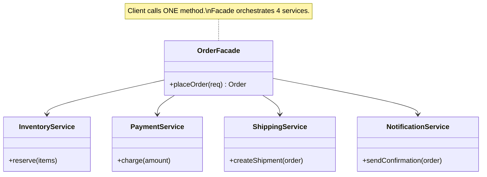

# Facade Pattern

**One-liner:** Provides a single simplified entry point into a complex subsystem, hiding its internals and call-ordering requirements from clients.

---

## Why This Exists — The Problem Without It

Your video conversion feature requires orchestrating multiple low-level classes. Every client that needs to convert a video must know all of them:

```java
// PAINFUL: Client must understand and orchestrate 6 subsystem classes
public class VideoController {

    public void convertVideoEndpoint(String sourceFile, String targetFormat) {
        // Client must know the correct sequence — easy to get wrong
        VideoFile         file    = new VideoFile(sourceFile);
        CodecFactory      factory = new CodecFactory();
        Codec             codec   = factory.extract(file);        // step 1
        BitrateReader     reader  = new BitrateReader();
        VideoFile         buffer  = reader.read(file, codec);     // step 2
        VideoFile         result  = reader.convert(buffer, codec);// step 3
        AudioMixer        mixer   = new AudioMixer();
        VideoFile         mixed   = mixer.fix(result);            // step 4
        MPEG4Codec        mCodec  = new MPEG4Codec();
        // ... 3 more steps, each requiring previous results

        // Exceptions from each subsystem are different types
        // If step 3 throws, did step 2 clean up? Does client handle this?
        saveOutput(mixed);
    }
}
// Result: VideoController is tightly coupled to 6 subsystem classes.
// Any change in subsystem ordering breaks every controller that calls this.
// Writing tests requires mocking all 6 collaborators everywhere.
```

---

## Real-World Analogy

When you call a hotel concierge and say "I need dinner for two at a nice restaurant tonight," the concierge coordinates the restaurant reservation system, arranges a taxi, checks the dress code, confirms your room's credit card, and texts you the confirmation. You made one call. You did not need to know which reservation system they use, which taxi company, or how they verify dress codes. The concierge is the facade.

---

## The Fix — Clean Implementation

### Example 1: Video Conversion Facade

```java
// ---- SUBSYSTEM CLASSES (complex, low-level) ----

public class VideoFile {
    private final String name;
    private final String codecType;

    public VideoFile(String name) {
        this.name = name;
        this.codecType = name.substring(name.lastIndexOf('.') + 1);
    }
    public String getName()      { return name; }
    public String getCodecType() { return codecType; }
}

public class CodecFactory {
    public Codec extract(VideoFile file) {
        String type = file.getCodecType();
        System.out.println("CodecFactory: extracting " + type + " codec");
        return switch (type) {
            case "mp4"  -> new MPEG4Codec();
            case "ogg"  -> new OggCompressionCodec();
            default     -> throw new UnsupportedOperationException("Unknown codec: " + type);
        };
    }
}

public interface Codec { String type(); }
public class MPEG4Codec implements Codec {
    @Override public String type() { return "mp4"; }
}
public class OggCompressionCodec implements Codec {
    @Override public String type() { return "ogg"; }
}

public class BitrateReader {
    public VideoFile read(VideoFile file, Codec codec) {
        System.out.println("BitrateReader: reading file " + file.getName());
        return file;  // simplified
    }
    public VideoFile convert(VideoFile buffer, Codec targetCodec) {
        System.out.println("BitrateReader: converting to " + targetCodec.type());
        return new VideoFile(buffer.getName().replace(buffer.getCodecType(), targetCodec.type()));
    }
}

public class AudioMixer {
    public VideoFile fix(VideoFile result) {
        System.out.println("AudioMixer: fixing audio streams");
        return result;
    }
}

// ---- THE FACADE ----
// One class, one method, zero subsystem knowledge required by callers

public class VideoConversionFacade {

    // Facade owns the subsystem instances — clients don't
    private final CodecFactory  codecFactory  = new CodecFactory();
    private final BitrateReader bitrateReader = new BitrateReader();
    private final AudioMixer    audioMixer    = new AudioMixer();

    public VideoFile convertVideo(String fileName, String targetFormat) {
        System.out.println("VideoConversionFacade: starting conversion of " + fileName);

        VideoFile file       = new VideoFile(fileName);
        Codec     sourceCodec = codecFactory.extract(file);

        Codec targetCodec = switch (targetFormat.toLowerCase()) {
            case "mp4" -> new MPEG4Codec();
            case "ogg" -> new OggCompressionCodec();
            default    -> throw new IllegalArgumentException("Unsupported format: " + targetFormat);
        };

        VideoFile buffer = bitrateReader.read(file, sourceCodec);
        VideoFile result = bitrateReader.convert(buffer, targetCodec);
        VideoFile output = audioMixer.fix(result);

        System.out.println("VideoConversionFacade: done. Output: " + output.getName());
        return output;
    }
}
```

### Example 2: Order Facade (e-commerce — more realistic for interviews)

```java
// ---- SUBSYSTEM SERVICES ----

@Service
public class InventoryService {
    public boolean reserve(String productId, int quantity) {
        System.out.println("InventoryService: reserving " + quantity + " of " + productId);
        return true; // simplified
    }
    public void release(String productId, int quantity) {
        System.out.println("InventoryService: releasing reservation");
    }
}

@Service
public class PaymentService {
    public PaymentResult charge(String customerId, BigDecimal amount) {
        System.out.println("PaymentService: charging " + customerId + " $" + amount);
        return new PaymentResult(true, "TXN-" + System.currentTimeMillis());
    }
}

@Service
public class ShippingService {
    public String scheduleShipment(String orderId, String address) {
        System.out.println("ShippingService: scheduling shipment to " + address);
        return "SHIP-" + orderId;
    }
}

@Service
public class NotificationService {
    public void sendOrderConfirmation(String customerId, String orderId, String trackingId) {
        System.out.println("NotificationService: emailing confirmation for order " + orderId);
    }
}

public record PaymentResult(boolean success, String transactionId) {}

// ---- THE FACADE ----

@Service
public class OrderFacade {

    private final InventoryService    inventory;
    private final PaymentService      payment;
    private final ShippingService     shipping;
    private final NotificationService notification;

    // All injected via DI — facade delegates, does NOT implement subsystem logic
    public OrderFacade(InventoryService inventory,
                       PaymentService payment,
                       ShippingService shipping,
                       NotificationService notification) {
        this.inventory    = inventory;
        this.payment      = payment;
        this.shipping     = shipping;
        this.notification = notification;
    }

    // ONE method for the client to call — orchestration lives here, not in callers
    public OrderResult placeOrder(OrderRequest request) {
        // 1. Reserve stock (compensate on failure below)
        boolean reserved = inventory.reserve(request.productId(), request.quantity());
        if (!reserved) {
            return OrderResult.failure("Out of stock");
        }
        try {
            // 2. Charge payment
            PaymentResult payment = this.payment.charge(
                request.customerId(), request.totalAmount());
            if (!payment.success()) {
                inventory.release(request.productId(), request.quantity()); // compensate
                return OrderResult.failure("Payment declined");
            }
            // 3. Schedule shipment
            String trackingId = shipping.scheduleShipment(
                request.orderId(), request.shippingAddress());
            // 4. Notify customer
            notification.sendOrderConfirmation(
                request.customerId(), request.orderId(), trackingId);

            return OrderResult.success(request.orderId(), trackingId);

        } catch (Exception e) {
            inventory.release(request.productId(), request.quantity());
            throw new OrderProcessingException("Order failed: " + e.getMessage(), e);
        }
    }
}

public record OrderRequest(String orderId, String customerId, String productId,
                           int quantity, BigDecimal totalAmount, String shippingAddress) {}
public record OrderResult(boolean success, String orderId, String trackingId, String error) {
    public static OrderResult success(String id, String tracking) {
        return new OrderResult(true, id, tracking, null);
    }
    public static OrderResult failure(String err) {
        return new OrderResult(false, null, null, err);
    }
}

// ---- CLIENT — knows only the facade ----

@RestController
public class OrderController {
    private final OrderFacade orderFacade;

    public OrderController(OrderFacade orderFacade) {
        this.orderFacade = orderFacade;
    }

    @PostMapping("/orders")
    public ResponseEntity<OrderResult> placeOrder(@RequestBody OrderRequest request) {
        OrderResult result = orderFacade.placeOrder(request);  // one call, done
        return result.success()
            ? ResponseEntity.ok(result)
            : ResponseEntity.badRequest().body(result);
    }
}
```

---

## Class Diagram

```
Client (Controller)
    |
    | one call
    v
OrderFacade
    |-------> InventoryService    (subsystem)
    |-------> PaymentService      (subsystem)
    |-------> ShippingService     (subsystem)
    `-------> NotificationService (subsystem)

Facade knows about subsystems.
Subsystems do NOT know about the facade.
Client does NOT know about subsystems.
```

---

## Real Systems Using This

| System | Facade | Underlying complexity |
|---|---|---|
| `Spring JdbcTemplate` | `queryForList(sql, params)` | `Connection`, `PreparedStatement`, `ResultSet`, exception handling, connection pool |
| `SLF4J` | `Logger.info(msg)` | Dispatches to log4j, logback, JUL, or any other backend |
| `Stripe API` | `PaymentIntent.create(params)` | Card networks, fraud detection, banking rails, 3DS auth |
| `AWS SDK S3Client.putObject()` | Single call | Multipart upload, retry, checksum, auth signing |
| `Hibernate Session` | `session.save(entity)` | SQL generation, dirty checking, cache management, transaction |

---

## SDE-2/SDE-3 Interview Signals

| If interviewer says... | Think this pattern |
|---|---|
| "Clients shouldn't need to understand internal service orchestration" | Facade |
| "Simplify the API for external consumers or other teams" | Facade |
| "The controller is getting too fat — it knows too many services" | Facade (move orchestration there) |
| "How would you design an SDK for our platform?" | Facade |
| "We want one place where the checkout flow is defined" | Facade |
| "Hide complexity / legacy system behind a clean API" | Facade (+ possibly Adapter inside) |

---

## When to Use

- A complex subsystem has many classes that clients must know and coordinate — move that coordination into a facade.
- You want to layer your software: provide a simple interface to each layer and let layers communicate through facades.
- You're building an SDK or public API where callers should not be exposed to implementation details.
- You have a legacy subsystem you are wrapping for new clients (often combined with Adapter).

## When NOT to Use

- When the facade starts doing work beyond delegation (it becomes a God Class). A facade's methods should be short orchestration code, not business logic.
- When the subsystem is simple enough that a facade adds no value — avoid over-engineering.
- When clients genuinely need fine-grained control over the subsystem — the facade would be too limiting.

---

## Trade-offs & Alternatives

| Aspect | Detail |
|---|---|
| Pro: Decouples clients from subsystem | Subsystem can refactor without clients changing |
| Pro: Reduces cognitive load | Caller learns one class instead of six |
| Con: Can become God Class | If you keep adding methods, it grows unbounded |
| Con: Hides subsystem | Direct subsystem access is still possible — teams may bypass facade, defeating the purpose |

**Alternatives:**
- **Mediator:** Facade simplifies access TO a subsystem from outside. Mediator manages communication BETWEEN multiple subsystems/colleagues (bidirectional). They solve different problems.
- **Adapter:** Adapter makes ONE class fit a specific interface. Facade orchestrates MANY classes behind a simplified interface.
- **API Gateway (architectural):** The distributed systems equivalent of Facade — one entry point routing to multiple microservices.

---

## Common Interview Mistakes

1. **Making the facade implement business logic.** The facade orchestrates — it does not decide. Discount calculations, fraud scoring, business rules belong in the subsystem services.
2. **Confusing Facade with Mediator.** Facade is unidirectional (client calls facade, facade calls subsystem). Mediator is bidirectional (subsystems know about and communicate through the mediator).
3. **Making the facade a singleton God Class.** As soon as a facade has 30 methods it is no longer simplifying anything. Split it into domain-specific facades (`OrderFacade`, `CatalogFacade`, `AuthFacade`).
4. **Letting subsystem classes know about the facade.** Subsystems must be independently testable. If `InventoryService` imports `OrderFacade`, the design is circular.
5. **Forgetting exception handling and compensation logic.** Real facade orchestration must handle partial failure (step 2 succeeded, step 3 failed — roll back step 2).

---

## Mermaid Class Diagram



---

## Executable Example (Copy-Paste-Run)

```java
// File: FacadeDemo.java
// Run:  javac FacadeDemo.java && java FacadeDemo

public class FacadeDemo {

    static class InventoryService {
        boolean reserve(String item, int qty) {
            System.out.println("  [INVENTORY] Reserved " + qty + "x " + item);
            return true;
        }
        void release(String item, int qty) {
            System.out.println("  [INVENTORY] Released " + qty + "x " + item);
        }
    }

    static class PaymentService {
        boolean charge(String userId, double amount) {
            System.out.printf("  [PAYMENT] Charged Rs.%.0f from %s%n", amount, userId);
            return true;
        }
        void refund(String userId, double amount) {
            System.out.printf("  [PAYMENT] Refunded Rs.%.0f to %s%n", amount, userId);
        }
    }

    static class ShippingService {
        String createShipment(String item, String address) {
            System.out.println("  [SHIPPING] Shipment created to " + address);
            return "SHIP-" + System.currentTimeMillis() % 10000;
        }
    }

    static class NotificationService {
        void sendConfirmation(String userId, String shipmentId) {
            System.out.println("  [NOTIFY] Sent confirmation to " + userId + " (tracking: " + shipmentId + ")");
        }
    }

    // FACADE — one method, orchestrates 4 services, handles compensation
    static class OrderFacade {
        private final InventoryService inventory = new InventoryService();
        private final PaymentService payment = new PaymentService();
        private final ShippingService shipping = new ShippingService();
        private final NotificationService notification = new NotificationService();

        String placeOrder(String userId, String item, int qty, double amount, String address) {
            // Step 1: Reserve inventory
            if (!inventory.reserve(item, qty)) throw new RuntimeException("Out of stock");
            // Step 2: Charge payment
            if (!payment.charge(userId, amount)) {
                inventory.release(item, qty); // compensate
                throw new RuntimeException("Payment failed");
            }
            // Step 3: Ship
            String shipId = shipping.createShipment(item, address);
            // Step 4: Notify
            notification.sendConfirmation(userId, shipId);
            return shipId;
        }
    }

    public static void main(String[] args) {
        OrderFacade facade = new OrderFacade();
        System.out.println("=== Placing Order ===");
        String shipId = facade.placeOrder("user-42", "iPhone 15", 1, 79999, "Mumbai 400001");
        System.out.println("Order placed! Tracking: " + shipId);
    }
}
```

**Expected output:**
```
=== Placing Order ===
  [INVENTORY] Reserved 1x iPhone 15
  [PAYMENT] Charged Rs.79999 from user-42
  [SHIPPING] Shipment created to Mumbai 400001
  [NOTIFY] Sent confirmation to user-42 (tracking: SHIP-XXXX)
Order placed! Tracking: SHIP-XXXX
```

---

## Anti-Pattern

```java
// Client must know ALL subsystems, call them in right order, handle failures
inventory.reserve(item, qty);
boolean paid = payment.charge(userId, amount);
if (!paid) inventory.release(item, qty); // client handles compensation?!
String shipId = shipping.create(item, address);
notification.send(userId, shipId);
// This logic repeated in every controller/service that places orders
```

---

## Refactoring Path

```
Step 1: Identify the complex subsystem (4+ classes, required sequence)
Step 2: Create Facade with ONE focused method
Step 3: Facade holds references to all subsystem classes
Step 4: Method = sequence of calls + compensation on failure
Step 5: Clients import only the Facade
```

---

## Spring Boot Connection

```java
@Service
public class OrderFacade {
    @Autowired private InventoryService inventory;
    @Autowired private PaymentService payment;
    @Autowired private ShippingService shipping;
    // Spring wires it all — facade is just a @Service with injected deps
}
```

---

## Which LLD Problems Use This

- [[../../examples/lld_food_delivery]] — OrderFacade orchestrating restaurant, delivery, payment
- [[../../examples/lld_booking_system]] — BookingFacade orchestrating seats, payment, tickets
- [[../../examples/lld_payment_system]] — PaymentFacade wrapping gateway, idempotency, refund

---

## Follow-up Questions Interviewers Ask

| Question | How to Answer |
|----------|--------------|
| "What if one step fails?" | Compensation — undo previous steps in reverse order |
| "Facade vs Mediator?" | Facade = one-directional (outside→inside). Mediator = bidirectional. |
| "Isn't this just a Service class?" | Yes — a well-designed Spring @Service IS a Facade. |

---

## Interview Script — What to Say

> "The client shouldn't orchestrate 4 services manually. I'll create an `OrderFacade` with one `placeOrder()` method that handles the sequence: reserve inventory → charge payment → ship → notify. If payment fails, it compensates by releasing inventory. Client calls one method."

---

## Thread-Safety Note

```
Facade is typically stateless (delegates to services) → thread-safe.
Each underlying service handles its own concurrency.
```

---

## Complexity Analysis

| Scenario | Without Facade | With Facade |
|----------|---------------|-------------|
| Client complexity | Must know 4 services + order | Calls 1 method |
| Failure handling | Scattered compensation logic | Centralized in facade |
| Add new step | Modify every client | Modify only facade |

---

## Combines Well With

- **Adapter:** Inside a facade, adapters make third-party services fit.
- **Factory / DI:** Inject subsystem collaborators into the facade.
- **Template Method:** Facade defines orchestration; steps can vary.
- **Command:** Wrap facade call in Command for undo/audit.

---

## Cheat Sheet

```
FACADE IN 5 LINES:
1. Identify the complex subsystem (N classes, required order, multiple exceptions)
2. Create a Facade class with ONE or FEW focused methods
3. Facade holds references to subsystem classes (inject via DI)
4. Facade method = sequence of subsystem calls + compensation on failure
5. Clients import only the Facade — never the subsystem classes

Facade delegates. It does NOT implement.
vs Adapter: Adapter makes one thing fit. Facade simplifies many things.
vs Mediator: Facade is one-directional (outside→inside). Mediator is bidirectional.
Red flag: a Facade method > 30 lines = probably a God Class in disguise.
```

---
---

# ChatGPT

```markdown
# Facade Pattern (Java)

## Definition

> The **Facade Pattern** is a structural design pattern that provides a **simple interface to a complex system**.

It hides the complexity of multiple classes and exposes **one easy-to-use interface** to the client.

In simple terms:

```

Client → Facade → Complex System

```

The client interacts only with the **facade**, not the internal system.

---

# Real-Life Example

## Restaurant Ordering

When you go to a restaurant, you interact with:

```

Waiter

```

But internally many systems are involved:

```

Kitchen  
Billing System  
Inventory System  
Chef

```

You **don't interact with each system individually**.

```

Customer → Waiter → Restaurant System

```

The **waiter acts as the facade**.

---

# Problem Without Facade

Imagine a home theater system with many components:

```

DVD Player  
Projector  
Sound System  
Lights  
Screen

````

Client must control everything:

```java
dvdPlayer.on();
projector.on();
soundSystem.on();
lights.off();
screen.down();
````

Too complicated.

---

# Solution: Facade

Create a **HomeTheaterFacade** that simplifies everything.

```
homeTheater.watchMovie();
```

---

# Structure

```
Client
   |
   v
Facade
   |
   +------ Subsystem A
   +------ Subsystem B
   +------ Subsystem C
```

---

# Example — Home Theater System

## Step 1 — Subsystem Classes

### DVD Player

```java
class DVDPlayer {

    void on() {
        System.out.println("DVD Player ON");
    }

    void play() {
        System.out.println("Playing movie");
    }
}
```

---

### Projector

```java
class Projector {

    void on() {
        System.out.println("Projector ON");
    }
}
```

---

### Sound System

```java
class SoundSystem {

    void on() {
        System.out.println("Sound System ON");
    }
}
```

---

# Step 2 — Facade Class

```java
class HomeTheaterFacade {

    private DVDPlayer dvd;
    private Projector projector;
    private SoundSystem sound;

    public HomeTheaterFacade(DVDPlayer dvd, Projector projector, SoundSystem sound) {
        this.dvd = dvd;
        this.projector = projector;
        this.sound = sound;
    }

    public void watchMovie() {
        System.out.println("Starting Movie...");
        projector.on();
        sound.on();
        dvd.on();
        dvd.play();
    }
}
```

This class **hides the complexity**.

---

# Step 3 — Client Code

```java
public class Main {

    public static void main(String[] args) {

        DVDPlayer dvd = new DVDPlayer();
        Projector projector = new Projector();
        SoundSystem sound = new SoundSystem();

        HomeTheaterFacade theater =
            new HomeTheaterFacade(dvd, projector, sound);

        theater.watchMovie();
    }
}
```

---

# Output

```
Starting Movie...
Projector ON
Sound System ON
DVD Player ON
Playing movie
```

---

# Execution Flow

```
Client
  |
  v
HomeTheaterFacade.watchMovie()
  |
  +---- Projector.on()
  +---- SoundSystem.on()
  +---- DVDPlayer.on()
  +---- DVDPlayer.play()
```

---

# Visual Representation

```
Client
   |
   v
HomeTheaterFacade
   |
   +---- DVDPlayer
   +---- Projector
   +---- SoundSystem
```

---

# Benefits

- Simplifies complex systems
    
- Reduces dependencies
    
- Improves readability
    
- Makes client code cleaner
    

---

# Real-World Examples

Facade pattern is used in many frameworks:

- **Spring Framework**
    
- **Hibernate**
    
- **JavaMail API**
    
- **Logging frameworks**
    

Example:

```java
Logger log = LoggerFactory.getLogger(MyClass.class);
```

`LoggerFactory` acts as a **facade**.

---

# Facade vs Adapter

|Pattern|Purpose|
|---|---|
|Adapter|Converts one interface to another|
|Facade|Simplifies a complex system|

---

# One-Line Interview Answer

The **Facade Pattern** provides a simplified interface to a complex subsystem, making it easier for clients to interact with it.