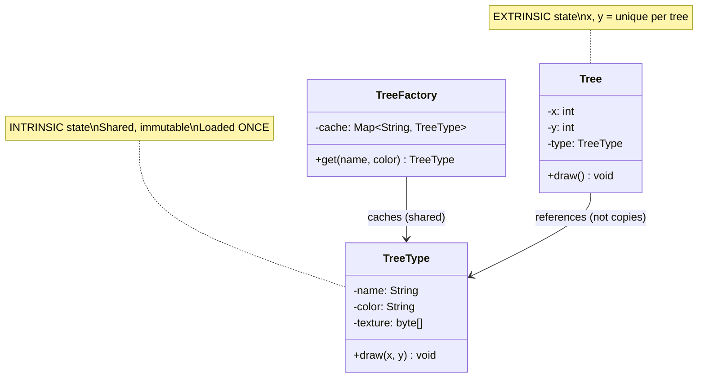

# Flyweight Pattern

**One-liner:** Shares the immutable, common state among millions of fine-grained objects to drastically reduce memory usage, while passing unique state in per-call parameters.

---

## Why This Exists — The Problem Without It

A game renders a forest of 1,000,000 trees. Each tree stores its position AND its type data (name, color, texture image). The texture image alone is 1 MB per tree type. Naively:

```java
// WITHOUT FLYWEIGHT — every tree object stores everything

public class Tree {
    // Unique per tree (position)
    private final int x;
    private final int y;

    // SHARED data — same for all "Oak" trees — but stored REDUNDANTLY per instance
    private final String name;          // "Oak", 10 bytes
    private final Color  color;         // 16 bytes
    private final byte[] textureData;   // 1 MB per tree type (loaded per instance!)

    public Tree(int x, int y, String name, Color color, byte[] textureData) {
        this.x           = x;
        this.y           = y;
        this.name        = name;
        this.color       = color;
        this.textureData = textureData;  // COPIED or LOADED per instance
    }

    public void render(Canvas canvas) {
        canvas.drawImage(textureData, x, y);
    }
}

// Client code
List<Tree> forest = new ArrayList<>();
for (int i = 0; i < 1_000_000; i++) {
    byte[] oakTexture = loadTextureFromDisk("oak.png");  // 1 MB, loaded 1M times
    forest.add(new Tree(random.nextInt(5000), random.nextInt(5000),
                        "Oak", Color.GREEN, oakTexture));
}
// Memory: 1,000,000 trees × ~1 MB texture = ~1 TB just for textures
// Reality: OutOfMemoryError after a few thousand trees
// The texture for "Oak" is identical for ALL oak trees — this is pure waste
```

---

## Mermaid Class Diagram



---

## Real-World Analogy

A font renderer (like the one displaying this text) does not store one glyph object per character on screen. If the word "banana" appears 10,000 times in a document, the OS stores ONE glyph template for 'b', ONE for 'a', ONE for 'n'. Each occurrence passes its own position (x, y, font size) as extrinsic state at render time. The glyph template is the flyweight — shared, immutable, never stored per occurrence. Position is extrinsic — unique per occurrence, never stored in the glyph.

---

## The Fix — Clean Implementation

### The critical concept: Intrinsic vs Extrinsic state

```
INTRINSIC STATE  = shared, immutable, stored in the flyweight
                   (tree name, color, texture — same for all Oaks)

EXTRINSIC STATE  = unique per instance, NOT stored in flyweight
                   (x, y position — passed as a parameter at render time)

The Flyweight stores ONLY intrinsic state.
Extrinsic state is provided by the client at the time of the operation.
```

### Step 1 — Extract shared state into the Flyweight

```java
// FLYWEIGHT: contains ONLY intrinsic (shared, immutable) state
// This object is shared — it MUST be immutable
public final class TreeType {

    private final String name;        // "Oak", "Pine", "Birch"
    private final Color  color;
    private final byte[] textureData; // 1 MB — but shared across ALL trees of this type

    public TreeType(String name, Color color, String texturePath) {
        this.name        = name;
        this.color       = color;
        this.textureData = loadTextureFromDisk(texturePath);
        System.out.printf("TreeType '%s' created (texture loaded: %d KB)%n",
                          name, textureData.length / 1024);
    }

    // Extrinsic state (x, y) is passed as a parameter — NOT stored here
    public void render(Canvas canvas, int x, int y) {
        canvas.drawImage(textureData, x, y, color);
    }

    public String getName() { return name; }

    private byte[] loadTextureFromDisk(String path) {
        // Simulate loading a 1 MB texture — in production: read file bytes
        byte[] texture = new byte[1024 * 1024];
        Arrays.fill(texture, (byte) 42); // dummy data representing the image
        return texture;
    }
}
```

### Step 2 — Flyweight Factory (THE cache — clients must never instantiate directly)

```java
// THE FACTORY: ensures only one TreeType instance per unique combination of intrinsic state
// This is the cache that makes the pattern work
public class TreeTypeFactory {

    // Cache: key = intrinsic state identity
    private static final Map<String, TreeType> cache = new ConcurrentHashMap<>();

    // Private constructor — pure static factory
    private TreeTypeFactory() {}

    public static TreeType getTreeType(String name, Color color, String texturePath) {
        // Key must capture ALL intrinsic state fields
        String key = name + "_" + color.getRGB() + "_" + texturePath;

        return cache.computeIfAbsent(key, k -> {
            System.out.println("Cache MISS — creating new TreeType for: " + name);
            return new TreeType(name, color, texturePath);
        });
        // On hit: returns existing shared instance — no new allocation
    }

    public static int getCachedCount() { return cache.size(); }
}
```

### Step 3 — Context object (holds extrinsic state + reference to flyweight)

```java
// CONTEXT: the object clients actually hold millions of
// Stores ONLY extrinsic (unique) state + a reference to the shared flyweight
public class Tree {
    private final int      x;         // extrinsic — unique per tree
    private final int      y;         // extrinsic — unique per tree
    private final TreeType type;      // reference to the shared flyweight (NOT a copy)

    public Tree(int x, int y, TreeType type) {
        this.x    = x;
        this.y    = y;
        this.type = type;
    }

    public void render(Canvas canvas) {
        // Pass extrinsic state (x, y) to the flyweight method
        type.render(canvas, x, y);
    }
}
```

### Step 4 — Forest (client)

```java
public class Forest {

    private final List<Tree> trees = new ArrayList<>();

    public void plantTree(int x, int y, String name, Color color, String texturePath) {
        // Factory ensures we get the shared flyweight, not a new one
        TreeType type = TreeTypeFactory.getTreeType(name, color, texturePath);
        trees.add(new Tree(x, y, type));
    }

    public void renderAll(Canvas canvas) {
        trees.forEach(t -> t.render(canvas));
    }
}
```

### Memory calculation — the payoff

```java
public class FlyweightDemo {
    public static void main(String[] args) {
        Forest   forest = new Forest();
        Random   rnd    = new Random();
        String[] types  = {"Oak", "Pine", "Birch"};
        Color[]  colors = {Color.GREEN, Color.DARK_GREEN, Color.YELLOW};

        int totalTrees = 1_000_000;
        for (int i = 0; i < totalTrees; i++) {
            int idx = rnd.nextInt(3);
            forest.plantTree(
                rnd.nextInt(5000), rnd.nextInt(5000),
                types[idx], colors[idx], types[idx].toLowerCase() + ".png"
            );
        }

        System.out.println("\n=== MEMORY ANALYSIS ===");
        System.out.println("Total trees planted : " + totalTrees);
        System.out.println("Unique TreeType instances: " + TreeTypeFactory.getCachedCount());

        // WITHOUT Flyweight:
        // 1,000,000 trees × 1 MB texture = ~1,000 GB
        // WITH Flyweight:
        // 3 TreeType instances × 1 MB texture = 3 MB of textures
        // 1,000,000 Tree contexts × ~16 bytes (x, y, reference) = ~16 MB
        // TOTAL: ~19 MB vs ~1,000 GB — orders of magnitude reduction

        long withoutFlyweight = (long) totalTrees * 1024 * 1024;        // bytes
        long withFlyweight    = (long) TreeTypeFactory.getCachedCount()
                                       * 1024 * 1024                    // textures
                                + (long) totalTrees * 16;               // context objects
        System.out.printf("WITHOUT flyweight: %.1f GB%n", withoutFlyweight / 1e9);
        System.out.printf("WITH    flyweight: %.1f MB%n", withFlyweight / 1e6);
        System.out.printf("Memory reduction:  %.0fx%n",
                          (double) withoutFlyweight / withFlyweight);
    }
}

// Minimal Canvas stub for compilation
class Canvas {
    void drawImage(byte[] data, int x, int y, Color color) { /* render to screen */ }
}
```

### Java's built-in Flyweights

```java
// String interning — String pool is a Flyweight factory
String s1 = "hello";
String s2 = "hello";
System.out.println(s1 == s2);  // true — same object from the String pool

// Integer cache (-128 to 127) — Integer.valueOf() returns cached instances
Integer a = Integer.valueOf(100);
Integer b = Integer.valueOf(100);
System.out.println(a == b);  // true — same cached flyweight

Integer c = Integer.valueOf(200);
Integer d = Integer.valueOf(200);
System.out.println(c == d);  // false — outside cache range, new objects

// Character cache (0 to 127)
Character x = Character.valueOf('A');
Character y = Character.valueOf('A');
System.out.println(x == y);  // true — cached flyweight

// Lesson: always use Integer.valueOf() not new Integer() for small values
// This is why autoboxing is efficient in the -128..127 range
```

---

## Class Diagram

```
TreeTypeFactory (cache)
- cache: Map<String, TreeType>
+ getTreeType(name, color, path): TreeType
        |
        | creates/returns
        v
TreeType (Flyweight)          <---- shared by many Trees
- name: String   (intrinsic)
- color: Color   (intrinsic)
- textureData: byte[] (intrinsic)
+ render(canvas, x, y): void  <---- x,y are extrinsic (passed, not stored)

Tree (Context)
- x: int          (extrinsic)
- y: int          (extrinsic)
- type: TreeType  (reference to flyweight — NOT a copy)
+ render(canvas): void

Forest holds 1,000,000 Tree contexts.
Only 3 TreeType flyweights exist regardless of tree count.
```

---

## Real Systems Using This

| System | Flyweight | Intrinsic state | Extrinsic state |
|---|---|---|---|
| JDK `String` pool | `String` objects | Character sequence | (none — strings are value objects) |
| JDK `Integer.valueOf(-128..127)` | `Integer` instances | Numeric value | (none) |
| JDK `Character.valueOf(0..127)` | `Character` instances | Character value | (none) |
| Game engine (Unity, Unreal) particle systems | Particle template (mesh, shader) | Visual definition | Position, velocity, lifetime |
| Font rendering (HarfBuzz, FreeType) | Glyph template | Shape/outline of character | Screen position, size, color |
| Chess engine (Stockfish) | Piece type (King, Queen, etc.) | Movement rules, value | Board position |

---

## SDE-2/SDE-3 Interview Signals

| If interviewer says... | Think this pattern |
|---|---|
| "We're creating millions of objects and running out of memory" | Flyweight |
| "Most objects have the same data — only position/id differs" | Flyweight |
| "Design a text editor that can handle documents with millions of characters" | Flyweight (glyph pattern) |
| "Memory constraint — optimize object creation in a game engine" | Flyweight |
| "Why does `Integer.valueOf(127) == Integer.valueOf(127)` return true?" | Flyweight (Integer cache) |
| "Design a particle system for a game with 10M particles" | Flyweight |

---

## When to Use

- Your application creates a very large number of objects (millions) and memory usage is a problem.
- Most of the object's state can be made extrinsic (passed at call time rather than stored).
- After removing extrinsic state, many groups of objects become identical — the intrinsic-state objects can be shared.
- The application does not depend on object identity (shared flyweights are indistinguishable).

## When NOT to Use

- When the number of objects is small — the factory overhead and added complexity are not worth it.
- When objects cannot share state — all state is unique per instance. Flyweight has nothing to share.
- When the extrinsic state is complex and expensive to compute or pass — the savings from sharing intrinsic state may be offset.
- When you need mutable shared objects — shared flyweights MUST be immutable. If multiple clients modify the shared object, you have a threading disaster.

---

## Trade-offs & Alternatives

| Aspect | Detail |
|---|---|
| Pro: Massive memory reduction | Orders of magnitude when many objects share state |
| Pro: Fewer GC allocations | Fewer heap objects = less GC pressure |
| Con: Intrinsic/extrinsic split adds complexity | Callers must pass extrinsic state explicitly; design is less intuitive |
| Con: CPU trade-off | Computing or passing extrinsic state on every method call may add CPU cost |
| Con: Immutability required | Shared state must be immutable — any mutation is a shared-state bug |
| Con: Factory is essential | Clients must go through the factory; direct `new TreeType()` defeats the pattern |

**Alternatives:**
- **Object Pool:** Reuse a fixed number of expensive mutable objects. Flyweight shares immutable state; Object Pool recycles individual objects. Very different semantics.
- **Prototype:** Clone an existing object instead of creating from scratch. Prototype creates independent copies; Flyweight shares a single instance.
- **Cache / Memoization:** General-purpose caching of expensive computations. Flyweight is specifically about reducing object count by sharing immutable state.

---

## Common Interview Mistakes

1. **Making the flyweight mutable.** This is the critical mistake. If a shared flyweight can be modified, all clients sharing it see the change — race conditions, data corruption. Flyweight state MUST be immutable (`final` fields, no setters).
2. **Skipping the factory.** Without the factory/cache, clients instantiate `new TreeType("Oak", ...)` every time — no sharing, pattern is pointless. The factory is not optional.
3. **Confusing intrinsic and extrinsic state.** Interviewers will test this: "Which state goes in the flyweight?" — answer: only the state that is the same for a group of objects (name, texture). State that varies per instance (x, y) is extrinsic — passed as a parameter, never stored.
4. **Using flyweight when object counts are low.** The pattern adds complexity. If you have 100 objects, just create 100 objects. Flyweight pays off at hundreds of thousands or millions.
5. **Forgetting thread safety in the factory.** The `computeIfAbsent` call in a `ConcurrentHashMap` is thread-safe. A naive `HashMap` with `if (!cache.containsKey(k)) cache.put(k, new TreeType(...))` in a multi-threaded context creates duplicate flyweights — defeating the purpose.

---

## Executable Example (Copy-Paste-Run)

```java
// File: FlyweightDemo.java
// Run:  javac FlyweightDemo.java && java FlyweightDemo

import java.util.*;

public class FlyweightDemo {

    // Flyweight — shared intrinsic state (heavy, loaded once)
    static class TreeType {
        final String name, color;
        TreeType(String name, String color) {
            this.name = name; this.color = color;
            System.out.println("  [LOADED] TreeType: " + name + "/" + color + " (expensive — done once)");
        }
        void draw(int x, int y) {
            System.out.printf("    Drawing %s %s tree at (%d,%d)%n", color, name, x, y);
        }
    }

    // Factory — caches flyweights
    static class TreeFactory {
        private static final Map<String, TreeType> cache = new HashMap<>();

        static TreeType get(String name, String color) {
            String key = name + ":" + color;
            return cache.computeIfAbsent(key, k -> new TreeType(name, color));
        }

        static int cacheSize() { return cache.size(); }
    }

    // Context — lightweight, stores unique extrinsic state
    static class Tree {
        final int x, y;             // extrinsic (unique per tree)
        final TreeType type;        // flyweight reference (shared)
        Tree(int x, int y, TreeType type) { this.x = x; this.y = y; this.type = type; }
        void draw() { type.draw(x, y); }
    }

    public static void main(String[] args) {
        List<Tree> forest = new ArrayList<>();

        System.out.println("=== Planting forest (1000 trees, 3 types) ===");
        Random rnd = new Random(42);
        String[][] types = {{"Oak", "Green"}, {"Birch", "White"}, {"Pine", "DarkGreen"}};

        for (int i = 0; i < 1000; i++) {
            String[] t = types[rnd.nextInt(3)];
            TreeType type = TreeFactory.get(t[0], t[1]);
            forest.add(new Tree(rnd.nextInt(500), rnd.nextInt(500), type));
        }

        System.out.printf("%n=== Stats ===%n");
        System.out.println("Total trees planted: " + forest.size());
        System.out.println("TreeType objects in memory: " + TreeFactory.cacheSize());
        System.out.println("Memory saved: ~997 duplicate TreeType objects avoided");

        System.out.printf("%n=== Drawing first 5 ===%n");
        forest.subList(0, 5).forEach(Tree::draw);
    }
}
```

**Expected output:**
```
=== Planting forest (1000 trees, 3 types) ===
  [LOADED] TreeType: Pine/DarkGreen (expensive — done once)
  [LOADED] TreeType: Oak/Green (expensive — done once)
  [LOADED] TreeType: Birch/White (expensive — done once)

=== Stats ===
Total trees planted: 1000
TreeType objects in memory: 3
Memory saved: ~997 duplicate TreeType objects avoided

=== Drawing first 5 ===
    Drawing DarkGreen Pine tree at (139,409)
    ...
```

---

## Anti-Pattern

```java
// Without Flyweight: each tree stores its own copy of texture data
for (int i = 0; i < 1_000_000; i++) {
    new Tree(x, y, name, color, loadTexture(name)); // 1MB texture × 1M = 1TB RAM!
}
// With Flyweight: 1M trees × (8 bytes position + 8 bytes reference) + 3 textures = ~19MB
```

---

## Spring Boot Connection

```java
// JDK Flyweights you use daily:
Integer a = Integer.valueOf(127);  // cached flyweight
Integer b = Integer.valueOf(127);  // same object
System.out.println(a == b);       // true — Flyweight cache

String s1 = "hello".intern();     // String pool = Flyweight
String s2 = "hello".intern();
System.out.println(s1 == s2);     // true
```

---

## Which LLD Problems Use This

- [[../../examples/lld_chess]] — Piece types shared across positions
- [[../../examples/lld_library_management]] — BookType shared across BookCopy instances

---

## Follow-up Questions

| Question | Answer |
|----------|--------|
| "Intrinsic vs extrinsic?" | Intrinsic = shared, immutable (texture). Extrinsic = unique, passed per call (x, y). |
| "What if shared state must change?" | Flyweight breaks. Use copy-on-write or don't use Flyweight. |
| "When is it NOT worth it?" | If each object is already small (< 100 bytes), overhead of factory isn't worth it. |

---

## Interview Script

> "I have [millions of trees / bullets / characters] with mostly shared state. I'll use Flyweight — split state into intrinsic (shared, immutable — loaded once) and extrinsic (unique — passed per call). A factory cache ensures each unique combination is created once. Memory drops from O(n × size) to O(n × pointer + k × size)."

---

## Thread-Safety Note

```
Flyweight factory cache: ConcurrentHashMap.computeIfAbsent() for thread-safe lazy creation.
Flyweight objects: MUST be immutable — shared across threads without synchronization.
Extrinsic state: belongs to each caller — no sharing issue.
```

---

## Complexity Analysis

| Scenario | Without Flyweight | With Flyweight |
|----------|------------------|---------------|
| 1M objects, 3 types | 1M full objects in RAM | 3 flyweights + 1M lightweight contexts |
| Memory | O(n × objectSize) | O(n × pointerSize + k × objectSize) |
| Object creation | n × expensive | k × expensive + n × cheap |

---

## Combines Well With

- **Composite:** Large tree with shared leaf nodes → Flyweight leaves.
- **Factory:** Flyweight factory IS a specialized factory.
- **State:** Stateless state objects shared across instances.
- **Strategy:** Stateless strategies shared as flyweights.

---

## Cheat Sheet

```
FLYWEIGHT IN 5 LINES:
1. Split object state: INTRINSIC (shared, immutable) vs EXTRINSIC (unique, passed per call)
2. Create Flyweight class with ONLY intrinsic state — final fields, no setters
3. Create Factory with a cache (Map) — returns existing flyweight or creates one
4. Context object: stores extrinsic state + reference to flyweight (not a copy)
5. Flyweight method takes extrinsic state as parameters — never stores it

Critical rule: shared flyweights MUST be immutable. Mutable shared state = bugs.
Factory is mandatory. Direct new Flyweight() defeats the pattern entirely.
JDK examples: String pool, Integer.valueOf(-128..127), Character.valueOf(0..127).
Use when: millions of objects with mostly shared state and memory is a constraint.
```

---
---

# ChatGPT

Flyweight Pattern (Java)

Definition  
The Flyweight Pattern is a structural design pattern used to reduce memory usage by sharing common objects instead of creating many identical ones.

In simple terms:

Flyweight = reuse existing objects instead of creating new ones.

It is useful when a program needs to create a very large number of similar objects.

---

Core Idea

Separate object state into two parts:

Intrinsic state  
Shared and stored inside the flyweight object.

Extrinsic state  
Passed from the outside when needed.

Example concept:

Object = intrinsic state + extrinsic state

---

Real-Life Example

Imagine a text editor rendering characters.

Suppose you write a document with 1 million characters.

Without Flyweight:

Each character object stores:

- character
    
- font
    
- size
    
- position
    

That means millions of objects.

With Flyweight:

Shared objects store:

- character
    
- font
    
- size
    

External data stores:

- position
    

So only one object per character type is created.

---

Structure

Flyweight  
Interface that defines operations.

ConcreteFlyweight  
Actual shared objects.

FlyweightFactory  
Creates and manages shared flyweight objects.

Client  
Uses flyweight objects.

---

Example: Shape Drawing System

Suppose we want to draw many circles with the same color.

---

Step 1 — Flyweight Interface

interface Shape {  
void draw();  
}

---

Step 2 — Concrete Flyweight

class Circle implements Shape {

private String color;  
  
public Circle(String color) {  
    this.color = color;  
}  
  
public void draw() {  
    System.out.println("Drawing circle with color: " + color);  
}

}

Here color is the intrinsic state.

---

Step 3 — Flyweight Factory

The factory ensures that existing objects are reused.

class ShapeFactory {

private static Map<String, Shape> circleMap = new HashMap<>();  
  
public static Shape getCircle(String color) {  
  
    Shape circle = circleMap.get(color);  
  
    if(circle == null) {  
        circle = new Circle(color);  
        circleMap.put(color, circle);  
        System.out.println("Creating new circle of color: " + color);  
    }  
  
    return circle;  
}

}

This class stores already created objects.

---

Step 4 — Client Code

public class Main {

public static void main(String[] args) {  
  
    String colors[] = {"Red", "Green", "Blue"};  
  
    for(int i = 0; i < 6; i++) {  
  
        Shape circle = ShapeFactory.getCircle(colors[i % 3]);  
        circle.draw();  
    }  
}

}

---

Output

Creating new circle of color: Red  
Drawing circle with color: Red

Creating new circle of color: Green  
Drawing circle with color: Green

Creating new circle of color: Blue  
Drawing circle with color: Blue

Drawing circle with color: Red  
Drawing circle with color: Green  
Drawing circle with color: Blue

Notice that new objects are created only once per color.

---

Memory Visualization

Without Flyweight

Circle1 (Red)  
Circle2 (Red)  
Circle3 (Red)

Many duplicate objects.

With Flyweight

Shared Circle (Red)

Used by multiple clients.

---

Execution Flow

Client requests object  
Factory checks if it exists  
If yes → reuse existing object  
If no → create new object and store it

---

Real-World Uses

Java String Pool  
Integer caching (-128 to 127)  
Database connection pooling  
Game engines with many similar objects  
Graphics rendering systems

Example in Java:

String a = "hello";  
String b = "hello";

Both point to the same string object.

---

Advantages

Reduces memory usage  
Improves performance when many similar objects exist  
Object reuse

---

Disadvantages

More complex design  
Requires careful separation of intrinsic and extrinsic state

---

One-line interview answer

Flyweight Pattern minimizes memory usage by sharing common objects instead of creating duplicate ones.