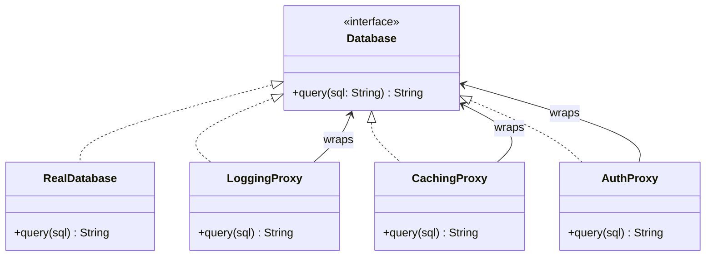

```table-of-contents
title: 
style: nestedList # TOC style (nestedList|nestedOrderedList|inlineFirstLevel)
minLevel: 0 # Include headings from the specified level
maxLevel: 0 # Include headings up to the specified level
include: 
exclude: 
includeLinks: true # Make headings clickable
hideWhenEmpty: false # Hide TOC if no headings are found
debugInConsole: false # Print debug info in Obsidian console
```
# Proxy Pattern

**One-liner:** Provides a surrogate that controls access to another object, adding cross-cutting concerns (lazy init, access control, logging, caching) without modifying the real object.

---

## Why This Exists — The Problem Without It

You need to add logging, caching, and access control to a `DatabaseService`. Without Proxy, you add that code directly into the service class:

```java
public class DatabaseService {

    public User findUser(long id) {
        // PROBLEM: business logic polluted with infrastructure concerns
        long start = System.currentTimeMillis();
        log.info("findUser called with id={}", id);

        // check permissions — mixed with business code
        if (!SecurityContext.currentUser().hasRole("USER_READ")) {
            throw new AccessDeniedException("...");
        }

        // check cache — mixed with business code
        User cached = cache.get("user:" + id);
        if (cached != null) return cached;

        // actual business logic — buried under boilerplate
        User user = jdbcTemplate.queryForObject("SELECT * FROM users WHERE id=?",
                                                 USER_MAPPER, id);
        cache.put("user:" + id, user);
        log.info("findUser done in {}ms", System.currentTimeMillis() - start);
        return user;
    }
    // Every method has this same boilerplate. Adding a new concern = touch every method.
}
```

The cross-cutting concerns (logging, auth, caching) have nothing to do with "find a user in the database." They pollute every method and make the class untestable in isolation.

---

## Real-World Analogy

A credit card is a proxy for your bank account. It presents the same interface to merchants — "accept payment." But behind the scenes it adds: fraud detection (access control), transaction logging (audit), credit limit enforcement (protection), and payment deferral (virtual — money moves later). Your bank account never changed. The card is a surrogate that controls access to it.

---

## The Fix — Clean Implementation

### The shared interface

```java
public interface DatabaseService {
    User findUser(long id);
    void saveUser(User user);
    List<User> findByEmail(String email);
}

// The real implementation — pure business logic, no infrastructure noise
@Repository
public class RealDatabaseService implements DatabaseService {

    private final JdbcTemplate jdbc;

    public RealDatabaseService(JdbcTemplate jdbc) { this.jdbc = jdbc; }

    @Override
    public User findUser(long id) {
        return jdbc.queryForObject("SELECT * FROM users WHERE id=?",
                                   (rs, n) -> mapUser(rs), id);
    }

    @Override
    public void saveUser(User user) {
        jdbc.update("INSERT INTO users(id,name,email) VALUES(?,?,?)",
                    user.id(), user.name(), user.email());
    }

    @Override
    public List<User> findByEmail(String email) {
        return jdbc.query("SELECT * FROM users WHERE email=?",
                          (rs, n) -> mapUser(rs), email);
    }

    private User mapUser(ResultSet rs) throws SQLException {
        return new User(rs.getLong("id"), rs.getString("name"), rs.getString("email"));
    }
}
```

### Proxy Type 1 — Virtual Proxy (lazy initialization)

```java
// Used when the real object is expensive to create.
// Create it only when first needed — not at startup.
public class LazyDatabaseServiceProxy implements DatabaseService {

    private DatabaseService realService;  // null until first use
    private final JdbcTemplate jdbc;

    public LazyDatabaseServiceProxy(JdbcTemplate jdbc) {
        this.jdbc = jdbc;
        // Real service NOT created here — deferred
        System.out.println("LazyProxy: created (real service not yet initialized)");
    }

    private synchronized DatabaseService getRealService() {
        if (realService == null) {
            System.out.println("LazyProxy: initializing real service on first access");
            realService = new RealDatabaseService(jdbc);
        }
        return realService;
    }

    @Override public User findUser(long id)             { return getRealService().findUser(id); }
    @Override public void saveUser(User user)           { getRealService().saveUser(user); }
    @Override public List<User> findByEmail(String em)  { return getRealService().findByEmail(em); }
}
```

### Proxy Type 2 — Protection Proxy (access control)

```java
public class ProtectedDatabaseServiceProxy implements DatabaseService {

    private final DatabaseService real;
    private final AuthorizationService auth;

    public ProtectedDatabaseServiceProxy(DatabaseService real, AuthorizationService auth) {
        this.real = real;
        this.auth = auth;
    }

    @Override
    public User findUser(long id) {
        auth.requireRole("USER_READ");       // throws if not authorized
        return real.findUser(id);
    }

    @Override
    public void saveUser(User user) {
        auth.requireRole("USER_WRITE");
        real.saveUser(user);
    }

    @Override
    public List<User> findByEmail(String email) {
        auth.requireRole("USER_READ");
        return real.findByEmail(email);
    }
}
```

### Proxy Type 3 — Logging Proxy (audit trail)

```java
public class LoggingDatabaseServiceProxy implements DatabaseService {

    private final DatabaseService real;
    private static final Logger log = LoggerFactory.getLogger(LoggingDatabaseServiceProxy.class);

    public LoggingDatabaseServiceProxy(DatabaseService real) { this.real = real; }

    @Override
    public User findUser(long id) {
        long start = System.nanoTime();
        log.info("findUser(id={}) called by user={}", id, currentUser());
        try {
            User result = real.findUser(id);
            log.info("findUser(id={}) returned in {}ms", id, elapsedMs(start));
            return result;
        } catch (Exception e) {
            log.error("findUser(id={}) failed after {}ms: {}", id, elapsedMs(start), e.getMessage());
            throw e;
        }
    }

    @Override public void saveUser(User user) {
        log.info("saveUser(id={}) called", user.id());
        real.saveUser(user);
        log.info("saveUser(id={}) committed", user.id());
    }

    @Override public List<User> findByEmail(String email) {
        log.info("findByEmail({}) called", email);
        return real.findByEmail(email);
    }

    private String currentUser() { return "system"; }
    private long elapsedMs(long startNanos) { return (System.nanoTime() - startNanos) / 1_000_000; }
}
```

### Proxy Type 4 — Caching Proxy (avoid repeated expensive calls)

```java
public class CachingDatabaseServiceProxy implements DatabaseService {

    private final DatabaseService real;
    private final Map<Long, User> userCache = new ConcurrentHashMap<>();
    private final Duration ttl;
    private final Map<Long, Instant> cacheTimestamps = new ConcurrentHashMap<>();

    public CachingDatabaseServiceProxy(DatabaseService real, Duration ttl) {
        this.real = real;
        this.ttl  = ttl;
    }

    @Override
    public User findUser(long id) {
        User cached = userCache.get(id);
        if (cached != null && !isExpired(id)) {
            System.out.println("Cache HIT for user " + id);
            return cached;
        }
        System.out.println("Cache MISS for user " + id + " — fetching from DB");
        User user = real.findUser(id);
        userCache.put(id, user);
        cacheTimestamps.put(id, Instant.now());
        return user;
    }

    @Override
    public void saveUser(User user) {
        real.saveUser(user);
        userCache.remove(user.id());   // invalidate on write
        cacheTimestamps.remove(user.id());
    }

    @Override
    public List<User> findByEmail(String email) {
        return real.findByEmail(email);  // not cached (complex invalidation)
    }

    private boolean isExpired(long id) {
        Instant ts = cacheTimestamps.get(id);
        return ts == null || Instant.now().isAfter(ts.plus(ttl));
    }
}
```

### Composing proxies (all four layers)

```java
// Wiring — compose proxies like Decorators, but each adds a different concern
DatabaseService service = new CachingDatabaseServiceProxy(
        new LoggingDatabaseServiceProxy(
            new ProtectedDatabaseServiceProxy(
                new RealDatabaseService(jdbcTemplate),
                authorizationService
            )
        ),
        Duration.ofMinutes(5)
    );
// Cache checks first → logs → checks auth → hits real DB
```

---

## Class Diagram

```
«interface»
DatabaseService
+ findUser(long): User
+ saveUser(User): void
    ^
    |--- RealDatabaseService         (real subject)
    |--- LoggingDatabaseServiceProxy (proxy — wraps real or another proxy)
    |--- CachingDatabaseServiceProxy (proxy)
    |--- ProtectedDatabaseServiceProxy (proxy)
    `--- LazyDatabaseServiceProxy    (proxy)

All proxies: implement same interface + hold reference to DatabaseService
Client sees only DatabaseService — never knows which layer it's talking to.
```

---

## Real Systems Using This

| System | Proxy type | Mechanism |
|---|---|---|
| Spring `@Transactional` | Behavioral proxy | Spring wraps your bean in a CGLIB or JDK dynamic proxy that opens/commits/rolls back transactions |
| Spring `@Cacheable` | Caching proxy | Proxy checks cache before calling real method, stores result after |
| Hibernate lazy loading | Virtual proxy | `user.getOrders()` returns a proxy; SQL fires only when you iterate the collection |
| `java.lang.reflect.Proxy` | Dynamic proxy | Create a proxy for any interface at runtime without writing a concrete proxy class |
| Netflix Hystrix | Protection proxy | Wraps service calls, trips circuit breaker, falls back on failure |
| MyBatis Mapper | Dynamic proxy | `@Mapper` interface — no implementation class; MyBatis generates a proxy at runtime |

---

## SDE-2/SDE-3 Interview Signals

| If interviewer says... | Think this pattern |
|---|---|
| "Log all method calls without touching each service" | Logging Proxy (or AOP) |
| "Control who can access which methods" | Protection Proxy |
| "Cache expensive database calls transparently" | Caching Proxy |
| "Lazy-initialize the connection pool only on first request" | Virtual Proxy |
| "How does Spring `@Transactional` actually work?" | Proxy (CGLIB/JDK dynamic proxy wrapping your bean) |
| "Audit trail of every write operation" | Logging Proxy |
| "Rate-limit calls to an external API" | Protection Proxy |

---

## When to Use

- You need lazy initialization of an expensive object (Virtual Proxy).
- You need access control checks before delegating to the real object (Protection Proxy).
- You need audit logging of all operations without polluting the real class (Logging Proxy).
- You need transparent caching of expensive operations (Caching Proxy).
- The real object lives in another process or on a remote server (Remote Proxy — RMI, gRPC stub).

## When NOT to Use

- When the cross-cutting concern is truly local to the class — just handle it there.
- When you need to add business logic — that belongs in the real service, not in the proxy.
- When you need to change the interface — that is Adapter, not Proxy.
- When latency from the extra method dispatch matters at microsecond scale — profile first.

---

## Trade-offs & Alternatives

| Aspect | Detail |
|---|---|
| Pro: Separation of concerns | Real class is pure business logic; proxies add infrastructure |
| Pro: Open/Closed | Add a new concern (rate limiting) by adding a proxy, not touching the real class |
| Pro: Transparent to client | Client calls the same interface whether it hits proxy or real object |
| Con: Class proliferation | Many proxy types for one interface; AOP solves this at scale |
| Con: Debugging complexity | Stack traces go through proxy layers — confusing without good logging |

**Alternatives:**
- **AOP (Aspect-Oriented Programming):** Spring AOP is proxy generation automated. When you have many classes needing the same cross-cutting concern, AOP is more scalable than hand-written proxies.
- **Decorator:** Decorator adds behavior to SAME interface (stacking N layers). Proxy controls access to ONE real object. Semantically different intent.
- **Adapter:** Changes the interface. Proxy keeps the same interface.

---

## Common Interview Mistakes

1. **Putting business logic in a proxy.** Proxy adds cross-cutting concerns only. Discount logic, validation rules, domain behavior — none of that belongs in a proxy.
2. **Confusing Proxy with Decorator.** Both wrap objects implementing the same interface. Distinction: Proxy controls access (usually one layer per concern). Decorator adds behavior (stacks N layers). Spring `@Transactional` = proxy. Java IO = decorator.
3. **Not understanding how Spring AOP proxies work.** Spring creates a CGLIB subclass proxy (or JDK dynamic proxy for interfaces) at startup. Calling `this.method()` inside a Spring bean bypasses the proxy — a famous and common bug.
4. **Forgetting that JDK dynamic proxy requires an interface.** `Proxy.newProxyInstance` only works on interfaces. For classes, you need CGLIB (which Spring uses for `@Transactional` on concrete classes).
5. **Using Proxy when a simple null-check or boolean flag would do.** Do not reach for a pattern when simpler code works.

---

## Mermaid Class Diagram



---

## Executable Example (Copy-Paste-Run)

```java
// File: ProxyDemo.java
// Run:  javac ProxyDemo.java && java ProxyDemo

import java.util.*;

public class ProxyDemo {

    interface ImageLoader {
        void display();
        String getFileName();
    }

    // Real object — expensive (loads from disk)
    static class RealImage implements ImageLoader {
        private final String fileName;
        RealImage(String file) {
            this.fileName = file;
            System.out.println("  [LOADING] Loading " + file + " from disk... (expensive)");
        }
        public void display() { System.out.println("  [DISPLAY] Showing " + fileName); }
        public String getFileName() { return fileName; }
    }

    // Virtual Proxy — delays loading until needed
    static class LazyImageProxy implements ImageLoader {
        private final String fileName;
        private RealImage realImage;  // null until first display()

        LazyImageProxy(String file) { this.fileName = file; }

        public void display() {
            if (realImage == null) {
                realImage = new RealImage(fileName);  // load on first use
            }
            realImage.display();
        }
        public String getFileName() { return fileName; }
    }

    public static void main(String[] args) {
        System.out.println("=== Creating 3 proxy images (NO loading yet) ===");
        ImageLoader img1 = new LazyImageProxy("photo1.jpg");
        ImageLoader img2 = new LazyImageProxy("photo2.jpg");
        ImageLoader img3 = new LazyImageProxy("photo3.jpg");
        System.out.println("(No disk I/O happened — proxies are lightweight)");

        System.out.println("\n=== Displaying img1 (loads NOW) ===");
        img1.display();

        System.out.println("\n=== Displaying img1 again (already loaded, no reload) ===");
        img1.display();

        System.out.println("\n=== img2 and img3 still NOT loaded ===");
        System.out.println("img2 loaded? " + (img2.getFileName() + " — not yet"));
    }
}
```

**Expected output:**
```
=== Creating 3 proxy images (NO loading yet) ===
(No disk I/O happened — proxies are lightweight)

=== Displaying img1 (loads NOW) ===
  [LOADING] Loading photo1.jpg from disk... (expensive)
  [DISPLAY] Showing photo1.jpg

=== Displaying img1 again (already loaded, no reload) ===
  [DISPLAY] Showing photo1.jpg

=== img2 and img3 still NOT loaded ===
img2 loaded? photo2.jpg — not yet
```

---

## Anti-Pattern

```java
// Loading ALL images on page load — even ones below the fold
List<RealImage> images = urls.stream()
    .map(RealImage::new)  // ALL loaded immediately = 5 second page load
    .toList();
// With LazyImageProxy: only loaded when scrolled into view
```

---

## Spring Boot Connection

```java
// Spring AOP = Proxy pattern under the hood
@Transactional  // Spring creates a proxy around this method
public void placeOrder() { }

@Cacheable("users")  // Spring's caching proxy
public User findById(String id) { return db.findById(id); }

// GOTCHA: this.method() bypasses proxy!
// Fix: inject self or use AopContext.currentProxy()
```

---

## Which LLD Problems Use This

- [[../../examples/lld_cache_lru_lfu]] — Caching proxy wrapping DB calls
- [[../../examples/lld_rate_limiter]] — Rate limiting proxy on API calls

---

## Follow-up Questions

| Question | Answer |
|----------|--------|
| "Proxy vs Decorator?" | Proxy controls ACCESS. Decorator adds BEHAVIOR. |
| "How does Spring @Transactional work?" | Spring creates a CGLIB proxy that wraps the method with begin/commit/rollback. |
| "Proxy vs Adapter?" | Proxy keeps the SAME interface. Adapter changes it. |

---

## Interview Script

> "I need to [control access / lazy-load / cache / log] without modifying the real class. I'll use a Proxy — same interface as the real object, intercepts calls, adds the concern, then delegates. In Spring, `@Transactional` and `@Cacheable` are exactly this — generated proxies."

---

## Thread-Safety Note

```
Virtual proxy: lazy initialization needs synchronization (DCL or synchronized).
Caching proxy: use ConcurrentHashMap for thread-safe cache.
Logging proxy: stateless → thread-safe.
```

---

## Complexity Analysis

| Scenario | Without Proxy | With Proxy |
|----------|--------------|-----------|
| Add caching | Modify every method | Wrap with CachingProxy |
| Add auth check | Modify every endpoint | Wrap with AuthProxy |
| Lazy loading | Load everything upfront | Load on first access |

---

## Combines Well With

- **Factory / DI:** Return proxy from factory; inject via interface.
- **Decorator:** Stack proxies like decorators.
- **Strategy:** Proxy selects real implementation at runtime.
- **Null Object:** Special case of Proxy — absorbs calls silently.

---

## Cheat Sheet

```
PROXY IN 5 LINES:
1. Define the interface (shared by real object and proxy)
2. Real object implements interface with pure business logic
3. Proxy implements same interface, holds reference to real object
4. Proxy intercepts calls: add concern → delegate to real → post-process
5. Wire via DI — inject proxy where interface is expected; client never knows

4 types: Virtual (lazy init) | Protection (auth) | Logging (audit) | Caching (memoize)
Spring @Transactional, @Cacheable = generated proxies. Calling this.method() skips them.
Proxy keeps the interface. Adapter changes it. Decorator stacks behavior. Proxy controls access.
Red flag: business logic inside proxy = wrong class.
```

---
---

# ChatGPT
## Proxy Pattern

Let's start with the simplest possible intuition first.

---

## Real World Analogy

Think of a **security guard** at a corporate office.

You want to meet the CEO. You don't walk straight in. The security guard:

- Checks if you have an appointment (**access control**)
- Logs your entry time (**logging**)
- If the CEO is busy, makes you wait (**lazy loading**)
- Sometimes handles your request himself without disturbing the CEO (**caching**)

The security guard is the **Proxy**. The CEO is the **Real Object**. You never talk to the CEO directly — you always go through the guard.

---

## How it differs from Decorator

Before going further — this is the most common interview confusion:

||Decorator|Proxy|
|---|---|---|
|**Intent**|Add new behaviour|Control access|
|**Who creates it**|Client stacks them manually|Proxy creates/controls the real object itself|
|**Client knows?**|Client wraps intentionally|Client thinks it's talking to the real thing|
|**Example**|Adding logging, caching as layers|Security guard, lazy loader, remote stub|

**Key insight:** Decorator adds features. Proxy controls access. Structurally they look the same — the difference is pure intent.

---

## UML First---
![[Pasted image 20260321024805.png]]

## The 4 Types of Proxy — Each Solves a Different Problem

### 1. Virtual Proxy — Lazy Loading

Don't create expensive objects until you actually need them.

```java
interface Image {
    void display();
}

// Real object — expensive to create (reads from disk)
class RealImage implements Image {
    private String filename;

    public RealImage(String filename) {
        this.filename = filename;
        loadFromDisk();   // expensive operation
    }

    private void loadFromDisk() {
        System.out.println("Loading image from disk: " + filename);
    }

    public void display() {
        System.out.println("Displaying: " + filename);
    }
}

// Virtual Proxy — delays creation until display() is actually called
class ImageProxy implements Image {
    private String filename;
    private RealImage realImage;   // null until needed

    public ImageProxy(String filename) {
        this.filename = filename;
        // RealImage NOT created here — no disk read yet
    }

    public void display() {
        if (realImage == null) {
            realImage = new RealImage(filename);  // created only on first use
        }
        realImage.display();
    }
}

// Client code
public class Main {
    public static void main(String[] args) {
        Image image = new ImageProxy("photo.jpg");
        // nothing loaded yet — no disk read

        System.out.println("Doing other work...");

        image.display();   // NOW it loads — only when needed
        image.display();   // second call — no reload, reuses existing
    }
}
```

**Real world:** JPA lazy loading. When you fetch a `User`, its `List<Orders>` is a proxy — not loaded until you actually call `user.getOrders()`.

---

### 2. Protection Proxy — Access Control

```java
interface DatabaseService {
    void read(String query);
    void write(String query);
    void delete(String query);
}

class RealDatabaseService implements DatabaseService {
    public void read(String query)   { System.out.println("Executing read: " + query); }
    public void write(String query)  { System.out.println("Executing write: " + query); }
    public void delete(String query) { System.out.println("Executing delete: " + query); }
}

// Protection Proxy — checks roles before allowing operations
class DatabaseServiceProxy implements DatabaseService {
    private RealDatabaseService db;
    private String userRole;

    public DatabaseServiceProxy(String userRole) {
        this.db = new RealDatabaseService();
        this.userRole = userRole;
    }

    public void read(String query) {
        // everyone can read
        db.read(query);
    }

    public void write(String query) {
        if (!userRole.equals("ADMIN") && !userRole.equals("EDITOR")) {
            throw new SecurityException("Write access denied for role: " + userRole);
        }
        db.write(query);
    }

    public void delete(String query) {
        if (!userRole.equals("ADMIN")) {
            throw new SecurityException("Delete access denied for role: " + userRole);
        }
        db.delete(query);
    }
}

// Client code
DatabaseService userDb  = new DatabaseServiceProxy("USER");
DatabaseService adminDb = new DatabaseServiceProxy("ADMIN");

userDb.read("SELECT * FROM products");    // ✅ allowed
userDb.delete("DELETE FROM users");       // ❌ SecurityException

adminDb.delete("DELETE FROM temp_logs");  // ✅ allowed
```

---

### 3. Caching Proxy — Avoid Redundant Work

```java
interface ProductService {
    Product getProduct(Long id);
}

class RealProductService implements ProductService {
    public Product getProduct(Long id) {
        System.out.println("Fetching product from DB: " + id);
        return productRepository.findById(id);  // expensive DB call
    }
}

// Caching Proxy — serves from cache, hits DB only on miss
class CachingProductProxy implements ProductService {
    private RealProductService service;
    private Map<Long, Product> cache = new HashMap<>();

    public CachingProductProxy(RealProductService service) {
        this.service = service;
    }

    public Product getProduct(Long id) {
        if (cache.containsKey(id)) {
            System.out.println("Cache hit for product: " + id);
            return cache.get(id);
        }

        Product product = service.getProduct(id);   // delegate to real
        cache.put(id, product);
        return product;
    }
}
```

**Real world:** Spring's `@Cacheable` generates a caching proxy around your method automatically.

---

### 4. Remote Proxy — Hide Network Complexity

The client talks to a local object but calls actually go over the network:

```java
interface PaymentService {
    PaymentResult process(PaymentRequest request);
}

// Remote Proxy — looks local, but calls Stripe's API over network
class StripePaymentProxy implements PaymentService {
    private static final String STRIPE_URL = "https://api.stripe.com/v1/charges";
    private RestTemplate restTemplate;

    public PaymentResult process(PaymentRequest request) {
        // Client thinks this is a local call
        // Proxy handles all HTTP, retries, serialization internally
        try {
            return restTemplate.postForObject(
                STRIPE_URL,
                request.toStripeRequest(),
                PaymentResult.class
            );
        } catch (HttpClientErrorException e) {
            throw new PaymentException("Payment failed: " + e.getMessage());
        }
    }
}

// Client has no idea this goes over network
PaymentService payment = new StripePaymentProxy(restTemplate);
PaymentResult result = payment.process(new PaymentRequest(1000, "USD"));
```

**Real world:** gRPC stubs, Feign clients in Spring Cloud — you call a Java interface, proxy handles the HTTP call to the remote service.

---

## How Spring Uses Proxy Internally

This is the most important part for SDE-2 interviews:

```java
@Service
class OrderService {

    @Transactional     // Spring wraps this in a TransactionProxy
    public void placeOrder(Order order) {
        // Spring proxy:
        // 1. opens a transaction before this runs
        // 2. calls your actual method
        // 3. commits or rolls back after
    }

    @Cacheable("products")   // Spring wraps this in a CachingProxy
    public Product getProduct(Long id) {
        return productRepository.findById(id);
    }
}
```

When Spring sees `@Transactional`, it creates a **dynamic proxy** (using JDK Proxy or CGLIB) that wraps your bean. You think you're calling `orderService.placeOrder()` but you're actually calling the proxy which manages the transaction around your real method.

```
Your Code
    │
    ▼
Spring Proxy (TransactionProxy)
    │  opens transaction
    ▼
Your OrderService.placeOrder()
    │  runs business logic
    ▼
Spring Proxy
    │  commits or rolls back
    ▼
Returns to your code
```

---

## All 4 Types at a Glance

|Type|Problem it solves|Real example|
|---|---|---|
|**Virtual**|Expensive object creation|JPA lazy loading|
|**Protection**|Access control by role|Spring Security|
|**Caching**|Redundant expensive calls|`@Cacheable`|
|**Remote**|Network call complexity|Feign clients, gRPC stubs|

---

## Proxy vs Decorator — Final Clarity

```java
// DECORATOR — client stacks them intentionally, adds behaviour
Coffee order = new Whip(new Caramel(new Espresso()));

// PROXY — client has no idea, thinks it's real object, controls access
OrderService service = context.getBean(OrderService.class);
// Spring silently gave you a proxy — you have no idea
service.placeOrder(order);  // actually calls Spring's TransactionProxy first
```

---

## Trade-offs to Mention in Interviews

**Pros:**

- Clean separation — cross cutting concerns (security, caching, logging) stay out of business logic
- Client code stays simple — never knows or cares about proxy
- Open/Closed — add new proxy behaviour without touching real object

**Cons:**

- Extra indirection — harder to debug (stack traces go through proxy layers)
- Response time may increase slightly
- Can be confusing when Spring proxies fail silently (e.g. calling `@Transactional` on a private method — proxy can't intercept it)

---

## Classic Spring Gotcha — Interview Favourite

```java
@Service
class OrderService {

    @Transactional
    public void placeOrder(Order order) {
        saveOrder(order);    // calls internal method
    }

    @Transactional         // THIS ANNOTATION IS IGNORED
    public void saveOrder(Order order) {
        // because internal calls bypass the proxy entirely
        // self-invocation skips Spring's proxy
    }
}
```

Knowing this gotcha shows SDE-2 level understanding of how proxies actually work under the hood.

---

## One-line SDE-2 Summary

> _"Proxy provides a surrogate object that controls access to the real object — used for lazy loading, access control, caching, and remote calls — and is the mechanism Spring uses under the hood for `@Transactional`, `@Cacheable`, and Spring Security."_

---

Want to continue with **Observer pattern** next? It's heavily used in event-driven systems and microservices — and pairs naturally with these structural patterns you've just learned.