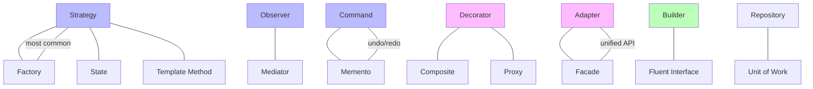

#system-design #lld #patterns #advanced

# Pattern Combinations — How Patterns Compose in Real Systems

> Real systems never use just one pattern. Here's how they combine.

---

## Pattern Combination Map



---

## Combo 1: Strategy + Factory

**Problem:** Need different algorithms AND clean creation.
**Real use:** Payment processing, discount calculation, notification routing.

```java
// Strategy
public interface PaymentProcessor {
    PaymentResult process(Money amount);
}

public class UPIProcessor implements PaymentProcessor { ... }
public class CreditCardProcessor implements PaymentProcessor { ... }
public class NetBankingProcessor implements PaymentProcessor { ... }

// Factory creates the right strategy
public class PaymentProcessorFactory {
    private static final Map<String, Supplier<PaymentProcessor>> registry = Map.of(
        "UPI", UPIProcessor::new,
        "CREDIT_CARD", CreditCardProcessor::new,
        "NET_BANKING", NetBankingProcessor::new
    );

    public static PaymentProcessor create(String method) {
        return registry.getOrDefault(method, () -> {
            throw new IllegalArgumentException("Unknown: " + method);
        }).get();
    }
}

// Usage — clean, extensible
PaymentProcessor processor = PaymentProcessorFactory.create("UPI");
processor.process(new Money(500, "INR"));
```

---

## Combo 2: Observer + Mediator

**Problem:** Many-to-many communication between objects.
**Real use:** Chat room, event bus, game engine.

```java
// Mediator coordinates all communication
public class EventBus {
    private Map<String, List<Consumer<Event>>> subscribers = new HashMap<>();

    public void subscribe(String eventType, Consumer<Event> handler) {
        subscribers.computeIfAbsent(eventType, k -> new ArrayList<>()).add(handler);
    }

    public void publish(Event event) {
        subscribers.getOrDefault(event.getType(), List.of())
            .forEach(handler -> handler.accept(event));
    }
}

// Services subscribe — fully decoupled
eventBus.subscribe("ORDER_PLACED", e -> emailService.sendConfirmation(e));
eventBus.subscribe("ORDER_PLACED", e -> inventoryService.reserve(e));
eventBus.subscribe("ORDER_PLACED", e -> analyticsService.track(e));
eventBus.publish(new Event("ORDER_PLACED", orderData));
```

---

## Combo 3: State + Strategy

**Problem:** Object has states, and each state has different algorithm variants.
**Real use:** Order processing (state) with different shipping strategies per state.

---

## Combo 4: Builder + Fluent Interface

**Problem:** Complex object with many optional fields.
**Real use:** Query builders, configuration, HTTP request builders.

```java
public class HttpRequest {
    private final String url;
    private final String method;
    private final Map<String, String> headers;
    private final String body;
    private final int timeout;

    private HttpRequest(Builder builder) {
        this.url = builder.url;
        this.method = builder.method;
        this.headers = builder.headers;
        this.body = builder.body;
        this.timeout = builder.timeout;
    }

    public static class Builder {
        private String url;
        private String method = "GET";
        private Map<String, String> headers = new HashMap<>();
        private String body;
        private int timeout = 30000;

        public Builder(String url) { this.url = url; }
        public Builder method(String m) { this.method = m; return this; }
        public Builder header(String k, String v) { headers.put(k, v); return this; }
        public Builder body(String b) { this.body = b; return this; }
        public Builder timeout(int ms) { this.timeout = ms; return this; }
        public HttpRequest build() { return new HttpRequest(this); }
    }
}

// Clean, readable
HttpRequest req = new HttpRequest.Builder("https://api.razorpay.com/v1/payments")
    .method("POST")
    .header("Authorization", "Bearer token")
    .header("Content-Type", "application/json")
    .body("{\"amount\": 50000}")
    .timeout(5000)
    .build();
```

---

## Combo 5: Repository + Unit of Work

**Problem:** Data access logic scattered, no transaction boundary.
**Real use:** Any service with database operations (Spring Data pattern).

```java
// Repository — data access abstraction
public interface OrderRepository {
    Order findById(String id);
    List<Order> findByUserId(String userId);
    void save(Order order);
}

// Unit of Work — transaction boundary
@Transactional
public class OrderService {
    private final OrderRepository orderRepo;
    private final InventoryRepository inventoryRepo;

    public void placeOrder(OrderRequest request) {
        // All operations in one transaction
        Order order = new Order(request);
        orderRepo.save(order);
        inventoryRepo.reserve(order.getItems());
        // If anything fails, entire transaction rolls back
    }
}
```

---

---

## Combo 6: Decorator + Composite

**Problem:** Need to add behavior dynamically AND handle tree structures uniformly.
**Real use:** UI component trees, file system with permissions, stream pipelines.

```java
// Component — both leaf and composite implement this
public interface UIComponent {
    void render();
    int getWidth();
}

// Leaf
public class TextLabel implements UIComponent {
    private final String text;
    public TextLabel(String text) { this.text = text; }
    public void render()    { System.out.println("Label: " + text); }
    public int getWidth()   { return text.length() * 8; }
}

// Composite — contains other components
public class Panel implements UIComponent {
    private final List<UIComponent> children = new ArrayList<>();

    public void add(UIComponent c) { children.add(c); }
    public void render()    { children.forEach(UIComponent::render); }
    public int getWidth()   { return children.stream().mapToInt(UIComponent::getWidth).sum(); }
}

// Decorator — wraps ANY component (leaf or composite)
public class BorderDecorator implements UIComponent {
    private final UIComponent wrapped;
    private final int borderWidth;

    public BorderDecorator(UIComponent c, int borderWidth) {
        this.wrapped     = c;
        this.borderWidth = borderWidth;
    }

    public void render() {
        System.out.println("--- border ---");
        wrapped.render();
        System.out.println("--- border ---");
    }

    public int getWidth() { return wrapped.getWidth() + (borderWidth * 2); }
}

// Usage — Decorator wraps a Composite seamlessly
Panel panel = new Panel();
panel.add(new TextLabel("Name"));
panel.add(new TextLabel("Email"));

// Add border to the ENTIRE panel (composite) — Decorator doesn't care
UIComponent borderedPanel = new BorderDecorator(panel, 2);
borderedPanel.render();
```

---

## Combo 7: Command + Memento (Undo/Redo)

**Problem:** Need full undo/redo — not just reverse the operation, but restore exact state.
**Real use:** Text editors, drawing apps, DB transaction rollback.

```java
// Command encapsulates operations
public interface Command {
    void execute();
    void undo();
}

// Memento holds snapshots
public class DocumentMemento {
    final String content;
    DocumentMemento(String content) { this.content = content; }
}

public class Document {
    private String content = "";

    public DocumentMemento save()               { return new DocumentMemento(content); }
    public void restore(DocumentMemento m)      { this.content = m.content; }
    public void append(String text)             { content += text; }
    public String getContent()                  { return content; }
}

// Command uses Memento to save state BEFORE executing — enables reliable undo
public class AppendCommand implements Command {
    private final Document doc;
    private final String text;
    private DocumentMemento savedState;  // snapshot before change

    public AppendCommand(Document doc, String text) {
        this.doc  = doc;
        this.text = text;
    }

    public void execute() {
        savedState = doc.save();     // save BEFORE change
        doc.append(text);
    }

    public void undo() {
        doc.restore(savedState);     // restore exact pre-change state
    }
}

// History manager
public class Editor {
    private final Document doc         = new Document();
    private final Deque<Command> history = new ArrayDeque<>();

    public void executeCommand(Command cmd) {
        cmd.execute();
        history.push(cmd);
    }

    public void undo() {
        if (!history.isEmpty()) history.pop().undo();
    }
}

// Usage
Editor editor = new Editor();
editor.executeCommand(new AppendCommand(editor.doc, "Hello"));
editor.executeCommand(new AppendCommand(editor.doc, " World"));
editor.undo();  // → "Hello"
editor.undo();  // → ""
```

---

## Combo 8: Template Method + Strategy

**Problem:** Algorithm skeleton is fixed but one step varies AND that step needs to be selected at runtime (not compile time via inheritance).

**Real use:** Report generation (fixed pipeline, variable formatter), data pipeline (fixed ETL steps, variable transform logic).

```java
// Template method defines fixed skeleton
public abstract class ReportGenerator {
    // Template method — fixed pipeline
    public final String generate(ReportData data) {
        String raw       = fetchData(data);
        String formatted = format(raw);         // varies — delegates to strategy
        String validated = validate(formatted);
        return output(validated);
    }

    protected String fetchData(ReportData data)     { return data.getRawContent(); }
    protected abstract String format(String raw);   // hook — subclasses define
    protected String validate(String content)        { return content.trim(); }
    protected String output(String content)          { return content; }
}

// Strategy for the varying step
public interface FormatStrategy {
    String format(String raw);
}

public class PDFFormat  implements FormatStrategy { public String format(String r) { return "<pdf>" + r + "</pdf>"; } }
public class CSVFormat  implements FormatStrategy { public String format(String r) { return r.replace(" ", ","); } }
public class JSONFormat implements FormatStrategy { public String format(String r) { return "{\"data\":\"" + r + "\"}"; } }

// Concrete generator uses injected strategy for the variable step
public class SalesReport extends ReportGenerator {
    private final FormatStrategy formatter;

    public SalesReport(FormatStrategy formatter) { this.formatter = formatter; }

    protected String format(String raw) { return formatter.format(raw); }  // delegates to strategy
}

// Usage — same report, different formats at runtime
ReportGenerator pdfReport  = new SalesReport(new PDFFormat());
ReportGenerator csvReport  = new SalesReport(new CSVFormat());
ReportGenerator jsonReport = new SalesReport(new JSONFormat());
```

---

## Combo 9: Adapter + Facade

**Problem:** Multiple external services with incompatible interfaces need to be wrapped into ONE simplified API for internal use.

**Real use:** Payment gateway aggregator, notification service unifier, analytics wrapper.

```java
// External SDKs — all different interfaces
class TwilioSMS    { public void sendSMS(String to, String body, String apiKey) { } }
class SendGridEmail { public void dispatch(EmailPayload payload)                  { } }
class FirebasePush  { public void push(String deviceToken, Map<String, String> data) { } }

// Adapters — normalize each to our interface
public interface NotificationChannel {
    void send(String recipient, String message);
}

public class TwilioAdapter implements NotificationChannel {
    private final TwilioSMS twilio;
    private final String apiKey;
    public TwilioAdapter(TwilioSMS t, String key) { twilio = t; apiKey = key; }
    public void send(String to, String message) {
        twilio.sendSMS(to, message, apiKey);
    }
}

public class SendGridAdapter implements NotificationChannel {
    private final SendGridEmail sendGrid;
    public SendGridAdapter(SendGridEmail s) { sendGrid = s; }
    public void send(String to, String message) {
        sendGrid.dispatch(new EmailPayload(to, message));
    }
}

// Facade — single entry point, hides all adapters
public class NotificationService {
    private final Map<String, NotificationChannel> channels;

    public NotificationService() {
        channels = Map.of(
            "sms",   new TwilioAdapter(new TwilioSMS(), "key123"),
            "email", new SendGridAdapter(new SendGridEmail()),
            "push",  new FirebaseAdapter(new FirebasePush())
        );
    }

    // Simple unified API — client doesn't know Twilio, SendGrid, Firebase exist
    public void notify(String channel, String recipient, String message) {
        NotificationChannel ch = channels.get(channel);
        if (ch == null) throw new IllegalArgumentException("Unknown channel: " + channel);
        ch.send(recipient, message);
    }
}

// Client — dead simple
NotificationService notifier = new NotificationService();
notifier.notify("sms",   "+91-9999999999", "Your OTP is 1234");
notifier.notify("email", "user@gmail.com", "Welcome to our platform");
```

---

## Combo 10: Proxy + Decorator

**Problem:** Need BOTH access control/caching (Proxy) AND additional behavior stacking (Decorator).

**Real use:** API gateway (auth proxy + rate limit decorator + logging decorator), database access.

```java
public interface DataService {
    String fetchData(String query, String userId);
}

// Real service
public class DatabaseService implements DataService {
    public String fetchData(String query, String userId) {
        return "DB result for: " + query;
    }
}

// Proxy — access control (authentication/authorization)
public class AuthProxy implements DataService {
    private final DataService real;
    private final Set<String> authorizedUsers = Set.of("admin", "user1");

    public AuthProxy(DataService real) { this.real = real; }

    public String fetchData(String query, String userId) {
        if (!authorizedUsers.contains(userId))
            throw new SecurityException("Unauthorized: " + userId);
        return real.fetchData(query, userId);
    }
}

// Decorator — caching (adds behavior on top)
public class CachingDecorator implements DataService {
    private final DataService wrapped;
    private final Map<String, String> cache = new HashMap<>();

    public CachingDecorator(DataService wrapped) { this.wrapped = wrapped; }

    public String fetchData(String query, String userId) {
        String cacheKey = userId + ":" + query;
        return cache.computeIfAbsent(cacheKey, k -> wrapped.fetchData(query, userId));
    }
}

// Decorator — logging
public class LoggingDecorator implements DataService {
    private final DataService wrapped;

    public LoggingDecorator(DataService wrapped) { this.wrapped = wrapped; }

    public String fetchData(String query, String userId) {
        System.out.println("[LOG] " + userId + " querying: " + query);
        String result = wrapped.fetchData(query, userId);
        System.out.println("[LOG] Result size: " + result.length());
        return result;
    }
}

// Stack them: Logging → Cache → Auth → Real DB
DataService service = new LoggingDecorator(
                        new CachingDecorator(
                          new AuthProxy(
                            new DatabaseService())));

service.fetchData("SELECT * FROM orders", "admin");
// Logs the call → checks cache → checks auth → hits DB
```

---

## Quick Reference

| Combination | Use Case |
|-------------|----------|
| Strategy + Factory | Multiple algorithms with clean creation |
| Observer + Mediator | Event-driven decoupled communication |
| State + Strategy | State-dependent behavior variants |
| Builder + Fluent | Complex object construction |
| Repository + Unit of Work | Clean data access with transactions |
| Decorator + Composite | Add behavior to entire tree uniformly |
| Command + Memento | Reliable undo/redo with state snapshots |
| Template Method + Strategy | Fixed pipeline, runtime-swappable step |
| Adapter + Facade | Unified API over multiple external SDKs |
| Proxy + Decorator | Access control + stacked behavior |

## Links

- [[creational]] — Factory, Builder patterns
- [[structural]] — Adapter, Decorator patterns
- [[behavioral]] — Strategy, Observer, State, Command patterns
- [[../code_architecture/dependency_injection]] — How to wire patterns together
