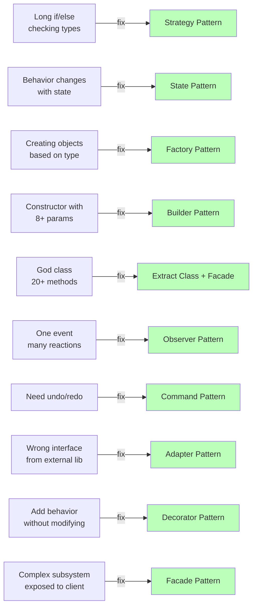

#system-design #lld #patterns #decision

# Smell → Pattern Map — Decision Table

> See a smell? Look up the fix. Like a doctor's prescription pad.

## Smell-to-Pattern Decision Flow



---

## The Map

| Code Smell | What You See | Fix With Pattern | SOLID Principle |
|-----------|-------------|------------------|-----------------|
| Long if/else checking types | `if (type == "A") ... else if (type == "B")` | **Strategy** | Open/Closed |
| Object behavior changes with state | `if (status == "PENDING") ... else if (status == "SHIPPED")` | **State** | Open/Closed |
| Creating objects based on type | `if (type == "email") return new Email()` | **Factory** | Open/Closed, DIP |
| Constructor with 8+ params | `new Order(a, b, c, d, e, f, g, h)` | **Builder** | — |
| God class (too many responsibilities) | Class with 20+ methods | **Extract Class** + Facade | SRP |
| Feature envy (using other's data) | Method uses 5 fields from another class | **Move Method** | SRP |
| Duplicate code in subclasses | Same algorithm, different details | **Template Method** | DRY |
| Multiple objects react to one change | Direct calls to notify 5 services | **Observer** | OCP, DIP |
| Need undo/redo | No way to reverse operations | **Command** | SRP |
| External API has wrong interface | Can't use library directly | **Adapter** | DIP |
| Adding behavior without modifying | Need logging/caching on existing class | **Decorator** | OCP |
| Complex subsystem exposure | Client needs to know 10 internal classes | **Facade** | ISP |
| Tree structure handling | Folders containing files and subfolders | **Composite** | LSP |
| Global resource (pool, config) | Multiple instances cause problems | **Singleton** (sparingly) | — |
| Expensive object creation | Clone instead of recreate | **Prototype** | — |

## Decision Flowchart

```
"What kind of problem do I have?"
│
├── "Algorithm varies" → Strategy
├── "Behavior changes with state" → State
├── "Need to create the right type" → Factory
├── "Complex construction" → Builder
├── "One event, many reactions" → Observer
├── "Queue/undo operations" → Command
├── "Same algorithm, different steps" → Template Method
├── "Wrong interface" → Adapter
├── "Add behavior transparently" → Decorator
├── "Simplify complex system" → Facade
├── "Tree structure" → Composite
└── "Control access to object" → Proxy
```

## Anti-Patterns: When NOT to Use Patterns

| Don't Use | When |
|-----------|------|
| Strategy | Only 2 options that won't grow (if/else is fine) |
| Singleton | Anywhere dependency injection is possible |
| Factory | Only one concrete type (direct `new` is fine) |
| Observer | Only 1 subscriber (direct call is clearer) |
| Decorator | Only 1 decoration needed (just extend the class) |

**Rule:** Don't apply a pattern unless the smell is real. Three similar lines of code are better than a premature abstraction.

## Links

- [[../design_smell_catalog]] — Full smell descriptions
- [[../solid_with_refactoring]] — Principles behind each fix
- [[creational]] — Factory, Builder, Singleton, Prototype
- [[structural]] — Adapter, Decorator, Facade, Proxy, Composite
- [[behavioral]] — Strategy, Observer, Command, State, Template Method
