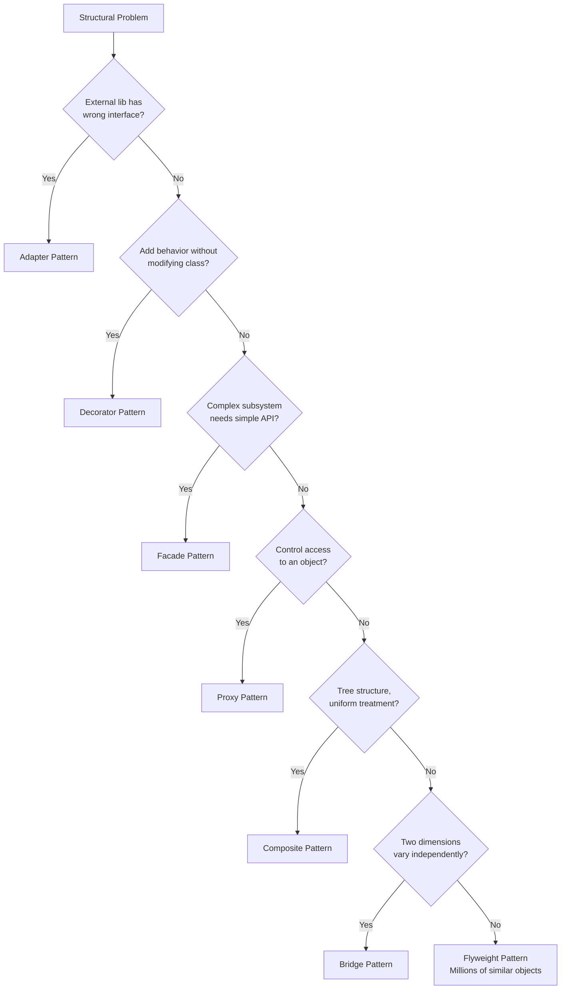

#system-design #lld #patterns #structural

# Structural Patterns — How to Compose Objects

---

## Which Structural Pattern?



---

## Adapter

**Problem:** You need to use a class but its interface doesn't match what you expect.
**Solution:** Wrap it with an adapter that translates the interface.

```python
# External payment library with weird interface
class StripeSDK:
    def create_charge(self, amount_cents, currency, source_token):
        return {"id": "ch_123", "status": "succeeded"}

# Your clean interface
class PaymentGateway(ABC):
    @abstractmethod
    def pay(self, amount: float, currency: str) -> bool: ...

# Adapter bridges the gap
class StripeAdapter(PaymentGateway):
    def __init__(self, stripe: StripeSDK, token: str):
        self.stripe = stripe
        self.token = token

    def pay(self, amount: float, currency: str) -> bool:
        result = self.stripe.create_charge(int(amount * 100), currency, self.token)
        return result["status"] == "succeeded"

# Your code only knows about PaymentGateway — never touches StripeSDK directly
```

**Use when:** Integrating with external libraries, legacy code, or APIs that don't match your interface.

---

## Decorator

**Problem:** Need to add behavior to an object without modifying its class.
**Solution:** Wrap it with a decorator that adds behavior before/after.

```python
class DataSource(ABC):
    @abstractmethod
    def read(self) -> str: ...
    @abstractmethod
    def write(self, data: str): ...

class FileDataSource(DataSource):
    def read(self) -> str: return "raw data"
    def write(self, data: str): print(f"Writing: {data}")

class EncryptionDecorator(DataSource):
    def __init__(self, source: DataSource):
        self.source = source

    def read(self) -> str:
        data = self.source.read()
        return self._decrypt(data)

    def write(self, data: str):
        self.source.write(self._encrypt(data))

    def _encrypt(self, data): return f"encrypted({data})"
    def _decrypt(self, data): return f"decrypted({data})"

class CompressionDecorator(DataSource):
    def __init__(self, source: DataSource):
        self.source = source

    def read(self) -> str:
        return f"decompressed({self.source.read()})"

    def write(self, data: str):
        self.source.write(f"compressed({data})")

# Stack decorators — order matters!
source = CompressionDecorator(EncryptionDecorator(FileDataSource()))
source.write("hello")  # compressed(encrypted(hello))
```

**Use when:** Adding cross-cutting concerns (logging, caching, encryption, compression) without modifying the original class.

---

## Facade

**Problem:** Complex subsystem with many classes. Clients need a simple interface.
**Solution:** Provide a unified, simplified interface to the subsystem.

```python
# Complex subsystem
class VideoDecoder: ...
class AudioDecoder: ...
class SubtitleLoader: ...
class ScreenRenderer: ...

# Facade — simple interface
class VideoPlayer:
    def __init__(self):
        self._video = VideoDecoder()
        self._audio = AudioDecoder()
        self._subs = SubtitleLoader()
        self._screen = ScreenRenderer()

    def play(self, file_path: str):
        video = self._video.decode(file_path)
        audio = self._audio.decode(file_path)
        subs = self._subs.load(file_path)
        self._screen.render(video, audio, subs)

# Client just calls player.play() — doesn't know about internal classes
```

**Use when:** Simplifying access to a complex library or subsystem.

---

## Proxy

**Problem:** Need to control access to an object (lazy loading, access control, logging).
**Solution:** Wrap with a proxy that intercepts calls.

```python
class Database(ABC):
    @abstractmethod
    def query(self, sql: str): ...

class RealDatabase(Database):
    def query(self, sql: str):
        return f"Result of: {sql}"

class DatabaseProxy(Database):
    def __init__(self, db: RealDatabase, user_role: str):
        self._db = db
        self._role = user_role

    def query(self, sql: str):
        if "DROP" in sql and self._role != "admin":
            raise PermissionError("Only admins can drop tables")
        print(f"[LOG] Query: {sql} by {self._role}")
        return self._db.query(sql)
```

**Use when:** Access control, lazy initialization, logging, caching.

---

## Composite

**Problem:** Tree structures where individual objects and groups should be treated uniformly.

```python
class FileSystemItem(ABC):
    @abstractmethod
    def get_size(self) -> int: ...

class File(FileSystemItem):
    def __init__(self, name, size):
        self.name = name
        self.size = size
    def get_size(self): return self.size

class Directory(FileSystemItem):
    def __init__(self, name):
        self.name = name
        self.children = []
    def add(self, item: FileSystemItem):
        self.children.append(item)
    def get_size(self):
        return sum(child.get_size() for child in self.children)

# Both File and Directory respond to get_size()
root = Directory("root")
root.add(File("a.txt", 100))
sub = Directory("sub")
sub.add(File("b.txt", 200))
root.add(sub)
root.get_size()  # 300
```

**Use when:** Tree structures (file systems, menus, organization charts, UI components).

---

---

## Bridge

**Problem:** Two dimensions vary independently — if you use inheritance, you get a class explosion. Bridge separates *abstraction* from *implementation* so both can vary independently.

**Classic smell:** You have `RedCircle`, `BlueCircle`, `RedSquare`, `BlueSquare` — shape AND color both growing = N×M classes.

```java
// Implementation hierarchy — HOW it's drawn
public interface Renderer {
    void renderCircle(double radius);
    void renderSquare(double side);
}

public class VectorRenderer implements Renderer {
    public void renderCircle(double r) {
        System.out.println("Drawing vector circle, radius=" + r);
    }
    public void renderSquare(double s) {
        System.out.println("Drawing vector square, side=" + s);
    }
}

public class RasterRenderer implements Renderer {
    public void renderCircle(double r) {
        System.out.println("Drawing raster circle, radius=" + r);
    }
    public void renderSquare(double s) {
        System.out.println("Drawing raster square, side=" + s);
    }
}

// Abstraction hierarchy — WHAT shape
public abstract class Shape {
    protected Renderer renderer;  // Bridge — holds implementation reference

    public Shape(Renderer renderer) {
        this.renderer = renderer;
    }

    public abstract void draw();
    public abstract void resize(double factor);
}

public class Circle extends Shape {
    private double radius;

    public Circle(Renderer renderer, double radius) {
        super(renderer);
        this.radius = radius;
    }

    public void draw() { renderer.renderCircle(radius); }
    public void resize(double factor) { radius *= factor; }
}

public class Square extends Shape {
    private double side;

    public Square(Renderer renderer, double side) {
        super(renderer);
        this.side = side;
    }

    public void draw() { renderer.renderSquare(side); }
    public void resize(double factor) { side *= factor; }
}

// Usage — mix and match independently
Shape c1 = new Circle(new VectorRenderer(), 5.0);
Shape c2 = new Circle(new RasterRenderer(), 5.0);
Shape s1 = new Square(new VectorRenderer(), 3.0);

c1.draw();  // vector circle
c2.draw();  // raster circle
// Add new shape: just extend Shape — zero changes to Renderer
// Add new renderer: just implement Renderer — zero changes to shapes
```

**Bridge vs Adapter:**
| | Adapter | Bridge |
|--|--|--|
| Intent | Fix incompatible interfaces (after the fact) | Separate abstraction from implementation (by design) |
| Timing | Applied to existing code | Designed upfront |

**Use when:** Two things vary independently and you want to avoid a class explosion.

---

## Flyweight

**Problem:** Creating millions of fine-grained objects wastes memory because most state is shared (intrinsic), only a small part differs (extrinsic).

**Real use:** Game characters/bullets, text rendering (each character glyph), connection pooling concepts, map markers.

```java
// Flyweight — stores SHARED (intrinsic) state only
public class TreeType {
    private final String name;    // intrinsic — same for all oak trees
    private final String color;   // intrinsic
    private final String texture; // intrinsic — heavy object (loaded once)

    public TreeType(String name, String color, String texture) {
        this.name    = name;
        this.color   = color;
        this.texture = texture;
        System.out.println("Loading texture for: " + name); // expensive — done once
    }

    public void draw(int x, int y) {  // x, y = extrinsic — passed in, not stored
        System.out.printf("Drawing %s tree at (%d,%d) with %s%n", name, x, y, color);
    }
}

// Flyweight Factory — caches shared objects
public class TreeFactory {
    private static final Map<String, TreeType> cache = new HashMap<>();

    public static TreeType getTreeType(String name, String color, String texture) {
        String key = name + color + texture;
        return cache.computeIfAbsent(key, k -> new TreeType(name, color, texture));
    }
}

// Context — stores UNIQUE (extrinsic) state + reference to flyweight
public class Tree {
    private final int x;          // extrinsic — unique per tree
    private final int y;          // extrinsic
    private final TreeType type;  // shared flyweight

    public Tree(int x, int y, TreeType type) {
        this.x = x; this.y = y; this.type = type;
    }

    public void draw() { type.draw(x, y); }
}

// Forest — millions of trees, only 3 TreeType objects in memory
public class Forest {
    private final List<Tree> trees = new ArrayList<>();

    public void plantTree(int x, int y, String name, String color, String texture) {
        TreeType type = TreeFactory.getTreeType(name, color, texture);
        trees.add(new Tree(x, y, type));  // Tree is tiny — just x, y + reference
    }

    public void draw() { trees.forEach(Tree::draw); }
}

// Usage
Forest forest = new Forest();
for (int i = 0; i < 1_000_000; i++) {
    forest.plantTree(random.nextInt(1000), random.nextInt(1000), "Oak", "Green", "oak.png");
}
// 1 million Tree objects, but only 1 TreeType object in memory
```

**Memory comparison:**
```
Without Flyweight: 1,000,000 trees × 1MB texture = 1TB RAM
With Flyweight:    1,000,000 trees × (8 bytes x,y + pointer) + 1MB texture = ~24MB RAM
```

**Interview tip:** Flyweight is about *shared immutable state*. If the shared state can change, it won't work. Always identify intrinsic (shared, immutable) vs extrinsic (unique, passed in) state.

**Use when:** Huge number of similar objects consuming too much memory. Most of their state can be made shared.

---

## When to Use Which

| Situation | Pattern |
|-----------|---------|
| "External library has wrong interface" | Adapter |
| "Add behavior without modifying class" | Decorator |
| "Complex subsystem needs simple API" | Facade |
| "Control access to an object" | Proxy |
| "Tree structure, uniform treatment" | Composite |
| "Two dimensions vary independently" | Bridge |
| "Millions of similar objects, memory issue" | Flyweight |

## Links

- [[creational]] — How to create objects
- [[behavioral]] — How objects communicate
- [[smell_to_pattern_map]] — When to reach for these
