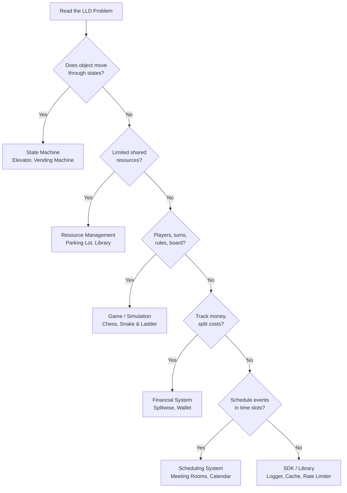

#system-design #lld #taxonomy

# LLD Problem Taxonomy — Recognize the Type, Know the Playbook

---

## Problem Type Decision Tree



---

## Type 1: State Machine
**Pattern:** Entity transitions through defined states based on events.

**Examples:** Elevator, vending machine, order lifecycle, traffic light, ATM

**Playbook:**
- **State pattern** for state transitions
- Enum for states, transition table for valid moves
- Each state is a class with allowed actions

**Key classes:** StateMachine, State (abstract), ConcreteStates, Event, Transition

---

## Type 2: Resource Management
**Pattern:** Allocate, track, and release limited resources.

**Examples:** Parking lot, library, hotel booking, meeting room scheduler

**Playbook:**
- **Strategy pattern** for allocation policies
- Resource pool with availability tracking
- Ticket/receipt for tracking allocation

**Key classes:** Resource (abstract), ResourcePool, AllocationStrategy, Ticket/Booking

---

## Type 3: Game / Simulation
**Pattern:** Players, turns, rules, board/state, win conditions.

**Examples:** Chess, snake & ladder, card games, tic-tac-toe, Monopoly

**Playbook:**
- **Command pattern** for moves (undo support)
- **Observer pattern** for game events
- Board/state that validates moves
- Turn management

**Key classes:** Game, Board, Player, Piece/Token, Move (command), Rule

---

## Type 4: Expense / Financial System
**Pattern:** Track transactions, split costs, calculate balances.

**Examples:** Splitwise, billing system, wallet, invoice system

**Playbook:**
- **Strategy pattern** for split algorithms (equal, percentage, exact)
- Transaction log (immutable)
- Balance calculation (derived from transactions)

**Key classes:** User, Group, Expense, Split (abstract), Transaction, BalanceSheet

---

## Type 5: Scheduling System
**Pattern:** Schedule events in time slots, handle conflicts, optimize.

**Examples:** Meeting scheduler, cron system, task queue, calendar

**Playbook:**
- Interval-based availability checking
- Conflict detection
- **Observer pattern** for notifications
- Priority queue for task ordering

**Key classes:** Scheduler, TimeSlot, Event, Participant, ConflictResolver

---

## Type 6: Library / SDK Design
**Pattern:** Design a reusable component with clean API.

**Examples:** Logger, cache, rate limiter, pub/sub, connection pool

**Playbook:**
- **Builder pattern** for configuration
- **Singleton** for global instances (carefully)
- **Strategy pattern** for pluggable behaviors
- Clean public API, hidden internals

**Key classes:** Config (builder), Client (facade), Strategy (abstract), Implementation

---

## How to Use This

```
1. Read the problem → "What TYPE is this?"
2. Pull out that type's PLAYBOOK (key patterns + key classes)
3. Customize for the specific problem
4. Draw class diagram
5. Implement
```

**Example:** "Design a parking lot"
→ Type 2: Resource Management
→ Playbook: Strategy for allocation, Resource pool, Tickets
→ Customize: Spots = resources, Vehicles = consumers, Ticket tracks assignment

## Links

- [[lld_thinking_system]] — Full pipeline
- [[patterns/smell_to_pattern_map]] — Which pattern for which problem
