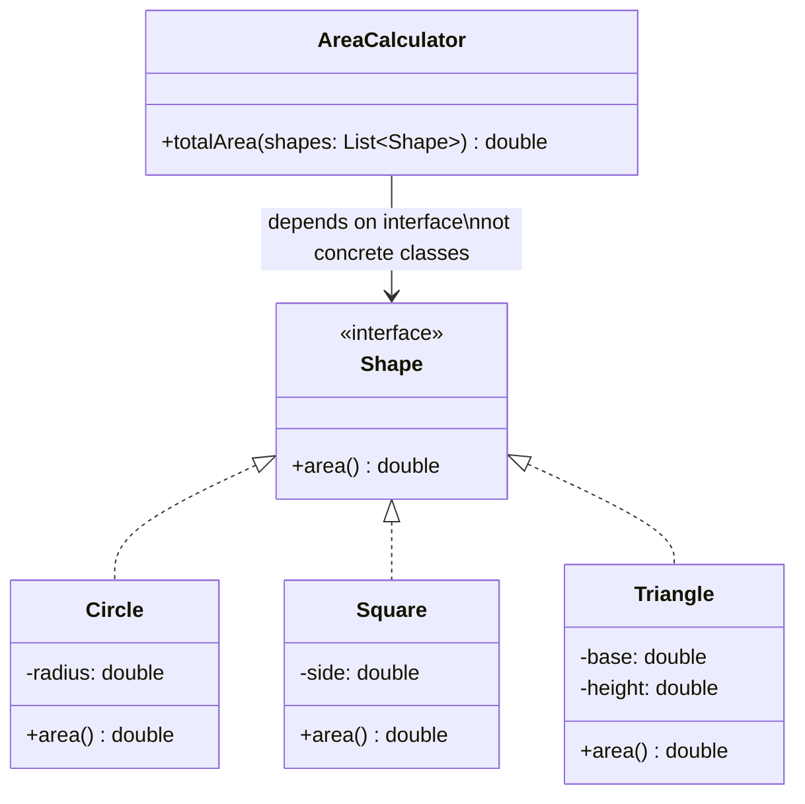

#system-design #lld #solid #principles

# SOLID Principles — With Smell → Refactor Examples

> Don't memorize definitions. Learn to RECOGNIZE violations and FIX them.

---

## OCP Illustrated: Shape Hierarchy



---

## S — Single Responsibility Principle

**"A class should have one reason to change."**

### The Smell:
```python
class UserService:
    def create_user(self, data): ...
    def send_welcome_email(self, user): ...      # Email logic?
    def generate_report(self, users): ...         # Reporting?
    def validate_credit_card(self, card): ...     # Payment validation?
```

This class changes when: user logic changes, email templates change, report format changes, OR payment validation changes. Four reasons to change.

### The Fix:
```python
class UserService:
    def create_user(self, data): ...

class EmailService:
    def send_welcome_email(self, user): ...

class ReportService:
    def generate_report(self, users): ...

class PaymentValidator:
    def validate_credit_card(self, card): ...
```

Each class has ONE reason to change.

---

## O — Open/Closed Principle

**"Open for extension, closed for modification."**

### The Smell:
```python
class DiscountCalculator:
    def calculate(self, order, discount_type):
        if discount_type == "percentage":
            return order.total * 0.1
        elif discount_type == "flat":
            return 50
        elif discount_type == "buy_one_get_one":
            return order.total / 2
        # Adding new discount type = modify this method every time!
```

### The Fix (Strategy Pattern):
```python
class DiscountStrategy(ABC):
    @abstractmethod
    def calculate(self, order) -> float: ...

class PercentageDiscount(DiscountStrategy):
    def __init__(self, percent): self.percent = percent
    def calculate(self, order): return order.total * self.percent

class FlatDiscount(DiscountStrategy):
    def __init__(self, amount): self.amount = amount
    def calculate(self, order): return self.amount

class BOGODiscount(DiscountStrategy):
    def calculate(self, order): return order.total / 2

# New discount? Add a new class. Zero changes to existing code.
```

---

## L — Liskov Substitution Principle

**"Subtypes must be substitutable for their base types."**

### The Smell:
```python
class Bird:
    def fly(self): ...

class Penguin(Bird):
    def fly(self):
        raise Exception("Penguins can't fly!")  # Violates LSP!
```

Code expecting a Bird calls `.fly()` → crashes with Penguin.

### The Fix:
```python
class Bird:
    def move(self): ...

class FlyingBird(Bird):
    def move(self): self.fly()
    def fly(self): ...

class Penguin(Bird):
    def move(self): self.swim()
    def swim(self): ...
```

Restructure the hierarchy so subtypes truly ARE substitutable.

---

## I — Interface Segregation Principle

**"No client should be forced to depend on methods it doesn't use."**

### The Smell:
```python
class Worker(ABC):
    @abstractmethod
    def work(self): ...
    @abstractmethod
    def eat(self): ...
    @abstractmethod
    def sleep(self): ...

class Robot(Worker):
    def work(self): ...
    def eat(self): pass   # Robots don't eat!
    def sleep(self): pass  # Robots don't sleep!
```

### The Fix:
```python
class Workable(ABC):
    @abstractmethod
    def work(self): ...

class Feedable(ABC):
    @abstractmethod
    def eat(self): ...

class Human(Workable, Feedable):
    def work(self): ...
    def eat(self): ...

class Robot(Workable):
    def work(self): ...
    # No eat() or sleep() — not needed
```

---

## D — Dependency Inversion Principle

**"Depend on abstractions, not concretions."**

### The Smell:
```python
class OrderService:
    def __init__(self):
        self.db = MySQLDatabase()         # Hardcoded dependency
        self.emailer = SendGridEmailer()  # Hardcoded dependency

    def place_order(self, order):
        self.db.save(order)
        self.emailer.send(order.user.email, "Order confirmed")
```

Can't test without MySQL and SendGrid. Can't switch to PostgreSQL or SES.

### The Fix:
```python
class OrderService:
    def __init__(self, db: Database, emailer: Emailer):  # Inject abstractions
        self.db = db
        self.emailer = emailer

    def place_order(self, order):
        self.db.save(order)
        self.emailer.send(order.user.email, "Order confirmed")

# In production:
service = OrderService(MySQLDatabase(), SendGridEmailer())

# In tests:
service = OrderService(InMemoryDatabase(), MockEmailer())
```

---

## Quick Reference

| Principle | Violation Smell | Fix |
|-----------|---------------|-----|
| **SRP** | Class has 10+ methods doing unrelated things | Split into focused classes |
| **OCP** | Long if/else chains checking types | Strategy pattern + polymorphism |
| **LSP** | Subclass throws "not supported" exceptions | Restructure hierarchy |
| **ISP** | Classes implement methods with `pass` | Split into smaller interfaces |
| **DIP** | Constructor creates concrete dependencies | Inject via constructor (DI) |

## Links

- [[design_smell_catalog]] — Full catalog of smells and fixes
- [[one_change_test]] — Validate SOLID compliance
- [[patterns/behavioral]] — Strategy, Observer, State patterns
- [[code_architecture/dependency_injection]] — DIP in depth
