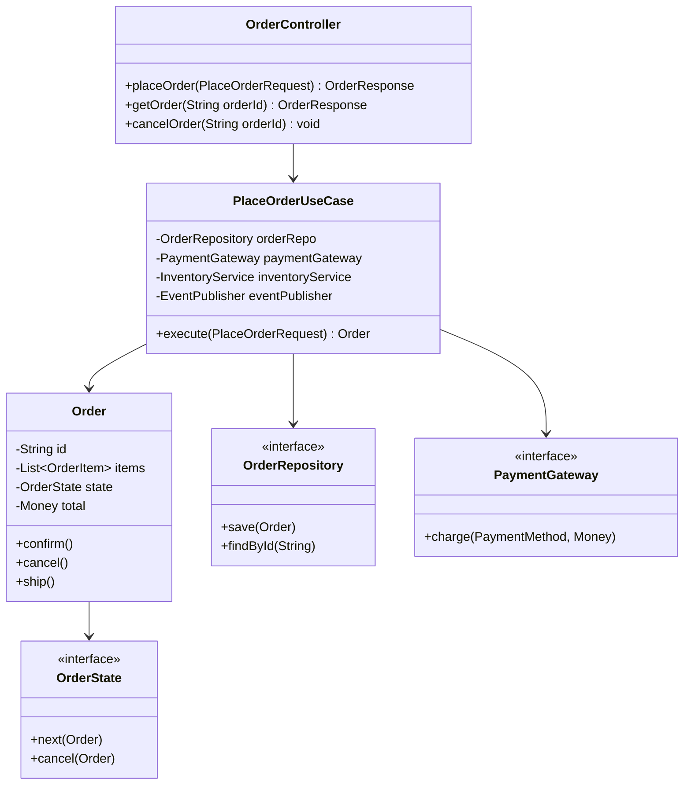

#system-design #bridge #hld #lld

# HLD → LLD Zoom: E-Commerce Order Service

## The Bridge

**HLD level:** Order Service is a box in the architecture diagram.
**LLD level:** Inside that box, there are classes, interfaces, patterns, and business logic.

---

## HLD View (From [[10_hld/examples/hld_ecommerce]])

```
Client → API Gateway → [Order Service] → Payment Service
                                       → Inventory Service
                                       → Kafka → Notifications
```

**Order Service is responsible for:** Creating orders, validating carts, coordinating payment and inventory, managing order lifecycle, emitting events.

---

## LLD Zoom: Inside Order Service (Java)



## Three Zoom Levels

### Level 1: Architecture Box
```
[Order Service] — handles order lifecycle
```

### Level 2: Internal Components
```
OrderController (API) → PlaceOrderUseCase (business logic)
  → OrderRepository (data access)
  → PaymentGateway (external integration)
  → InventoryService (external integration)
  → EventPublisher (Kafka events)
```

### Level 3: Code
```java
@RestController
public class OrderController {
    private final PlaceOrderUseCase placeOrderUseCase;

    @PostMapping("/orders")
    public ResponseEntity<OrderResponse> placeOrder(@RequestBody PlaceOrderRequest req) {
        Order order = placeOrderUseCase.execute(req);
        return ResponseEntity.status(201).body(OrderResponse.from(order));
    }
}

public class PlaceOrderUseCase {
    private final OrderRepository orderRepo;
    private final PaymentGateway paymentGateway;
    private final InventoryService inventoryService;
    private final EventPublisher eventPublisher;

    @Transactional
    public Order execute(PlaceOrderRequest request) {
        // 1. Create order
        Order order = new Order(request.getItems());

        // 2. Reserve inventory (sync gRPC)
        inventoryService.reserve(order.getItems());

        // 3. Charge payment (sync gRPC)
        paymentGateway.charge(request.getPaymentMethod(), order.getTotal());

        // 4. Confirm order
        order.confirm();
        orderRepo.save(order);

        // 5. Emit event (async Kafka)
        eventPublisher.publish(new OrderPlacedEvent(order));

        return order;
    }
}
```

---

## The Pattern

**Every HLD box can be zoomed into like this:**
```
HLD:  [Service Box]
LLD:  Controller → UseCase → Domain Model → Repository → External Adapters
Code: Spring Boot classes implementing the above
```

This mapping works for ANY service in ANY architecture.

## Links

- [[../10_hld/examples/hld_ecommerce]] — HLD view
- [[../11_lld/code_architecture/clean_architecture]] — Architecture layers
- [[../11_lld/patterns/behavioral]] — State pattern for Order
