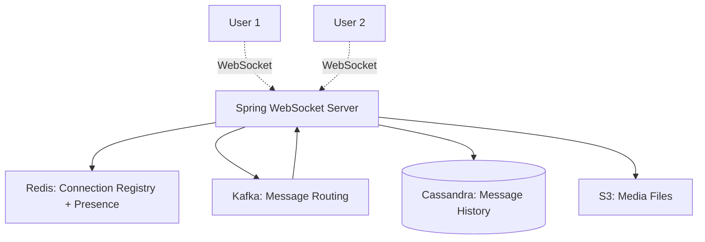

#system-design #project #hands-on #java

# Build It: Real-Time Chat Application (Java + Spring Boot + WebSocket + Kafka + Redis)

> Teaches: WebSocket connections, pub/sub, message persistence, real-time delivery.

---

## Architecture



## Tech Stack

| Component | Technology |
|-----------|-----------|
| API + WebSocket | Spring Boot + Spring WebSocket + STOMP |
| Message broker | Apache Kafka |
| Connection registry | Redis |
| Message storage | Cassandra (or PostgreSQL for simpler version) |
| Media | Local file system (or S3) |
| Frontend | Simple HTML + JavaScript (or React) |

---

## Project Structure

```
chat-app/
├── docker-compose.yml                # Kafka + Redis + Cassandra
├── src/main/java/com/chat/
│   ├── ChatApplication.java
│   ├── config/
│   │   ├── WebSocketConfig.java      # WebSocket + STOMP config
│   │   └── KafkaConfig.java
│   ├── controller/
│   │   ├── ChatController.java       # WebSocket message handler
│   │   └── RestController.java       # REST: history, users
│   ├── model/
│   │   ├── ChatMessage.java
│   │   ├── MessageType.java          # TEXT, IMAGE, JOIN, LEAVE
│   │   └── User.java
│   ├── service/
│   │   ├── MessageService.java       # Save + retrieve messages
│   │   ├── PresenceService.java      # Online/offline tracking
│   │   └── KafkaMessageRelay.java    # Route messages via Kafka
│   └── repository/
│       └── MessageRepository.java
└── src/main/resources/static/
    └── index.html                     # Simple chat UI
```

## Key Implementation

### WebSocket Config
```java
@Configuration
@EnableWebSocketMessageBroker
public class WebSocketConfig implements WebSocketMessageBrokerConfigurer {
    @Override
    public void registerStompEndpoints(StompEndpointRegistry registry) {
        registry.addEndpoint("/ws").setAllowedOrigins("*").withSockJS();
    }

    @Override
    public void configureMessageBroker(MessageBrokerRegistry registry) {
        registry.enableSimpleBroker("/topic", "/queue");
        registry.setApplicationDestinationPrefixes("/app");
        registry.setUserDestinationPrefix("/user");
    }
}
```

### Message Handler
```java
@Controller
public class ChatController {
    @MessageMapping("/chat.send")
    public void sendMessage(ChatMessage message, SimpMessageHeaderAccessor header) {
        message.setTimestamp(Instant.now());
        message.setSenderId(header.getUser().getName());

        // Save to database
        messageService.save(message);

        // Route: 1-to-1 or group
        if (message.isGroupMessage()) {
            messagingTemplate.convertAndSend(
                "/topic/group." + message.getGroupId(), message);
        } else {
            messagingTemplate.convertAndSendToUser(
                message.getRecipientId(), "/queue/messages", message);
        }
    }

    @MessageMapping("/chat.presence")
    public void updatePresence(PresenceUpdate update) {
        presenceService.update(update.getUserId(), update.getStatus());
        messagingTemplate.convertAndSend("/topic/presence", update);
    }
}
```

### Presence (Redis)
```java
@Service
public class PresenceService {
    private final StringRedisTemplate redis;

    public void setOnline(String userId) {
        redis.opsForValue().set("presence:" + userId, "online", Duration.ofMinutes(2));
    }

    public boolean isOnline(String userId) {
        return redis.hasKey("presence:" + userId);
    }
}
```

---

## What You Learn

| Concept | How Applied |
|---------|------------|
| WebSocket | Persistent bidirectional connections |
| Pub/Sub | STOMP topics for group messages |
| Presence | Redis TTL for online/offline |
| Message ordering | Kafka partitions by conversation_id |
| Persistence | Cassandra for message history |
| Delivery receipts | Ack messages over WebSocket |

## Extensions

1. Add read receipts (delivered/read indicators)
2. Add typing indicators
3. Add file/image sharing (upload to S3, send URL)
4. Add end-to-end encryption (Signal protocol)
5. Scale to multiple WebSocket servers (use Kafka for cross-server routing)

## Links
- [[../05_case_studies/design_chat_system]] — System design theory
- [[../04_system_evolutions/scaling_a_chat_system]] — Scaling story
- [[../01_fundamentals/api_design]] — WebSocket protocol
