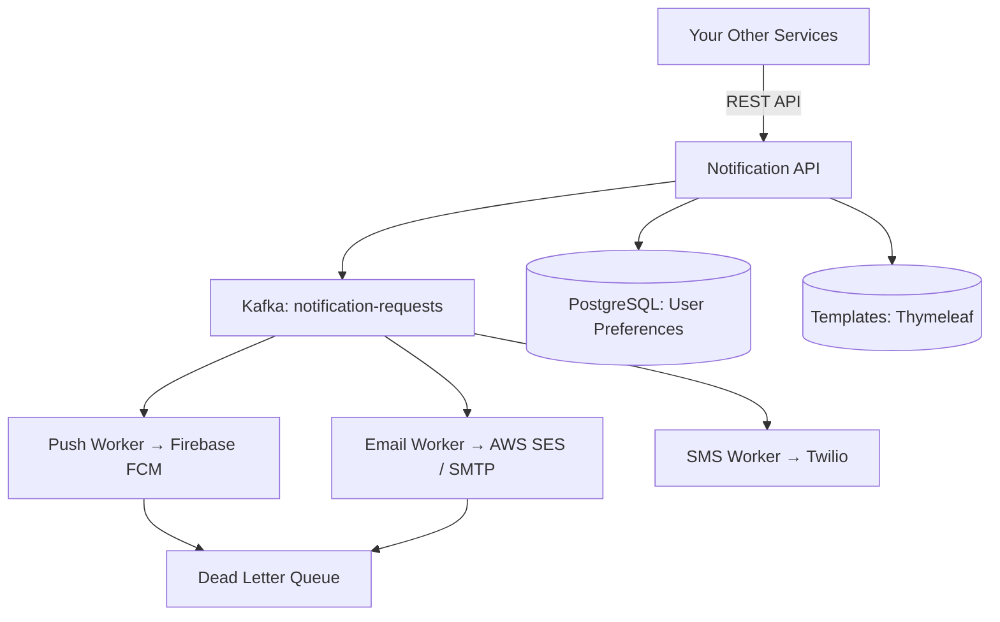

#system-design #project #hands-on #java

# Build It: Notification Service (Java + Spring Boot + Kafka + FCM/Email)

> Teaches: Event-driven architecture, Kafka consumers, multi-channel delivery, retry logic.

---

## Architecture



## Key Components

### Notification Request API
```java
@RestController
@RequestMapping("/api/notifications")
public class NotificationController {

    @PostMapping
    public ResponseEntity<Void> send(@RequestBody NotificationRequest request) {
        // Check user preferences
        UserPreferences prefs = prefService.getPreferences(request.getUserId());
        if (!prefs.isChannelEnabled(request.getChannel())) {
            return ResponseEntity.ok().build(); // Silently skip
        }

        // Rate limit check
        if (rateLimiter.isLimited(request.getUserId(), request.getChannel())) {
            return ResponseEntity.status(429).build();
        }

        // Render template
        String content = templateEngine.render(request.getTemplate(), request.getData());

        // Publish to Kafka
        kafkaTemplate.send("notification-" + request.getChannel(),
            request.getUserId(),
            new NotificationEvent(request.getUserId(), content, request.getPriority()));

        return ResponseEntity.accepted().build();
    }
}
```

### Kafka Consumer (Email Worker)
```java
@Component
public class EmailWorker {

    @KafkaListener(topics = "notification-email", groupId = "email-workers")
    @RetryableTopic(attempts = "3",
        backoff = @Backoff(delay = 1000, multiplier = 2))
    public void processEmail(NotificationEvent event) {
        emailService.send(
            event.getUserId(),
            event.getSubject(),
            event.getContent()
        );
        deliveryTracker.markDelivered(event.getId(), "email");
    }

    @DltHandler  // Dead Letter Topic handler
    public void handleFailure(NotificationEvent event) {
        log.error("Email delivery failed after 3 retries: {}", event.getId());
        deliveryTracker.markFailed(event.getId(), "email");
        alertService.alert("Email delivery failed: " + event.getId());
    }
}
```

### User Preferences
```java
@Entity
public class UserPreferences {
    @Id private String userId;
    private boolean pushEnabled = true;
    private boolean emailEnabled = true;
    private boolean smsEnabled = false;  // SMS opt-in required
    private String quietHoursStart;      // "22:00"
    private String quietHoursEnd;        // "08:00"
    private int maxPushPerHour = 5;
}
```

---

## What You Learn

| Concept | How Applied |
|---------|------------|
| Event-driven architecture | Kafka decouples API from delivery |
| Multi-channel delivery | Separate consumers for push/email/SMS |
| Retry with backoff | @RetryableTopic with exponential backoff |
| Dead letter queue | Failed messages for investigation |
| User preferences | Respect opt-out, quiet hours |
| Rate limiting per user | Max notifications per channel per time |
| Template rendering | Thymeleaf for email templates |

## Extensions

1. Add priority queues (urgent OTP vs marketing email)
2. Add delivery tracking dashboard
3. Add A/B testing for notification content
4. Add provider failover (SES → SendGrid if SES fails)

## Links
- [[../05_case_studies/design_notification_system]] — Full system design
- [[../02_building_blocks/message_queues]] — Kafka patterns
- [[../03_design_patterns/circuit_breaker]] — Provider failover
