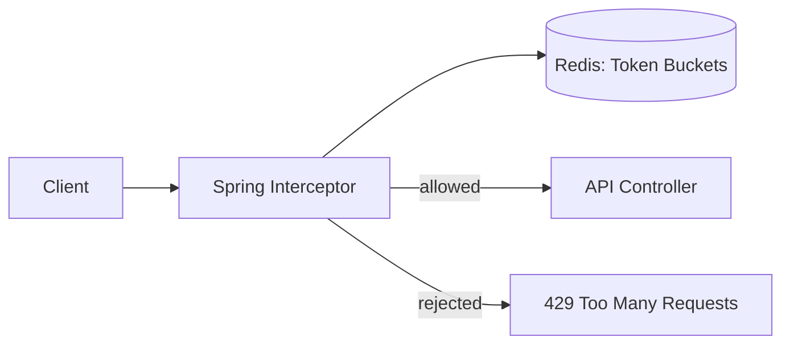

#system-design #project #hands-on #java

# Build It: Distributed Rate Limiter (Java + Redis + Lua)

> Teaches: Token bucket algorithm, Redis atomic operations, Lua scripting, Spring interceptor.

---

## Architecture



## Key Implementation

### Token Bucket in Redis (Lua Script)

```lua
-- token_bucket.lua (atomic operation in Redis)
local key = KEYS[1]
local capacity = tonumber(ARGV[1])      -- max tokens
local refill_rate = tonumber(ARGV[2])   -- tokens per second
local now = tonumber(ARGV[3])           -- current timestamp
local requested = tonumber(ARGV[4])     -- tokens to consume (usually 1)

-- Get current state
local bucket = redis.call('HMGET', key, 'tokens', 'last_refill')
local tokens = tonumber(bucket[1]) or capacity
local last_refill = tonumber(bucket[2]) or now

-- Refill tokens based on elapsed time
local elapsed = now - last_refill
local new_tokens = math.min(capacity, tokens + elapsed * refill_rate)

-- Check if enough tokens
if new_tokens >= requested then
    new_tokens = new_tokens - requested
    redis.call('HMSET', key, 'tokens', new_tokens, 'last_refill', now)
    redis.call('EXPIRE', key, math.ceil(capacity / refill_rate) * 2)
    return 1  -- ALLOWED
else
    redis.call('HMSET', key, 'tokens', new_tokens, 'last_refill', now)
    redis.call('EXPIRE', key, math.ceil(capacity / refill_rate) * 2)
    return 0  -- REJECTED
end
```

### Spring Interceptor
```java
@Component
public class RateLimitInterceptor implements HandlerInterceptor {
    private final StringRedisTemplate redis;
    private final RedisScript<Long> tokenBucketScript;

    @Override
    public boolean preHandle(HttpServletRequest request, HttpServletResponse response,
                            Object handler) throws Exception {
        String clientId = extractClientId(request); // IP or user ID
        String key = "rate_limit:" + clientId;

        Long result = redis.execute(tokenBucketScript,
            List.of(key),
            "100",                                    // capacity
            "10",                                     // refill rate (10/sec)
            String.valueOf(System.currentTimeMillis() / 1000.0),
            "1");                                     // consume 1 token

        if (result == 0L) {
            response.setStatus(429);
            response.setHeader("Retry-After", "10");
            response.setHeader("X-RateLimit-Limit", "100");
            response.setHeader("X-RateLimit-Remaining", "0");
            response.getWriter().write("{\"error\": \"Too many requests\"}");
            return false;
        }
        return true;
    }

    private String extractClientId(HttpServletRequest request) {
        // Prefer user ID (if authenticated), fallback to IP
        String userId = request.getHeader("X-User-Id");
        return userId != null ? "user:" + userId : "ip:" + request.getRemoteAddr();
    }
}
```

### Configuration
```java
@Configuration
public class RateLimitConfig implements WebMvcConfigurer {
    @Bean
    public RedisScript<Long> tokenBucketScript() {
        return RedisScript.of(new ClassPathResource("scripts/token_bucket.lua"), Long.class);
    }

    @Override
    public void addInterceptors(InterceptorRegistry registry) {
        registry.addInterceptor(rateLimitInterceptor)
            .addPathPatterns("/api/**");
    }
}
```

---

## What You Learn

| Concept | How Applied |
|---------|------------|
| Token bucket algorithm | Lua script implementing the math |
| Redis atomic operations | Lua script = atomic (no race conditions) |
| Distributed state | Redis shared across API servers |
| HTTP 429 | Proper rate limit response with headers |
| Spring interceptor | Cross-cutting concern before controller |

## Extensions

1. Add per-endpoint limits (different limits for /search vs /upload)
2. Add sliding window counter algorithm for comparison
3. Add admin dashboard showing rate limit stats
4. Add IP blacklisting for abusive IPs

## Links
- [[../05_case_studies/design_rate_limiter]] — Full system design
- [[../02_building_blocks/rate_limiter]] — Algorithms deep dive
