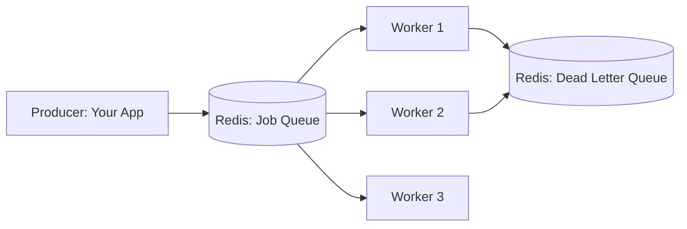

#system-design #project #hands-on #java

# Build It: Distributed Task Queue (Java + Redis + Spring)

> Teaches: Job scheduling, worker patterns, retry logic, dead letter queues, distributed locks.

---

## Architecture



## What You Build

A simple but production-quality task queue like Sidekiq (Ruby) or Celery (Python) but in Java:

1. **Producer:** Enqueue jobs with payload, priority, and retry config
2. **Workers:** Dequeue and process jobs concurrently
3. **Retry:** Failed jobs retried with exponential backoff
4. **DLQ:** Jobs that fail N times moved to dead letter queue
5. **Monitoring:** Job counts, processing rates, failure rates

## Key Implementation

### Job Definition
```java
public class Job {
    private String id;
    private String type;           // "send_email", "process_image"
    private String payload;        // JSON payload
    private int priority;          // 0=high, 1=medium, 2=low
    private int retryCount;
    private int maxRetries;
    private Instant scheduledFor;  // null = immediate
    private Instant createdAt;
}
```

### Enqueue (Producer)
```java
@Service
public class TaskQueue {
    private final StringRedisTemplate redis;

    public String enqueue(String type, Object payload, int priority) {
        Job job = new Job(UUID.randomUUID().toString(), type,
            objectMapper.writeValueAsString(payload), priority, 0, 3, null);

        // LPUSH to priority-specific queue
        String queueKey = "queue:priority:" + priority;
        redis.opsForList().leftPush(queueKey, objectMapper.writeValueAsString(job));
        return job.getId();
    }

    public String scheduleFor(String type, Object payload, Instant runAt) {
        Job job = new Job(...);
        // ZADD to sorted set scored by timestamp
        redis.opsForZSet().add("queue:scheduled",
            objectMapper.writeValueAsString(job), runAt.toEpochMilli());
        return job.getId();
    }
}
```

### Worker (Consumer)
```java
@Component
public class Worker {

    @Scheduled(fixedDelay = 100) // Poll every 100ms
    public void poll() {
        // Check high priority first, then medium, then low
        for (int priority = 0; priority <= 2; priority++) {
            String jobJson = redis.opsForList().rightPop("queue:priority:" + priority);
            if (jobJson != null) {
                Job job = objectMapper.readValue(jobJson, Job.class);
                process(job);
                return;
            }
        }
    }

    private void process(Job job) {
        try {
            JobHandler handler = handlerRegistry.get(job.getType());
            handler.execute(job.getPayload());
            // Success — job done
        } catch (Exception e) {
            if (job.getRetryCount() < job.getMaxRetries()) {
                job.setRetryCount(job.getRetryCount() + 1);
                long backoff = (long) Math.pow(2, job.getRetryCount()) * 1000;
                // Re-enqueue with delay
                redis.opsForZSet().add("queue:scheduled", jobJson,
                    Instant.now().plusMillis(backoff).toEpochMilli());
            } else {
                // Move to DLQ
                redis.opsForList().leftPush("queue:dlq", objectMapper.writeValueAsString(job));
            }
        }
    }
}
```

---

## What You Learn

| Concept | How Applied |
|---------|------------|
| Job queues | Redis list as FIFO queue |
| Priority queues | Multiple lists checked in priority order |
| Scheduled jobs | Redis sorted set scored by timestamp |
| Retry with backoff | Exponential backoff on failure |
| Dead letter queue | Persistent storage of failed jobs |
| Worker scaling | Multiple worker instances, Redis ensures each job processed once |
| Distributed lock | SETNX to prevent double-processing |

## Links
- [[../02_building_blocks/message_queues]] — Queue patterns
- [[back_pressure]] — Queue overload
