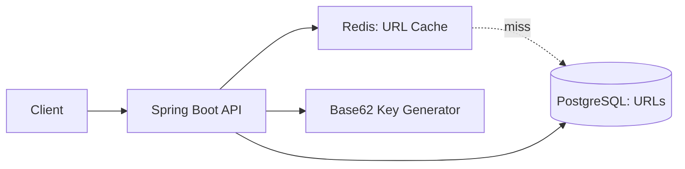

#system-design #project #hands-on #java

# Build It: URL Shortener (Java + Spring Boot + Redis + PostgreSQL)

> Go from design → working code. This project teaches: API design, database modeling, caching, and key generation.

---

## Architecture



## Tech Stack

| Component | Technology | Why |
|-----------|-----------|-----|
| API Framework | Spring Boot 3 | Industry standard in India |
| Database | PostgreSQL | ACID for URL persistence |
| Cache | Redis | Fast redirect lookups |
| Build | Maven/Gradle | Standard Java build |
| Deploy | Docker + Docker Compose | Reproducible local setup |

---

## Project Structure

```
url-shortener/
├── docker-compose.yml             # PostgreSQL + Redis
├── src/main/java/com/shortener/
│   ├── ShortenerApplication.java  # Main class
│   ├── controller/
│   │   └── UrlController.java     # REST endpoints
│   ├── service/
│   │   └── UrlService.java        # Business logic
│   ├── repository/
│   │   └── UrlRepository.java     # JPA repository
│   ├── model/
│   │   └── Url.java               # Entity
│   ├── util/
│   │   └── Base62Encoder.java     # Key generation
│   └── config/
│       └── RedisConfig.java       # Redis cache config
├── src/main/resources/
│   └── application.yml            # Config
└── src/test/java/                 # Tests
```

## Key Implementation Details

### docker-compose.yml
```yaml
services:
  postgres:
    image: postgres:15
    environment:
      POSTGRES_DB: shortener
      POSTGRES_PASSWORD: secret
    ports: ["5432:5432"]

  redis:
    image: redis:7-alpine
    ports: ["6379:6379"]

  app:
    build: .
    ports: ["8080:8080"]
    depends_on: [postgres, redis]
    environment:
      SPRING_DATASOURCE_URL: jdbc:postgresql://postgres:5432/shortener
      SPRING_REDIS_HOST: redis
```

### Entity
```java
@Entity
@Table(name = "urls")
public class Url {
    @Id
    private String shortKey;    // "aB3kX9z"
    private String longUrl;     // "https://example.com/very/long/path"
    private LocalDateTime createdAt;
    private LocalDateTime expiresAt;  // nullable
    private long clickCount;
}
```

### Controller
```java
@RestController
public class UrlController {
    @PostMapping("/api/shorten")
    public ResponseEntity<ShortenResponse> shorten(@RequestBody ShortenRequest req) {
        String shortKey = urlService.createShortUrl(req.getLongUrl(), req.getExpiresIn());
        return ResponseEntity.status(201)
            .body(new ShortenResponse("http://localhost:8080/" + shortKey));
    }

    @GetMapping("/{key}")
    public ResponseEntity<Void> redirect(@PathVariable String key) {
        String longUrl = urlService.getLongUrl(key);
        return ResponseEntity.status(302)
            .header("Location", longUrl)
            .build();
    }
}
```

### Service (with Redis cache)
```java
@Service
public class UrlService {
    @Cacheable(value = "urls", key = "#shortKey")
    public String getLongUrl(String shortKey) {
        Url url = urlRepository.findById(shortKey)
            .orElseThrow(() -> new NotFoundException("URL not found"));
        if (url.getExpiresAt() != null && url.getExpiresAt().isBefore(LocalDateTime.now()))
            throw new NotFoundException("URL expired");
        urlRepository.incrementClickCount(shortKey);
        return url.getLongUrl();
    }

    public String createShortUrl(String longUrl, Duration expiresIn) {
        String key = base62Encoder.encode(idGenerator.nextId());
        Url url = new Url(key, longUrl, LocalDateTime.now(),
            expiresIn != null ? LocalDateTime.now().plus(expiresIn) : null);
        urlRepository.save(url);
        return key;
    }
}
```

---

## What You Learn Building This

| Concept | How It's Applied |
|---------|-----------------|
| API design (REST) | POST /shorten, GET /:key |
| Database modeling | Entity with indexes |
| Caching (cache-aside) | Redis @Cacheable for redirects |
| Key generation | Base62 encoding |
| HTTP redirects | 301 vs 302 semantics |
| Docker | Multi-container setup |
| TTL/expiration | Lazy + scheduled cleanup |

## Extensions to Try

1. Add analytics dashboard (clicks per day, top URLs)
2. Add custom aliases ("mysite.co/my-link")
3. Add rate limiting (Spring Cloud Gateway or custom filter)
4. Deploy to AWS (EC2 + RDS + ElastiCache)

## Links
- [[../05_case_studies/design_url_shortener]] — The system design theory
- [[../02_building_blocks/caching]] — Caching patterns
