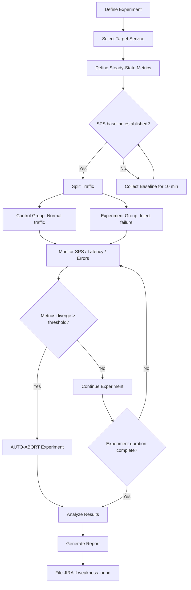
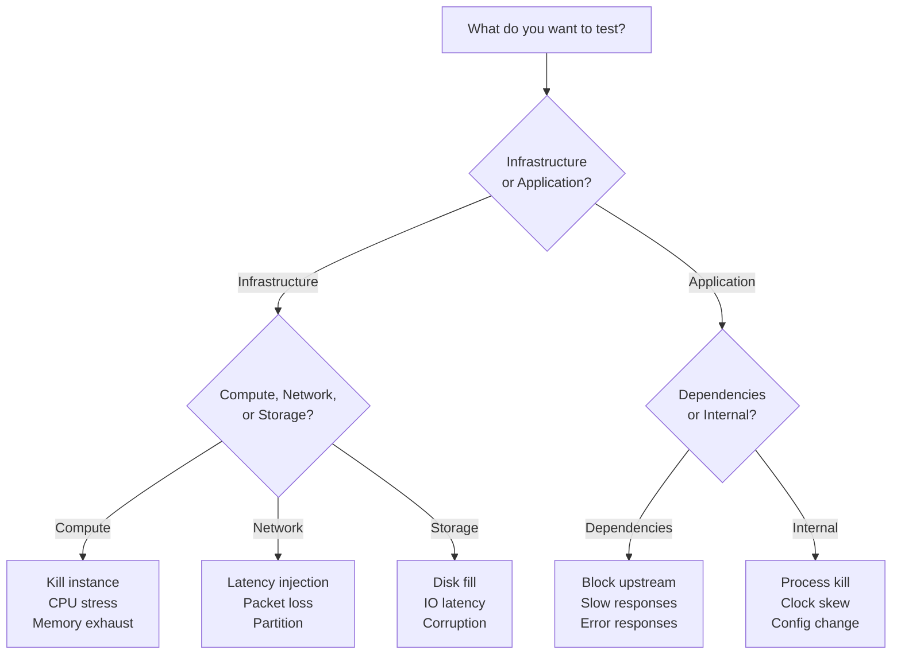
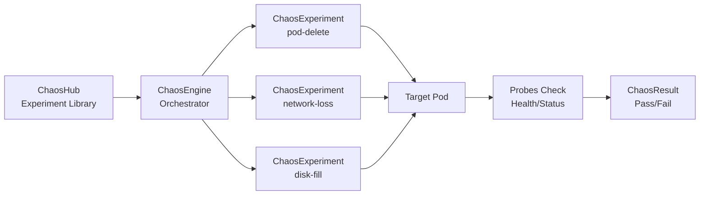
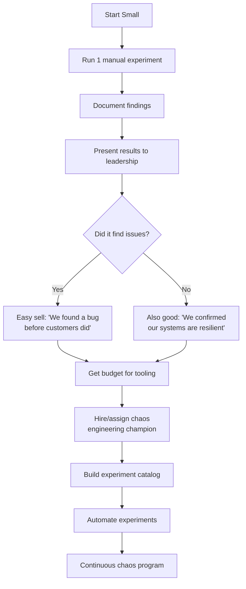

#system-design #reliability #testing #resilience

# Chaos Engineering

> "The discipline of experimenting on a system to build confidence in the system's capability to withstand turbulent conditions in production." -- Principles of Chaos Engineering

## Why This Matters

4/15 top companies have formal chaos engineering programs. Netflix pioneered it. It is increasingly asked in senior-level interviews as a differentiator. If you mention chaos engineering after covering circuit breakers and health checks, you immediately signal production maturity.

**The core insight:** Production systems fail in unpredictable ways. Rather than waiting for 3 AM pages, deliberately inject failure and learn from it while your team is awake and ready.

---

## Core Principles

The five principles from principlesofchaos.org:

```
┌──────────────────────────────────────────────────────────────────────┐
│                    CHAOS ENGINEERING PRINCIPLES                       │
├──────────────────────────────────────────────────────────────────────┤
│                                                                      │
│  1. Build a hypothesis around steady-state behavior                  │
│     → Define what "normal" looks like (SPS, latency, error rate)     │
│                                                                      │
│  2. Vary real-world events                                           │
│     → Server failure, network partition, latency spike, disk full    │
│                                                                      │
│  3. Run experiments in production                                    │
│     → Staging ≠ Production (different traffic, different state)      │
│                                                                      │
│  4. Automate experiments to run continuously                         │
│     → Not a one-time exercise; drift happens                         │
│                                                                      │
│  5. Minimize blast radius                                            │
│     → Start small, auto-abort if metrics deviate beyond threshold    │
│                                                                      │
└──────────────────────────────────────────────────────────────────────┘
```

### The Scientific Method Applied to Operations

```
┌──────────────┐    ┌──────────────┐    ┌──────────────┐    ┌──────────────┐
│   Observe    │───→│  Hypothesize │───→│  Experiment  │───→│   Analyze    │
│              │    │              │    │              │    │              │
│ "System runs │    │ "It should   │    │ Kill 2 of 5  │    │ Did latency  │
│  at 200 RPS  │    │  survive     │    │ instances in  │    │ spike? Did   │
│  with 50ms   │    │  losing 2    │    │ service-A     │    │ errors       │
│  p99 latency"│    │  instances"  │    │ cluster       │    │ increase?    │
└──────────────┘    └──────────────┘    └──────────────┘    └──────┬───────┘
                                                                   │
                    ┌──────────────┐    ┌──────────────┐           │
                    │   Improve    │←───│   Document   │←──────────┘
                    │              │    │              │
                    │ Fix gaps in  │    │ Record what  │
                    │ resilience,  │    │ broke and    │
                    │ retry logic, │    │ what held    │
                    │ fallbacks    │    │              │
                    └──────────────┘    └──────────────┘
```

---

## The Netflix Story

Netflix is the origin story of chaos engineering. Understanding their evolution helps you explain the concept clearly in interviews.

### Phase 1: Chaos Monkey (2011)

Netflix migrated to AWS and quickly learned that cloud instances are ephemeral. Rather than fight this, they leaned into it.

```
┌──────────────────────────────────────────────────────────────┐
│                      Chaos Monkey v1                          │
│                                                              │
│   During business hours (Mon-Fri, 9am-3pm PST):             │
│                                                              │
│   1. Pick a random Auto Scaling Group                        │
│   2. Pick a random instance in that group                    │
│   3. Terminate it                                            │
│   4. Watch what happens                                      │
│                                                              │
│   Rules:                                                     │
│   ┌────────────────────────────────────────────────────┐     │
│   │  • Opt-OUT, not opt-in (you're in by default)      │     │
│   │  • Only during business hours (engineers present)   │     │
│   │  • If your service can't handle it, YOU fix it     │     │
│   └────────────────────────────────────────────────────┘     │
│                                                              │
│   Philosophy: "If you can't survive random instance          │
│   death, find out NOW -- not at 3 AM on a Saturday."        │
│                                                              │
└──────────────────────────────────────────────────────────────┘
```

**Result:** Every Netflix service was forced to be stateless and handle instance loss gracefully. Services that couldn't cope were identified and fixed during working hours.

### Phase 2: The Simian Army (2012)

One monkey wasn't enough. Netflix built a whole army of failure-inducing tools.

```
┌────────────────────────────────────────────────────────────────────────────┐
│                           THE SIMIAN ARMY                                  │
├──────────────────┬─────────────────────────────────────────────────────────┤
│  Chaos Monkey    │  Kills random EC2 instances                             │
├──────────────────┼─────────────────────────────────────────────────────────┤
│  Latency Monkey  │  Injects artificial latency into RESTful calls          │
├──────────────────┼─────────────────────────────────────────────────────────┤
│  Conformity      │  Finds instances not adhering to best practices         │
│  Monkey          │  (e.g., not in ASG, missing health checks)              │
├──────────────────┼─────────────────────────────────────────────────────────┤
│  Doctor Monkey   │  Detects unhealthy instances (CPU, memory leaks)        │
│                  │  and removes them from service                           │
├──────────────────┼─────────────────────────────────────────────────────────┤
│  Janitor Monkey  │  Finds and deletes unused cloud resources               │
│                  │  (saves money)                                           │
├──────────────────┼─────────────────────────────────────────────────────────┤
│  Security Monkey │  Finds security violations and misconfigurations        │
├──────────────────┼─────────────────────────────────────────────────────────┤
│  Chaos Gorilla   │  Simulates an entire AZ (Availability Zone) outage      │
├──────────────────┼─────────────────────────────────────────────────────────┤
│  Chaos Kong      │  Simulates an entire REGION going down                  │
│                  │  (e.g., all of us-east-1 becomes unavailable)            │
└──────────────────┴─────────────────────────────────────────────────────────┘
```

**Escalation scale:**

```
Instance Death  ──→  AZ Failure  ──→  Region Failure
 (Chaos Monkey)      (Chaos Gorilla)   (Chaos Kong)
     Small               Medium            Large
   blast radius        blast radius      blast radius
```

### Phase 3: ChAP -- Chaos Automation Platform (Current)

Netflix matured from random destruction to structured scientific experimentation.



**Key ChAP concepts:**

| Concept | Detail |
|---------|--------|
| **SPS** (Streams Per Second) | Netflix's north-star metric -- how many video streams are starting per second |
| **Control group** | Normal production traffic, no fault injected |
| **Experiment group** | Same traffic but with the fault injected |
| **Auto-abort** | If SPS in experiment group drops more than X% vs control, experiment halts immediately |
| **Blast radius** | Starts at 1% of traffic, gradually increases to 5%, then 10% |

```
ChAP Experiment Timeline:

Time    0min    5min    10min   15min   20min   25min   30min
        │       │       │       │       │       │       │
Control ████████████████████████████████████████████████████  (SPS ~12,000)
        │       │       │       │       │       │       │
Exprmnt ████████████████████████████████████████████████████  (SPS ~11,800)
        │       │       │       │       │       │       │
                        ▲                       ▲
                   Fault injected          Fault removed
                   (kill 3 nodes           (recover)
                    in rec-engine)

Acceptable: SPS diff < 2%     ✓ PASS
Unacceptable: SPS diff > 5%   ✗ AUTO-ABORT
```

---

## Other Real-World Implementations

### Slack: Disasterpiece Theater

Slack runs large-scale chaos experiments they call "Disasterpiece Theater" -- a play on "disaster" and "masterpiece."

**4-Phase Process:**

```
┌──────────────────────────────────────────────────────────────────┐
│                     DISASTERPIECE THEATER                         │
│                                                                  │
│  Phase 1: PLAN (2-3 weeks before)                                │
│  ├── Define the disaster scenario                                │
│  ├── Identify affected services                                  │
│  ├── Prepare rollback procedures                                 │
│  └── Get sign-off from leadership                                │
│                                                                  │
│  Phase 2: DEVELOP (1 week before)                                │
│  ├── Build tooling to inject the failure                         │
│  ├── Set up monitoring dashboards                                │
│  ├── Define success/failure criteria                             │
│  └── Prepare communication channels                              │
│                                                                  │
│  Phase 3: GO / NO-GO (day before)                                │
│  ├── Final review of plan                                        │
│  ├── Check that all safety nets are in place                     │
│  ├── Confirm on-call coverage                                    │
│  └── Decision: proceed or postpone                               │
│                                                                  │
│  Phase 4: PRODUCTION (execution day)                             │
│  ├── Inject failure                                              │
│  ├── OBSERVE, DON'T RUSH                                         │
│  ├── 700+ engineers in #ops channel watching                     │
│  ├── Document everything in real time                            │
│  └── Retrospective within 48 hours                               │
│                                                                  │
└──────────────────────────────────────────────────────────────────┘
```

**Key takeaway:** The "Observe, Don't Rush" principle means engineers watch how the system recovers naturally before intervening. This reveals whether automated recovery mechanisms actually work.

### Shopify: Toxiproxy

Shopify built and open-sourced Toxiproxy, a TCP proxy that allows you to simulate network conditions.

```
┌─────────────┐       ┌──────────────┐       ┌─────────────┐
│   Service   │──────→│  Toxiproxy   │──────→│  Upstream   │
│   (Client)  │       │              │       │  (Server)   │
│             │       │  Inject:     │       │             │
│             │       │  • Latency   │       │  Database   │
│             │       │  • Jitter    │       │  Redis      │
│             │       │  • Disconnect│       │  API        │
│             │       │  • Bandwidth │       │             │
│             │       │    throttle  │       │             │
└─────────────┘       └──────────────┘       └─────────────┘
```

**Toxiproxy usage in tests (Ruby example from Shopify):**

```ruby
# In test setup, configure a toxic
Toxiproxy[/mysql/].downstream(:latency, latency: 2000).apply do
  # This block runs with 2 seconds of latency on MySQL connections
  assert_raises(Timeout::Error) do
    Order.create!(items: cart_items)
  end
end

# Simulate total downstream failure
Toxiproxy[/redis/].down do
  # Redis is completely unreachable
  result = CacheService.get("product:123")
  assert_equal result, CacheService::FALLBACK_VALUE
end
```

**Where Toxiproxy fits in CI/CD:**

```
┌──────┐    ┌──────────┐    ┌──────────────┐    ┌───────────┐    ┌────────┐
│ Code │───→│  Unit    │───→│ Integration  │───→│  Chaos    │───→│ Deploy │
│ Push │    │  Tests   │    │   Tests      │    │  Tests    │    │        │
└──────┘    └──────────┘    │ (Toxiproxy   │    │ (Latency, │    └────────┘
                            │  injecting   │    │  failures │
                            │  faults)     │    │  in stg)  │
                            └──────────────┘    └───────────┘
```

### Gremlin (Commercial Platform)

Gremlin provides chaos engineering as a service. Attack categories:

- **Resource:** CPU stress, memory exhaustion, disk fill, IO stress
- **Network:** Latency, packet loss, DNS failure, blackhole (drop all traffic)
- **State:** Process kill, time travel (clock skew), shutdown
- **Application:** HTTP error injection, certificate expiry, custom scripts

---

## Types of Chaos Experiments

### Comprehensive Taxonomy

| Type | What It Tests | Example | Blast Radius |
|------|---------------|---------|--------------|
| **Instance failure** | Redundancy, auto-scaling | Kill random pod/VM | Low |
| **Network partition** | Split-brain handling, consensus | Block traffic between AZ-a and AZ-b | Medium |
| **Latency injection** | Timeout handling, circuit breakers | Add 500ms to DB calls | Low |
| **Resource exhaustion** | Throttling, backpressure | Fill disk to 95%, max out CPU | Medium |
| **Dependency failure** | Fallback paths, graceful degradation | Block traffic to payment gateway | Medium |
| **Region evacuation** | Multi-region failover, DNS failover | Route all traffic away from us-east-1 | High |
| **Clock skew** | Time-dependent logic, TTLs, certs | Advance system clock by 1 hour | Low |
| **Data corruption** | Validation, checksums | Inject malformed responses from dependency | Low |

### Failure Injection Decision Tree



### Key Questions a Network Partition Experiment Answers

- Does the minority partition elect a new leader? (Split-brain risk)
- Do writes in the majority partition still succeed? (Quorum check)
- What happens to in-flight requests spanning the partition?
- How long does recovery take when the partition heals?
- Do clients retry correctly or pile up stale connections?

---

## How to Start: Practical Maturity Levels

### Level 0: Manual Game Days (Week 1)

Just get started. Kill something and see what happens.

```bash
# Kubernetes: Kill a random pod in a deployment
kubectl delete pod $(kubectl get pods -l app=order-service \
  -o jsonpath='{.items[0].metadata.name}')

# Verify: Does the deployment recover?
watch kubectl get pods -l app=order-service

# Docker Compose: Stop a dependency
docker-compose stop redis
# Does your app gracefully degrade?
curl -s http://localhost:8080/health | jq .

# EC2: Terminate a random instance in ASG
aws ec2 terminate-instances --instance-ids $(aws ec2 describe-instances \
  --filters "Name=tag:service,Values=api" \
  --query 'Reservations[0].Instances[0].InstanceId' --output text)
```

**What to watch for:**
- Does the load balancer stop sending traffic to the dead instance?
- Does auto-scaling spin up a replacement?
- Do users see errors during the transition?

### Level 1: Automated in Staging (Month 1)

Integrate Toxiproxy into your CI/CD pipeline. Every build runs with injected faults.

```yaml
# docker-compose.chaos.yml
version: '3'
services:
  toxiproxy:
    image: ghcr.io/shopify/toxiproxy:latest
    ports:
      - "8474:8474"    # Toxiproxy API
      - "13306:13306"  # MySQL proxy
      - "16379:16379"  # Redis proxy

  app:
    build: .
    environment:
      MYSQL_HOST: toxiproxy
      MYSQL_PORT: 13306
      REDIS_HOST: toxiproxy
      REDIS_PORT: 16379
    depends_on:
      - toxiproxy
      - mysql
      - redis

  mysql:
    image: mysql:8
  redis:
    image: redis:7
```

```bash
# Configure Toxiproxy proxies
curl -s -X POST http://localhost:8474/proxies \
  -d '{"name":"mysql","listen":"0.0.0.0:13306","upstream":"mysql:3306"}'

curl -s -X POST http://localhost:8474/proxies \
  -d '{"name":"redis","listen":"0.0.0.0:16379","upstream":"redis:6379"}'

# Inject 500ms latency on MySQL
curl -s -X POST http://localhost:8474/proxies/mysql/toxics \
  -d '{"name":"latency","type":"latency","attributes":{"latency":500}}'

# Run your integration tests -- they should still pass
# (because your app has proper timeouts and fallbacks)
./gradlew integrationTest
```

### Level 2: Production Chaos (Month 3)

Start small. Very small. 1% of traffic, business hours only, auto-abort ready.

```
Production Chaos Checklist:
┌──────────────────────────────────────────────────────────┐
│  □  Monitoring dashboards ready and visible               │
│  □  On-call engineer aware and available                  │
│  □  Rollback procedure tested and documented              │
│  □  Auto-abort thresholds configured                      │
│  □  Blast radius limited (1-5% of traffic/instances)      │
│  □  Business hours only (M-F, 10am-2pm)                  │
│  □  Not during peak traffic or holidays                   │
│  □  Stakeholders notified                                 │
│  □  Experiment hypothesis documented                      │
│  □  Success/failure criteria defined                      │
└──────────────────────────────────────────────────────────┘
```

### Level 3: Continuous Automated Chaos (Month 6+)

Experiments run continuously as part of the platform. Engineers define experiments declaratively.

```yaml
# chaos-experiment.yaml (LitmusChaos format)
apiVersion: litmuschaos.io/v1alpha1
kind: ChaosEngine
metadata:
  name: order-service-chaos
spec:
  appinfo:
    appns: production
    applabel: app=order-service
  chaosServiceAccount: litmus-admin
  experiments:
    - name: pod-delete
      spec:
        components:
          env:
            - name: TOTAL_CHAOS_DURATION
              value: "30"
            - name: CHAOS_INTERVAL
              value: "10"
            - name: FORCE
              value: "false"
        probe:
          - name: check-order-api-health
            type: httpProbe
            httpProbe/inputs:
              url: http://order-service:8080/health
              expectedResponseCode: "200"
            mode: Continuous
            runProperties:
              probeTimeout: 5
              interval: 2
              retry: 3
```

### Maturity Model Summary

```
Level 0          Level 1          Level 2          Level 3
Manual           Staging          Production       Continuous
Game Days        CI/CD            Business Hours   Automated
                 Integration

   │                │                │                │
   ▼                ▼                ▼                ▼
┌────────┐    ┌──────────┐    ┌──────────┐    ┌──────────────┐
│ kubectl│    │Toxiproxy │    │  Chaos   │    │  LitmusChaos │
│ delete │    │ in tests │    │  Monkey  │    │  Gremlin     │
│  pod   │    │          │    │  + abort │    │  AWS FIS     │
└────────┘    └──────────┘    └──────────┘    └──────────────┘

  Week 1        Month 1         Month 3         Month 6+
  ─────────────────────────────────────────────────────────→
                     Increasing Maturity
```

---

## Game Day / Wheel of Misfortune

### Google SRE Practice

Google popularized "Wheel of Misfortune" as a training exercise. A team gathers, someone spins a metaphorical wheel, and the team responds to whatever disaster scenario it lands on.

```
┌──────────────────────────────────────────────────────────────────┐
│                      WHEEL OF MISFORTUNE                         │
│                                                                  │
│                    ┌───────────────────┐                         │
│               ┌────┤  Database master  ├────┐                    │
│               │    │  goes down        │    │                    │
│    ┌──────────┤    └───────────────────┘    ├──────────┐         │
│    │ DNS      │                             │ Region   │         │
│    │ poisoned │         SPIN THE            │ failover │         │
│    │          │          WHEEL              │ needed   │         │
│    └──────────┤                             ├──────────┘         │
│               │    ┌───────────────────┐    │                    │
│               └────┤  Certificate      ├────┘                    │
│                    │  expired          │                         │
│                    └───────────────────┘                         │
│                                                                  │
│  Scenarios are based on REAL past incidents.                     │
│  Team must respond using actual runbooks and tools.              │
└──────────────────────────────────────────────────────────────────┘
```

### How to Run a Game Day

```
Timeline for a Game Day Exercise:

 T-2 weeks    T-1 week     T-0 day        T+0          T+1 day     T+1 week
    │            │            │              │              │            │
    ▼            ▼            ▼              ▼              ▼            ▼
 Select       Prepare      Brief the     Execute       Conduct      File
 scenario     tooling &    team (but     the           retro-       JIRA
 & scope      dashboards   NOT the       exercise      spective     tickets
                           scenario!)                               for gaps
```

**What a Game Day reveals:**

1. **Runbook gaps** -- "The runbook says restart service X, but doesn't mention the dependency on service Y"
2. **Monitoring blind spots** -- "We had no alert for this failure mode"
3. **Communication breakdowns** -- "Team A didn't know Team B owned that service"
4. **Automation failures** -- "Auto-scaling was supposed to kick in but didn't"
5. **Knowledge silos** -- "Only Bob knows how to fix the database replication"

---

## Chaos Engineering and Observability

You cannot do chaos engineering without observability. You need to see what is happening to know if the experiment is working.

```
┌─────────────────────────────────────────────────────────────┐
│                  OBSERVABILITY STACK FOR CHAOS                │
│                                                              │
│  ┌──────────────┐  ┌──────────────┐  ┌──────────────┐      │
│  │   Metrics    │  │    Logs      │  │   Traces     │      │
│  │  (Prometheus │  │  (ELK /      │  │ (Jaeger /    │      │
│  │   Datadog)   │  │   Loki)      │  │  Zipkin)     │      │
│  └──────┬───────┘  └──────┬───────┘  └──────┬───────┘      │
│         │                 │                  │               │
│         └────────────┬────┘──────────────────┘               │
│                      ▼                                       │
│              ┌──────────────┐                                │
│              │  Dashboards  │  ← What you stare at during    │
│              │  (Grafana)   │    a chaos experiment           │
│              └──────┬───────┘                                │
│                     │                                        │
│                     ▼                                        │
│              ┌──────────────┐                                │
│              │   Alerts     │  ← Should fire if experiment   │
│              │  (PagerDuty) │    causes real user impact      │
│              └──────────────┘                                │
│                                                              │
└─────────────────────────────────────────────────────────────┘
```

**Key metrics to watch during a chaos experiment:**

| Metric | What It Tells You | Alert Threshold |
|--------|-------------------|-----------------|
| **Error rate** | Are users seeing failures? | > 0.1% increase |
| **Latency p99** | Is the system slowing down? | > 2x baseline |
| **Throughput** | Is the system processing fewer requests? | < 90% of baseline |
| **SPS** (Netflix) | Are streams still starting? | < 98% of control |
| **Recovery time** | How long to return to normal? | > 5 minutes |
| **Downstream errors** | Is the failure cascading? | Any increase |

---

## Chaos Engineering in Kubernetes

Kubernetes is the most common platform for chaos engineering today. Several tools are purpose-built for it.

### LitmusChaos (CNCF Project)



### Common Kubernetes Chaos Experiments

```bash
# Experiment 1: Pod Delete
# Tests: Does the Deployment controller recreate the pod?
# Tests: Does the Service route around the missing pod?
kubectl delete pod order-service-abc123 -n production

# Experiment 2: Network Latency (using tc via LitmusChaos)
# Tests: Do circuit breakers trip? Do timeouts fire?
# Injects 300ms latency on eth0 of target pod

# Experiment 3: Container Resource Stress
# Tests: Does the OOM killer trigger? Does HPA scale up?
# Consumes 90% of memory limit for 60 seconds

# Experiment 4: Node Drain
# Tests: Does pod disruption budget work?
# Tests: Do pods reschedule to other nodes?
kubectl drain node-3 --ignore-daemonsets --delete-emptydir-data
```

### AWS Fault Injection Simulator (FIS)

AWS-native chaos tool. Define experiments targeting EC2, ECS, EKS, or RDS resources. Key feature: **stop conditions** tied to CloudWatch alarms auto-abort the experiment if metrics breach thresholds.

```
FIS Experiment → Stop 30% of ECS tasks for 5 min
                 Stop Condition: CloudWatch alarm "HighErrorRate"
                 IF alarm fires → experiment auto-aborts
```

---

## Chaos Engineering Patterns and Anti-Patterns

### Patterns (Do This)

```
┌─────────────────────────────────────────────────────────────────┐
│  PATTERN 1: Start with Known Resilience Mechanisms              │
│                                                                 │
│  Before injecting failure, verify that your circuit breakers,   │
│  retries, and fallbacks EXIST. Chaos engineering tests what     │
│  you've built, not what you haven't.                            │
│                                                                 │
│  PATTERN 2: Increase Blast Radius Gradually                     │
│                                                                 │
│  1% → 5% → 10% → 25% → 50%                                    │
│  Never jump to 100%. Netflix took YEARS to reach full           │
│  production chaos.                                              │
│                                                                 │
│  PATTERN 3: Always Have an Abort Button                         │
│                                                                 │
│  Every experiment must have:                                    │
│  - Manual kill switch                                           │
│  - Automatic metric-based abort                                 │
│  - Time-based expiration                                        │
│                                                                 │
│  PATTERN 4: Run During Business Hours                           │
│                                                                 │
│  The goal is learning, not heroics. Run when your team          │
│  is fully staffed and can respond.                              │
│                                                                 │
│  PATTERN 5: Document Everything                                 │
│                                                                 │
│  Hypothesis, experiment setup, results, actions taken.          │
│  This becomes institutional knowledge.                          │
│                                                                 │
└─────────────────────────────────────────────────────────────────┘
```

### Anti-Patterns (Don't Do This)

```
┌─────────────────────────────────────────────────────────────────┐
│  ANTI-PATTERN 1: Chaos Without Observability                    │
│  → You're just breaking things, not learning.                   │
│                                                                 │
│  ANTI-PATTERN 2: Blaming Teams When Experiments Fail            │
│  → Chaos experiments are supposed to find weaknesses.           │
│    That's the whole point. Blameless culture is essential.       │
│                                                                 │
│  ANTI-PATTERN 3: Starting in Production Without Staging         │
│  → Build confidence in staging first. Production comes later.   │
│                                                                 │
│  ANTI-PATTERN 4: No Hypothesis                                  │
│  → "Let's just kill stuff" is not chaos engineering.            │
│    It's just chaos.                                             │
│                                                                 │
│  ANTI-PATTERN 5: Running During Incidents or Peak Traffic       │
│  → Don't add chaos to an already chaotic situation.             │
│                                                                 │
│  ANTI-PATTERN 6: No Abort Mechanism                             │
│  → If you can't stop the experiment, you can't control it.      │
│                                                                 │
└─────────────────────────────────────────────────────────────────┘
```

---

## Building a Chaos Engineering Program

### Organizational Buy-In



### Experiment Template

Every experiment should document these fields:

1. **Hypothesis:** "We believe [system X] will [expected behavior] when [failure Y] occurs."
2. **Steady-state metrics:** What does "normal" look like? (e.g., p99 latency = 50ms, error rate < 0.01%)
3. **Experiment setup:** Failure type, target, duration, blast radius
4. **Abort conditions:** Auto-abort threshold + who holds the manual kill switch
5. **Results:** Hypothesis confirmed? Unexpected observations?
6. **Actions:** JIRA tickets filed, runbooks updated, monitoring added

---

## Chaos Engineering Tooling Comparison

| Tool | Type | Platform | Best For | License |
|------|------|----------|----------|---------|
| **Chaos Monkey** | Instance kill | AWS (Netflix OSS) | EC2 instance termination | Apache 2.0 |
| **Toxiproxy** | Network fault | Any (TCP proxy) | CI/CD pipeline testing | MIT |
| **LitmusChaos** | Full platform | Kubernetes | K8s-native experiments | Apache 2.0 |
| **Gremlin** | Full platform | Any | Enterprise, multi-cloud | Commercial |
| **AWS FIS** | Cloud faults | AWS | AWS-native experiments | AWS service |
| **Chaos Mesh** | Full platform | Kubernetes | K8s, fine-grained network chaos | Apache 2.0 |
| **Pumba** | Container chaos | Docker | Docker container experiments | Apache 2.0 |
| **PowerfulSeal** | Pod chaos | Kubernetes | Policy-driven pod killing | Apache 2.0 |

### Decision Guide

```
Do you use Kubernetes?
├── YES → LitmusChaos or Chaos Mesh (both CNCF)
│         ├── Need UI/portal? → LitmusChaos
│         └── Need fine-grained network control? → Chaos Mesh
│
├── NO, AWS only → AWS FIS (native, no agents)
│
├── NO, multi-cloud → Gremlin (commercial, broadest support)
│
└── Just starting? → Toxiproxy in CI + manual kubectl/docker
```

---

## Chaos Engineering vs Traditional Testing

```
┌─────────────────────────────────────────────────────────────────┐
│                                                                 │
│  Traditional Testing          Chaos Engineering                 │
│  ─────────────────            ─────────────────                 │
│  Tests known failures         Discovers unknown failures        │
│  Runs in staging              Runs in production                │
│  Pass/fail binary             Spectrum of degradation           │
│  Tests code paths             Tests system behavior             │
│  Developer-driven             SRE/Platform-driven               │
│  Pre-deployment               Post-deployment (continuous)      │
│  "Does feature X work?"       "Does the system survive Y?"     │
│                                                                 │
│  THEY ARE COMPLEMENTARY, NOT COMPETING.                         │
│  Do both. Testing catches bugs. Chaos catches systemic          │
│  weaknesses.                                                    │
│                                                                 │
└─────────────────────────────────────────────────────────────────┘
```

### Where Chaos Fits in the Testing Pyramid

```
                    /  Chaos Engineering  \       ← Production experiments
                   / Game Days / Disaster  \      ← Scheduled exercises
                  /   Recovery Testing      \     ← DR drills
                 / Load Testing / Stress     \    ← k6, Gatling
                /   E2E Tests                 \   ← Playwright, Selenium
               /   Integration Tests           \  ← Testcontainers
              /     Unit Tests                  \ ← JUnit, pytest
             ──────────────────────────────────────
```

---

## Interview Prep

### When to Mention Chaos Engineering

Use it as a **Tier 3 differentiator** -- after you've covered the basics.

```
Interview Answer Progression:

Tier 1 (Expected):
  "We ensure reliability through health checks, load balancers,
   and auto-scaling groups."

Tier 2 (Good):
  "We add circuit breakers (Hystrix/Resilience4j) and bulkhead
   patterns to prevent cascading failures. We have retry logic
   with exponential backoff."

Tier 3 (Differentiator):     ← THIS IS WHERE CHAOS ENGINEERING GOES
  "Beyond reactive measures, we practice chaos engineering --
   proactively injecting failures like instance death and network
   partitions to validate that our resilience mechanisms actually
   work. We run experiments in production with controlled blast
   radius and auto-abort if SPS drops below threshold."
```

### Sample Interview Q&A

**Q: "How do you ensure your distributed system is reliable?"**

A: "I'd take a multi-layered approach. First, design for failure with redundancy, health checks, and circuit breakers. Second, test for failure with chaos engineering. I'd start with game days in staging -- injecting latency, killing instances, simulating dependency outages. Once we build confidence, we'd run controlled experiments in production using a tool like LitmusChaos or AWS FIS, with auto-abort thresholds on our key business metrics. Netflix proved this approach works at massive scale with their Chaos Monkey and later ChAP platform."

**Q: "Isn't it dangerous to break things in production?"**

A: "The key insight is that production is already breaking -- we just don't know when or how. Chaos engineering gives us control over the timing and scope. We minimize blast radius (start with 1% of traffic), run during business hours, and always have automatic abort conditions. The alternative -- discovering weaknesses during a real outage at 3 AM -- is far more dangerous."

### Cross-Links

- [[03_design_patterns/circuit_breaker]] -- Circuit breakers are what you TEST with chaos engineering
- [[03_design_patterns/bulkhead_pattern]] -- Bulkhead isolation prevents cascading failures
- [[03_design_patterns/back_pressure]] -- Backpressure mechanisms under resource exhaustion
- [[15_intermediate_topics/testing_strategies]] -- Where chaos fits in the testing pyramid
- [[15_intermediate_topics/docker_and_kubernetes]] -- K8s is the most common platform for chaos experiments
- [[18_real_world_architecture/netflix]] -- Netflix pioneered chaos engineering

---

## Key Takeaways

```
┌──────────────────────────────────────────────────────────────────┐
│                                                                  │
│  1. Chaos engineering is SCIENCE, not vandalism.                 │
│     Hypothesis → Experiment → Observe → Learn.                  │
│                                                                  │
│  2. Start small. Kill one pod. Then add latency. Then            │
│     partition a network. Build confidence gradually.             │
│                                                                  │
│  3. You NEED observability first. Without metrics, logs,         │
│     and traces, you're just breaking things blindly.             │
│                                                                  │
│  4. Production is where it matters. Staging environments         │
│     don't have real traffic patterns or real data volumes.       │
│                                                                  │
│  5. Auto-abort is non-negotiable. Every production               │
│     experiment must have a kill switch.                           │
│                                                                  │
│  6. Culture matters. Blameless postmortems. Experiments          │
│     that find weaknesses are SUCCESSES, not failures.            │
│                                                                  │
│  7. In interviews, use chaos engineering as a Tier 3             │
│     differentiator to show production maturity.                  │
│                                                                  │
└──────────────────────────────────────────────────────────────────┘
```

---

*Related: [[15_intermediate_topics/testing_strategies]] | [[03_design_patterns/circuit_breaker]] | [[18_real_world_architecture/netflix]]*
